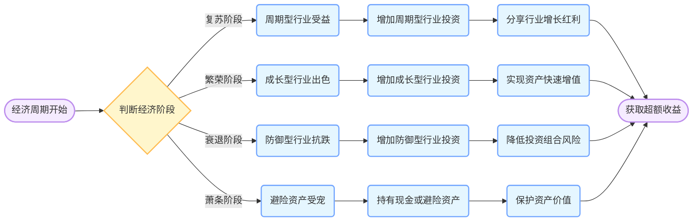

# 彼得·林奇的行业轮动投资策略

> 关键词：彼得·林奇、行业轮动、投资策略、股票投资、市场周期

> 摘要：本文深入探讨了彼得·林奇的行业轮动投资策略。彼得·林奇是投资界的传奇人物，他的投资理念和策略对全球投资者产生了深远影响。行业轮动投资策略作为其重要的投资方法之一，旨在根据不同行业在经济周期中的表现差异，动态调整投资组合，以获取超额收益。文章将详细介绍该策略的背景、核心概念、算法原理、数学模型，通过实际案例展示其应用，并分析其在不同市场环境下的适用性和局限性，最后探讨该策略的未来发展趋势与挑战。

## 1. 背景介绍 
### 1.1 目的和范围
本文的主要目的是全面解析彼得·林奇的行业轮动投资策略，帮助投资者深入理解该策略的原理、实施方法以及在实际投资中的应用。我们将探讨该策略的理论基础、核心算法、数学模型，并通过实际案例展示如何运用该策略进行投资决策。同时，我们还将分析该策略在不同市场环境下的表现和局限性，为投资者提供全面的参考。

### 1.2 预期读者
本文的预期读者包括对股票投资感兴趣的个人投资者、金融从业者、投资研究人员以及相关专业的学生。无论您是投资新手还是有一定经验的投资者，都可以从本文中获得关于彼得·林奇行业轮动投资策略的深入见解和实用建议。

### 1.3 文档结构概述
本文将按照以下结构进行组织：首先介绍彼得·林奇行业轮动投资策略的背景和相关概念；然后详细阐述该策略的核心算法原理和具体操作步骤，并用Python代码进行实现；接着介绍该策略的数学模型和公式，并通过具体例子进行说明；之后通过实际项目案例展示该策略的应用和效果；再分析该策略在不同市场环境下的实际应用场景；推荐相关的学习资源、开发工具和研究论文；最后总结该策略的未来发展趋势与挑战，并解答常见问题，提供扩展阅读和参考资料。

### 1.4 术语表
#### 1.4.1 核心术语定义
- **行业轮动**：指在经济周期的不同阶段，不同行业的表现会出现差异，投资者通过动态调整投资组合，将资金从表现不佳的行业转移到表现较好的行业，以获取超额收益的投资策略。
- **经济周期**：指经济活动沿着经济发展的总体趋势所经历的有规律的扩张和收缩。一般分为复苏、繁荣、衰退和萧条四个阶段。
- **投资组合**：指投资者将资金分散投资于不同的资产或行业，以降低风险并实现投资目标的一种投资方式。
- **超额收益**：指投资组合的实际收益超过市场基准收益的部分。

#### 1.4.2 相关概念解释
- **成长型行业**：指那些处于快速发展阶段，具有较高的增长率和创新能力的行业，如科技、生物医药等。
- **周期型行业**：指那些与经济周期密切相关，其业绩和股价会随着经济周期的波动而波动的行业，如钢铁、汽车、房地产等。
- **防御型行业**：指那些在经济衰退或市场动荡时期表现相对稳定的行业，如公用事业、食品饮料等。

#### 1.4.3 缩略词列表
- **GDP**：国内生产总值（Gross Domestic Product），是衡量一个国家或地区经济活动总量的重要指标。
- **PE**：市盈率（Price-to-Earnings Ratio），是指股票价格与每股收益的比率，用于衡量股票的估值水平。
- **ROE**：净资产收益率（Return on Equity），是指净利润与平均股东权益的百分比，反映了公司运用自有资本的效率。

## 2. 核心概念与联系 

### 核心概念原理
彼得·林奇的行业轮动投资策略基于经济周期理论。经济周期的不同阶段对不同行业的影响各不相同。在经济复苏阶段，消费者信心逐渐恢复，对耐用消费品的需求增加，因此汽车、房地产等周期型行业通常会率先受益；在经济繁荣阶段，企业盈利增长强劲，科技、金融等成长型行业往往表现出色；在经济衰退阶段，消费者减少开支，对必需品的需求相对稳定，公用事业、食品饮料等防御型行业则更具抗跌性；在经济萧条阶段，市场整体低迷，投资者更倾向于持有现金或避险资产。

投资者可以根据经济周期的变化，提前预判不同行业的表现，将资金从即将衰退的行业转移到即将兴起的行业，从而实现资产的增值。

### 架构的文本示意图
```plaintext
经济周期阶段 -> 行业表现差异 -> 投资组合调整 -> 超额收益获取
|               |                 |                 |
|               |                 |                 |
复苏阶段      周期型行业受益  增加周期型行业投资  分享行业增长红利
繁荣阶段      成长型行业出色  增加成长型行业投资  实现资产快速增值
衰退阶段      防御型行业抗跌  增加防御型行业投资  降低投资组合风险
萧条阶段      避险资产受宠  持有现金或避险资产  保护资产价值
```

### Mermaid 流程图


## 3. 核心算法原理 & 具体操作步骤 

### 核心算法原理
彼得·林奇的行业轮动投资策略的核心算法是基于对经济周期的判断和行业表现的分析。具体来说，算法的步骤如下：
1. **经济周期判断**：通过分析宏观经济指标，如GDP增长率、通货膨胀率、利率等，判断当前经济所处的阶段（复苏、繁荣、衰退、萧条）。
2. **行业表现分析**：研究不同行业在各个经济阶段的历史表现，确定每个阶段表现较好的行业。
3. **投资组合调整**：根据经济周期的判断和行业表现分析，调整投资组合中不同行业的权重。增加表现较好行业的投资比例，减少表现不佳行业的投资比例。

### 具体操作步骤
1. **数据收集**：收集宏观经济指标数据和行业相关数据，如行业指数、企业财务报表等。
2. **经济周期判断**：使用统计分析方法或机器学习模型，对宏观经济指标数据进行分析，判断当前经济所处的阶段。
3. **行业表现评估**：根据历史数据，计算每个行业在不同经济阶段的平均收益率、波动率等指标，评估行业的表现。
4. **投资组合调整**：根据经济周期判断和行业表现评估结果，调整投资组合中不同行业的权重。可以采用定期调整或动态调整的方式。
5. **风险控制**：设置止损点和止盈点，控制投资组合的风险。同时，定期对投资组合进行评估和调整，确保投资策略的有效性。

### Python源代码实现
```python
import pandas as pd
import numpy as np

# 模拟宏观经济指标数据
gdp_growth = [2.0, 3.5, 4.0, 1.5, -0.5]  # GDP增长率
inflation = [1.5, 2.0, 2.5, 1.0, 0.5]  # 通货膨胀率
interest_rate = [2.5, 3.0, 3.5, 2.0, 1.5]  # 利率

# 定义经济周期判断函数
def judge_economic_cycle(gdp_growth, inflation, interest_rate):
    if gdp_growth > 3 and inflation < 3 and interest_rate < 3:
        return '繁荣阶段'
    elif gdp_growth > 1 and inflation < 2 and interest_rate < 2:
        return '复苏阶段'
    elif gdp_growth < 1 and inflation < 1 and interest_rate < 1:
        return '衰退阶段'
    else:
        return '萧条阶段'

# 定义行业表现数据
industry_returns = {
    '周期型行业': [10, 20, 15, 5, -5],
    '成长型行业': [15, 25, 20, 10, -10],
    '防御型行业': [5, 8, 6, 3, 1]
}

# 定义投资组合调整函数
def adjust_portfolio(economic_cycle, industry_returns):
    if economic_cycle == '复苏阶段':
        portfolio = {'周期型行业': 0.6, '成长型行业': 0.3, '防御型行业': 0.1}
    elif economic_cycle == '繁荣阶段':
        portfolio = {'周期型行业': 0.3, '成长型行业': 0.6, '防御型行业': 0.1}
    elif economic_cycle == '衰退阶段':
        portfolio = {'周期型行业': 0.1, '成长型行业': 0.2, '防御型行业': 0.7}
    else:
        portfolio = {'周期型行业': 0.1, '成长型行业': 0.1, '防御型行业': 0.8}
    return portfolio

# 主程序
for i in range(len(gdp_growth)):
    cycle = judge_economic_cycle(gdp_growth[i], inflation[i], interest_rate[i])
    portfolio = adjust_portfolio(cycle, industry_returns)
    print(f'第 {i+1} 期，经济处于 {cycle}，投资组合调整为：{portfolio}')
```

### 代码解释
1. **数据收集**：使用列表模拟宏观经济指标数据（GDP增长率、通货膨胀率、利率）和行业表现数据（不同行业的收益率）。
2. **经济周期判断**：定义`judge_economic_cycle`函数，根据宏观经济指标判断当前经济所处的阶段。
3. **投资组合调整**：定义`adjust_portfolio`函数，根据经济周期判断结果调整投资组合中不同行业的权重。
4. **主程序**：遍历每个时期的宏观经济指标数据，判断经济周期，调整投资组合，并输出结果。

## 4. 数学模型和公式 & 详细讲解 & 举例说明 

### 数学模型和公式
#### 1. 行业收益率计算
行业收益率可以用以下公式计算：
$$R_i = \frac{P_{i,t} - P_{i,t-1}}{P_{i,t-1}}$$
其中，$R_i$ 表示第 $i$ 个行业在 $t$ 时期的收益率，$P_{i,t}$ 表示第 $i$ 个行业在 $t$ 时期的指数价格，$P_{i,t-1}$ 表示第 $i$ 个行业在 $t-1$ 时期的指数价格。

#### 2. 投资组合收益率计算
投资组合收益率可以用以下公式计算：
$$R_p = \sum_{i=1}^{n} w_i R_i$$
其中，$R_p$ 表示投资组合在 $t$ 时期的收益率，$w_i$ 表示第 $i$ 个行业在投资组合中的权重，$R_i$ 表示第 $i$ 个行业在 $t$ 时期的收益率，$n$ 表示投资组合中行业的数量。

#### 3. 风险评估指标
常用的风险评估指标包括标准差和夏普比率。
- 标准差：衡量投资组合收益率的波动程度，公式为：
$$\sigma_p = \sqrt{\sum_{i=1}^{n} w_i^2 \sigma_i^2 + 2 \sum_{1 \leq i < j \leq n} w_i w_j \rho_{ij} \sigma_i \sigma_j}$$
其中，$\sigma_p$ 表示投资组合的标准差，$\sigma_i$ 表示第 $i$ 个行业的标准差，$\rho_{ij}$ 表示第 $i$ 个行业和第 $j$ 个行业的相关系数。
- 夏普比率：衡量投资组合每承担一单位风险所获得的超额收益，公式为：
$$Sharpe Ratio = \frac{R_p - R_f}{\sigma_p}$$
其中，$R_p$ 表示投资组合的收益率，$R_f$ 表示无风险收益率，$\sigma_p$ 表示投资组合的标准差。

### 详细讲解
- **行业收益率计算**：行业收益率反映了该行业在一定时期内的表现。通过计算不同行业的收益率，可以比较不同行业的优劣，为投资决策提供参考。
- **投资组合收益率计算**：投资组合收益率是投资组合中各个行业收益率的加权平均值。通过合理调整投资组合中不同行业的权重，可以优化投资组合的收益率。
- **风险评估指标**：标准差和夏普比率是衡量投资组合风险和收益的重要指标。标准差越大，说明投资组合的收益率波动越大，风险越高；夏普比率越高，说明投资组合每承担一单位风险所获得的超额收益越高，投资组合的绩效越好。

### 举例说明
假设我们有一个投资组合，包含三个行业：周期型行业、成长型行业和防御型行业，它们的权重分别为 $w_1 = 0.4$，$w_2 = 0.3$，$w_3 = 0.3$。在某一时期，这三个行业的收益率分别为 $R_1 = 10\%$，$R_2 = 15\%$，$R_3 = 5\%$。无风险收益率 $R_f = 2\%$，三个行业的标准差分别为 $\sigma_1 = 0.2$，$\sigma_2 = 0.3$，$\sigma_3 = 0.1$，相关系数矩阵为：
$$
\begin{bmatrix}
1 & 0.5 & 0.2 \\
0.5 & 1 & 0.3 \\
0.2 & 0.3 & 1
\end{bmatrix}
$$

#### 1. 计算投资组合收益率
根据投资组合收益率公式，可得：
$$
\begin{align*}
R_p &= w_1 R_1 + w_2 R_2 + w_3 R_3 \\
&= 0.4 \times 0.1 + 0.3 \times 0.15 + 0.3 \times 0.05 \\
&= 0.04 + 0.045 + 0.015 \\
&= 0.1
\end{align*}
$$
即投资组合在该时期的收益率为 $10\%$。

#### 2. 计算投资组合标准差
根据投资组合标准差公式，可得：
$$
\begin{align*}
\sigma_p &= \sqrt{w_1^2 \sigma_1^2 + w_2^2 \sigma_2^2 + w_3^2 \sigma_3^2 + 2 w_1 w_2 \rho_{12} \sigma_1 \sigma_2 + 2 w_1 w_3 \rho_{13} \sigma_1 \sigma_3 + 2 w_2 w_3 \rho_{23} \sigma_2 \sigma_3} \\
&= \sqrt{0.4^2 \times 0.2^2 + 0.3^2 \times 0.3^2 + 0.3^2 \times 0.1^2 + 2 \times 0.4 \times 0.3 \times 0.5 \times 0.2 \times 0.3 + 2 \times 0.4 \times 0.3 \times 0.2 \times 0.2 \times 0.1 + 2 \times 0.3 \times 0.3 \times 0.3 \times 0.3 \times 0.1} \\
&\approx 0.16
\end{align*}
$$
即投资组合的标准差约为 $0.16$。

#### 3. 计算夏普比率
根据夏普比率公式，可得：
$$
\begin{align*}
Sharpe Ratio &= \frac{R_p - R_f}{\sigma_p} \\
&= \frac{0.1 - 0.02}{0.16} \\
&= 0.5
\end{align*}
$$
即投资组合的夏普比率为 $0.5$。

## 5. 项目实战：代码实际案例和详细解释说明 

### 5.1  开发环境搭建
#### 1. 安装Python
首先，确保你已经安装了Python。可以从Python官方网站（https://www.python.org/downloads/）下载适合你操作系统的Python版本，并按照安装向导进行安装。

#### 2. 安装必要的库
在命令行中使用以下命令安装必要的库：
```sh
pip install pandas numpy matplotlib yfinance
```
- `pandas`：用于数据处理和分析。
- `numpy`：用于数值计算。
- `matplotlib`：用于数据可视化。
- `yfinance`：用于获取股票和行业指数数据。

### 5.2  源代码详细实现和代码解读
```python
import yfinance as yf
import pandas as pd
import numpy as np
import matplotlib.pyplot as plt

# 定义行业指数代码
industry_tickers = {
    '周期型行业': '^DJUSCA',  # 道琼斯美国基础材料指数
    '成长型行业': '^NDX',  # 纳斯达克100指数
    '防御型行业': '^DJUSUT'  # 道琼斯美国公用事业指数
}

# 定义时间范围
start_date = '2010-01-01'
end_date = '2023-12-31'

# 获取行业指数数据
industry_data = {}
for industry, ticker in industry_tickers.items():
    data = yf.download(ticker, start=start_date, end=end_date)
    industry_data[industry] = data['Close']

# 计算行业收益率
industry_returns = {}
for industry, data in industry_data.items():
    returns = data.pct_change().dropna()
    industry_returns[industry] = returns

# 模拟经济周期
# 这里简单假设每3年为一个经济周期，依次为复苏、繁荣、衰退、萧条
economic_cycles = ['复苏阶段', '繁荣阶段', '衰退阶段', '萧条阶段']
cycle_length = 3 * 252  # 假设一年有252个交易日
num_cycles = len(industry_returns['周期型行业']) // cycle_length

# 定义投资组合调整函数
def adjust_portfolio(economic_cycle):
    if economic_cycle == '复苏阶段':
        portfolio = {'周期型行业': 0.6, '成长型行业': 0.3, '防御型行业': 0.1}
    elif economic_cycle == '繁荣阶段':
        portfolio = {'周期型行业': 0.3, '成长型行业': 0.6, '防御型行业': 0.1}
    elif economic_cycle == '衰退阶段':
        portfolio = {'周期型行业': 0.1, '成长型行业': 0.2, '防御型行业': 0.7}
    else:
        portfolio = {'周期型行业': 0.1, '成长型行业': 0.1, '防御型行业': 0.8}
    return portfolio

# 计算投资组合收益率
portfolio_returns = []
for i in range(num_cycles):
    start_index = i * cycle_length
    end_index = (i + 1) * cycle_length
    cycle = economic_cycles[i % len(economic_cycles)]
    portfolio = adjust_portfolio(cycle)
    cycle_returns = pd.DataFrame({
        industry: industry_returns[industry][start_index:end_index]
        for industry in portfolio.keys()
    })
    weighted_returns = cycle_returns.mul(pd.Series(portfolio), axis=1).sum(axis=1)
    portfolio_returns.extend(weighted_returns)

# 计算累计收益率
cumulative_returns = (1 + pd.Series(portfolio_returns)).cumprod()

# 绘制累计收益率曲线
plt.figure(figsize=(12, 6))
plt.plot(cumulative_returns)
plt.title('投资组合累计收益率')
plt.xlabel('交易日')
plt.ylabel('累计收益率')
plt.show()
```

### 5.3  代码解读与分析
1. **数据获取**：使用`yfinance`库获取周期型行业、成长型行业和防御型行业的指数数据。
2. **收益率计算**：计算每个行业的日收益率。
3. **经济周期模拟**：简单假设每3年为一个经济周期，依次为复苏、繁荣、衰退、萧条。
4. **投资组合调整**：根据经济周期调整投资组合中不同行业的权重。
5. **投资组合收益率计算**：计算每个经济周期内投资组合的收益率，并将其累加到总收益率中。
6. **累计收益率计算和可视化**：计算投资组合的累计收益率，并使用`matplotlib`库绘制累计收益率曲线。

通过分析累计收益率曲线，可以评估该投资策略的绩效。如果曲线呈上升趋势，说明该策略在一定程度上取得了较好的收益；如果曲线波动较大，说明该策略的风险较高。

## 6. 实际应用场景 
### 股票投资
在股票投资中，投资者可以运用彼得·林奇的行业轮动投资策略，根据经济周期的变化调整投资组合中不同行业股票的权重。例如，在经济复苏阶段，增加汽车、房地产等周期型行业股票的投资比例；在经济繁荣阶段，增加科技、金融等成长型行业股票的投资比例；在经济衰退阶段，增加公用事业、食品饮料等防御型行业股票的投资比例；在经济萧条阶段，适当减少股票投资，增加现金或债券等避险资产的持有比例。

### 基金投资
基金投资者可以根据行业轮动策略选择不同行业主题的基金进行投资。例如，在经济复苏阶段，选择投资于周期型行业的基金；在经济繁荣阶段，选择投资于成长型行业的基金；在经济衰退阶段，选择投资于防御型行业的基金。同时，投资者还可以通过定期调整基金组合，实现资产的优化配置。

### 资产配置
对于资产配置而言，行业轮动投资策略可以帮助投资者在不同资产类别（如股票、债券、现金等）和不同行业之间进行合理分配。通过根据经济周期调整资产配置比例，投资者可以降低投资组合的风险，提高投资组合的收益。例如，在经济复苏和繁荣阶段，增加股票资产的配置比例；在经济衰退和萧条阶段，增加债券和现金资产的配置比例。

## 7. 工具和资源推荐
### 7.1 学习资源推荐
#### 7.1.1 书籍推荐
- 《彼得·林奇的成功投资》（*One Up On Wall Street*）：彼得·林奇的经典著作，详细介绍了他的投资理念和方法，包括行业轮动投资策略。
- 《聪明的投资者》（*The Intelligent Investor*）：本杰明·格雷厄姆的经典投资著作，强调了价值投资和风险控制的重要性，对理解投资策略有很大帮助。
- 《漫步华尔街》（*A Random Walk Down Wall Street*）：伯顿·马尔基尔的经典著作，探讨了市场效率和投资策略，为投资者提供了全面的投资视角。

#### 7.1.2 在线课程
- Coursera上的“投资学原理”（*Principles of Investing*）课程：由知名教授授课，系统介绍了投资学的基本原理和方法。
- edX上的“金融市场”（*Financial Markets*）课程：耶鲁大学教授罗伯特·席勒主讲，深入探讨了金融市场的运作机制和投资策略。
- 中国大学MOOC上的“证券投资学”课程：国内高校教师授课，结合中国市场实际情况，介绍了证券投资的基本理论和实践方法。

#### 7.1.3 技术博客和网站
- Seeking Alpha（https://seekingalpha.com/）：提供股票分析、投资策略和市场评论等内容，是投资者获取投资信息的重要来源。
- Bloomberg（https://www.bloomberg.com/）：全球知名的财经媒体，提供实时金融市场数据、新闻和分析。
- 雪球（https://xueqiu.com/）：国内知名的投资社区，投资者可以在上面交流投资经验、分享投资观点。

### 7.2 开发工具框架推荐
#### 7.2.1 IDE和编辑器
- PyCharm：一款专业的Python集成开发环境，具有强大的代码编辑、调试和分析功能，适合开发Python投资分析程序。
- Jupyter Notebook：一种交互式笔记本，支持Python、R等多种编程语言，方便进行数据探索、分析和可视化。
- Visual Studio Code：一款轻量级的代码编辑器，支持多种编程语言和插件，可用于开发投资分析脚本。

#### 7.2.2 调试和性能分析工具
- PDB：Python自带的调试工具，可以帮助开发者调试Python代码，定位问题。
- cProfile：Python标准库中的性能分析工具，可以分析Python程序的性能瓶颈。
- Py-Spy：一款跨平台的Python性能分析工具，可以实时监测Python程序的性能。

#### 7.2.3 相关框架和库
- Pandas：用于数据处理和分析的Python库，提供了高效的数据结构和数据操作方法。
- Numpy：用于数值计算的Python库，提供了高效的数组操作和数学函数。
- Matplotlib：用于数据可视化的Python库，可绘制各种类型的图表。
- Scikit-learn：用于机器学习的Python库，提供了各种机器学习算法和工具。

### 7.3 相关论文著作推荐
#### 7.3.1 经典论文
- Fama, E. F., & French, K. R. (1992). The cross-section of expected stock returns. *Journal of Finance*, 47(2), 427-465. 该论文提出了著名的Fama-French三因子模型，对理解股票收益率的影响因素有重要意义。
- Sharpe, W. F. (1964). Capital asset prices: A theory of market equilibrium under conditions of risk. *Journal of Finance*, 19(3), 425-442. 该论文提出了资本资产定价模型（CAPM），是现代金融理论的重要基石。

#### 7.3.2 最新研究成果
- Asness, C. S., Moskowitz, T. J., & Pedersen, L. H. (2013). Value and momentum everywhere. *Journal of Finance*, 68(3), 929-985. 该论文研究了价值和动量策略在全球不同市场的有效性。
- Pastor, L., & Stambaugh, R. F. (2012). Investing for the long run when returns are predictable. *Journal of Financial Economics*, 104(1), 129-149. 该论文探讨了在收益率可预测的情况下，长期投资策略的优化问题。

#### 7.3.3 应用案例分析
- 许多金融研究机构和投资公司会发布行业轮动投资策略的应用案例分析报告，投资者可以通过查阅这些报告，了解该策略在实际应用中的效果和经验教训。例如，一些券商的研究报告、基金公司的定期报告等。

## 8. 总结：未来发展趋势与挑战
### 未来发展趋势
#### 1. 与量化投资结合
随着信息技术的发展和金融数据的丰富，行业轮动投资策略将越来越多地与量化投资相结合。通过运用大数据分析、机器学习和人工智能等技术，投资者可以更准确地判断经济周期和行业表现，优化投资组合的调整策略，提高投资决策的效率和准确性。

#### 2. 跨市场和跨资产类别应用
行业轮动投资策略将不再局限于股票市场，而是逐渐扩展到债券、期货、外汇等其他金融市场，以及房地产、大宗商品等其他资产类别。投资者可以通过跨市场和跨资产类别的行业轮动，实现更广泛的资产配置，降低投资组合的风险，提高收益的稳定性。

#### 3. 个性化和定制化服务
随着投资者需求的多样化，行业轮动投资策略将越来越注重个性化和定制化服务。投资机构可以根据投资者的风险偏好、投资目标和投资期限等因素，为投资者量身定制适合他们的行业轮动投资方案，满足不同投资者的个性化需求。

### 挑战
#### 1. 经济周期判断的准确性
准确判断经济周期是行业轮动投资策略成功的关键。然而，经济周期受到多种因素的影响，如宏观经济政策、国际政治形势、自然灾害等，其变化具有不确定性和复杂性。因此，如何提高经济周期判断的准确性，是行业轮动投资策略面临的一大挑战。

#### 2. 行业表现的不确定性
即使在同一经济周期阶段，不同行业的表现也可能存在差异。行业的发展受到技术创新、市场竞争、政策法规等多种因素的影响，其未来表现具有不确定性。因此，如何准确预测行业的表现，选择具有潜力的行业进行投资，是行业轮动投资策略面临的另一个挑战。

#### 3. 交易成本和市场流动性
频繁调整投资组合会产生较高的交易成本，如佣金、印花税等，从而降低投资收益。此外，一些行业的股票或资产可能存在市场流动性不足的问题，导致投资者在买卖时面临较大的冲击成本。因此，如何在控制交易成本和保证市场流动性的前提下，实施行业轮动投资策略，是投资者需要考虑的重要问题。

## 9. 附录：常见问题与解答
### 1. 行业轮动投资策略适合所有投资者吗？
行业轮动投资策略并不适合所有投资者。该策略需要投资者具备一定的宏观经济分析能力和行业研究能力，能够准确判断经济周期和行业表现。同时，该策略需要频繁调整投资组合，会产生较高的交易成本和风险。因此，对于缺乏专业知识和经验的投资者，或者风险承受能力较低的投资者，可能不适合采用该策略。

### 2. 如何判断经济周期的阶段？
判断经济周期的阶段可以从多个方面入手，如宏观经济指标、行业表现、市场情绪等。常用的宏观经济指标包括GDP增长率、通货膨胀率、利率、失业率等。一般来说，GDP增长率上升、通货膨胀率较低、利率下降时，经济处于复苏阶段；GDP增长率较高、通货膨胀率上升、利率上升时，经济处于繁荣阶段；GDP增长率下降、通货膨胀率下降、利率下降时，经济处于衰退阶段；GDP增长率为负、通货膨胀率极低、利率极低时，经济处于萧条阶段。此外，还可以通过观察行业表现和市场情绪来辅助判断经济周期的阶段。

### 3. 行业轮动投资策略的风险如何控制？
行业轮动投资策略的风险控制可以从以下几个方面入手：
- **分散投资**：将资金分散投资于不同行业和不同资产类别，降低单一行业或资产的风险。
- **设置止损点**：在投资组合中设置止损点，当投资组合的收益率下降到一定程度时，及时卖出部分或全部资产，避免损失进一步扩大。
- **定期评估和调整**：定期对投资组合进行评估和调整，根据经济周期和行业表现的变化，及时调整投资组合的权重，确保投资策略的有效性。
- **控制交易成本**：在调整投资组合时，尽量降低交易成本，避免频繁交易导致的成本过高。

### 4. 行业轮动投资策略与价值投资、成长投资有什么区别？
行业轮动投资策略、价值投资和成长投资是三种不同的投资策略，它们的区别主要体现在以下几个方面：
- **投资理念**：行业轮动投资策略基于经济周期理论，通过在不同经济周期阶段调整投资组合中不同行业的权重，获取超额收益；价值投资强调寻找被低估的股票，通过长期持有获取股票价值回归的收益；成长投资则注重寻找具有高成长潜力的公司，通过分享公司成长的收益实现资产增值。
- **投资期限**：行业轮动投资策略通常需要根据经济周期的变化频繁调整投资组合，投资期限相对较短；价值投资和成长投资更注重长期投资，投资期限一般较长。
- **风险特征**：行业轮动投资策略的风险主要来自于经济周期判断的准确性和行业表现的不确定性；价值投资的风险相对较低，但可能面临股票价值长期不回归的风险；成长投资的风险较高，因为高成长公司的未来发展具有不确定性。

## 10. 扩展阅读 & 参考资料
### 扩展阅读
- 《金融炼金术》（*The Alchemy of Finance*）：乔治·索罗斯的经典著作，探讨了金融市场的反身性原理和投资策略。
- 《黑天鹅》（*The Black Swan*）：纳西姆·尼古拉斯·塔勒布的著作，介绍了极端事件对金融市场的影响和应对策略。
- 《非理性繁荣》（*Irrational Exuberance*）：罗伯特·席勒的著作，分析了金融市场中的非理性行为和泡沫现象。

### 参考资料
- Fama, E. F., & French, K. R. (1992). The cross-section of expected stock returns. *Journal of Finance*, 47(2), 427-465.
- Sharpe, W. F. (1964). Capital asset prices: A theory of market equilibrium under conditions of risk. *Journal of Finance*, 19(3), 425-442.
- Asness, C. S., Moskowitz, T. J., & Pedersen, L. H. (2013). Value and momentum everywhere. *Journal of Finance*, 68(3), 929-985.
- Pastor, L., & Stambaugh, R. F. (2012). Investing for the long run when returns are predictable. *Journal of Financial Economics*, 104(1), 129-149.

作者：AI天才研究院/AI Genius Institute & 禅与计算机程序设计艺术 /Zen And The Art of Computer Programming