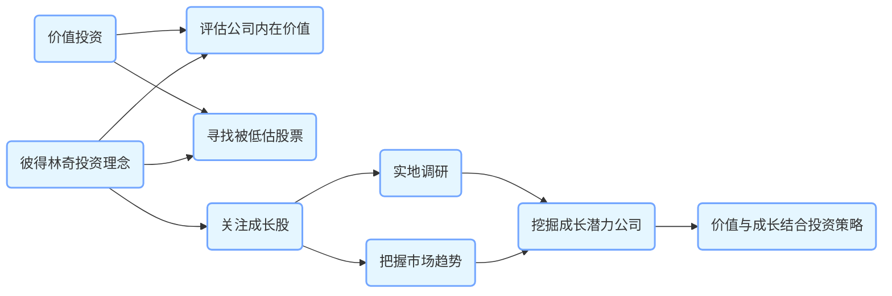

# 彼得林奇与价值投资的关系

> 关键词：彼得林奇、价值投资、成长股、投资策略、股票分析、市场波动、投资理念

> 摘要：本文深入探讨了彼得林奇与价值投资之间的紧密关系。彼得林奇作为投资界的传奇人物，其投资理念和实践对价值投资领域产生了深远影响。通过对彼得林奇投资策略、选股方法、对市场波动的应对等多方面的分析，揭示他如何在价值投资的基础上进行创新和拓展，为投资者提供了独特而有效的投资思路。同时，结合实际案例阐述其投资方法的应用，以及对价值投资理论发展的贡献，旨在帮助投资者更好地理解和运用价值投资，提升投资决策的能力。

## 1. 背景介绍 
### 1.1 目的和范围
本文的目的在于全面剖析彼得林奇与价值投资之间的关系，深入研究彼得林奇的投资理念、策略和方法如何与传统价值投资理论相互关联、相互影响。范围涵盖彼得林奇的投资生涯、其独特的选股标准、对不同行业和公司的分析方法，以及他在面对市场波动时的投资决策。同时，探讨他的投资实践对价值投资理论发展的推动作用，以及对当代投资者的启示。

### 1.2 预期读者
本文预期读者包括对投资领域感兴趣的初学者、有一定投资经验的投资者、金融专业的学生以及从事金融研究的学者。对于初学者，本文可以帮助他们了解价值投资的基本概念和彼得林奇的投资智慧；对于有经验的投资者，能够提供新的投资思路和方法；对于金融专业学生和学者，可作为研究价值投资理论和实践的参考资料。

### 1.3 文档结构概述
本文首先介绍彼得林奇的背景和价值投资的基本概念，为后续的分析奠定基础。接着阐述彼得林奇与价值投资的核心概念及它们之间的联系，包括彼得林奇的投资理念如何体现价值投资的精髓。然后详细讲解彼得林奇的核心投资算法原理和具体操作步骤，通过 Python 代码示例进行说明。再介绍相关的数学模型和公式，并结合实际例子进行讲解。之后通过项目实战，展示彼得林奇投资方法的实际应用和代码实现。随后探讨其投资方法在不同实际应用场景中的运用。接着推荐相关的学习资源、开发工具框架和论文著作。最后总结彼得林奇对价值投资的贡献、未来发展趋势与挑战，并提供常见问题解答和扩展阅读参考资料。

### 1.4 术语表
#### 1.4.1 核心术语定义
- **价值投资**：一种投资策略，基于对公司内在价值的评估，寻找被市场低估的股票进行投资，期望在股票价格回归其内在价值时获得收益。
- **成长股**：指那些销售额和利润额持续增长，且增长速度快于整个行业平均水平的股票。
- **内在价值**：公司在其剩余寿命中所能产生的现金流量的现值。
- **市盈率（P/E）**：股票价格与每股收益的比率，用于衡量股票的估值水平。
- **市净率（P/B）**：股票价格与每股净资产的比率，反映股票的估值和公司的资产质量。

#### 1.4.2 相关概念解释
- **彼得林奇的投资风格**：注重实地调研，通过对公司基本面的深入分析，挖掘具有成长潜力的股票，不拘泥于传统的价值投资标准，同时也关注市场趋势和行业动态。
- **安全边际**：价值投资中的重要概念，指股票的市场价格低于其内在价值的差额，为投资提供一定的缓冲空间，降低投资风险。

#### 1.4.3 缩略词列表
- **P/E**：市盈率（Price-to-Earnings Ratio）
- **P/B**：市净率（Price-to-Book Ratio）

## 2. 核心概念与联系 
### 2.1 彼得林奇的投资理念
彼得林奇是投资界的传奇人物，他在管理富达麦哲伦基金期间创造了惊人的业绩。他的投资理念强调从日常生活中发现投资机会，注重对公司基本面的研究和实地调研。他认为普通投资者可以通过观察身边的事物，如超市里的热销产品、新兴的消费趋势等，发现具有潜力的公司。

彼得林奇并不局限于传统的价值投资标准，他既关注公司的价值，也重视公司的成长潜力。他将成长股投资与价值投资相结合，寻找那些被市场忽视但具有高成长潜力的公司。例如，他会投资一些小型的、新兴的公司，这些公司可能在短期内不被市场看好，但具有独特的业务模式和发展前景。

### 2.2 价值投资的基本原理
价值投资的核心原理是寻找被市场低估的股票，通过对公司内在价值的评估，确定股票的合理价格。价值投资者认为，市场有时会出现错误定价，导致股票价格偏离其内在价值。投资者的任务就是发现这些被低估的股票，并在价格回归内在价值时获得收益。

价值投资的基本步骤包括：对公司的财务报表进行分析，评估公司的盈利能力、资产质量、现金流等；研究公司所处的行业环境和竞争地位；预测公司未来的发展前景和现金流量；根据这些分析确定公司的内在价值。

### 2.3 彼得林奇与价值投资的联系
彼得林奇的投资理念与价值投资有着密切的联系。他同样重视公司的基本面分析，通过对公司财务状况、业务模式、管理团队等方面的研究，评估公司的内在价值。例如，他会关注公司的净利润增长率、股息率等指标，以判断公司的盈利能力和投资价值。

同时，彼得林奇在价值投资的基础上进行了创新和拓展。他不仅关注公司的现有价值，还注重公司的成长潜力。他认为，成长是价值的重要组成部分，一些具有高成长潜力的公司即使当前的估值较高，但未来的收益可能会远远超过其成本。因此，他会投资一些成长型公司，通过分享公司的成长来获得超额收益。

### 2.4 核心概念原理和架构的文本示意图
彼得林奇的投资理念与价值投资的关系可以用以下示意图表示：

价值投资是基础，包括对公司内在价值的评估和寻找被低估的股票。彼得林奇在价值投资的基础上，增加了对成长股的关注，通过实地调研和对市场趋势的把握，挖掘具有成长潜力的公司。他的投资策略是价值与成长的结合，既追求股票的内在价值，又注重公司的未来发展。

### 2.5 Mermaid 流程图


## 3. 核心算法原理 & 具体操作步骤 
### 3.1 彼得林奇的选股标准
彼得林奇有一套独特的选股标准，主要包括以下几个方面：

- **公司业务简单易懂**：他认为普通投资者应该选择那些业务容易理解的公司，这样才能更好地评估公司的价值和发展前景。例如，像可口可乐这样的公司，其业务模式就是生产和销售饮料，容易被投资者理解。
- **具有持续的竞争优势**：公司应该在行业中具有一定的竞争优势，如品牌优势、技术优势、成本优势等。例如，苹果公司凭借其强大的品牌和创新技术，在智能手机市场占据领先地位。
- **低市盈率和低市净率**：彼得林奇会关注股票的市盈率和市净率，寻找那些估值较低的股票。一般来说，市盈率和市净率较低的股票可能被市场低估，具有投资价值。
- **高股息率**：他也会关注公司的股息率，高股息率的股票可以为投资者提供稳定的现金流。例如，一些公用事业公司通常会有较高的股息率。
- **高成长潜力**：彼得林奇非常重视公司的成长潜力，他会寻找那些销售额和利润持续增长的公司。例如，一些科技公司在发展初期可能会有较高的增长率。

### 3.2 具体操作步骤
#### 3.2.1 行业研究
首先，投资者需要对不同的行业进行研究，了解各个行业的发展趋势、竞争格局和市场规模。可以通过阅读行业报告、新闻资讯等方式获取相关信息。例如，研究新兴的科技行业，了解人工智能、新能源等领域的发展动态。

#### 3.2.2 筛选股票
根据彼得林奇的选股标准，从各个行业中筛选出符合条件的股票。可以使用金融数据平台，如 Bloomberg、Wind 等，获取股票的财务数据和估值指标，进行筛选。例如，筛选出市盈率低于行业平均水平、股息率较高的股票。

#### 3.2.3 公司调研
对筛选出的股票对应的公司进行深入调研。可以通过阅读公司的年报、季报，参加公司的股东大会，实地考察公司的生产经营情况等方式，了解公司的基本面和发展前景。例如，了解公司的产品研发情况、市场份额、管理团队的能力等。

#### 3.2.4 投资决策
根据调研结果，对股票进行评估，做出投资决策。如果公司的基本面良好，具有成长潜力，且估值合理，就可以考虑投资。同时，要注意分散投资，降低风险。

### 3.3 Python 源代码示例
以下是一个简单的 Python 代码示例，用于筛选符合彼得林奇选股标准的股票：

```python
import pandas as pd

# 假设我们有一个包含股票信息的 DataFrame
data = {
    '股票代码': ['000001', '000002', '000003'],
    '公司名称': ['公司 A', '公司 B', '公司 C'],
    '市盈率': [10, 20, 15],
    '市净率': [1.5, 2.0, 1.8],
    '股息率': [0.05, 0.03, 0.04],
    '净利润增长率': [0.2, 0.1, 0.15]
}

df = pd.DataFrame(data)

# 筛选条件
pe_threshold = 18  # 市盈率阈值
pb_threshold = 2.0  # 市净率阈值
dividend_yield_threshold = 0.03  # 股息率阈值
growth_rate_threshold = 0.1  # 净利润增长率阈值

# 筛选符合条件的股票
selected_stocks = df[(df['市盈率'] < pe_threshold) &
                     (df['市净率'] < pb_threshold) &
                     (df['股息率'] > dividend_yield_threshold) &
                     (df['净利润增长率'] > growth_rate_threshold)]

print(selected_stocks)
```

在这个代码示例中，我们首先创建了一个包含股票信息的 DataFrame，然后设置了选股的阈值条件，最后筛选出符合条件的股票并打印输出。

## 4. 数学模型和公式 & 详细讲解 & 举例说明 
### 4.1 市盈率（P/E）模型
市盈率是衡量股票估值的常用指标，其计算公式为：

$$P/E = \frac{股票价格}{每股收益}$$

其中，股票价格是当前股票的市场价格，每股收益是公司每股的净利润。市盈率反映了投资者为获得每股收益所愿意支付的价格。

例如，某公司的股票价格为 50 元，每股收益为 5 元，则该股票的市盈率为：

$$P/E = \frac{50}{5} = 10$$

一般来说，市盈率较低的股票可能被市场低估，具有投资价值。但需要注意的是，不同行业的市盈率水平可能存在差异，投资者需要结合行业特点进行分析。

### 4.2 市净率（P/B）模型
市净率是另一个重要的估值指标，其计算公式为：

$$P/B = \frac{股票价格}{每股净资产}$$

其中，每股净资产是公司每股的净资产值。市净率反映了股票价格与公司净资产的关系。

例如，某公司的股票价格为 30 元，每股净资产为 10 元，则该股票的市净率为：

$$P/B = \frac{30}{10} = 3$$

市净率较低的股票可能被市场低估，但同样需要考虑行业特点。一些重资产行业的市净率可能相对较低，而一些轻资产行业的市净率可能较高。

### 4.3 股息率模型
股息率是指公司股息与股票价格的比率，其计算公式为：

$$股息率 = \frac{每股股息}{股票价格} \times 100\%$$

其中，每股股息是公司每股派发的股息。股息率反映了投资者从股票中获得的股息收益。

例如，某公司的股票价格为 40 元，每股股息为 2 元，则该股票的股息率为：

$$股息率 = \frac{2}{40} \times 100\% = 5\%$$

高股息率的股票可以为投资者提供稳定的现金流，对于追求稳健收益的投资者具有吸引力。

### 4.4 举例说明
假设我们有两家公司 A 和 B，相关财务数据如下：

| 公司 | 股票价格（元） | 每股收益（元） | 每股净资产（元） | 每股股息（元） |
| ---- | ---- | ---- | ---- | ---- |
| A | 60 | 6 | 20 | 3 |
| B | 80 | 8 | 30 | 2 |

我们可以计算出两家公司的市盈率、市净率和股息率：

- **公司 A**：
  - 市盈率：$P/E_A = \frac{60}{6} = 10$
  - 市净率：$P/B_A = \frac{60}{20} = 3$
  - 股息率：$股息率_A = \frac{3}{60} \times 100\% = 5\%$

- **公司 B**：
  - 市盈率：$P/E_B = \frac{80}{8} = 10$
  - 市净率：$P/B_B = \frac{80}{30} \approx 2.67$
  - 股息率：$股息率_B = \frac{2}{80} \times 100\% = 2.5\%$

从这些数据可以看出，两家公司的市盈率相同，但公司 B 的市净率较低，而公司 A 的股息率较高。投资者可以根据自己的投资目标和风险偏好，选择更适合自己的股票。

## 5. 项目实战：代码实际案例和详细解释说明 
### 5.1  开发环境搭建
#### 5.1.1 安装 Python
首先，需要安装 Python 开发环境。可以从 Python 官方网站（https://www.python.org/downloads/） 下载适合自己操作系统的 Python 版本，并按照安装向导进行安装。

#### 5.1.2 安装必要的库
在项目中，我们需要使用一些 Python 库，如 Pandas、Numpy 等。可以使用以下命令进行安装：

```sh
pip install pandas numpy
```

### 5.2  源代码详细实现和代码解读
以下是一个更完整的 Python 代码示例，用于模拟彼得林奇的选股过程：

```python
import pandas as pd
import numpy as np

# 模拟获取股票数据
def get_stock_data():
    # 假设我们从数据库或 API 获取股票数据
    data = {
        '股票代码': ['000001', '000002', '000003', '000004', '000005'],
        '公司名称': ['公司 A', '公司 B', '公司 C', '公司 D', '公司 E'],
        '市盈率': [12, 25, 18, 10, 22],
        '市净率': [1.8, 2.2, 1.6, 1.4, 2.0],
        '股息率': [0.04, 0.02, 0.03, 0.05, 0.035],
        '净利润增长率': [0.15, 0.1, 0.2, 0.25, 0.12]
    }
    df = pd.DataFrame(data)
    return df

# 筛选符合条件的股票
def select_stocks(df):
    # 选股条件
    pe_threshold = 20  # 市盈率阈值
    pb_threshold = 2.0  # 市净率阈值
    dividend_yield_threshold = 0.03  # 股息率阈值
    growth_rate_threshold = 0.1  # 净利润增长率阈值

    selected_stocks = df[(df['市盈率'] < pe_threshold) &
                         (df['市净率'] < pb_threshold) &
                         (df['股息率'] > dividend_yield_threshold) &
                         (df['净利润增长率'] > growth_rate_threshold)]
    return selected_stocks

# 主函数
def main():
    # 获取股票数据
    stock_data = get_stock_data()
    print("原始股票数据：")
    print(stock_data)

    # 筛选股票
    selected_stocks = select_stocks(stock_data)
    print("\n筛选后的股票数据：")
    print(selected_stocks)

if __name__ == "__main__":
    main