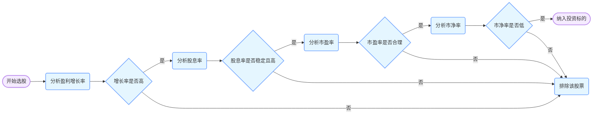

# 彼得林奇四大选股指标详解

> 关键词：彼得林奇、选股指标、盈利增长率、股息率、市盈率、市净率

> 摘要：本文深入剖析彼得林奇提出的四大选股指标，详细阐述这些指标的核心概念、算法原理、数学模型，通过项目实战案例展示如何运用这些指标进行选股操作，探讨其在实际应用场景中的作用，同时推荐相关的学习资源、开发工具和研究论文，最后总结该领域的未来发展趋势与挑战，并解答常见问题。彼得林奇的选股指标为投资者提供了一套科学、实用的选股方法，有助于投资者在复杂的股票市场中筛选出具有潜力的投资标的。

## 1. 背景介绍 
### 1.1 目的和范围
本文的目的是深入、全面地解读彼得林奇的四大选股指标，使投资者能够理解这些指标的原理、计算方法和应用场景，从而在股票投资中运用这些指标筛选出更具潜力的股票。范围涵盖四大选股指标的核心概念、算法原理、数学模型、实际案例分析以及在不同市场环境下的应用。

### 1.2 预期读者
本文预期读者包括对股票投资感兴趣的初学者、有一定投资经验但希望提升选股能力的投资者、金融专业的学生以及从事投资研究的专业人士。

### 1.3 文档结构概述
本文首先介绍背景信息，包括目的、预期读者和文档结构。接着详细阐述四大选股指标的核心概念与联系，通过文本示意图和Mermaid流程图展示其架构。然后讲解核心算法原理和具体操作步骤，使用Python源代码进行详细阐述。随后介绍数学模型和公式，并举例说明。通过项目实战展示代码实际案例和详细解释。探讨实际应用场景，推荐相关的工具和资源。最后总结未来发展趋势与挑战，解答常见问题并提供扩展阅读和参考资料。

### 1.4 术语表
#### 1.4.1 核心术语定义
- **盈利增长率**：指公司在一定时期内盈利增长的比例，反映公司的盈利增长速度。
- **股息率**：股息与股票价格之间的比率，是衡量股票投资收益的一个重要指标。
- **市盈率**：股票价格除以每股收益的比率，反映市场对公司未来盈利的预期。
- **市净率**：股票价格与每股净资产的比率，用于评估股票的投资价值。

#### 1.4.2 相关概念解释
- **每股收益**：公司净利润除以发行在外的普通股股数，反映每股股票的盈利水平。
- **每股净资产**：公司净资产除以发行在外的普通股股数，反映每股股票所代表的实际资产价值。

#### 1.4.3 缩略词列表
- **EPS**：Earnings Per Share，每股收益
- **BVPS**：Book Value Per Share，每股净资产

## 2. 核心概念与联系 
彼得林奇的四大选股指标分别是盈利增长率、股息率、市盈率和市净率。这些指标从不同角度反映了公司的财务状况和市场表现，相互关联又相互补充。

### 核心概念原理
- **盈利增长率**：盈利增长率是衡量公司盈利能力和发展潜力的重要指标。较高的盈利增长率意味着公司的业务在不断扩张，未来可能带来更高的收益。计算公式为：
$$盈利增长率 = \frac{本期盈利 - 上期盈利}{上期盈利} \times 100\%$$
- **股息率**：股息率反映了公司对股东的回报水平。稳定且较高的股息率表明公司有良好的现金流和盈利能力，同时也体现了公司对股东的重视。计算公式为：
$$股息率 = \frac{每股股息}{股票价格} \times 100\%$$
- **市盈率**：市盈率是市场对公司未来盈利预期的体现。较低的市盈率可能意味着股票被低估，具有投资价值；而较高的市盈率则可能表示市场对公司未来盈利有较高的期望，但也可能存在泡沫。计算公式为：
$$市盈率 = \frac{股票价格}{每股收益}$$
- **市净率**：市净率反映了股票价格与每股净资产的关系。较低的市净率可能表示股票被低估，具有一定的安全边际；而较高的市净率则可能表示市场对公司的资产质量和未来发展前景有较高的评价。计算公式为：
$$市净率 = \frac{股票价格}{每股净资产}$$

### 架构的文本示意图
```plaintext
选股指标体系
|-- 盈利增长率
|   |-- 反映公司盈利增长速度
|   |-- 与公司发展潜力相关
|-- 股息率
|   |-- 体现公司对股东的回报
|   |-- 与公司现金流和盈利能力有关
|-- 市盈率
|   |-- 反映市场对公司未来盈利的预期
|   |-- 用于评估股票的估值水平
|-- 市净率
|   |-- 衡量股票价格与每股净资产的关系
|   |-- 评估股票的投资价值和安全边际
```

### Mermaid流程图


## 3. 核心算法原理 & 具体操作步骤 
### 盈利增长率计算
```python
def calculate_earnings_growth_rate(previous_earnings, current_earnings):
    """
    计算盈利增长率
    :param previous_earnings: 上期盈利
    :param current_earnings: 本期盈利
    :return: 盈利增长率
    """
    return ((current_earnings - previous_earnings) / previous_earnings) * 100

# 示例
previous_earnings = 1000000
current_earnings = 1200000
growth_rate = calculate_earnings_growth_rate(previous_earnings, current_earnings)
print(f"盈利增长率: {growth_rate}%")
```
### 股息率计算
```python
def calculate_dividend_yield(dividend_per_share, stock_price):
    """
    计算股息率
    :param dividend_per_share: 每股股息
    :param stock_price: 股票价格
    :return: 股息率
    """
    return (dividend_per_share / stock_price) * 100

# 示例
dividend_per_share = 2
stock_price = 50
dividend_yield = calculate_dividend_yield(dividend_per_share, stock_price)
print(f"股息率: {dividend_yield}%")
```
### 市盈率计算
```python
def calculate_price_earnings_ratio(stock_price, earnings_per_share):
    """
    计算市盈率
    :param stock_price: 股票价格
    :param earnings_per_share: 每股收益
    :return: 市盈率
    """
    return stock_price / earnings_per_share

# 示例
stock_price = 60
earnings_per_share = 3
pe_ratio = calculate_price_earnings_ratio(stock_price, earnings_per_share)
print(f"市盈率: {pe_ratio}")
```
### 市净率计算
```python
def calculate_price_to_book_ratio(stock_price, book_value_per_share):
    """
    计算市净率
    :param stock_price: 股票价格
    :param book_value_per_share: 每股净资产
    :return: 市净率
    """
    return stock_price / book_value_per_share

# 示例
stock_price = 80
book_value_per_share = 20
pb_ratio = calculate_price_to_book_ratio(stock_price, book_value_per_share)
print(f"市净率: {pb_ratio}")
```

### 具体操作步骤
1. **收集数据**：收集公司的财务报表，获取上期盈利、本期盈利、每股股息、股票价格、每股收益和每股净资产等数据。
2. **计算指标**：使用上述Python函数分别计算盈利增长率、股息率、市盈率和市净率。
3. **分析指标**：根据计算结果，分析公司的盈利增长情况、股息回报水平、估值水平和投资价值。
4. **筛选股票**：根据指标分析结果，筛选出符合投资标准的股票。

## 4. 数学模型和公式 & 详细讲解 & 举例说明 
### 盈利增长率
#### 数学模型和公式
$$盈利增长率 = \frac{本期盈利 - 上期盈利}{上期盈利} \times 100\%$$

#### 详细讲解
盈利增长率反映了公司盈利的增长速度，是衡量公司发展潜力的重要指标。较高的盈利增长率意味着公司的业务在不断扩张，市场份额在增加，未来可能带来更高的收益。投资者通常更倾向于投资盈利增长率较高的公司。

#### 举例说明
假设公司A去年的盈利为1000万元，今年的盈利为1200万元。则公司A的盈利增长率为：
$$盈利增长率 = \frac{1200 - 1000}{1000} \times 100\% = 20\%$$
这表明公司A的盈利在过去一年中增长了20%，具有较好的发展态势。

### 股息率
#### 数学模型和公式
$$股息率 = \frac{每股股息}{股票价格} \times 100\%$$

#### 详细讲解
股息率反映了公司对股东的回报水平。稳定且较高的股息率表明公司有良好的现金流和盈利能力，同时也体现了公司对股东的重视。股息率可以作为投资者选择股票的一个重要参考指标，特别是对于追求稳定收益的投资者来说。

#### 举例说明
假设股票B的每股股息为1元，当前股票价格为20元。则股票B的股息率为：
$$股息率 = \frac{1}{20} \times 100\% = 5\%$$
这意味着投资者持有股票B，每年可以获得5%的股息收益。

### 市盈率
#### 数学模型和公式
$$市盈率 = \frac{股票价格}{每股收益}$$

#### 详细讲解
市盈率是市场对公司未来盈利预期的体现。较低的市盈率可能意味着股票被低估，具有投资价值；而较高的市盈率则可能表示市场对公司未来盈利有较高的期望，但也可能存在泡沫。市盈率的高低需要结合公司的行业特点、盈利增长情况等因素进行综合分析。

#### 举例说明
假设股票C的当前价格为30元，每股收益为2元。则股票C的市盈率为：
$$市盈率 = \frac{30}{2} = 15$$
这表明市场愿意为股票C的每股收益支付15倍的价格。

### 市净率
#### 数学模型和公式
$$市净率 = \frac{股票价格}{每股净资产}$$

#### 详细讲解
市净率反映了股票价格与每股净资产的关系。较低的市净率可能表示股票被低估，具有一定的安全边际；而较高的市净率则可能表示市场对公司的资产质量和未来发展前景有较高的评价。市净率可以用于评估股票的投资价值和风险。

#### 举例说明
假设股票D的当前价格为40元，每股净资产为10元。则股票D的市净率为：
$$市净率 = \frac{40}{10} = 4$$
这意味着股票D的价格是其每股净资产的4倍。

## 5. 项目实战：代码实际案例和详细解释说明 
### 5.1  开发环境搭建
- **Python环境**：建议使用Python 3.7及以上版本。可以从Python官方网站（https://www.python.org/downloads/）下载并安装。
- **开发工具**：推荐使用PyCharm作为开发工具，它具有强大的代码编辑、调试和项目管理功能。可以从JetBrains官方网站（https://www.jetbrains.com/pycharm/download/）下载并安装。
- **必要的库**：需要安装`pandas`和`numpy`库，用于数据处理和分析。可以使用以下命令进行安装：
```sh
pip install pandas numpy
```

### 5.2  源代码详细实现和代码解读
```python
import pandas as pd
import numpy as np

# 定义数据
data = {
    '股票代码': ['000001', '000002', '000003', '000004', '000005'],
    '上期盈利': [1000, 1200, 800, 1500, 900],
    '本期盈利': [1200, 1300, 900, 1600, 1000],
    '每股股息': [1, 1.2, 0.8, 1.5, 1],
    '股票价格': [20, 25, 18, 30, 22],
    '每股收益': [2, 2.5, 1.8, 3, 2.2],
    '每股净资产': [10, 12, 9, 15, 11]
}

# 创建DataFrame
df = pd.DataFrame(data)

# 计算盈利增长率
df['盈利增长率'] = ((df['本期盈利'] - df['上期盈利']) / df['上期盈利']) * 100

# 计算股息率
df['股息率'] = (df['每股股息'] / df['股票价格']) * 100

# 计算市盈率
df['市盈率'] = df['股票价格'] / df['每股收益']

# 计算市净率
df['市净率'] = df['股票价格'] / df['每股净资产']

# 筛选符合条件的股票
selected_stocks = df[(df['盈利增长率'] > 10) & (df['股息率'] > 3) & (df['市盈率'] < 20) & (df['市净率'] < 2)]

print(selected_stocks)
```

### 代码解读与分析
1. **数据定义**：使用字典`data`定义了包含股票代码、上期盈利、本期盈利、每股股息、股票价格、每股收益和每股净资产等信息的数据。
2. **创建DataFrame**：使用`pandas`库的`DataFrame`函数将字典数据转换为DataFrame对象，方便进行数据处理和分析。
3. **指标计算**：使用DataFrame的列操作分别计算盈利增长率、股息率、市盈率和市净率，并将结果添加到DataFrame中。
4. **股票筛选**：根据设定的条件（盈利增长率大于10%、股息率大于3%、市盈率小于20、市净率小于2）筛选出符合条件的股票。
5. **结果输出**：打印筛选出的股票信息。

通过这个项目实战，我们可以看到如何使用Python和`pandas`库来计算彼得林奇的四大选股指标，并根据这些指标筛选出符合投资标准的股票。

## 6. 实际应用场景 
### 价值投资
在价值投资中，彼得林奇的四大选股指标可以帮助投资者筛选出被低估的股票。通过分析盈利增长率、股息率、市盈率和市净率，投资者可以找到那些具有良好盈利能力、稳定股息回报、低估值的股票，从而进行长期投资。

### 成长投资
对于成长型投资者来说，盈利增长率是一个关键指标。他们更关注公司的未来发展潜力，愿意投资那些盈利增长率较高的公司。同时，股息率、市盈率和市净率也可以作为辅助指标，帮助投资者评估公司的估值水平和投资风险。

### 资产配置
在进行资产配置时，投资者可以使用彼得林奇的选股指标来选择不同类型的股票，以实现资产的多元化。例如，选择一些盈利稳定、股息率高的蓝筹股作为稳健的投资标的，同时选择一些盈利增长率较高的成长股来获取更高的收益。

### 行业分析
在分析不同行业的股票时，彼得林奇的选股指标可以帮助投资者比较不同行业的公司的盈利能力、估值水平和投资价值。例如，某些行业的市盈率普遍较高，而某些行业的市净率较低，通过分析这些指标，投资者可以选择更具投资潜力的行业和公司。

## 7. 工具和资源推荐
### 7.1 学习资源推荐
#### 7.1.1 书籍推荐
- 《彼得·林奇的成功投资》：彼得·林奇亲自撰写的投资经典著作，详细介绍了他的投资理念和选股方法。
- 《战胜华尔街》：进一步阐述了彼得·林奇的投资策略和实践经验，对投资者有很大的启发。
- 《聪明的投资者》：本杰明·格雷厄姆的经典著作，介绍了价值投资的基本原理和方法，与彼得林奇的选股指标有一定的关联。

#### 7.1.2 在线课程
- Coursera上的“投资学原理”：由知名大学教授授课，系统介绍投资学的基本概念和方法，包括选股指标的应用。
- 网易云课堂上的“股票投资实战课程”：结合实际案例，讲解股票投资的技巧和策略，对理解彼得林奇的选股指标有帮助。

#### 7.1.3 技术博客和网站
- 雪球网：国内知名的投资社区，有大量的投资者分享自己的投资经验和选股方法，可以学习到关于彼得林奇选股指标的实际应用案例。
- 东方财富网：提供丰富的股票数据和财经资讯，方便投资者获取计算选股指标所需的数据。

### 7.2 开发工具框架推荐
#### 7.2.1 IDE和编辑器
- PyCharm：功能强大的Python集成开发环境，适合进行数据分析和算法实现。
- Jupyter Notebook：交互式的开发环境，方便进行代码编写、数据可视化和结果展示。

#### 7.2.2 调试和性能分析工具
- Py-Spy：用于分析Python程序的性能瓶颈，帮助优化代码。
- PDB：Python自带的调试工具，可以帮助开发者定位和解决代码中的问题。

#### 7.2.3 相关框架和库
- Pandas：用于数据处理和分析的强大库，提供了丰富的数据结构和函数，方便进行选股指标的计算。
- Numpy：用于科学计算的基础库，提供了高效的数组操作和数学函数。

### 7.3 相关论文著作推荐
#### 7.3.1 经典论文
- “The Cross - Section of Expected Stock Returns”：Fama和French提出的三因子模型，对股票收益率的影响因素进行了深入研究，与选股指标有一定的关联。
- “Earnings, Book Values, and Dividends in Equity Valuation”：研究了盈利、账面价值和股息在股票估值中的作用，为选股指标的应用提供了理论基础。

#### 7.3.2 最新研究成果
- 近年来，有许多关于量化投资和选股策略的研究成果，如机器学习在选股中的应用等。可以通过学术数据库（如IEEE Xplore、ACM Digital Library等）搜索相关论文。

#### 7.3.3 应用案例分析
- 一些金融研究机构和投资公司会发布关于选股指标应用的案例分析报告，可以关注这些报告，学习实际应用中的经验和技巧。

## 8. 总结：未来发展趋势与挑战
### 未来发展趋势
- **量化投资的普及**：随着信息技术的发展和数据的丰富，量化投资将越来越普及。彼得林奇的选股指标可以与量化投资相结合，通过建立量化模型，实现更科学、更高效的选股。
- **多指标融合**：单一的选股指标可能存在局限性，未来可能会将彼得林奇的四大选股指标与其他指标（如技术指标、宏观经济指标等）进行融合，以提高选股的准确性和可靠性。
- **人工智能的应用**：人工智能技术（如机器学习、深度学习）在投资领域的应用将越来越广泛。可以利用人工智能算法对选股指标进行优化和改进，挖掘更有价值的投资信息。

### 挑战
- **数据质量和可靠性**：选股指标的计算依赖于准确、可靠的财务数据。然而，财务数据可能存在造假、误差等问题，影响选股指标的准确性。
- **市场环境变化**：市场环境是不断变化的，不同的市场环境下，选股指标的有效性可能会发生变化。投资者需要根据市场环境的变化及时调整选股策略。
- **竞争加剧**：随着投资市场的发展，越来越多的投资者开始使用选股指标进行投资，竞争将加剧。投资者需要不断提高自己的选股能力和投资水平，才能在市场中获得优势。

## 9. 附录：常见问题与解答
### 问题1：盈利增长率越高越好吗？
盈利增长率高通常意味着公司的业务在快速发展，但并不一定意味着股票就具有投资价值。过高的盈利增长率可能是由于短期因素（如一次性收入、会计调整等）导致的，不具有可持续性。此外，高盈利增长率的公司往往伴随着较高的估值，投资者需要综合考虑其他因素（如市盈率、市净率等）来评估股票的投资价值。

### 问题2：股息率稳定就一定好吗？
股息率稳定是一个积极的信号，表明公司有稳定的现金流和盈利能力。但股息率并不是唯一的投资指标，还需要考虑公司的盈利增长情况、估值水平等因素。有些公司可能为了维持高股息率而牺牲了未来的发展，导致盈利增长缓慢。因此，投资者需要综合分析，选择那些既具有稳定股息率又有良好发展前景的公司。

### 问题3：市盈率和市净率的合理范围是多少？
市盈率和市净率的合理范围因行业、公司发展阶段等因素而异。一般来说，传统行业的市盈率和市净率相对较低，而新兴行业的市盈率和市净率可能较高。投资者可以通过比较同行业公司的市盈率和市净率，以及分析公司的历史数据，来判断当前的市盈率和市净率是否合理。

### 问题4：如何获取计算选股指标所需的数据？
可以通过金融数据提供商（如东方财富网、同花顺等）获取公司的财务报表和股票价格等数据。也可以使用Python的金融数据接口库（如`pandas-datareader`）从网络上获取数据。

## 10. 扩展阅读 & 参考资料
### 扩展阅读
- 《金融炼金术》：乔治·索罗斯的著作，介绍了他的投资哲学和方法，对投资者的思维方式有很大的启发。
- 《非理性繁荣》：罗伯特·席勒的著作，探讨了金融市场中的非理性行为和泡沫现象，帮助投资者更好地理解市场。

### 参考资料
- 《彼得·林奇的成功投资》，彼得·林奇著
- 《战胜华尔街》，彼得·林奇著
- 《聪明的投资者》，本杰明·格雷厄姆著
- “The Cross - Section of Expected Stock Returns”，Eugene F. Fama, Kenneth R. French
- “Earnings, Book Values, and Dividends in Equity Valuation”，James A. Ohlson

作者：AI天才研究院/AI Genius Institute & 禅与计算机程序设计艺术 /Zen And The Art of Computer Programming