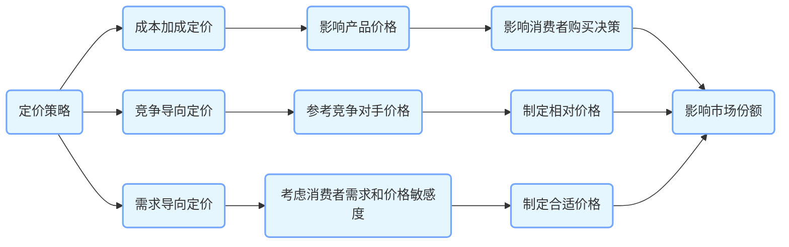

# 彼得林奇如何分析公司的定价策略对市场份额的影响

> 关键词：彼得林奇、定价策略、市场份额、公司分析、竞争优势

> 摘要：本文深入探讨了投资大师彼得林奇分析公司定价策略对市场份额影响的方法。首先介绍了相关背景知识，包括目的范围、预期读者等内容。接着阐述核心概念，通过文本示意图和Mermaid流程图展示定价策略与市场份额之间的联系。详细讲解核心算法原理，用Python代码进行呈现，并给出数学模型和公式。结合实际案例，展示如何运用这些方法进行分析。最后介绍了实际应用场景、推荐了相关工具和资源，总结未来发展趋势与挑战，解答常见问题并提供扩展阅读和参考资料，旨在帮助读者掌握彼得林奇的分析思路，更好地评估公司定价策略对市场份额的作用。

## 1. 背景介绍 
### 1.1 目的和范围
彼得林奇是投资领域的传奇人物，他的投资理念和分析方法对投资者具有重要的指导意义。本文章的目的是深入剖析彼得林奇分析公司定价策略对市场份额影响的具体方法，帮助投资者更好地理解公司的市场竞争态势。范围涵盖了定价策略的各种类型、市场份额的衡量方式以及两者之间的相互关系，同时结合实际案例进行详细讲解。

### 1.2 预期读者
本文的预期读者主要包括对投资分析感兴趣的个人投资者、金融专业学生、投资机构的研究人员以及企业管理人员。对于希望提升自身投资分析能力、了解市场竞争规律的人士都具有一定的参考价值。

### 1.3 文档结构概述
本文将按照以下结构展开：首先介绍核心概念，明确定价策略和市场份额的定义及相互联系；接着阐述核心算法原理和具体操作步骤，通过Python代码进行详细说明；然后给出数学模型和公式，并举例说明；再通过实际项目案例展示如何运用这些方法进行分析；之后介绍实际应用场景和推荐相关工具和资源；最后总结未来发展趋势与挑战，解答常见问题并提供扩展阅读和参考资料。

### 1.4 术语表
#### 1.4.1 核心术语定义
- **定价策略**：公司为了实现一定的营销目标，在对成本、市场需求、竞争状况等因素进行综合考虑后，对产品或服务价格进行制定和调整的方式。常见的定价策略包括成本加成定价、竞争导向定价、需求导向定价等。
- **市场份额**：指一个企业的销售量（或销售额）在市场同类产品中所占的比重，反映了企业在市场中的竞争地位和影响力。

#### 1.4.2 相关概念解释
- **成本加成定价**：在产品成本的基础上，加上一定比例的利润来确定产品价格的方法。这种方法简单直接，但可能没有充分考虑市场需求和竞争状况。
- **竞争导向定价**：根据竞争对手的价格来制定自己产品的价格。企业可以选择与竞争对手价格相同、略高或略低的定价策略，以获取竞争优势。
- **需求导向定价**：根据消费者对产品的需求程度和价格敏感度来制定价格。例如，对于需求弹性较小的产品，可以适当提高价格；对于需求弹性较大的产品，则需要降低价格以吸引更多消费者。

#### 1.4.3 缩略词列表
本文中未使用缩略词。

## 2. 核心概念与联系 
### 核心概念原理
定价策略与市场份额之间存在着密切的联系。合理的定价策略可以帮助公司吸引更多的消费者，从而提高市场份额；而市场份额的变化又会反过来影响公司的定价策略。例如，当公司的市场份额较低时，可能会采取低价策略来吸引消费者，扩大市场份额；当公司的市场份额较高时，可以适当提高价格，以获取更高的利润。

### 文本示意图
```plaintext
定价策略
    ├── 成本加成定价
    │       └── 影响产品价格
    │               └── 影响消费者购买决策
    │                       └── 影响市场份额
    ├── 竞争导向定价
    │       └── 参考竞争对手价格
    │               └── 制定相对价格
    │                       └── 影响市场份额
    └── 需求导向定价
            └── 考虑消费者需求和价格敏感度
                    └── 制定合适价格
                            └── 影响市场份额
```

### Mermaid流程图


## 3. 核心算法原理 & 具体操作步骤 
### 核心算法原理
为了分析定价策略对市场份额的影响，我们可以建立一个简单的模型。假设市场上有多个公司竞争，每个公司的市场份额可以通过其销售额占总市场销售额的比例来计算。公司的销售额可以通过产品价格和销售量的乘积得到。我们可以通过模拟不同的定价策略下公司的销售量变化，进而计算市场份额的变化。

### 具体操作步骤
1. 确定市场上的公司数量和初始市场份额。
2. 设定每个公司的产品价格和成本。
3. 根据定价策略和市场需求函数，计算每个公司的销售量。
4. 计算每个公司的销售额和市场份额。
5. 改变定价策略，重复步骤3和4，观察市场份额的变化。

### Python源代码详细阐述
```python
import numpy as np

# 市场上的公司数量
num_companies = 3

# 初始市场份额
initial_market_shares = np.array([0.3, 0.3, 0.4])

# 每个公司的产品价格
prices = np.array([10, 12, 8])

# 每个公司的成本
costs = np.array([5, 6, 4])

# 市场总需求函数（简单示例：线性需求函数）
def market_demand(price):
    return 100 - 5 * price

# 计算每个公司的销售量
def calculate_quantities(prices):
    quantities = []
    for price in prices:
        quantities.append(market_demand(price))
    return np.array(quantities)

# 计算每个公司的销售额
def calculate_sales(prices, quantities):
    return prices * quantities

# 计算市场份额
def calculate_market_shares(sales):
    total_sales = np.sum(sales)
    return sales / total_sales

# 初始销售量
initial_quantities = calculate_quantities(prices)

# 初始销售额
initial_sales = calculate_sales(prices, initial_quantities)

# 初始市场份额验证
initial_market_shares_calculated = calculate_market_shares(initial_sales)
print("初始市场份额（计算值）:", initial_market_shares_calculated)

# 改变定价策略（假设公司2提高价格）
new_prices = np.array([10, 15, 8])

# 新的销售量
new_quantities = calculate_quantities(new_prices)

# 新的销售额
new_sales = calculate_sales(new_prices, new_quantities)

# 新的市场份额
new_market_shares = calculate_market_shares(new_sales)
print("新的市场份额:", new_market_shares)
```
在上述代码中，我们首先定义了市场上的公司数量、初始市场份额、产品价格和成本。然后，我们定义了市场需求函数、计算销售量、销售额和市场份额的函数。通过模拟不同的定价策略，我们可以观察到市场份额的变化。

## 4. 数学模型和公式 & 详细讲解 & 举例说明 
### 数学模型和公式
- **市场需求函数**：假设市场需求函数为线性函数 $Q = a - bP$，其中 $Q$ 表示市场需求量，$P$ 表示产品价格，$a$ 和 $b$ 是常数。
- **公司销售额**：公司的销售额 $S$ 可以通过产品价格 $P$ 和销售量 $Q$ 的乘积得到，即 $S = P \times Q$。
- **市场份额**：公司的市场份额 $MS$ 可以通过其销售额 $S$ 占总市场销售额 $S_{total}$ 的比例来计算，即 $MS = \frac{S}{S_{total}}$。

### 详细讲解
市场需求函数描述了市场上消费者对产品的需求与价格之间的关系。一般来说，价格越高，需求量越低；价格越低，需求量越高。公司的销售额取决于产品价格和销售量，定价策略的不同会直接影响销售量，从而影响销售额。市场份额反映了公司在市场中的竞争地位，通过比较不同公司的市场份额，可以评估定价策略的有效性。

### 举例说明
假设市场需求函数为 $Q = 100 - 5P$，市场上有两家公司，公司A的产品价格为 $P_A = 10$，公司B的产品价格为 $P_B = 12$。
- 公司A的销售量 $Q_A = 100 - 5 \times 10 = 50$。
- 公司A的销售额 $S_A = P_A \times Q_A = 10 \times 50 = 500$。
- 公司B的销售量 $Q_B = 100 - 5 \times 12 = 40$。
- 公司B的销售额 $S_B = P_B \times Q_B = 12 \times 40 = 480$。
- 总市场销售额 $S_{total} = S_A + S_B = 500 + 480 = 980$。
- 公司A的市场份额 $MS_A = \frac{S_A}{S_{total}} = \frac{500}{980} \approx 0.51$。
- 公司B的市场份额 $MS_B = \frac{S_B}{S_{total}} = \frac{480}{980} \approx 0.49$。

如果公司A降低价格至 $P_A = 8$，则：
- 公司A的销售量 $Q_A = 100 - 5 \times 8 = 60$。
- 公司A的销售额 $S_A = P_A \times Q_A = 8 \times 60 = 480$。
- 公司B的销售量不变，仍为 $Q_B = 40$。
- 公司B的销售额 $S_B = P_B \times Q_B = 12 \times 40 = 480$。
- 总市场销售额 $S_{total} = S_A + S_B = 480 + 480 = 960$。
- 公司A的市场份额 $MS_A = \frac{S_A}{S_{total}} = \frac{480}{960} = 0.5$。
- 公司B的市场份额 $MS_B = \frac{S_B}{S_{total}} = \frac{480}{960} = 0.5$。

通过这个例子可以看出，公司A降低价格后，销售量增加，但销售额不变，市场份额也发生了变化。

## 5. 项目实战：代码实际案例和详细解释说明 
### 5.1  开发环境搭建
为了运行上述Python代码，我们需要搭建一个Python开发环境。以下是具体步骤：
1. **安装Python**：从Python官方网站（https://www.python.org/downloads/）下载并安装Python 3.x版本。
2. **安装IDE（可选）**：可以选择安装PyCharm、Visual Studio Code等集成开发环境，方便编写和运行Python代码。
3. **安装必要的库**：上述代码只使用了NumPy库，在命令行中运行以下命令安装NumPy：
```sh
pip install numpy
```

### 5.2  源代码详细实现和代码解读
```python
import numpy as np

# 市场上的公司数量
num_companies = 3

# 初始市场份额
initial_market_shares = np.array([0.3, 0.3, 0.4])

# 每个公司的产品价格
prices = np.array([10, 12, 8])

# 每个公司的成本
costs = np.array([5, 6, 4])

# 市场总需求函数（简单示例：线性需求函数）
def market_demand(price):
    return 100 - 5 * price

# 计算每个公司的销售量
def calculate_quantities(prices):
    quantities = []
    for price in prices:
        quantities.append(market_demand(price))
    return np.array(quantities)

# 计算每个公司的销售额
def calculate_sales(prices, quantities):
    return prices * quantities

# 计算市场份额
def calculate_market_shares(sales):
    total_sales = np.sum(sales)
    return sales / total_sales

# 初始销售量
initial_quantities = calculate_quantities(prices)

# 初始销售额
initial_sales = calculate_sales(prices, initial_quantities)

# 初始市场份额验证
initial_market_shares_calculated = calculate_market_shares(initial_sales)
print("初始市场份额（计算值）:", initial_market_shares_calculated)

# 改变定价策略（假设公司2提高价格）
new_prices = np.array([10, 15, 8])

# 新的销售量
new_quantities = calculate_quantities(new_prices)

# 新的销售额
new_sales = calculate_sales(new_prices, new_quantities)

# 新的市场份额
new_market_shares = calculate_market_shares(new_sales)
print("新的市场份额:", new_market_shares)
```
### 代码解读与分析
1. **导入库**：`import numpy as np` 导入NumPy库，用于处理数组和矩阵运算。
2. **定义参数**：定义市场上的公司数量、初始市场份额、产品价格和成本。
3. **定义函数**：
    - `market_demand` 函数：根据线性需求函数计算市场需求量。
    - `calculate_quantities` 函数：根据产品价格计算每个公司的销售量。
    - `calculate_sales` 函数：根据产品价格和销售量计算每个公司的销售额。
    - `calculate_market_shares` 函数：根据每个公司的销售额计算市场份额。
4. **计算初始值**：计算初始销售量、销售额和市场份额，并进行验证。
5. **改变定价策略**：假设公司2提高价格，重新计算销售量、销售额和市场份额。
6. **输出结果**：打印初始市场份额和新的市场份额，观察定价策略变化对市场份额的影响。

通过这个代码示例，我们可以模拟不同定价策略下公司市场份额的变化，从而评估定价策略的有效性。

## 6. 实际应用场景 
### 企业战略制定
企业在制定市场战略时，需要考虑定价策略对市场份额的影响。例如，当企业进入一个新的市场时，可以采用低价策略来吸引消费者，快速扩大市场份额；当企业在市场中占据主导地位时，可以适当提高价格，以获取更高的利润。

### 投资决策
投资者在评估一家公司的投资价值时，需要考虑公司的定价策略和市场份额。一家具有合理定价策略和较高市场份额的公司，通常具有较强的竞争力和盈利能力，更值得投资。

### 市场竞争分析
在市场竞争激烈的环境中，企业需要了解竞争对手的定价策略和市场份额，以便制定相应的竞争策略。通过分析定价策略对市场份额的影响，企业可以找到自己的竞争优势，采取差异化的定价策略，提高市场竞争力。

## 7. 工具和资源推荐
### 7.1 学习资源推荐
#### 7.1.1 书籍推荐
- 《彼得林奇的成功投资》：彼得林奇的经典著作，详细介绍了他的投资理念和分析方法，包括如何分析公司的基本面和定价策略。
- 《市场营销原理》：全面介绍了市场营销的基本概念、理论和方法，包括定价策略的相关内容。
- 《竞争战略》：迈克尔·波特的经典著作，深入探讨了企业在市场竞争中的战略选择，对分析定价策略和市场份额具有重要的指导意义。

#### 7.1.2 在线课程
- Coursera上的“市场营销原理”课程：由知名大学的教授授课，系统讲解市场营销的各个方面，包括定价策略。
- edX上的“投资分析与组合管理”课程：介绍投资分析的基本方法和技巧，对理解彼得林奇的投资理念有帮助。

#### 7.1.3 技术博客和网站
- Seeking Alpha：提供大量的投资分析文章和研究报告，包括对公司定价策略和市场份额的分析。
- Investopedia：一个专业的金融教育网站，提供丰富的金融知识和投资分析工具。

### 7.2 开发工具框架推荐
#### 7.2.1 IDE和编辑器
- PyCharm：一款专业的Python集成开发环境，具有强大的代码编辑、调试和项目管理功能。
- Visual Studio Code：一款轻量级的代码编辑器，支持多种编程语言，通过安装Python扩展可以方便地进行Python开发。

#### 7.2.2 调试和性能分析工具
- pdb：Python自带的调试工具，可以帮助开发者定位代码中的问题。
- cProfile：Python的性能分析工具，可以分析代码的运行时间和函数调用情况。

#### 7.2.3 相关框架和库
- NumPy：用于处理数组和矩阵运算，在数据分析和科学计算中广泛应用。
- Pandas：用于数据处理和分析，提供了丰富的数据结构和数据操作方法。

### 7.3 相关论文著作推荐
#### 7.3.1 经典论文
- “Pricing Strategies and Market Share Dynamics”：探讨了定价策略与市场份额动态变化之间的关系，提出了一些重要的理论模型和分析方法。
- “The Impact of Pricing on Market Share: A Meta - Analysis”：通过元分析的方法，综合了多个研究结果，分析了定价对市场份额的影响程度。

#### 7.3.2 最新研究成果
- 可以关注《Marketing Science》、《Journal of Marketing》等顶级营销学期刊，获取关于定价策略和市场份额的最新研究成果。

#### 7.3.3 应用案例分析
- 一些商业咨询公司会发布关于企业定价策略和市场份额的案例分析报告，可以通过这些报告了解实际企业的应用情况和成功经验。

## 8. 总结：未来发展趋势与挑战
### 未来发展趋势
- **数据驱动的定价策略**：随着大数据和人工智能技术的发展，企业可以更加精准地了解消费者的需求和价格敏感度，从而制定更加个性化的定价策略。
- **动态定价**：企业可以根据市场需求、竞争状况和成本变化等因素，实时调整产品价格，以获取最大的利润和市场份额。
- **价值导向定价**：消费者越来越注重产品的价值，企业将更加关注产品的差异化和附加值，采用价值导向的定价策略。

### 挑战
- **数据质量和隐私问题**：数据驱动的定价策略需要大量的高质量数据，但数据质量和隐私问题可能会影响定价策略的准确性和可靠性。
- **竞争加剧**：市场竞争越来越激烈，企业需要不断创新定价策略，以应对竞争对手的挑战。
- **消费者行为变化**：消费者的行为和需求不断变化，企业需要及时了解消费者的变化趋势，调整定价策略。

## 9. 附录：常见问题与解答
### 问题1：如何确定市场需求函数？
答：市场需求函数可以通过市场调研、数据分析等方法来确定。可以收集历史销售数据、价格数据和市场环境数据等，运用统计分析方法建立需求函数模型。也可以参考相关的行业研究报告和学术文献，获取类似产品的需求函数参数。

### 问题2：定价策略对市场份额的影响是否是线性的？
答：不一定。定价策略对市场份额的影响通常是非线性的。在一定范围内，降低价格可能会显著提高市场份额；但当价格降低到一定程度时，市场份额的增长可能会趋于平缓。此外，其他因素如产品质量、品牌形象等也会影响市场份额。

### 问题3：如何评估定价策略的有效性？
答：可以从多个方面评估定价策略的有效性，如市场份额的变化、销售额的增长、利润的提高等。同时，还需要考虑消费者的反馈和竞争对手的反应。可以通过市场调研和数据分析来评估定价策略的效果，并根据评估结果进行调整。

## 10. 扩展阅读 & 参考资料
### 扩展阅读
- 《财务报表分析》：可以帮助读者更好地理解公司的财务状况和经营成果，为分析定价策略和市场份额提供更全面的信息。
- 《消费者行为学》：了解消费者的购买决策过程和影响因素，有助于企业制定更符合消费者需求的定价策略。

### 参考资料
- 彼得林奇. 《彼得林奇的成功投资》. 机械工业出版社.
- 菲利普·科特勒. 《市场营销原理》. 清华大学出版社.
- 迈克尔·波特. 《竞争战略》. 华夏出版社.

作者：AI天才研究院/AI Genius Institute & 禅与计算机程序设计艺术 /Zen And The Art of Computer Programming