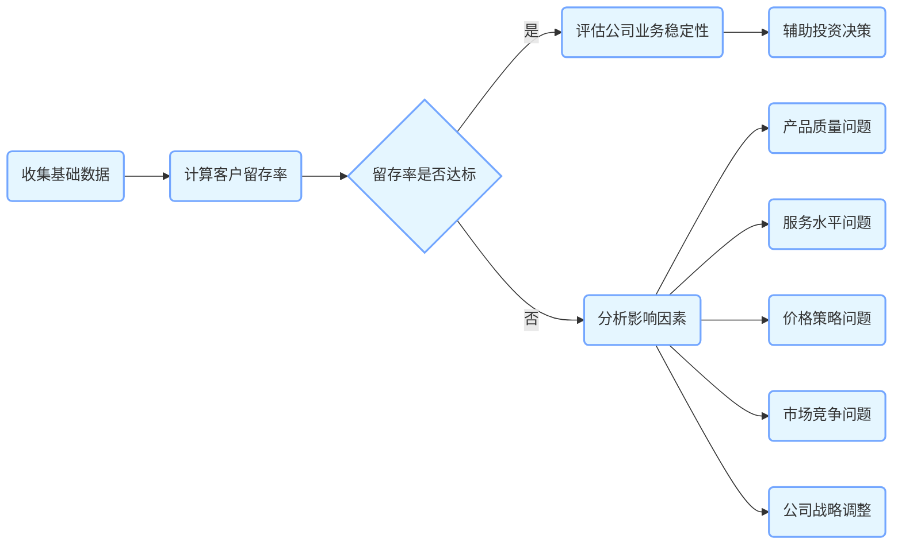

# 彼得林奇如何分析公司的客户留存率

> 关键词：彼得林奇、客户留存率、公司分析、财务指标、投资决策

> 摘要：本文深入探讨了投资大师彼得林奇分析公司客户留存率的方法。客户留存率是衡量公司业务稳定性和盈利能力的关键指标之一。彼得林奇在投资过程中十分重视这一指标，通过多维度的分析来评估公司的发展潜力和投资价值。文章首先介绍了分析客户留存率的背景信息，包括目的、预期读者等；接着阐述了客户留存率的核心概念与联系，给出了相关原理和架构的示意图；详细讲解了分析客户留存率的核心算法原理及具体操作步骤，并辅以Python代码示例；介绍了相关的数学模型和公式，且举例说明；通过项目实战展示了如何在实际中运用这些方法进行分析；探讨了客户留存率在不同场景下的实际应用；推荐了学习、开发工具以及相关论文著作等资源；最后总结了未来发展趋势与挑战，并对常见问题进行了解答，为投资者和相关从业者提供了全面而深入的参考。

## 1. 背景介绍 
### 1.1 目的和范围
在投资领域，准确评估一家公司的价值和发展潜力是至关重要的。客户留存率作为一个反映公司客户忠诚度和业务可持续性的关键指标，对于投资者判断公司的竞争力和未来盈利能力具有重要意义。彼得林奇作为一位传奇的投资大师，他在选股和分析公司时积累了丰富的经验和独特的方法。本文的目的是深入剖析彼得林奇如何分析公司的客户留存率，涵盖了从基本概念的理解到实际分析操作的各个方面，旨在为投资者和相关从业者提供系统的指导，帮助他们更好地运用客户留存率这一指标进行投资决策。

### 1.2 预期读者
本文主要面向对投资领域感兴趣的人群，包括专业投资者、投资机构的分析师、个人投资者、金融专业的学生以及对公司财务分析有研究需求的人员。无论是想要学习彼得林奇投资方法的新手，还是希望进一步提升投资分析能力的资深人士，都能从本文中获取有价值的信息。

### 1.3 文档结构概述
本文将按照以下结构进行阐述：首先介绍与客户留存率分析相关的核心概念以及它们之间的联系，并通过文本示意图和Mermaid流程图进行直观展示；接着详细讲解分析客户留存率的核心算法原理，给出具体的操作步骤，并使用Python代码进行详细说明；然后介绍相关的数学模型和公式，通过实际例子进行深入讲解；通过项目实战展示如何在实际中运用这些方法进行客户留存率的分析，包括开发环境搭建、源代码实现和代码解读；探讨客户留存率在不同场景下的实际应用；推荐学习、开发工具以及相关论文著作等资源；最后总结未来发展趋势与挑战，解答常见问题，并提供扩展阅读和参考资料。

### 1.4 术语表
#### 1.4.1 核心术语定义
- **客户留存率（Customer Retention Rate）**：指在一定时期内，公司保留的老客户数量占期初客户数量的比例。它反映了公司在维持客户关系方面的能力，是衡量公司客户忠诚度和业务稳定性的重要指标。
- **期初客户数量（Initial Customer Count）**：在统计客户留存率的起始时间点，公司拥有的客户总数。
- **期末客户数量（Final Customer Count）**：在统计客户留存率的结束时间点，公司拥有的客户总数。
- **新客户数量（New Customer Count）**：在统计期间内，公司新获取的客户数量。

#### 1.4.2 相关概念解释
- **客户流失率（Customer Churn Rate）**：与客户留存率相对，指在一定时期内，流失的客户数量占期初客户数量的比例。客户流失率和客户留存率之和为100%。
- **客户生命周期价值（Customer Lifetime Value，CLV）**：指一个客户在与公司的整个关系周期内，为公司带来的总收益。客户留存率对客户生命周期价值有重要影响，较高的客户留存率通常意味着更高的客户生命周期价值。

#### 1.4.3 缩略词列表
- **CRR**：Customer Retention Rate，客户留存率
- **CCR**：Customer Churn Rate，客户流失率
- **CLV**：Customer Lifetime Value，客户生命周期价值

## 2. 核心概念与联系 

### 核心概念原理
客户留存率的核心原理在于反映公司维持现有客户关系的能力。一个公司的业务能否持续增长，不仅取决于获取新客户的能力，更重要的是能否留住老客户。高客户留存率意味着公司的产品或服务能够满足客户的需求，客户对公司有较高的满意度和忠诚度，从而愿意继续与公司合作。相反，低客户留存率则可能暗示公司存在产品质量、服务水平、市场竞争等方面的问题。

### 架构的文本示意图
```plaintext
客户留存率分析架构
|-- 基础数据
|   |-- 期初客户数量
|   |-- 期末客户数量
|   |-- 新客户数量
|-- 计算指标
|   |-- 客户留存率
|   |-- 客户流失率
|-- 影响因素
|   |-- 产品质量
|   |-- 服务水平
|   |-- 价格策略
|   |-- 市场竞争
|-- 分析结果应用
|   |-- 投资决策
|   |-- 公司战略调整
```

### Mermaid流程图


## 3. 核心算法原理 & 具体操作步骤 

### 核心算法原理
客户留存率的计算公式为：
\[ CRR = \frac{FC - NC}{IC} \times 100\% \]
其中，$CRR$ 表示客户留存率，$FC$ 表示期末客户数量，$NC$ 表示新客户数量，$IC$ 表示期初客户数量。

该公式的原理是，先从期末客户数量中减去新客户数量，得到在统计期间内保留下来的老客户数量，然后将其与期初客户数量相比，得到客户留存率。

### 具体操作步骤
1. **数据收集**：确定统计期间，收集该期间的期初客户数量、期末客户数量和新客户数量。这些数据可以从公司的客户关系管理系统（CRM）、销售记录等数据源中获取。
2. **数据清洗**：检查收集到的数据是否存在错误、缺失或重复值。对于错误数据进行修正，对于缺失数据可以采用合理的方法进行填充，如均值填充、中位数填充等，对于重复数据进行去重处理。
3. **计算客户留存率**：将清洗后的数据代入上述公式，计算客户留存率。
4. **结果分析**：根据计算得到的客户留存率，结合公司的行业特点、历史数据等进行分析。判断客户留存率是否处于合理水平，分析影响客户留存率的因素。

### Python源代码实现
```python
def calculate_customer_retention_rate(initial_customers, final_customers, new_customers):
    """
    计算客户留存率
    :param initial_customers: 期初客户数量
    :param final_customers: 期末客户数量
    :param new_customers: 新客户数量
    :return: 客户留存率（百分比）
    """
    if initial_customers == 0:
        return 0
    retained_customers = final_customers - new_customers
    retention_rate = (retained_customers / initial_customers) * 100
    return retention_rate

# 示例数据
initial_customers = 1000
final_customers = 1200
new_customers = 300

# 计算客户留存率
retention_rate = calculate_customer_retention_rate(initial_customers, final_customers, new_customers)
print(f"客户留存率: {retention_rate:.2f}%")
```
### 代码解释
上述代码定义了一个名为 `calculate_customer_retention_rate` 的函数，该函数接受期初客户数量、期末客户数量和新客户数量作为参数，返回客户留存率。在函数内部，首先判断期初客户数量是否为0，如果为0则返回0，避免出现除零错误。然后计算保留下来的老客户数量，将其与期初客户数量相比并乘以100，得到客户留存率。最后，给出了示例数据并调用该函数进行计算，将结果打印输出。

## 4. 数学模型和公式 & 详细讲解 & 举例说明 

### 数学模型和公式
#### 客户留存率公式
\[ CRR = \frac{FC - NC}{IC} \times 100\% \]
其中，$CRR$ 表示客户留存率，$FC$ 表示期末客户数量，$NC$ 表示新客户数量，$IC$ 表示期初客户数量。

#### 客户流失率公式
\[ CCR = 1 - CRR \]
其中，$CCR$ 表示客户流失率，$CRR$ 表示客户留存率。

### 详细讲解
客户留存率公式的分子 $FC - NC$ 表示在统计期间内保留下来的老客户数量。分母 $IC$ 表示期初客户数量。将两者相除并乘以100%，得到客户留存率的百分比。客户流失率公式则是基于客户留存率和客户流失率之和为100%的关系推导得出。

### 举例说明
假设一家公司在年初有1000个客户（$IC = 1000$），在年末有1200个客户（$FC = 1200$），在这一年中新增了300个客户（$NC = 300$）。

首先，计算客户留存率：
\[ CRR = \frac{1200 - 300}{1000} \times 100\% = \frac{900}{1000} \times 100\% = 90\% \]

然后，计算客户流失率：
\[ CCR = 1 - 90\% = 10\% \]

这意味着该公司在这一年中保留了90%的老客户，有10%的老客户流失了。

## 5. 项目实战：代码实际案例和详细解释说明 

### 5.1 开发环境搭建
为了实现客户留存率的分析，我们可以使用Python语言和一些常用的数据分析库。以下是搭建开发环境的步骤：

1. **安装Python**：从Python官方网站（https://www.python.org/downloads/）下载并安装Python 3.x版本。
2. **安装数据分析库**：使用pip命令安装所需的库，包括`pandas`、`numpy`等。
```sh
pip install pandas numpy
```
3. **选择开发工具**：可以选择使用Jupyter Notebook、PyCharm等开发工具。Jupyter Notebook适合进行交互式数据分析，PyCharm则是一个功能强大的Python集成开发环境。

### 5.2 源代码详细实现和代码解读
以下是一个完整的Python代码示例，用于分析客户留存率，并对结果进行可视化展示。

```python
import pandas as pd
import numpy as np
import matplotlib.pyplot as plt

# 模拟客户数据
data = {
    'Period': ['Q1', 'Q2', 'Q3', 'Q4'],
    'Initial_Customers': [1000, 1100, 1200, 1300],
    'Final_Customers': [1200, 1300, 1400, 1500],
    'New_Customers': [300, 350, 400, 450]
}

# 创建DataFrame
df = pd.DataFrame(data)

# 定义计算客户留存率的函数
def calculate_customer_retention_rate(initial_customers, final_customers, new_customers):
    if initial_customers == 0:
        return 0
    retained_customers = final_customers - new_customers
    retention_rate = (retained_customers / initial_customers) * 100
    return retention_rate

# 计算每个季度的客户留存率
df['Retention_Rate'] = df.apply(lambda row: calculate_customer_retention_rate(
    row['Initial_Customers'], row['Final_Customers'], row['New_Customers']), axis=1)

# 打印结果
print(df)

# 可视化客户留存率
plt.figure(figsize=(10, 6))
plt.plot(df['Period'], df['Retention_Rate'], marker='o')
plt.title('Customer Retention Rate by Quarter')
plt.xlabel('Quarter')
plt.ylabel('Retention Rate (%)')
plt.grid(True)
plt.show()
```

### 代码解读与分析
1. **数据模拟**：使用字典 `data` 模拟了四个季度的客户数据，包括期初客户数量、期末客户数量和新客户数量。然后使用 `pandas` 的 `DataFrame` 函数将数据转换为数据框。
2. **定义计算函数**：定义了 `calculate_customer_retention_rate` 函数，用于计算客户留存率。
3. **计算客户留存率**：使用 `apply` 方法将计算函数应用到数据框的每一行，计算每个季度的客户留存率，并将结果添加到数据框的新列 `Retention_Rate` 中。
4. **打印结果**：打印包含客户留存率的数据框。
5. **可视化展示**：使用 `matplotlib` 库绘制客户留存率随季度变化的折线图，直观展示客户留存率的变化趋势。

通过这个项目实战，我们可以清晰地看到如何使用Python进行客户留存率的分析和可视化，帮助我们更好地理解公司的客户留存情况。

## 6. 实际应用场景 
### 投资决策
在投资领域，客户留存率是评估公司价值和投资潜力的重要指标之一。彼得林奇在选股时，会关注公司的客户留存率。如果一家公司的客户留存率较高，说明该公司的产品或服务具有较强的竞争力，客户忠诚度高，未来盈利能力相对稳定，这样的公司更有可能成为优质的投资标的。相反，如果客户留存率较低，可能意味着公司面临着市场竞争、产品质量等方面的问题，投资风险相对较高。

### 公司战略调整
对于公司自身而言，客户留存率可以为公司的战略调整提供重要依据。如果公司发现客户留存率下降，就需要深入分析原因，可能是产品质量出现问题、服务水平下降、价格策略不合理或者市场竞争加剧等。针对这些问题，公司可以采取相应的措施，如改进产品质量、提升服务水平、优化价格策略、加强市场推广等，以提高客户留存率，增强公司的竞争力。

### 市场营销策略制定
客户留存率的分析结果可以帮助公司制定更有效的市场营销策略。对于高留存率的客户群体，公司可以通过提供个性化的服务、推出忠诚度计划等方式进一步提高客户的满意度和忠诚度，挖掘客户的潜在价值。对于低留存率的客户群体，公司可以进行市场细分，了解不同客户群体的需求和痛点，针对性地开展营销活动，提高客户的留存率。

### 行业竞争分析
通过比较不同公司的客户留存率，可以了解行业内的竞争态势。如果一家公司的客户留存率明显高于行业平均水平，说明该公司在市场竞争中具有优势；反之，如果低于行业平均水平，则需要关注公司在市场竞争中的劣势，寻找提升竞争力的方法。

## 7. 工具和资源推荐
### 7.1 学习资源推荐
#### 7.1.1 书籍推荐
- 《彼得林奇的成功投资》：彼得林奇的经典著作，详细介绍了他的投资理念和选股方法，其中包括如何分析公司的各项指标，对理解客户留存率在投资中的应用有很大帮助。
- 《客户关系管理》：系统介绍了客户关系管理的理论和实践，包括客户留存率的相关知识，对于深入理解客户留存率的概念和影响因素有重要意义。
- 《数据分析实战》：通过实际案例介绍了数据分析的方法和技巧，有助于学习如何运用数据分析工具进行客户留存率的分析。

#### 7.1.2 在线课程
- Coursera上的“数据分析基础”课程：涵盖了数据分析的基本概念、方法和工具，适合初学者学习。
- edX上的“客户关系管理”课程：深入讲解了客户关系管理的理论和实践，包括客户留存率的分析和管理。
- 网易云课堂上的“Python数据分析实战”课程：通过实际项目介绍了如何使用Python进行数据分析，对于学习客户留存率的分析代码有很大帮助。

#### 7.1.3 技术博客和网站
- 数据派THU：专注于数据分析领域的博客，分享了很多数据分析的案例和技术文章，包括客户留存率的分析方法。
- 36氪：提供了大量的商业和科技资讯，其中不乏关于公司客户留存率的分析和报道。
- 艾瑞网：专注于互联网行业的研究和分析，发布了很多关于互联网公司客户留存率的研究报告。

### 7.2 开发工具框架推荐
#### 7.2.1 IDE和编辑器
- PyCharm：功能强大的Python集成开发环境，提供了代码编辑、调试、版本控制等功能，适合专业的Python开发人员。
- Jupyter Notebook：交互式的数据分析工具，支持多种编程语言，方便进行数据探索和可视化，适合数据分析人员和初学者。
- Visual Studio Code：轻量级的代码编辑器，支持多种编程语言和插件扩展，具有良好的开发体验。

#### 7.2.2 调试和性能分析工具
- Py-Spy：用于Python代码的性能分析工具，可以实时监测Python程序的运行状态，找出性能瓶颈。
- pdb：Python自带的调试工具，通过设置断点、单步执行等方式帮助调试代码。
- Sentry：用于监控和分析应用程序的错误和性能问题，支持Python等多种编程语言。

#### 7.2.3 相关框架和库
- pandas：强大的数据分析库，提供了数据结构和数据处理工具，方便进行数据清洗、分析和可视化。
- numpy：用于科学计算的基础库，提供了高效的数组操作和数学函数，是很多数据分析库的基础。
- matplotlib：常用的绘图库，支持多种绘图类型，可用于数据可视化。

### 7.3 相关论文著作推荐
#### 7.3.1 经典论文
- Reichheld, F. F. (1996). The loyalty effect: The hidden force behind growth, profits, and lasting value. Harvard Business School Press. 该论文深入探讨了客户忠诚度和留存率对公司增长、利润和价值的影响。
- Gupta, S., & Lehmann, D. R. (2003). Customer lifetime value measurement and management. Journal of Service Research, 6(1), 7-26. 论文介绍了客户生命周期价值的测量和管理方法，与客户留存率密切相关。

#### 7.3.2 最新研究成果
- 通过学术搜索引擎（如Google Scholar、Web of Science等）搜索关于客户留存率的最新研究论文，了解该领域的最新研究动态和方法。

#### 7.3.3 应用案例分析
- 可以参考一些知名咨询公司（如麦肯锡、波士顿咨询等）发布的行业研究报告，其中包含了很多关于客户留存率的应用案例分析，有助于学习如何在实际中运用客户留存率进行决策。

## 8. 总结：未来发展趋势与挑战
### 未来发展趋势
#### 数据驱动的精细化分析
随着大数据技术的不断发展，公司可以收集到更多关于客户的详细数据，如客户行为数据、消费偏好数据等。未来，对客户留存率的分析将更加精细化，通过挖掘这些数据背后的信息，深入了解客户的需求和行为模式，制定更加个性化的客户留存策略。

#### 跨领域融合分析
客户留存率的分析将不再局限于单一的业务领域，而是与其他领域的指标和数据进行融合分析。例如，将客户留存率与财务指标、市场份额等相结合，综合评估公司的经营状况和竞争力。同时，还可能与人工智能、机器学习等技术相结合，实现更智能的客户留存预测和决策。

#### 行业标准和规范的建立
随着客户留存率在投资和企业管理中的重要性日益凸显，未来可能会建立统一的行业标准和规范，明确客户留存率的计算方法、数据采集要求等，提高分析结果的可比性和准确性。

### 挑战
#### 数据质量和安全问题
要进行准确的客户留存率分析，需要高质量的数据支持。然而，实际中数据可能存在错误、缺失、重复等问题，影响分析结果的准确性。同时，客户数据的安全问题也日益受到关注，如何在保证数据安全的前提下进行有效的分析是一个挑战。

#### 复杂多变的市场环境
市场环境是复杂多变的，客户的需求和行为也会受到多种因素的影响，如经济形势、政策法规、竞争对手的策略等。准确分析这些因素对客户留存率的影响，并及时调整策略是具有挑战性的。

#### 技术人才短缺
客户留存率的分析需要具备数据分析、统计学、机器学习等多方面知识的技术人才。目前，这类复合型人才相对短缺，如何培养和吸引这些人才是企业面临的一个挑战。

## 9. 附录：常见问题与解答
### 问题1：客户留存率的计算周期应该如何确定？
解答：客户留存率的计算周期可以根据公司的业务特点和分析目的来确定。对于一些快速消费品行业，可能以月或季度为计算周期比较合适；对于一些大型设备制造或房地产行业，由于客户购买周期较长，可能以年为计算周期更为合适。同时，也可以根据分析目的进行灵活调整，如进行短期的市场活动效果评估时，可以选择较短的计算周期。

### 问题2：客户留存率高就一定意味着公司的业务好吗？
解答：客户留存率高通常是一个积极的信号，说明公司在维持客户关系方面做得较好。但这并不一定意味着公司的业务就绝对好。还需要结合其他指标进行综合分析，如客户满意度、客户生命周期价值、市场份额等。例如，虽然客户留存率高，但客户满意度较低，可能是因为客户没有其他更好的选择而不得不继续使用公司的产品或服务，这种情况下公司的业务可能存在潜在风险。

### 问题3：如何提高客户留存率？
解答：提高客户留存率可以从多个方面入手。首先，要提高产品质量，确保产品能够满足客户的需求；其次，提升服务水平，提供优质的售前、售中、售后服务，增强客户的满意度；还可以制定合理的价格策略，提供有竞争力的价格；此外，开展忠诚度计划、提供个性化的服务等也有助于提高客户留存率。

### 问题4：客户留存率和客户流失率之间有什么关系？
解答：客户留存率和客户流失率之和为100%。即如果客户留存率为80%，则客户流失率为20%。两者是相互补充的关系，通过分析客户流失率可以更好地了解客户留存率的变化情况，找出影响客户留存的原因。

## 10. 扩展阅读 & 参考资料
### 扩展阅读
- 《聪明的投资者》：本杰明·格雷厄姆的经典投资著作，介绍了价值投资的理念和方法，对投资分析有重要的参考价值。
- 《大数据时代》：介绍了大数据的概念、技术和应用，有助于了解大数据在客户留存率分析中的应用前景。
- 《人工智能：现代方法》：全面介绍了人工智能的理论和方法，对于了解人工智能在客户留存率预测中的应用有帮助。

### 参考资料
- 彼得林奇的官方网站和相关采访资料，获取他的投资理念和方法的第一手信息。
- 公司的财务报表和年报，从中可以获取客户数量等相关数据，用于客户留存率的分析。
- 行业研究报告和市场调研数据，了解行业的发展趋势和竞争态势，以及客户留存率的行业平均水平。

作者：AI天才研究院/AI Genius Institute & 禅与计算机程序设计艺术 /Zen And The Art of Computer Programming