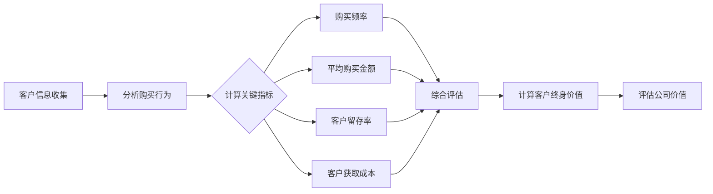

# 彼得林奇如何分析公司的客户终身价值

> 关键词：彼得林奇、客户终身价值、公司分析、投资策略、财务分析

> 摘要：本文深入探讨彼得林奇分析公司客户终身价值的方法。客户终身价值是评估公司长期盈利能力和发展潜力的重要指标，而彼得林奇作为投资大师，其独特的分析方法对投资者和企业管理者具有重要的借鉴意义。文章将从背景介绍入手，阐述相关核心概念，剖析其分析客户终身价值的算法原理、数学模型，结合项目实战案例进行详细说明，探讨实际应用场景，推荐相关工具和资源，最后总结未来发展趋势与挑战，并解答常见问题。

## 1. 背景介绍 
### 1.1 目的和范围
本部分旨在全面揭示彼得林奇分析公司客户终身价值的方法和理念。范围涵盖彼得林奇在投资实践中运用的各种分析手段，以及客户终身价值在公司评估中的重要性和应用场景。通过深入研究，帮助投资者更好地理解如何通过分析客户终身价值来评估公司的投资价值，同时也为企业管理者提供提升客户价值的思路。

### 1.2 预期读者
本文预期读者包括广大投资者，无论是专业的投资机构人员还是个人投资者，都可以从彼得林奇的分析方法中获取有价值的投资信息。同时，企业管理者、市场营销人员也能从中了解如何更好地管理客户关系，提高客户终身价值，进而提升企业的竞争力。此外，对金融投资和企业管理感兴趣的学者和学生也可以作为参考资料。

### 1.3 文档结构概述
本文首先介绍背景信息，包括目的、预期读者和文档结构。接着阐述核心概念，明确客户终身价值的定义和相关联系。然后详细讲解彼得林奇分析客户终身价值的核心算法原理和具体操作步骤，通过数学模型和公式进行理论支持，并举例说明。再通过项目实战案例展示如何应用这些方法进行实际分析。之后探讨客户终身价值分析在不同场景中的实际应用。推荐相关的学习资源、开发工具框架和论文著作。最后总结未来发展趋势与挑战，解答常见问题，并提供扩展阅读和参考资料。

### 1.4 术语表
#### 1.4.1 核心术语定义
- **客户终身价值（Customer Lifetime Value，CLV）**：指在客户与公司的整个关系周期内，公司从该客户获得的净收益的现值。它考虑了客户在未来一段时间内的购买行为、购买频率、购买金额以及公司为服务该客户所付出的成本等因素。
- **客户获取成本（Customer Acquisition Cost，CAC）**：指公司为获取一个新客户所花费的全部成本，包括营销费用、销售费用等。
- **客户留存率（Customer Retention Rate，CRR）**：指在一定时期内，继续与公司保持业务关系的客户数量占期初客户数量的比例。

#### 1.4.2 相关概念解释
- **净现值（Net Present Value，NPV）**：是指投资方案所产生的现金净流量以资金成本为贴现率折现之后与原始投资额现值的差额。在计算客户终身价值时，将未来各期的客户收益折现到当前时刻，以考虑货币的时间价值。
- **客户生命周期（Customer Lifecycle）**：指客户从初次接触公司到最终与公司终止业务关系的整个过程，包括潜在客户、新客户、老客户和流失客户等阶段。

#### 1.4.3 缩略词列表
- CLV：Customer Lifetime Value（客户终身价值）
- CAC：Customer Acquisition Cost（客户获取成本）
- CRR：Customer Retention Rate（客户留存率）
- NPV：Net Present Value（净现值）

## 2. 核心概念与联系 
### 2.1 客户终身价值的原理
客户终身价值的核心原理在于评估客户在整个生命周期内为公司带来的经济价值。它不仅仅关注客户当前的购买行为，更重要的是预测客户未来的购买潜力和忠诚度。一个具有高终身价值的客户，能够在较长时间内持续为公司创造收益，对公司的盈利能力和市场竞争力具有重要影响。

客户终身价值的计算需要考虑多个因素，包括客户的购买频率、平均购买金额、客户留存率以及公司的运营成本等。通过综合分析这些因素，可以更准确地评估客户对公司的价值。

### 2.2 客户终身价值与公司价值的联系
客户终身价值是公司价值的重要组成部分。公司的价值在很大程度上取决于其客户群体的质量和规模。高客户终身价值意味着公司拥有稳定的客户基础和持续的现金流，能够提高公司的盈利能力和市场估值。

例如，一家拥有大量高终身价值客户的公司，其业绩往往更加稳定，抗风险能力更强。相反，如果公司的客户终身价值较低，可能面临客户流失、收入下降等问题，从而影响公司的长期发展。

### 2.3 核心概念架构的文本示意图
客户终身价值分析涉及多个核心概念，它们之间相互关联，构成一个完整的分析框架。以下是其文本示意图：

客户终身价值（CLV）
|-- 客户购买行为
|   |-- 购买频率
|   |-- 平均购买金额
|-- 客户留存率（CRR）
|-- 客户获取成本（CAC）
|-- 公司运营成本
|-- 净现值（NPV）计算

### 2.4 Mermaid 流程图


## 3. 核心算法原理 & 具体操作步骤 
### 3.1 核心算法原理
彼得林奇分析客户终身价值的核心算法基于净现值的概念，将客户在未来各期的预期收益折现到当前时刻，减去客户获取成本和相关运营成本，得到客户终身价值。

基本公式为：

$CLV = \sum_{t=1}^{n} \frac{R_t}{(1 + r)^t} - CAC - \sum_{t=1}^{n} \frac{C_t}{(1 + r)^t}$

其中：
- $CLV$ 表示客户终身价值
- $R_t$ 表示第 $t$ 期的客户收益
- $r$ 表示折现率
- $n$ 表示客户生命周期的期数
- $CAC$ 表示客户获取成本
- $C_t$ 表示第 $t$ 期的运营成本

### 3.2 具体操作步骤
#### 3.2.1 数据收集
收集客户的相关数据，包括购买记录、购买时间、购买金额、客户留存情况等。这些数据可以从公司的销售系统、客户关系管理系统（CRM）等数据源中获取。

#### 3.2.2 计算关键指标
- **购买频率**：统计客户在一定时期内的购买次数，计算平均购买频率。
- **平均购买金额**：计算客户每次购买的平均金额。
- **客户留存率**：根据客户的留存情况，计算一定时期内的客户留存率。
- **客户获取成本**：统计公司为获取新客户所花费的全部成本，然后分摊到每个新客户上。

#### 3.2.3 预测未来收益
根据客户的历史购买行为和关键指标，预测客户在未来各期的收益。可以采用时间序列分析、回归分析等方法进行预测。

#### 3.2.4 确定折现率
折现率反映了货币的时间价值和投资的风险。一般可以参考公司的加权平均资本成本（WACC）或市场利率来确定折现率。

#### 3.2.5 计算客户终身价值
根据上述公式，将预测的未来收益折现到当前时刻，减去客户获取成本和运营成本，得到客户终身价值。

### 3.3 Python 源代码实现
```python
import numpy as np

def calculate_clv(purchase_frequency, average_purchase_amount, customer_retention_rate, customer_acquisition_cost, discount_rate, num_periods, operating_costs):
    """
    计算客户终身价值

    :param purchase_frequency: 购买频率
    :param average_purchase_amount: 平均购买金额
    :param customer_retention_rate: 客户留存率
    :param customer_acquisition_cost: 客户获取成本
    :param discount_rate: 折现率
    :param num_periods: 客户生命周期的期数
    :param operating_costs: 各期的运营成本列表
    :return: 客户终身价值
    """
    # 计算各期的客户收益
    revenues = []
    for t in range(num_periods):
        revenue = purchase_frequency * average_purchase_amount * (customer_retention_rate ** t)
        revenues.append(revenue)

    # 计算各期收益的净现值
    npv_revenues = np.sum([revenue / (1 + discount_rate) ** (t + 1) for t, revenue in enumerate(revenues)])

    # 计算各期运营成本的净现值
    npv_operating_costs = np.sum([cost / (1 + discount_rate) ** (t + 1) for t, cost in enumerate(operating_costs)])

    # 计算客户终身价值
    clv = npv_revenues - customer_acquisition_cost - npv_operating_costs

    return clv

# 示例数据
purchase_frequency = 2  # 每年购买2次
average_purchase_amount = 100  # 平均每次购买100元
customer_retention_rate = 0.8  # 客户留存率为80%
customer_acquisition_cost = 50  # 客户获取成本为50元
discount_rate = 0.1  # 折现率为10%
num_periods = 5  # 客户生命周期为5年
operating_costs = [10, 12, 15, 18, 20]  # 各年的运营成本

clv = calculate_clv(purchase_frequency, average_purchase_amount, customer_retention_rate, customer_acquisition_cost, discount_rate, num_periods, operating_costs)
print(f"客户终身价值: {clv} 元")
```

## 4. 数学模型和公式 & 详细讲解 & 举例说明 
### 4.1 数学模型和公式
客户终身价值的数学模型基于净现值的概念，通过对未来各期客户收益和成本的折现来计算。核心公式为：

$CLV = \sum_{t=1}^{n} \frac{R_t}{(1 + r)^t} - CAC - \sum_{t=1}^{n} \frac{C_t}{(1 + r)^t}$

### 4.2 详细讲解
- **$\sum_{t=1}^{n} \frac{R_t}{(1 + r)^t}$**：这是未来各期客户收益的净现值之和。$R_t$ 表示第 $t$ 期的客户收益，$(1 + r)^t$ 是折现因子，$r$ 是折现率，$n$ 是客户生命周期的期数。通过折现，将未来的收益转换为当前的价值，考虑了货币的时间价值。
- **$CAC$**：客户获取成本，即公司为获取一个新客户所花费的全部成本。
- **$\sum_{t=1}^{n} \frac{C_t}{(1 + r)^t}$**：未来各期运营成本的净现值之和。$C_t$ 表示第 $t$ 期的运营成本，同样通过折现转换为当前价值。

### 4.3 举例说明
假设一家电商公司，其客户的购买频率为每年 3 次，平均每次购买金额为 200 元，客户留存率为 0.8，客户获取成本为 80 元，折现率为 0.1，客户生命周期为 4 年，各年的运营成本分别为 20 元、25 元、30 元、35 元。

#### 4.3.1 计算各期客户收益
- 第 1 年：$R_1 = 3 \times 200 = 600$ 元
- 第 2 年：$R_2 = 3 \times 200 \times 0.8 = 480$ 元
- 第 3 年：$R_3 = 3 \times 200 \times 0.8^2 = 384$ 元
- 第 4 年：$R_4 = 3 \times 200 \times 0.8^3 = 307.2$ 元

#### 4.3.2 计算各期收益的净现值
- 第 1 年：$\frac{R_1}{(1 + 0.1)^1} = \frac{600}{1.1} \approx 545.45$ 元
- 第 2 年：$\frac{R_2}{(1 + 0.1)^2} = \frac{480}{1.21} \approx 396.69$ 元
- 第 3 年：$\frac{R_3}{(1 + 0.1)^3} = \frac{384}{1.331} \approx 288.50$ 元
- 第 4 年：$\frac{R_4}{(1 + 0.1)^4} = \frac{307.2}{1.4641} \approx 209.82$ 元

总净现值收益：$545.45 + 396.69 + 288.50 + 209.82 = 1440.46$ 元

#### 4.3.3 计算各期运营成本的净现值
- 第 1 年：$\frac{C_1}{(1 + 0.1)^1} = \frac{20}{1.1} \approx 18.18$ 元
- 第 2 年：$\frac{C_2}{(1 + 0.1)^2} = \frac{25}{1.21} \approx 20.66$ 元
- 第 3 年：$\frac{C_3}{(1 + 0.1)^3} = \frac{30}{1.331} \approx 22.54$ 元
- 第 4 年：$\frac{C_4}{(1 + 0.1)^4} = \frac{35}{1.4641} \approx 23.91$ 元

总净现值运营成本：$18.18 + 20.66 + 22.54 + 23.91 = 85.29$ 元

#### 4.3.4 计算客户终身价值
$CLV = 1440.46 - 80 - 85.29 = 1275.17$ 元

因此，该客户的终身价值约为 1275.17 元。

## 5. 项目实战：代码实际案例和详细解释说明 
### 5.1  开发环境搭建
#### 5.1.1 安装 Python
首先需要安装 Python 环境，建议使用 Python 3.6 及以上版本。可以从 Python 官方网站（https://www.python.org/downloads/）下载并安装适合自己操作系统的 Python 版本。

#### 5.1.2 安装必要的库
本项目需要使用 `numpy` 库进行数值计算。可以使用以下命令进行安装：
```sh
pip install numpy
```

### 5.2  源代码详细实现和代码解读
```python
import numpy as np

def calculate_clv(purchase_frequency, average_purchase_amount, customer_retention_rate, customer_acquisition_cost, discount_rate, num_periods, operating_costs):
    """
    计算客户终身价值

    :param purchase_frequency: 购买频率
    :param average_purchase_amount: 平均购买金额
    :param customer_retention_rate: 客户留存率
    :param customer_acquisition_cost: 客户获取成本
    :param discount_rate: 折现率
    :param num_periods: 客户生命周期的期数
    :param operating_costs: 各期的运营成本列表
    :return: 客户终身价值
    """
    # 计算各期的客户收益
    revenues = []
    for t in range(num_periods):
        revenue = purchase_frequency * average_purchase_amount * (customer_retention_rate ** t)
        revenues.append(revenue)

    # 计算各期收益的净现值
    npv_revenues = np.sum([revenue / (1 + discount_rate) ** (t + 1) for t, revenue in enumerate(revenues)])

    # 计算各期运营成本的净现值
    npv_operating_costs = np.sum([cost / (1 + discount_rate) ** (t + 1) for t, cost in enumerate(operating_costs)])

    # 计算客户终身价值
    clv = npv_revenues - customer_acquisition_cost - npv_operating_costs

    return clv

# 示例数据
purchase_frequency = 2  # 每年购买2次
average_purchase_amount = 100  # 平均每次购买100元
customer_retention_rate = 0.8  # 客户留存率为80%
customer_acquisition_cost = 50  # 客户获取成本为50元
discount_rate = 0.1  # 折现率为10%
num_periods = 5  # 客户生命周期为5年
operating_costs = [10, 12, 15, 18, 20]  # 各年的运营成本

clv = calculate_clv(purchase_frequency, average_purchase_amount, customer_retention_rate, customer_acquisition_cost, discount_rate, num_periods, operating_costs)
print(f"客户终身价值: {clv} 元")
```

### 5.3  代码解读与分析
#### 5.3.1 函数定义
`calculate_clv` 函数接受多个参数，包括购买频率、平均购买金额、客户留存率、客户获取成本、折现率、客户生命周期的期数和各期的运营成本列表。函数的返回值是客户终身价值。

#### 5.3.2 计算各期客户收益
通过循环计算各期的客户收益，并将其存储在 `revenues` 列表中。客户收益的计算公式为：$R_t = purchase\_frequency \times average\_purchase\_amount \times (customer\_retention\_rate ^ t)$。

#### 5.3.3 计算各期收益的净现值
使用列表推导式计算各期收益的净现值，并使用 `np.sum` 函数求和。净现值的计算公式为：$\frac{R_t}{(1 + discount\_rate) ^ {t + 1}}$。

#### 5.3.4 计算各期运营成本的净现值
同样使用列表推导式计算各期运营成本的净现值，并求和。净现值的计算公式为：$\frac{C_t}{(1 + discount\_rate) ^ {t + 1}}$。

#### 5.3.5 计算客户终身价值
将各期收益的净现值减去客户获取成本和各期运营成本的净现值，得到客户终身价值。

#### 5.3.6 示例数据和结果输出
定义示例数据，调用 `calculate_clv` 函数计算客户终身价值，并将结果打印输出。

## 6. 实际应用场景 
### 6.1 投资决策
投资者可以通过分析公司的客户终身价值来评估公司的投资价值。具有高客户终身价值的公司往往具有更强的盈利能力和市场竞争力，更值得投资。例如，在选择股票投资时，投资者可以比较不同公司的客户终身价值，优先选择客户终身价值较高的公司。

### 6.2 市场营销策略制定
企业可以根据客户终身价值来制定市场营销策略。对于高终身价值的客户，企业可以提供个性化的服务和优惠，提高客户的满意度和忠诚度。对于低终身价值的客户，企业可以采取措施提高其购买频率和购买金额，或者优化客户获取成本。

### 6.3 客户关系管理
客户终身价值分析可以帮助企业更好地管理客户关系。通过了解客户的价值，企业可以将资源集中在高价值客户上，提高客户服务质量，减少客户流失。同时，企业可以根据客户终身价值的变化，及时调整客户关系管理策略。

### 6.4 产品研发和创新
企业可以根据客户终身价值的分析结果，了解客户的需求和偏好，从而进行产品研发和创新。针对高价值客户的需求，开发更符合其需求的产品和服务，提高客户的满意度和忠诚度，进而提升客户终身价值。

## 7. 工具和资源推荐
### 7.1 学习资源推荐
#### 7.1.1 书籍推荐
- 《彼得·林奇的成功投资》：彼得林奇的经典著作，详细介绍了他的投资理念和方法，包括如何分析公司的基本面和客户价值。
- 《客户终身价值：驱动企业未来增长的关键指标》：深入探讨客户终身价值的概念、计算方法和应用场景，对企业管理者和投资者都有很大的帮助。
- 《市场营销管理》：全面介绍市场营销的理论和实践，其中包括客户关系管理和客户价值分析的内容。

#### 7.1.2 在线课程
- Coursera 上的“客户关系管理”课程：由知名大学教授授课，系统介绍客户关系管理的理论和方法，包括客户终身价值的计算和应用。
- edX 上的“投资学原理”课程：讲解投资的基本原理和方法，其中涉及如何分析公司的财务状况和客户价值。
- Udemy 上的“数据分析实战：客户终身价值分析”课程：通过实际案例，详细介绍如何使用数据分析工具进行客户终身价值分析。

#### 7.1.3 技术博客和网站
- 艾瑞网：提供大量的互联网行业研究报告和分析文章，其中包括客户价值分析和市场营销方面的内容。
- 36氪：关注创新和创业领域，经常发布关于企业经营和客户管理的文章，对了解客户终身价值的应用有很大帮助。
- 麦肯锡官网：麦肯锡是全球知名的管理咨询公司，其官网发布的研究报告和文章对企业战略和客户价值管理有深入的分析。

### 7.2 开发工具框架推荐
#### 7.2.1 IDE和编辑器
- PyCharm：一款功能强大的 Python 集成开发环境，提供代码编辑、调试、版本控制等功能，适合开发客户终身价值分析的 Python 代码。
- Jupyter Notebook：一种交互式的开发环境，适合进行数据分析和实验。可以方便地编写和运行 Python 代码，同时展示数据分析的结果。
- Visual Studio Code：一款轻量级的代码编辑器，支持多种编程语言和插件扩展。可以安装 Python 相关的插件，进行代码开发和调试。

#### 7.2.2 调试和性能分析工具
- PDB：Python 自带的调试工具，可以帮助开发者定位代码中的问题。通过设置断点、单步执行等功能，逐步排查代码中的错误。
- cProfile：Python 的性能分析工具，可以分析代码的执行时间和函数调用情况。通过分析性能瓶颈，优化代码的执行效率。
- Numba：一个用于加速 Python 代码的库，可以将 Python 代码编译为机器码，提高代码的执行速度。对于大规模数据的客户终身价值分析，使用 Numba 可以显著提高性能。

#### 7.2.3 相关框架和库
- Pandas：一个强大的数据分析库，提供数据结构和数据分析工具，适合处理和分析客户数据。可以方便地进行数据清洗、转换和统计分析。
- Scikit-learn：一个机器学习库，提供各种机器学习算法和工具。可以使用 Scikit-learn 进行客户分类、预测等分析，辅助客户终身价值的计算。
- StatsModels：一个统计分析库，提供各种统计模型和方法。可以使用 StatsModels 进行时间序列分析、回归分析等，预测客户的未来收益。

### 7.3 相关论文著作推荐
#### 7.3.1 经典论文
- “Customer Lifetime Value in a Dynamic Noncontractual Setting: An Empirical Investigation”：该论文深入研究了非契约型环境下客户终身价值的计算方法和影响因素，具有重要的理论和实践意义。
- “The Value of Customers as Assets”：探讨了客户作为企业资产的价值，强调了客户终身价值在企业战略中的重要性。
- “Customer Equity Management: Building and Managing Relationships as Valuable Assets”：提出了客户权益管理的概念，阐述了如何通过管理客户关系来提升客户终身价值和企业价值。

#### 7.3.2 最新研究成果
- 关注学术数据库，如 IEEE Xplore、ACM Digital Library、ScienceDirect 等，搜索关于客户终身价值的最新研究论文。这些论文通常涉及到新的计算方法、应用场景和研究视角。
- 参加相关的学术会议，如营销科学学会（MSI）会议、国际信息系统会议（ICIS）等，了解最新的研究动态和成果。

#### 7.3.3 应用案例分析
- 各大咨询公司的研究报告，如贝恩公司、波士顿咨询集团等，经常发布关于企业客户价值管理的应用案例分析。这些案例可以帮助读者了解实际企业中如何应用客户终身价值分析来制定战略和决策。
- 行业杂志和商业媒体，如《哈佛商业评论》、《商业周刊》等，也会报道一些企业在客户价值管理方面的成功案例和经验分享。

## 8. 总结：未来发展趋势与挑战
### 8.1 未来发展趋势
#### 8.1.1 数据驱动的精细化分析
随着大数据技术的不断发展，企业将能够获取更全面、更准确的客户数据。未来，客户终身价值的分析将更加精细化，能够考虑更多的因素，如客户的社交行为、消费心理等，从而更准确地评估客户的价值。

#### 8.1.2 人工智能和机器学习的应用
人工智能和机器学习技术将在客户终身价值分析中得到更广泛的应用。通过机器学习算法，可以对客户数据进行深度挖掘和分析，预测客户的未来行为和价值。例如，使用深度学习算法进行客户分类和预测，提高客户终身价值计算的准确性。

#### 8.1.3 跨领域融合分析
客户终身价值分析将与其他领域的分析进行更深入的融合，如市场趋势分析、竞争对手分析等。通过综合考虑多个因素，企业可以更好地制定战略和决策，提升客户价值和企业竞争力。

#### 8.1.4 个性化服务和营销
基于客户终身价值的分析，企业将更加注重个性化服务和营销。根据客户的不同价值和需求，提供个性化的产品和服务，提高客户的满意度和忠诚度，进而提升客户终身价值。

### 8.2 挑战
#### 8.2.1 数据质量和隐私问题
客户终身价值分析依赖于大量的客户数据，但数据质量和隐私问题是当前面临的主要挑战之一。企业需要确保数据的准确性、完整性和安全性，同时遵守相关的法律法规，保护客户的隐私。

#### 8.2.2 模型的准确性和可解释性
虽然人工智能和机器学习模型可以提高客户终身价值计算的准确性，但模型的可解释性是一个难题。企业需要在提高模型准确性的同时，确保模型的可解释性，以便更好地理解和应用分析结果。

#### 8.2.3 组织变革和文化转型
客户终身价值分析需要企业进行组织变革和文化转型。企业需要打破部门壁垒，实现数据的共享和协同，同时培养员工的数据分析意识和能力。这需要企业付出较大的努力和时间成本。

#### 8.2.4 市场变化的不确定性
市场环境是不断变化的，客户的需求和行为也会随之改变。企业需要及时调整客户终身价值分析的方法和模型，以适应市场变化的不确定性。

## 9. 附录：常见问题与解答
### 9.1 客户终身价值的计算结果准确吗？
客户终身价值的计算结果受到多种因素的影响，如数据质量、模型假设、市场变化等，因此计算结果可能存在一定的误差。但是，通过合理的数据收集、科学的模型选择和不断的优化调整，可以提高计算结果的准确性。

### 9.2 如何提高客户终身价值？
可以从以下几个方面提高客户终身价值：提高客户留存率，通过提供优质的产品和服务，增强客户的满意度和忠诚度；增加客户的购买频率和购买金额，如推出促销活动、提供个性化的推荐等；降低客户获取成本，优化市场营销策略，提高客户获取效率。

### 9.3 客户终身价值分析适用于所有行业吗？
客户终身价值分析适用于大多数行业，但不同行业的分析方法和重点可能会有所不同。例如，对于零售行业，客户的购买频率和购买金额是重要的分析指标；对于服务行业，客户的满意度和忠诚度更为关键。

### 9.4 如何处理客户数据的隐私问题？
企业需要遵守相关的法律法规，采取必要的技术和管理措施，保护客户数据的隐私。例如，对客户数据进行加密处理，限制数据的访问权限，确保数据的使用符合客户的授权和同意。

### 9.5 客户终身价值分析需要哪些专业知识？
客户终身价值分析需要涉及市场营销、数据分析、财务等多个领域的专业知识。市场营销知识可以帮助理解客户行为和需求，数据分析知识可以用于数据处理和模型建立，财务知识可以用于计算净现值和评估投资价值。

## 10. 扩展阅读 & 参考资料
- 《财务报表分析》：帮助读者深入了解公司的财务状况，为客户终身价值分析提供财务数据支持。
- 《数据分析实战》：介绍数据分析的基本方法和技巧，有助于提高客户数据处理和分析的能力。
- 相关公司的年报和财务报告：可以获取公司的客户数据和财务信息，进行实际的客户终身价值分析。
- 行业研究报告：了解行业的发展趋势和市场动态，为客户终身价值分析提供背景信息。

作者：AI天才研究院/AI Genius Institute & 禅与计算机程序设计艺术 /Zen And The Art of Computer Programming