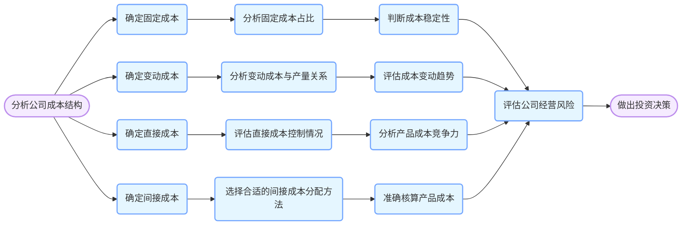

# 彼得林奇如何分析公司的成本结构

> 关键词：彼得林奇、公司成本结构分析、财务分析、投资决策、成本控制

> 摘要：本文深入探讨了投资大师彼得林奇分析公司成本结构的方法和理念。彼得林奇在投资领域取得了卓越成就，其对公司成本结构的分析方法对于投资者准确评估公司的经营状况和投资价值具有重要意义。文章将介绍彼得林奇分析成本结构的背景，阐述相关核心概念，详细讲解其背后的算法原理和操作步骤，结合数学模型进行说明，通过项目实战案例展示具体应用，探讨实际应用场景，推荐相关工具和资源，最后总结未来发展趋势与挑战，并对常见问题进行解答。

## 1. 背景介绍 
### 1.1 目的和范围
彼得林奇是投资界的传奇人物，他管理的麦哲伦基金创造了惊人的业绩。分析公司的成本结构是他投资决策过程中的重要环节。本文的目的在于深入剖析彼得林奇分析公司成本结构的方法，帮助投资者更好地理解公司的财务状况和经营效率，从而做出更明智的投资决策。范围涵盖了彼得林奇所关注的成本结构的各个方面，包括固定成本、变动成本、直接成本、间接成本等，以及如何通过这些成本信息评估公司的竞争力和盈利能力。

### 1.2 预期读者
本文预期读者包括对投资感兴趣的个人投资者、金融专业学生、投资机构的研究人员以及从事企业财务管理的专业人士。无论是初涉投资领域的新手，还是希望进一步提升投资分析能力的专业人士，都能从本文中获得有价值的信息。

### 1.3 文档结构概述
本文将首先介绍彼得林奇分析成本结构的背景知识，包括相关术语和概念。接着阐述核心概念及其联系，通过文本示意图和 Mermaid 流程图进行直观展示。然后详细讲解核心算法原理和具体操作步骤，并给出 Python 源代码示例。之后结合数学模型和公式进行详细说明，并举例阐释。再通过项目实战案例，包括开发环境搭建、源代码实现和代码解读，展示如何应用这些方法进行实际分析。随后探讨成本结构分析在实际投资中的应用场景，推荐相关的学习资源、开发工具框架和论文著作。最后总结未来发展趋势与挑战，解答常见问题，并提供扩展阅读和参考资料。

### 1.4 术语表
#### 1.4.1 核心术语定义
- **固定成本**：不随产量或销售量的变化而变化的成本，如厂房租金、设备折旧等。
- **变动成本**：随产量或销售量的变化而呈正比例变化的成本，如原材料成本、直接人工成本等。
- **直接成本**：可以直接归属于某一特定产品或服务的成本，如生产产品所需的原材料成本。
- **间接成本**：不能直接归属于某一特定产品或服务，需要通过一定的分配方法分摊到各个产品或服务中的成本，如企业的管理费用、水电费等。
- **成本结构**：指企业各项成本在总成本中所占的比重，反映了企业成本的构成情况。

#### 1.4.2 相关概念解释
- **成本控制**：企业通过采取一定的措施和方法，对成本的形成过程进行监督和调节，以降低成本、提高效益的管理活动。
- **成本领先战略**：企业通过有效降低成本，使自己的产品或服务成本低于竞争对手，从而在市场竞争中获得优势的战略。
- **边际成本**：每增加一单位产量所增加的成本。

#### 1.4.3 缩略词列表
- **EBIT**：息税前利润（Earnings Before Interest and Taxes），反映了企业在扣除利息和所得税之前的盈利水平。
- **COGS**：销货成本（Cost of Goods Sold），指企业销售商品或提供劳务所发生的成本。

## 2. 核心概念与联系 
彼得林奇在分析公司成本结构时，主要关注固定成本、变动成本、直接成本和间接成本之间的关系，以及这些成本对公司盈利能力和竞争力的影响。

### 核心概念原理
- 固定成本相对稳定，不随产量变化而变化。在产量较低时，固定成本分摊到每个产品上的份额较高，会增加单位产品的成本；而当产量增加时，固定成本分摊到每个产品上的份额会降低，从而降低单位产品的成本。
- 变动成本与产量呈正比例关系。随着产量的增加，变动成本也会相应增加。控制变动成本的关键在于优化生产流程、降低原材料采购成本等。
- 直接成本可以直接追溯到产品或服务，对产品或服务的成本影响较为直接。企业可以通过合理安排生产计划、提高生产效率等方式降低直接成本。
- 间接成本需要通过一定的分配方法分摊到各个产品或服务中。合理的间接成本分配方法可以更准确地反映产品或服务的真实成本，有助于企业进行成本控制和定价决策。

### 架构的文本示意图
```plaintext
公司成本结构
|-- 固定成本
|   |-- 厂房租金
|   |-- 设备折旧
|   |-- 管理人员工资
|-- 变动成本
|   |-- 原材料成本
|   |-- 直接人工成本
|   |-- 销售佣金
|-- 直接成本
|   |-- 生产产品的原材料
|   |-- 生产工人工资
|-- 间接成本
|   |-- 管理费用
|   |-- 水电费
|   |-- 设备维护费
```

### Mermaid 流程图


## 3. 核心算法原理 & 具体操作步骤 
### 核心算法原理
彼得林奇分析公司成本结构的核心思想是通过对各项成本的分析，评估公司的成本控制能力和盈利能力。主要算法包括计算成本占比、成本变动率、边际成本等指标，并通过比较不同时期或不同公司的这些指标，发现公司成本结构的优势和劣势。

### 具体操作步骤
1. **收集财务数据**：收集公司的财务报表，包括利润表、资产负债表和现金流量表，从中获取各项成本数据。
2. **分类整理成本**：将成本分为固定成本、变动成本、直接成本和间接成本，并分别统计各项成本的金额。
3. **计算成本指标**：
    - **成本占比**：计算各项成本在总成本中所占的比重，公式为：
$成本占比 = \frac{某项成本}{总成本} \times 100\%$
    - **成本变动率**：计算相邻两个时期某项成本的变动率，公式为：
$成本变动率 = \frac{本期成本 - 上期成本}{上期成本} \times 100\%$
    - **边际成本**：计算每增加一单位产量所增加的成本，公式为：
$边际成本 = \frac{\Delta总成本}{\Delta产量}$
4. **分析成本指标**：
    - 比较各项成本占比的变化趋势，判断公司成本结构是否合理。
    - 分析成本变动率，找出成本变动的原因，评估公司的成本控制能力。
    - 计算边际成本，判断公司的生产规模是否达到最优。
5. **与同行业比较**：将公司的成本指标与同行业其他公司进行比较，评估公司的成本竞争力。

### Python 源代码示例
```python
import pandas as pd

# 假设这是从财务报表中提取的成本数据
data = {
    '年份': [2020, 2021, 2022],
    '固定成本': [100, 110, 120],
    '变动成本': [200, 220, 240],
    '直接成本': [150, 160, 170],
    '间接成本': [50, 60, 70],
    '产量': [1000, 1100, 1200]
}

df = pd.DataFrame(data)

# 计算总成本
df['总成本'] = df['固定成本'] + df['变动成本'] + df['直接成本'] + df['间接成本']

# 计算各项成本占比
df['固定成本占比'] = df['固定成本'] / df['总成本'] * 100
df['变动成本占比'] = df['变动成本'] / df['总成本'] * 100
df['直接成本占比'] = df['直接成本'] / df['总成本'] * 100
df['间接成本占比'] = df['间接成本'] / df['总成本'] * 100

# 计算成本变动率
df['固定成本变动率'] = df['固定成本'].pct_change() * 100
df['变动成本变动率'] = df['变动成本'].pct_change() * 100
df['直接成本变动率'] = df['直接成本'].pct_change() * 100
df['间接成本变动率'] = df['间接成本'].pct_change() * 100

# 计算边际成本
df['边际成本'] = df['总成本'].diff() / df['产量'].diff()

print(df)
```

## 4. 数学模型和公式 & 详细讲解 & 举例说明 
### 成本占比公式
$成本占比 = \frac{某项成本}{总成本} \times 100\%$
详细讲解：成本占比反映了某项成本在总成本中所占的份额。通过计算不同成本的占比，可以了解公司成本的构成情况，判断各项成本对总成本的影响程度。例如，固定成本占比过高可能意味着公司在产量较低时面临较大的成本压力；变动成本占比过高则需要关注原材料价格波动和生产效率等因素。

举例说明：假设某公司 2022 年的固定成本为 120 万元，变动成本为 240 万元，直接成本为 170 万元，间接成本为 70 万元，总成本为 600 万元。则固定成本占比为：
$\frac{120}{600} \times 100\% = 20\%$
变动成本占比为：
$\frac{240}{600} \times 100\% = 40\%$

### 成本变动率公式
$成本变动率 = \frac{本期成本 - 上期成本}{上期成本} \times 100\%$
详细讲解：成本变动率用于衡量相邻两个时期某项成本的变化幅度。正数表示成本增加，负数表示成本减少。通过分析成本变动率，可以找出成本变动的原因，如原材料价格上涨、生产效率提高等，评估公司的成本控制能力。

举例说明：假设某公司 2021 年的固定成本为 110 万元，2022 年的固定成本为 120 万元。则固定成本变动率为：
$\frac{120 - 110}{110} \times 100\% \approx 9.09\%$

### 边际成本公式
$边际成本 = \frac{\Delta总成本}{\Delta产量}$
详细讲解：边际成本反映了每增加一单位产量所增加的成本。当边际成本低于平均成本时，增加产量可以降低平均成本；当边际成本高于平均成本时，增加产量会使平均成本上升。通过计算边际成本，可以判断公司的生产规模是否达到最优。

举例说明：假设某公司 2021 年的产量为 1100 件，总成本为 550 万元；2022 年的产量为 1200 件，总成本为 600 万元。则边际成本为：
$\frac{600 - 550}{1200 - 1100} = 0.5$（万元/件）

## 5. 项目实战：代码实际案例和详细解释说明 
### 5.1  开发环境搭建
- **Python 安装**：从 Python 官方网站（https://www.python.org/downloads/）下载并安装 Python 3.x 版本。
- **IDE 选择**：推荐使用 PyCharm 或 Jupyter Notebook。PyCharm 是一款功能强大的 Python 集成开发环境，适合大型项目开发；Jupyter Notebook 则更适合交互式开发和数据分析。
- **库安装**：使用以下命令安装所需的库：
```sh
pip install pandas
```

### 5.2  源代码详细实现和代码解读
```python
import pandas as pd

# 假设这是从财务报表中提取的成本数据
data = {
    '年份': [2020, 2021, 2022],
    '固定成本': [100, 110, 120],
    '变动成本': [200, 220, 240],
    '直接成本': [150, 160, 170],
    '间接成本': [50, 60, 70],
    '产量': [1000, 1100, 1200]
}

# 创建 DataFrame 对象
df = pd.DataFrame(data)

# 计算总成本
df['总成本'] = df['固定成本'] + df['变动成本'] + df['直接成本'] + df['间接成本']

# 计算各项成本占比
df['固定成本占比'] = df['固定成本'] / df['总成本'] * 100
df['变动成本占比'] = df['变动成本'] / df['总成本'] * 100
df['直接成本占比'] = df['直接成本'] / df['总成本'] * 100
df['间接成本占比'] = df['间接成本'] / df['总成本'] * 100

# 计算成本变动率
df['固定成本变动率'] = df['固定成本'].pct_change() * 100
df['变动成本变动率'] = df['变动成本'].pct_change() * 100
df['直接成本变动率'] = df['直接成本'].pct_change() * 100
df['间接成本变动率'] = df['间接成本'].pct_change() * 100

# 计算边际成本
df['边际成本'] = df['总成本'].diff() / df['产量'].diff()

# 打印结果
print(df)
```

### 代码解读与分析
1. **数据准备**：使用字典 `data` 存储公司的成本数据和产量数据，然后使用 `pd.DataFrame()` 函数将其转换为 DataFrame 对象。
2. **总成本计算**：通过将固定成本、变动成本、直接成本和间接成本相加，计算出每年的总成本，并将结果存储在新的列 `总成本` 中。
3. **成本占比计算**：分别计算各项成本在总成本中所占的比重，并将结果存储在新的列中。
4. **成本变动率计算**：使用 `pct_change()` 函数计算相邻两个时期各项成本的变动率，并将结果乘以 100 转换为百分比形式。
5. **边际成本计算**：使用 `diff()` 函数计算总成本和产量的差值，然后相除得到边际成本。
6. **结果输出**：使用 `print()` 函数打印计算结果，方便查看和分析。

通过对这些指标的分析，可以了解公司成本结构的变化趋势，评估公司的成本控制能力和盈利能力。例如，如果固定成本占比逐年上升，可能意味着公司的经营风险增加；如果边际成本持续下降，说明公司的生产规模可能还有进一步扩大的空间。

## 6. 实际应用场景 
### 投资决策
投资者可以通过分析公司的成本结构，评估公司的盈利能力和竞争力。如果公司能够有效控制成本，保持较低的成本水平，那么在市场竞争中就具有更大的优势，投资价值也相对较高。例如，彼得林奇在选择投资标的时，会关注公司的成本结构是否合理，是否具有成本领先的优势。

### 企业战略规划
企业管理者可以根据成本结构分析的结果，制定合理的战略规划。如果变动成本占比较高，企业可以通过优化生产流程、降低原材料采购成本等方式来降低成本；如果固定成本占比较高，企业可以考虑扩大生产规模，以降低单位产品的固定成本。

### 成本控制与管理
通过对成本结构的分析，企业可以找出成本控制的关键点，采取有效的措施降低成本。例如，通过分析直接成本和间接成本的构成，企业可以合理安排生产计划，优化资源配置，提高生产效率，从而降低成本。

### 定价决策
了解公司的成本结构对于制定合理的价格策略至关重要。企业需要根据成本情况，结合市场需求和竞争状况，确定产品或服务的价格。如果成本过高，而价格无法相应提高，企业的盈利能力就会受到影响；如果成本控制得当，企业可以在保证一定利润的前提下，制定更有竞争力的价格。

## 7. 工具和资源推荐
### 7.1 学习资源推荐
#### 7.1.1 书籍推荐
- 《彼得林奇的成功投资》：彼得林奇的经典著作，详细介绍了他的投资理念和方法，包括如何分析公司的基本面和成本结构。
- 《财务报表分析》：系统介绍了财务报表分析的方法和技巧，对于理解公司的成本结构和财务状况非常有帮助。
- 《成本会计》：深入讲解了成本会计的基本原理和方法，包括成本核算、成本控制等内容。

#### 7.1.2 在线课程
- Coursera 上的“Financial Accounting”：由知名大学教授授课，系统介绍了财务会计的基本知识和方法。
- edX 上的“Managerial Accounting”：重点讲解了管理会计的内容，包括成本分析、预算编制等。

#### 7.1.3 技术博客和网站
- Seeking Alpha：提供专业的投资分析和研究报告，包括对公司成本结构的分析。
- Investopedia：一个专业的金融教育网站，提供丰富的金融知识和投资分析工具。

### 7.2 开发工具框架推荐
#### 7.2.1 IDE和编辑器
- PyCharm：功能强大的 Python 集成开发环境，支持代码调试、代码分析等功能。
- Jupyter Notebook：交互式开发环境，适合数据分析和可视化，方便进行成本结构分析和结果展示。

#### 7.2.2 调试和性能分析工具
- Py-Spy：用于分析 Python 程序的性能，找出性能瓶颈。
- PDB：Python 内置的调试器，可用于调试 Python 代码。

#### 7.2.3 相关框架和库
- Pandas：用于数据处理和分析，提供了丰富的数据结构和函数，方便进行成本数据的处理和分析。
- Matplotlib：用于数据可视化，可将成本分析结果以图表的形式直观展示。

### 7.3 相关论文著作推荐
#### 7.3.1 经典论文
- “The Theory of the Firm: Cost and Output Decisions”：探讨了企业成本和产量决策的理论基础。
- “Cost Behavior and Cost-Volume-Profit Analysis”：详细介绍了成本性态分析和本量利分析的方法和应用。

#### 7.3.2 最新研究成果
- 关注顶尖学术期刊如《Journal of Accounting Research》《The Accounting Review》上关于成本分析和财务管理的最新研究论文。

#### 7.3.3 应用案例分析
- 阅读知名咨询公司如麦肯锡、波士顿咨询集团发布的企业成本管理和战略规划的案例分析报告，了解实际应用中的经验和教训。

## 8. 总结：未来发展趋势与挑战
### 未来发展趋势
- **数字化转型**：随着信息技术的不断发展，企业将越来越多地采用数字化手段进行成本管理。例如，利用大数据分析技术对成本数据进行深度挖掘，找出成本控制的关键点；采用人工智能算法优化生产流程，降低生产成本。
- **绿色成本管理**：环保意识的增强将促使企业更加关注绿色成本管理。企业需要考虑环境成本，如节能减排成本、废弃物处理成本等，并将其纳入成本结构分析中。通过采用绿色生产技术和管理方法，降低环境成本，实现可持续发展。
- **供应链成本协同管理**：企业之间的竞争将逐渐转变为供应链之间的竞争。未来，企业将更加注重与供应链上下游企业的合作，实现供应链成本的协同管理。通过信息共享、资源整合等方式，降低整个供应链的成本，提高供应链的竞争力。

### 挑战
- **数据质量和安全问题**：数字化转型需要大量的成本数据支持，但数据质量和安全问题可能会影响成本分析的准确性和可靠性。企业需要加强数据管理，确保数据的准确性、完整性和安全性。
- **技术应用难度**：虽然新技术如大数据分析、人工智能等为成本管理带来了新的机遇，但这些技术的应用也面临一定的难度。企业需要培养专业的技术人才，提高员工的技术水平，才能充分发挥新技术的优势。
- **市场不确定性**：市场环境的不确定性增加了企业成本管理的难度。原材料价格波动、市场需求变化等因素都会对企业的成本结构产生影响。企业需要建立灵活的成本管理机制，及时应对市场变化。

## 9. 附录：常见问题与解答
### 问题 1：如何准确区分固定成本和变动成本？
解答：固定成本是不随产量或销售量的变化而变化的成本，如厂房租金、设备折旧等；变动成本是随产量或销售量的变化而呈正比例变化的成本，如原材料成本、直接人工成本等。在实际区分时，可以根据成本的性质和与产量的关系进行判断。有些成本可能具有混合性，需要采用一定的方法进行分解，如高低点法、回归分析法等。

### 问题 2：成本结构分析对小型企业有什么作用？
解答：成本结构分析对小型企业同样具有重要作用。小型企业通常资源有限，成本控制尤为关键。通过分析成本结构，小型企业可以找出成本控制的关键点，优化成本构成，提高盈利能力。例如，小型企业可以通过降低变动成本，提高生产效率，降低单位产品的成本；合理控制固定成本，避免不必要的开支。

### 问题 3：如何利用成本结构分析进行定价决策？
解答：在进行定价决策时，需要考虑成本结构、市场需求和竞争状况等因素。首先，根据成本结构计算产品或服务的成本底线，确保价格能够覆盖成本并获得一定的利润。然后，分析市场需求和竞争状况，了解消费者对价格的敏感度和竞争对手的价格策略。最后，综合考虑这些因素，制定合理的价格策略。例如，如果成本结构中固定成本占比较高，可以通过扩大生产规模降低单位产品的固定成本，从而制定更有竞争力的价格。

### 问题 4：成本结构分析需要关注哪些异常情况？
解答：需要关注以下异常情况：
- 成本占比的突然变化：如果某项成本占比在短时间内发生较大变化，可能意味着公司的经营状况或成本控制出现了问题。例如，固定成本占比突然上升，可能是由于新增了固定资产或租金上涨等原因。
- 成本变动率的异常波动：成本变动率异常大或频繁波动，可能反映出成本控制不稳定或存在外部因素的影响。如原材料成本变动率过高，可能是由于原材料价格波动或采购策略不当。
- 边际成本的异常变化：边际成本突然上升或下降，可能影响公司的生产决策。如果边际成本持续上升且高于平均成本，可能需要考虑调整生产规模。

## 10. 扩展阅读 & 参考资料
### 扩展阅读
- 《聪明的投资者》：本杰明·格雷厄姆的经典著作，介绍了价值投资的理念和方法，对理解公司的投资价值有很大帮助。
- 《竞争优势》：迈克尔·波特的著作，探讨了企业如何在市场竞争中获得优势，包括成本领先战略等内容。

### 参考资料
- 彼得林奇相关的演讲和访谈记录。
- 各大财经媒体和研究机构发布的关于公司成本结构分析的报告。
- 企业的财务报表和年度报告。

作者：AI天才研究院/AI Genius Institute & 禅与计算机程序设计艺术 /Zen And The Art of Computer Programming