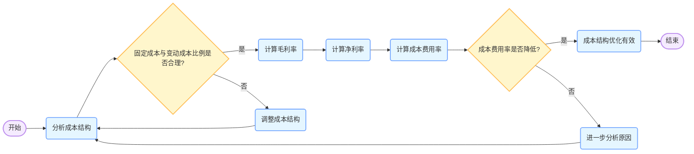

# 彼得林奇如何分析公司的成本结构优化能力与效果

> 关键词：彼得林奇、成本结构优化、公司分析、财务指标、盈利能力

> 摘要：本文深入探讨了投资大师彼得林奇分析公司成本结构优化能力与效果的方法。通过对相关概念的阐述、核心算法原理的剖析、数学模型的解读，结合实际项目案例和应用场景，详细展示了如何运用彼得林奇的思路来评估公司在成本控制方面的表现。同时，推荐了相关的学习资源、开发工具和研究论文，最后对未来发展趋势与挑战进行了总结，并解答了常见问题，为投资者和相关从业者提供了全面而深入的参考。

## 1. 背景介绍 
### 1.1 目的和范围
在投资领域，准确评估一家公司的成本结构优化能力与效果至关重要。彼得林奇作为投资界的传奇人物，他的投资理念和分析方法对众多投资者产生了深远影响。本文的目的是深入研究彼得林奇分析公司成本结构优化的具体方法和思路，帮助投资者更好地理解如何通过分析成本结构来评估公司的投资价值。范围涵盖了从基本概念的解释到实际应用案例的分析，以及相关工具和资源的推荐。

### 1.2 预期读者
本文预期读者包括对投资分析感兴趣的个人投资者、金融专业学生、从事金融研究和分析的专业人士，以及希望深入了解公司财务分析方法的企业管理者。

### 1.3 文档结构概述
本文将首先介绍与成本结构优化相关的核心概念和它们之间的联系，通过文本示意图和 Mermaid 流程图进行直观展示。接着阐述核心算法原理，并使用 Python 源代码详细说明具体操作步骤。然后引入数学模型和公式进行详细讲解，并举例说明其应用。之后通过实际项目案例，展示如何运用这些方法进行公司成本结构的分析。再介绍成本结构分析在不同实际场景中的应用。随后推荐相关的学习资源、开发工具和研究论文。最后对未来发展趋势与挑战进行总结，并解答常见问题，同时提供扩展阅读和参考资料。

### 1.4 术语表
#### 1.4.1 核心术语定义
- **成本结构优化**：指公司通过合理调整各项成本的比例和构成，以达到降低总成本、提高盈利能力和竞争力的目的。
- **毛利率**：是毛利与销售收入（或营业收入）的百分比，其中毛利是收入和与收入相对应的营业成本之间的差额，公式为：$毛利率 = \frac{营业收入 - 营业成本}{营业收入} \times 100\%$。
- **净利率**：是净利润与销售收入的百分比，反映了公司在扣除所有成本和费用后最终的盈利水平，公式为：$净利率 = \frac{净利润}{营业收入} \times 100\%$。
- **成本费用率**：是指企业在一定时期内的成本费用总额与营业收入的比率，反映了企业为取得收入而付出的代价，公式为：$成本费用率 = \frac{营业成本 + 期间费用}{营业收入} \times 100\%$。

#### 1.4.2 相关概念解释
- **固定成本**：是指在一定时期和一定业务量范围内，不受业务量增减变动影响而能保持不变的成本，如厂房租金、设备折旧等。
- **变动成本**：是指那些成本的总发生额在相关范围内随着业务量的变动而呈线性变动的成本，如原材料成本、直接人工成本等。
- **规模经济**：是指通过扩大生产规模而引起经济效益增加的现象。当企业的生产规模扩大时，单位产品的成本会随着产量的增加而降低，从而提高企业的盈利能力。

#### 1.4.3 缩略词列表
- **EBITDA**：Earnings Before Interest, Taxes, Depreciation and Amortization，即息税折旧摊销前利润，是衡量企业经营盈利能力的一个重要指标。

## 2. 核心概念与联系 
### 核心概念原理
公司的成本结构优化能力与效果涉及多个核心概念，这些概念相互关联，共同影响着公司的盈利能力和竞争力。

成本结构主要由固定成本和变动成本组成。固定成本在短期内相对稳定，而变动成本则随着业务量的变化而变化。通过合理调整固定成本和变动成本的比例，公司可以实现成本的有效控制。

毛利率反映了公司在扣除直接成本后剩余的利润空间，它是衡量公司产品或服务盈利能力的重要指标。净利率则考虑了所有成本和费用，更全面地反映了公司的盈利水平。成本费用率则直接体现了公司为取得收入所付出的代价，成本费用率越低，说明公司的成本控制能力越强。

### 架构的文本示意图
```plaintext
成本结构优化
|-- 固定成本
|   |-- 厂房租金
|   |-- 设备折旧
|-- 变动成本
|   |-- 原材料成本
|   |-- 直接人工成本
|-- 毛利率
|-- 净利率
|-- 成本费用率
```

### Mermaid 流程图


## 3. 核心算法原理 & 具体操作步骤 
### 核心算法原理
在分析公司的成本结构优化能力与效果时，主要通过计算和比较相关的财务指标来实现。以下是几个关键指标的计算原理：

#### 毛利率计算
毛利率的计算公式为：$毛利率 = \frac{营业收入 - 营业成本}{营业收入} \times 100\%$。通过计算毛利率，可以了解公司产品或服务在扣除直接成本后剩余的利润空间。毛利率越高，说明公司的产品或服务盈利能力越强。

#### 净利率计算
净利率的计算公式为：$净利率 = \frac{净利润}{营业收入} \times 100\%$。净利率考虑了所有成本和费用，包括营业成本、期间费用、税费等，更全面地反映了公司的盈利水平。

#### 成本费用率计算
成本费用率的计算公式为：$成本费用率 = \frac{营业成本 + 期间费用}{营业收入} \times 100\%$。成本费用率反映了公司为取得收入所付出的代价，成本费用率越低，说明公司的成本控制能力越强。

### 具体操作步骤及 Python 源代码
以下是使用 Python 实现上述指标计算的代码示例：

```python
# 定义计算毛利率的函数
def calculate_gross_margin(revenue, cost_of_goods_sold):
    """
    计算毛利率
    :param revenue: 营业收入
    :param cost_of_goods_sold: 营业成本
    :return: 毛利率
    """
    return ((revenue - cost_of_goods_sold) / revenue) * 100

# 定义计算净利率的函数
def calculate_net_profit_margin(revenue, net_profit):
    """
    计算净利率
    :param revenue: 营业收入
    :param net_profit: 净利润
    :return: 净利率
    """
    return (net_profit / revenue) * 100

# 定义计算成本费用率的函数
def calculate_cost_expense_ratio(revenue, cost_of_goods_sold, operating_expenses):
    """
    计算成本费用率
    :param revenue: 营业收入
    :param cost_of_goods_sold: 营业成本
    :param operating_expenses: 期间费用
    :return: 成本费用率
    """
    total_cost = cost_of_goods_sold + operating_expenses
    return (total_cost / revenue) * 100

# 示例数据
revenue = 1000000  # 营业收入
cost_of_goods_sold = 600000  # 营业成本
net_profit = 200000  # 净利润
operating_expenses = 150000  # 期间费用

# 计算各项指标
gross_margin = calculate_gross_margin(revenue, cost_of_goods_sold)
net_profit_margin = calculate_net_profit_margin(revenue, net_profit)
cost_expense_ratio = calculate_cost_expense_ratio(revenue, cost_of_goods_sold, operating_expenses)

# 输出结果
print(f"毛利率: {gross_margin:.2f}%")
print(f"净利率: {net_profit_margin:.2f}%")
print(f"成本费用率: {cost_expense_ratio:.2f}%")
```

### 代码解释
- `calculate_gross_margin` 函数：接受营业收入和营业成本作为参数，根据毛利率的计算公式返回毛利率。
- `calculate_net_profit_margin` 函数：接受营业收入和净利润作为参数，根据净利率的计算公式返回净利率。
- `calculate_cost_expense_ratio` 函数：接受营业收入、营业成本和期间费用作为参数，先计算总成本，再根据成本费用率的计算公式返回成本费用率。
- 示例数据部分定义了营业收入、营业成本、净利润和期间费用的值。
- 最后调用三个函数计算各项指标，并将结果输出，保留两位小数。

## 4. 数学模型和公式 & 详细讲解 & 举例说明 
### 数学模型和公式
#### 毛利率公式
$毛利率 = \frac{营业收入 - 营业成本}{营业收入} \times 100\%$

该公式反映了公司产品或服务在扣除直接成本后剩余的利润空间。毛利率越高，说明公司在生产或销售过程中能够获得更多的利润，产品或服务的盈利能力越强。

#### 净利率公式
$净利率 = \frac{净利润}{营业收入} \times 100\%$

净利率考虑了所有成本和费用，包括营业成本、期间费用、税费等，是衡量公司最终盈利水平的重要指标。净利率越高，说明公司的经营效益越好。

#### 成本费用率公式
$成本费用率 = \frac{营业成本 + 期间费用}{营业收入} \times 100\%$

成本费用率反映了公司为取得收入所付出的代价。成本费用率越低，说明公司在成本控制方面做得越好，能够以较低的成本获得较高的收入。

### 详细讲解
#### 毛利率
毛利率的高低受到多种因素的影响，如产品或服务的定价策略、原材料成本、生产效率等。如果公司能够通过优化生产流程、降低原材料采购成本等方式降低营业成本，同时保持较高的产品或服务价格，那么毛利率就会提高。

#### 净利率
净利率不仅受到毛利率的影响，还受到期间费用（如销售费用、管理费用、财务费用）和税费的影响。如果公司能够有效地控制期间费用，减少不必要的开支，同时合理规划税务，那么净利率就会提高。

#### 成本费用率
成本费用率是衡量公司成本控制能力的重要指标。降低成本费用率的方法包括优化成本结构、提高生产效率、降低管理费用等。通过降低成本费用率，公司可以提高盈利能力和竞争力。

### 举例说明
假设公司 A 和公司 B 都从事电子产品的生产和销售，以下是它们的财务数据：

| 公司 | 营业收入（元） | 营业成本（元） | 期间费用（元） | 净利润（元） |
| ---- | -------------- | -------------- | -------------- | ------------ |
| A    | 5000000        | 3000000        | 1000000        | 1000000      |
| B    | 8000000        | 5000000        | 2000000        | 1000000      |

#### 计算毛利率
- 公司 A 的毛利率：$毛利率_A = \frac{5000000 - 3000000}{5000000} \times 100\% = 40\%$
- 公司 B 的毛利率：$毛利率_B = \frac{8000000 - 5000000}{8000000} \times 100\% = 37.5\%$

从毛利率来看，公司 A 的产品盈利能力更强。

#### 计算净利率
- 公司 A 的净利率：$净利率_A = \frac{1000000}{5000000} \times 100\% = 20\%$
- 公司 B 的净利率：$净利率_B = \frac{1000000}{8000000} \times 100\% = 12.5\%$

公司 A 的净利率更高，说明其经营效益更好。

#### 计算成本费用率
- 公司 A 的成本费用率：$成本费用率_A = \frac{3000000 + 1000000}{5000000} \times 100\% = 80\%$
- 公司 B 的成本费用率：$成本费用率_B = \frac{5000000 + 2000000}{8000000} \times 100\% = 87.5\%$

公司 A 的成本费用率更低，说明其成本控制能力更强。

## 5. 项目实战：代码实际案例和详细解释说明 
### 5.1  开发环境搭建
#### 安装 Python
首先需要安装 Python 环境，建议使用 Python 3.7 及以上版本。可以从 Python 官方网站（https://www.python.org/downloads/）下载适合自己操作系统的安装包，按照安装向导进行安装。

#### 安装必要的库
在分析公司财务数据时，可能需要使用一些第三方库，如 `pandas` 用于数据处理和分析，`matplotlib` 用于数据可视化。可以使用以下命令进行安装：
```sh
pip install pandas matplotlib
```

### 5.2  源代码详细实现和代码解读
以下是一个使用 Python 读取公司财务数据文件（CSV 格式），计算各项财务指标，并进行可视化分析的示例代码：

```python
import pandas as pd
import matplotlib.pyplot as plt

# 读取财务数据文件
def read_financial_data(file_path):
    """
    读取财务数据文件
    :param file_path: 文件路径
    :return: 包含财务数据的 DataFrame
    """
    return pd.read_csv(file_path)

# 计算各项财务指标
def calculate_financial_metrics(data):
    """
    计算毛利率、净利率和成本费用率
    :param data: 包含财务数据的 DataFrame
    :return: 包含各项指标的 DataFrame
    """
    data['毛利率'] = ((data['营业收入'] - data['营业成本']) / data['营业收入']) * 100
    data['净利率'] = (data['净利润'] / data['营业收入']) * 100
    data['成本费用率'] = ((data['营业成本'] + data['期间费用']) / data['营业收入']) * 100
    return data

# 可视化分析
def visualize_metrics(data):
    """
    可视化毛利率、净利率和成本费用率的变化趋势
    :param data: 包含各项指标的 DataFrame
    """
    plt.figure(figsize=(12, 6))
    plt.plot(data['年份'], data['毛利率'], label='毛利率')
    plt.plot(data['年份'], data['净利率'], label='净利率')
    plt.plot(data['年份'], data['成本费用率'], label='成本费用率')
    plt.xlabel('年份')
    plt.ylabel('百分比')
    plt.title('财务指标变化趋势')
    plt.legend()
    plt.grid(True)
    plt.show()

# 主函数
def main():
    file_path = 'financial_data.csv'  # 财务数据文件路径
    data = read_financial_data(file_path)
    metrics_data = calculate_financial_metrics(data)
    visualize_metrics(metrics_data)

if __name__ == "__main__":
    main()
```

### 代码解读与分析
- `read_financial_data` 函数：使用 `pandas` 的 `read_csv` 函数读取 CSV 格式的财务数据文件，并返回一个包含财务数据的 `DataFrame`。
- `calculate_financial_metrics` 函数：根据毛利率、净利率和成本费用率的计算公式，在 `DataFrame` 中添加相应的列，计算并存储各项指标的值。
- `visualize_metrics` 函数：使用 `matplotlib` 库绘制毛利率、净利率和成本费用率随年份变化的折线图，以便直观地观察各项指标的变化趋势。
- `main` 函数：指定财务数据文件的路径，调用上述三个函数完成数据读取、指标计算和可视化分析的操作。

通过运行上述代码，可以对公司的财务数据进行分析，了解其成本结构优化的效果和趋势。

## 6. 实际应用场景 
### 投资者决策
对于个人投资者和机构投资者来说，分析公司的成本结构优化能力与效果是评估公司投资价值的重要环节。通过计算和比较毛利率、净利率、成本费用率等指标，投资者可以了解公司的盈利能力和成本控制能力，从而判断公司的发展潜力和投资风险。例如，如果一家公司的毛利率和净利率持续上升，成本费用率持续下降，说明公司的成本结构优化效果显著，具有较好的投资价值。

### 企业战略规划
企业管理者可以通过分析成本结构，找出成本控制的关键点，制定合理的成本优化策略。例如，如果企业的固定成本占比较高，可以考虑通过扩大生产规模、提高设备利用率等方式降低单位固定成本；如果变动成本占比较高，可以通过优化供应链管理、降低原材料采购成本等方式降低变动成本。

### 行业竞争分析
在同一行业中，比较不同公司的成本结构优化能力与效果，可以了解各公司的竞争优势和劣势。例如，在汽车制造行业中，如果一家公司的成本费用率明显低于其他竞争对手，说明该公司在成本控制方面具有优势，可能在市场竞争中获得更大的市场份额和利润空间。

### 财务风险管理
银行等金融机构在对企业进行贷款审批时，会关注企业的成本结构和盈利能力。通过分析企业的成本结构优化能力与效果，金融机构可以评估企业的还款能力和财务风险。如果企业的成本控制能力较强，盈利能力稳定，那么金融机构为其提供贷款的风险相对较低。

## 7. 工具和资源推荐
### 7.1 学习资源推荐
#### 7.1.1 书籍推荐
- 《彼得林奇的成功投资》：彼得林奇的经典著作，详细介绍了他的投资理念和方法，包括如何分析公司的基本面和财务状况。
- 《财务报表分析与证券定价》：系统地介绍了财务报表分析的方法和技巧，以及如何运用财务报表数据进行证券定价和投资决策。
- 《竞争战略》：迈克尔·波特的经典著作，阐述了企业如何通过制定竞争战略来获得竞争优势，其中涉及到成本领先战略等与成本结构优化相关的内容。

#### 7.1.2 在线课程
- Coursera 上的“Financial Markets”：由耶鲁大学教授罗伯特·席勒（Robert Shiller）授课，涵盖了金融市场的基本原理和投资分析方法。
- edX 上的“Financial Accounting Fundamentals”：提供了财务会计的基础知识和财务报表分析的方法。
- 中国大学 MOOC 上的“公司财务分析”：国内高校开设的课程，结合实际案例介绍了公司财务分析的方法和应用。

#### 7.1.3 技术博客和网站
- Seeking Alpha：提供了大量的股票分析和投资研究报告，其中包含了对公司成本结构和财务状况的分析。
- Investopedia：一个专业的金融教育网站，提供了丰富的金融术语解释、投资分析文章和教程。
- 雪球网：国内知名的投资社区，投资者可以在上面交流投资经验、分享公司分析报告，其中也涉及到对公司成本结构的讨论。

### 7.2 开发工具框架推荐
#### 7.2.1 IDE和编辑器
- PyCharm：一款专业的 Python 集成开发环境，具有代码编辑、调试、版本控制等功能，适合用于开发 Python 数据分析和可视化程序。
- Jupyter Notebook：一个交互式的开发环境，支持 Python、R 等多种编程语言，方便进行数据探索和分析。
- Visual Studio Code：一款轻量级的代码编辑器，支持多种编程语言和插件扩展，可用于编写 Python 代码和进行数据分析。

#### 7.2.2 调试和性能分析工具
- pdb：Python 内置的调试器，可以帮助开发者在代码运行过程中进行调试，查找和解决问题。
- cProfile：Python 标准库中的性能分析工具，可以统计代码中各个函数的执行时间和调用次数，帮助开发者找出性能瓶颈。
- Py-Spy：一个轻量级的 Python 性能分析工具，可以实时监测 Python 程序的性能，生成火焰图等可视化报告。

#### 7.2.3 相关框架和库
- pandas：一个强大的数据处理和分析库，提供了 DataFrame 等数据结构，方便进行数据清洗、转换和分析。
- matplotlib：一个常用的 Python 绘图库，可用于绘制各种类型的图表，如折线图、柱状图、散点图等，用于数据可视化。
- seaborn：基于 matplotlib 的高级数据可视化库，提供了更美观、更简洁的绘图接口，适合用于绘制统计图表。

### 7.3 相关论文著作推荐
#### 7.3.1 经典论文
- “The Cost of Capital, Corporation Finance and the Theory of Investment” by Franco Modigliani and Merton H. Miller：提出了著名的 MM 定理，探讨了企业资本结构与企业价值之间的关系。
- “A Behavioral Model of Rational Choice” by Herbert A. Simon：介绍了有限理性理论，对企业决策和成本管理产生了深远影响。
- “Competitive Advantage: Creating and Sustaining Superior Performance” by Michael E. Porter：提出了竞争优势理论，包括成本领先战略、差异化战略和集中化战略等。

#### 7.3.2 最新研究成果
- 可以通过学术数据库如 IEEE Xplore、ACM Digital Library、ScienceDirect 等搜索关于成本结构优化、财务管理和投资分析的最新研究论文。例如，搜索关键词“Cost Structure Optimization”、“Financial Performance Analysis”等。

#### 7.3.3 应用案例分析
- 许多商业杂志和财经媒体会发布公司的案例分析报告，如《哈佛商业评论》、《财经》等。这些报告通常会深入分析公司的成本结构优化策略和实施效果，为读者提供实际应用的参考。

## 8. 总结：未来发展趋势与挑战
### 未来发展趋势
#### 数字化转型推动成本结构优化
随着信息技术的快速发展，企业将越来越多地采用数字化技术来优化成本结构。例如，通过大数据分析和人工智能算法，企业可以更精准地预测市场需求，优化生产计划，降低库存成本；通过物联网技术，企业可以实现设备的远程监控和管理，提高设备的运行效率，降低维护成本。

#### 绿色发展成为成本优化的新方向
在全球气候变化和环保意识增强的背景下，企业将更加注重绿色发展，通过采用清洁能源、推广节能减排技术等方式，降低能源消耗和环境污染成本。同时，消费者对绿色产品和服务的需求也在不断增加，企业可以通过开发绿色产品和服务，提高产品的附加值，实现成本结构的优化。

#### 供应链协同优化成本
企业将更加注重与供应链上下游企业的协同合作，通过共享信息、优化物流配送、联合采购等方式，降低整个供应链的成本。例如，汽车制造企业可以与零部件供应商建立长期稳定的合作关系，共同研发新产品，优化生产工艺，降低采购成本和生产成本。

### 挑战
#### 数据安全和隐私问题
在数字化转型过程中，企业需要收集和处理大量的客户数据、生产数据和财务数据等。这些数据的安全和隐私保护成为企业面临的重要挑战。一旦数据泄露，不仅会给企业带来经济损失，还会损害企业的声誉。

#### 技术更新换代快
信息技术的发展日新月异，企业需要不断投入资源进行技术更新和升级，以保持竞争力。然而，技术更新换代快也给企业带来了挑战，企业需要准确判断技术发展趋势，选择合适的技术进行应用，避免盲目跟风导致资源浪费。

#### 市场不确定性增加
全球经济形势复杂多变，市场需求和竞争格局不断变化，企业面临的市场不确定性增加。在这种情况下，企业的成本结构优化策略需要更加灵活和适应性强，能够及时应对市场变化。

## 9. 附录：常见问题与解答
### 问题 1：如何判断一家公司的成本结构优化是否有效？
解答：可以通过计算和比较毛利率、净利率、成本费用率等指标来判断。如果毛利率和净利率持续上升，成本费用率持续下降，说明公司的成本结构优化效果显著；反之，如果这些指标出现恶化的趋势，说明公司的成本结构优化可能存在问题。

### 问题 2：成本结构优化是否意味着降低所有成本？
解答：不是的。成本结构优化的目标是通过合理调整各项成本的比例和构成，以达到降低总成本、提高盈利能力和竞争力的目的。在某些情况下，适当增加一些成本可能会带来更大的收益，例如增加研发投入可以提高产品的竞争力，从而带来更多的销售收入。

### 问题 3：如何分析公司的固定成本和变动成本？
解答：可以通过查看公司的财务报表和成本明细，将成本项目分为固定成本和变动成本。一般来说，厂房租金、设备折旧等属于固定成本，原材料成本、直接人工成本等属于变动成本。通过分析固定成本和变动成本的比例和变化趋势，可以了解公司的成本结构特点和成本控制能力。

### 问题 4：成本结构优化与公司的战略有什么关系？
解答：成本结构优化是公司战略的重要组成部分。不同的公司战略需要不同的成本结构支持。例如，成本领先战略要求公司通过降低成本来获得竞争优势，因此需要优化成本结构，降低各项成本；差异化战略则要求公司通过提供独特的产品或服务来获得竞争优势，可能需要在研发、营销等方面增加投入，成本结构也会相应调整。

## 10. 扩展阅读 & 参考资料
### 扩展阅读
- 《价值投资实战手册》：深入介绍了价值投资的理念和方法，包括如何分析公司的基本面和估值。
- 《聪明的投资者》：本杰明·格雷厄姆的经典著作，被誉为价值投资的圣经，对投资者的投资理念和行为产生了深远影响。
- 《创新者的窘境》：克莱顿·克里斯坦森的著作，探讨了企业在面对技术创新和市场变革时的困境和应对策略。

### 参考资料
- 公司的年度报告和财务报表：可以从公司的官方网站或证券交易所网站获取。
- 财经媒体和研究机构的报告：如《中国证券报》、《上海证券报》、中信证券研究报告等。
- 学术论文和研究成果：可以通过学术数据库如知网、万方、维普等搜索相关论文。

作者：AI天才研究院/AI Genius Institute & 禅与计算机程序设计艺术 /Zen And The Art of Computer Programming