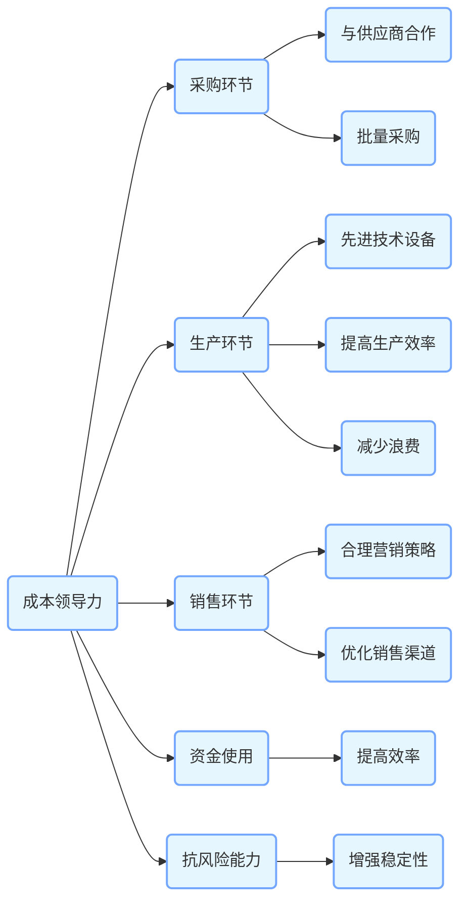

# 彼得林奇如何分析公司的成本领导力

> 关键词：彼得林奇、成本领导力、公司分析、竞争优势、财务指标

> 摘要：本文深入探讨了投资大师彼得林奇分析公司成本领导力的方法。成本领导力是企业在市场竞争中获取优势的关键因素之一，彼得林奇通过一系列独特的视角和方法来评估公司在成本控制方面的能力。文章从背景介绍入手，阐述了研究目的、预期读者和文档结构。接着详细讲解了成本领导力的核心概念、相关算法原理及数学模型，通过项目实战案例展示了如何在实际中运用这些方法进行公司分析。还探讨了成本领导力的实际应用场景，推荐了相关的学习资源、开发工具和论文著作。最后总结了未来发展趋势与挑战，并提供了常见问题解答和扩展阅读参考资料，旨在帮助读者全面理解彼得林奇分析公司成本领导力的精髓。

## 1. 背景介绍 
### 1.1 目的和范围
彼得林奇是投资界的传奇人物，他的投资理念和方法对众多投资者产生了深远影响。分析公司的成本领导力是评估公司竞争力和投资价值的重要环节。本文的目的在于深入剖析彼得林奇分析公司成本领导力的具体方法和思路，为投资者和企业管理者提供有价值的参考。范围涵盖了从基本概念的解释到实际案例的分析，以及相关资源的推荐等方面，旨在全面呈现彼得林奇分析成本领导力的全貌。

### 1.2 预期读者
本文预期读者主要包括对投资领域感兴趣的个人投资者，希望通过学习彼得林奇的分析方法来提高投资决策的准确性；企业管理者，期望借鉴成本领导力分析方法来优化企业运营和提升竞争力；以及金融专业的学生和研究人员，用于学术研究和实践应用。

### 1.3 文档结构概述
本文首先介绍了相关背景信息，包括目的、读者和结构概述等。接着阐述了成本领导力的核心概念及其与公司运营的联系，并通过流程图进行直观展示。然后详细讲解了分析成本领导力的核心算法原理和具体操作步骤，同时给出了相关的数学模型和公式，并举例说明。之后通过项目实战案例，展示了如何在实际中运用这些方法进行公司分析。随后探讨了成本领导力的实际应用场景，推荐了相关的学习资源、开发工具和论文著作。最后总结了未来发展趋势与挑战，提供了常见问题解答和扩展阅读参考资料。

### 1.4 术语表
#### 1.4.1 核心术语定义
- **成本领导力**：指企业通过有效管理和控制成本，使其产品或服务的成本低于竞争对手，从而在市场中获得竞争优势的能力。
- **规模经济**：随着生产规模的扩大，单位产品的成本逐渐降低的经济现象。
- **成本驱动因素**：影响企业成本水平的各种因素，如原材料价格、生产效率、管理费用等。

#### 1.4.2 相关概念解释
- **竞争优势**：企业在市场中相对于竞争对手所具有的优势，成本领导力是竞争优势的一种重要形式。
- **成本结构**：企业各项成本在总成本中所占的比例关系，不同的成本结构反映了企业的经营特点和成本控制重点。

#### 1.4.3 缩略词列表
- **ROE**：净资产收益率（Return on Equity），衡量企业盈利能力的重要指标。
- **EPS**：每股收益（Earnings Per Share），反映企业每股股票的盈利水平。

## 2. 核心概念与联系 

### 成本领导力的原理
成本领导力的核心原理在于企业通过降低成本，能够以更低的价格提供产品或服务，从而吸引更多的客户，扩大市场份额。同时，较低的成本也意味着企业在相同价格水平下能够获得更高的利润。企业实现成本领导力的途径主要包括规模经济、高效的生产流程、优化的供应链管理、严格的成本控制等。

### 成本领导力与公司运营的联系
成本领导力与公司的各个运营环节密切相关。在采购环节，通过与供应商建立长期稳定的合作关系、批量采购等方式，可以降低原材料的采购成本；在生产环节，采用先进的生产技术和设备、提高生产效率、减少生产过程中的浪费，可以降低生产成本；在销售环节，合理的营销策略和渠道选择可以降低销售费用。此外，良好的成本领导力还可以提高企业的资金使用效率，增强企业的抗风险能力。

### 文本示意图
以下是成本领导力与公司运营各环节的关系示意图：

成本领导力
|--采购环节
|   |--与供应商合作
|   |--批量采购
|--生产环节
|   |--先进技术设备
|   |--提高生产效率
|   |--减少浪费
|--销售环节
|   |--合理营销策略
|   |--优化销售渠道
|--资金使用
|   |--提高效率
|--抗风险能力
|   |--增强稳定性

### Mermaid 流程图


## 3. 核心算法原理 & 具体操作步骤 

### 成本分析算法原理
在分析公司的成本领导力时，我们可以采用成本比率分析的方法。成本比率是指各项成本与销售收入的比值，通过分析不同时期和不同企业之间的成本比率，可以了解企业的成本控制情况。以下是一个简单的 Python 代码示例，用于计算成本比率：

```python
def calculate_cost_ratio(cost, revenue):
    """
    计算成本比率
    :param cost: 成本金额
    :param revenue: 销售收入
    :return: 成本比率
    """
    if revenue == 0:
        return 0
    return cost / revenue

# 示例数据
cost = 50000
revenue = 100000

# 计算成本比率
ratio = calculate_cost_ratio(cost, revenue)
print(f"成本比率: {ratio * 100:.2f}%")
```

### 具体操作步骤
1. **数据收集**：收集公司的财务报表，包括利润表、资产负债表等，从中获取各项成本和销售收入的数据。
2. **成本分类**：将成本分为直接成本和间接成本。直接成本是与生产产品或提供服务直接相关的成本，如原材料成本、直接人工成本等；间接成本是与生产过程间接相关的成本，如管理费用、销售费用等。
3. **计算成本比率**：分别计算各项成本与销售收入的比率，得到不同类型的成本比率，如毛利率（(销售收入 - 直接成本) / 销售收入）、净利率（净利润 / 销售收入）等。
4. **比较分析**：将计算得到的成本比率与同行业其他公司进行比较，或者与公司自身的历史数据进行比较，分析成本控制的优势和劣势。
5. **深入分析成本驱动因素**：针对成本比率较高的项目，进一步分析其成本驱动因素，找出导致成本上升的原因，并提出相应的改进措施。

## 4. 数学模型和公式 & 详细讲解 & 举例说明 

### 成本比率公式
- **毛利率（Gross Profit Margin）**：
$$Gross\ Profit\ Margin = \frac{Revenue - Cost\ of\ Goods\ Sold}{Revenue} \times 100\%$$
其中，$Revenue$ 表示销售收入，$Cost\ of\ Goods\ Sold$ 表示销售成本。毛利率反映了企业在扣除直接成本后剩余的利润空间，毛利率越高，说明企业在生产环节的成本控制越好。

例如，某公司的销售收入为 200 万元，销售成本为 120 万元，则其毛利率为：
$$Gross\ Profit\ Margin = \frac{200 - 120}{200} \times 100\% = 40\%$$

- **净利率（Net Profit Margin）**：
$$Net\ Profit\ Margin = \frac{Net\ Income}{Revenue} \times 100\%$$
其中，$Net\ Income$ 表示净利润。净利率反映了企业在扣除所有成本和费用后最终的盈利水平，净利率越高，说明企业的整体成本控制和盈利能力越强。

例如，某公司的销售收入为 300 万元，净利润为 60 万元，则其净利率为：
$$Net\ Profit\ Margin = \frac{60}{300} \times 100\% = 20\%$$

### 成本弹性分析公式
成本弹性是指成本变动率与业务量变动率的比值，用于衡量成本对业务量变化的敏感程度。公式如下：
$$Cost\ Elasticity = \frac{\%\ Change\ in\ Cost}{\%\ Change\ in\ Volume}$$

例如，某公司的业务量从 1000 件增加到 1200 件，成本从 50000 元增加到 55000 元，则业务量变动率为：
$$\%\ Change\ in\ Volume = \frac{1200 - 1000}{1000} \times 100\% = 20\%$$
成本变动率为：
$$\%\ Change\ in\ Cost = \frac{55000 - 50000}{50000} \times 100\% = 10\%$$
成本弹性为：
$$Cost\ Elasticity = \frac{10\%}{20\%} = 0.5$$
成本弹性小于 1 说明成本的变动幅度小于业务量的变动幅度，企业具有一定的规模经济效应。

## 5. 项目实战：代码实际案例和详细解释说明 

### 5.1  开发环境搭建
在进行项目实战之前，需要搭建相应的开发环境。以下是具体步骤：
1. **安装 Python**：从 Python 官方网站（https://www.python.org/downloads/）下载并安装 Python 3.x 版本。
2. **安装必要的库**：使用 pip 命令安装所需的库，如 pandas、numpy 等。
```sh
pip install pandas numpy
```
3. **选择开发工具**：可以选择 PyCharm、Jupyter Notebook 等开发工具。

### 5.2  源代码详细实现和代码解读
以下是一个使用 Python 分析公司成本领导力的实际案例，假设我们有一个包含公司财务数据的 CSV 文件 `financial_data.csv`，文件内容包括年份、销售收入、销售成本、管理费用、销售费用等。

```python
import pandas as pd

# 读取数据
data = pd.read_csv('financial_data.csv')

# 计算毛利率
data['Gross Profit Margin'] = (data['Revenue'] - data['Cost of Goods Sold']) / data['Revenue']

# 计算净利率
data['Net Profit Margin'] = data['Net Income'] / data['Revenue']

# 打印结果
print(data[['Year', 'Gross Profit Margin', 'Net Profit Margin']])
```

### 代码解读与分析
1. **导入必要的库**：使用 `import pandas as pd` 导入 pandas 库，用于数据处理和分析。
2. **读取数据**：使用 `pd.read_csv('financial_data.csv')` 读取 CSV 文件中的财务数据。
3. **计算毛利率和净利率**：通过 `data['Gross Profit Margin'] = (data['Revenue'] - data['Cost of Goods Sold']) / data['Revenue']` 和 `data['Net Profit Margin'] = data['Net Income'] / data['Revenue']` 分别计算毛利率和净利率。
4. **打印结果**：使用 `print(data[['Year', 'Gross Profit Margin', 'Net Profit Margin']])` 打印出年份、毛利率和净利率的数据。

通过对这些数据的分析，我们可以了解公司在不同年份的成本控制情况和盈利能力。如果毛利率和净利率呈现上升趋势，说明公司的成本领导力在不断增强；反之，如果呈现下降趋势，则需要进一步分析原因，找出成本控制方面存在的问题。

## 6. 实际应用场景 
### 投资决策
投资者在选择投资标的时，会关注公司的成本领导力。具有成本优势的公司在市场竞争中更具稳定性和盈利能力，能够为投资者带来更高的回报。通过分析公司的成本比率、成本弹性等指标，投资者可以评估公司的成本控制能力，从而做出更明智的投资决策。

### 企业战略规划
企业管理者在制定战略规划时，需要考虑成本领导力的因素。通过优化成本结构、降低成本驱动因素的影响，企业可以提高自身的竞争力，实现可持续发展。例如，企业可以通过引入先进的生产技术、优化供应链管理等方式来降低成本，提高市场份额。

### 行业竞争分析
在分析行业竞争态势时，成本领导力是一个重要的考量因素。通过比较不同企业的成本比率和成本控制能力，可以了解行业内企业的竞争格局。成本领先的企业往往能够在价格竞争中占据优势，挤压竞争对手的市场空间。

## 7. 工具和资源推荐
### 7.1 学习资源推荐
#### 7.1.1 书籍推荐
- 《彼得林奇的成功投资》：彼得林奇的经典著作，详细介绍了他的投资理念和方法，包括如何分析公司的基本面和竞争力。
- 《竞争优势：创造与保持优异业绩》：迈克尔·波特的著作，深入探讨了企业竞争优势的来源和构建方法，对理解成本领导力有重要的参考价值。
- 《财务报表分析与证券定价》：介绍了如何通过分析财务报表来评估企业的价值和投资潜力，对于分析公司的成本领导力有很大的帮助。

#### 7.1.2 在线课程
- Coursera 上的“Financial Markets”课程：由耶鲁大学教授罗伯特·席勒讲授，涵盖了金融市场的各个方面，包括公司财务分析和投资决策。
- edX 上的“Introduction to Financial Accounting”课程：提供了财务会计的基础知识，有助于理解公司的财务报表和成本核算方法。

#### 7.1.3 技术博客和网站
- Seeking Alpha：一个知名的金融投资博客网站，提供了大量的公司分析和投资建议，包括对公司成本领导力的分析。
- Investopedia：一个专业的金融知识学习网站，提供了丰富的金融术语解释和投资分析文章。

### 7.2 开发工具框架推荐
#### 7.2.1 IDE和编辑器
- PyCharm：一款专业的 Python 集成开发环境，提供了丰富的代码编辑、调试和分析功能，适合进行数据分析和处理。
- Jupyter Notebook：一个交互式的编程环境，支持多种编程语言，方便进行数据可视化和代码演示。

#### 7.2.2 调试和性能分析工具
- pdb：Python 内置的调试器，用于调试 Python 代码，定位和解决代码中的问题。
- cProfile：Python 内置的性能分析工具，用于分析代码的性能瓶颈，优化代码的执行效率。

#### 7.2.3 相关框架和库
- pandas：一个强大的数据处理和分析库，提供了丰富的数据结构和函数，方便进行数据清洗、转换和分析。
- numpy：一个用于科学计算的 Python 库，提供了高效的数组操作和数学函数，是数据分析和机器学习的基础库。

### 7.3 相关论文著作推荐
#### 7.3.1 经典论文
- Porter, M. E. (1985). Competitive Advantage: Creating and Sustaining Superior Performance. Harvard Business School Press. 该论文提出了企业竞争优势的三种基本战略，包括成本领先战略，对成本领导力的研究具有重要的理论基础。
- Kaplan, R. S., & Norton, D. P. (1992). The balanced scorecard—measures that drive performance. Harvard Business Review, 70(1), 71-79. 该论文提出了平衡计分卡的概念，强调了从多个维度评估企业绩效，包括成本控制方面。

#### 7.3.2 最新研究成果
- Recent research on cost leadership strategies in the digital economy. 该研究探讨了数字经济时代企业成本领导力战略的新特点和发展趋势。
- The impact of supply chain management on cost leadership. 该研究分析了供应链管理对企业成本领导力的影响机制。

#### 7.3.3 应用案例分析
- Case studies of companies achieving cost leadership through innovative production processes. 该案例分析了一些企业通过创新生产流程实现成本领先的成功经验。
- Analysis of cost leadership strategies in the retail industry. 该案例分析了零售业中企业成本领导力战略的应用和效果。

## 8. 总结：未来发展趋势与挑战
### 未来发展趋势
- **数字化转型推动成本优化**：随着数字化技术的不断发展，企业将更多地利用大数据、人工智能等技术来优化成本管理。例如，通过数据分析可以精准地识别成本驱动因素，实现成本的精细化控制；利用人工智能算法可以优化生产计划和供应链管理，降低运营成本。
- **绿色成本成为新的竞争因素**：在环保意识日益增强的背景下，企业的绿色成本将逐渐成为影响成本领导力的重要因素。采用环保材料、减少能源消耗等绿色举措虽然可能会增加短期成本，但从长期来看，有助于提升企业的品牌形象和市场竞争力。
- **供应链协同提升成本优势**：未来企业将更加注重与供应链上下游企业的协同合作，通过信息共享、资源整合等方式，实现供应链的整体成本优化。例如，企业可以与供应商共同研发新产品，降低原材料成本；与物流企业合作，优化物流配送方案，降低物流成本。

### 挑战
- **技术更新换代快**：数字化技术的快速发展使得企业需要不断投入资源进行技术更新和升级，以保持成本管理的竞争力。这对于一些中小企业来说可能是一个巨大的挑战，因为他们可能缺乏足够的资金和技术实力。
- **市场不确定性增加**：全球经济形势的不确定性、贸易保护主义的抬头等因素，给企业的成本管理带来了更大的挑战。原材料价格波动、汇率变动等因素可能会导致企业成本的大幅上升，影响企业的成本领导力。
- **人才短缺**：成本领导力的实现需要具备专业知识和技能的人才，包括财务分析、数据分析、供应链管理等方面的人才。然而，目前市场上这类人才相对短缺，企业在吸引和留住人才方面面临一定的困难。

## 9. 附录：常见问题与解答
### 问题 1：如何判断一个公司是否具有成本领导力？
解答：可以通过分析公司的成本比率（如毛利率、净利率）、成本弹性等指标，并与同行业其他公司进行比较。如果公司的成本比率较低且成本弹性较小，说明公司在成本控制方面具有优势，可能具有成本领导力。此外，还可以考察公司的生产流程、供应链管理、成本控制措施等方面，综合判断公司的成本领导力。

### 问题 2：成本领导力是否意味着低价策略？
解答：成本领导力并不完全等同于低价策略。虽然具有成本优势的企业可以通过降低价格来吸引更多的客户，但这并不是唯一的策略。企业还可以通过保持与竞争对手相同的价格水平，获得更高的利润；或者将节省下来的成本投入到产品研发、品牌建设等方面，提升产品的附加值和竞争力。

### 问题 3：如何提高公司的成本领导力？
解答：提高公司的成本领导力可以从多个方面入手。在采购环节，可以与供应商建立长期稳定的合作关系，争取更优惠的采购价格；在生产环节，采用先进的生产技术和设备，提高生产效率，减少生产过程中的浪费；在管理环节，优化组织架构，降低管理费用；在销售环节，合理选择销售渠道，降低销售费用。此外，还可以通过数据分析等手段，精准地识别成本驱动因素，制定针对性的成本控制措施。

## 10. 扩展阅读 & 参考资料
- 彼得林奇的其他著作，如《战胜华尔街》等。
- 迈克尔·波特的其他相关著作，如《国家竞争优势》等。
- 相关的金融杂志和报纸，如《财经》《华尔街日报》等。
- 各公司的年度报告和财务报表，可以从公司官方网站或证券交易所网站获取。

作者：AI天才研究院/AI Genius Institute & 禅与计算机程序设计艺术 /Zen And The Art of Computer Programming