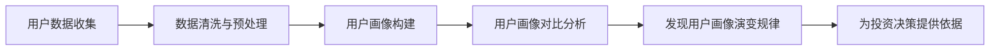

# 彼得林奇如何分析公司的用户画像演变

> 关键词：彼得林奇、公司分析、用户画像演变、投资分析、市场研究

> 摘要：本文深入探讨了投资大师彼得林奇分析公司用户画像演变的方法。首先介绍了研究该内容的背景、目的和预期读者等信息。接着阐述了用户画像演变的核心概念及相关联系，详细讲解了分析过程中涉及的核心算法原理和具体操作步骤，并结合数学模型和公式进行说明。通过项目实战部分的代码案例展示了如何运用这些方法进行实际分析。同时探讨了该分析方法在实际中的应用场景，推荐了相关的学习资源、开发工具和论文著作。最后总结了未来发展趋势与挑战，并提供了常见问题的解答和扩展阅读参考资料，旨在帮助投资者和相关从业者更好地理解和运用彼得林奇的分析方法。

## 1. 背景介绍 
### 1.1 目的和范围
彼得林奇是投资界的传奇人物，他的投资理念和分析方法对全球投资者产生了深远的影响。分析公司的用户画像演变对于投资者了解公司的市场定位、市场份额变化以及未来发展潜力至关重要。本文的目的在于深入剖析彼得林奇分析公司用户画像演变的具体方法和思路，帮助投资者掌握这一重要的投资分析技巧。范围涵盖了从基本概念的介绍到实际案例的分析，以及相关工具和资源的推荐。

### 1.2 预期读者
本文预期读者主要包括对投资分析感兴趣的个人投资者、金融从业者、企业市场调研人员以及相关专业的学生。对于希望学习彼得林奇投资方法、深入了解公司市场动态的人群具有较高的参考价值。

### 1.3 文档结构概述
本文首先介绍相关背景信息，让读者对研究内容有一个初步的认识。接着阐述核心概念与联系，为后续的分析打下基础。然后详细讲解核心算法原理和具体操作步骤，结合数学模型和公式进行深入分析。通过项目实战部分展示如何将理论应用到实际中。之后探讨实际应用场景，为读者提供更多的思路。推荐相关的工具和资源，帮助读者进一步学习和实践。最后总结未来发展趋势与挑战，解答常见问题，并提供扩展阅读和参考资料。

### 1.4 术语表
#### 1.4.1 核心术语定义
- **用户画像**：是指通过收集与分析用户的人口统计学信息、消费行为、兴趣爱好等数据，而抽象出来的代表某一类用户的虚拟人物模型。
- **用户画像演变**：指随着时间推移，公司的用户画像在各个维度上发生的变化，如年龄结构、消费偏好、地域分布等。
- **投资分析**：是指通过对各种投资对象（如股票、债券等）的风险、收益等因素进行评估和研究，以帮助投资者做出合理投资决策的过程。

#### 1.4.2 相关概念解释
- **市场定位**：公司根据目标市场的需求和竞争状况，确定自身产品或服务在市场中的位置和特色。用户画像演变与市场定位密切相关，了解用户画像演变有助于公司调整市场定位。
- **市场份额**：指公司的产品或服务在特定市场中所占的比例。用户画像的变化可能会影响公司的市场份额，通过分析用户画像演变可以预测市场份额的变化趋势。

#### 1.4.3 缩略词列表
- **CRM**：Customer Relationship Management，客户关系管理，是一种通过信息技术手段管理企业与客户之间关系的方法。
- **AI**：Artificial Intelligence，人工智能，在用户画像分析中可用于数据挖掘和预测。

## 2. 核心概念与联系 

### 核心概念原理
用户画像演变分析的核心原理是基于数据驱动的方法，通过收集和分析公司用户在不同时间点的各种数据，发现用户特征的变化规律。这些数据可以包括用户的基本信息（如年龄、性别、职业等）、消费行为（如购买频率、购买金额、购买品类等）、线上行为（如浏览页面、搜索关键词等）。通过对这些数据的分析，可以构建出不同时期的用户画像，进而对比分析用户画像的演变情况。

### 架构的文本示意图
```plaintext
用户数据收集 -> 数据清洗与预处理 -> 用户画像构建 -> 用户画像对比分析 -> 发现用户画像演变规律 -> 为投资决策提供依据
```

### Mermaid 流程图


## 3. 核心算法原理 & 具体操作步骤 

### 核心算法原理
在分析公司用户画像演变时，常用的算法包括聚类分析、主成分分析和时间序列分析等。下面以聚类分析为例，详细讲解其原理和在 Python 中的实现。

聚类分析是一种无监督学习算法，其目的是将数据集中相似的数据点划分为不同的簇（cluster）。在用户画像分析中，可以根据用户的特征将用户划分为不同的群体，每个群体代表一种类型的用户。随着时间的推移，对比不同时期的用户聚类结果，就可以发现用户画像的演变。

### 具体操作步骤及 Python 代码实现

#### 步骤 1：数据收集
假设我们已经从公司的数据库中获取了用户的基本信息和消费行为数据，存储在一个 CSV 文件中。以下是读取数据的 Python 代码：
```python
import pandas as pd

# 读取数据
data = pd.read_csv('user_data.csv')
```

#### 步骤 2：数据清洗与预处理
在进行聚类分析之前，需要对数据进行清洗和预处理，包括处理缺失值、标准化数据等。
```python
# 处理缺失值
data = data.dropna()

# 选择需要的特征
features = ['age', 'purchase_frequency', 'purchase_amount']
X = data[features]

# 数据标准化
from sklearn.preprocessing import StandardScaler
scaler = StandardScaler()
X_scaled = scaler.fit_transform(X)
```

#### 步骤 3：聚类分析
使用 K-Means 算法进行聚类分析。
```python
from sklearn.cluster import KMeans

# 确定聚类的数量
k = 3  # 假设分为 3 类
kmeans = KMeans(n_clusters=k, random_state=42)
kmeans.fit(X_scaled)

# 将聚类结果添加到原始数据中
data['cluster'] = kmeans.labels_
```

#### 步骤 4：对比不同时期的聚类结果
假设我们有两个不同时期的数据，分别存储在 `user_data_1.csv` 和 `user_data_2.csv` 中，以下是对比两个时期聚类结果的代码：
```python
# 读取两个时期的数据
data_1 = pd.read_csv('user_data_1.csv')
data_2 = pd.read_csv('user_data_2.csv')

# 重复步骤 2 和步骤 3 对两个时期的数据进行处理
# 处理第一个时期的数据
data_1 = data_1.dropna()
X_1 = data_1[features]
X_1_scaled = scaler.fit_transform(X_1)
kmeans_1 = KMeans(n_clusters=k, random_state=42)
kmeans_1.fit(X_1_scaled)
data_1['cluster'] = kmeans_1.labels_

# 处理第二个时期的数据
data_2 = data_2.dropna()
X_2 = data_2[features]
X_2_scaled = scaler.fit_transform(X_2)
kmeans_2 = KMeans(n_clusters=k, random_state=42)
kmeans_2.fit(X_2_scaled)
data_2['cluster'] = kmeans_2.labels_

# 对比两个时期的聚类结果
cluster_counts_1 = data_1['cluster'].value_counts()
cluster_counts_2 = data_2['cluster'].value_counts()

print("第一个时期的聚类结果：")
print(cluster_counts_1)
print("第二个时期的聚类结果：")
print(cluster_counts_2)
```

## 4. 数学模型和公式 & 详细讲解 & 举例说明 

### 聚类分析的数学模型和公式
在 K-Means 聚类算法中，目标是最小化所有数据点到其所属簇中心的距离之和。具体来说，设数据集 $X = \{x_1, x_2, \cdots, x_n\}$，其中 $x_i \in \mathbb{R}^d$ 表示第 $i$ 个数据点，$d$ 是数据点的维度。假设将数据集划分为 $k$ 个簇，簇中心分别为 $c_1, c_2, \cdots, c_k$，每个簇中心 $c_j \in \mathbb{R}^d$。

K-Means 算法的目标是最小化以下目标函数：
$$
J = \sum_{i=1}^{n} \sum_{j=1}^{k} r_{ij} \| x_i - c_j \|^2
$$
其中，$r_{ij}$ 是一个指示变量，当数据点 $x_i$ 属于第 $j$ 个簇时，$r_{ij} = 1$，否则 $r_{ij} = 0$。$\| x_i - c_j \|^2$ 表示数据点 $x_i$ 到簇中心 $c_j$ 的欧几里得距离的平方。

### 详细讲解
K-Means 算法通过迭代的方式来求解上述目标函数的最小值。具体步骤如下：
1. **初始化簇中心**：随机选择 $k$ 个数据点作为初始的簇中心。
2. **分配数据点**：对于每个数据点 $x_i$，计算它到所有簇中心的距离，将其分配到距离最近的簇中。
3. **更新簇中心**：对于每个簇，计算该簇中所有数据点的均值，将其作为新的簇中心。
4. **重复步骤 2 和步骤 3**：直到簇中心不再发生变化或达到最大迭代次数。

### 举例说明
假设我们有一个二维数据集 $X = \{(1, 2), (2, 3), (8, 9), (9, 10)\}$，我们希望将其划分为 $k = 2$ 个簇。

#### 步骤 1：初始化簇中心
随机选择两个数据点作为初始簇中心，假设选择 $(1, 2)$ 和 $(8, 9)$ 作为初始簇中心 $c_1$ 和 $c_2$。

#### 步骤 2：分配数据点
- 对于数据点 $(1, 2)$，它到 $c_1$ 的距离为 $\| (1, 2) - (1, 2) \|^2 = 0$，到 $c_2$ 的距离为 $\| (1, 2) - (8, 9) \|^2 = (1 - 8)^2 + (2 - 9)^2 = 49 + 49 = 98$，因此将其分配到簇 1。
- 对于数据点 $(2, 3)$，它到 $c_1$ 的距离为 $\| (2, 3) - (1, 2) \|^2 = (2 - 1)^2 + (3 - 2)^2 = 2$，到 $c_2$ 的距离为 $\| (2, 3) - (8, 9) \|^2 = (2 - 8)^2 + (3 - 9)^2 = 36 + 36 = 72$，因此将其分配到簇 1。
- 对于数据点 $(8, 9)$，它到 $c_1$ 的距离为 $\| (8, 9) - (1, 2) \|^2 = (8 - 1)^2 + (9 - 2)^2 = 49 + 49 = 98$，到 $c_2$ 的距离为 $\| (8, 9) - (8, 9) \|^2 = 0$，因此将其分配到簇 2。
- 对于数据点 $(9, 10)$，它到 $c_1$ 的距离为 $\| (9, 10) - (1, 2) \|^2 = (9 - 1)^2 + (10 - 2)^2 = 64 + 64 = 128$，到 $c_2$ 的距离为 $\| (9, 10) - (8, 9) \|^2 = (9 - 8)^2 + (10 - 9)^2 = 2$，因此将其分配到簇 2。

#### 步骤 3：更新簇中心
- 簇 1 中的数据点为 $(1, 2)$ 和 $(2, 3)$，新的簇中心 $c_1$ 为这两个点的均值，即 $c_1 = (\frac{1 + 2}{2}, \frac{2 + 3}{2}) = (1.5, 2.5)$。
- 簇 2 中的数据点为 $(8, 9)$ 和 $(9, 10)$，新的簇中心 $c_2$ 为这两个点的均值，即 $c_2 = (\frac{8 + 9}{2}, \frac{9 + 10}{2}) = (8.5, 9.5)$。

#### 步骤 4：重复步骤 2 和步骤 3
继续迭代，直到簇中心不再发生变化或达到最大迭代次数。

## 5. 项目实战：代码实际案例和详细解释说明 

### 5.1  开发环境搭建
在进行项目实战之前，需要搭建好开发环境。以下是具体步骤：
1. **安装 Python**：可以从 Python 官方网站（https://www.python.org/downloads/）下载并安装 Python 3.x 版本。
2. **安装必要的库**：使用 `pip` 命令安装所需的库，包括 `pandas`、`numpy`、`scikit-learn` 等。
```bash
pip install pandas numpy scikit-learn
```
3. **选择开发工具**：可以选择使用 Jupyter Notebook、PyCharm 等开发工具。

### 5.2  源代码详细实现和代码解读
以下是一个完整的项目实战代码示例，用于分析公司用户画像的演变：
```python
import pandas as pd
from sklearn.preprocessing import StandardScaler
from sklearn.cluster import KMeans

# 读取两个时期的数据
data_1 = pd.read_csv('user_data_1.csv')
data_2 = pd.read_csv('user_data_2.csv')

# 数据清洗与预处理
def preprocess_data(data):
    # 处理缺失值
    data = data.dropna()
    # 选择需要的特征
    features = ['age', 'purchase_frequency', 'purchase_amount']
    X = data[features]
    # 数据标准化
    scaler = StandardScaler()
    X_scaled = scaler.fit_transform(X)
    return X_scaled

# 对两个时期的数据进行预处理
X_1_scaled = preprocess_data(data_1)
X_2_scaled = preprocess_data(data_2)

# 聚类分析
k = 3  # 假设分为 3 类
kmeans_1 = KMeans(n_clusters=k, random_state=42)
kmeans_1.fit(X_1_scaled)
data_1['cluster'] = kmeans_1.labels_

kmeans_2 = KMeans(n_clusters=k, random_state=42)
kmeans_2.fit(X_2_scaled)
data_2['cluster'] = kmeans_2.labels_

# 对比两个时期的聚类结果
cluster_counts_1 = data_1['cluster'].value_counts()
cluster_counts_2 = data_2['cluster'].value_counts()

print("第一个时期的聚类结果：")
print(cluster_counts_1)
print("第二个时期的聚类结果：")
print(cluster_counts_2)
```

### 代码解读与分析
1. **数据读取**：使用 `pandas` 库的 `read_csv` 函数读取两个不同时期的用户数据文件。
2. **数据预处理**：定义 `preprocess_data` 函数，用于处理缺失值、选择需要的特征并进行数据标准化。
3. **聚类分析**：使用 K-Means 算法对两个时期的数据分别进行聚类分析，并将聚类结果添加到原始数据中。
4. **结果对比**：计算两个时期的聚类结果中每个簇的数量，并打印输出，以便对比分析用户画像的演变情况。

## 6. 实际应用场景 
### 投资决策
投资者可以通过分析公司用户画像的演变，了解公司的市场定位是否发生变化，以及市场份额的变化趋势。如果公司的用户画像逐渐向高价值客户群体演变，说明公司的产品或服务可能具有更高的竞争力，投资价值也可能更高。

### 市场策略调整
公司可以根据用户画像的演变情况，调整市场策略。例如，如果发现年轻用户群体的比例逐渐增加，可以针对年轻用户的需求和偏好，开发新的产品或服务，调整营销策略。

### 产品研发
了解用户画像的演变有助于公司更好地把握用户需求的变化，从而指导产品研发。例如，如果用户对产品的智能化需求逐渐增加，公司可以加大在智能化方面的研发投入。

## 7. 工具和资源推荐
### 7.1 学习资源推荐
#### 7.1.1 书籍推荐
- 《彼得林奇的成功投资》：彼得林奇的经典著作，详细介绍了他的投资理念和分析方法。
- 《数据挖掘：概念与技术》：全面介绍了数据挖掘的基本概念、算法和应用，对于学习用户画像分析有很大帮助。
- 《Python 数据分析实战》：通过实际案例介绍了如何使用 Python 进行数据分析，包括数据清洗、预处理、可视化等。

#### 7.1.2 在线课程
- Coursera 上的“数据科学基础”课程：涵盖了数据科学的基本概念、工具和技术，适合初学者学习。
- edX 上的“机器学习”课程：由知名教授授课，系统介绍了机器学习的算法和应用。
- 网易云课堂上的“用户画像分析实战”课程：专门针对用户画像分析进行讲解，通过实际案例帮助学员掌握相关技能。

#### 7.1.3 技术博客和网站
- Medium：有很多数据科学和投资领域的优质博客文章，可以获取最新的技术和观点。
- Kaggle：是一个数据科学竞赛平台，上面有很多关于用户画像分析的数据集和优秀的解决方案。
- 开源中国：提供了丰富的技术文章和开源项目，对于学习和实践有很大帮助。

### 7.2 开发工具框架推荐
#### 7.2.1 IDE和编辑器
- Jupyter Notebook：是一个交互式的开发环境，适合进行数据探索和分析，支持 Python、R 等多种编程语言。
- PyCharm：是一款专业的 Python 集成开发环境，提供了丰富的代码编辑、调试和版本控制功能。
- Visual Studio Code：是一款轻量级的代码编辑器，支持多种编程语言和插件扩展，非常适合快速开发。

#### 7.2.2 调试和性能分析工具
- Py-Spy：是一个用于分析 Python 程序性能的工具，可以帮助开发者找出程序中的性能瓶颈。
- pdb：是 Python 自带的调试工具，可以在代码中设置断点，逐步调试程序。
- TensorBoard：是 TensorFlow 提供的可视化工具，可以用于监控模型训练过程和分析模型性能。

#### 7.2.3 相关框架和库
- Pandas：是一个用于数据处理和分析的 Python 库，提供了丰富的数据结构和数据操作方法。
- NumPy：是 Python 科学计算的基础库，提供了高效的数组操作和数学函数。
- Scikit-learn：是一个用于机器学习的 Python 库，包含了各种机器学习算法和工具，如聚类分析、分类、回归等。

### 7.3 相关论文著作推荐
#### 7.3.1 经典论文
- “K-Means++: The Advantages of Careful Seeding”：介绍了 K-Means 算法的改进版本 K-Means++，提高了算法的聚类效果。
- “Data Mining: A Tutorial-Based Primer”：对数据挖掘的基本概念和算法进行了系统的介绍。
- “User Profiling for Personalized Recommendation”：探讨了用户画像在个性化推荐系统中的应用。

#### 7.3.2 最新研究成果
可以通过学术搜索引擎（如 Google Scholar、IEEE Xplore 等）搜索关于用户画像演变分析的最新研究论文，了解该领域的最新发展动态。

#### 7.3.3 应用案例分析
- 《金融科技案例集》：收录了金融领域的各种应用案例，包括用户画像分析在金融风险评估、客户细分等方面的应用。
- 《互联网企业数据分析案例》：介绍了互联网企业如何通过数据分析进行用户画像构建和市场策略调整。

## 8. 总结：未来发展趋势与挑战
### 未来发展趋势
- **智能化分析**：随着人工智能技术的不断发展，用户画像演变分析将越来越智能化。例如，使用深度学习算法可以更准确地挖掘用户数据中的潜在信息，预测用户画像的未来变化趋势。
- **多源数据融合**：未来的用户画像演变分析将不仅仅依赖于公司内部的用户数据，还会融合社交媒体数据、物联网数据等多源数据，以更全面地了解用户。
- **实时分析**：在快速变化的市场环境中，实时分析用户画像的演变变得越来越重要。公司需要能够及时获取和分析用户数据，以便快速调整市场策略。

### 挑战
- **数据隐私和安全**：随着用户数据的大量收集和使用，数据隐私和安全问题变得越来越突出。公司需要采取有效的措施保护用户数据的安全，遵守相关的法律法规。
- **数据质量问题**：用户数据可能存在缺失值、错误值等质量问题，这会影响用户画像演变分析的准确性。公司需要建立完善的数据质量管理体系，提高数据质量。
- **算法复杂度和计算资源**：一些先进的分析算法（如深度学习算法）具有较高的复杂度，需要大量的计算资源。公司需要在算法选择和计算资源配置方面进行合理的权衡。

## 9. 附录：常见问题与解答
### 问题 1：如何确定聚类的数量 $k$？
答：确定聚类的数量 $k$ 是一个比较困难的问题，常用的方法有肘部法则（Elbow Method）和轮廓系数法（Silhouette Coefficient Method）。肘部法则通过绘制不同 $k$ 值下的目标函数值（如 K-Means 算法中的 $J$ 值）与 $k$ 的关系曲线，找到曲线的“肘部”，即目标函数值下降速度突然变缓的点，该点对应的 $k$ 值即为合适的聚类数量。轮廓系数法通过计算每个数据点的轮廓系数，选择平均轮廓系数最大的 $k$ 值作为合适的聚类数量。

### 问题 2：如果数据集中存在异常值，会对聚类分析产生什么影响？
答：异常值可能会对聚类分析产生较大的影响。由于聚类算法通常是基于距离度量的，异常值可能会远离其他数据点，导致聚类中心发生偏移，从而影响聚类结果的准确性。在进行聚类分析之前，需要对数据进行异常值检测和处理，常用的方法包括基于统计的方法（如 Z-Score 方法）和基于机器学习的方法（如 Isolation Forest 算法）。

### 问题 3：如何将用户画像演变分析的结果应用到投资决策中？
答：可以从以下几个方面将用户画像演变分析的结果应用到投资决策中：
- **评估公司的市场竞争力**：如果公司的用户画像逐渐向高价值客户群体演变，说明公司的产品或服务具有更高的竞争力，投资价值可能更高。
- **预测公司的未来发展趋势**：通过分析用户画像的演变趋势，可以预测公司未来的市场份额和营收增长情况，从而判断公司的投资潜力。
- **比较不同公司的用户画像演变情况**：在选择投资对象时，可以比较不同公司的用户画像演变情况，选择用户画像演变趋势较好的公司进行投资。

## 10. 扩展阅读 & 参考资料
### 扩展阅读
- 《金融市场技术分析》：介绍了金融市场的技术分析方法，对于投资者了解市场趋势和投资时机有很大帮助。
- 《大数据时代》：探讨了大数据对社会、经济和生活的影响，有助于读者了解数据驱动的决策方法。
- 《创新者的窘境》：分析了企业在面对技术创新时的困境和应对策略，对于理解公司的发展和竞争有一定的启示。

### 参考资料
- Lynch, Peter. One Up on Wall Street: How to Use What You Already Know to Make Money in the Market. Simon & Schuster, 1989.
- Han, Jiawei, Jian Pei, and Jiong Yang. Data Mining: Concepts and Techniques. Morgan Kaufmann, 2011.
- VanderPlas, Jake. Python Data Science Handbook: Essential Tools for Working with Data. O'Reilly Media, 2016.

作者：AI天才研究院/AI Genius Institute & 禅与计算机程序设计艺术 /Zen And The Art of Computer Programming