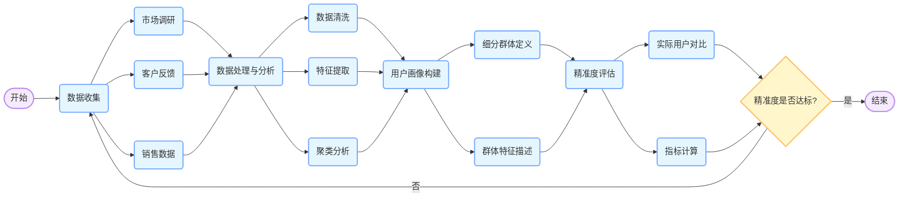

# 彼得林奇如何分析公司的用户画像精准度

> 关键词：彼得林奇、公司分析、用户画像精准度、投资分析、市场调研

> 摘要：本文深入探讨彼得林奇分析公司用户画像精准度的方法和理念。彼得林奇作为投资界的传奇人物，其投资策略中对公司用户画像精准度的分析有着独特且实用的方式。文章首先介绍相关背景知识，包括目的、预期读者等；接着阐述核心概念与联系，分析核心算法原理和操作步骤；通过数学模型和公式对其方法进行详细解读；给出项目实战案例，包括开发环境搭建、代码实现和解读；探讨实际应用场景；推荐相关工具和资源；最后总结未来发展趋势与挑战，解答常见问题并提供扩展阅读和参考资料，帮助读者全面理解和应用彼得林奇的分析方法。

## 1. 背景介绍 
### 1.1 目的和范围
本文旨在深入剖析彼得林奇分析公司用户画像精准度的方法和策略。目的是让投资者、分析师以及对公司市场分析感兴趣的人士，能够借鉴彼得林奇的经验，更准确地评估公司的市场定位和目标用户群体，从而做出更明智的投资决策或市场战略规划。范围涵盖彼得林奇分析方法的原理、实际操作步骤、数学模型以及在实际项目中的应用等方面。

### 1.2 预期读者
预期读者包括专业投资者，他们可以从彼得林奇的方法中获取新的分析视角和思路，优化投资组合；金融分析师，通过学习该方法提高对公司基本面的分析能力；市场营销人员，借鉴其对用户画像的分析方法，提升市场调研和目标客户定位的精准度；以及对投资和市场分析有兴趣的普通读者，帮助他们了解专业的分析方法和理念。

### 1.3 文档结构概述
本文将按照以下结构展开：首先介绍核心概念与联系，明确相关概念的定义和相互关系；接着阐述核心算法原理和具体操作步骤，并使用 Python 代码进行详细说明；然后通过数学模型和公式对分析方法进行深入讲解，并举例说明；随后给出项目实战案例，包括开发环境搭建、源代码实现和代码解读；探讨该方法在实际应用中的场景；推荐相关的学习资源、开发工具和论文著作；最后总结未来发展趋势与挑战，解答常见问题并提供扩展阅读和参考资料。

### 1.4 术语表
#### 1.4.1 核心术语定义
- **用户画像**：是指通过收集与分析用户的社会属性、生活习惯、消费行为等主要信息的数据之后，抽象出的一个用户的商业全貌。它是企业应用大数据技术的基本方式，为企业提供了足够的信息基础，能够帮助企业快速找到精准用户群体以及用户需求等更为广泛的反馈信息。
- **用户画像精准度**：指用户画像所描述的用户特征与实际用户特征的符合程度。精准度越高，说明画像越能准确反映目标用户群体的真实情况。
- **市场细分**：是指企业按照某种标准将市场上的顾客划分成若干个顾客群，每一个顾客群构成一个子市场，不同子市场之间，需求存在着明显的差别。

#### 1.4.2 相关概念解释
- **投资分析**：是指通过对经济、行业和公司的基本面进行研究，评估投资对象的价值和风险，以确定是否值得投资以及投资的时机和规模。
- **市场调研**：是一种把消费者及公共部门和市场联系起来的特定活动，即通过信息把消费者、顾客和公共部门或市场联系起来的活动。这些信息用以识别和界定市场营销机会和问题，产生、改进和评价营销活动，监控营销绩效，增进对营销过程的理解。

#### 1.4.3 缩略词列表
- **CRM**：Customer Relationship Management，客户关系管理，是指企业为提高核心竞争力，利用相应的信息技术以及互联网技术协调企业与顾客间在销售、营销和服务上的交互，从而提升其管理方式，向客户提供创新式的个性化的客户交互和服务的过程。

## 2. 核心概念与联系 

### 核心概念原理
彼得林奇分析公司用户画像精准度的核心原理在于深入了解公司的业务、产品和市场，通过多维度的数据收集和分析，构建准确反映目标用户特征的画像，并评估画像与实际用户的匹配程度。

用户画像的构建基于多个维度的信息，包括但不限于用户的年龄、性别、收入水平、消费习惯、兴趣爱好等。这些信息可以通过市场调研、客户反馈、销售数据等渠道获取。通过对这些数据的分析和整合，可以将用户划分为不同的细分群体，每个群体具有相似的特征和需求。

精准的用户画像对于公司的重要性不言而喻。它可以帮助公司更好地了解目标客户的需求和偏好，从而优化产品设计、制定精准的营销策略、提高客户满意度和忠诚度。对于投资者来说，准确的用户画像可以反映公司的市场定位和竞争力，是评估公司投资价值的重要因素之一。

### 架构的文本示意图
```plaintext
用户画像精准度分析
|-- 数据收集
|   |-- 市场调研
|   |-- 客户反馈
|   |-- 销售数据
|-- 数据处理与分析
|   |-- 数据清洗
|   |-- 特征提取
|   |-- 聚类分析
|-- 用户画像构建
|   |-- 细分群体定义
|   |-- 群体特征描述
|-- 精准度评估
|   |-- 实际用户对比
|   |-- 指标计算
```

### Mermaid 流程图


## 3. 核心算法原理 & 具体操作步骤 

### 核心算法原理
彼得林奇分析公司用户画像精准度的核心算法主要基于聚类分析和相似度计算。聚类分析用于将用户数据划分为不同的群体，每个群体具有相似的特征；相似度计算用于评估构建的用户画像与实际用户的匹配程度。

#### 聚类分析
常用的聚类算法有 K-Means 算法。K-Means 算法的基本思想是将数据集划分为 $K$ 个簇，使得簇内的数据点尽可能相似，簇间的数据点尽可能不同。具体步骤如下：
1. 随机选择 $K$ 个数据点作为初始聚类中心。
2. 计算每个数据点到各个聚类中心的距离，将数据点分配到距离最近的聚类中心所在的簇。
3. 重新计算每个簇的聚类中心。
4. 重复步骤 2 和 3，直到聚类中心不再发生变化或达到最大迭代次数。

#### 相似度计算
常用的相似度计算方法有余弦相似度。余弦相似度通过计算两个向量的夹角余弦值来评估它们的相似度。对于两个向量 $\vec{A}$ 和 $\vec{B}$，余弦相似度的计算公式为：
$$
\cos(\theta) = \frac{\vec{A} \cdot \vec{B}}{\|\vec{A}\| \|\vec{B}\|}
$$
其中，$\vec{A} \cdot \vec{B}$ 表示向量 $\vec{A}$ 和 $\vec{B}$ 的点积，$\|\vec{A}\|$ 和 $\|\vec{B}\|$ 分别表示向量 $\vec{A}$ 和 $\vec{B}$ 的模。

### 具体操作步骤
#### 步骤 1：数据收集
收集与公司用户相关的数据，包括市场调研数据、客户反馈数据、销售数据等。这些数据可以通过问卷调查、访谈、数据库查询等方式获取。

#### 步骤 2：数据处理与分析
1. **数据清洗**：去除数据中的噪声、缺失值和异常值，确保数据的质量。
2. **特征提取**：从原始数据中提取有用的特征，例如用户的年龄、性别、收入水平、消费金额等。
3. **聚类分析**：使用 K-Means 算法对提取的特征进行聚类，将用户划分为不同的群体。

#### 步骤 3：用户画像构建
1. **细分群体定义**：根据聚类结果，定义不同的细分用户群体。
2. **群体特征描述**：对每个细分群体的特征进行描述，例如平均年龄、平均收入、主要消费偏好等。

#### 步骤 4：精准度评估
1. **实际用户对比**：将构建的用户画像与实际用户数据进行对比，计算每个细分群体的相似度。
2. **指标计算**：使用余弦相似度等指标评估用户画像的精准度。

### Python 代码实现
```python
import numpy as np
from sklearn.cluster import KMeans
from sklearn.metrics.pairwise import cosine_similarity

# 步骤 1：数据收集（假设已经收集到数据）
data = np.array([[25, 5000, 1000], [30, 6000, 1500], [22, 4000, 800], [35, 7000, 2000]])

# 步骤 2：数据处理与分析
# 数据清洗（这里简单假设数据已经清洗好）
# 特征提取（数据已经是特征形式）

# 聚类分析
kmeans = KMeans(n_clusters=2, random_state=42)
kmeans.fit(data)
labels = kmeans.labels_

# 步骤 3：用户画像构建
# 细分群体定义
group_1 = data[labels == 0]
group_2 = data[labels == 1]

# 群体特征描述
group_1_mean = np.mean(group_1, axis=0)
group_2_mean = np.mean(group_2, axis=0)

# 步骤 4：精准度评估
# 假设实际用户数据
actual_data = np.array([[26, 5200, 1100], [32, 6200, 1600], [23, 4100, 900], [36, 7100, 2100]])

# 计算每个群体的实际用户均值
actual_group_1 = actual_data[labels == 0]
actual_group_2 = actual_data[labels == 1]
actual_group_1_mean = np.mean(actual_group_1, axis=0)
actual_group_2_mean = np.mean(actual_group_2, axis=0)

# 计算相似度
similarity_1 = cosine_similarity([group_1_mean], [actual_group_1_mean])
similarity_2 = cosine_similarity([group_2_mean], [actual_group_2_mean])

print(f"群体 1 的相似度: {similarity_1[0][0]}")
print(f"群体 2 的相似度: {similarity_2[0][0]}")
```

## 4. 数学模型和公式 & 详细讲解 & 举例说明 

### K-Means 算法数学模型
K-Means 算法的目标是最小化所有数据点到其所属聚类中心的距离平方和，即：
$$
\min \sum_{i=1}^{K} \sum_{x_j \in C_i} \|x_j - \mu_i\|^2
$$
其中，$K$ 是聚类的数量，$C_i$ 是第 $i$ 个聚类，$x_j$ 是第 $j$ 个数据点，$\mu_i$ 是第 $i$ 个聚类的中心。

### 详细讲解
K-Means 算法通过迭代的方式不断更新聚类中心，使得目标函数逐渐收敛到最小值。具体步骤如下：
1. **初始化聚类中心**：随机选择 $K$ 个数据点作为初始聚类中心 $\mu_1, \mu_2, \cdots, \mu_K$。
2. **分配数据点**：对于每个数据点 $x_j$，计算其到各个聚类中心的距离 $\|x_j - \mu_i\|$，将 $x_j$ 分配到距离最近的聚类中心所在的聚类 $C_i$。
3. **更新聚类中心**：对于每个聚类 $C_i$，重新计算其中心 $\mu_i$，即该聚类中所有数据点的平均值：
$$
\mu_i = \frac{1}{|C_i|} \sum_{x_j \in C_i} x_j
$$
其中，$|C_i|$ 是聚类 $C_i$ 中数据点的数量。
4. **重复步骤 2 和 3**：直到聚类中心不再发生变化或达到最大迭代次数。

### 举例说明
假设我们有以下 6 个数据点：$x_1 = [1, 2], x_2 = [2, 1], x_3 = [4, 5], x_4 = [5, 4], x_5 = [8, 9], x_6 = [9, 8]$，我们要将它们划分为 2 个聚类。

#### 步骤 1：初始化聚类中心
随机选择 $x_1$ 和 $x_3$ 作为初始聚类中心，即 $\mu_1 = [1, 2]$，$\mu_2 = [4, 5]$。

#### 步骤 2：分配数据点
计算每个数据点到 $\mu_1$ 和 $\mu_2$ 的距离，将数据点分配到距离最近的聚类中心所在的聚类。例如，对于 $x_2$：
$$
\|x_2 - \mu_1\| = \sqrt{(2 - 1)^2 + (1 - 2)^2} = \sqrt{2}
$$
$$
\|x_2 - \mu_2\| = \sqrt{(2 - 4)^2 + (1 - 5)^2} = \sqrt{20}
$$
因为 $\|x_2 - \mu_1\| < \|x_2 - \mu_2\|$，所以 $x_2$ 分配到聚类 $C_1$。

#### 步骤 3：更新聚类中心
假设分配结果为 $C_1 = \{x_1, x_2\}$，$C_2 = \{x_3, x_4, x_5, x_6\}$，则更新聚类中心：
$$
\mu_1 = \frac{[1, 2] + [2, 1]}{2} = [1.5, 1.5]
$$
$$
\mu_2 = \frac{[4, 5] + [5, 4] + [8, 9] + [9, 8]}{4} = [6.5, 6.5]
$$

#### 步骤 4：重复步骤 2 和 3
继续迭代，直到聚类中心不再发生变化或达到最大迭代次数。

### 余弦相似度数学模型
余弦相似度的计算公式为：
$$
\cos(\theta) = \frac{\vec{A} \cdot \vec{B}}{\|\vec{A}\| \|\vec{B}\|}
$$
其中，$\vec{A}$ 和 $\vec{B}$ 是两个向量，$\vec{A} \cdot \vec{B}$ 表示向量 $\vec{A}$ 和 $\vec{B}$ 的点积，$\|\vec{A}\|$ 和 $\|\vec{B}\|$ 分别表示向量 $\vec{A}$ 和 $\vec{B}$ 的模。

### 详细讲解
余弦相似度的取值范围是 $[-1, 1]$，值越接近 1 表示两个向量越相似，值越接近 -1 表示两个向量越不相似。当两个向量的夹角为 $0$ 度时，余弦相似度为 1；当两个向量的夹角为 $180$ 度时，余弦相似度为 -1。

### 举例说明
假设我们有两个向量 $\vec{A} = [1, 2, 3]$ 和 $\vec{B} = [2, 4, 6]$，则：
$$
\vec{A} \cdot \vec{B} = 1 \times 2 + 2 \times 4 + 3 \times 6 = 2 + 8 + 18 = 28
$$
$$
\|\vec{A}\| = \sqrt{1^2 + 2^2 + 3^2} = \sqrt{14}
$$
$$
\|\vec{B}\| = \sqrt{2^2 + 4^2 + 6^2} = \sqrt{56} = 2\sqrt{14}
$$
$$
\cos(\theta) = \frac{28}{\sqrt{14} \times 2\sqrt{14}} = 1
$$
因为 $\cos(\theta) = 1$，所以向量 $\vec{A}$ 和 $\vec{B}$ 完全相似。

## 5. 项目实战：代码实际案例和详细解释说明 

### 5.1  开发环境搭建
#### 安装 Python
首先，确保你已经安装了 Python。可以从 Python 官方网站（https://www.python.org/downloads/）下载并安装适合你操作系统的 Python 版本。建议安装 Python 3.6 及以上版本。

#### 安装必要的库
使用以下命令安装所需的库：
```sh
pip install numpy scikit-learn
```
`numpy` 是一个用于科学计算的 Python 库，提供了高效的数组操作功能。`scikit-learn` 是一个用于机器学习的 Python 库，包含了许多常用的机器学习算法和工具。

### 5.2  源代码详细实现和代码解读
```python
import numpy as np
from sklearn.cluster import KMeans
from sklearn.metrics.pairwise import cosine_similarity

# 步骤 1：数据收集（模拟数据）
# 假设我们有 10 个用户的数据，每个用户有 3 个特征（年龄、收入、消费金额）
data = np.array([
    [25, 5000, 1000], [30, 6000, 1500], [22, 4000, 800], [35, 7000, 2000],
    [28, 5500, 1200], [32, 6500, 1600], [24, 4500, 900], [33, 6800, 1800],
    [26, 5200, 1100], [31, 6200, 1400]
])

# 步骤 2：数据处理与分析
# 数据清洗（这里简单假设数据已经清洗好）
# 特征提取（数据已经是特征形式）

# 聚类分析
# 假设我们将用户划分为 2 个群体
kmeans = KMeans(n_clusters=2, random_state=42)
kmeans.fit(data)
labels = kmeans.labels_

# 步骤 3：用户画像构建
# 细分群体定义
group_1 = data[labels == 0]
group_2 = data[labels == 1]

# 群体特征描述
group_1_mean = np.mean(group_1, axis=0)
group_2_mean = np.mean(group_2, axis=0)

# 步骤 4：精准度评估
# 假设实际用户数据
actual_data = np.array([
    [26, 5200, 1100], [32, 6200, 1600], [23, 4100, 900], [36, 7100, 2100],
    [29, 5600, 1300], [33, 6600, 1700], [25, 4600, 1000], [34, 6900, 1900],
    [27, 5300, 1200], [32, 6300, 1500]
])

# 计算每个群体的实际用户均值
actual_group_1 = actual_data[labels == 0]
actual_group_2 = actual_data[labels == 1]
actual_group_1_mean = np.mean(actual_group_1, axis=0)
actual_group_2_mean = np.mean(actual_group_2, axis=0)

# 计算相似度
similarity_1 = cosine_similarity([group_1_mean], [actual_group_1_mean])
similarity_2 = cosine_similarity([group_2_mean], [actual_group_2_mean])

print(f"群体 1 的相似度: {similarity_1[0][0]}")
print(f"群体 2 的相似度: {similarity_2[0][0]}")
```

### 5.3  代码解读与分析
#### 数据收集
使用 `numpy` 数组模拟了 10 个用户的数据，每个用户有 3 个特征（年龄、收入、消费金额）。在实际应用中，这些数据可以通过市场调研、数据库查询等方式获取。

#### 数据处理与分析
使用 `KMeans` 算法对用户数据进行聚类分析，将用户划分为 2 个群体。`random_state` 参数用于保证结果的可重复性。

#### 用户画像构建
根据聚类结果，将用户划分为两个群体 `group_1` 和 `group_2`，并计算每个群体的特征均值 `group_1_mean` 和 `group_2_mean`，作为用户画像的描述。

#### 精准度评估
模拟了实际用户数据 `actual_data`，并根据聚类标签将实际用户数据划分为两个群体 `actual_group_1` 和 `actual_group_2`。计算每个群体的实际特征均值 `actual_group_1_mean` 和 `actual_group_2_mean`。使用 `cosine_similarity` 函数计算构建的用户画像与实际用户画像的相似度。

最后，打印出每个群体的相似度，相似度越接近 1 表示用户画像越精准。

## 6. 实际应用场景 
### 投资决策
投资者可以通过分析公司的用户画像精准度，评估公司的市场定位和竞争力。如果公司的用户画像精准度高，说明公司能够准确地了解目标客户的需求和偏好，从而制定更有效的营销策略和产品规划，提高市场份额和盈利能力。相反，如果用户画像精准度低，公司可能会面临市场定位不准确、产品与需求不匹配等问题，投资风险相对较高。

### 市场营销
市场营销人员可以利用用户画像精准度分析，优化市场调研和目标客户定位。通过构建准确的用户画像，营销人员可以更精准地选择营销渠道、制定营销策略，提高营销效果和投资回报率。例如，对于年轻、高收入、喜欢时尚的用户群体，可以选择在社交媒体平台上进行时尚产品的推广；对于中年、中等收入、注重品质的用户群体，可以选择在传统媒体上进行高品质产品的宣传。

### 产品设计
产品设计人员可以根据用户画像精准度分析的结果，优化产品设计。了解目标用户的需求和偏好后，产品设计人员可以在产品功能、外观、包装等方面进行针对性的设计，提高产品的用户满意度和竞争力。例如，对于学生群体，可以设计价格实惠、功能实用的电子产品；对于商务人士，可以设计高端、便捷的商务用品。

### 客户关系管理
客户关系管理部门可以利用用户画像精准度分析，提供个性化的客户服务。根据用户画像，了解每个客户的需求和偏好，为客户提供定制化的服务和解决方案，提高客户满意度和忠诚度。例如，对于经常购买某类产品的客户，可以提供专属的优惠活动和个性化的推荐。

## 7. 工具和资源推荐
### 7.1 学习资源推荐
#### 7.1.1 书籍推荐
- 《彼得·林奇的成功投资》：彼得·林奇亲自撰写的投资经典著作，详细介绍了他的投资理念和方法，包括如何分析公司基本面、寻找有潜力的股票等。
- 《市场营销管理》：菲利普·科特勒的经典著作，全面介绍了市场营销的理论和实践，包括市场调研、目标市场选择、营销策略制定等内容。
- 《Python 数据分析实战》：介绍了使用 Python 进行数据分析的方法和技巧，包括数据处理、可视化、机器学习等方面的内容，对于实现用户画像精准度分析有很大帮助。

#### 7.1.2 在线课程
- Coursera 上的“机器学习”课程：由斯坦福大学教授 Andrew Ng 主讲，系统介绍了机器学习的基本概念、算法和应用，对于理解聚类分析、相似度计算等核心算法有很大帮助。
- edX 上的“数据分析与可视化”课程：介绍了使用 Python 进行数据分析和可视化的方法和工具，对于处理和分析用户数据有很大帮助。
- 网易云课堂上的“市场营销实战”课程：结合实际案例，介绍了市场营销的策略和方法，对于将用户画像精准度分析应用于市场营销有很大启发。

#### 7.1.3 技术博客和网站
- 掘金：一个面向开发者的技术社区，有很多关于数据分析、机器学习、市场营销等方面的技术文章和案例分享。
- 知乎：一个知识分享平台，有很多关于投资、市场营销、数据分析等方面的专业人士分享经验和见解。
- Kaggle：一个数据科学竞赛平台，有很多关于数据分析、机器学习的数据集和优秀的解决方案，可以学习到很多实用的技巧和方法。

### 7.2 开发工具框架推荐
#### 7.2.1 IDE和编辑器
- PyCharm：一款专业的 Python 集成开发环境，提供了丰富的代码编辑、调试、测试等功能，适合开发 Python 数据分析和机器学习项目。
- Jupyter Notebook：一个交互式的开发环境，可以方便地进行代码编写、数据可视化和结果展示，适合进行数据分析和机器学习的实验和探索。
- Visual Studio Code：一款轻量级的代码编辑器，支持多种编程语言，安装相应的插件后可以进行 Python 开发，具有丰富的扩展功能。

#### 7.2.2 调试和性能分析工具
- pdb：Python 内置的调试器，可以帮助开发者逐行调试代码，查找和解决代码中的问题。
- cProfile：Python 内置的性能分析工具，可以分析代码的运行时间和函数调用情况，帮助开发者优化代码性能。
- Py-Spy：一个用于分析 Python 程序性能的工具，可以实时监控 Python 程序的运行状态，找出性能瓶颈。

#### 7.2.3 相关框架和库
- NumPy：一个用于科学计算的 Python 库，提供了高效的数组操作功能，是数据分析和机器学习的基础库。
- Pandas：一个用于数据处理和分析的 Python 库，提供了丰富的数据结构和数据操作方法，方便进行数据清洗、转换和分析。
- Scikit-learn：一个用于机器学习的 Python 库，包含了许多常用的机器学习算法和工具，如聚类分析、分类、回归等。
- Matplotlib：一个用于数据可视化的 Python 库，可以绘制各种类型的图表，如折线图、柱状图、散点图等，帮助开发者直观地展示数据。

### 7.3 相关论文著作推荐
#### 7.3.1 经典论文
- “K-Means++: The Advantages of Careful Seeding”：介绍了 K-Means++ 算法，一种改进的 K-Means 算法初始化方法，可以提高聚类结果的质量。
- “Introduction to Information Retrieval”：介绍了信息检索的基本概念、算法和应用，包括相似度计算等内容。
- “Customer Relationship Management: Emerging Concepts, Tools, and Applications”：探讨了客户关系管理的理论和实践，对于将用户画像精准度分析应用于客户关系管理有很大帮助。

#### 7.3.2 最新研究成果
- 在 ACM SIGKDD、IEEE ICDM 等数据挖掘领域的顶级会议上，有很多关于用户画像、聚类分析、相似度计算等方面的最新研究成果。可以关注这些会议的论文，了解最新的技术和方法。
- 在 Marketing Science、Journal of Marketing Research 等市场营销领域的顶级期刊上，有很多关于市场细分、目标客户定位等方面的最新研究成果。可以关注这些期刊的论文，了解市场营销领域的最新趋势和方法。

#### 7.3.3 应用案例分析
- 《案例分析：基于用户画像的精准营销实践》：通过实际案例，介绍了如何利用用户画像进行精准营销，包括市场调研、用户画像构建、营销策略制定等方面的内容。
- 《投资案例分析：如何通过用户画像评估公司投资价值》：通过实际投资案例，介绍了如何利用用户画像精准度分析评估公司的投资价值，包括分析方法、指标计算、决策依据等方面的内容。

## 8. 总结：未来发展趋势与挑战
### 未来发展趋势
#### 多源数据融合
未来，用户画像精准度分析将越来越依赖于多源数据的融合。除了传统的市场调研、销售数据等，还将结合社交媒体数据、物联网数据、地理位置数据等，更全面、准确地了解用户的特征和行为。

#### 人工智能与机器学习的深度应用
人工智能和机器学习技术将在用户画像精准度分析中得到更深入的应用。例如，使用深度学习算法进行图像识别、自然语言处理等，从非结构化数据中提取有用的信息；使用强化学习算法优化用户画像的构建和更新过程。

#### 实时动态分析
随着数据的实时性要求越来越高，用户画像精准度分析将向实时动态分析方向发展。能够实时获取和处理用户数据，及时更新用户画像，以适应市场变化和用户需求的动态变化。

#### 跨行业应用
用户画像精准度分析将不再局限于传统的投资、营销等领域，将逐渐应用于更多的行业，如医疗、教育、金融等。通过分析用户画像，为不同行业提供个性化的服务和解决方案。

### 挑战
#### 数据隐私和安全问题
随着数据的大量收集和使用，数据隐私和安全问题日益突出。在进行用户画像精准度分析时，需要确保数据的合法收集、存储和使用，保护用户的隐私和安全。

#### 数据质量问题
数据质量直接影响用户画像精准度分析的结果。数据中可能存在噪声、缺失值、异常值等问题，需要进行有效的数据清洗和预处理，提高数据质量。

#### 算法复杂度和可解释性问题
一些复杂的机器学习算法虽然可以提高用户画像精准度分析的准确性，但算法复杂度较高，解释性较差。在实际应用中，需要平衡算法的准确性和可解释性，以便决策者能够理解和应用分析结果。

#### 市场变化和用户需求的动态性
市场和用户需求是不断变化的，用户画像需要及时更新和调整。如何快速、准确地捕捉市场变化和用户需求的动态性，是用户画像精准度分析面临的一个挑战。

## 9. 附录：常见问题与解答
### 问题 1：如何确定聚类的数量 $K$？
答：确定聚类的数量 $K$ 是 K-Means 算法的一个关键问题。常用的方法有肘部法则（Elbow Method）和轮廓系数法（Silhouette Coefficient Method）。肘部法则通过绘制不同 $K$ 值下的目标函数值（所有数据点到其所属聚类中心的距离平方和）与 $K$ 的关系曲线，找到曲线的“肘部”，即目标函数值下降速度突然变缓的点，该点对应的 $K$ 值即为合适的聚类数量。轮廓系数法通过计算每个数据点的轮廓系数，评估聚类的质量，选择轮廓系数最大的 $K$ 值作为合适的聚类数量。

### 问题 2：如果数据中存在缺失值，应该如何处理？
答：处理缺失值的方法有多种，常见的方法包括：
- 删除包含缺失值的数据点：如果缺失值的比例较小，可以直接删除包含缺失值的数据点。但这种方法可能会导致数据量减少，影响分析结果的准确性。
- 填充缺失值：可以使用均值、中位数、众数等统计量填充缺失值。也可以使用机器学习算法，如回归分析、决策树等，根据其他特征预测缺失值。
- 多重插补法：通过多次随机填充缺失值，生成多个数据集，对每个数据集进行分析，最后综合分析结果。

### 问题 3：如何评估用户画像精准度分析的结果？
答：评估用户画像精准度分析的结果可以从多个方面进行，常见的指标包括：
- 相似度指标：如余弦相似度、欧氏距离等，用于评估构建的用户画像与实际用户画像的相似程度。
- 准确率指标：如分类准确率、召回率等，用于评估用户画像在分类任务中的准确性。
- 业务指标：如销售额、客户满意度等，用于评估用户画像精准度分析对业务的实际影响。

### 问题 4：用户画像精准度分析是否适用于所有类型的公司？
答：用户画像精准度分析适用于大多数类型的公司，但在不同行业和公司中，其应用的重点和方法可能会有所不同。对于面向消费者的公司，如零售、餐饮、电商等，用户画像精准度分析可以帮助公司更好地了解目标客户的需求和偏好，制定更有效的营销策略和产品规划。对于面向企业的公司，如软件、咨询、金融等，用户画像精准度分析可以帮助公司了解客户的业务需求和痛点，提供更个性化的解决方案。但对于一些特殊行业，如公共事业、政府机构等，用户画像精准度分析的应用可能会受到一定的限制。

## 10. 扩展阅读 & 参考资料
### 扩展阅读
- 《大数据时代：生活、工作与思维的大变革》：介绍了大数据时代的特点和影响，以及如何利用大数据进行决策和创新。
- 《人工智能：现代方法》：全面介绍了人工智能的理论和方法，包括机器学习、自然语言处理、计算机视觉等方面的内容。
- 《营销革命 4.0：从传统到数字》：探讨了数字时代市场营销的变革和趋势，以及如何利用数字技术进行精准营销。

### 参考资料
- 彼得·林奇的官方网站：https://www.peterlynch.com/
- 市场营销协会（AMA）的官方网站：https://www.ama.org/
- 机器学习领域的顶级会议 ACM SIGKDD 的官方网站：https://www.kdd.org/
- 数据分析和可视化工具 Pandas 的官方文档：https://pandas.pydata.org/

作者：AI天才研究院/AI Genius Institute & 禅与计算机程序设计艺术 /Zen And The Art of Computer Programming