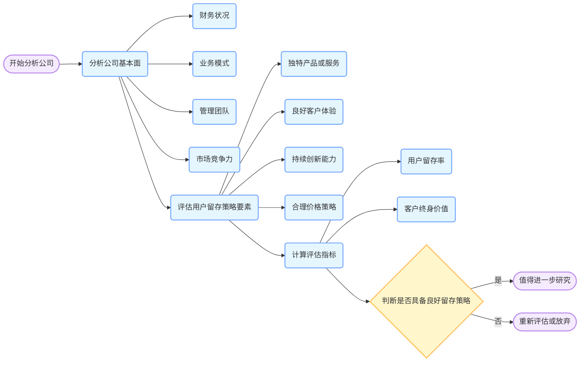

# 彼得林奇如何分析公司的用户留存策略

> 关键词：彼得林奇、公司分析、用户留存策略、投资分析、商业逻辑

> 摘要：本文深入探讨彼得林奇在分析公司时如何看待用户留存策略。彼得林奇作为投资界的传奇人物，其投资理念注重从公司基本面出发。用户留存策略对于公司的长期发展和价值创造至关重要，通过对彼得林奇分析方法的研究，我们可以更好地理解公司如何通过有效的留存策略提升竞争力和持续盈利能力。文章将详细阐述相关核心概念、算法原理、数学模型，并结合实际案例进行分析，同时介绍在该领域的学习资源、开发工具以及未来发展趋势等内容。

## 1. 背景介绍 
### 1.1 目的和范围
本文的主要目的是研究彼得林奇分析公司用户留存策略的方法和思路。范围涵盖彼得林奇的投资理念中与用户留存相关的核心要点，以及如何将这些要点应用于实际的公司分析中。我们将从彼得林奇的著作和投资实践出发，深入探讨他对公司用户留存策略的考量因素、分析方法和评估标准。通过对不同行业和类型公司的案例研究，揭示用户留存策略在公司价值评估中的重要性。

### 1.2 预期读者
本文预期读者包括对投资分析、商业管理感兴趣的专业人士和业余爱好者。对于投资者来说，了解彼得林奇的分析方法可以帮助他们更好地筛选具有投资价值的公司；对于企业管理者而言，学习如何构建有效的用户留存策略可以提升公司的竞争力和市场份额；对于学生和研究人员，本文可以为他们提供相关领域的研究思路和案例参考。

### 1.3 文档结构概述
本文将按照以下结构进行阐述：首先介绍核心概念与联系，明确彼得林奇分析方法中涉及的关键概念和它们之间的关系；接着讲解核心算法原理和具体操作步骤，通过 Python 代码详细展示分析过程；然后介绍相关的数学模型和公式，并举例说明其应用；之后通过项目实战，给出代码实际案例并进行详细解释；再探讨实际应用场景，说明用户留存策略在不同行业的应用情况；接着推荐相关的工具和资源，包括学习资源、开发工具和研究论文；最后总结未来发展趋势与挑战，并提供常见问题与解答以及扩展阅读和参考资料。

### 1.4 术语表
#### 1.4.1 核心术语定义
- **彼得林奇投资理念**：以深入研究公司基本面为基础，强调从日常生活中发现投资机会，注重公司的盈利能力、成长潜力和竞争优势等因素。
- **用户留存策略**：公司为了保持现有用户的持续使用和忠诚度而采取的一系列措施和方法。
- **用户留存率**：在一定时间内，继续使用公司产品或服务的用户占初始用户数量的比例。
- **客户终身价值（CLV）**：一个客户在其与公司的整个关系周期内为公司带来的预期总利润。

#### 1.4.2 相关概念解释
- **公司基本面**：包括公司的财务状况、业务模式、管理团队、市场竞争力等方面的基本情况，是评估公司价值的重要依据。
- **竞争优势**：公司相对于竞争对手在产品、服务、成本、品牌等方面所具有的优势，能够帮助公司吸引和留住用户。
- **客户体验**：用户在使用公司产品或服务过程中的感受和评价，良好的客户体验有助于提高用户留存率。

#### 1.4.3 缩略词列表
- **CLV**：Customer Lifetime Value（客户终身价值）
- **CRR**：Customer Retention Rate（客户留存率）

## 2. 核心概念与联系 

### 核心概念原理
彼得林奇分析公司的用户留存策略基于他对公司基本面的深入理解。他认为，一家具有良好用户留存策略的公司通常具备以下特点：
1. **独特的产品或服务**：能够满足用户的特定需求，具有差异化竞争优势，使用户难以转向竞争对手。
2. **良好的客户体验**：包括产品的易用性、稳定性、售后服务等方面，能够让用户在使用过程中感到满意和舒适。
3. **持续创新能力**：不断推出新的功能和服务，以适应市场变化和用户需求的升级，保持用户的新鲜感和兴趣。
4. **合理的价格策略**：提供具有性价比的产品或服务，让用户觉得物有所值。

### 架构的文本示意图
```plaintext
彼得林奇分析公司用户留存策略
|-- 公司基本面分析
|   |-- 财务状况
|   |-- 业务模式
|   |-- 管理团队
|   |-- 市场竞争力
|-- 用户留存策略要素
|   |-- 独特产品或服务
|   |-- 良好客户体验
|   |-- 持续创新能力
|   |-- 合理价格策略
|-- 评估指标
|   |-- 用户留存率
|   |-- 客户终身价值
```

### Mermaid 流程图


## 3. 核心算法原理 & 具体操作步骤 

### 核心算法原理
在分析公司的用户留存策略时，我们主要关注两个重要指标：用户留存率和客户终身价值。

#### 用户留存率（CRR）
用户留存率是衡量公司用户留存情况的基本指标，其计算公式为：

$$CRR = \frac{E - N}{S} \times 100\%$$

其中，$E$ 是期末留存用户数，$N$ 是期间新用户数，$S$ 是期初用户数。

#### 客户终身价值（CLV）
客户终身价值是预测一个客户在其与公司的整个关系周期内为公司带来的预期总利润。一种简单的计算方法是：

$$CLV = \frac{ARPU}{Churn Rate}$$

其中，$ARPU$ 是平均每用户收入，$Churn Rate$ 是用户流失率（$Churn Rate = 1 - CRR$）。

### 具体操作步骤及 Python 代码实现

```python
# 定义计算用户留存率的函数
def calculate_crr(initial_users, new_users, end_users):
    """
    计算用户留存率
    :param initial_users: 期初用户数
    :param new_users: 期间新用户数
    :param end_users: 期末留存用户数
    :return: 用户留存率
    """
    return ((end_users - new_users) / initial_users) * 100

# 定义计算客户终身价值的函数
def calculate_clv(arpu, churn_rate):
    """
    计算客户终身价值
    :param arpu: 平均每用户收入
    :param churn_rate: 用户流失率
    :return: 客户终身价值
    """
    return arpu / churn_rate

# 示例数据
initial_users = 1000
new_users = 200
end_users = 900
arpu = 50

# 计算用户留存率
crr = calculate_crr(initial_users, new_users, end_users)
print(f"用户留存率: {crr:.2f}%")

# 计算用户流失率
churn_rate = 1 - (crr / 100)

# 计算客户终身价值
clv = calculate_clv(arpu, churn_rate)
print(f"客户终身价值: {clv:.2f}")
```

### 代码解释
1. `calculate_crr` 函数：接受期初用户数、期间新用户数和期末留存用户数作为参数，根据用户留存率的计算公式返回用户留存率。
2. `calculate_clv` 函数：接受平均每用户收入和用户流失率作为参数，根据客户终身价值的计算公式返回客户终身价值。
3. 示例数据部分：设置了期初用户数、期间新用户数、期末留存用户数和平均每用户收入，然后调用上述函数计算用户留存率和客户终身价值，并打印结果。

## 4. 数学模型和公式 & 详细讲解 & 举例说明 

### 用户留存率公式
$$CRR = \frac{E - N}{S} \times 100\%$$

#### 详细讲解
- $S$（期初用户数）：表示在统计周期开始时公司拥有的用户数量。这是计算留存率的基础数据。
- $N$（期间新用户数）：在统计周期内新加入公司产品或服务的用户数量。由于我们关注的是原有用户的留存情况，所以需要从期末用户数中减去新用户数。
- $E$（期末留存用户数）：在统计周期结束时仍然使用公司产品或服务的用户数量。
- 通过计算 $(E - N)$ 与 $S$ 的比值，并乘以 $100\%$，得到用户留存率，它反映了期初用户在经过一个周期后仍然留存的比例。

#### 举例说明
假设一家在线游戏公司在月初有 1000 名用户（$S = 1000$），在这个月内新注册了 200 名用户（$N = 200$），到月底时总共有 900 名用户（$E = 900$）。则用户留存率为：

$$CRR = \frac{900 - 200}{1000} \times 100\% = 70\%$$

这意味着在月初的 1000 名用户中，有 70% 的用户在月底仍然在玩这款游戏。

### 客户终身价值公式
$$CLV = \frac{ARPU}{Churn Rate}$$

#### 详细讲解
- $ARPU$（平均每用户收入）：指公司在一定时期内从每个用户那里获得的平均收入。它可以通过总营收除以用户数量来计算。
- $Churn Rate$（用户流失率）：表示在一定时期内流失的用户占总用户数的比例，$Churn Rate = 1 - CRR$。
- 客户终身价值的计算公式基于一个假设，即用户在其生命周期内的消费行为是相对稳定的。通过将平均每用户收入除以用户流失率，我们可以估算出一个用户在其整个与公司的关系周期内为公司带来的预期总利润。

#### 举例说明
假设一家电商公司的平均每用户收入为 100 元（$ARPU = 100$），用户留存率为 80%，则用户流失率为 $1 - 0.8 = 0.2$。客户终身价值为：

$$CLV = \frac{100}{0.2} = 500$$

这意味着平均每个用户在其与电商公司的整个关系周期内，预计将为公司带来 500 元的利润。

## 5. 项目实战：代码实际案例和详细解释说明 

### 5.1  开发环境搭建
为了运行我们的代码示例，需要搭建以下开发环境：
1. **Python 安装**：确保已经安装了 Python 3.x 版本。可以从 Python 官方网站（https://www.python.org/downloads/）下载并安装。
2. **IDE 选择**：推荐使用 PyCharm 或 Jupyter Notebook。PyCharm 是一款功能强大的 Python 集成开发环境，适合开发大型项目；Jupyter Notebook 则更适合进行交互式的数据分析和代码演示。
3. **必要库安装**：我们的示例代码只使用了 Python 内置库，无需额外安装其他库。如果需要进行更复杂的数据分析和可视化，可以安装 `pandas`、`numpy` 和 `matplotlib` 等库。可以使用以下命令进行安装：
```sh
pip install pandas numpy matplotlib
```

### 5.2  源代码详细实现和代码解读

```python
import pandas as pd
import matplotlib.pyplot as plt

# 模拟用户数据
data = {
    'Month': ['2023-01', '2023-02', '2023-03', '2023-04', '2023-05'],
    'Initial_Users': [1000, 1100, 1200, 1300, 1400],
    'New_Users': [200, 220, 240, 260, 280],
    'End_Users': [900, 1000, 1100, 1200, 1300]
}

# 创建 DataFrame
df = pd.DataFrame(data)

# 定义计算用户留存率的函数
def calculate_crr(initial_users, new_users, end_users):
    return ((end_users - new_users) / initial_users) * 100

# 计算每个月的用户留存率
df['CRR'] = df.apply(lambda row: calculate_crr(row['Initial_Users'], row['New_Users'], row['End_Users']), axis=1)

# 打印结果
print(df[['Month', 'CRR']])

# 绘制用户留存率折线图
plt.figure(figsize=(10, 6))
plt.plot(df['Month'], df['CRR'], marker='o')
plt.title('Monthly User Retention Rate')
plt.xlabel('Month')
plt.ylabel('Retention Rate (%)')
plt.grid(True)
plt.show()
```

### 代码解读与分析
1. **数据模拟**：使用字典 `data` 模拟了 5 个月的用户数据，包括每月的期初用户数、新用户数和期末留存用户数。
2. **DataFrame 创建**：使用 `pandas` 库的 `DataFrame` 函数将字典数据转换为数据框，方便进行数据处理和分析。
3. **用户留存率计算**：定义了 `calculate_crr` 函数来计算用户留存率，并使用 `apply` 方法将该函数应用到数据框的每一行，计算每个月的用户留存率，并将结果存储在新的列 `CRR` 中。
4. **结果打印**：打印出每个月的日期和对应的用户留存率。
5. **可视化**：使用 `matplotlib` 库绘制用户留存率的折线图，直观地展示用户留存率随时间的变化情况。通过观察折线图，我们可以分析用户留存率的趋势，判断公司的用户留存策略是否有效。

## 6. 实际应用场景 
### 互联网行业
在互联网行业，用户留存策略至关重要。例如，社交媒体平台需要不断优化用户体验，推出新的功能和互动方式，以保持用户的活跃度和忠诚度。像 Facebook 通过不断改进其算法，为用户提供个性化的内容推荐，提高用户在平台上的停留时间和参与度。同时，通过举办各种线上活动和社交互动，增强用户之间的联系和粘性。

电商平台则通过提供优质的商品、良好的售后服务和个性化的推荐来留住用户。例如，亚马逊通过其强大的物流配送体系和精准的商品推荐算法，让用户能够快速找到自己需要的商品，并享受便捷的购物体验。此外，亚马逊还推出了会员制度，为会员提供更多的优惠和特权，进一步提高用户的留存率。

### 金融行业
金融行业的用户留存策略也有其特点。银行通过提供多样化的金融产品和优质的客户服务来吸引和留住客户。例如，招商银行推出了各种个性化的信用卡产品，满足不同客户的消费需求。同时，通过建立完善的客户服务体系，及时解决客户的问题和需求，提高客户的满意度和忠诚度。

投资机构则通过提供专业的投资建议和优质的投资产品来留住客户。例如，巴菲特旗下的伯克希尔·哈撒韦公司通过长期稳定的投资业绩和专业的投资团队，吸引了大量的投资者，并保持了较高的客户留存率。

### 教育行业
在教育行业，在线教育平台需要通过提供高质量的课程内容、良好的学习体验和个性化的学习服务来留住学生。例如，网易云课堂通过与各大高校和培训机构合作，提供丰富多样的在线课程。同时，通过建立学习社区和互动平台，让学生之间能够相互交流和学习，提高学习的积极性和效果。

传统教育机构则通过提高教学质量、优化教学环境和提供个性化的辅导服务来留住学生。例如，新东方通过不断提升教师的教学水平和教学质量，为学生提供优质的教育培训服务。同时，通过建立完善的学生服务体系，关注学生的学习和生活需求，提高学生的满意度和忠诚度。

## 7. 工具和资源推荐
### 7.1 学习资源推荐
#### 7.1.1 书籍推荐
- 《彼得·林奇的成功投资》：彼得林奇的经典著作，详细介绍了他的投资理念和方法，对于理解如何分析公司和评估投资价值具有重要的指导意义。
- 《聪明的投资者》：本杰明·格雷厄姆的代表作，被誉为投资界的圣经。书中阐述了价值投资的基本原理和方法，对投资者的思维方式和投资决策具有深远的影响。
- 《客户终身价值：驱动企业未来利润的引擎》：深入探讨了客户终身价值的概念、计算方法和应用，对于理解用户留存策略和企业价值创造具有重要的参考价值。

#### 7.1.2 在线课程
- Coursera 上的“投资学原理”：由知名大学教授授课，系统介绍了投资学的基本原理和方法，包括公司分析、估值模型等内容。
- edX 上的“商业分析基础”：该课程涵盖了数据分析、市场调研、客户关系管理等方面的知识，对于理解公司的运营和用户留存策略具有一定的帮助。

#### 7.1.3 技术博客和网站
- Seeking Alpha：一个专业的投资研究平台，提供了大量的公司分析报告和投资观点，对于学习如何分析公司和评估投资价值具有重要的参考价值。
- Medium 上的商业和投资相关博客：有许多专业人士分享他们的投资经验和分析方法，可以从中获取不同的观点和思路。

### 7.2 开发工具框架推荐
#### 7.2.1 IDE和编辑器
- PyCharm：功能强大的 Python 集成开发环境，提供了代码编辑、调试、版本控制等一系列功能，适合开发大型的 Python 项目。
- Jupyter Notebook：交互式的数据分析和代码演示工具，支持多种编程语言，方便进行数据探索和可视化。

#### 7.2.2 调试和性能分析工具
- PDB：Python 内置的调试器，可以帮助开发者定位代码中的错误和问题。
- cProfile：Python 标准库中的性能分析工具，可以分析代码的执行时间和函数调用情况，帮助优化代码性能。

#### 7.2.3 相关框架和库
- Pandas：用于数据处理和分析的 Python 库，提供了高效的数据结构和数据操作方法，方便进行数据清洗、转换和分析。
- Numpy：用于科学计算的 Python 库，提供了高效的数组操作和数学函数，是许多数据分析和机器学习库的基础。
- Matplotlib：用于数据可视化的 Python 库，提供了丰富的绘图功能，可以绘制各种类型的图表，直观地展示数据。

### 7.3 相关论文著作推荐
#### 7.3.1 经典论文
- “Customer Relationship Management: Conceptual Foundations and Measurement”：该论文深入探讨了客户关系管理的概念和测量方法，对于理解用户留存策略的理论基础具有重要的参考价值。
- “The Economics of Customer Loyalty”：研究了客户忠诚度与企业经济绩效之间的关系，为企业制定用户留存策略提供了经济理论支持。

#### 7.3.2 最新研究成果
- 可以通过学术数据库如 IEEE Xplore、ACM Digital Library 等搜索关于用户留存策略和投资分析的最新研究论文，了解该领域的最新发展动态。

#### 7.3.3 应用案例分析
- Harvard Business Review 上有许多关于企业用户留存策略和投资案例的分析文章，可以从中学习不同行业和企业的成功经验和实践方法。

## 8. 总结：未来发展趋势与挑战
### 未来发展趋势
1. **数据驱动的用户留存策略**：随着大数据和人工智能技术的发展，公司将越来越依赖数据来制定和优化用户留存策略。通过对用户行为数据的深入分析，公司可以更好地了解用户需求和偏好，提供个性化的服务和体验，提高用户留存率。
2. **跨平台和多渠道的用户留存**：用户现在可以通过多种平台和渠道使用公司的产品和服务，因此公司需要制定跨平台和多渠道的用户留存策略。例如，一个电商公司不仅要关注其网站和手机应用的用户留存，还要考虑社交媒体平台上的用户互动和留存。
3. **注重用户体验和情感连接**：未来，用户体验和情感连接将成为用户留存的关键因素。公司需要更加关注用户在使用产品和服务过程中的感受和体验，通过提供优质的内容、良好的互动和个性化的关怀，建立与用户的情感连接，提高用户的忠诚度。

### 挑战
1. **数据隐私和安全问题**：在收集和使用用户数据的过程中，公司需要面临数据隐私和安全问题。如何在保护用户数据隐私的前提下，合理利用数据来制定用户留存策略，是公司面临的一个重要挑战。
2. **激烈的市场竞争**：随着市场竞争的加剧，公司需要不断创新和优化用户留存策略，以吸引和留住用户。如何在激烈的市场竞争中脱颖而出，是公司面临的另一个挑战。
3. **技术更新换代快**：大数据、人工智能等技术的发展日新月异，公司需要不断学习和应用新的技术，以提高用户留存策略的有效性。如何跟上技术更新换代的步伐，是公司面临的又一个挑战。

## 9. 附录：常见问题与解答
### 问题 1：如何提高用户留存率？
提高用户留存率可以从以下几个方面入手：
- 提供优质的产品或服务：确保产品或服务能够满足用户的需求，具有良好的性能和稳定性。
- 优化客户体验：关注用户在使用过程中的感受，提供便捷的操作界面、及时的售后服务等。
- 持续创新：不断推出新的功能和服务，保持用户的新鲜感和兴趣。
- 建立用户社区：促进用户之间的交流和互动，增强用户的归属感和忠诚度。
- 提供个性化服务：根据用户的行为和偏好，提供个性化的推荐和服务。

### 问题 2：客户终身价值的计算方法是否准确？
客户终身价值的计算方法是基于一定的假设和模型，存在一定的局限性。实际情况中，用户的消费行为可能受到多种因素的影响，如市场环境、竞争对手、个人经济状况等。因此，客户终身价值的计算结果只能作为一个参考，不能完全准确地预测用户在其整个生命周期内为公司带来的利润。

### 问题 3：如何分析不同行业的用户留存策略？
分析不同行业的用户留存策略需要考虑行业的特点和用户需求。例如，互联网行业注重用户的活跃度和参与度，因此可以通过提供个性化的内容推荐、举办线上活动等方式来提高用户留存率；金融行业注重用户的信任和安全，因此需要提供专业的金融服务和保障用户的资金安全；教育行业注重教学质量和学习效果，因此需要提高教师的教学水平和提供优质的课程内容。

## 10. 扩展阅读 & 参考资料
### 扩展阅读
- 《巴菲特致股东的信：投资者和公司高管教程》：深入了解巴菲特的投资理念和公司管理方法，对于理解公司分析和投资决策具有重要的启发作用。
- 《增长黑客：如何低成本实现爆发式增长》：介绍了互联网行业的增长策略和方法，对于提高用户留存率和实现公司增长具有一定的参考价值。

### 参考资料
- 彼得·林奇. 《彼得·林奇的成功投资》. 机械工业出版社.
- 本杰明·格雷厄姆. 《聪明的投资者》. 人民邮电出版社.
- 菲利普·科特勒. 《营销管理》. 格致出版社.

作者：AI天才研究院/AI Genius Institute & 禅与计算机程序设计艺术 /Zen And The Art of Computer Programming