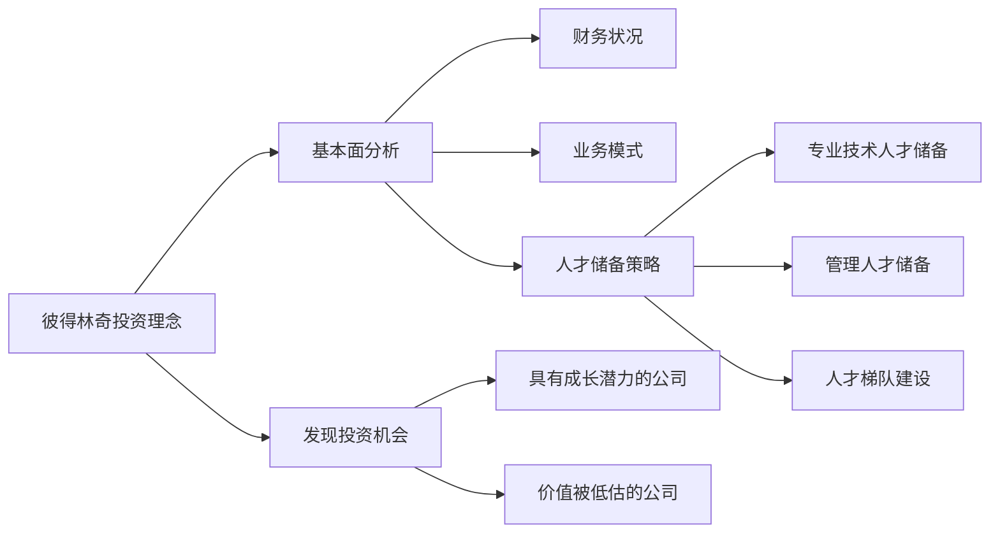

# 彼得林奇如何看待公司的人才储备策略

> 关键词：彼得林奇、公司人才储备策略、投资分析、企业发展、人才管理

> 摘要：本文深入探讨了投资大师彼得林奇对于公司人才储备策略的观点。从彼得林奇独特的投资视角出发，分析人才储备策略在企业发展中的重要性、对企业竞争力的影响等方面。通过阐述相关核心概念、算法原理、数学模型等内容，结合实际案例，揭示人才储备策略与企业价值及投资潜力之间的内在联系。同时介绍相关的学习资源、开发工具等，最后总结未来人才储备策略的发展趋势与挑战，并对常见问题进行解答。

## 1. 背景介绍 
### 1.1 目的和范围
彼得林奇作为投资界的传奇人物，其投资理念和方法影响深远。本文章的目的在于深入探究彼得林奇如何看待公司的人才储备策略，分析这种观点背后的逻辑和意义。范围涵盖了彼得林奇相关的投资著作、言论中关于人才储备策略的解读，以及将其观点应用于企业实际发展和投资分析中的探讨。

### 1.2 预期读者
本文预期读者包括对投资领域感兴趣的人士，尤其是希望学习彼得林奇投资理念的投资者；企业管理者和人力资源专家，他们可以从彼得林奇的视角审视公司的人才储备策略；以及从事金融、经济研究的学者和学生，通过本文深入了解人才因素在企业和投资中的重要性。

### 1.3 文档结构概述
本文首先介绍核心概念，包括彼得林奇的投资理念和公司人才储备策略的相关概念，并展示它们之间的联系。接着阐述核心算法原理，用 Python 代码模拟分析人才储备与企业发展的关系。然后介绍相关的数学模型和公式，通过具体例子进行说明。之后通过项目实战案例，详细讲解代码实现和分析。再探讨人才储备策略的实际应用场景，推荐相关的学习资源、开发工具和论文著作。最后总结未来发展趋势与挑战，解答常见问题，并提供扩展阅读和参考资料。

### 1.4 术语表
#### 1.4.1 核心术语定义
- **彼得林奇投资理念**：以深入研究公司基本面为基础，通过挖掘具有成长潜力的公司进行投资，注重公司的实际业务、财务状况和发展前景等因素。
- **公司人才储备策略**：企业为了实现长期发展目标，有计划地储备各类人才，包括专业技术人才、管理人才等，以应对未来业务发展、市场变化和竞争挑战。
- **企业竞争力**：企业在市场中相对于竞争对手所具有的优势，包括产品或服务质量、成本控制、创新能力等多个方面，人才储备是影响企业竞争力的重要因素之一。

#### 1.4.2 相关概念解释
- **基本面分析**：对公司的财务报表、经营状况、行业地位等基本情况进行分析，以评估公司的内在价值和投资潜力。彼得林奇非常重视基本面分析，认为人才储备是基本面的重要组成部分。
- **人才梯队建设**：企业建立不同层次、不同年龄段的人才队伍，确保人才的持续供应和传承，为企业的长期发展提供保障。

#### 1.4.3 缩略词列表
- **ROE**：Return on Equity，净资产收益率，是衡量公司盈利能力的重要指标，彼得林奇在评估公司时会关注该指标与人才储备等因素的关系。

## 2. 核心概念与联系 

### 核心概念原理
彼得林奇的投资理念强调通过对公司基本面的深入研究来发现投资机会。他认为公司的价值不仅仅取决于当前的财务数据，还与公司的未来发展潜力密切相关。而人才储备策略正是影响公司未来发展潜力的关键因素之一。

公司的人才储备策略旨在确保企业在面对各种变化和挑战时，有足够的人才资源来支撑业务的持续发展。优秀的人才可以推动公司的创新，提高产品和服务质量，增强公司的竞争力。例如，一家科技公司拥有大量的研发人才储备，就更有可能推出具有创新性的产品，从而在市场中占据领先地位。

### 架构的文本示意图
```plaintext
彼得林奇投资理念
|
|-- 基本面分析
|   |
|   |-- 财务状况
|   |-- 业务模式
|   |-- 人才储备策略
|       |
|       |-- 专业技术人才储备
|       |-- 管理人才储备
|       |-- 人才梯队建设
|
|-- 发现投资机会
|   |
|   |-- 具有成长潜力的公司
|   |-- 价值被低估的公司
```

### Mermaid 流程图


## 3. 核心算法原理 & 具体操作步骤 

### 算法原理
我们可以通过建立一个简单的模型来模拟人才储备与企业发展的关系。假设企业的发展受到多个因素的影响，包括人才储备水平、市场需求、资金投入等。我们可以用以下公式来表示企业的发展指标 $D$：

$D = f(T, M, F)$

其中，$T$ 表示人才储备水平，$M$ 表示市场需求，$F$ 表示资金投入。为了简化模型，我们假设这个函数是线性的：

$D = aT + bM + cF + d$

其中，$a$、$b$、$c$ 是系数，$d$ 是常数。这些系数可以通过历史数据进行拟合得到。

### Python 代码实现
```python
import numpy as np
from sklearn.linear_model import LinearRegression

# 模拟历史数据
# 假设我们有 10 个样本，每个样本包含人才储备水平、市场需求、资金投入和企业发展指标
# 人才储备水平（0 - 100）
T = np.array([20, 30, 40, 50, 60, 70, 80, 90, 10, 25]).reshape(-1, 1)
# 市场需求（0 - 100）
M = np.array([30, 40, 50, 60, 70, 80, 90, 100, 20, 35]).reshape(-1, 1)
# 资金投入（万元）
F = np.array([100, 200, 300, 400, 500, 600, 700, 800, 50, 150]).reshape(-1, 1)
# 企业发展指标（0 - 100）
D = np.array([35, 45, 55, 65, 75, 85, 95, 100, 25, 38])

# 合并特征
X = np.hstack((T, M, F))

# 创建线性回归模型
model = LinearRegression()

# 拟合模型
model.fit(X, D)

# 输出系数和截距
print("系数 a, b, c:", model.coef_)
print("常数 d:", model.intercept_)

# 预测新的企业发展指标
new_T = np.array([35]).reshape(-1, 1)
new_M = np.array([45]).reshape(-1, 1)
new_F = np.array([120]).reshape(-1, 1)
new_X = np.hstack((new_T, new_M, new_F))
predicted_D = model.predict(new_X)
print("预测的企业发展指标:", predicted_D[0])
```

### 具体操作步骤
1. **数据准备**：收集历史数据，包括人才储备水平、市场需求、资金投入和企业发展指标。将这些数据整理成合适的格式，以便进行模型训练。
2. **模型选择**：选择合适的模型来拟合数据。在这个例子中，我们选择了线性回归模型。
3. **模型训练**：使用历史数据对模型进行训练，得到模型的系数和截距。
4. **模型预测**：使用训练好的模型对新的情况进行预测，例如给定新的人才储备水平、市场需求和资金投入，预测企业的发展指标。

## 4. 数学模型和公式 & 详细讲解 & 举例说明 

### 数学模型和公式
在上述算法原理中，我们使用了线性回归模型来描述人才储备与企业发展的关系：

$D = aT + bM + cF + d$

其中，$D$ 表示企业发展指标，$T$ 表示人才储备水平，$M$ 表示市场需求，$F$ 表示资金投入，$a$、$b$、$c$ 是系数，$d$ 是常数。

### 详细讲解
- **系数的意义**：系数 $a$ 表示在其他因素不变的情况下，人才储备水平每增加一个单位，企业发展指标的增加量。同理，$b$ 和 $c$ 分别表示市场需求和资金投入每增加一个单位，企业发展指标的增加量。
- **常数的意义**：常数 $d$ 表示当人才储备水平、市场需求和资金投入都为 0 时，企业发展指标的基础值。

### 举例说明
假设通过历史数据拟合得到的系数 $a = 0.5$，$b = 0.3$，$c = 0.2$，$d = 10$。如果一家企业的人才储备水平 $T = 50$，市场需求 $M = 60$，资金投入 $F = 300$，则可以预测该企业的发展指标 $D$ 为：

$D = 0.5\times50 + 0.3\times60 + 0.2\times300 + 10$

$D = 25 + 18 + 60 + 10$

$D = 113$

这意味着根据我们的模型，该企业的发展指标预计为 113。

## 5. 项目实战：代码实际案例和详细解释说明 

### 5.1  开发环境搭建
- **Python 安装**：从 Python 官方网站（https://www.python.org/downloads/）下载并安装 Python 3.x 版本。
- **依赖库安装**：使用以下命令安装所需的依赖库：
```sh
pip install numpy scikit-learn
```

### 5.2  源代码详细实现和代码解读
```python
import numpy as np
from sklearn.linear_model import LinearRegression

# 模拟历史数据
# 假设我们有 10 个样本，每个样本包含人才储备水平、市场需求、资金投入和企业发展指标
# 人才储备水平（0 - 100）
T = np.array([20, 30, 40, 50, 60, 70, 80, 90, 10, 25]).reshape(-1, 1)
# 市场需求（0 - 100）
M = np.array([30, 40, 50, 60, 70, 80, 90, 100, 20, 35]).reshape(-1, 1)
# 资金投入（万元）
F = np.array([100, 200, 300, 400, 500, 600, 700, 800, 50, 150]).reshape(-1, 1)
# 企业发展指标（0 - 100）
D = np.array([35, 45, 55, 65, 75, 85, 95, 100, 25, 38])

# 合并特征
X = np.hstack((T, M, F))

# 创建线性回归模型
model = LinearRegression()

# 拟合模型
model.fit(X, D)

# 输出系数和截距
print("系数 a, b, c:", model.coef_)
print("常数 d:", model.intercept_)

# 预测新的企业发展指标
new_T = np.array([35]).reshape(-1, 1)
new_M = np.array([45]).reshape(-1, 1)
new_F = np.array([120]).reshape(-1, 1)
new_X = np.hstack((new_T, new_M, new_F))
predicted_D = model.predict(new_X)
print("预测的企业发展指标:", predicted_D[0])
```

### 代码解读与分析
1. **数据模拟**：使用 `numpy` 库生成模拟的历史数据，包括人才储备水平、市场需求、资金投入和企业发展指标。
2. **特征合并**：使用 `np.hstack` 函数将人才储备水平、市场需求和资金投入合并成一个特征矩阵 $X$。
3. **模型创建**：使用 `sklearn` 库的 `LinearRegression` 类创建线性回归模型。
4. **模型拟合**：使用 `fit` 方法对模型进行训练，得到模型的系数和截距。
5. **预测**：创建新的特征矩阵 `new_X`，使用训练好的模型进行预测，得到预测的企业发展指标。

通过这个案例，我们可以看到如何使用 Python 代码来模拟人才储备与企业发展的关系，并进行预测。

## 6. 实际应用场景 
### 投资分析
彼得林奇在进行投资分析时，会关注公司的人才储备策略。如果一家公司拥有良好的人才储备，尤其是在关键领域有专业的技术人才和优秀的管理人才，那么该公司更有可能在未来实现业务增长和盈利提升。投资者可以将人才储备情况作为评估公司投资价值的一个重要因素。

### 企业战略规划
企业管理者可以借鉴彼得林奇的观点，制定合理的人才储备策略。例如，根据企业的发展战略和市场趋势，确定需要储备的人才类型和数量。同时，建立完善的人才培养和激励机制，吸引和留住优秀人才。

### 行业竞争分析
在行业竞争中，人才储备策略也起着重要作用。一家拥有强大人才储备的企业，能够更快地适应市场变化，推出创新的产品和服务，从而在竞争中占据优势。通过分析竞争对手的人才储备情况，企业可以制定相应的竞争策略。

## 7. 工具和资源推荐
### 7.1 学习资源推荐
#### 7.1.1 书籍推荐
- 《彼得·林奇的成功投资》：彼得林奇的经典著作，详细阐述了他的投资理念和方法，其中包括对公司基本面分析的重要性，以及如何通过研究公司的人才等因素来发现投资机会。
- 《聪明的投资者》：本杰明·格雷厄姆的著作，是价值投资的经典之作，对彼得林奇的投资理念产生了重要影响。书中强调了基本面分析和风险控制的重要性。

#### 7.1.2 在线课程
- Coursera 上的“投资学原理”课程：该课程涵盖了投资领域的基本原理和方法，包括基本面分析、资产定价等内容，可以帮助学习者深入理解投资分析的过程。
- edX 上的“金融市场”课程：由耶鲁大学教授罗伯特·席勒讲授，介绍了金融市场的运作机制和投资策略，对理解投资和企业发展之间的关系有很大帮助。

#### 7.1.3 技术博客和网站
- Seeking Alpha：一个专业的金融投资博客平台，提供了大量的投资分析文章和研究报告，其中不乏关于公司人才储备和投资价值的分析。
- Bloomberg：全球知名的财经新闻网站，提供及时的市场信息和企业动态，有助于了解行业内公司的人才储备情况。

### 7.2 开发工具框架推荐
#### 7.2.1 IDE和编辑器
- PyCharm：一款专业的 Python 集成开发环境，提供了丰富的代码编辑、调试和项目管理功能，适合进行数据分析和机器学习相关的开发。
- Jupyter Notebook：一个交互式的开发环境，支持 Python、R 等多种编程语言，非常适合进行数据探索和模型验证。

#### 7.2.2 调试和性能分析工具
- IPython：一个增强的 Python 解释器，提供了强大的调试和交互功能，方便开发者进行代码调试和测试。
- cProfile：Python 内置的性能分析工具，可以帮助开发者找出代码中的性能瓶颈。

#### 7.2.3 相关框架和库
- NumPy：一个用于科学计算的 Python 库，提供了高效的数组操作和数学函数，是进行数据分析和机器学习的基础库。
- Pandas：一个用于数据处理和分析的 Python 库，提供了灵活的数据结构和数据操作方法，方便进行数据清洗和整理。

### 7.3 相关论文著作推荐
#### 7.3.1 经典论文
- “The Capital Asset Pricing Model: Theory and Evidence”：由 Eugene F. Fama 和 Kenneth R. French 撰写，对资本资产定价模型进行了深入的研究和探讨，是投资领域的经典论文之一。
- “Efficient Capital Markets: A Review of Theory and Empirical Work”：由 Eugene F. Fama 撰写，提出了有效市场假说，对投资理论和实践产生了深远影响。

#### 7.3.2 最新研究成果
- 关注顶尖学术期刊，如《Journal of Finance》、《Review of Financial Studies》等，这些期刊上经常发表关于投资、企业管理和人才战略等方面的最新研究成果。
- 参加金融和管理领域的学术会议，如 American Finance Association (AFA) 年会等，可以了解到最新的研究动态和前沿观点。

#### 7.3.3 应用案例分析
- 各大咨询公司发布的行业研究报告，如麦肯锡、波士顿咨询等，其中包含了大量的企业案例分析，包括人才储备策略对企业发展的影响等内容。
- 上市公司的年报和公告，通过分析这些公开信息，可以了解企业的人才战略和实际执行情况。

## 8. 总结：未来发展趋势与挑战
### 未来发展趋势
- **数字化人才储备**：随着科技的不断发展，企业对数字化人才的需求将越来越大。未来的人才储备策略将更加注重数字化技能的培养和储备，如人工智能、大数据、云计算等领域的人才。
- **多元化人才储备**：为了适应全球化和多元化的市场环境，企业需要储备具有不同文化背景、专业技能和思维方式的人才。多元化的人才储备可以促进企业的创新和发展。
- **人才生态系统建设**：企业将不再仅仅关注自身的人才储备，而是会参与到整个行业的人才生态系统建设中。通过与高校、科研机构、其他企业等合作，实现人才的共享和流动。

### 挑战
- **人才竞争加剧**：随着对人才的重视程度不断提高，企业之间的人才竞争将更加激烈。如何吸引和留住优秀人才，将是企业面临的一大挑战。
- **人才培养难度增加**：科技的快速发展使得知识和技能的更新换代速度加快，企业需要不断投入资源进行人才培养，以确保人才的能力与市场需求相匹配。
- **人才评估和管理难度加大**：多元化的人才储备意味着企业需要更加科学和有效的人才评估和管理方法。如何准确评估人才的价值和潜力，合理分配人才资源，是企业需要解决的问题。

## 9. 附录：常见问题与解答
### 问题 1：彼得林奇认为人才储备策略对公司的短期业绩有何影响？
解答：彼得林奇虽然更关注公司的长期发展，但他也认识到人才储备策略对公司短期业绩可能有一定的间接影响。例如，优秀的人才可以提高公司的运营效率，改善产品和服务质量，从而在短期内提升公司的市场竞争力和业绩表现。但人才储备的效果通常需要一定的时间才能显现出来，尤其是在涉及到创新和战略转型的情况下。

### 问题 2：如何衡量一家公司的人才储备水平？
解答：可以从多个方面来衡量一家公司的人才储备水平。一是看公司的人才结构，包括不同专业领域、不同层次的人才分布是否合理；二是看公司的人才培养和发展计划，是否有完善的培训体系和晋升机制；三是看公司的人才流动率，较低的人才流动率通常表示公司能够吸引和留住人才；四是看公司在行业内的人才声誉，是否被认为是一个吸引优秀人才的雇主。

### 问题 3：人才储备策略与企业的创新能力有什么关系？
解答：人才储备策略对企业的创新能力有着至关重要的影响。拥有丰富的人才储备意味着企业有更多的创意和想法来源。不同专业背景和思维方式的人才可以相互激发，产生创新的火花。同时，优秀的人才具备更强的学习能力和解决问题的能力，能够更快地将创新想法转化为实际的产品或服务。因此，合理的人才储备策略可以为企业的创新提供有力的支持。

## 10. 扩展阅读 & 参考资料
### 扩展阅读
- 《金融炼金术》：乔治·索罗斯的著作，介绍了他的投资哲学和市场分析方法，与彼得林奇的投资理念相互补充。
- 《创新者的窘境》：克莱顿·克里斯坦森的著作，探讨了企业在面对技术创新和市场变化时的挑战和机遇，对理解人才储备策略在企业创新中的作用有很大帮助。

### 参考资料
- Lynch, Peter. One Up on Wall Street: How to Use What You Already Know to Make Money in the Market. Simon & Schuster, 1989.
- Graham, Benjamin. The Intelligent Investor: The Definitive Book on Value Investing. HarperBusiness, 2003.

作者：AI天才研究院/AI Genius Institute & 禅与计算机程序设计艺术 /Zen And The Art of Computer Programming