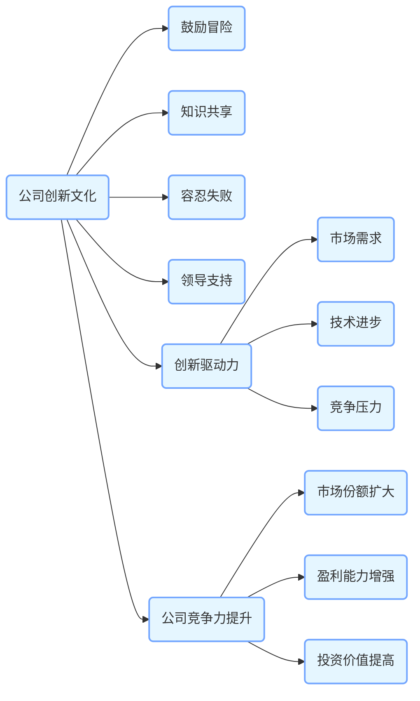

# 彼得林奇如何看待公司的创新文化

> 关键词：彼得林奇、公司创新文化、投资分析、企业发展、创新驱动力

> 摘要：本文深入探讨彼得林奇对公司创新文化的看法。彼得林奇作为投资界的传奇人物，其投资理念和对公司的评估方法备受关注。公司的创新文化在当今竞争激烈的商业环境中对企业的长期发展和价值创造起着关键作用。通过分析彼得林奇的相关观点，我们可以更好地理解创新文化在投资决策和企业运营中的重要性，以及如何评估一家公司是否具备良好的创新文化。文章将结合背景知识、核心概念、算法原理（虽在投资领域相对抽象，但会以逻辑分析呈现）、数学模型辅助理解、项目实战案例等方面进行详细阐述，最后探讨其在实际应用场景中的体现以及相关工具资源推荐，为投资者和企业管理者提供有价值的参考。

## 1. 背景介绍 
### 1.1 目的和范围
本文旨在全面剖析彼得林奇对于公司创新文化的观点和见解。通过对彼得林奇投资理念和相关著作的研究，我们将探究创新文化在他的投资决策框架中所占的地位，以及创新文化如何影响公司的长期竞争力和投资价值。研究范围涵盖彼得林奇的公开言论、著作中与公司创新文化相关的内容，同时结合实际商业案例进行分析，以深入理解创新文化对公司发展的重要性。

### 1.2 预期读者
本文的预期读者包括对投资领域感兴趣的个人投资者、金融分析师、企业管理者以及关注公司创新发展的研究人员。对于投资者来说，了解彼得林奇对公司创新文化的看法有助于提升投资决策的准确性；企业管理者可以从中获取关于如何打造和培育创新文化的启示；研究人员则可以将本文作为进一步研究公司创新文化与企业绩效关系的参考资料。

### 1.3 文档结构概述
本文将按照以下结构进行阐述：首先介绍核心概念，明确公司创新文化的定义和内涵；接着分析彼得林奇评估公司创新文化的方法和原理；然后通过数学模型和公式辅助理解创新文化与公司价值的关系；之后结合实际项目案例，详细解读创新文化在公司发展中的具体作用；再探讨创新文化在不同实际应用场景中的体现；推荐相关的学习资源、开发工具和研究论文；最后总结公司创新文化的未来发展趋势与挑战，并提供常见问题的解答和扩展阅读资料。

### 1.4 术语表
#### 1.4.1 核心术语定义
- **彼得林奇（Peter Lynch）**：美国著名的投资家，曾任富达麦哲伦基金的基金经理，以其卓越的投资业绩和独特的投资理念而闻名于世。
- **公司创新文化**：指公司内部形成的一种鼓励创新、支持冒险、容忍失败、重视知识创造和分享的文化氛围，它能够激发员工的创新活力，推动公司不断推出新产品、新服务和新的商业模式。
- **投资价值**：指公司对于投资者而言所具有的潜在价值，包括公司的盈利能力、成长潜力、市场竞争力等因素综合决定的价值。

#### 1.4.2 相关概念解释
- **创新驱动力**：推动公司进行创新活动的各种因素，如市场需求、技术进步、竞争压力等。创新文化是创新驱动力的重要组成部分，它能够为创新活动提供良好的内部环境。
- **企业文化**：企业在长期的发展过程中形成的价值观、信仰、行为准则和工作方式的总和。创新文化是企业文化的一种特定类型，强调创新在企业发展中的核心地位。

#### 1.4.3 缩略词列表
本文不涉及相关缩略词。

## 2. 核心概念与联系 

### 公司创新文化的定义与内涵
公司创新文化是一种复杂而多维度的概念，它不仅仅是鼓励员工提出新想法，更是一种渗透到公司各个层面的价值观和行为模式。创新文化包括以下几个关键要素：
- **鼓励冒险**：公司鼓励员工尝试新的方法和途径，不怕失败。在这种文化氛围下，员工愿意承担一定的风险去探索未知领域，从而有可能发现新的商业机会。
- **知识共享**：公司内部建立了良好的知识交流和共享机制，员工之间能够自由地分享信息和经验。这有助于激发创新思维，促进不同部门之间的合作和协同创新。
- **容忍失败**：公司理解创新过程中难免会遇到失败，不会对失败的尝试进行过度惩罚。相反，公司会从失败中吸取教训，将其视为学习和成长的机会。
- **领导支持**：公司高层领导对创新给予积极的支持和鼓励，为创新活动提供必要的资源和政策保障。领导的示范作用能够带动整个公司形成创新的氛围。

### 彼得林奇对创新文化的重视
彼得林奇在投资过程中非常重视公司的创新文化。他认为，具有良好创新文化的公司更有可能在激烈的市场竞争中脱颖而出，实现持续的增长和发展。创新文化能够使公司不断推出满足市场需求的新产品和新服务，提高公司的市场竞争力和盈利能力。此外，创新文化还能够吸引和留住优秀的人才，为公司的长期发展奠定坚实的基础。

### 核心概念的联系示意图


从这个示意图中可以看出，公司创新文化由多个关键要素组成，这些要素相互作用，共同形成了创新驱动力。创新驱动力促使公司不断创新，从而提升公司的竞争力，最终提高公司的投资价值。

## 3. 核心算法原理 & 具体操作步骤 

### 评估公司创新文化的逻辑框架
虽然在评估公司创新文化时没有严格意义上的数学算法，但可以建立一个逻辑框架来进行分析。以下是彼得林奇可能采用的评估公司创新文化的步骤：

#### 步骤 1：观察公司的研发投入
研发投入是衡量公司对创新重视程度的一个重要指标。一般来说，研发投入占营业收入的比例越高，说明公司越注重创新。可以通过分析公司的财务报表来获取研发投入的数据，并与同行业其他公司进行比较。

```python
def calculate_rd_ratio(research_expense, revenue):
    """
    计算研发投入占营业收入的比例
    :param research_expense: 研发费用
    :param revenue: 营业收入
    :return: 研发投入占比
    """
    return research_expense / revenue

# 示例数据
research_expense = 1000000
revenue = 10000000
rd_ratio = calculate_rd_ratio(research_expense, revenue)
print(f"研发投入占比: {rd_ratio * 100}%")
```

#### 步骤 2：了解公司的创新历史
研究公司过去是否有成功的创新案例，如推出过具有创新性的产品或服务，获得过相关的专利或奖项等。可以通过查阅公司的新闻报道、行业研究报告等资料来获取这些信息。

#### 步骤 3：考察公司的组织架构和管理风格
一个具有创新文化的公司通常具有灵活的组织架构和开放的管理风格。可以了解公司的决策流程是否高效，是否鼓励员工参与决策，以及部门之间的沟通和协作是否顺畅。

#### 步骤 4：与公司员工交流
与公司的员工进行沟通，了解他们对公司创新文化的感受和看法。员工是公司创新活动的主体，他们的实际体验能够反映公司创新文化的真实情况。

#### 步骤 5：分析公司的市场表现
观察公司在市场上的表现，如市场份额的变化、产品的销售增长情况等。如果公司能够在市场上保持良好的表现，说明其创新文化可能正在发挥积极的作用。

### 综合评估模型
可以将以上各个步骤的评估结果进行综合，建立一个简单的综合评估模型。例如，可以为每个评估指标分配一定的权重，然后计算加权得分。

```python
# 示例评估指标及权重
weights = {
    "rd_ratio": 0.3,
    "innovation_history": 0.2,
    "organization_structure": 0.2,
    "employee_feedback": 0.1,
    "market_performance": 0.2
}

# 示例评估得分
scores = {
    "rd_ratio": 0.8,
    "innovation_history": 0.7,
    "organization_structure": 0.6,
    "employee_feedback": 0.7,
    "market_performance": 0.8
}

def calculate_total_score(weights, scores):
    """
    计算综合评估得分
    :param weights: 评估指标权重字典
    :param scores: 评估指标得分字典
    :return: 综合评估得分
    """
    total_score = 0
    for key in weights:
        total_score += weights[key] * scores[key]
    return total_score

total_score = calculate_total_score(weights, scores)
print(f"综合评估得分: {total_score}")
```

通过以上的逻辑框架和综合评估模型，可以对公司的创新文化进行较为全面的评估。

## 4. 数学模型和公式 & 详细讲解 & 举例说明 

### 创新文化与公司价值的关系模型
为了更好地理解创新文化对公司价值的影响，我们可以建立一个简单的数学模型。假设公司的价值 $V$ 由两部分组成：现有业务的价值 $V_1$ 和创新带来的潜在价值 $V_2$。

$$V = V_1 + V_2$$

现有业务的价值 $V_1$ 可以通过传统的财务分析方法进行估算，如现金流折现法。而创新带来的潜在价值 $V_2$ 则与公司的创新文化密切相关。我们可以假设 $V_2$ 与公司的创新能力 $I$ 成正比，创新能力 $I$ 又受到创新文化的影响。

$$V_2 = k \times I$$

其中，$k$ 是一个比例系数，表示创新能力转化为潜在价值的效率。创新能力 $I$ 可以通过多个指标来衡量，如研发投入、专利数量、新产品推出速度等。我们可以将这些指标进行加权平均，得到一个综合的创新能力指标。

假设我们有 $n$ 个创新指标 $x_1, x_2, \cdots, x_n$，对应的权重分别为 $w_1, w_2, \cdots, w_n$，则创新能力 $I$ 可以表示为：

$$I = \sum_{i=1}^{n} w_i x_i$$

### 举例说明
假设一家公司现有业务的价值 $V_1$ 为 10 亿元。我们选取了三个创新指标：研发投入 $x_1$、专利数量 $x_2$ 和新产品推出速度 $x_3$，对应的权重分别为 $w_1 = 0.4$，$w_2 = 0.3$，$w_3 = 0.3$。

经过评估，该公司的研发投入指标得分为 0.8，专利数量指标得分为 0.7，新产品推出速度指标得分为 0.6。则创新能力 $I$ 为：

$$I = 0.4 \times 0.8 + 0.3 \times 0.7 + 0.3 \times 0.6 = 0.71$$

假设比例系数 $k = 5$ 亿元，则创新带来的潜在价值 $V_2$ 为：

$$V_2 = 5 \times 0.71 = 3.55$$（亿元）

因此，该公司的总价值 $V$ 为：

$$V = V_1 + V_2 = 10 + 3.55 = 13.55$$（亿元）

通过这个例子可以看出，创新文化通过影响创新能力，进而影响公司的潜在价值，最终对公司的总价值产生重要影响。

## 5. 项目实战：代码实际案例和详细解释说明 

### 5.1  开发环境搭建
为了实现上述评估公司创新文化的代码，我们需要搭建一个基本的 Python 开发环境。以下是具体的步骤：

1. **安装 Python**：从 Python 官方网站（https://www.python.org/downloads/）下载并安装适合你操作系统的 Python 版本。建议安装 Python 3.6 及以上版本。
2. **安装开发工具**：可以选择使用 PyCharm、VS Code 等集成开发环境（IDE），也可以使用 Jupyter Notebook 进行交互式开发。这里以 VS Code 为例，下载并安装 VS Code（https://code.visualstudio.com/），然后安装 Python 扩展。
3. **创建虚拟环境**：为了避免不同项目之间的依赖冲突，建议使用虚拟环境。在命令行中执行以下命令创建并激活虚拟环境：

```bash
# 创建虚拟环境
python -m venv myenv

# 激活虚拟环境（Windows）
myenv\Scripts\activate

# 激活虚拟环境（Linux/Mac）
source myenv/bin/activate
```

### 5.2  源代码详细实现和代码解读
以下是完整的评估公司创新文化的 Python 代码：

```python
# 计算研发投入占比
def calculate_rd_ratio(research_expense, revenue):
    """
    计算研发投入占营业收入的比例
    :param research_expense: 研发费用
    :param revenue: 营业收入
    :return: 研发投入占比
    """
    return research_expense / revenue

# 计算综合评估得分
def calculate_total_score(weights, scores):
    """
    计算综合评估得分
    :param weights: 评估指标权重字典
    :param scores: 评估指标得分字典
    :return: 综合评估得分
    """
    total_score = 0
    for key in weights:
        total_score += weights[key] * scores[key]
    return total_score

# 示例数据
research_expense = 1000000
revenue = 10000000
rd_ratio = calculate_rd_ratio(research_expense, revenue)
print(f"研发投入占比: {rd_ratio * 100}%")

# 示例评估指标及权重
weights = {
    "rd_ratio": 0.3,
    "innovation_history": 0.2,
    "organization_structure": 0.2,
    "employee_feedback": 0.1,
    "market_performance": 0.2
}

# 示例评估得分
scores = {
    "rd_ratio": rd_ratio,
    "innovation_history": 0.7,
    "organization_structure": 0.6,
    "employee_feedback": 0.7,
    "market_performance": 0.8
}

total_score = calculate_total_score(weights, scores)
print(f"综合评估得分: {total_score}")
```

### 代码解读与分析
1. **`calculate_rd_ratio` 函数**：该函数接受研发费用和营业收入作为输入，返回研发投入占营业收入的比例。通过这个函数，我们可以快速计算出公司的研发投入情况。
2. **`calculate_total_score` 函数**：该函数接受评估指标权重字典和评估指标得分字典作为输入，计算综合评估得分。通过加权平均的方法，将各个评估指标的得分进行综合，得到一个反映公司创新文化整体水平的得分。
3. **示例数据和计算过程**：代码中给出了示例的研发费用、营业收入、评估指标权重和评估指标得分，通过调用上述两个函数，计算出研发投入占比和综合评估得分，并将结果打印输出。

通过这个代码示例，我们可以方便地对公司的创新文化进行评估，为投资决策提供参考。

## 6. 实际应用场景 
### 投资决策
对于投资者来说，了解公司的创新文化可以帮助他们更好地评估公司的投资价值。具有良好创新文化的公司通常具有更强的竞争力和成长潜力，未来可能会带来更高的投资回报。例如，彼得林奇在投资过程中，会重点关注那些具有创新精神的公司，如科技公司、生物医药公司等。通过对公司创新文化的评估，他能够发现那些被市场低估的具有创新潜力的公司，从而获得超额收益。

### 企业战略规划
企业管理者可以借鉴彼得林奇对创新文化的看法，将创新文化纳入企业的战略规划中。通过营造良好的创新文化氛围，激发员工的创新活力，推动企业不断进行产品创新、技术创新和管理创新。例如，一些科技巨头公司如苹果、谷歌等，都非常注重创新文化的建设，通过不断推出具有创新性的产品和服务，保持了在市场上的领先地位。

### 人才招聘与培养
创新文化也是吸引和留住优秀人才的重要因素。具有创新文化的公司能够为员工提供一个发挥创造力的平台，让员工感受到工作的价值和成就感。因此，企业在进行人才招聘和培养时，可以强调自身的创新文化，吸引那些具有创新精神的人才加入公司。同时，通过培养和提升员工的创新能力，进一步加强公司的创新文化建设。

### 行业竞争分析
在进行行业竞争分析时，创新文化也是一个重要的评估指标。不同行业的创新文化水平存在差异，了解行业内各公司的创新文化情况，可以帮助企业制定更加有效的竞争策略。例如，在高科技行业，创新文化的竞争尤为激烈，企业需要不断提升自身的创新能力，才能在市场上立足。

## 7. 工具和资源推荐
### 7.1 学习资源推荐
#### 7.1.1 书籍推荐
- 《彼得·林奇的成功投资》（*One Up on Wall Street*）：彼得林奇的经典著作，详细介绍了他的投资理念和方法，其中包括对公司创新文化的关注和分析。
- 《创新者的窘境》（*The Innovator's Dilemma*）：克莱顿·克里斯坦森的著作，探讨了创新在企业发展中的重要性以及企业如何应对创新带来的挑战。
- 《引爆点》（*The Tipping Point*）：马尔科姆·格拉德威尔的著作，介绍了创新思想和产品如何在社会中传播和扩散，对理解创新文化的传播机制有很大帮助。

#### 7.1.2 在线课程
- Coursera 上的“创新创业管理”课程：由知名高校的教授授课，涵盖了创新文化、创新战略等方面的内容。
- edX 上的“技术创新与创业”课程：介绍了技术创新的原理和方法，以及如何将创新转化为商业价值。

#### 7.1.3 技术博客和网站
- 36氪：专注于科技、创新领域的资讯平台，提供大量关于创新企业和创新文化的报道和分析。
- 虎嗅网：关注商业创新和科技趋势，有许多关于公司创新文化的深度文章和案例分析。

### 7.2 开发工具框架推荐
#### 7.2.1 IDE和编辑器
- PyCharm：功能强大的 Python 集成开发环境，提供代码编辑、调试、版本控制等功能，适合开发评估公司创新文化的 Python 代码。
- VS Code：轻量级的代码编辑器，支持多种编程语言，具有丰富的插件生态系统，可以通过安装 Python 扩展来进行 Python 开发。

#### 7.2.2 调试和性能分析工具
- Py-Spy：用于分析 Python 程序性能的工具，可以帮助开发者找出代码中的性能瓶颈。
- pdb：Python 自带的调试工具，可以在代码中设置断点，逐步执行代码，帮助开发者定位和解决问题。

#### 7.2.3 相关框架和库
- Pandas：用于数据处理和分析的 Python 库，可以方便地处理和分析公司的财务数据、创新指标数据等。
- Matplotlib：用于数据可视化的 Python 库，可以将分析结果以图表的形式展示出来，更直观地呈现公司的创新文化情况。

### 7.3 相关论文著作推荐
#### 7.3.1 经典论文
- "The Competitive Advantage of Nations" by Michael E. Porter：迈克尔·波特的经典论文，探讨了国家和企业的竞争力来源，其中涉及到创新文化对企业竞争力的影响。
- "Schumpeterian Competition in the Age of Information Technology" by Richard R. Nelson：分析了信息技术时代熊彼特式创新的特点和影响，对理解创新文化在现代经济中的作用有重要意义。

#### 7.3.2 最新研究成果
- 可以关注《管理世界》、《哈佛商业评论》等学术期刊和商业杂志，获取关于公司创新文化的最新研究成果和案例分析。

#### 7.3.3 应用案例分析
- 《创新的本质：史蒂夫·乔布斯与苹果公司》：详细分析了苹果公司的创新文化和创新模式，为企业打造创新文化提供了宝贵的借鉴。
- 《谷歌是如何运营的》：介绍了谷歌公司的管理理念和创新文化，包括如何吸引和留住人才、如何鼓励创新等方面的内容。

## 8. 总结：未来发展趋势与挑战
### 未来发展趋势
- **数字化创新文化**：随着数字化技术的不断发展，公司的创新文化将更加注重数字化转型和创新。例如，利用大数据、人工智能等技术进行产品创新和服务创新，将成为未来企业创新的重要方向。
- **跨界创新合作**：未来的创新将不再局限于单一行业或领域，而是更多地呈现跨界合作的趋势。公司需要与不同行业的企业、科研机构等进行合作，整合各方资源，共同推动创新发展。
- **员工创新意识提升**：企业将更加注重培养员工的创新意识和创新能力，通过开展创新培训、设立创新奖励机制等方式，激发员工的创新活力。

### 挑战
- **创新风险管控**：创新活动具有一定的风险性，公司在鼓励创新的同时，需要建立有效的风险管控机制，降低创新失败带来的损失。
- **文化融合难题**：在跨界创新合作过程中，不同企业和组织之间可能存在文化差异，如何实现文化融合，形成共同的创新文化，是一个需要解决的难题。
- **知识产权保护**：随着创新活动的增加，知识产权保护问题将变得更加突出。公司需要加强知识产权保护意识，建立健全知识产权保护体系，维护自身的创新成果。

## 9. 附录：常见问题与解答
### 问题 1：如何判断一个公司是否真正具有创新文化？
解答：可以从多个方面进行判断，如公司的研发投入、创新历史、组织架构和管理风格、员工的创新积极性等。同时，可以与公司的员工、管理层进行交流，了解他们对创新文化的看法和实践情况。

### 问题 2：创新文化对公司的短期业绩有何影响？
解答：创新文化对公司的短期业绩影响可能不明显，因为创新活动通常需要一定的时间和资源投入才能产生回报。但从长期来看，具有良好创新文化的公司更有可能推出具有竞争力的产品和服务，从而提升公司的市场份额和盈利能力。

### 问题 3：如何在公司内部营造创新文化？
解答：可以从以下几个方面入手：领导以身作则，鼓励创新；建立激励机制，对创新成果进行奖励；提供培训和学习机会，提升员工的创新能力；营造开放包容的工作氛围，鼓励员工分享想法和经验。

### 问题 4：创新文化与企业文化有什么关系？
解答：创新文化是企业文化的一种特定类型，它强调创新在企业发展中的核心地位。创新文化是企业文化的重要组成部分，良好的企业文化能够为创新文化的形成和发展提供土壤和支持。

## 10. 扩展阅读 & 参考资料
- 《投资最重要的事》（*The Most Important Thing Illuminated*），霍华德·马克斯著
- 《聪明的投资者》（*The Intelligent Investor*），本杰明·格雷厄姆著
- 《企业成长的动力：创新与文化》，相关学术研究报告
- 彼得林奇的相关访谈和演讲资料

作者：AI天才研究院/AI Genius Institute & 禅与计算机程序设计艺术 /Zen And The Art of Computer Programming