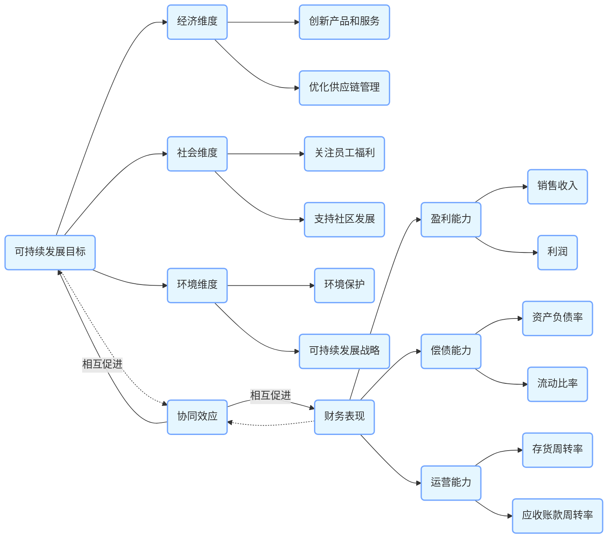

# 彼得林奇如何看待公司的可持续发展目标与财务表现的协同效应

> 关键词：彼得林奇、可持续发展目标、财务表现、协同效应、公司分析

> 摘要：本文围绕彼得林奇对公司可持续发展目标与财务表现协同效应的看法展开。通过深入剖析彼得林奇的投资理念，阐述可持续发展目标与财务表现之间的内在联系，详细介绍相关核心概念、算法原理、数学模型，并结合实际项目案例进行分析。同时探讨其在实际应用场景中的体现，推荐学习和开发相关的工具与资源，最后总结未来发展趋势与挑战，解答常见问题，为投资者和企业管理者提供全面的参考。

## 1. 背景介绍 
### 1.1 目的和范围
彼得林奇作为投资界的传奇人物，其投资理念影响深远。本文章旨在深入探讨彼得林奇如何看待公司的可持续发展目标与财务表现的协同效应。我们将分析这种协同效应的原理、在实际中的表现形式以及对投资者和企业的重要意义。范围涵盖了彼得林奇的经典投资思想、相关理论基础，以及实际案例的研究。

### 1.2 预期读者
本文预期读者包括对投资领域感兴趣的个人投资者、企业管理者、金融分析师以及相关专业的学生。无论是希望学习投资技巧的新手，还是寻求企业战略优化的管理者，都能从本文中获得有价值的信息。

### 1.3 文档结构概述
本文将首先介绍相关的核心概念，明确可持续发展目标和财务表现的定义及它们之间的联系。接着阐述核心算法原理和具体操作步骤，用 Python 代码进行详细说明。然后介绍相关的数学模型和公式，并举例说明。通过实际项目案例，深入分析可持续发展目标与财务表现协同效应在实际中的体现。之后探讨其实际应用场景，推荐相关的学习资源、开发工具和论文著作。最后总结未来发展趋势与挑战，解答常见问题，并提供扩展阅读和参考资料。

### 1.4 术语表
#### 1.4.1 核心术语定义
- **可持续发展目标**：是指企业在经济、社会和环境等方面制定的长期、可实现的目标，旨在确保企业在满足当前利益的同时，不损害未来的发展能力。
- **财务表现**：主要通过企业的财务报表数据来衡量，包括盈利能力、偿债能力、运营能力等方面的指标，反映企业在一定时期内的经营成果和财务状况。
- **协同效应**：是指可持续发展目标与财务表现之间相互促进、相互影响，共同推动企业实现更好的发展，产生的效果大于两者单独作用的总和。

#### 1.4.2 相关概念解释
- **企业社会责任**：企业在创造利润、对股东和员工承担法律责任的同时，还要承担对消费者、社区和环境的责任。可持续发展目标通常与企业社会责任密切相关，是企业履行社会责任的具体体现。
- **长期价值创造**：企业通过制定和实现可持续发展目标，提升自身的竞争力和声誉，从而在长期内为股东和利益相关者创造更大的价值。

#### 1.4.3 缩略词列表
- **ROE**：净资产收益率（Return on Equity），衡量企业运用自有资本的效率和盈利能力。
- **EPS**：每股收益（Earnings Per Share），反映普通股的获利水平。

## 2. 核心概念与联系 
### 核心概念原理
彼得林奇认为，公司的可持续发展目标和财务表现并非相互独立，而是存在着紧密的内在联系。可持续发展目标涵盖了经济、社会和环境三个维度。从经济维度看，企业通过创新产品和服务、优化供应链管理等方式，可以降低成本、提高效率，从而提升财务表现。例如，采用更环保的生产技术可能会在短期内增加成本，但从长期来看，能减少资源消耗和环境风险，提高企业的竞争力和市场份额，进而增加利润。

在社会维度，企业积极履行社会责任，如关注员工福利、支持社区发展等，可以提高员工的忠诚度和工作积极性，吸引优秀人才，同时提升企业的社会声誉，为企业带来更多的商业机会。良好的社会形象有助于企业建立长期稳定的客户关系，促进销售增长，对财务表现产生积极影响。

环境维度方面，企业关注环境保护，实施可持续发展战略，不仅符合社会发展的趋势，还能满足消费者对绿色产品和服务的需求。例如，生产环保型产品的企业可能会获得政府的补贴和优惠政策，同时吸引更多环保意识较强的消费者，从而增加销售收入和利润。

### 架构的文本示意图
```plaintext
可持续发展目标
|-- 经济维度
|   |-- 创新产品和服务
|   |-- 优化供应链管理
|-- 社会维度
|   |-- 关注员工福利
|   |-- 支持社区发展
|-- 环境维度
|   |-- 环境保护
|   |-- 可持续发展战略

财务表现
|-- 盈利能力
|   |-- 销售收入
|   |-- 利润
|-- 偿债能力
|   |-- 资产负债率
|   |-- 流动比率
|-- 运营能力
|   |-- 存货周转率
|   |-- 应收账款周转率

协同效应
|-- 相互促进
|   |-- 可持续发展目标提升财务表现
|   |-- 财务表现支持可持续发展目标实现
```

### Mermaid 流程图


## 3. 核心算法原理 & 具体操作步骤 
### 核心算法原理
我们可以通过建立一个简单的线性回归模型来分析可持续发展目标与财务表现之间的关系。假设我们用 $X$ 表示可持续发展目标的量化指标，$Y$ 表示财务表现的量化指标，那么线性回归模型可以表示为：

$Y = \beta_0 + \beta_1X + \epsilon$

其中，$\beta_0$ 是截距，$\beta_1$ 是斜率，$\epsilon$ 是误差项。$\beta_1$ 表示可持续发展目标对财务表现的影响程度。如果 $\beta_1$ 为正，说明可持续发展目标与财务表现呈正相关，即可持续发展目标的提升有助于提高财务表现；如果 $\beta_1$ 为负，则呈负相关。

### 具体操作步骤
#### 步骤 1：数据收集
收集公司的可持续发展目标相关数据和财务表现数据。可持续发展目标数据可以包括企业在环境保护、社会责任等方面的投入、指标完成情况等；财务表现数据可以包括营业收入、净利润、净资产收益率等。

#### 步骤 2：数据预处理
对收集到的数据进行清洗和预处理，包括处理缺失值、异常值等。同时，对数据进行标准化处理，使不同指标的数据具有可比性。

#### 步骤 3：模型训练
使用 Python 的 `scikit-learn` 库来训练线性回归模型。以下是具体的 Python 代码示例：

```python
import numpy as np
from sklearn.linear_model import LinearRegression
from sklearn.preprocessing import StandardScaler

# 假设我们有以下可持续发展目标数据和财务表现数据
X = np.array([[1], [2], [3], [4], [5]])  # 可持续发展目标数据
y = np.array([2, 4, 6, 8, 10])  # 财务表现数据

# 数据标准化处理
scaler = StandardScaler()
X_scaled = scaler.fit_transform(X)

# 创建线性回归模型
model = LinearRegression()

# 模型训练
model.fit(X_scaled, y)

# 输出模型参数
print("截距:", model.intercept_)
print("斜率:", model.coef_[0])
```

#### 步骤 4：模型评估
使用训练好的模型对测试数据进行预测，并计算评估指标，如均方误差（MSE）、决定系数（$R^2$）等，评估模型的性能。

```python
from sklearn.metrics import mean_squared_error, r2_score

# 假设我们有测试数据
X_test = np.array([[6], [7]])
y_test = np.array([12, 14])

# 对测试数据进行标准化处理
X_test_scaled = scaler.transform(X_test)

# 模型预测
y_pred = model.predict(X_test_scaled)

# 计算评估指标
mse = mean_squared_error(y_test, y_pred)
r2 = r2_score(y_test, y_pred)

print("均方误差:", mse)
print("决定系数:", r2)
```

## 4. 数学模型和公式 & 详细讲解 & 举例说明 
### 线性回归模型
线性回归模型的基本公式为：

$Y = \beta_0 + \beta_1X + \epsilon$

其中，$Y$ 是因变量（财务表现），$X$ 是自变量（可持续发展目标），$\beta_0$ 是截距，$\beta_1$ 是斜率，$\epsilon$ 是误差项。

### 详细讲解
- **截距 $\beta_0$**：表示当自变量 $X$ 为 0 时，因变量 $Y$ 的取值。在实际应用中，它可能没有实际的经济意义，但在模型中起到了调整拟合直线位置的作用。
- **斜率 $\beta_1$**：表示自变量 $X$ 每增加一个单位，因变量 $Y$ 的平均变化量。它反映了可持续发展目标对财务表现的影响程度。
- **误差项 $\epsilon$**：表示实际观测值与模型预测值之间的差异。它包含了未被模型考虑到的因素，如随机噪声、测量误差等。

### 举例说明
假设我们对某公司的可持续发展目标和财务表现进行了研究，得到了以下数据：

| 可持续发展目标得分（$X$） | 财务表现得分（$Y$） |
| --- | --- |
| 1 | 2 |
| 2 | 4 |
| 3 | 6 |
| 4 | 8 |
| 5 | 10 |

使用上述线性回归模型进行分析，我们可以得到截距 $\beta_0 = 0$，斜率 $\beta_1 = 2$。这意味着可持续发展目标得分每增加 1 分，财务表现得分平均增加 2 分，说明可持续发展目标与财务表现呈正相关。

### 决定系数 $R^2$
决定系数 $R^2$ 用于衡量线性回归模型的拟合优度，其计算公式为：

$$R^2 = 1 - \frac{\sum_{i=1}^{n}(y_i - \hat{y}_i)^2}{\sum_{i=1}^{n}(y_i - \bar{y})^2}$$

其中，$y_i$ 是实际观测值，$\hat{y}_i$ 是模型预测值，$\bar{y}$ 是实际观测值的平均值。$R^2$ 的取值范围在 0 到 1 之间，越接近 1 表示模型的拟合效果越好。

### 举例说明
假设我们使用上述数据进行线性回归分析，得到的预测值为 $\hat{y} = [2, 4, 6, 8, 10]$，实际观测值为 $y = [2, 4, 6, 8, 10]$，则：

$\sum_{i=1}^{n}(y_i - \hat{y}_i)^2 = 0$

$\sum_{i=1}^{n}(y_i - \bar{y})^2 = \sum_{i=1}^{5}(y_i - 6)^2 = (2 - 6)^2 + (4 - 6)^2 + (6 - 6)^2 + (8 - 6)^2 + (10 - 6)^2 = 40$

$R^2 = 1 - \frac{0}{40} = 1$

这说明模型的拟合效果非常好，可持续发展目标能够很好地解释财务表现的变化。

## 5. 项目实战：代码实际案例和详细解释说明 
### 5.1  开发环境搭建
#### 安装 Python
首先，确保你已经安装了 Python。可以从 Python 官方网站（https://www.python.org/downloads/）下载适合你操作系统的 Python 版本，并按照安装向导进行安装。

#### 安装必要的库
使用 `pip` 命令安装所需的库，包括 `numpy`、`pandas`、`scikit-learn` 等。

```bash
pip install numpy pandas scikit-learn
```

### 5.2  源代码详细实现和代码解读
以下是一个完整的 Python 代码示例，用于分析公司的可持续发展目标与财务表现之间的关系：

```python
import numpy as np
import pandas as pd
from sklearn.linear_model import LinearRegression
from sklearn.preprocessing import StandardScaler
from sklearn.model_selection import train_test_split
from sklearn.metrics import mean_squared_error, r2_score

# 生成示例数据
np.random.seed(0)
n_samples = 100
# 可持续发展目标得分
sustainable_development_scores = np.random.randint(1, 10, n_samples)
# 财务表现得分
financial_performance_scores = 2 * sustainable_development_scores + np.random.normal(0, 1, n_samples)

# 创建 DataFrame
data = pd.DataFrame({
    'Sustainable_Development_Score': sustainable_development_scores,
    'Financial_Performance_Score': financial_performance_scores
})

# 数据预处理
X = data[['Sustainable_Development_Score']]
y = data['Financial_Performance_Score']

# 数据标准化处理
scaler = StandardScaler()
X_scaled = scaler.fit_transform(X)

# 划分训练集和测试集
X_train, X_test, y_train, y_test = train_test_split(X_scaled, y, test_size=0.2, random_state=42)

# 创建线性回归模型
model = LinearRegression()

# 模型训练
model.fit(X_train, y_train)

# 模型预测
y_pred = model.predict(X_test)

# 计算评估指标
mse = mean_squared_error(y_test, y_pred)
r2 = r2_score(y_test, y_pred)

# 输出结果
print("截距:", model.intercept_)
print("斜率:", model.coef_[0])
print("均方误差:", mse)
print("决定系数:", r2)
```

### 代码解读与分析
#### 数据生成
使用 `numpy` 库生成示例数据，包括可持续发展目标得分和财务表现得分。假设财务表现得分与可持续发展目标得分之间存在线性关系，并添加了一些随机噪声。

#### 数据预处理
将数据存储在 `pandas` 的 `DataFrame` 中，然后将自变量和因变量分离。使用 `StandardScaler` 对自变量进行标准化处理，使数据具有可比性。

#### 划分训练集和测试集
使用 `train_test_split` 函数将数据划分为训练集和测试集，其中测试集占总数据的 20%。

#### 模型训练和预测
创建线性回归模型，并使用训练集数据进行训练。使用训练好的模型对测试集数据进行预测。

#### 模型评估
计算均方误差（MSE）和决定系数（$R^2$），评估模型的性能。均方误差越小，说明模型的预测误差越小；决定系数越接近 1，说明模型的拟合效果越好。

## 6. 实际应用场景 
### 投资者决策
投资者在选择投资标的时，可以考虑公司的可持续发展目标与财务表现的协同效应。具有良好可持续发展战略的公司，往往能够在长期内保持稳定的财务增长，降低投资风险。例如，一家积极推动环保生产的企业，可能会获得政府的支持和消费者的认可，从而提高市场竞争力和盈利能力。投资者可以通过分析公司的可持续发展报告、财务报表等信息，评估公司的可持续发展能力和财务状况，做出更明智的投资决策。

### 企业战略规划
企业管理者可以将可持续发展目标纳入企业战略规划中，通过实现可持续发展目标来提升企业的财务表现。例如，企业可以通过优化供应链管理，减少能源消耗和废弃物排放，降低成本，提高运营效率。同时，关注员工福利和社会责任，提高员工的满意度和忠诚度，吸引优秀人才，为企业的长期发展奠定基础。通过平衡可持续发展目标和财务表现，企业可以实现可持续的增长和发展。

### 政策制定
政府和监管机构可以制定相关政策，鼓励企业实现可持续发展目标。例如，提供税收优惠、补贴等政策支持，激励企业加大在环境保护、社会责任等方面的投入。同时，加强对企业可持续发展信息披露的要求，提高企业的透明度，引导投资者和消费者关注企业的可持续发展表现。通过政策引导，促进企业在追求财务利益的同时，实现可持续发展目标，推动整个社会的可持续发展。

## 7. 工具和资源推荐
### 7.1 学习资源推荐
#### 7.1.1 书籍推荐
- 《彼得·林奇的成功投资》：彼得林奇的经典著作，详细介绍了他的投资理念和方法，对理解公司分析和投资决策具有重要的指导意义。
- 《可持续发展金融》：深入探讨了可持续发展与金融领域的结合，包括可持续投资、绿色金融等方面的内容。
- 《企业社会责任与可持续发展》：系统介绍了企业社会责任和可持续发展的理论和实践，为企业管理者和研究者提供了全面的参考。

#### 7.1.2 在线课程
- Coursera 上的“可持续发展投资”课程：由知名教授授课，涵盖了可持续发展投资的理论、方法和实践案例。
- edX 上的“企业社会责任与可持续发展”课程：提供了企业社会责任和可持续发展的基础知识和最新研究成果。

#### 7.1.3 技术博客和网站
- 可持续发展投资网（https://www.sustainableinvestment.net/）：提供了可持续发展投资的最新资讯、研究报告和案例分析。
- 企业社会责任中国网（https://www.csr-china.net/）：专注于企业社会责任和可持续发展领域，发布相关的政策解读、行业动态和优秀案例。

### 7.2 开发工具框架推荐
#### 7.2.1 IDE和编辑器
- PyCharm：一款专业的 Python 集成开发环境，提供了丰富的代码编辑、调试和项目管理功能。
- Jupyter Notebook：一种交互式的开发环境，适合进行数据探索、模型训练和结果展示。

#### 7.2.2 调试和性能分析工具
- PDB：Python 自带的调试工具，可以帮助开发者定位和解决代码中的问题。
- cProfile：Python 的性能分析工具，可以分析代码的运行时间和资源消耗情况，帮助开发者优化代码性能。

#### 7.2.3 相关框架和库
- `scikit-learn`：一个强大的机器学习库，提供了丰富的机器学习算法和工具，用于数据预处理、模型训练和评估。
- `pandas`：用于数据处理和分析的 Python 库，提供了高效的数据结构和数据操作方法。
- `numpy`：Python 的数值计算库，提供了多维数组和矩阵运算的功能，是许多机器学习库的基础。

### 7.3 相关论文著作推荐
#### 7.3.1 经典论文
- “Corporate Social Responsibility and Financial Performance: A Meta - analysis”：通过元分析的方法，系统研究了企业社会责任与财务表现之间的关系。
- “Sustainable Development Goals and Corporate Financial Performance: Evidence from the European Union”：以欧盟企业为样本，探讨了可持续发展目标对企业财务表现的影响。

#### 7.3.2 最新研究成果
- 每年在《Journal of Sustainable Finance & Investment》《Corporate Social Responsibility and Environmental Management》等期刊上发表的关于可持续发展和企业财务表现的研究论文。

#### 7.3.3 应用案例分析
- 联合国全球契约组织（UN Global Compact）发布的企业可持续发展报告和案例集，展示了全球企业在可持续发展方面的优秀实践和成果。

## 8. 总结：未来发展趋势与挑战
### 未来发展趋势
- **融合发展**：可持续发展目标与财务表现的融合将越来越紧密。企业将更加注重在追求经济利益的同时，实现社会和环境效益的最大化，形成可持续发展的商业模式。
- **科技驱动**：随着人工智能、大数据、区块链等技术的发展，企业将能够更准确地衡量和管理可持续发展目标与财务表现之间的关系。例如，通过大数据分析可以深入了解消费者的可持续消费偏好，为企业的产品研发和营销策略提供支持。
- **投资者关注增加**：投资者对企业的可持续发展表现将越来越关注，可持续投资将成为未来投资的重要趋势。更多的投资者将把可持续发展因素纳入投资决策过程中，推动企业加强可持续发展管理。

### 挑战
- **指标衡量困难**：目前，对于可持续发展目标和财务表现的衡量指标还不够完善和统一。不同的企业和机构可能采用不同的指标和方法，导致数据的可比性和准确性受到影响。
- **短期利益与长期目标冲突**：企业在实施可持续发展战略时，可能会面临短期利益与长期目标的冲突。例如，投资于环保项目可能会在短期内增加成本，影响企业的财务表现，需要企业在决策时进行权衡和取舍。
- **政策法规不完善**：虽然政府和监管机构已经出台了一些关于可持续发展的政策法规，但仍然存在一些不足之处。政策的执行力度和监管效果有待提高，需要进一步完善相关的政策法规体系。

## 9. 附录：常见问题与解答
### 问题 1：如何确定公司的可持续发展目标是否有效？
可以从多个方面来评估公司的可持续发展目标是否有效。首先，目标应该具有明确性和可衡量性，能够通过具体的指标来进行量化和评估。其次，目标应该与公司的战略和业务紧密结合，具有可行性和可操作性。此外，还可以参考行业标准和最佳实践，评估公司的可持续发展目标是否具有竞争力和前瞻性。

### 问题 2：可持续发展目标对财务表现的影响需要多长时间才能体现出来？
可持续发展目标对财务表现的影响时间因行业、企业和具体目标而异。一些短期的可持续发展措施，如节能降耗、优化供应链等，可能在几个月或一年内就能够看到明显的成本降低和效率提升。而一些长期的可持续发展项目，如研发环保产品、拓展新兴市场等，可能需要几年甚至更长时间才能实现财务回报。

### 问题 3：企业如何平衡可持续发展目标和财务表现之间的关系？
企业可以通过制定合理的战略规划来平衡可持续发展目标和财务表现之间的关系。在制定战略时，要充分考虑企业的资源和能力，确定可持续发展目标的优先级和实施步骤。同时，要加强风险管理，评估可持续发展项目的风险和回报，确保项目的可行性和可持续性。此外，企业还可以通过创新和合作，寻找可持续发展与财务表现的协同点，实现两者的共赢。

## 10. 扩展阅读 & 参考资料
### 扩展阅读
- 《ESG投资：从入门到精通》：详细介绍了 ESG（环境、社会和治理）投资的理念、方法和实践，与可持续发展目标和财务表现密切相关。
- 《绿色金融：理论与实践》：探讨了绿色金融的发展现状、政策支持和市场机制，为企业和投资者提供了在可持续发展领域的金融解决方案。

### 参考资料
- 彼得·林奇. 《彼得·林奇的成功投资》. 机械工业出版社.
- 联合国. 《2030 年可持续发展议程》.
- 相关学术期刊和研究报告，如《Journal of Finance》《Review of Financial Studies》等。

作者：AI天才研究院/AI Genius Institute & 禅与计算机程序设计艺术 /Zen And The Art of Computer Programming