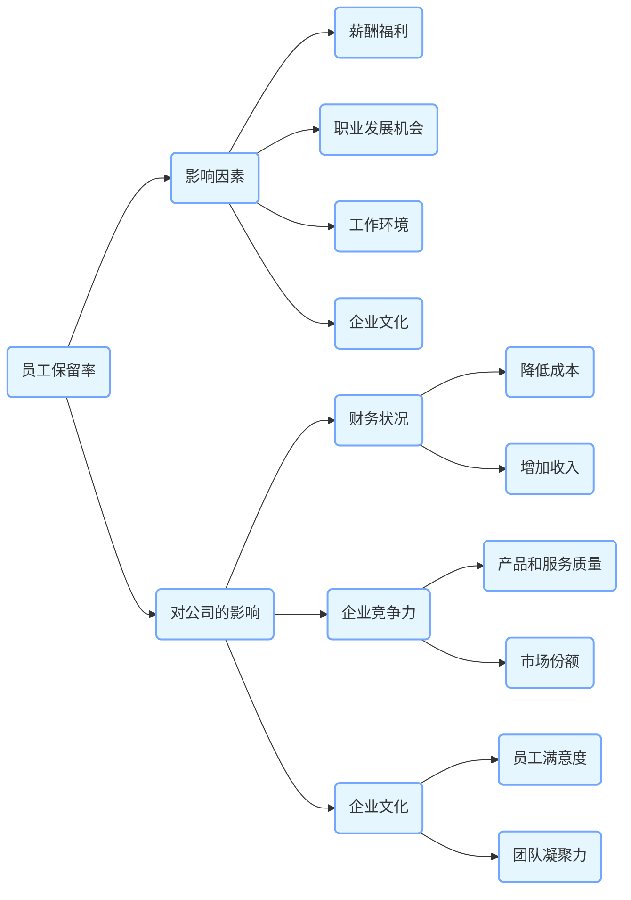

# 彼得林奇如何看待公司的员工保留率

> 关键词：彼得林奇、公司员工保留率、投资分析、企业竞争力、人力资源管理

> 摘要：本文深入探讨彼得林奇对公司员工保留率的看法。彼得林奇作为投资界的传奇人物，其投资理念强调关注公司的基本面，而员工保留率是其中一个重要的考量因素。文章首先介绍相关背景知识，包括目的范围、预期读者等；接着阐述核心概念，分析员工保留率与公司各方面的联系；详细讲解核心算法原理和具体操作步骤，用 Python 代码辅助说明；给出数学模型和公式并举例；通过项目实战案例加深理解；探讨员工保留率在实际中的应用场景；推荐相关工具和资源；最后总结未来发展趋势与挑战，解答常见问题，并提供扩展阅读和参考资料，旨在帮助读者全面理解彼得林奇视角下员工保留率的重要性及其在投资和企业管理中的应用。

## 1. 背景介绍 
### 1.1 目的和范围
本文的目的是全面剖析彼得林奇对公司员工保留率的观点和看法，以及这种观点如何应用于投资分析和企业管理。范围涵盖彼得林奇的投资理论中员工保留率的地位、员工保留率与公司财务状况、竞争力等方面的关系，同时探讨如何在实际操作中运用这些观点进行投资决策和企业管理改进。

### 1.2 预期读者
预期读者包括投资者、企业管理者、人力资源专业人士以及对投资和企业管理感兴趣的学者和爱好者。投资者可以从彼得林奇的观点中学习如何通过员工保留率评估公司的投资价值；企业管理者可以借鉴如何提高员工保留率以增强企业竞争力；人力资源专业人士可以了解员工保留率在企业整体战略中的重要性；学者和爱好者则可以深入研究相关理论和实践案例。

### 1.3 文档结构概述
本文将按照以下结构展开：首先介绍核心概念与联系，明确员工保留率的定义以及它与公司其他方面的关系；接着讲解核心算法原理和具体操作步骤，通过 Python 代码展示如何计算和分析员工保留率；然后给出数学模型和公式，进一步阐述员工保留率与公司业绩等指标的量化关系；通过项目实战案例，详细说明如何在实际中应用这些理论和方法；探讨员工保留率在不同场景下的实际应用；推荐相关的学习资源、开发工具和研究论文；最后总结未来发展趋势与挑战，解答常见问题，并提供扩展阅读和参考资料。

### 1.4 术语表
#### 1.4.1 核心术语定义
- **员工保留率**：指在一定时期内，公司保留的员工数量与期初员工数量的比率，反映了公司留住员工的能力。
- **投资价值**：指公司在市场上的潜在价值，是投资者判断是否投资该公司的重要依据。
- **企业竞争力**：企业在市场中与其他企业竞争的能力，包括产品质量、成本控制、创新能力等多个方面。

#### 1.4.2 相关概念解释
- **人力资源管理**：对企业人力资源进行有效规划、招聘、培训、绩效管理等一系列活动，以实现企业目标的管理过程。员工保留率是人力资源管理的重要指标之一。
- **基本面分析**：通过对公司的财务状况、经营管理、行业前景等基本因素进行分析，评估公司的投资价值。彼得林奇的投资理念强调基本面分析，员工保留率是其中的一个重要因素。

#### 1.4.3 缩略词列表
- **HR**：人力资源（Human Resources）
- **ROI**：投资回报率（Return on Investment）

## 2. 核心概念与联系 
### 2.1 员工保留率的定义
员工保留率（Employee Retention Rate）是衡量公司在一定时期内留住员工能力的指标。其计算公式为：

$$员工保留率 = \frac{期末员工数量 - 期间新招聘员工数量}{期初员工数量} \times 100\%$$

例如，某公司年初有 100 名员工，一年中招聘了 20 名新员工，年末有 110 名员工，则该公司的员工保留率为：

$$\frac{110 - 20}{100} \times 100\% = 90\%$$

### 2.2 彼得林奇对员工保留率的重视
彼得林奇在投资过程中非常重视公司的基本面，他认为员工是公司最重要的资产之一。高员工保留率意味着公司能够吸引和留住优秀的人才，这对于公司的长期发展至关重要。优秀的员工能够为公司带来创新能力、高效的工作效率和良好的客户服务，从而提升公司的竞争力和盈利能力。

### 2.3 员工保留率与公司各方面的联系
#### 2.3.1 与公司财务状况的联系
高员工保留率通常与公司的良好财务状况相关。一方面，稳定的员工队伍可以降低招聘、培训等人力资源成本；另一方面，优秀的员工能够提高工作效率，增加公司的收入和利润。例如，一家科技公司如果能够留住核心的研发人员，就可以不断推出创新产品，提高市场份额，从而增加销售收入。

#### 2.3.2 与企业竞争力的联系
员工保留率是企业竞争力的重要体现。在激烈的市场竞争中，能够留住优秀人才的公司往往具有更强的竞争力。优秀的员工具有丰富的经验和专业知识，能够为公司提供更好的产品和服务，从而吸引更多的客户。例如，一家酒店如果能够保留一批高素质的服务人员，就可以提供优质的服务，吸引更多的客人，提高酒店的知名度和美誉度。

#### 2.3.3 与企业文化的联系
企业文化对员工保留率有着重要的影响。一个积极向上、尊重员工、注重团队合作的企业文化能够吸引和留住员工。例如，谷歌公司以其开放、创新的企业文化吸引了大量优秀的人才，并且员工保留率相对较高。

### 2.4 核心概念原理和架构的文本示意图
```plaintext
员工保留率
|
|-- 影响因素
|   |-- 薪酬福利
|   |-- 职业发展机会
|   |-- 工作环境
|   |-- 企业文化
|
|-- 对公司的影响
|   |-- 财务状况
|   |   |-- 降低成本
|   |   |-- 增加收入
|   |-- 企业竞争力
|   |   |-- 产品和服务质量
|   |   |-- 市场份额
|   |-- 企业文化
|       |-- 员工满意度
|       |-- 团队凝聚力
```

### 2.5 Mermaid 流程图


## 3. 核心算法原理 & 具体操作步骤 
### 3.1 员工保留率的计算原理
员工保留率的计算原理基于上述公式，即通过比较期初员工数量、期末员工数量和期间新招聘员工数量来确定公司在一定时期内留住员工的比例。

### 3.2 Python 代码实现
```python
def calculate_retention_rate(beginning_employees, ending_employees, new_hires):
    """
    计算员工保留率
    :param beginning_employees: 期初员工数量
    :param ending_employees: 期末员工数量
    :param new_hires: 期间新招聘员工数量
    :return: 员工保留率
    """
    if beginning_employees == 0:
        return 0
    retention_rate = ((ending_employees - new_hires) / beginning_employees) * 100
    return retention_rate

# 示例数据
beginning_employees = 100
ending_employees = 110
new_hires = 20

# 计算员工保留率
retention_rate = calculate_retention_rate(beginning_employees, ending_employees, new_hires)
print(f"员工保留率: {retention_rate}%")
```

### 3.3 代码解释
- `calculate_retention_rate` 函数接受三个参数：`beginning_employees` 表示期初员工数量，`ending_employees` 表示期末员工数量，`new_hires` 表示期间新招聘员工数量。
- 在函数内部，首先检查期初员工数量是否为 0，如果为 0 则返回 0，避免除零错误。
- 然后根据员工保留率的计算公式进行计算，并将结果乘以 100 转换为百分比形式。
- 最后返回计算得到的员工保留率。

### 3.4 具体操作步骤
1. **收集数据**：收集公司期初员工数量、期末员工数量和期间新招聘员工数量的数据。这些数据可以从公司的人力资源管理系统或财务报表中获取。
2. **调用函数计算**：将收集到的数据作为参数传递给 `calculate_retention_rate` 函数，计算员工保留率。
3. **分析结果**：根据计算得到的员工保留率，分析公司的员工保留情况。如果员工保留率较高，说明公司在留住员工方面做得较好；如果员工保留率较低，则需要进一步分析原因，采取相应的措施来提高员工保留率。

## 4. 数学模型和公式 & 详细讲解 & 举例说明 
### 4.1 员工保留率与公司业绩的数学模型
我们可以建立一个简单的数学模型来描述员工保留率与公司业绩之间的关系。假设公司的业绩（用净利润表示）$P$ 与员工保留率 $R$ 之间存在线性关系：

$$P = aR + b$$

其中，$a$ 和 $b$ 是模型的参数。$a$ 表示员工保留率对公司业绩的影响系数，$b$ 表示其他因素对公司业绩的影响。

### 4.2 详细讲解
- **参数 $a$ 的意义**：$a$ 表示员工保留率每提高 1%，公司净利润的增加量。如果 $a$ 为正数，说明员工保留率的提高对公司业绩有积极的影响；如果 $a$ 为负数，则说明员工保留率的提高对公司业绩有消极的影响。一般来说，在正常情况下，$a$ 应该是正数。
- **参数 $b$ 的意义**：$b$ 表示当员工保留率为 0 时，公司的净利润。实际上，员工保留率不可能为 0，$b$ 主要反映了其他因素（如市场环境、产品竞争力等）对公司业绩的影响。

### 4.3 举例说明
假设我们通过对某公司过去几年的数据进行回归分析，得到模型参数 $a = 10$，$b = 50$。这意味着员工保留率每提高 1%，公司的净利润将增加 10 万元。如果该公司当前的员工保留率为 80%，则根据模型可以预测公司的净利润为：

$$P = 10 \times 80 + 50 = 850（万元）$$

如果公司采取措施将员工保留率提高到 90%，则预测公司的净利润将变为：

$$P = 10 \times 90 + 50 = 950（万元）$$

通过这个例子可以看出，提高员工保留率对公司的业绩有显著的影响。

### 4.4 注意事项
- 上述数学模型是一个简化的线性模型，实际情况中员工保留率与公司业绩之间的关系可能更为复杂，可能存在非线性关系。
- 模型的参数 $a$ 和 $b$ 需要通过大量的历史数据进行回归分析来确定，不同公司的参数值可能会有所不同。

## 5. 项目实战：代码实际案例和详细解释说明 
### 5.1 开发环境搭建
#### 5.1.1 安装 Python
首先需要安装 Python 开发环境。可以从 Python 官方网站（https://www.python.org/downloads/）下载适合自己操作系统的 Python 版本，并按照安装向导进行安装。

#### 5.1.2 安装必要的库
在本项目中，主要使用 Python 的基本库，不需要额外安装其他库。如果需要进行数据可视化或更复杂的数据分析，可以安装 `matplotlib`、`pandas` 等库。可以使用以下命令进行安装：

```sh
pip install matplotlib pandas
```

### 5.2 源代码详细实现和代码解读
#### 5.2.1 数据收集和整理
假设我们有一个包含公司不同时期员工数量和新招聘员工数量的数据文件 `employee_data.csv`，文件内容如下：

```plaintext
日期,期初员工数量,期末员工数量,新招聘员工数量
2020-01-01,100,110,20
2020-02-01,110,120,15
2020-03-01,120,130,25
```

我们可以使用以下 Python 代码读取数据并计算员工保留率：

```python
import csv

def calculate_retention_rate(beginning_employees, ending_employees, new_hires):
    """
    计算员工保留率
    :param beginning_employees: 期初员工数量
    :param ending_employees: 期末员工数量
    :param new_hires: 期间新招聘员工数量
    :return: 员工保留率
    """
    if beginning_employees == 0:
        return 0
    retention_rate = ((ending_employees - new_hires) / beginning_employees) * 100
    return retention_rate

# 读取数据文件
with open('employee_data.csv', 'r') as file:
    reader = csv.reader(file)
    headers = next(reader)  # 读取表头
    for row in reader:
        date = row[0]
        beginning_employees = int(row[1])
        ending_employees = int(row[2])
        new_hires = int(row[3])
        retention_rate = calculate_retention_rate(beginning_employees, ending_employees, new_hires)
        print(f"{date} 的员工保留率: {retention_rate}%")
```

#### 5.2.2 代码解读
- **`calculate_retention_rate` 函数**：该函数用于计算员工保留率，与前面介绍的函数相同。
- **读取数据文件**：使用 Python 的 `csv` 模块读取 `employee_data.csv` 文件。首先读取表头，然后逐行读取数据。
- **计算员工保留率**：对于每一行数据，提取期初员工数量、期末员工数量和新招聘员工数量，调用 `calculate_retention_rate` 函数计算员工保留率，并打印结果。

### 5.3 代码解读与分析
#### 5.3.1 优点
- **代码简单易懂**：使用 Python 的基本语法和 `csv` 模块，代码结构清晰，易于理解和维护。
- **可扩展性强**：可以很容易地扩展代码，例如添加数据可视化功能、进行更复杂的数据分析等。

#### 5.3.2 缺点
- **数据处理能力有限**：如果数据量非常大，使用 `csv` 模块读取数据可能会导致性能问题。可以考虑使用 `pandas` 库来处理大规模数据。
- **缺乏错误处理**：代码中没有对数据文件的格式错误、数据类型错误等进行处理，在实际应用中需要添加相应的错误处理代码。

## 6. 实际应用场景 
### 6.1 投资分析
在投资分析中，彼得林奇认为员工保留率是评估公司投资价值的重要指标之一。投资者可以通过分析公司的员工保留率来判断公司的管理水平、企业文化和竞争力。如果一家公司的员工保留率较高，说明公司能够吸引和留住优秀的人才，具有较好的发展前景，可能是一个值得投资的对象。

例如，投资者在比较两家同行业的公司时，发现一家公司的员工保留率一直保持在 90% 以上，而另一家公司的员工保留率只有 70% 左右。在其他条件相同的情况下，投资者更倾向于投资员工保留率较高的公司，因为该公司的员工队伍更加稳定，能够为公司带来更高的生产效率和创新能力。

### 6.2 企业管理
在企业管理中，员工保留率是衡量人力资源管理效果的重要指标。企业管理者可以通过分析员工保留率来发现人力资源管理中存在的问题，并采取相应的措施来提高员工保留率。

例如，如果企业的员工保留率较低，管理者可以从薪酬福利、职业发展机会、工作环境等方面进行分析，找出导致员工流失的原因。如果是薪酬福利问题，可以适当提高员工的工资待遇和福利待遇；如果是职业发展机会问题，可以为员工提供更多的培训和晋升机会。

### 6.3 行业比较
不同行业的员工保留率可能存在较大差异。通过比较不同行业的员工保留率，可以了解各个行业的特点和竞争状况。

例如，科技行业的员工保留率相对较低，因为该行业竞争激烈，人才流动频繁；而金融行业的员工保留率相对较高，因为该行业对员工的专业知识和经验要求较高，员工的稳定性较强。企业可以根据行业的平均员工保留率来评估自己在行业中的地位，并采取相应的措施来提高自身的竞争力。

## 7. 工具和资源推荐
### 7.1 学习资源推荐
#### 7.1.1 书籍推荐
- 《彼得林奇的成功投资》：彼得林奇的经典著作，详细介绍了他的投资理念和方法，包括如何通过分析公司的基本面来选择投资对象。
- 《人力资源管理》：全面介绍了人力资源管理的各个方面，包括员工招聘、培训、绩效管理、薪酬福利等，对于理解员工保留率与人力资源管理的关系有很大帮助。

#### 7.1.2 在线课程
- Coursera 上的“投资分析与组合管理”课程：由知名教授授课，系统介绍了投资分析的方法和技巧，包括如何评估公司的投资价值。
- Udemy 上的“人力资源管理基础”课程：适合初学者学习人力资源管理的基本概念和方法，对于了解员工保留率在人力资源管理中的应用有很大帮助。

#### 7.1.3 技术博客和网站
- Seeking Alpha：提供专业的投资分析和研究报告，包括对不同公司的员工保留率等基本面指标的分析。
- HRZone：专注于人力资源管理领域，提供最新的人力资源管理资讯和案例分析，对于了解员工保留率的管理策略有很大帮助。

### 7.2 开发工具框架推荐
#### 7.2.1 IDE和编辑器
- PyCharm：一款专业的 Python 集成开发环境，提供丰富的代码编辑、调试和测试功能，适合开发 Python 项目。
- Visual Studio Code：一款轻量级的代码编辑器，支持多种编程语言，通过安装相应的插件可以实现 Python 开发的各种功能。

#### 7.2.2 调试和性能分析工具
- pdb：Python 自带的调试工具，可以帮助开发者定位代码中的错误。
- cProfile：Python 的性能分析工具，可以分析代码的执行时间和资源消耗情况，帮助开发者优化代码性能。

#### 7.2.3 相关框架和库
- pandas：一个强大的数据处理和分析库，提供了丰富的数据结构和数据处理方法，适合处理大规模的员工数据。
- matplotlib：一个常用的数据可视化库，可以将员工保留率等数据以图表的形式直观地展示出来。

### 7.3 相关论文著作推荐
#### 7.3.1 经典论文
- 《The Impact of Employee Retention on Firm Performance》：该论文研究了员工保留率对公司业绩的影响，通过实证分析得出了员工保留率与公司业绩之间存在正相关关系的结论。
- 《Human Resource Management Practices and Employee Retention》：探讨了人力资源管理实践与员工保留率之间的关系，提出了一系列提高员工保留率的人力资源管理策略。

#### 7.3.2 最新研究成果
- 关注顶尖学术期刊如《Academy of Management Journal》、《Journal of Applied Psychology》等，这些期刊经常发表关于员工保留率和人力资源管理的最新研究成果。

#### 7.3.3 应用案例分析
- 一些咨询公司和行业协会会发布关于员工保留率的应用案例分析报告，例如麦肯锡公司的相关报告，这些报告可以帮助读者了解实际企业中如何通过提高员工保留率来提升企业竞争力。

## 8. 总结：未来发展趋势与挑战
### 8.1 未来发展趋势
#### 8.1.1 数字化管理
随着信息技术的发展，企业对员工保留率的管理将越来越数字化。通过大数据分析和人工智能技术，企业可以更准确地预测员工流失的风险，采取针对性的措施来提高员工保留率。

#### 8.1.2 个性化管理
未来企业将更加注重员工的个性化需求，提供个性化的职业发展规划、薪酬福利方案等，以提高员工的满意度和忠诚度，从而提高员工保留率。

#### 8.1.3 跨文化管理
随着全球化的发展，企业面临着越来越多的跨文化管理问题。在跨文化环境下，如何提高员工保留率将成为企业面临的重要挑战之一。企业需要了解不同文化背景下员工的需求和价值观，采取相应的管理策略。

### 8.2 挑战
#### 8.2.1 人才竞争加剧
随着科技的发展和经济的全球化，人才竞争将越来越激烈。企业需要不断提高自身的吸引力，以留住优秀的人才。

#### 8.2.2 员工需求多样化
现代员工的需求越来越多样化，除了薪酬福利外，他们还注重工作与生活的平衡、职业发展机会、企业文化等方面。企业需要满足员工的多样化需求，才能提高员工保留率。

#### 8.2.3 技术更新换代快
信息技术的发展日新月异，企业需要不断更新自己的管理技术和工具，以适应新的发展趋势。否则，企业可能会在人才管理方面落后于竞争对手。

## 9. 附录：常见问题与解答
### 9.1 员工保留率的正常范围是多少？
员工保留率的正常范围因行业而异。一般来说，制造业的员工保留率可能在 80% - 90% 左右，服务业的员工保留率可能在 70% - 80% 左右。但这只是一个大致的范围，具体的正常范围还需要根据行业特点、企业规模、市场环境等因素来确定。

### 9.2 如何提高员工保留率？
提高员工保留率可以从以下几个方面入手：
- **提供有竞争力的薪酬福利**：确保员工的薪酬水平与市场水平相当，并提供丰富的福利待遇，如保险、假期、培训等。
- **提供良好的职业发展机会**：为员工制定明确的职业发展规划，提供培训和晋升机会，让员工看到自己在企业中的发展前景。
- **营造良好的工作环境**：包括物理环境和人文环境，如舒适的办公设施、和谐的团队氛围等。
- **建立良好的企业文化**：强调企业的价值观和使命，让员工认同企业的文化，增强员工的归属感和忠诚度。

### 9.3 员工保留率与员工满意度有什么关系？
员工保留率与员工满意度密切相关。一般来说，员工满意度越高，员工保留率也越高。因为满意的员工更愿意留在企业中工作，为企业做出贡献。但员工保留率还受到其他因素的影响，如外部市场环境、竞争对手的吸引力等。

## 10. 扩展阅读 & 参考资料
### 10.1 扩展阅读
- 《从优秀到卓越》：探讨了企业如何从优秀走向卓越，其中涉及到员工管理和企业竞争力等方面的内容。
- 《重新定义团队》：介绍了谷歌公司的团队管理经验，对于提高员工保留率和团队效率有很大的启示。

### 10.2 参考资料
- 彼得林奇的相关著作和演讲资料。
- 人力资源管理领域的学术期刊和研究报告。
- 企业的年度报告和财务报表，其中可能包含员工保留率等相关数据。

作者：AI天才研究院/AI Genius Institute & 禅与计算机程序设计艺术 /Zen And The Art of Computer Programming