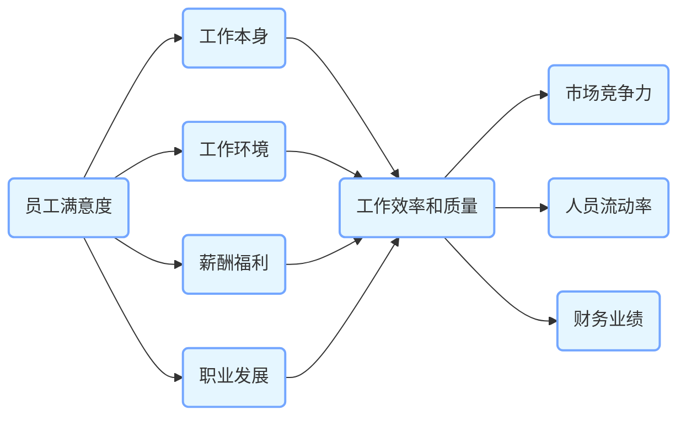

# 彼得林奇如何看待公司的员工满意度

> 关键词：彼得林奇、公司员工满意度、投资分析、企业竞争力、长期价值

> 摘要：本文深入探讨了投资大师彼得林奇对公司员工满意度的看法。通过分析彼得林奇的投资理念和方法，阐述了员工满意度在评估公司价值和投资潜力方面的重要性。从员工满意度与企业竞争力、长期业绩的关系入手，结合具体案例和理论依据，详细剖析了彼得林奇重视员工满意度的原因和背后的逻辑。同时，介绍了如何在投资决策中运用员工满意度这一指标，以及员工满意度对公司各个方面的影响。最后，对未来企业和投资者在员工满意度方面的发展趋势和挑战进行了总结和展望。

## 1. 背景介绍 
### 1.1 目的和范围
本文章旨在深入剖析投资界传奇人物彼得林奇对于公司员工满意度的观点和看法。通过全面梳理彼得林奇的投资思想体系，探究员工满意度在其投资决策中的重要地位和作用。研究范围不仅涵盖了彼得林奇本人的著作、演讲等公开资料中关于员工满意度的直接论述，还涉及到基于这些论述进一步分析员工满意度与公司财务表现、市场竞争力、长期发展潜力等方面的关联。

### 1.2 预期读者
本文预期读者包括对投资领域感兴趣的普通投资者，他们希望从彼得林奇的投资智慧中获取新的投资思路和方法；金融专业的学生和研究人员，通过了解彼得林奇对员工满意度的见解，丰富自己在投资分析和企业研究方面的知识体系；企业管理者也可以从本文中得到启示，认识到员工满意度对企业价值的重要影响，从而在企业管理中更加注重员工体验和满意度的提升。

### 1.3 文档结构概述
本文将首先介绍彼得林奇的投资理念和其对公司基本面分析的重视，引出员工满意度在其中的位置。接着详细阐述员工满意度的核心概念以及它与企业各个方面的联系，包括通过文本示意图和 Mermaid 流程图进行直观展示。然后分析彼得林奇判断员工满意度的核心算法原理，并给出具体操作步骤，同时用 Python 代码进行详细阐述。再通过数学模型和公式深入讲解员工满意度与公司业绩等指标之间的量化关系，并举例说明。之后结合实际项目案例，详细介绍如何在投资分析中运用员工满意度这一指标，包括开发环境搭建、源代码实现和代码解读。随后探讨员工满意度在不同实际应用场景中的体现和作用。接着推荐与员工满意度研究和投资分析相关的工具和资源，包括学习资源、开发工具框架和相关论文著作。最后对未来企业和投资领域在员工满意度方面的发展趋势和挑战进行总结，并提供常见问题解答和扩展阅读参考资料。

### 1.4 术语表
#### 1.4.1 核心术语定义
- **彼得林奇**：美国著名的投资家、基金经理，曾管理富达公司的麦哲伦基金，创造了惊人的投资业绩，其投资理念和方法对全球投资界产生了深远影响。
- **员工满意度**：员工对其工作环境、工作内容、职业发展、薪酬福利等方面的综合感受和评价，反映了员工在企业中的心理状态和对企业的认同程度。
- **投资分析**：对投资对象（如股票、债券等）的价值、风险、预期收益等进行评估和判断的过程，以帮助投资者做出合理的投资决策。

#### 1.4.2 相关概念解释
- **企业竞争力**：企业在市场中与其他竞争对手相比，在产品或服务质量、成本控制、创新能力、客户服务等方面所具备的优势和能力，员工满意度是影响企业竞争力的重要因素之一。
- **长期投资价值**：指投资对象在较长时间内（通常为数年甚至数十年）能够为投资者带来持续稳定回报的能力，员工满意度高的公司往往具有更高的长期投资价值。

#### 1.4.3 缩略词列表
无

## 2. 核心概念与联系 

### 员工满意度的核心概念
员工满意度是一个综合性的概念，它涉及到员工在企业中的多个方面的体验。从工作本身来看，包括工作的挑战性、成就感、技能提升机会等；从工作环境方面，涵盖了物理环境、人际关系氛围等；在薪酬福利上，包括工资水平、奖金、福利政策等；职业发展方面则涉及晋升机会、培训计划等。

### 员工满意度与企业的联系
员工满意度与企业的多个重要方面密切相关。当员工满意度较高时，员工会更有工作积极性和主动性，从而提高工作效率和工作质量。这直接影响到企业的产品或服务质量，进而提升企业的市场竞争力。同时，高满意度的员工更愿意长期留在企业，减少了人员流动率，降低了企业的招聘和培训成本。从财务角度看，员工满意度高的企业往往能够获得更好的业绩表现，因为员工的努力和创新会带来更多的业务机会和利润增长。

### 文本示意图
```plaintext
员工满意度
|
|--工作本身（挑战性、成就感、技能提升）
|--工作环境（物理环境、人际关系）
|--薪酬福利（工资、奖金、福利政策）
|--职业发展（晋升机会、培训计划）
|
|--影响企业
    |--工作效率和质量
    |--市场竞争力
    |--人员流动率
    |--财务业绩
```

### Mermaid 流程图


## 3. 核心算法原理 & 具体操作步骤 

### 核心算法原理
彼得林奇虽然没有明确提出关于员工满意度的具体算法，但我们可以基于他对公司基本面分析的思想构建一个简单的算法模型。这个模型的核心是通过多个指标来综合评估员工满意度。我们可以选取员工流失率、员工绩效、员工对企业的评价等指标，为每个指标赋予一定的权重，然后计算加权平均值来得到一个员工满意度的综合得分。

### 具体操作步骤
1. **确定评估指标**：
    - 员工流失率：过去一年公司员工的离职比例。
    - 员工绩效：可以用员工的工作成果、工作效率等指标来衡量。
    - 员工对企业的评价：通过问卷调查等方式收集员工对企业各个方面的评价得分。
2. **确定指标权重**：根据各个指标对员工满意度的重要程度，为每个指标分配权重。例如，员工流失率权重为 0.3，员工绩效权重为 0.3，员工对企业的评价权重为 0.4。
3. **收集数据**：从公司的人力资源部门获取员工流失率和员工绩效数据，通过发放问卷收集员工对企业的评价数据。
4. **计算得分**：将每个指标的数据进行标准化处理，然后乘以对应的权重，最后将各个指标的得分相加得到综合得分。

### Python 源代码实现
```python
# 假设已经收集到以下数据
# 员工流失率，范围 0 - 1
turnover_rate = 0.1
# 员工绩效得分，范围 0 - 100
employee_performance = 80
# 员工对企业的评价得分，范围 0 - 100
employee_evaluation = 85

# 确定指标权重
weights = {
    'turnover_rate': 0.3,
    'employee_performance': 0.3,
    'employee_evaluation': 0.4
}

# 标准化员工流失率数据，使其范围与其他指标一致
standardized_turnover_rate = (1 - turnover_rate) * 100

# 计算综合得分
overall_score = (standardized_turnover_rate * weights['turnover_rate'] +
                 employee_performance * weights['employee_performance'] +
                 employee_evaluation * weights['employee_evaluation'])

print(f"员工满意度综合得分: {overall_score}")
```

## 4. 数学模型和公式 & 详细讲解 & 举例说明 

### 数学模型和公式
设员工满意度综合得分为 $S$，员工流失率为 $T$，员工绩效为 $P$，员工对企业的评价为 $E$，对应的权重分别为 $w_T$、$w_P$、$w_E$，且 $w_T + w_P + w_E = 1$。则员工满意度综合得分的计算公式为：

$$S = (1 - T) \times 100 \times w_T + P \times w_P + E \times w_E$$

### 详细讲解
- $(1 - T) \times 100$：因为员工流失率越低表示员工满意度可能越高，所以用 1 减去流失率并乘以 100 进行标准化处理，使其与员工绩效和员工对企业的评价指标处于相同的数值范围。
- $w_T$、$w_P$、$w_E$：分别为各个指标的权重，权重的分配根据实际情况和各个指标对员工满意度的重要程度来确定。
- 最后将各个指标标准化后乘以权重再相加，得到员工满意度的综合得分。

### 举例说明
假设一家公司的员工流失率 $T = 0.1$，员工绩效 $P = 80$，员工对企业的评价 $E = 85$，权重 $w_T = 0.3$，$w_P = 0.3$，$w_E = 0.4$。

首先计算标准化后的员工流失率：$(1 - 0.1) \times 100 = 90$

然后计算综合得分：

$$S = 90 \times 0.3 + 80 \times 0.3 + 85 \times 0.4$$
$$S = 27 + 24 + 34$$
$$S = 85$$

这表示该公司的员工满意度综合得分为 85 分，说明员工满意度处于较高水平。

## 5. 项目实战：代码实际案例和详细解释说明 

### 5.1  开发环境搭建
为了运行上述计算员工满意度综合得分的代码，我们需要搭建一个 Python 开发环境。具体步骤如下：
1. **安装 Python**：访问 Python 官方网站（https://www.python.org/downloads/），根据自己的操作系统选择合适的 Python 版本进行下载和安装。建议安装 Python 3.7 及以上版本。
2. **安装开发工具**：可以选择使用 PyCharm、Visual Studio Code 等集成开发环境（IDE），也可以使用简单的文本编辑器如 Sublime Text 等。这里以 PyCharm 为例，访问 JetBrains 官方网站（https://www.jetbrains.com/pycharm/download/）下载并安装 PyCharm Community Edition。
3. **创建项目**：打开 PyCharm，选择“Create New Project”，选择合适的项目路径和 Python 解释器，创建一个新的 Python 项目。

### 5.2  源代码详细实现和代码解读
```python
# 假设已经收集到以下数据
# 员工流失率，范围 0 - 1
turnover_rate = 0.1
# 员工绩效得分，范围 0 - 100
employee_performance = 80
# 员工对企业的评价得分，范围 0 - 100
employee_evaluation = 85

# 确定指标权重
weights = {
    'turnover_rate': 0.3,
    'employee_performance': 0.3,
    'employee_evaluation': 0.4
}

# 标准化员工流失率数据，使其范围与其他指标一致
standardized_turnover_rate = (1 - turnover_rate) * 100

# 计算综合得分
overall_score = (standardized_turnover_rate * weights['turnover_rate'] +
                 employee_performance * weights['employee_performance'] +
                 employee_evaluation * weights['employee_evaluation'])

print(f"员工满意度综合得分: {overall_score}")
```

代码解读：
1. **数据定义**：定义了三个变量 `turnover_rate`、`employee_performance` 和 `employee_evaluation` 分别表示员工流失率、员工绩效和员工对企业的评价。
2. **权重设置**：使用字典 `weights` 来存储各个指标的权重，方便后续计算。
3. **数据标准化**：将员工流失率进行标准化处理，通过 `(1 - turnover_rate) * 100` 使其范围与其他指标一致。
4. **综合得分计算**：根据前面介绍的数学公式，将各个指标标准化后乘以权重再相加，得到员工满意度的综合得分。
5. **结果输出**：使用 `print` 函数输出员工满意度的综合得分。

### 5.3  代码解读与分析
通过上述代码，我们可以快速计算出一家公司的员工满意度综合得分。在实际应用中，我们可以将数据的收集和处理过程进一步优化，例如从数据库中读取数据、使用更复杂的权重分配方法等。同时，我们可以根据不同的行业和企业特点，调整评估指标和权重，以更准确地评估员工满意度。

## 6. 实际应用场景 
### 投资决策
对于投资者来说，员工满意度是评估一家公司投资价值的重要指标之一。彼得林奇在投资过程中非常注重公司的基本面分析，而员工满意度高的公司往往具有更好的长期发展潜力。例如，一家员工满意度高的科技公司，员工更愿意投入精力进行创新研发，可能会推出更有竞争力的产品，从而在市场中获得更大的份额，为投资者带来更高的回报。投资者可以通过关注员工满意度来筛选出具有投资价值的公司，提高投资决策的准确性。

### 企业管理
在企业管理中，员工满意度直接影响到企业的运营效率和业绩。企业管理者可以通过定期评估员工满意度，了解员工的需求和痛点，及时采取措施进行改进。例如，如果发现员工对薪酬福利不满意，企业可以适当提高工资水平或增加福利项目；如果员工对职业发展机会不满意，企业可以制定更完善的培训和晋升计划。通过提高员工满意度，企业可以提高员工的忠诚度和工作积极性，从而提升企业的整体竞争力。

### 行业研究
在进行行业研究时，员工满意度可以作为一个重要的参考指标来比较不同企业在行业中的地位和竞争力。例如，在同一行业中，员工满意度较高的企业往往在管理水平、企业文化等方面具有优势，可能会在未来的市场竞争中脱颖而出。研究人员可以通过分析不同企业的员工满意度数据，了解行业的发展趋势和企业的竞争格局，为行业发展提供有价值的建议。

## 7. 工具和资源推荐
### 7.1 学习资源推荐
#### 7.1.1 书籍推荐
- 《彼得林奇的成功投资》：彼得林奇的经典著作，详细介绍了他的投资理念和方法，包括如何分析公司基本面等内容，对于理解他对员工满意度的看法有很大帮助。
- 《员工满意度调查实用手册》：全面介绍了员工满意度调查的方法、流程和数据分析等内容，有助于深入了解员工满意度的评估和管理。

#### 7.1.2 在线课程
- Coursera 上的“Investment Management Specialization”：提供了系统的投资管理课程，其中包括公司基本面分析等内容，对理解彼得林奇的投资思想有很大帮助。
- edX 上的“Human Resource Management”：涵盖了人力资源管理的各个方面，包括员工满意度管理等内容，适合企业管理者和研究人员学习。

#### 7.1.3 技术博客和网站
- Seeking Alpha：一个知名的投资研究网站，提供了大量关于公司分析和投资策略的文章，其中也会涉及到员工满意度对公司价值的影响等内容。
- Glassdoor：一个专注于员工评价和企业信息的网站，用户可以在上面查看不同公司的员工满意度评价和相关信息，对于了解企业的员工情况非常有帮助。

### 7.2 开发工具框架推荐
#### 7.2.1 IDE和编辑器
- PyCharm：功能强大的 Python 集成开发环境，提供了代码编辑、调试、代码分析等一系列功能，适合 Python 开发者使用。
- Visual Studio Code：轻量级的代码编辑器，支持多种编程语言，具有丰富的插件扩展功能，可以方便地进行 Python 开发。

#### 7.2.2 调试和性能分析工具
- pdb：Python 自带的调试工具，可以帮助开发者逐行调试代码，查找代码中的问题。
- cProfile：Python 的性能分析工具，可以分析代码的运行时间和函数调用情况，帮助开发者优化代码性能。

#### 7.2.3 相关框架和库
- Pandas：用于数据处理和分析的 Python 库，提供了高效的数据结构和数据操作方法，适合处理员工满意度调查数据等。
- NumPy：Python 的科学计算库，提供了多维数组对象和各种数学函数，在数据处理和计算中经常使用。

### 7.3 相关论文著作推荐
#### 7.3.1 经典论文
- “The Impact of Employee Satisfaction on Firm Performance”：研究了员工满意度与企业绩效之间的关系，通过实证分析证明了员工满意度对企业业绩的积极影响。
- “Employee Satisfaction and Customer Loyalty”：探讨了员工满意度与客户忠诚度之间的联系，指出员工满意度高的企业往往能够提供更好的客户服务，从而提高客户忠诚度。

#### 7.3.2 最新研究成果
- 近年来，有很多关于员工满意度的研究聚焦于数字化时代的员工体验和满意度管理，例如如何利用大数据和人工智能技术来提升员工满意度等方面的研究成果。

#### 7.3.3 应用案例分析
- 一些知名企业如谷歌、苹果等在员工满意度管理方面有很多成功的案例，相关的案例分析可以帮助我们了解这些企业的具体做法和经验教训。

## 8. 总结：未来发展趋势与挑战
### 未来发展趋势
- **数字化管理**：随着科技的不断发展，企业将越来越多地利用数字化工具来管理员工满意度。例如，通过大数据分析员工的行为和反馈，实时了解员工的满意度情况，并及时采取措施进行改进。
- **个性化体验**：未来企业将更加注重为员工提供个性化的工作体验，以提高员工满意度。不同员工有不同的需求和期望，企业将根据员工的个人特点和职业发展规划，提供定制化的培训、晋升机会和福利政策等。
- **与企业战略融合**：员工满意度将与企业的战略目标更加紧密地结合起来。企业将认识到员工满意度是实现企业长期发展的关键因素之一，因此会将提高员工满意度纳入企业的战略规划中。

### 挑战
- **数据安全和隐私问题**：在利用数字化工具收集和分析员工满意度数据时，企业需要面临数据安全和隐私保护的挑战。如何确保员工数据的安全，防止数据泄露和滥用，是企业需要解决的重要问题。
- **跨文化管理**：随着企业全球化的发展，企业面临着跨文化管理的挑战。不同文化背景下的员工对工作的期望和满意度标准可能存在差异，企业需要制定适合不同文化背景员工的管理策略，以提高员工满意度。
- **变化快速的职场环境**：职场环境变化快速，新的技术、工作模式和管理理念不断涌现。企业需要及时适应这些变化，调整员工满意度管理策略，以保持员工的满意度和忠诚度。

## 9. 附录：常见问题与解答
### 问题 1：如何准确收集员工满意度数据？
解答：可以通过多种方式收集员工满意度数据，如问卷调查、面谈、员工反馈系统等。在设计问卷调查时，要确保问题清晰、客观，涵盖员工关注的各个方面。面谈可以选择部分有代表性的员工进行深入交流，了解他们的真实想法。员工反馈系统可以实时收集员工的意见和建议。同时，要保证数据收集过程的匿名性和保密性，以提高员工参与的积极性和数据的真实性。

### 问题 2：员工满意度与企业业绩之间的关系是必然的吗？
解答：员工满意度与企业业绩之间存在着密切的关联，但不是必然的因果关系。一般来说，员工满意度高有助于提高员工的工作效率和质量，从而促进企业业绩的提升。但企业业绩还受到市场环境、竞争对手、产品创新等多种因素的影响。因此，员工满意度是影响企业业绩的重要因素之一，但不能完全决定企业的业绩。

### 问题 3：如何根据员工满意度数据制定改进措施？
解答：首先要对员工满意度数据进行深入分析，找出员工满意度较低的方面。例如，如果发现员工对工作环境不满意，可以考虑改善办公设施、优化工作空间布局等。如果员工对职业发展机会不满意，可以制定培训计划、建立晋升通道等。制定改进措施时要具体、可行，并明确责任人和时间节点，确保措施能够得到有效执行。

## 10. 扩展阅读 & 参考资料
### 扩展阅读
- 《从优秀到卓越》：探讨了企业如何实现从优秀到卓越的跨越，其中涉及到员工管理和企业文化等方面的内容，与员工满意度密切相关。
- 《驱动力：关于激励的惊人真相》：介绍了人类行为的内在驱动力，对于理解员工的工作动力和满意度有很大的启发。

### 参考资料
- 彼得林奇相关著作和演讲资料。
- 各类学术期刊上关于员工满意度和企业管理的研究论文。
- 企业管理咨询公司发布的关于员工满意度的报告和研究成果。

作者：AI天才研究院/AI Genius Institute & 禅与计算机程序设计艺术 /Zen And The Art of Computer Programming