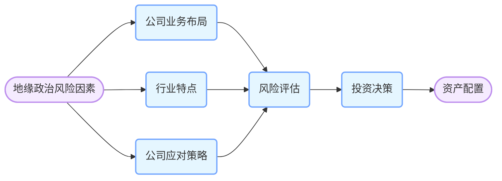

# 彼得林奇如何看待公司的地缘政治风险

> 关键词：彼得林奇、公司、地缘政治风险、投资分析、风险评估

> 摘要：本文聚焦于投资大师彼得林奇对公司地缘政治风险的看法。通过深入剖析彼得林奇的投资理念和方法，探讨地缘政治风险对公司的多方面影响。首先介绍地缘政治风险的相关背景知识，包括其概念、主要表现形式等。接着详细阐述彼得林奇分析公司地缘政治风险的核心概念和方法，以及背后的算法原理和数学模型。结合实际案例，说明如何在投资中运用这些理论进行公司地缘政治风险的评估。最后探讨地缘政治风险在实际投资中的应用场景，推荐相关的学习资源、开发工具和研究论文，并分析未来地缘政治风险在投资领域的发展趋势与挑战。

## 1. 背景介绍 
### 1.1 目的和范围
本文的主要目的是深入探讨彼得林奇对公司地缘政治风险的看法和评估方法。彼得林奇作为投资界的传奇人物，他的投资理念和方法对投资者有着深远的影响。地缘政治风险是公司运营和投资过程中不可忽视的重要因素，了解彼得林奇如何看待和应对这一风险，对于投资者在复杂的市场环境中做出明智的决策具有重要意义。

本文的范围涵盖了地缘政治风险的基本概念、彼得林奇分析公司地缘政治风险的核心方法、相关的算法原理和数学模型，以及实际应用案例。同时，还将介绍与地缘政治风险评估相关的学习资源、开发工具和研究论文，为读者提供全面的知识体系。

### 1.2 预期读者
本文的预期读者包括投资者、金融分析师、企业管理者以及对地缘政治和投资领域感兴趣的学者和爱好者。无论是专业的投资人士还是初学者，都可以从本文中获取有关彼得林奇投资理念和地缘政治风险评估的有价值信息。

### 1.3 文档结构概述
本文将按照以下结构进行组织：
1. 背景介绍：介绍本文的目的、范围、预期读者和文档结构，以及相关的术语和概念。
2. 核心概念与联系：阐述地缘政治风险的核心概念，以及彼得林奇分析公司地缘政治风险的方法和理念。通过文本示意图和Mermaid流程图展示相关概念之间的联系。
3. 核心算法原理 & 具体操作步骤：详细讲解彼得林奇分析公司地缘政治风险的算法原理，并给出具体的操作步骤和Python源代码示例。
4. 数学模型和公式 & 详细讲解 & 举例说明：介绍用于评估公司地缘政治风险的数学模型和公式，并通过具体的例子进行详细讲解。
5. 项目实战：代码实际案例和详细解释说明：通过实际的项目案例，展示如何运用彼得林奇的方法进行公司地缘政治风险的评估，并对代码进行详细的解释和分析。
6. 实际应用场景：探讨地缘政治风险在不同投资场景中的应用，以及投资者如何根据地缘政治风险调整投资策略。
7. 工具和资源推荐：推荐与地缘政治风险评估相关的学习资源、开发工具和研究论文，帮助读者进一步深入学习和研究。
8. 总结：未来发展趋势与挑战：总结本文的主要内容，分析地缘政治风险在投资领域的未来发展趋势和面临的挑战。
9. 附录：常见问题与解答：对读者可能关心的常见问题进行解答，提供更详细的信息和指导。
10. 扩展阅读 & 参考资料：提供相关的扩展阅读材料和参考资料，方便读者进一步深入研究。

### 1.4 术语表
#### 1.4.1 核心术语定义
- **地缘政治风险**：指由于地理位置、政治格局、国际关系等因素导致的对公司运营和投资产生不利影响的风险。这些因素包括战争、政治动荡、贸易摩擦、政策变化等。
- **投资组合**：指投资者持有的一组不同资产的组合，旨在通过分散投资降低风险并实现预期的投资回报。
- **风险评估**：指对可能影响公司或投资的各种风险因素进行识别、分析和评估的过程，以确定风险的大小和可能性，并制定相应的应对策略。

#### 1.4.2 相关概念解释
- **宏观经济环境**：指一个国家或地区的总体经济状况，包括经济增长、通货膨胀、利率、汇率等因素。宏观经济环境的变化会对公司的运营和投资产生重要影响。
- **行业竞争格局**：指一个行业内不同企业之间的竞争关系和市场份额分布。行业竞争格局的变化会影响公司的市场地位和盈利能力。
- **公司基本面**：指公司的财务状况、经营业绩、管理团队、产品或服务等方面的基本情况。公司基本面是评估公司价值和投资潜力的重要依据。

#### 1.4.3 缩略词列表
- **GDP**：国内生产总值（Gross Domestic Product），是衡量一个国家或地区经济总量的重要指标。
- **CPI**：消费者物价指数（Consumer Price Index），是衡量通货膨胀水平的重要指标。
- **PE**：市盈率（Price-to-Earnings Ratio），是衡量公司股票价格相对于每股盈利的指标。

## 2. 核心概念与联系 

### 地缘政治风险的核心概念
地缘政治风险是指由于地理位置、政治格局、国际关系等因素导致的对公司运营和投资产生不利影响的风险。地缘政治风险的来源广泛，包括战争、政治动荡、贸易摩擦、政策变化、恐怖主义等。这些因素可能导致公司的生产经营受到干扰、市场需求下降、成本上升、资产损失等，从而影响公司的盈利能力和市场价值。

### 彼得林奇分析公司地缘政治风险的方法和理念
彼得林奇是一位注重基本面分析的投资者，他认为投资者应该深入了解公司的业务和行业环境，关注公司的盈利能力、成长潜力和竞争优势。在分析公司地缘政治风险时，彼得林奇强调以下几点：
1. **关注公司的业务布局**：了解公司在不同地区的业务分布情况，评估公司对特定地区的依赖程度。如果公司的业务集中在政治不稳定或地缘政治风险较高的地区，那么公司面临的风险就会相对较大。
2. **分析行业的特点**：不同行业对地缘政治风险的敏感度不同。例如，能源、原材料等行业通常对地缘政治风险较为敏感，因为这些行业的生产和供应受到地缘政治因素的影响较大。而一些消费类行业，如食品、饮料等，对地缘政治风险的敏感度相对较低。
3. **研究公司的应对策略**：了解公司在面对地缘政治风险时的应对策略，评估公司的风险管理能力。例如，公司是否采取了多元化的业务布局、是否有有效的供应链管理措施、是否有应对政策变化的能力等。

### 核心概念的文本示意图
```plaintext
地缘政治风险
|-- 战争
|-- 政治动荡
|-- 贸易摩擦
|-- 政策变化
|-- 恐怖主义

公司
|-- 业务布局
|-- 行业特点
|-- 应对策略

投资决策
|-- 风险评估
|-- 收益预期
|-- 资产配置
```

### Mermaid 流程图


## 3. 核心算法原理 & 具体操作步骤 

### 核心算法原理
彼得林奇分析公司地缘政治风险的核心算法原理是基于对公司业务布局、行业特点和应对策略的综合评估。具体来说，算法的步骤如下：
1. **确定地缘政治风险因素**：首先，需要确定可能影响公司的地缘政治风险因素，如战争、政治动荡、贸易摩擦等。可以通过关注新闻报道、政府公告、国际组织报告等渠道获取相关信息。
2. **评估公司业务布局的风险**：分析公司在不同地区的业务分布情况，计算公司在高风险地区的业务占比。业务占比越高，公司面临的地缘政治风险就越大。
3. **分析行业的风险敏感度**：研究公司所处行业对地缘政治风险的敏感度。可以通过分析行业历史数据、行业研究报告等方式进行评估。
4. **评估公司的应对策略**：了解公司在面对地缘政治风险时的应对策略，如多元化业务布局、供应链管理、政策应对等。评估公司应对策略的有效性和可行性。
5. **综合评估风险**：根据以上步骤的评估结果，综合考虑公司业务布局、行业特点和应对策略，对公司的地缘政治风险进行综合评估。可以采用打分法或评级法对风险进行量化评估。

### 具体操作步骤
以下是使用Python实现彼得林奇分析公司地缘政治风险的具体操作步骤：

```python
# 步骤1：确定地缘政治风险因素
# 假设我们已经收集到了相关的地缘政治风险因素数据，用一个列表表示
geopolitical_risks = ['战争', '政治动荡', '贸易摩擦', '政策变化']

# 步骤2：评估公司业务布局的风险
# 假设公司在不同地区的业务占比数据，用一个字典表示
business_layout = {
    '地区A': 0.3,
    '地区B': 0.2,
    '地区C': 0.5
}

# 假设地区A和地区B是高风险地区
high_risk_areas = ['地区A', '地区B']

# 计算公司在高风险地区的业务占比
high_risk_business_ratio = sum([business_layout[area] for area in high_risk_areas if area in business_layout])
print(f"公司在高风险地区的业务占比: {high_risk_business_ratio}")

# 步骤3：分析行业的风险敏感度
# 假设我们已经对行业的风险敏感度进行了评估，用一个数值表示
industry_risk_sensitivity = 0.8

# 步骤4：评估公司的应对策略
# 假设我们对公司的应对策略进行了评估，用一个数值表示
company_response_strategy_score = 0.6

# 步骤5：综合评估风险
# 假设我们采用加权平均的方法进行综合评估，权重分别为0.4、0.3、0.3
risk_score = high_risk_business_ratio * 0.4 + industry_risk_sensitivity * 0.3 + company_response_strategy_score * 0.3
print(f"公司的地缘政治风险得分: {risk_score}")
```

### 代码解释
1. **步骤1**：确定地缘政治风险因素，用一个列表表示。
2. **步骤2**：评估公司业务布局的风险，通过计算公司在高风险地区的业务占比来衡量。
3. **步骤3**：分析行业的风险敏感度，用一个数值表示。
4. **步骤4**：评估公司的应对策略，用一个数值表示。
5. **步骤5**：综合评估风险，采用加权平均的方法，将业务布局风险、行业风险敏感度和公司应对策略得分进行加权平均，得到公司的地缘政治风险得分。

## 4. 数学模型和公式 & 详细讲解 & 举例说明 

### 数学模型和公式
在评估公司地缘政治风险时，可以采用以下数学模型和公式：

$$R = w_1 \times B + w_2 \times I + w_3 \times C$$

其中：
- $R$ 表示公司的地缘政治风险得分。
- $w_1$、$w_2$、$w_3$ 分别表示业务布局风险、行业风险敏感度和公司应对策略的权重，且 $w_1 + w_2 + w_3 = 1$。
- $B$ 表示公司在高风险地区的业务占比。
- $I$ 表示行业的风险敏感度。
- $C$ 表示公司的应对策略得分。

### 详细讲解
这个数学模型的核心思想是综合考虑公司业务布局、行业特点和应对策略三个方面的因素，对公司的地缘政治风险进行量化评估。具体来说：
- **业务布局风险**：公司在高风险地区的业务占比越高，面临的地缘政治风险就越大。因此，$B$ 的值越大，$R$ 的值也会越大。
- **行业风险敏感度**：不同行业对地缘政治风险的敏感度不同。行业风险敏感度越高，公司面临的地缘政治风险也会越大。因此，$I$ 的值越大，$R$ 的值也会越大。
- **公司应对策略**：公司的应对策略越有效，能够降低地缘政治风险对公司的影响。因此，$C$ 的值越大，$R$ 的值会越小。

### 举例说明
假设一家公司的业务布局如下：
| 地区 | 业务占比 |
| ---- | ---- |
| 地区A | 0.3 |
| 地区B | 0.2 |
| 地区C | 0.5 |

其中，地区A和地区B是高风险地区。则公司在高风险地区的业务占比 $B = 0.3 + 0.2 = 0.5$。

假设该公司所处行业的风险敏感度 $I = 0.8$，公司的应对策略得分 $C = 0.6$。

假设业务布局风险、行业风险敏感度和公司应对策略的权重分别为 $w_1 = 0.4$、$w_2 = 0.3$、$w_3 = 0.3$。

则该公司的地缘政治风险得分 $R$ 为：

$$R = 0.4 \times 0.5 + 0.3 \times 0.8 + 0.3 \times 0.6$$
$$R = 0.2 + 0.24 + 0.18$$
$$R = 0.62$$

这表明该公司面临的地缘政治风险处于中等水平。投资者可以根据这个风险得分，结合自己的风险承受能力和投资目标，做出相应的投资决策。

## 5. 项目实战：代码实际案例和详细解释说明 

### 5.1  开发环境搭建
为了实现彼得林奇分析公司地缘政治风险的代码，我们需要搭建以下开发环境：
1. **Python 环境**：建议使用 Python 3.6 及以上版本。可以从 Python 官方网站（https://www.python.org/downloads/）下载并安装。
2. **开发工具**：可以使用任何喜欢的 Python 开发工具，如 PyCharm、Jupyter Notebook 等。这里我们推荐使用 Jupyter Notebook，它可以方便地进行代码的编写、调试和展示。

### 5.2  源代码详细实现和代码解读
以下是一个完整的 Python 代码示例，用于实现彼得林奇分析公司地缘政治风险的方法：

```python
# 步骤1：确定地缘政治风险因素
geopolitical_risks = ['战争', '政治动荡', '贸易摩擦', '政策变化']

# 步骤2：评估公司业务布局的风险
business_layout = {
    '地区A': 0.3,
    '地区B': 0.2,
    '地区C': 0.5
}
high_risk_areas = ['地区A', '地区B']
high_risk_business_ratio = sum([business_layout[area] for area in high_risk_areas if area in business_layout])

# 步骤3：分析行业的风险敏感度
industry_risk_sensitivity = 0.8

# 步骤4：评估公司的应对策略
company_response_strategy_score = 0.6

# 步骤5：综合评估风险
weights = [0.4, 0.3, 0.3]
risk_score = weights[0] * high_risk_business_ratio + weights[1] * industry_risk_sensitivity + weights[2] * company_response_strategy_score

# 输出结果
print(f"公司在高风险地区的业务占比: {high_risk_business_ratio}")
print(f"行业的风险敏感度: {industry_risk_sensitivity}")
print(f"公司的应对策略得分: {company_response_strategy_score}")
print(f"公司的地缘政治风险得分: {risk_score}")
```

### 代码解读与分析
1. **步骤1**：确定地缘政治风险因素，用一个列表表示。这一步是为了明确可能影响公司的地缘政治风险因素。
2. **步骤2**：评估公司业务布局的风险。通过计算公司在高风险地区的业务占比，来衡量公司业务布局面临的地缘政治风险。
3. **步骤3**：分析行业的风险敏感度。用一个数值表示行业对地缘政治风险的敏感程度。
4. **步骤4**：评估公司的应对策略。用一个数值表示公司在面对地缘政治风险时的应对能力。
5. **步骤5**：综合评估风险。采用加权平均的方法，将业务布局风险、行业风险敏感度和公司应对策略得分进行加权平均，得到公司的地缘政治风险得分。
6. **输出结果**：打印出公司在高风险地区的业务占比、行业的风险敏感度、公司的应对策略得分和公司的地缘政治风险得分，方便投资者进行分析和决策。

通过这个代码示例，我们可以看到如何运用彼得林奇的方法对公司的地缘政治风险进行评估。投资者可以根据评估结果，结合自己的风险承受能力和投资目标，做出合理的投资决策。

## 6. 实际应用场景 
### 股票投资
在股票投资中，投资者可以运用彼得林奇的方法评估公司的地缘政治风险，从而选择风险相对较低、投资价值较高的股票。例如，如果一家公司的业务主要集中在政治稳定、经济发展良好的地区，且行业对地缘政治风险的敏感度较低，同时公司有有效的应对策略，那么该公司的地缘政治风险相对较低，可能是一个较好的投资选择。

### 基金投资
基金经理在构建投资组合时，也需要考虑地缘政治风险。通过评估不同公司的地缘政治风险，基金经理可以合理配置资产，降低投资组合的整体风险。例如，基金经理可以选择投资一些业务布局分散、行业风险敏感度较低的公司，以减少地缘政治风险对投资组合的影响。

### 企业战略决策
企业在制定战略决策时，也需要考虑地缘政治风险。例如，企业在进行海外投资、拓展国际市场时，需要评估目标地区的地缘政治风险，制定相应的风险管理策略。如果目标地区的地缘政治风险较高，企业可以选择采取多元化的投资策略、加强供应链管理、与当地企业合作等方式来降低风险。

### 风险管理
金融机构和企业在进行风险管理时，也可以运用彼得林奇的方法评估地缘政治风险。通过对地缘政治风险的量化评估，金融机构和企业可以制定相应的风险应对措施，如购买保险、进行套期保值等，以降低地缘政治风险对自身的影响。

## 7. 工具和资源推荐
### 7.1 学习资源推荐
#### 7.1.1 书籍推荐
- 《彼得林奇的成功投资》：彼得林奇的经典著作，详细介绍了他的投资理念和方法，对于学习如何分析公司和评估风险具有重要的参考价值。
- 《聪明的投资者》：本杰明·格雷厄姆的经典著作，被誉为投资界的圣经。书中介绍了价值投资的基本理念和方法，对于理解投资风险和回报具有重要的指导意义。
- 《金融炼金术》：乔治·索罗斯的著作，介绍了他的反身性理论和投资实践。通过阅读这本书，可以了解到地缘政治等因素对金融市场的影响。

#### 7.1.2 在线课程
- Coursera上的“投资学原理”：该课程由知名大学的教授授课，系统介绍了投资学的基本原理和方法，包括风险评估、资产配置等内容。
- edX上的“金融市场”：该课程由耶鲁大学的教授授课，深入讲解了金融市场的运行机制和投资策略，对于理解地缘政治风险对金融市场的影响具有重要的帮助。

#### 7.1.3 技术博客和网站
- Seeking Alpha：一个专业的金融投资博客网站，提供大量的投资分析文章和研究报告，包括对公司地缘政治风险的分析。
- Bloomberg：全球知名的财经媒体，提供实时的金融市场数据和新闻报道，对于了解地缘政治事件对金融市场的影响非常有帮助。

### 7.2 开发工具框架推荐
#### 7.2.1 IDE和编辑器
- PyCharm：一款专业的 Python 集成开发环境，具有强大的代码编辑、调试和分析功能，适合开发复杂的 Python 程序。
- Jupyter Notebook：一个交互式的编程环境，支持多种编程语言，方便进行数据处理、分析和可视化。

#### 7.2.2 调试和性能分析工具
- PDB：Python 自带的调试工具，可以帮助开发者在代码运行过程中进行调试和排查问题。
- cProfile：Python 标准库中的性能分析工具，可以帮助开发者分析代码的性能瓶颈。

#### 7.2.3 相关框架和库
- Pandas：一个强大的数据处理和分析库，提供了丰富的数据结构和函数，方便进行数据清洗、转换和分析。
- NumPy：一个用于科学计算的 Python 库，提供了高效的多维数组对象和数学函数，适合进行数值计算和数据分析。

### 7.3 相关论文著作推荐
#### 7.3.1 经典论文
- “The Impact of Geopolitical Risk on Stock Returns”：该论文研究了地缘政治风险对股票回报率的影响，通过实证分析得出了相关结论。
- “Geopolitical Risk and Corporate Investment”：该论文探讨了地缘政治风险对企业投资决策的影响，分析了企业在面对地缘政治风险时的投资策略。

#### 7.3.2 最新研究成果
- 可以关注顶级金融学术期刊，如《Journal of Finance》、《Review of Financial Studies》等，了解关于地缘政治风险的最新研究成果。

#### 7.3.3 应用案例分析
- 可以查阅一些知名金融机构的研究报告，如摩根大通、高盛等，了解他们在实际投资中如何评估和应对地缘政治风险。

## 8. 总结：未来发展趋势与挑战
### 未来发展趋势
1. **地缘政治风险的复杂性增加**：随着全球化的深入发展，各国之间的政治、经济和文化联系日益紧密，地缘政治风险的来源和影响范围也越来越广泛。未来，地缘政治风险可能会更加复杂多变，投资者需要更加关注和研究地缘政治因素对公司和投资的影响。
2. **科技发展对地缘政治风险评估的影响**：随着科技的不断发展，大数据、人工智能等技术在金融领域的应用越来越广泛。这些技术可以帮助投资者更准确地评估地缘政治风险，提高投资决策的科学性和准确性。
3. **国际合作与协调的重要性增加**：地缘政治风险是全球性的问题，需要各国之间加强合作与协调。未来，国际组织和各国政府可能会加强在地缘政治风险防范和应对方面的合作，共同维护全球经济和金融稳定。

### 挑战
1. **数据获取和分析的难度**：地缘政治风险涉及到大量的政治、经济和社会数据，这些数据的获取和分析存在一定的难度。投资者需要建立有效的数据收集和分析体系，提高数据的质量和可靠性。
2. **风险评估的主观性**：地缘政治风险的评估存在一定的主观性，不同的投资者可能会对同一地缘政治事件有不同的看法和评估结果。因此，投资者需要不断提高自己的分析能力和判断力，尽量减少主观因素的影响。
3. **政策变化的不确定性**：地缘政治风险往往与政策变化密切相关，政策的不确定性会增加地缘政治风险的评估难度。投资者需要密切关注政策变化，及时调整投资策略。

## 9. 附录：常见问题与解答
### 问题1：如何确定地缘政治风险因素？
答：可以通过关注新闻报道、政府公告、国际组织报告等渠道获取相关信息，同时也可以参考专业的地缘政治研究机构的分析报告。

### 问题2：如何评估行业的风险敏感度？
答：可以通过分析行业历史数据、行业研究报告等方式进行评估。同时，也可以关注行业内领先企业的经营情况和应对策略，了解行业对地缘政治风险的敏感程度。

### 问题3：如何评估公司的应对策略？
答：可以通过分析公司的年报、季报、公告等信息，了解公司在面对地缘政治风险时的应对措施。同时，也可以关注公司的管理层访谈、行业会议等活动，了解公司的风险管理理念和策略。

### 问题4：地缘政治风险评估的结果是否可靠？
答：地缘政治风险评估的结果具有一定的主观性和不确定性，受到多种因素的影响。因此，评估结果只能作为参考，投资者还需要结合自己的判断和分析，做出合理的投资决策。

## 10. 扩展阅读 & 参考资料
### 扩展阅读
- 《地缘政治学：过去、现在和未来》：深入介绍了地缘政治学的基本理论和发展历程，对于理解地缘政治风险的本质具有重要的帮助。
- 《全球政治与安全报告》：每年发布的报告，对全球政治和安全形势进行全面分析和评估，包括地缘政治风险的分析和预测。

### 参考资料
- 彼得林奇相关的投资著作和访谈资料。
- 国际货币基金组织（IMF）、世界银行等国际组织发布的相关报告。
- 金融学术期刊上发表的关于地缘政治风险的研究论文。

作者：AI天才研究院/AI Genius Institute & 禅与计算机程序设计艺术 /Zen And The Art of Computer Programming