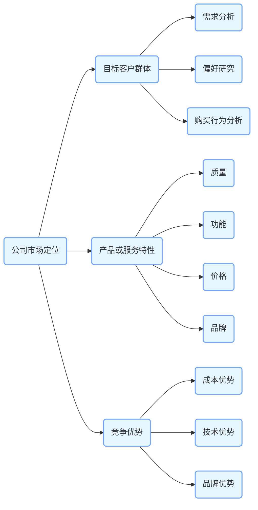

# 彼得林奇如何看待公司的市场定位

> 关键词：彼得林奇、公司市场定位、投资分析、企业战略、行业竞争

> 摘要：本文深入探讨彼得林奇对于公司市场定位的看法。彼得林奇作为投资界的传奇人物，其对公司市场定位的见解深刻影响着投资者的决策。文章将先介绍相关背景知识，接着阐述核心概念及联系，分析核心算法原理（虽在该主题中无传统算法，但会用逻辑分析替代），引入数学模型辅助理解，通过项目实战案例加深认识，探讨实际应用场景，推荐相关工具和资源，最后总结未来发展趋势与挑战，并解答常见问题，为读者全面剖析彼得林奇对公司市场定位的观点，助力投资者更好地把握投资机会。

## 1. 背景介绍 
### 1.1 目的和范围
本文章的主要目的是深入研究彼得林奇对于公司市场定位的观点和看法。彼得林奇在投资领域有着卓越的成就和深远的影响力，他对公司市场定位的分析方法和见解为投资者提供了宝贵的参考。通过对他的思想进行梳理和解读，帮助投资者更好地理解如何评估公司在市场中的地位，从而做出更明智的投资决策。

文章的范围将涵盖彼得林奇所提出的与公司市场定位相关的核心概念、分析方法、实际案例等方面。同时，会结合现代商业环境，探讨其观点在当前市场中的应用和局限性。

### 1.2 预期读者
本文的预期读者主要包括对投资领域感兴趣的个人投资者、金融行业从业者、企业管理者以及相关专业的学生。对于个人投资者来说，了解彼得林奇对公司市场定位的看法可以提升他们的投资分析能力；金融行业从业者可以从中获取新的投资思路和方法；企业管理者可以借鉴这些观点来审视自身公司的市场定位和战略规划；相关专业的学生则可以将其作为学习投资和企业战略的参考资料。

### 1.3 文档结构概述
本文将按照以下结构进行阐述：首先介绍与彼得林奇以及公司市场定位相关的核心概念和它们之间的联系，并通过示意图和流程图进行直观展示；接着分析核心算法原理（以逻辑分析替代传统算法）和具体操作步骤，用 Python 代码示例辅助说明；引入数学模型和公式，详细讲解并举例，以加深对公司市场定位评估的理解；通过项目实战案例，介绍开发环境搭建、源代码实现和代码解读；探讨彼得林奇观点在实际应用中的场景；推荐相关的学习资源、开发工具框架和论文著作；最后总结未来发展趋势与挑战，解答常见问题，并提供扩展阅读和参考资料。

### 1.4 术语表
#### 1.4.1 核心术语定义
- **彼得林奇**：美国著名的投资家，曾任富达公司旗下麦哲伦基金的基金经理，在其管理期间，麦哲伦基金取得了惊人的投资业绩，他的投资理念和方法对全球投资者产生了深远影响。
- **公司市场定位**：指企业根据自身的产品特性、目标客户群体、竞争对手等因素，在市场中确定自己的位置，以满足特定市场需求并获得竞争优势。
- **利基市场**：是指被市场中的统治者或有绝对优势的企业忽略的某些细分市场，企业可以凭借自身的优势在这些细分市场中获得较高的利润。
- **竞争优势**：企业在市场竞争中相对于竞争对手所具有的独特优势，如成本优势、技术优势、品牌优势等。

#### 1.4.2 相关概念解释
- **投资分析**：是指对投资对象进行研究和评估的过程，包括对公司的财务状况、市场前景、行业竞争等方面的分析，以确定投资的可行性和潜在收益。
- **企业战略**：企业为了实现长期目标而制定的一系列规划和决策，包括市场定位、产品策略、竞争策略等。
- **行业竞争格局**：指行业内各企业之间的竞争关系和力量对比，包括市场份额分布、竞争程度、进入壁垒等。

#### 1.4.3 缩略词列表
- **ROE**：Return on Equity，净资产收益率，是衡量公司盈利能力的重要指标，计算公式为净利润与净资产的比率。
- **EPS**：Earnings Per Share，每股收益，是指公司净利润与发行在外普通股股数的比率，反映了每股股票的盈利水平。

## 2. 核心概念与联系 

### 核心概念原理
彼得林奇认为，公司的市场定位是其在市场中生存和发展的关键。一个清晰明确的市场定位可以帮助公司聚焦资源，满足特定客户群体的需求，从而在激烈的市场竞争中脱颖而出。

公司市场定位主要涉及三个方面：目标客户群体、产品或服务特性以及竞争优势。目标客户群体是公司产品或服务的潜在消费者，公司需要了解他们的需求、偏好和购买行为，以便开发出符合他们需求的产品或服务。产品或服务特性是公司区别于竞争对手的关键因素，包括产品的质量、功能、价格、品牌等。竞争优势则是公司在市场中相对于竞争对手所具有的独特优势，如成本优势、技术优势、品牌优势等。

### 架构的文本示意图
```plaintext
公司市场定位
|-- 目标客户群体
|   |-- 需求分析
|   |-- 偏好研究
|   |-- 购买行为分析
|-- 产品或服务特性
|   |-- 质量
|   |-- 功能
|   |-- 价格
|   |-- 品牌
|-- 竞争优势
|   |-- 成本优势
|   |-- 技术优势
|   |-- 品牌优势
```

### Mermaid 流程图


## 3. 核心算法原理 & 具体操作步骤 

### 核心算法原理（逻辑分析替代）
虽然在评估公司市场定位时没有传统意义上的算法，但可以采用逻辑分析的方法。具体思路是通过收集和分析公司的相关信息，包括财务报表、市场调研数据、行业报告等，从目标客户群体、产品或服务特性和竞争优势三个方面对公司的市场定位进行评估。

### 具体操作步骤
1. **数据收集**
    - 收集公司的财务报表，包括资产负债表、利润表和现金流量表，了解公司的财务状况和经营成果。
    - 进行市场调研，了解目标客户群体的需求、偏好和购买行为。
    - 收集行业报告，了解行业的竞争格局、发展趋势和市场规模。
2. **目标客户群体分析**
    - 根据市场调研数据，确定公司的目标客户群体。
    - 分析目标客户群体的需求、偏好和购买行为，评估公司的产品或服务是否满足他们的需求。
3. **产品或服务特性分析**
    - 分析公司产品或服务的质量、功能、价格和品牌等特性。
    - 与竞争对手的产品或服务进行比较，评估公司产品或服务的竞争力。
4. **竞争优势分析**
    - 分析公司在成本、技术和品牌等方面的优势。
    - 评估公司的竞争优势是否可持续，以及是否能够帮助公司在市场中获得竞争地位。
5. **综合评估**
    - 根据以上分析结果，对公司的市场定位进行综合评估。
    - 判断公司的市场定位是否清晰明确，是否具有竞争力，以及是否能够为公司带来长期的发展。

### Python 代码示例
```python
# 假设我们有一个公司信息的字典，包含目标客户群体、产品特性和竞争优势等信息
company_info = {
    "target_customers": ["年轻人", "上班族"],
    "product_features": {
        "quality": "高",
        "function": "丰富",
        "price": "中等",
        "brand": "知名"
    },
    "competitive_advantages": ["技术领先", "成本控制好"]
}

# 目标客户群体分析
def analyze_target_customers(target_customers):
    if len(target_customers) > 0:
        print("公司有明确的目标客户群体：", ", ".join(target_customers))
    else:
        print("公司目标客户群体不明确")

# 产品或服务特性分析
def analyze_product_features(product_features):
    print("产品特性分析：")
    for feature, value in product_features.items():
        print(f"{feature}: {value}")

# 竞争优势分析
def analyze_competitive_advantages(competitive_advantages):
    if len(competitive_advantages) > 0:
        print("公司具有以下竞争优势：", ", ".join(competitive_advantages))
    else:
        print("公司没有明显的竞争优势")

# 综合评估
def comprehensive_evaluation(company_info):
    analyze_target_customers(company_info["target_customers"])
    analyze_product_features(company_info["product_features"])
    analyze_competitive_advantages(company_info["competitive_advantages"])

# 执行综合评估
comprehensive_evaluation(company_info)
```

## 4. 数学模型和公式 & 详细讲解 & 举例说明 

### 数学模型
在评估公司市场定位时，可以使用一些数学模型和公式来辅助分析。以下是几个常用的模型和公式：

#### 市场份额模型
市场份额是指公司在特定市场中的销售额占整个市场销售额的比例，计算公式为：
$$市场份额 = \frac{公司销售额}{市场总销售额} \times 100\%$$

市场份额反映了公司在市场中的竞争地位，市场份额越高，说明公司在市场中的竞争力越强。

#### 盈利能力模型
盈利能力是指公司获取利润的能力，常用的指标有净资产收益率（ROE）和每股收益（EPS）。

净资产收益率的计算公式为：
$$ROE = \frac{净利润}{净资产} \times 100\%$$

每股收益的计算公式为：
$$EPS = \frac{净利润}{发行在外普通股股数}$$

ROE 和 EPS 越高，说明公司的盈利能力越强。

#### 成本效益模型
成本效益模型用于评估公司的成本控制能力和效益水平，常用的指标有成本利润率。

成本利润率的计算公式为：
$$成本利润率 = \frac{利润总额}{成本总额} \times 100\%$$

成本利润率越高，说明公司的成本控制能力越强，效益水平越高。

### 详细讲解
- **市场份额模型**：通过计算公司的市场份额，可以直观地了解公司在市场中的竞争地位。市场份额的变化可以反映公司的市场竞争力的变化，如果市场份额不断上升，说明公司的市场竞争力在增强；反之，如果市场份额不断下降，说明公司的市场竞争力在减弱。
- **盈利能力模型**：ROE 和 EPS 是衡量公司盈利能力的重要指标。ROE 反映了公司利用自有资本获取利润的能力，EPS 反映了每股股票的盈利水平。投资者通常会关注公司的 ROE 和 EPS 指标，选择 ROE 和 EPS 较高的公司进行投资。
- **成本效益模型**：成本利润率反映了公司在成本控制和效益方面的表现。成本利润率越高，说明公司在相同的成本投入下能够获得更多的利润，成本控制能力和效益水平越好。

### 举例说明
假设公司 A 在某一市场中的销售额为 5000 万元，市场总销售额为 2 亿元，则公司 A 的市场份额为：
$$市场份额 = \frac{5000}{20000} \times 100\% = 25\%$$

假设公司 B 的净利润为 1000 万元，净资产为 5000 万元，发行在外普通股股数为 2000 万股，则公司 B 的 ROE 和 EPS 分别为：
$$ROE = \frac{1000}{5000} \times 100\% = 20\%$$
$$EPS = \frac{1000}{2000} = 0.5（元/股）$$

假设公司 C 的利润总额为 800 万元，成本总额为 4000 万元，则公司 C 的成本利润率为：
$$成本利润率 = \frac{800}{4000} \times 100\% = 20\%$$

## 5. 项目实战：代码实际案例和详细解释说明 

### 5.1  开发环境搭建
为了实现对公司市场定位的分析，我们可以使用 Python 编程语言和一些常用的数据分析库，如 Pandas、NumPy 等。以下是开发环境搭建的步骤：

1. **安装 Python**：从 Python 官方网站（https://www.python.org/downloads/）下载并安装 Python 3.x 版本。
2. **安装数据分析库**：打开命令行工具，使用以下命令安装 Pandas 和 NumPy：
```sh
pip install pandas numpy
```

### 5.2  源代码详细实现和代码解读
以下是一个使用 Python 对公司市场定位进行分析的示例代码：

```python
import pandas as pd

# 假设我们有一个包含多家公司信息的 CSV 文件，文件名为 company_info.csv
# 文件包含以下列：公司名称、目标客户群体、产品质量、产品功能、产品价格、品牌知名度、成本优势、技术优势、市场份额

# 读取 CSV 文件
data = pd.read_csv('company_info.csv')

# 目标客户群体分析
def analyze_target_customers(data):
    target_customers = data['目标客户群体'].str.split(',').explode().value_counts()
    print("目标客户群体分布：")
    print(target_customers)

# 产品特性分析
def analyze_product_features(data):
    product_features = ['产品质量', '产品功能', '产品价格', '品牌知名度']
    for feature in product_features:
        feature_counts = data[feature].value_counts()
        print(f"{feature}分布：")
        print(feature_counts)

# 竞争优势分析
def analyze_competitive_advantages(data):
    competitive_advantages = ['成本优势', '技术优势']
    for advantage in competitive_advantages:
        advantage_counts = data[advantage].value_counts()
        print(f"{advantage}分布：")
        print(advantage_counts)

# 市场份额分析
def analyze_market_share(data):
    market_share_stats = data['市场份额'].describe()
    print("市场份额统计信息：")
    print(market_share_stats)

# 综合评估
def comprehensive_evaluation(data):
    analyze_target_customers(data)
    analyze_product_features(data)
    analyze_competitive_advantages(data)
    analyze_market_share(data)

# 执行综合评估
comprehensive_evaluation(data)
```

### 代码解读与分析
- **数据读取**：使用 Pandas 的 `read_csv` 函数读取包含公司信息的 CSV 文件，并将数据存储在 DataFrame 中。
- **目标客户群体分析**：使用 `str.split` 和 `explode` 函数将目标客户群体列拆分为单个客户群体，并使用 `value_counts` 函数统计每个客户群体的出现次数。
- **产品特性分析**：对产品质量、产品功能、产品价格和品牌知名度等产品特性列使用 `value_counts` 函数统计每个特性的出现次数。
- **竞争优势分析**：对成本优势和技术优势等竞争优势列使用 `value_counts` 函数统计每个优势的出现次数。
- **市场份额分析**：使用 `describe` 函数计算市场份额列的统计信息，包括均值、标准差、最小值、最大值等。
- **综合评估**：调用以上分析函数，对公司的市场定位进行综合评估。

## 6. 实际应用场景 
### 投资决策
投资者在选择投资标的时，可以运用彼得林奇对公司市场定位的分析方法，评估公司的市场定位是否清晰明确、是否具有竞争优势。例如，投资者可以通过分析公司的目标客户群体、产品或服务特性和竞争优势，判断公司是否有增长潜力和投资价值。如果公司能够在特定的市场细分领域中占据领先地位，并且具有可持续的竞争优势，那么该公司可能是一个值得投资的对象。

### 企业战略规划
企业管理者可以借鉴彼得林奇的观点，制定公司的市场定位和战略规划。通过深入了解目标客户群体的需求和偏好，企业可以开发出更符合市场需求的产品或服务。同时，企业可以通过提升自身的竞争优势，如降低成本、提高技术水平、加强品牌建设等，在市场竞争中脱颖而出。例如，苹果公司通过精准的市场定位，将目标客户群体定位为追求高品质、创新科技的消费者，推出了具有独特设计和强大功能的产品，树立了高端品牌形象，从而在全球智能手机市场中占据了重要地位。

### 行业分析
行业分析师可以运用彼得林奇的分析方法，对行业内的企业进行评估和比较。通过分析企业的市场定位和竞争优势，分析师可以了解行业的竞争格局和发展趋势。例如，在电商行业中，分析师可以比较不同电商平台的目标客户群体、产品或服务特性和竞争优势，判断哪个平台具有更大的发展潜力和市场竞争力。

## 7. 工具和资源推荐
### 7.1 学习资源推荐
#### 7.1.1 书籍推荐
- 《彼得·林奇的成功投资》：这是彼得林奇的经典著作之一，书中详细介绍了他的投资理念和方法，包括如何分析公司的基本面、如何选择有潜力的股票等。
- 《战胜华尔街》：该书是彼得林奇的另一本重要著作，他在书中分享了自己在投资实践中的经验和案例，对投资者具有很大的启发作用。
- 《聪明的投资者》：作者是本杰明·格雷厄姆，这本书是价值投资的经典之作，对彼得林奇的投资理念产生了重要影响。

#### 7.1.2 在线课程
- Coursera 上的“投资学原理”：该课程由知名大学的教授授课，涵盖了投资学的基本原理和方法，包括公司分析、市场分析等内容。
- edX 上的“金融市场”：课程介绍了金融市场的基本知识和运行机制，对理解公司的市场定位和投资环境有很大帮助。

#### 7.1.3 技术博客和网站
- 雪球网：是一个投资社区，提供了丰富的股票分析、公司研究等内容，投资者可以在上面交流投资经验和观点。
- 东方财富网：是国内知名的金融信息网站，提供了大量的财经新闻、公司公告、财务数据等信息，方便投资者进行公司分析和市场研究。

### 7.2 开发工具框架推荐
#### 7.2.1 IDE和编辑器
- PyCharm：是一款专业的 Python 集成开发环境，具有代码编辑、调试、版本控制等功能，适合 Python 开发者使用。
- Jupyter Notebook：是一个交互式的开发环境，支持多种编程语言，尤其适合数据科学和数据分析领域的开发。

#### 7.2.2 调试和性能分析工具
- PDB：是 Python 自带的调试工具，可以帮助开发者定位代码中的问题。
- cProfile：是 Python 的性能分析工具，可以分析代码的运行时间和资源消耗情况。

#### 7.2.3 相关框架和库
- Pandas：是一个强大的数据分析库，提供了数据结构和数据分析工具，方便进行数据处理和分析。
- NumPy：是 Python 的数值计算库，提供了高效的数组运算和数学函数，是数据分析和科学计算的基础库。

### 7.3 相关论文著作推荐
#### 7.3.1 经典论文
- “The Capital Asset Pricing Model: Theory and Evidence”：该论文介绍了资本资产定价模型（CAPM），是投资领域的经典论文之一。
- “Efficient Capital Markets: A Review of Theory and Empirical Work”：论文对有效市场假说进行了系统的阐述和总结，对理解市场效率和投资策略有重要意义。

#### 7.3.2 最新研究成果
- 可以关注《Journal of Finance》《Review of Financial Studies》等顶级金融学术期刊，了解投资领域的最新研究成果。

#### 7.3.3 应用案例分析
- 《哈佛商业评论》：该杂志经常发表一些企业战略和市场定位的应用案例分析，对企业管理者和投资者有很大的参考价值。

## 8. 总结：未来发展趋势与挑战
### 未来发展趋势
- **数字化转型**：随着信息技术的快速发展，越来越多的公司将进行数字化转型，通过大数据、人工智能等技术来优化市场定位和营销策略。例如，公司可以利用大数据分析客户的行为和偏好，实现精准营销。
- **全球化竞争**：经济全球化的趋势将继续加强，公司面临的竞争将更加激烈。公司需要在全球范围内寻找市场机会，调整市场定位，以适应不同国家和地区的市场需求。
- **可持续发展**：消费者对环境保护和社会责任的关注度越来越高，公司需要将可持续发展纳入市场定位和战略规划中，推出符合环保和社会责任要求的产品或服务。

### 挑战
- **市场变化快速**：市场环境变化迅速，公司需要及时调整市场定位和战略规划，以适应市场的变化。然而，市场变化的不确定性增加了公司决策的难度。
- **技术创新压力**：科技的快速发展要求公司不断进行技术创新，以提升产品或服务的竞争力。但技术创新需要大量的资金和人力投入，对公司的资源和能力提出了挑战。
- **数据安全和隐私问题**：在数字化转型过程中，公司需要收集和分析大量的客户数据。然而，数据安全和隐私问题日益突出，公司需要加强数据保护措施，以避免数据泄露和滥用。

## 9. 附录：常见问题与解答
### 问题 1：如何判断公司的市场定位是否清晰？
解答：可以从目标客户群体、产品或服务特性和竞争优势三个方面进行判断。如果公司能够明确地界定目标客户群体，并且其产品或服务能够满足目标客户群体的需求，同时具有明显的竞争优势，那么可以认为公司的市场定位是清晰的。

### 问题 2：公司的市场定位是否可以改变？
解答：可以。市场环境是不断变化的，公司需要根据市场变化及时调整市场定位。例如，当市场需求发生变化、竞争对手推出新产品或服务时，公司可能需要重新审视自己的市场定位，调整目标客户群体、产品或服务特性和竞争优势。

### 问题 3：彼得林奇的投资方法是否适用于所有投资者？
解答：彼得林奇的投资方法具有一定的参考价值，但并不适用于所有投资者。他的方法需要投资者具备一定的财务知识和分析能力，并且需要花费大量的时间和精力进行研究和分析。对于一些缺乏专业知识和时间的投资者来说，可以选择一些更加简单的投资策略，如指数基金投资。

## 10. 扩展阅读 & 参考资料
### 扩展阅读
- 《巴菲特致股东的信》：沃伦·巴菲特是另一位投资界的传奇人物，他的投资理念和方法与彼得林奇有相似之处，也有不同之处。阅读这本书可以帮助读者进一步了解价值投资的思想。
- 《金融炼金术》：作者是乔治·索罗斯，该书介绍了他的反身性理论和投资实践，对投资者的思维方式有很大的启发。

### 参考资料
- 彼得·林奇. 《彼得·林奇的成功投资》. 机械工业出版社.
- 本杰明·格雷厄姆. 《聪明的投资者》. 人民邮电出版社.
- 在线财经数据库，如 Wind、Choice 等，提供了大量的公司财务数据和市场信息。

作者：AI天才研究院/AI Genius Institute & 禅与计算机程序设计艺术 /Zen And The Art of Computer Programming