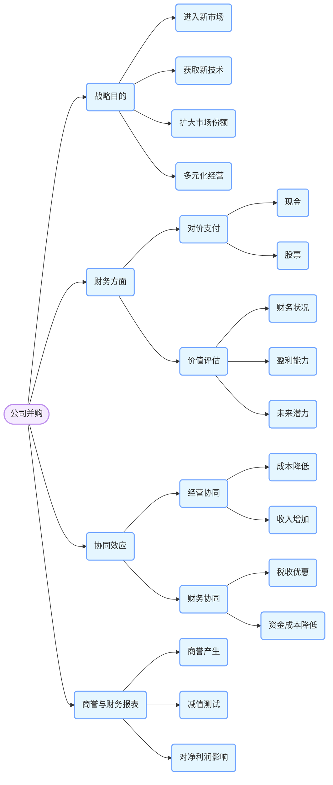

# 彼得林奇如何看待公司的并购历史

> 关键词：彼得林奇、公司并购历史、投资分析、企业价值、协同效应

> 摘要：本文深入探讨了投资大师彼得林奇对于公司并购历史的看法。通过对相关背景知识的介绍，详细阐述了公司并购的核心概念及联系，剖析了彼得林奇在分析公司并购历史时所运用的核心算法原理和具体操作步骤，借助数学模型和公式进行理论说明，并给出实际案例加以解释。同时探讨了公司并购历史分析在实际投资场景中的应用，推荐了相关学习工具和资源。最后总结了未来公司并购领域的发展趋势与挑战，为投资者提供了全面而深入的参考，帮助他们在评估公司价值和做出投资决策时能更好地考虑公司的并购历史这一重要因素。

## 1. 背景介绍 
### 1.1 目的和范围
在投资领域，准确评估一家公司的价值至关重要。公司的并购历史是影响其价值和未来发展潜力的重要因素之一。彼得林奇作为投资界的传奇人物，他对公司并购历史有着独特而深刻的见解。本文的目的是全面剖析彼得林奇如何看待公司的并购历史，以及投资者如何借鉴他的观点来评估公司的投资价值。范围涵盖了公司并购的基本概念、彼得林奇分析公司并购历史的方法、相关的数学模型和实际案例，以及这种分析在实际投资场景中的应用。

### 1.2 预期读者
本文预期读者包括对投资感兴趣的个人投资者、金融专业的学生、投资机构的从业人员以及关注企业发展和并购动态的研究人员。无论您是投资新手，希望了解如何评估公司的并购活动，还是有一定经验的投资者，想借鉴彼得林奇的投资智慧，本文都将为您提供有价值的信息。

### 1.3 文档结构概述
本文首先介绍公司并购的背景知识，包括目的、预期读者和文档结构。接着阐述公司并购的核心概念及联系，展示相关的文本示意图和Mermaid流程图。然后详细讲解彼得林奇分析公司并购历史的核心算法原理和具体操作步骤，通过Python代码进行说明。之后运用数学模型和公式对分析方法进行理论阐述，并举例说明。再通过实际项目案例展示如何运用这些方法进行公司并购历史的分析。随后探讨公司并购历史分析在实际投资场景中的应用。接着推荐相关的学习工具和资源，包括书籍、在线课程、技术博客、开发工具和相关论文。最后总结未来公司并购领域的发展趋势与挑战，并提供常见问题的解答和扩展阅读参考资料。

### 1.4 术语表
#### 1.4.1 核心术语定义
- **公司并购**：指一家公司通过购买另一家公司的部分或全部股权，从而获得对该公司的控制权或实现两家公司的合并。并购可以分为横向并购（同一行业内企业之间的并购）、纵向并购（产业链上下游企业之间的并购）和混合并购（不同行业企业之间的并购）。
- **协同效应**：指两家公司合并后，通过资源共享、优势互补等方式，实现比各自独立运营时更高的效益和价值。协同效应可以体现在成本降低、收入增加、市场份额扩大等方面。
- **商誉**：在并购中，购买方支付的价格超过被购买方可辨认净资产公允价值的部分。商誉反映了购买方对被购买方未来盈利能力的预期。

#### 1.4.2 相关概念解释
- **尽职调查**：在并购交易前，收购方对目标公司进行的全面调查，包括财务状况、经营业绩、法律合规等方面，以评估目标公司的价值和风险。
- **整合风险**：指在并购完成后，两家公司在文化、管理、业务等方面进行整合时可能面临的风险，如整合失败导致的业绩下滑、人员流失等。

#### 1.4.3 缩略词列表
- **EPS**：Earnings Per Share，每股收益，反映公司每股普通股的盈利水平。
- **ROE**：Return on Equity，净资产收益率，衡量公司运用自有资本的效率。

## 2. 核心概念与联系 

### 公司并购的核心概念
公司并购是企业实现扩张和战略转型的重要手段。从战略角度来看，并购可以帮助企业快速进入新市场、获取新技术、扩大市场份额或实现多元化经营。例如，一家科技公司通过并购另一家拥有先进技术的初创企业，可以迅速提升自身的技术实力，增强市场竞争力。

从财务角度来看，并购涉及到资产的转移和价值的评估。收购方需要支付一定的对价来获取目标公司的股权或资产，对价的形式可以是现金、股票或两者的组合。在评估目标公司的价值时，需要考虑其财务状况、盈利能力、未来发展潜力等因素。

### 核心概念的联系
公司并购与协同效应密切相关。成功的并购应该能够实现协同效应，从而提升公司的整体价值。协同效应可以分为经营协同效应和财务协同效应。经营协同效应主要体现在成本降低和收入增加方面，例如通过整合供应链可以降低采购成本，通过共享销售渠道可以增加销售收入。财务协同效应则主要体现在税收优惠、资金成本降低等方面。

公司并购还会影响公司的商誉和财务报表。如果收购方支付的价格超过目标公司的净资产公允价值，就会产生商誉。商誉在财务报表中作为一项资产列示，但需要定期进行减值测试。如果商誉发生减值，会对公司的净利润产生负面影响。

### 文本示意图
```plaintext
公司并购
|--战略目的
|   |--进入新市场
|   |--获取新技术
|   |--扩大市场份额
|   |--多元化经营
|--财务方面
|   |--对价支付
|   |   |--现金
|   |   |--股票
|   |--价值评估
|       |--财务状况
|       |--盈利能力
|       |--未来潜力
|--协同效应
|   |--经营协同
|   |   |--成本降低
|   |   |--收入增加
|   |--财务协同
|       |--税收优惠
|       |--资金成本降低
|--商誉与财务报表
|   |--商誉产生
|   |--减值测试
|   |--对净利润影响
```

### Mermaid流程图


## 3. 核心算法原理 & 具体操作步骤 

### 核心算法原理
彼得林奇在分析公司的并购历史时，主要关注并购对公司盈利能力和价值的影响。他会通过计算一些关键的财务指标来评估并购的效果，例如每股收益（EPS）、净资产收益率（ROE）等。

#### 每股收益（EPS）
每股收益是衡量公司盈利能力的重要指标，计算公式为：
$$EPS = \frac{净利润}{发行在外普通股股数}$$

在分析并购对EPS的影响时，需要考虑并购前后公司的净利润和股数的变化。如果并购后公司的净利润增加幅度大于股数增加幅度，那么EPS就会上升，说明并购对公司的盈利能力有积极影响。

#### 净资产收益率（ROE）
净资产收益率反映了公司运用自有资本的效率，计算公式为：
$$ROE = \frac{净利润}{股东权益}$$

并购可能会影响公司的股东权益和净利润，从而影响ROE。如果并购后公司能够有效地整合资源，提高净利润，同时合理控制股东权益的增加，那么ROE就会提高，说明并购对公司的价值创造能力有积极影响。

### 具体操作步骤

#### 步骤1：收集数据
收集公司并购前后的财务报表，包括利润表、资产负债表和现金流量表。同时，收集公司的股权结构信息，了解并购前后发行在外普通股股数的变化。

#### 步骤2：计算关键财务指标
根据收集到的数据，计算并购前后的EPS和ROE。可以使用Python代码来实现这些计算，以下是一个示例代码：

```python
# 定义计算EPS的函数
def calculate_eps(net_income, shares_outstanding):
    return net_income / shares_outstanding

# 定义计算ROE的函数
def calculate_roe(net_income, shareholders_equity):
    return net_income / shareholders_equity

# 示例数据：并购前
pre_merger_net_income = 1000000  # 并购前净利润
pre_merger_shares_outstanding = 500000  # 并购前发行在外普通股股数
pre_merger_shareholders_equity = 5000000  # 并购前股东权益

# 示例数据：并购后
post_merger_net_income = 1200000  # 并购后净利润
post_merger_shares_outstanding = 600000  # 并购后发行在外普通股股数
post_merger_shareholders_equity = 6000000  # 并购后股东权益

# 计算并购前的EPS和ROE
pre_merger_eps = calculate_eps(pre_merger_net_income, pre_merger_shares_outstanding)
pre_merger_roe = calculate_roe(pre_merger_net_income, pre_merger_shareholders_equity)

# 计算并购后的EPS和ROE
post_merger_eps = calculate_eps(post_merger_net_income, post_merger_shares_outstanding)
post_merger_roe = calculate_roe(post_merger_net_income, post_merger_shareholders_equity)

print(f"并购前EPS: {pre_merger_eps}")
print(f"并购前ROE: {pre_merger_roe}")
print(f"并购后EPS: {post_merger_eps}")
print(f"并购后ROE: {post_merger_roe}")
```

#### 步骤3：分析指标变化
比较并购前后的EPS和ROE，分析指标的变化趋势。如果EPS和ROE都有所上升，说明并购对公司的盈利能力和价值创造能力有积极影响；如果指标下降，则需要进一步分析原因，可能是并购整合不佳、支付过高的对价等。

#### 步骤4：考虑协同效应
除了财务指标的变化，还需要考虑并购是否实现了协同效应。可以通过分析公司的业务整合情况、成本降低情况、市场份额变化等方面来评估协同效应的实现程度。

## 4. 数学模型和公式 & 详细讲解 & 举例说明 

### 数学模型和公式
#### 协同效应价值模型
协同效应价值可以通过以下公式计算：
$$V_{synergy} = V_{combined} - (V_{acquirer} + V_{target})$$
其中，$V_{synergy}$ 表示协同效应价值，$V_{combined}$ 表示并购后联合公司的价值，$V_{acquirer}$ 表示收购方在并购前的价值，$V_{target}$ 表示目标公司在并购前的价值。

#### 市盈率（P/E）模型
市盈率是衡量公司估值的常用指标，计算公式为：
$$P/E = \frac{股价}{每股收益}$$

在分析并购对公司估值的影响时，可以使用市盈率模型。假设并购后公司的市盈率保持不变，那么并购后公司的股价可以通过以下公式计算：
$$P_{post - merger} = (P/E) \times EPS_{post - merger}$$

### 详细讲解
#### 协同效应价值模型
协同效应价值模型的核心思想是，并购的价值在于创造额外的价值，即协同效应价值。如果协同效应价值为正，说明并购是有价值的；如果为负，则说明并购可能没有实现预期的效果。

在计算协同效应价值时，需要准确评估并购后联合公司的价值、收购方的价值和目标公司的价值。这些价值可以通过现金流折现法、市场比较法等方法进行评估。

#### 市盈率（P/E）模型
市盈率模型基于市场对公司盈利能力的预期。市盈率反映了投资者愿意为每一元每股收益支付的价格。在并购分析中，如果并购后公司的EPS上升，且市盈率保持不变，那么公司的股价就会上升，说明并购对公司的市场价值有积极影响。

### 举例说明
假设收购方A公司的价值为 $V_A = 1000$ 万元，目标公司B公司的价值为 $V_B = 500$ 万元。并购后联合公司的价值为 $V_{AB} = 1700$ 万元。

根据协同效应价值模型，协同效应价值为：
$$V_{synergy} = V_{AB} - (V_A + V_B) = 1700 - (1000 + 500) = 200$$（万元）

这说明并购创造了 200 万元的协同效应价值，是有价值的。

再假设A公司并购前的股价为 $P_A = 20$ 元，每股收益为 $EPS_A = 2$ 元，市盈率为 $P/E_A = \frac{P_A}{EPS_A} = 10$。并购后公司的每股收益上升到 $EPS_{AB} = 2.5$ 元。

根据市盈率模型，并购后公司的股价为：
$$P_{AB} = (P/E_A) \times EPS_{AB} = 10 \times 2.5 = 25$$（元）

这说明并购后公司的股价上升了，对公司的市场价值有积极影响。

## 5. 项目实战：代码实际案例和详细解释说明 

### 5.1  开发环境搭建
为了进行公司并购历史的分析，我们可以使用Python语言和一些常用的数据分析库，如Pandas、Numpy等。以下是搭建开发环境的步骤：

#### 步骤1：安装Python
可以从Python官方网站（https://www.python.org/downloads/）下载并安装Python 3.x版本。

#### 步骤2：安装必要的库
打开命令行工具，使用以下命令安装Pandas和Numpy库：
```sh
pip install pandas numpy
```

### 5.2  源代码详细实现和代码解读
以下是一个完整的Python代码示例，用于分析公司并购前后的财务指标变化：

```python
import pandas as pd

# 模拟并购前后的财务数据
pre_merger_data = {
    '净利润': [1000000],
    '发行在外普通股股数': [500000],
    '股东权益': [5000000]
}
pre_merger_df = pd.DataFrame(pre_merger_data)

post_merger_data = {
    '净利润': [1200000],
    '发行在外普通股股数': [600000],
    '股东权益': [6000000]
}
post_merger_df = pd.DataFrame(post_merger_data)

# 定义计算EPS和ROE的函数
def calculate_eps(net_income, shares_outstanding):
    return net_income / shares_outstanding

def calculate_roe(net_income, shareholders_equity):
    return net_income / shareholders_equity

# 计算并购前的EPS和ROE
pre_merger_df['EPS'] = pre_merger_df.apply(lambda row: calculate_eps(row['净利润'], row['发行在外普通股股数']), axis=1)
pre_merger_df['ROE'] = pre_merger_df.apply(lambda row: calculate_roe(row['净利润'], row['股东权益']), axis=1)

# 计算并购后的EPS和ROE
post_merger_df['EPS'] = post_merger_df.apply(lambda row: calculate_eps(row['净利润'], row['发行在外普通股股数']), axis=1)
post_merger_df['ROE'] = post_merger_df.apply(lambda row: calculate_roe(row['净利润'], row['股东权益']), axis=1)

# 输出结果
print("并购前财务指标：")
print(pre_merger_df[['EPS', 'ROE']])
print("并购后财务指标：")
print(post_merger_df[['EPS', 'ROE']])

# 分析指标变化
eps_change = post_merger_df['EPS'].values[0] - pre_merger_df['EPS'].values[0]
roe_change = post_merger_df['ROE'].values[0] - pre_merger_df['ROE'].values[0]

if eps_change > 0 and roe_change > 0:
    print("并购对公司的盈利能力和价值创造能力有积极影响。")
elif eps_change < 0 and roe_change < 0:
    print("并购对公司的盈利能力和价值创造能力有消极影响。")
else:
    print("并购对公司的影响较为复杂，需要进一步分析。")
```

### 代码解读与分析
1. **数据模拟**：使用字典和Pandas的DataFrame模拟了并购前后的财务数据，包括净利润、发行在外普通股股数和股东权益。
2. **函数定义**：定义了 `calculate_eps` 和 `calculate_roe` 函数，用于计算每股收益和净资产收益率。
3. **指标计算**：使用Pandas的 `apply` 方法将计算函数应用到DataFrame的每一行，计算并购前后的EPS和ROE。
4. **结果输出**：打印出并购前后的EPS和ROE，并分析指标的变化趋势，给出相应的结论。

通过这个代码示例，我们可以清晰地看到并购前后公司财务指标的变化情况，从而评估并购对公司的影响。

## 6. 实际应用场景 
### 投资决策
在投资决策中，分析公司的并购历史可以帮助投资者评估公司的发展潜力和投资价值。如果一家公司有成功的并购历史，能够通过并购实现协同效应，提升盈利能力和市场竞争力，那么它可能是一个值得投资的对象。相反，如果公司的并购活动频繁但效果不佳，导致业绩下滑和财务风险增加，那么投资者应该谨慎对待。

### 企业战略规划
对于企业自身来说，回顾并购历史可以总结经验教训，为未来的战略规划提供参考。企业可以分析过去的并购案例，找出哪些并购实现了预期目标，哪些并购存在问题，从而在未来的并购决策中更加谨慎和明智。例如，如果过去的横向并购效果较好，企业可以考虑继续在同一行业内寻找并购机会；如果纵向并购遇到了整合困难，企业可以在未来的纵向并购中加强整合规划。

### 行业研究
在进行行业研究时，分析公司的并购历史可以了解行业的发展趋势和竞争格局。通过研究行业内企业的并购活动，可以发现行业的整合趋势、新兴技术的应用情况以及市场份额的变化。例如，如果某个行业内的大型企业频繁进行并购，可能意味着行业正在进行整合，市场集中度将提高；如果一些企业通过并购进入新的技术领域，可能预示着行业将迎来技术变革。

## 7. 工具和资源推荐
### 7.1 学习资源推荐
#### 7.1.1 书籍推荐
- 《彼得林奇的成功投资》：彼得林奇的经典著作，详细介绍了他的投资理念和方法，包括如何分析公司的基本面和并购活动。
- 《并购创造价值》：全面阐述了公司并购的理论和实践，包括并购的战略规划、估值方法、整合策略等方面的内容。
- 《财务报表分析》：帮助读者掌握财务报表的分析方法，以便更好地评估公司的财务状况和并购效果。

#### 7.1.2 在线课程
- Coursera上的“公司金融”课程：涵盖了公司并购、估值、资本结构等方面的内容，由知名大学的教授授课。
- Udemy上的“并购与收购实战指南”课程：提供了实际案例分析和操作技巧，适合想要深入了解并购业务的学习者。

#### 7.1.3 技术博客和网站
- Seeking Alpha：提供了大量的投资分析文章和研究报告，包括对公司并购活动的分析和评论。
- Bloomberg：全球知名的财经媒体，提供实时的金融市场信息和公司并购动态。

### 7.2 开发工具框架推荐
#### 7.2.1 IDE和编辑器
- PyCharm：功能强大的Python集成开发环境，适合进行数据分析和代码开发。
- Jupyter Notebook：交互式的开发环境，方便进行数据探索和代码演示。

#### 7.2.2 调试和性能分析工具
- PDB：Python自带的调试工具，可以帮助开发者定位代码中的问题。
- cProfile：Python的性能分析工具，可以分析代码的运行时间和资源消耗情况。

#### 7.2.3 相关框架和库
- Pandas：强大的数据分析库，提供了丰富的数据结构和数据处理方法，适合进行财务数据的分析。
- Numpy：用于科学计算的基础库，提供了高效的数组操作和数学函数。

### 7.3 相关论文著作推荐
#### 7.3.1 经典论文
- Jensen, M. C., & Ruback, R. S. (1983). The market for corporate control: The scientific evidence. Journal of Financial Economics, 11(1-4), 5-50. 该论文对公司控制权市场进行了深入研究，探讨了并购的动机和效果。
- Roll, R. (1986). The hubris hypothesis of corporate takeovers. Journal of Business, 59(2), 197-216. 提出了并购中的“傲慢假说”，认为并购方管理层可能因为过度自信而支付过高的对价。

#### 7.3.2 最新研究成果
可以通过学术数据库如IEEE Xplore、ACM Digital Library等搜索关于公司并购的最新研究论文，了解该领域的前沿动态。

#### 7.3.3 应用案例分析
- Harvard Business School Case Studies：提供了大量的企业并购案例分析，通过实际案例可以学习到并购的决策过程、整合策略和面临的挑战。

## 8. 总结：未来发展趋势与挑战
### 未来发展趋势
- **技术驱动的并购增加**：随着科技的快速发展，企业为了获取新技术和创新能力，将更多地进行技术驱动的并购。例如，人工智能、大数据、区块链等领域的并购活动可能会增加。
- **跨境并购增多**：全球化的趋势将继续推动企业进行跨境并购，以拓展国际市场、获取全球资源和技术。新兴市场国家的企业也将更加积极地参与跨境并购。
- **并购整合更加注重协同效应**：企业将更加注重并购后的整合，以实现协同效应。通过整合业务流程、文化和资源，提高企业的运营效率和竞争力。

### 挑战
- **估值难度增加**：随着科技的发展和商业模式的创新，企业的估值变得更加复杂。如何准确评估目标公司的价值，特别是一些新兴科技企业的价值，是并购面临的一大挑战。
- **整合风险增大**：不同企业之间的文化差异、管理模式差异等可能导致并购后的整合困难。如何有效地进行整合，避免整合失败带来的风险，是企业需要解决的问题。
- **政策法规的不确定性**：不同国家和地区的政策法规对并购活动有不同的规定和限制。政策法规的变化可能会影响并购的进程和结果，增加并购的不确定性。

## 9. 附录：常见问题与解答
### 问题1：如何判断一个公司的并购是否成功？
答：可以从多个方面来判断一个公司的并购是否成功。首先，看并购是否实现了协同效应，包括成本降低、收入增加、市场份额扩大等方面。其次，分析并购前后公司的财务指标，如EPS、ROE等是否有所提升。此外，还需要考虑并购后的整合情况，如人员是否稳定、业务是否顺利融合等。

### 问题2：并购对公司的股价有什么影响？
答：并购对公司股价的影响取决于多个因素。如果市场认为并购能够带来协同效应，提升公司的未来盈利能力和价值，那么股价可能会上涨。相反，如果市场对并购的效果持怀疑态度，或者并购存在较大的风险，那么股价可能会下跌。此外，并购的方式（如现金收购、股票收购）、对价的高低等也会影响股价。

### 问题3：如何评估并购中的协同效应？
答：可以从经营协同效应和财务协同效应两个方面来评估。经营协同效应可以通过分析并购后公司的成本结构、市场份额、销售收入等方面的变化来评估。财务协同效应可以通过分析税收优惠、资金成本降低等方面的情况来评估。还可以使用协同效应价值模型来计算协同效应的具体数值。

## 10. 扩展阅读 & 参考资料
- 《金融炼金术》，乔治·索罗斯著
- 《聪明的投资者》，本杰明·格雷厄姆著
- Yahoo Finance网站：提供公司的财务数据和市场信息
- SEC（美国证券交易委员会）网站：可以获取上市公司的年报、季报等财务报告

作者：AI天才研究院/AI Genius Institute & 禅与计算机程序设计艺术 /Zen And The Art of Computer Programming