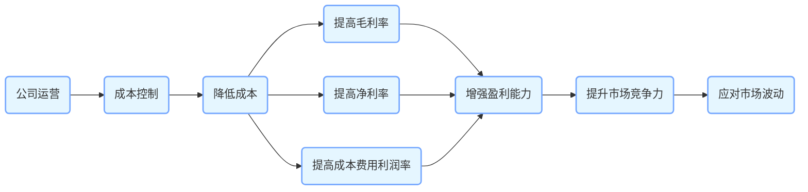

# 彼得林奇如何看待公司的成本控制能力

> 关键词：彼得林奇、公司成本控制能力、投资分析、企业竞争力、财务指标

> 摘要：本文围绕彼得林奇对公司成本控制能力的看法展开深入探讨。彼得林奇作为投资界的传奇人物，其投资理念和方法对投资者有着深远的影响。在他的投资体系中，公司的成本控制能力是评估企业投资价值的重要因素之一。文章将详细介绍成本控制能力的背景知识，阐述其核心概念及与公司运营的联系，分析彼得林奇评估成本控制能力的算法原理和操作步骤，给出相关数学模型和公式并举例说明，通过项目实战案例展示成本控制能力在实际投资分析中的应用，探讨其在不同场景下的实际作用，推荐相关学习工具和资源，最后总结成本控制能力在未来投资领域的发展趋势与挑战，并解答常见问题，提供扩展阅读和参考资料。

## 1. 背景介绍 
### 1.1 目的和范围
本文旨在深入剖析彼得林奇对公司成本控制能力的观点，帮助投资者更好地理解成本控制能力在企业投资价值评估中的重要性。通过研究彼得林奇的投资思想，我们将探讨如何运用成本控制相关指标来筛选具有投资潜力的公司。文章的范围涵盖了成本控制能力的基本概念、评估方法、实际应用场景以及相关的学习资源和未来发展趋势等方面。

### 1.2 预期读者
本文预期读者包括对投资领域感兴趣的初学者、有一定投资经验的投资者以及从事金融分析和研究的专业人士。对于初学者来说，本文可以帮助他们了解彼得林奇的投资理念和成本控制能力的重要性；对于有经验的投资者，文章可以提供新的思考角度和分析方法；对于专业人士，本文可以作为参考资料，进一步深入研究成本控制与企业价值之间的关系。

### 1.3 文档结构概述
本文将按照以下结构展开：首先介绍成本控制能力的背景知识，包括目的、预期读者和文档结构概述等；接着阐述成本控制能力的核心概念以及与公司运营的联系，并通过示意图和流程图进行直观展示；然后详细分析彼得林奇评估成本控制能力的算法原理和具体操作步骤，结合 Python 源代码进行说明；之后给出相关的数学模型和公式，并举例说明其应用；通过项目实战案例展示成本控制能力在实际投资分析中的应用，包括开发环境搭建、源代码实现和代码解读等；探讨成本控制能力在不同实际场景下的作用；推荐相关的学习工具和资源，包括书籍、在线课程、技术博客、开发工具、框架和库以及相关论文著作等；最后总结成本控制能力在未来投资领域的发展趋势与挑战，解答常见问题，并提供扩展阅读和参考资料。

### 1.4 术语表
#### 1.4.1 核心术语定义
- **成本控制能力**：指企业在生产经营过程中，通过对成本的预测、计划、核算、分析和考核等一系列活动，采取有效的措施，将成本控制在预定目标范围内的能力。
- **毛利率**：是毛利与销售收入（或营业收入）的百分比，其中毛利是收入和与收入相对应的营业成本之间的差额，公式为：$毛利率 = \frac{营业收入 - 营业成本}{营业收入} \times 100\%$。
- **净利率**：是净利润与销售收入的百分比，净利润是指企业当期利润总额减去所得税后的金额，即企业的税后利润，公式为：$净利率 = \frac{净利润}{营业收入} \times 100\%$。
- **成本费用利润率**：是企业一定期间的利润总额与成本、费用总额的比率，公式为：$成本费用利润率 = \frac{利润总额}{成本费用总额} \times 100\%$。

#### 1.4.2 相关概念解释
- **固定成本**：是指在一定时期和一定业务量范围内，不受业务量增减变动影响而能保持不变的成本，如厂房租金、设备折旧等。
- **变动成本**：是指那些成本的总发生额在相关范围内随着业务量的变动而呈线性变动的成本，如原材料成本、直接人工成本等。
- **规模经济**：是指通过扩大生产规模而引起经济效益增加的现象，随着产量的增加，单位产品的成本会逐渐降低。

#### 1.4.3 缩略词列表
- **ROE**：Return on Equity，净资产收益率，是净利润与平均股东权益的百分比，反映股东权益的收益水平。
- **EPS**：Earnings Per Share，每股收益，是指税后利润与股本总数的比率，反映普通股的获利水平。

## 2. 核心概念与联系 
### 核心概念原理
彼得林奇认为，公司的成本控制能力是企业竞争力的重要组成部分。良好的成本控制能力可以使企业在市场竞争中占据优势地位，具体体现在以下几个方面：
- **提高盈利能力**：通过有效的成本控制，企业可以降低生产成本和运营成本，从而提高毛利率和净利率。例如，企业通过优化生产流程、降低原材料采购成本等方式，减少了产品的生产成本，使得产品在售价不变的情况下，利润空间得到扩大。
- **增强市场竞争力**：成本控制能力强的企业可以在价格上更具优势，从而吸引更多的客户。在市场竞争激烈的情况下，企业可以通过降低价格来提高市场份额，而成本控制能力是实现这一目标的关键。
- **应对市场波动**：当市场环境发生变化时，如原材料价格上涨、市场需求下降等，成本控制能力强的企业能够更好地应对这些挑战。企业可以通过调整成本结构、降低不必要的开支等方式，保持盈利水平的稳定。

### 架构的文本示意图
```plaintext
公司成本控制能力
|-- 成本构成
|   |-- 固定成本
|   |-- 变动成本
|-- 成本控制方法
|   |-- 预算控制
|   |-- 标准成本控制
|   |-- 作业成本控制
|-- 成本控制效果
|   |-- 毛利率提升
|   |-- 净利率提升
|   |-- 成本费用利润率提升
|-- 对企业的影响
|   |-- 提高盈利能力
|   |-- 增强市场竞争力
|   |-- 应对市场波动
```

### Mermaid 流程图


## 3. 核心算法原理 & 具体操作步骤 
### 算法原理讲解
彼得林奇在评估公司成本控制能力时，通常会关注一些关键的财务指标，如毛利率、净利率和成本费用利润率等。这些指标可以反映企业在成本控制方面的效果。下面我们通过 Python 代码来计算这些指标。

```python
# 定义一个函数来计算毛利率
def calculate_gross_margin(revenue, cost_of_goods_sold):
    """
    计算毛利率
    :param revenue: 营业收入
    :param cost_of_goods_sold: 营业成本
    :return: 毛利率
    """
    if revenue == 0:
        return 0
    return (revenue - cost_of_goods_sold) / revenue * 100

# 定义一个函数来计算净利率
def calculate_net_profit_margin(revenue, net_profit):
    """
    计算净利率
    :param revenue: 营业收入
    :param net_profit: 净利润
    :return: 净利率
    """
    if revenue == 0:
        return 0
    return net_profit / revenue * 100

# 定义一个函数来计算成本费用利润率
def calculate_cost_profit_ratio(total_profit, total_cost):
    """
    计算成本费用利润率
    :param total_profit: 利润总额
    :param total_cost: 成本费用总额
    :return: 成本费用利润率
    """
    if total_cost == 0:
        return 0
    return total_profit / total_cost * 100

# 示例数据
revenue = 1000000  # 营业收入
cost_of_goods_sold = 600000  # 营业成本
net_profit = 200000  # 净利润
total_profit = 250000  # 利润总额
total_cost = 750000  # 成本费用总额

# 计算毛利率
gross_margin = calculate_gross_margin(revenue, cost_of_goods_sold)
print(f"毛利率: {gross_margin:.2f}%")

# 计算净利率
net_profit_margin = calculate_net_profit_margin(revenue, net_profit)
print(f"净利率: {net_profit_margin:.2f}%")

# 计算成本费用利润率
cost_profit_ratio = calculate_cost_profit_ratio(total_profit, total_cost)
print(f"成本费用利润率: {cost_profit_ratio:.2f}%")
```

### 具体操作步骤
1. **收集财务数据**：从公司的财务报表中获取营业收入、营业成本、净利润、利润总额和成本费用总额等数据。
2. **计算关键指标**：使用上述 Python 代码中的函数计算毛利率、净利率和成本费用利润率。
3. **分析指标变化**：观察这些指标在不同时期的变化情况，判断公司的成本控制能力是增强还是减弱。如果毛利率、净利率和成本费用利润率呈现上升趋势，说明公司的成本控制能力在提高；反之，则说明成本控制能力可能存在问题。
4. **与行业对比**：将公司的这些指标与同行业其他公司进行对比，了解公司在行业中的成本控制水平。如果公司的指标优于行业平均水平，说明公司在成本控制方面具有优势。

## 4. 数学模型和公式 & 详细讲解 & 举例说明 
### 数学模型和公式
- **毛利率公式**：$毛利率 = \frac{营业收入 - 营业成本}{营业收入} \times 100\%$
- **净利率公式**：$净利率 = \frac{净利润}{营业收入} \times 100\%$
- **成本费用利润率公式**：$成本费用利润率 = \frac{利润总额}{成本费用总额} \times 100\%$

### 详细讲解
- **毛利率**：毛利率反映了企业在扣除直接成本后剩余的利润空间。毛利率越高，说明企业在生产过程中对成本的控制越好，产品的附加值越高。例如，一家服装制造企业，其营业收入为 100 万元，营业成本为 60 万元，则毛利率为 $\frac{100 - 60}{100} \times 100\% = 40\%$，这意味着该企业每销售 100 元的产品，扣除成本后还能获得 40 元的毛利。
- **净利率**：净利率考虑了企业的所有成本和费用，包括营业成本、销售费用、管理费用、财务费用等，反映了企业最终的盈利能力。净利率越高，说明企业的经营效率越高，成本控制能力越强。例如，某公司营业收入为 200 万元，净利润为 30 万元，则净利率为 $\frac{30}{200} \times 100\% = 15\%$，表示该公司每销售 100 元的产品，最终能获得 15 元的净利润。
- **成本费用利润率**：成本费用利润率反映了企业为取得利润而付出的代价，即每投入一元成本费用所能获得的利润。该指标越高，说明企业的成本费用控制效果越好，经济效益越高。例如，某企业利润总额为 50 万元，成本费用总额为 200 万元，则成本费用利润率为 $\frac{50}{200} \times 100\% = 25\%$，意味着该企业每投入 1 元的成本费用，可以获得 0.25 元的利润。

### 举例说明
假设我们有两家公司 A 和 B，它们的财务数据如下表所示：

| 公司 | 营业收入（万元） | 营业成本（万元） | 净利润（万元） | 利润总额（万元） | 成本费用总额（万元） |
| ---- | ---- | ---- | ---- | ---- | ---- |
| A | 500 | 300 | 100 | 120 | 400 |
| B | 600 | 400 | 120 | 150 | 500 |

- **计算毛利率**：
  - 公司 A 的毛利率：$\frac{500 - 300}{500} \times 100\% = 40\%$
  - 公司 B 的毛利率：$\frac{600 - 400}{600} \times 100\% \approx 33.33\%$
  从毛利率来看，公司 A 的成本控制能力在生产环节优于公司 B。

- **计算净利率**：
  - 公司 A 的净利率：$\frac{100}{500} \times 100\% = 20\%$
  - 公司 B 的净利率：$\frac{120}{600} \times 100\% = 20\%$
  两家公司的净利率相同，说明在考虑所有成本和费用后，它们的最终盈利能力相当。

- **计算成本费用利润率**：
  - 公司 A 的成本费用利润率：$\frac{120}{400} \times 100\% = 30\%$
  - 公司 B 的成本费用利润率：$\frac{150}{500} \times 100\% = 30\%$
  两家公司的成本费用利润率也相同，表明它们在成本费用控制方面的整体效果相当。

通过以上计算和分析，我们可以对两家公司的成本控制能力有一个较为全面的了解。虽然公司 A 在毛利率上表现更好，但在净利率和成本费用利润率上与公司 B 相当。

## 5. 项目实战：代码实际案例和详细解释说明 
### 5.1  开发环境搭建
为了进行成本控制能力的分析，我们需要搭建一个 Python 开发环境。以下是具体的搭建步骤：
1. **安装 Python**：从 Python 官方网站（https://www.python.org/downloads/）下载并安装 Python 3.x 版本。
2. **安装必要的库**：我们需要使用 `pandas` 库来处理和分析数据，使用 `matplotlib` 库来进行数据可视化。可以使用以下命令来安装这些库：
```sh
pip install pandas matplotlib
```
3. **选择开发工具**：可以选择使用 Jupyter Notebook、PyCharm 等开发工具来编写和运行 Python 代码。这里我们以 Jupyter Notebook 为例，安装方法如下：
```sh
pip install jupyter notebook
```
安装完成后，在命令行中输入 `jupyter notebook` 即可启动 Jupyter Notebook 服务器，然后在浏览器中打开相应的页面进行代码编写。

### 5.2  源代码详细实现和代码解读
以下是一个完整的 Python 代码示例，用于分析一家公司的成本控制能力，并进行数据可视化：

```python
import pandas as pd
import matplotlib.pyplot as plt

# 定义一个函数来计算毛利率、净利率和成本费用利润率
def calculate_financial_ratios(revenue, cost_of_goods_sold, net_profit, total_profit, total_cost):
    """
    计算毛利率、净利率和成本费用利润率
    :param revenue: 营业收入
    :param cost_of_goods_sold: 营业成本
    :param net_profit: 净利润
    :param total_profit: 利润总额
    :param total_cost: 成本费用总额
    :return: 毛利率、净利率、成本费用利润率
    """
    if revenue == 0:
        gross_margin = 0
        net_profit_margin = 0
    else:
        gross_margin = (revenue - cost_of_goods_sold) / revenue * 100
        net_profit_margin = net_profit / revenue * 100
    if total_cost == 0:
        cost_profit_ratio = 0
    else:
        cost_profit_ratio = total_profit / total_cost * 100
    return gross_margin, net_profit_margin, cost_profit_ratio

# 示例数据
data = {
    '年份': [2018, 2019, 2020, 2021, 2022],
    '营业收入': [1000, 1200, 1300, 1500, 1600],
    '营业成本': [600, 700, 750, 800, 850],
    '净利润': [200, 220, 230, 250, 260],
    '利润总额': [250, 270, 280, 300, 310],
    '成本费用总额': [750, 850, 900, 1000, 1050]
}

# 创建 DataFrame
df = pd.DataFrame(data)

# 计算各项指标
df['毛利率'] = df.apply(lambda row: calculate_financial_ratios(row['营业收入'], row['营业成本'], row['净利润'], row['利润总额'], row['成本费用总额'])[0], axis=1)
df['净利率'] = df.apply(lambda row: calculate_financial_ratios(row['营业收入'], row['营业成本'], row['净利润'], row['利润总额'], row['成本费用总额'])[1], axis=1)
df['成本费用利润率'] = df.apply(lambda row: calculate_financial_ratios(row['营业收入'], row['营业成本'], row['净利润'], row['利润总额'], row['成本费用总额'])[2], axis=1)

# 打印结果
print(df)

# 数据可视化
plt.figure(figsize=(12, 6))
plt.plot(df['年份'], df['毛利率'], label='毛利率')
plt.plot(df['年份'], df['净利率'], label='净利率')
plt.plot(df['年份'], df['成本费用利润率'], label='成本费用利润率')
plt.xlabel('年份')
plt.ylabel('比率 (%)')
plt.title('公司成本控制能力指标变化趋势')
plt.legend()
plt.grid(True)
plt.show()
```

### 代码解读与分析
1. **导入必要的库**：导入 `pandas` 库用于数据处理和分析，导入 `matplotlib.pyplot` 库用于数据可视化。
2. **定义计算函数**：定义 `calculate_financial_ratios` 函数，用于计算毛利率、净利率和成本费用利润率。
3. **创建示例数据**：使用字典 `data` 存储公司的财务数据，包括年份、营业收入、营业成本、净利润、利润总额和成本费用总额。
4. **创建 DataFrame**：使用 `pd.DataFrame` 函数将字典数据转换为 `DataFrame` 对象，方便进行数据处理和分析。
5. **计算各项指标**：使用 `df.apply` 方法结合 `calculate_financial_ratios` 函数，计算每一年的毛利率、净利率和成本费用利润率，并将结果添加到 `DataFrame` 中。
6. **打印结果**：使用 `print` 函数打印包含各项指标的 `DataFrame`。
7. **数据可视化**：使用 `plt.plot` 函数绘制毛利率、净利率和成本费用利润率随年份变化的折线图，直观展示公司成本控制能力的变化趋势。

通过以上代码，我们可以清晰地看到公司在不同年份的成本控制能力指标的变化情况，从而对公司的成本控制能力进行评估。

## 6. 实际应用场景 
### 投资决策
在投资决策中，投资者可以通过分析公司的成本控制能力来筛选具有投资潜力的公司。如果一家公司具有较强的成本控制能力，其毛利率、净利率和成本费用利润率等指标通常会表现较好，这意味着公司具有较高的盈利能力和竞争力。投资者可以选择成本控制能力强的公司进行投资，以获得更好的投资回报。例如，彼得林奇在选择股票时，会关注公司的成本控制情况，倾向于投资那些能够有效控制成本、提高盈利能力的公司。

### 企业战略规划
企业管理者可以通过评估公司的成本控制能力，制定合理的企业战略规划。如果公司的成本控制能力较弱，管理者可以采取措施优化生产流程、降低采购成本、减少不必要的开支等，以提高成本控制水平。相反，如果公司的成本控制能力较强，管理者可以考虑扩大生产规模、开拓新市场等战略，进一步提高企业的竞争力和盈利能力。例如，一家制造企业通过成本控制分析发现原材料采购成本过高，于是与供应商进行谈判，降低了采购价格，从而提高了公司的毛利率。

### 行业竞争分析
在行业竞争分析中，成本控制能力是评估企业竞争力的重要因素之一。通过比较同行业不同企业的成本控制指标，如毛利率、净利率和成本费用利润率等，可以了解各企业在成本控制方面的优劣。对于成本控制能力较强的企业，其在价格竞争中具有更大的优势，能够在市场中占据更有利的地位。例如，在智能手机行业，一些企业通过优化供应链管理、降低生产成本，使得产品价格更具竞争力，从而获得了更高的市场份额。

### 绩效评估
企业可以将成本控制能力作为绩效评估的重要指标之一，对部门或员工进行考核。通过设定合理的成本控制目标，并对实际成本控制情况进行评估和考核，可以激励部门和员工积极采取措施降低成本，提高企业的整体效益。例如，某企业对销售部门设定了销售费用率的考核指标，要求销售部门在完成销售任务的同时，控制销售费用的支出，以提高企业的净利率。

## 7. 工具和资源推荐
### 7.1 学习资源推荐
#### 7.1.1 书籍推荐
- 《彼得林奇的成功投资》：彼得林奇的经典著作，详细介绍了他的投资理念和方法，包括如何评估公司的基本面和成本控制能力等内容。
- 《财务报表分析从入门到精通》：帮助读者了解财务报表的基本结构和分析方法，掌握如何从财务报表中获取有关公司成本控制能力的信息。
- 《成本会计》：系统介绍成本会计的基本理论和方法，包括成本核算、成本控制和成本分析等内容，对于深入理解公司的成本控制机制有很大帮助。

#### 7.1.2 在线课程
- Coursera 上的“Financial Markets”课程：由耶鲁大学教授罗伯特·席勒（Robert Shiller）讲授，涵盖了金融市场的各个方面，包括公司财务分析和投资决策等内容。
- edX 上的“Accounting Fundamentals”课程：介绍了会计学的基本原理和方法，包括财务报表分析和成本控制等知识点。
- 中国大学 MOOC 上的“财务管理”课程：国内高校开设的财务管理课程，系统讲解了财务管理的理论和实践，包括成本管理和财务分析等内容。

#### 7.1.3 技术博客和网站
- Seeking Alpha：提供大量的股票分析和投资研究文章，其中很多文章会涉及公司的成本控制能力分析。
- 雪球网：国内知名的投资交流社区，投资者可以在上面分享和讨论公司的基本面分析和成本控制情况。
- 东方财富网：提供丰富的财经资讯和财务数据，方便投资者查询和分析公司的财务报表。

### 7.2 开发工具框架推荐
#### 7.2.1 IDE和编辑器
- PyCharm：一款专业的 Python 集成开发环境，具有强大的代码编辑、调试和分析功能，适合开发复杂的 Python 项目。
- Jupyter Notebook：一个交互式的开发环境，支持 Python、R 等多种编程语言，方便进行数据处理和分析，以及代码的可视化展示。
- Visual Studio Code：一款轻量级的代码编辑器，支持多种编程语言和插件扩展，具有良好的代码编辑体验和调试功能。

#### 7.2.2 调试和性能分析工具
- Py-Spy：一个用于分析 Python 程序性能的工具，可以帮助开发者找出程序中的性能瓶颈。
- PDB：Python 自带的调试器，可以在代码中设置断点，逐步执行代码，方便调试和排查问题。
- cProfile：Python 标准库中的性能分析工具，可以统计程序中各个函数的执行时间和调用次数，帮助开发者优化代码性能。

#### 7.2.3 相关框架和库
- Pandas：一个强大的数据处理和分析库，提供了丰富的数据结构和函数，方便进行数据清洗、转换和分析。
- NumPy：一个用于科学计算的基础库，提供了高效的多维数组对象和数学函数，可用于数值计算和数据分析。
- Matplotlib：一个用于数据可视化的库，支持多种图表类型的绘制，如折线图、柱状图、散点图等，方便展示分析结果。

### 7.3 相关论文著作推荐
#### 7.3.1 经典论文
- “The Theory of the Firm: Managerial Behavior, Agency Costs and Ownership Structure”：由 Michael C. Jensen 和 William H. Meckling 撰写，探讨了企业理论中的代理成本和所有权结构问题，对理解企业的成本控制机制有重要意义。
- “Cost Behavior and Cost-Volume-Profit Analysis”：介绍了成本性态分析和本量利分析的基本理论和方法，为企业的成本控制和决策提供了理论支持。

#### 7.3.2 最新研究成果
- 关注《Journal of Financial Economics》《The Accounting Review》等学术期刊，这些期刊经常发表有关公司财务和成本控制的最新研究成果。
- 参加相关的学术会议，如美国金融协会（AFA）年会、美国会计学会（AAA）年会等，了解行业内的最新研究动态。

#### 7.3.3 应用案例分析
- 《哈佛商业评论》上经常刊登一些企业的成本控制案例分析，通过实际案例展示企业如何通过有效的成本控制提高竞争力和盈利能力。
- 一些咨询公司的研究报告，如麦肯锡、波士顿咨询等，也会提供大量的企业成本控制案例和解决方案。

## 8. 总结：未来发展趋势与挑战
### 未来发展趋势
- **数字化成本控制**：随着信息技术的不断发展，企业将越来越多地采用数字化手段进行成本控制。例如，利用大数据分析技术对企业的成本数据进行深入挖掘和分析，及时发现成本控制中的问题，并采取相应的措施进行优化。同时，通过智能化的生产管理系统和供应链管理系统，实现对生产过程和供应链的实时监控和优化，降低生产成本和运营成本。
- **绿色成本控制**：随着社会对环境保护的关注度不断提高，企业将面临越来越严格的环保要求。在这种情况下，企业需要将绿色成本纳入成本控制的范畴，通过采用环保材料、优化生产工艺等方式，降低企业的环境成本。同时，绿色成本控制也可以为企业带来新的市场机会，提高企业的社会形象和竞争力。
- **战略成本控制**：未来企业的成本控制将更加注重与企业战略的结合。企业需要从战略的高度出发，制定成本控制策略，通过成本领先战略、差异化战略等手段，提高企业的核心竞争力。例如，企业可以通过降低成本来实现成本领先，从而在市场中占据价格优势；也可以通过增加研发投入和品牌建设，实现差异化竞争，提高产品的附加值。

### 挑战
- **数据质量和安全问题**：在数字化成本控制过程中，企业需要收集和处理大量的成本数据。然而，数据质量和安全问题可能会影响成本控制的效果。如果数据不准确或不完整，可能会导致成本分析结果出现偏差，从而影响企业的决策。此外，数据安全问题也需要引起企业的重视，防止成本数据泄露给竞争对手。
- **技术应用难度**：虽然数字化技术为企业的成本控制提供了很多便利，但技术的应用也存在一定的难度。企业需要具备一定的技术能力和人才储备，才能有效地应用大数据分析、人工智能等技术进行成本控制。同时，技术的更新换代速度较快，企业需要不断学习和更新技术，以适应市场的变化。
- **市场不确定性**：市场环境的不确定性也是企业成本控制面临的挑战之一。原材料价格波动、市场需求变化等因素都可能影响企业的成本和利润。企业需要具备较强的市场应变能力，及时调整成本控制策略，以应对市场的变化。

## 9. 附录：常见问题与解答
### 问题 1：如何判断一家公司的成本控制能力是否优秀？
解答：可以通过分析公司的毛利率、净利率和成本费用利润率等财务指标来判断。如果这些指标在同行业中处于较高水平，且呈现上升趋势，说明公司的成本控制能力较强。此外，还可以关注公司的成本管理措施、生产效率等方面的情况。

### 问题 2：成本控制是否意味着降低产品质量？
解答：成本控制并不意味着降低产品质量。有效的成本控制是在保证产品质量的前提下，通过优化生产流程、降低采购成本、提高生产效率等方式来降低成本。企业可以通过采用先进的技术和管理方法，实现成本控制和产品质量的双赢。

### 问题 3：成本控制对企业的长期发展有什么影响？
解答：成本控制对企业的长期发展具有重要影响。良好的成本控制能力可以提高企业的盈利能力和竞争力，使企业在市场中占据更有利的地位。同时，成本控制还可以帮助企业应对市场波动和经济危机，保持企业的稳定发展。

### 问题 4：如何提高企业的成本控制能力？
解答：可以从以下几个方面提高企业的成本控制能力：一是优化生产流程，提高生产效率；二是加强采购管理，降低采购成本；三是控制费用支出，减少不必要的开支；四是加强成本核算和分析，及时发现成本控制中的问题并采取措施进行改进；五是培养员工的成本意识，让员工积极参与成本控制工作。

## 10. 扩展阅读 & 参考资料
### 扩展阅读
- 《巴菲特致股东的信：股份公司教程》：沃伦·巴菲特的经典著作，介绍了他的投资理念和方法，对于理解企业的价值和成本控制有很大帮助。
- 《竞争优势》：迈克尔·波特的著作，阐述了企业如何通过成本领先和差异化等战略获得竞争优势，对企业的成本控制和战略规划具有重要指导意义。

### 参考资料
- 《彼得林奇的成功投资》，彼得·林奇著，机械工业出版社。
- 《财务报表分析从入门到精通》，贺志东著，立信会计出版社。
- 《成本会计》，于富生、王俊生、黎来芳编著，中国人民大学出版社。

作者：AI天才研究院/AI Genius Institute & 禅与计算机程序设计艺术 /Zen And The Art of Computer Programming