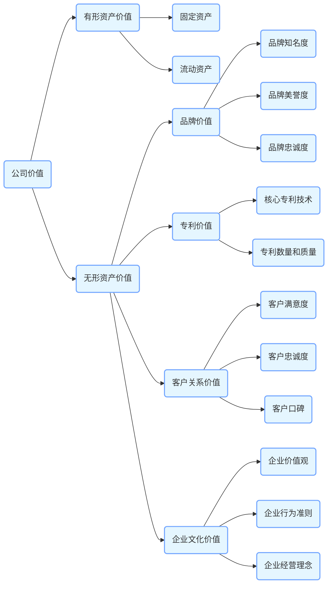

# 彼得林奇如何看待公司的无形资产价值

> 关键词：彼得林奇、公司无形资产价值、投资分析、品牌价值、技术专利

> 摘要：本文深入探讨了投资大师彼得林奇对公司无形资产价值的看法。通过研究彼得林奇的投资理念和相关案例，分析无形资产如品牌、专利、客户关系等在公司价值评估中的重要性。详细阐述了无形资产如何影响公司的竞争力、盈利能力和长期发展潜力，以及投资者应如何识别和评估这些无形资产。旨在帮助投资者更好地理解彼得林奇的投资思想，提高对公司无形资产价值的认识和评估能力，从而做出更明智的投资决策。

## 1. 背景介绍 
### 1.1 目的和范围
本文的目的是全面剖析彼得林奇对公司无形资产价值的观点。彼得林奇作为投资界的传奇人物，其投资理念影响深远。通过研究他如何看待公司的无形资产价值，能够为投资者提供宝贵的投资思路和方法。文章将涵盖彼得林奇在不同时期对无形资产价值的论述，以及他在实际投资中如何运用这些观点进行决策。范围包括对各类无形资产，如品牌、专利、企业文化等的分析，以及它们在不同行业中的表现和影响。

### 1.2 预期读者
本文的预期读者主要是对投资领域感兴趣的人士，包括专业投资者、业余投资者、金融从业者以及相关领域的研究人员。对于想要学习彼得林奇投资理念，了解如何评估公司无形资产价值的读者来说，本文将提供有价值的参考。同时，对于企业管理者来说，也可以从彼得林奇的观点中获得启示，更好地管理和提升公司的无形资产价值。

### 1.3 文档结构概述
本文将按照以下结构进行阐述：首先介绍核心概念，包括无形资产的定义、分类以及与公司价值的联系；接着详细讲解彼得林奇评估无形资产价值的核心算法原理和具体操作步骤，并结合 Python 代码进行说明；然后通过数学模型和公式进一步阐述无形资产价值的评估方法，并举例说明；再通过项目实战，给出实际案例和代码解读；之后探讨无形资产价值评估在实际应用中的场景；推荐相关的学习资源、开发工具和论文著作；最后总结未来发展趋势与挑战，提供常见问题解答和扩展阅读参考资料。

### 1.4 术语表
#### 1.4.1 核心术语定义
- **无形资产**：指企业拥有或者控制的没有实物形态的可辨认非货币性资产，包括专利权、商标权、著作权、土地使用权、非专利技术、商誉等。
- **品牌价值**：品牌在消费者心目中的形象、声誉和认知度所带来的价值，体现为消费者对品牌产品的忠诚度和支付溢价的意愿。
- **专利价值**：专利技术所具有的经济价值，包括通过专利授权、技术转让等方式获得的收益，以及专利对企业市场竞争力的提升作用。
- **客户关系价值**：企业与客户之间长期稳定的合作关系所带来的价值，如客户的重复购买、口碑传播等。

#### 1.4.2 相关概念解释
- **商誉**：企业在合并过程中，购买方支付的价款超过被购买方可辨认净资产公允价值的部分。商誉反映了企业的品牌影响力、客户资源、管理团队等因素所带来的价值。
- **技术诀窍**：企业在生产经营过程中积累的独特技术和经验，虽然未申请专利，但具有一定的商业价值。
- **企业文化**：企业在长期发展过程中形成的价值观、行为准则和经营理念，对企业的凝聚力、创新能力和市场竞争力有着重要影响。

#### 1.4.3 缩略词列表
- **ROE**：净资产收益率（Return on Equity），衡量企业运用自有资本的效率。
- **EPS**：每股收益（Earnings Per Share），反映普通股的获利水平。

## 2. 核心概念与联系 
### 核心概念原理
彼得林奇认为，公司的无形资产价值是公司价值的重要组成部分。无形资产虽然没有实物形态，但却能够为公司带来巨大的经济利益。例如，强大的品牌可以吸引消费者，提高产品的市场占有率和价格竞争力；专利技术可以保护公司的创新成果，防止竞争对手的模仿，从而为公司带来持续的利润增长。

品牌价值的形成是一个长期的过程，需要企业通过优质的产品、良好的服务和有效的市场营销来塑造。消费者对品牌的信任和认可会转化为品牌忠诚度，使得他们愿意为品牌产品支付更高的价格。例如，苹果公司的品牌在全球范围内具有极高的知名度和美誉度，消费者愿意为其产品支付较高的价格，这使得苹果公司能够获得丰厚的利润。

专利价值则体现在技术创新和市场竞争方面。拥有核心专利技术的公司可以在市场上占据领先地位，获得垄断利润。例如，制药公司通过研发新药获得专利保护，在专利有效期内可以独家生产和销售该药物，从而获得高额的利润回报。

客户关系价值是企业与客户之间长期互动的结果。良好的客户关系可以提高客户的满意度和忠诚度，促进客户的重复购买和口碑传播。例如，亚马逊通过提供优质的购物体验和个性化的服务，建立了庞大的客户群体，客户的重复购买和口碑传播为亚马逊带来了持续的业务增长。

### 架构的文本示意图
```plaintext
公司价值
|--有形资产价值
|   |--固定资产
|   |--流动资产
|--无形资产价值
|   |--品牌价值
|   |   |--品牌知名度
|   |   |--品牌美誉度
|   |   |--品牌忠诚度
|   |--专利价值
|   |   |--核心专利技术
|   |   |--专利数量和质量
|   |--客户关系价值
|   |   |--客户满意度
|   |   |--客户忠诚度
|   |   |--客户口碑
|   |--企业文化价值
|   |   |--企业价值观
|   |   |--企业行为准则
|   |   |--企业经营理念
```

### Mermaid 流程图


## 3. 核心算法原理 & 具体操作步骤 
### 核心算法原理
彼得林奇评估公司无形资产价值并没有一套固定的精确算法，但可以通过一些指标和方法进行综合评估。一种常见的思路是通过比较公司的市场价值和其有形资产价值，来估算无形资产价值。公式如下：

无形资产价值 = 公司市场价值 - 有形资产价值

其中，公司市场价值可以通过公司的股票市值（股价 × 总股本）来计算；有形资产价值可以通过公司的资产负债表中的固定资产、流动资产等项目相加得到。

### 具体操作步骤
#### 步骤 1：获取公司财务数据
通过金融数据提供商（如 Bloomberg、Wind 等）或公司的年报、季报等公开披露信息，获取公司的资产负债表和股票价格数据。

#### 步骤 2：计算有形资产价值
从资产负债表中提取固定资产、流动资产等项目的数据，将它们相加得到有形资产价值。

#### 步骤 3：计算公司市场价值
根据公司的股票价格和总股本，计算公司的股票市值，即公司市场价值。

#### 步骤 4：计算无形资产价值
用公司市场价值减去有形资产价值，得到无形资产价值的估算值。

### Python 源代码实现
```python
import pandas as pd

# 假设已经从金融数据提供商获取了公司的财务数据
# 这里简单模拟数据
financial_data = {
    '固定资产': 10000000,
    '流动资产': 5000000,
    '总股本': 1000000,
    '股票价格': 20
}

# 计算有形资产价值
tangible_assets_value = financial_data['固定资产'] + financial_data['流动资产']

# 计算公司市场价值
market_value = financial_data['总股本'] * financial_data['股票价格']

# 计算无形资产价值
intangible_assets_value = market_value - tangible_assets_value

print(f"有形资产价值: {tangible_assets_value}")
print(f"公司市场价值: {market_value}")
print(f"无形资产价值: {intangible_assets_value}")
```

### 代码解释
1. **数据模拟**：使用字典 `financial_data` 模拟从金融数据提供商获取的公司财务数据，包括固定资产、流动资产、总股本和股票价格。
2. **计算有形资产价值**：将固定资产和流动资产相加，得到有形资产价值。
3. **计算公司市场价值**：用总股本乘以股票价格，得到公司市场价值。
4. **计算无形资产价值**：用公司市场价值减去有形资产价值，得到无形资产价值。
5. **输出结果**：打印有形资产价值、公司市场价值和无形资产价值。

## 4. 数学模型和公式 & 详细讲解 & 举例说明 
### 数学模型和公式
#### 无形资产价值估算公式
如前面所述，无形资产价值的估算公式为：

$$无形资产价值 = 公司市场价值 - 有形资产价值$$

#### 品牌价值评估公式（简单示例）
品牌价值可以通过品牌溢价和市场份额来估算。假设品牌产品的价格为 $P_b$，非品牌同类产品的价格为 $P_n$，品牌产品的销售量为 $Q_b$，则品牌溢价带来的额外收入为 $(P_b - P_n) \times Q_b$。考虑到市场份额和未来增长因素，可以对这个额外收入进行折现，得到品牌价值的估算值。公式如下：

$$品牌价值 = \sum_{t=1}^{n} \frac{(P_b - P_n) \times Q_b \times (1 + g)^t}{(1 + r)^t}$$

其中，$g$ 为市场份额的增长率，$r$ 为折现率，$n$ 为预测期数。

#### 专利价值评估公式（简单示例）
专利价值可以通过专利授权收入和成本节约来估算。假设专利授权收入为 $R_p$，因专利技术带来的成本节约为 $C_s$，专利的有效期为 $T$，则专利价值的估算公式为：

$$专利价值 = \sum_{t=1}^{T} \frac{R_p + C_s}{(1 + r)^t}$$

其中，$r$ 为折现率。

### 详细讲解
#### 无形资产价值估算公式
该公式的基本思想是，公司的市场价值是由有形资产价值和无形资产价值共同构成的。通过减去有形资产价值，可以得到无形资产价值的大致估算。然而，这种方法存在一定的局限性，因为市场价值受到多种因素的影响，如市场情绪、宏观经济环境等，可能不能准确反映公司的真实价值。

#### 品牌价值评估公式
品牌价值评估公式考虑了品牌溢价带来的额外收入，并通过折现的方式将未来的收入转化为现值。市场份额的增长率 $g$ 反映了品牌的市场扩张能力，折现率 $r$ 反映了资金的时间价值和投资风险。预测期数 $n$ 可以根据品牌的发展阶段和市场前景进行合理估计。

#### 专利价值评估公式
专利价值评估公式考虑了专利授权收入和成本节约，并通过折现的方式将未来的收益转化为现值。专利的有效期 $T$ 是一个重要的参数，它决定了专利能够带来收益的时间范围。折现率 $r$ 同样反映了资金的时间价值和投资风险。

### 举例说明
#### 无形资产价值估算示例
假设一家公司的股票价格为 50 元，总股本为 2000 万股，固定资产为 3 亿元，流动资产为 2 亿元。则：

公司市场价值 = 50 × 2000 万 = 10 亿元

有形资产价值 = 3 亿 + 2 亿 = 5 亿元

无形资产价值 = 10 亿 - 5 亿 = 5 亿元

#### 品牌价值评估示例
假设某品牌产品的价格为 100 元，非品牌同类产品的价格为 80 元，品牌产品的销售量为 100 万件，市场份额的增长率为 5%，折现率为 10%，预测期数为 5 年。则：

每年的品牌溢价额外收入 = (100 - 80) × 100 万 = 2000 万元

品牌价值 = $\sum_{t=1}^{5} \frac{2000 万 \times (1 + 5\%)^t}{(1 + 10\%)^t}$

通过计算可得品牌价值约为 7736.8 万元。

#### 专利价值评估示例
假设某专利的授权收入为每年 500 万元，因专利技术带来的成本节约为每年 300 万元，专利的有效期为 10 年，折现率为 8%。则：

每年的专利收益 = 500 万 + 300 万 = 800 万元

专利价值 = $\sum_{t=1}^{10} \frac{800 万}{(1 + 8\%)^t}$

通过计算可得专利价值约为 5368.07 万元。

## 5. 项目实战：代码实际案例和详细解释说明 
### 5.1  开发环境搭建
#### 编程语言和版本
使用 Python 3.8 及以上版本。可以从 Python 官方网站（https://www.python.org/downloads/）下载并安装。

#### 依赖库安装
需要安装 `pandas` 库用于数据处理。可以使用以下命令进行安装：
```sh
pip install pandas
```

#### 数据获取
可以使用金融数据 API 如 `pandas-datareader` 从雅虎财经等数据源获取公司的财务数据和股票价格数据。安装命令如下：
```sh
pip install pandas-datareader
```

### 5.2  源代码详细实现和代码解读
```python
import pandas as pd
import pandas_datareader.data as web
import datetime

# 定义获取公司财务数据的函数
def get_financial_data(ticker, start_date, end_date):
    try:
        # 获取公司的资产负债表数据
        balance_sheet = web.DataReader(f'{ticker}.balance_sheet', 'yahoo', start_date, end_date)
        # 获取公司的股票价格数据
        stock_price = web.DataReader(ticker, 'yahoo', start_date, end_date)
        # 获取最新的总股本数据
        shares_outstanding = web.get_quote_yahoo(ticker)['sharesOutstanding'].values[0]
        return balance_sheet, stock_price, shares_outstanding
    except Exception as e:
        print(f"获取数据失败: {e}")
        return None, None, None

# 定义计算无形资产价值的函数
def calculate_intangible_assets(balance_sheet, stock_price, shares_outstanding):
    if balance_sheet is None or stock_price is None or shares_outstanding is None:
        return None
    # 获取最新的固定资产和流动资产数据
    fixed_assets = balance_sheet.loc['PropertyPlantEquipment'].iloc[-1]
    current_assets = balance_sheet.loc['TotalCurrentAssets'].iloc[-1]
    # 计算有形资产价值
    tangible_assets_value = fixed_assets + current_assets
    # 获取最新的股票价格
    latest_price = stock_price['Close'].iloc[-1]
    # 计算公司市场价值
    market_value = latest_price * shares_outstanding
    # 计算无形资产价值
    intangible_assets_value = market_value - tangible_assets_value
    return intangible_assets_value

# 主函数
def main():
    ticker = 'AAPL'  # 示例股票代码，苹果公司
    start_date = datetime.datetime(2020, 1, 1)
    end_date = datetime.datetime(2023, 12, 31)
    # 获取财务数据
    balance_sheet, stock_price, shares_outstanding = get_financial_data(ticker, start_date, end_date)
    # 计算无形资产价值
    intangible_assets_value = calculate_intangible_assets(balance_sheet, stock_price, shares_outstanding)
    if intangible_assets_value is not None:
        print(f"{ticker} 公司的无形资产价值: {intangible_assets_value}")

if __name__ == "__main__":
    main()
```

### 代码解读与分析
#### 数据获取函数 `get_financial_data`
该函数接受股票代码、开始日期和结束日期作为参数，使用 `pandas-datareader` 从雅虎财经获取公司的资产负债表数据、股票价格数据和总股本数据。如果获取数据过程中出现异常，将打印错误信息并返回 `None`。

#### 无形资产价值计算函数 `calculate_intangible_assets`
该函数接受资产负债表数据、股票价格数据和总股本数据作为参数，计算公司的有形资产价值、市场价值和无形资产价值。如果输入数据为 `None`，则返回 `None`。

#### 主函数 `main`
该函数设置股票代码、开始日期和结束日期，调用 `get_financial_data` 函数获取财务数据，然后调用 `calculate_intangible_assets` 函数计算无形资产价值，并打印结果。

### 注意事项
- 雅虎财经的数据获取可能会受到网络、数据接口等因素的影响，需要注意异常处理。
- 该代码只是一个简单的示例，实际应用中可能需要考虑更多因素，如数据的准确性、不同会计准则的影响等。

## 6. 实际应用场景 
### 投资决策
在股票投资中，彼得林奇对公司无形资产价值的看法具有重要的指导意义。投资者可以通过评估公司的无形资产价值，判断公司的真实价值和投资潜力。例如，如果一家公司的无形资产价值较高，说明该公司具有较强的品牌影响力、技术实力或客户关系，未来的盈利能力和市场竞争力可能较强，值得投资。相反，如果一家公司的无形资产价值较低，可能需要谨慎投资。

### 企业并购
在企业并购过程中，无形资产价值的评估是一个关键环节。收购方需要了解被收购公司的无形资产情况，包括品牌、专利、客户关系等，以确定合理的收购价格。如果被收购公司的无形资产价值较高，收购方可能需要支付更高的溢价；反之，则可以以较低的价格进行收购。

### 企业战略规划
企业管理者可以借鉴彼得林奇的观点，重视公司的无形资产价值管理。通过加强品牌建设、研发创新、客户关系维护等方面的工作，提升公司的无形资产价值。例如，企业可以加大品牌推广力度，提高品牌知名度和美誉度；加强研发投入，获取更多的专利技术；优化客户服务，提高客户满意度和忠诚度。

### 行业分析
在进行行业分析时，无形资产价值可以作为一个重要的指标。不同行业的无形资产价值占比可能存在差异，例如，科技行业和消费品行业的无形资产价值通常较高，而制造业和采掘业的无形资产价值相对较低。通过比较不同行业的无形资产价值情况，可以了解行业的竞争格局和发展趋势。

## 7. 工具和资源推荐
### 7.1 学习资源推荐
#### 7.1.1 书籍推荐
- 《彼得林奇的成功投资》（*One Up On Wall Street*）：彼得林奇的经典著作，详细阐述了他的投资理念和方法，包括如何评估公司的基本面和无形资产价值。
- 《聪明的投资者》（*The Intelligent Investor*）：本杰明·格雷厄姆的著作，被誉为投资界的圣经，对价值投资和无形资产评估有深入的探讨。
- 《巴菲特致股东的信》（*The Essays of Warren Buffett*）：沃伦·巴菲特的书信集，包含了他对公司价值评估和无形资产的看法，具有很高的学习价值。

#### 7.1.2 在线课程
- Coursera 上的“投资学原理”课程：系统介绍了投资的基本原理和方法，包括公司估值和无形资产评估。
- edX 上的“金融市场”课程：由耶鲁大学教授罗伯特·席勒讲授，对金融市场和公司价值评估有深入的讲解。

#### 7.1.3 技术博客和网站
- Seeking Alpha：提供专业的金融分析和投资建议，有很多关于公司无形资产价值评估的文章。
- ValueWalk：专注于价值投资领域，分享了大量关于投资大师观点和公司基本面分析的内容。

### 7.2 开发工具框架推荐
#### 7.2.1 IDE和编辑器
- PyCharm：一款专业的 Python 集成开发环境，具有强大的代码编辑、调试和分析功能，适合进行数据分析和财务建模。
- Jupyter Notebook：一个交互式的编程环境，方便进行数据探索、可视化和代码演示，常用于金融数据分析和研究。

#### 7.2.2 调试和性能分析工具
- pdb：Python 内置的调试工具，可以帮助开发者定位代码中的错误和问题。
- cProfile：Python 标准库中的性能分析工具，可以分析代码的运行时间和函数调用情况，优化代码性能。

#### 7.2.3 相关框架和库
- pandas：用于数据处理和分析的 Python 库，提供了丰富的数据结构和函数，方便进行财务数据的清洗、整理和计算。
- numpy：一个高性能的科学计算库，提供了多维数组和矩阵运算功能，常用于数学模型的实现。

### 7.3 相关论文著作推荐
#### 7.3.1 经典论文
- "The Theory of Investment Value" by John Burr Williams：提出了现金流折现模型，为公司价值评估提供了重要的理论基础。
- "The Capital Asset Pricing Model: Theory and Evidence" by Eugene F. Fama and Kenneth R. French：对资本资产定价模型进行了深入的研究和实证分析，对投资决策有重要的指导意义。

#### 7.3.2 最新研究成果
- 关注顶级金融学术期刊，如 *Journal of Finance*、*Review of Financial Studies* 等，这些期刊上发表了很多关于公司无形资产价值评估的最新研究成果。

#### 7.3.3 应用案例分析
- 可以参考一些知名投资机构的研究报告和案例分析，了解他们在实际投资中如何评估公司的无形资产价值。

## 8. 总结：未来发展趋势与挑战
### 未来发展趋势
#### 无形资产价值的重要性日益凸显
随着知识经济的发展，无形资产在公司价值中的占比将越来越高。未来，品牌、技术专利、数据资产等无形资产将成为公司核心竞争力的重要来源，投资者和企业管理者将更加重视无形资产价值的评估和管理。

#### 评估方法的不断创新
随着信息技术和数据分析技术的发展，无形资产价值的评估方法将不断创新。例如，利用大数据和人工智能技术可以更准确地评估品牌价值、客户关系价值等。同时，新的评估模型和指标也将不断涌现，提高无形资产价值评估的准确性和可靠性。

#### 跨学科研究的加强
无形资产价值评估涉及到经济学、管理学、法学、会计学等多个学科领域。未来，跨学科研究将加强，不同学科的理论和方法将相互融合，为无形资产价值评估提供更全面、深入的视角。

### 挑战
#### 数据获取和质量问题
无形资产的相关数据往往难以获取，且数据质量参差不齐。例如，品牌价值、客户关系价值等数据通常需要通过市场调研、问卷调查等方式获取，数据的准确性和可靠性受到多种因素的影响。此外，不同企业对无形资产的会计处理方法可能存在差异，也会影响数据的可比性。

#### 评估方法的主观性
无形资产价值的评估方法存在一定的主观性。例如，在品牌价值评估中，市场份额的增长率、折现率等参数的确定往往需要依靠评估人员的经验和判断，不同的评估人员可能会得出不同的结果。因此，如何减少评估方法的主观性，提高评估结果的客观性和公正性，是一个亟待解决的问题。

#### 法律法规和政策的不完善
目前，我国关于无形资产价值评估的法律法规和政策还不够完善。例如，在无形资产的产权界定、交易规则、税收政策等方面还存在一些问题，这给无形资产价值评估和管理带来了一定的困难。未来，需要加强相关法律法规和政策的制定和完善，为无形资产价值评估和管理提供良好的法律环境和政策支持。

## 9. 附录：常见问题与解答
### 问题 1：无形资产价值评估的结果是否准确可靠？
解答：无形资产价值评估的结果存在一定的不确定性。由于无形资产的特殊性，其价值受到多种因素的影响，如市场环境、技术发展、消费者偏好等。评估方法也存在一定的主观性，不同的评估人员可能会得出不同的结果。因此，无形资产价值评估的结果只能作为参考，不能完全准确地反映无形资产的真实价值。

### 问题 2：如何提高无形资产价值评估的准确性？
解答：可以从以下几个方面提高无形资产价值评估的准确性：
- 选择合适的评估方法：根据无形资产的特点和评估目的，选择合适的评估方法。例如，对于品牌价值可以采用市场法、收益法等进行评估。
- 收集充分的信息：尽可能收集与无形资产相关的信息，包括市场数据、财务数据、技术资料等，为评估提供可靠的依据。
- 考虑多种因素：在评估过程中，要考虑多种因素的影响，如市场风险、技术风险、竞争状况等，对评估结果进行合理的调整。
- 聘请专业的评估机构：专业的评估机构具有丰富的经验和专业的知识，能够提供更准确的评估结果。

### 问题 3：无形资产价值评估在企业财务报表中如何体现？
解答：在企业财务报表中，无形资产通常按照成本进行初始计量，并在使用寿命内进行摊销。对于符合一定条件的无形资产，如外购的无形资产、自行开发并依法申请取得的无形资产等，可以在资产负债表中单独列示。然而，财务报表中的无形资产价值往往不能完全反映其真实价值，因为财务报表采用的是历史成本计量原则，没有考虑无形资产的市场价值和未来收益潜力。

### 问题 4：无形资产价值评估对企业融资有什么影响？
解答：无形资产价值评估对企业融资具有重要的影响。一方面，准确评估无形资产价值可以提高企业的资产质量和信用等级，增加企业的融资能力。例如，企业可以将无形资产作为抵押物进行贷款融资，或者通过无形资产证券化等方式进行融资。另一方面，投资者在进行投资决策时，也会关注企业的无形资产价值，无形资产价值较高的企业更容易获得投资者的青睐，从而更容易获得股权融资。

## 10. 扩展阅读 & 参考资料
### 扩展阅读
- 《财务报表分析与股票估值》：深入介绍了如何通过财务报表分析评估公司的价值，包括无形资产价值的评估方法。
- 《创新者的窘境》：探讨了技术创新和企业竞争的关系，对理解公司的技术专利等无形资产价值具有重要的启示。

### 参考资料
- 彼得林奇的相关著作和访谈资料。
- 金融学术期刊上发表的关于无形资产价值评估的研究论文。
- 知名投资机构的研究报告和案例分析。

作者：AI天才研究院/AI Genius Institute & 禅与计算机程序设计艺术 /Zen And The Art of Computer Programming