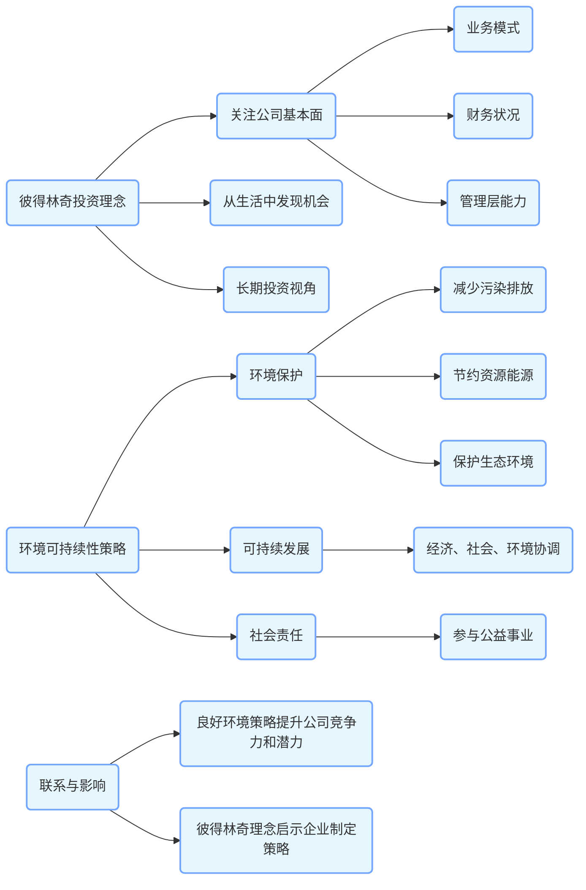

# 彼得林奇如何看待公司的环境可持续性策略

> 关键词：彼得林奇、公司环境可持续性策略、投资分析、企业发展、环境责任

> 摘要：本文深入探讨了投资大师彼得林奇对公司环境可持续性策略的看法。从彼得林奇独特的投资理念出发，分析环境可持续性策略与公司财务表现、市场竞争力、长期发展潜力等方面的关联。通过对核心概念的解释、算法原理的阐述、数学模型的分析以及实际案例的研究，揭示环境可持续性策略在彼得林奇投资体系中的重要性，并探讨其在实际应用场景中的意义。同时，提供相关的学习资源、开发工具和论文著作推荐，最后对未来发展趋势与挑战进行总结，为投资者和企业管理者提供全面的参考。

## 1. 背景介绍
### 1.1 目的和范围
本文旨在深入研究彼得林奇对于公司环境可持续性策略的观点和看法。通过对彼得林奇投资理念和方法的剖析，结合环境可持续性策略的相关理论和实践，探讨两者之间的内在联系和相互影响。研究范围涵盖了彼得林奇的投资著作、公开言论以及相关的案例分析，同时也涉及到环境可持续性策略的定义、实施和评估等方面。

### 1.2 预期读者
本文的预期读者包括投资者、企业管理者、环境政策制定者以及对可持续发展和投资领域感兴趣的学者和研究人员。对于投资者来说，了解彼得林奇对环境可持续性策略的看法可以帮助他们在投资决策中考虑更多的因素，提高投资的成功率；对于企业管理者来说，本文可以提供有关如何制定和实施环境可持续性策略的启示，增强企业的竞争力和长期发展能力；对于环境政策制定者来说，本文可以为政策的制定和实施提供参考，促进经济发展与环境保护的协调共进；对于学者和研究人员来说，本文可以为他们的研究提供新的视角和思路。

### 1.3 文档结构概述
本文将按照以下结构进行组织：
- 核心概念与联系：介绍彼得林奇的投资理念、环境可持续性策略的定义和内涵，以及两者之间的联系和相互影响。
- 核心算法原理 & 具体操作步骤：阐述彼得林奇在分析公司时所采用的方法和步骤，以及如何将环境可持续性策略纳入到分析过程中。
- 数学模型和公式 & 详细讲解 & 举例说明：通过数学模型和公式，对环境可持续性策略与公司财务表现、市场竞争力等方面的关系进行量化分析，并结合实际案例进行说明。
- 项目实战：代码实际案例和详细解释说明：通过实际的代码案例，展示如何运用彼得林奇的方法和思路，对公司的环境可持续性策略进行分析和评估。
- 实际应用场景：探讨环境可持续性策略在不同行业和领域的实际应用场景，以及彼得林奇的观点在实际投资中的应用。
- 工具和资源推荐：推荐相关的学习资源、开发工具和论文著作，帮助读者进一步深入学习和研究。
- 总结：未来发展趋势与挑战：总结彼得林奇对公司环境可持续性策略的看法，分析未来的发展趋势和面临的挑战。
- 附录：常见问题与解答：对读者可能关心的问题进行解答，提供更详细的信息和解释。
- 扩展阅读 & 参考资料：提供相关的扩展阅读材料和参考资料，方便读者进一步深入研究。

### 1.4 术语表
#### 1.4.1 核心术语定义
- **彼得林奇**：美国著名的投资家，曾任富达公司麦哲伦基金的基金经理，以其卓越的投资业绩和独特的投资理念而闻名于世。
- **环境可持续性策略**：指企业为了实现经济、社会和环境的可持续发展，而制定和实施的一系列政策、措施和行动计划。
- **投资分析**：指对投资对象的财务状况、经营业绩、市场前景等方面进行分析和评估，以确定投资的可行性和潜在收益。
- **企业发展**：指企业在长期的经营过程中，通过不断地创新、扩张和优化，实现规模的扩大、效益的提高和竞争力的增强。
- **环境责任**：指企业在生产经营过程中，对环境所承担的责任和义务，包括减少污染排放、节约资源能源、保护生态环境等方面。

#### 1.4.2 相关概念解释
- **可持续发展**：指既满足当代人的需求，又不损害后代人满足其需求的能力的发展模式。
- **绿色投资**：指投资者将资金投向那些具有良好环境表现和可持续发展潜力的企业和项目，以实现经济收益和环境效益的双赢。
- **企业社会责任**：指企业在创造利润、对股东和员工承担法律责任的同时，还要承担对消费者、社区和环境的责任。
- **环境绩效**：指企业在环境保护方面所取得的成效和表现，通常用环境指标和数据来衡量。

#### 1.4.3 缩略词列表
- **ESG**：环境（Environmental）、社会（Social）和治理（Governance）的缩写，是衡量企业可持续发展能力的重要指标体系。
- **ROE**：净资产收益率（Return on Equity）的缩写，是衡量企业盈利能力的重要指标。
- **EPS**：每股收益（Earnings Per Share）的缩写，是衡量企业盈利水平的重要指标。

## 2. 核心概念与联系
### 彼得林奇的投资理念
彼得林奇是价值投资的代表人物之一，他的投资理念强调通过深入研究和分析公司的基本面，寻找具有成长潜力和价值被低估的股票。他认为，投资者应该关注公司的业务模式、财务状况、管理层能力等因素，而不是被市场的短期波动所影响。

彼得林奇主张“从生活中发现投资机会”，他认为普通投资者可以通过观察身边的消费趋势、行业动态等，发现那些具有潜力的公司。例如，如果发现身边的人都在购买某家公司的产品，或者某个行业正在快速发展，那么就可以进一步研究这些公司的基本面，看是否具有投资价值。

### 环境可持续性策略的定义和内涵
环境可持续性策略是指企业为了实现经济、社会和环境的可持续发展，而制定和实施的一系列政策、措施和行动计划。它包括以下几个方面的内容：
- **环境保护**：企业采取措施减少污染排放、节约资源能源、保护生态环境，降低对环境的负面影响。
- **可持续发展**：企业在追求经济利益的同时，考虑到社会和环境的可持续性，实现经济、社会和环境的协调发展。
- **社会责任**：企业承担起对社会和环境的责任，积极参与公益事业，推动社会的进步和发展。

### 两者之间的联系和相互影响
彼得林奇虽然没有专门针对环境可持续性策略进行深入的研究和论述，但他的投资理念和方法与环境可持续性策略之间存在着一定的联系和相互影响。

从投资的角度来看，具有良好环境可持续性策略的公司往往具有更强的竞争力和长期发展潜力。这些公司能够更好地应对环境法规的变化、消费者对环保产品的需求增加等挑战，从而在市场中占据更有利的地位。例如，一家注重节能减排的企业，不仅可以降低生产成本，还可以提高品牌形象，吸引更多的消费者。

另一方面，彼得林奇的投资理念也可以为企业制定和实施环境可持续性策略提供启示。他强调对公司基本面的深入研究和分析，这就要求企业在制定环境可持续性策略时，要充分考虑自身的实际情况和发展战略，确保策略的可行性和有效性。同时，他主张关注公司的长期发展潜力，这也与环境可持续性策略的目标相一致，即实现企业的长期可持续发展。

### 文本示意图
```plaintext
彼得林奇投资理念
|
|-- 关注公司基本面
|   |-- 业务模式
|   |-- 财务状况
|   |-- 管理层能力
|
|-- 从生活中发现机会
|
|-- 长期投资视角

环境可持续性策略
|
|-- 环境保护
|   |-- 减少污染排放
|   |-- 节约资源能源
|   |-- 保护生态环境
|
|-- 可持续发展
|   |-- 经济、社会、环境协调
|
|-- 社会责任
|   |-- 参与公益事业

联系与影响
|
|-- 良好环境策略提升公司竞争力和潜力
|-- 彼得林奇理念启示企业制定策略
```

### Mermaid 流程图


## 3. 核心算法原理 & 具体操作步骤
### 彼得林奇的投资分析方法
彼得林奇在分析公司时，主要采用了以下几个步骤：
1. **筛选公司**：通过各种渠道，如报纸、杂志、行业报告等，收集公司的信息，筛选出具有潜力的公司。
2. **研究公司基本面**：对筛选出的公司进行深入的研究和分析，包括公司的业务模式、财务状况、管理层能力等方面。
3. **评估公司价值**：根据公司的基本面和市场情况，评估公司的价值，判断其是否被低估。
4. **做出投资决策**：根据评估结果，做出投资决策，选择具有投资价值的公司进行投资。

### 将环境可持续性策略纳入分析过程
在将环境可持续性策略纳入投资分析过程时，可以采用以下步骤：
1. **收集环境信息**：通过公司的年报、可持续发展报告、新闻媒体等渠道，收集公司的环境信息，包括公司的环境政策、环境绩效、环境风险等方面。
2. **评估环境影响**：对公司的环境信息进行评估，分析公司的环境可持续性策略对其财务状况、市场竞争力、长期发展潜力等方面的影响。
3. **量化环境指标**：将环境影响量化为具体的指标，如环境成本、环境收益、环境风险等，以便更好地进行分析和比较。
4. **综合分析**：将环境指标与公司的基本面指标相结合，进行综合分析，评估公司的整体价值和投资潜力。

### Python 源代码实现
```python
import pandas as pd

# 假设这是从公司年报等渠道收集到的数据
data = {
    '公司名称': ['公司A', '公司B', '公司C'],
    '营业收入': [1000, 2000, 1500],
    '净利润': [100, 200, 150],
    '环境成本': [50, 80, 60],
    '环境收益': [30, 60, 40],
    '环境风险评级': [2, 3, 2]  # 1-5级，1最低，5最高
}

df = pd.DataFrame(data)

# 计算环境净收益
df['环境净收益'] = df['环境收益'] - df['环境成本']

# 定义一个简单的综合评分函数
def calculate_score(row):
    # 这里简单假设营业收入权重0.3，净利润权重0.3，环境净收益权重0.2，环境风险评级权重0.2
    score = (row['营业收入'] * 0.3 + row['净利润'] * 0.3 + row['环境净收益'] * 0.2 - row['环境风险评级'] * 0.2)
    return score

df['综合评分'] = df.apply(calculate_score, axis=1)

# 按综合评分排序
sorted_df = df.sort_values(by='综合评分', ascending=False)

print(sorted_df)
```
### 代码解释
1. **数据收集与整理**：使用 `pandas` 库创建一个包含公司基本财务数据和环境数据的 `DataFrame`。
2. **环境净收益计算**：通过计算环境收益减去环境成本，得到环境净收益。
3. **综合评分计算**：定义一个综合评分函数，根据营业收入、净利润、环境净收益和环境风险评级等指标计算综合评分。
4. **排序与展示**：根据综合评分对公司进行排序，并打印排序后的结果。

通过以上步骤和代码，我们可以将环境可持续性策略纳入到彼得林奇的投资分析过程中，从而更全面地评估公司的投资价值。

## 4. 数学模型和公式 & 详细讲解 & 举例说明
### 环境可持续性与公司财务表现的数学关系
我们可以建立一个简单的数学模型来描述环境可持续性与公司财务表现之间的关系。假设公司的净利润 $P$ 受到营业收入 $R$、成本 $C$ 和环境因素 $E$ 的影响，其中环境因素包括环境成本 $C_E$ 和环境收益 $R_E$。则公司的净利润可以表示为：

$$P = R - C - C_E + R_E$$

其中，环境成本 $C_E$ 包括污染治理费用、资源浪费成本等；环境收益 $R_E$ 包括节能减排带来的成本降低、环保产品的销售增加等。

### 环境因素对公司价值的影响
在评估公司价值时，我们可以使用现金流折现模型（DCF）。假设公司的自由现金流 $FCF$ 受到环境因素的影响，我们可以将环境因素纳入到现金流的预测中。则公司的价值 $V$ 可以表示为：

$$V = \sum_{t=1}^{n} \frac{FCF_t}{(1 + r)^t}$$

其中，$FCF_t$ 是第 $t$ 期的自由现金流，$r$ 是折现率，$n$ 是预测期数。

### 举例说明
假设公司 A 和公司 B 的相关数据如下：

| 公司 | 营业收入（万元） | 成本（万元） | 环境成本（万元） | 环境收益（万元） |
| ---- | ---- | ---- | ---- | ---- |
| 公司 A | 1000 | 800 | 50 | 30 |
| 公司 B | 1200 | 900 | 80 | 60 |

根据上述公式，计算两家公司的净利润：

公司 A 的净利润：

$$P_A = 1000 - 800 - 50 + 30 = 180$$

公司 B 的净利润：

$$P_B = 1200 - 900 - 80 + 60 = 280$$

从净利润来看，公司 B 的盈利能力更强。但如果考虑到环境因素的长期影响，公司 B 在环境可持续性方面的投入可能会带来更多的长期收益，从而提升其公司价值。

假设两家公司的自由现金流预测如下：

| 公司 | 第 1 年自由现金流（万元） | 第 2 年自由现金流（万元） | 第 3 年自由现金流（万元） |
| ---- | ---- | ---- | ---- |
| 公司 A | 200 | 220 | 240 |
| 公司 B | 250 | 280 | 320 |

折现率 $r = 10\%$，预测期数 $n = 3$。则两家公司的价值分别为：

公司 A 的价值：

$$V_A = \frac{200}{(1 + 0.1)^1} + \frac{220}{(1 + 0.1)^2} + \frac{240}{(1 + 0.1)^3} \approx 569.27$$

公司 B 的价值：

$$V_B = \frac{250}{(1 + 0.1)^1} + \frac{280}{(1 + 0.1)^2} + \frac{320}{(1 + 0.1)^3} \approx 730.48$$

通过上述计算可以看出，考虑到环境因素对自由现金流的影响后，公司 B 的价值更高。这说明环境可持续性策略对公司的长期价值有着重要的影响。

## 5. 项目实战：代码实际案例和详细解释说明 
### 5.1 开发环境搭建
为了完成本项目实战，我们需要搭建以下开发环境：
1. **Python 环境**：建议使用 Python 3.7 及以上版本。可以从 Python 官方网站（https://www.python.org/downloads/）下载并安装。
2. **开发工具**：可以使用 Jupyter Notebook 或 PyCharm 等开发工具。Jupyter Notebook 是一个交互式的开发环境，适合进行数据分析和可视化；PyCharm 是一个专业的 Python 集成开发环境，适合进行大型项目的开发。
3. **相关库**：需要安装 `pandas`、`numpy`、`matplotlib` 等库。可以使用 `pip` 命令进行安装，例如：

```sh
pip install pandas numpy matplotlib
```

### 5.2 源代码详细实现和代码解读
以下是一个完整的代码示例，用于分析公司的环境可持续性策略对其财务表现的影响：

```python
import pandas as pd
import numpy as np
import matplotlib.pyplot as plt

# 读取数据
data = pd.read_csv('company_data.csv')

# 查看数据基本信息
print('数据基本信息：')
data.info()

# 查看数据集行数和列数
rows, columns = data.shape

# 查看数据行数，如果行数少于 10，则查看全量数据信息，否则查看数据前几行信息
if rows < 10:
    print('数据全部内容信息：')
    print(data.to_csv(sep='\t', na_rep='nan'))
else:
    print('数据前几行内容信息：')
    print(data.head().to_csv(sep='\t', na_rep='nan'))

# 计算环境净收益
data['环境净收益'] = data['环境收益'] - data['环境成本']

# 计算净利润
data['净利润'] = data['营业收入'] - data['营业成本'] + data['环境净收益']

# 分析环境净收益与净利润的相关性，并保留两位小数
correlation = data['环境净收益'].corr(data['净利润']).round(2)
print(f'环境净收益与净利润的皮尔逊相关系数：{correlation}')

# 设置图片清晰度
plt.rcParams['figure.dpi'] = 300

# 设置中文字体
plt.rcParams['font.sans-serif'] = ['WenQuanYi Zen Hei']

# 绘制环境净收益与净利润的散点图
plt.scatter(data['环境净收益'], data['净利润'])
plt.xlabel('环境净收益')
plt.xticks(rotation=45)
plt.ylabel('净利润')
plt.title('环境净收益与净利润的散点图')

# 展示图片
plt.show()
```

### 代码解读与分析
1. **数据读取与查看**：使用 `pandas` 库的 `read_csv` 函数读取存储公司数据的 CSV 文件，并使用 `info` 方法查看数据的基本信息，包括列名、数据类型、非空值数量等。通过判断数据行数，决定是查看全量数据信息还是前几行数据信息。
2. **环境净收益和净利润计算**：根据环境收益和环境成本计算环境净收益，再结合营业收入和营业成本计算净利润。
3. **相关性分析**：使用 `corr` 方法计算环境净收益与净利润的皮尔逊相关系数，并保留两位小数，以分析两者之间的相关性。
4. **数据可视化**：使用 `matplotlib` 库绘制环境净收益与净利润的散点图，直观展示两者之间的关系。通过设置图片清晰度、中文字体，以及添加坐标轴标签和标题，使图表更加清晰和易读。

通过以上代码和分析，我们可以深入了解公司的环境可持续性策略对其财务表现的影响，为投资决策提供参考。

## 6. 实际应用场景 
### 投资领域
在投资领域，彼得林奇对公司环境可持续性策略的看法可以帮助投资者更好地评估公司的投资价值。具有良好环境可持续性策略的公司往往具有更强的竞争力和长期发展潜力，能够更好地应对环境法规的变化、消费者对环保产品的需求增加等挑战。因此，投资者可以将环境可持续性策略纳入到投资分析中，选择那些具有良好环境表现和可持续发展潜力的公司进行投资。

例如，在新能源汽车领域，一些公司注重研发和生产环保、节能的电动汽车，减少对传统燃油汽车的依赖，这些公司在环境可持续性方面表现出色。投资者可以关注这些公司的发展动态，评估其投资价值，适时进行投资。

### 企业管理领域
在企业管理领域，彼得林奇的观点可以为企业制定和实施环境可持续性策略提供启示。企业应该认识到环境可持续性策略不仅是一种社会责任，也是提升企业竞争力和长期发展能力的重要手段。通过采取环保措施、节约资源能源、推动可持续发展等，企业可以降低生产成本、提高品牌形象、吸引更多的消费者，从而在市场中占据更有利的地位。

例如，一些大型企业通过实施绿色供应链管理，要求供应商采用环保材料和生产工艺，减少供应链中的环境影响。这不仅有助于企业实现自身的环境目标，还可以带动整个产业链的可持续发展。

### 政策制定领域
在政策制定领域，彼得林奇的观点可以为政府制定环境政策提供参考。政府可以通过制定相关的政策和法规，鼓励企业采用环境可持续性策略，推动经济发展与环境保护的协调共进。例如，政府可以出台税收优惠政策，对那些在环境可持续性方面表现出色的企业给予税收减免；可以设立环保基金，支持企业开展环保研发和创新项目。

## 7. 工具和资源推荐
### 7.1 学习资源推荐
#### 7.1.1 书籍推荐
- 《彼得·林奇的成功投资》：彼得·林奇的经典著作，详细介绍了他的投资理念和方法，是投资者必读的书籍之一。
- 《漫步华尔街》：该书介绍了各种投资理论和方法，对投资者了解市场和投资策略有很大的帮助。
- 《可持续发展报告指南》：提供了企业编制可持续发展报告的指导和方法，有助于企业更好地实施环境可持续性策略。

#### 7.1.2 在线课程
- Coursera 上的“投资学原理”：由知名大学教授授课，系统介绍了投资学的基本原理和方法。
- edX 上的“可持续发展与企业社会责任”：该课程深入探讨了企业在可持续发展和社会责任方面的实践和挑战。

#### 7.1.3 技术博客和网站
- Seeking Alpha：提供了丰富的投资分析和研究报告，涵盖了各种行业和公司。
- SustainAbility：专注于可持续发展领域的研究和报道，提供了最新的行业动态和趋势分析。

### 7.2 开发工具框架推荐
#### 7.2.1 IDE和编辑器
- Jupyter Notebook：交互式的开发环境，适合进行数据分析和可视化。
- PyCharm：专业的 Python 集成开发环境，提供了丰富的功能和插件。

#### 7.2.2 调试和性能分析工具
- pdb：Python 自带的调试工具，可用于调试 Python 代码。
- cProfile：Python 标准库中的性能分析工具，可用于分析代码的性能瓶颈。

#### 7.2.3 相关框架和库
- pandas：用于数据处理和分析的 Python 库，提供了高效的数据结构和数据操作方法。
- numpy：用于科学计算的 Python 库，提供了高效的数组和矩阵运算功能。
- matplotlib：用于数据可视化的 Python 库，可绘制各种类型的图表和图形。

### 7.3 相关论文著作推荐
#### 7.3.1 经典论文
- “The Relationship between Corporate Social Responsibility and Financial Performance”：探讨了企业社会责任与财务绩效之间的关系。
- “Environmental Sustainability and Corporate Strategy”：分析了环境可持续性与企业战略的相互影响。

#### 7.3.2 最新研究成果
- 关注《Journal of Sustainable Finance & Investment》、《Business Strategy and the Environment》等学术期刊，获取最新的研究成果。

#### 7.3.3 应用案例分析
- 可以参考一些知名企业的可持续发展报告，了解它们在环境可持续性策略方面的实践和经验。例如，苹果公司的可持续发展报告详细介绍了其在环境保护、供应链管理等方面的措施和成果。

## 8. 总结：未来发展趋势与挑战
### 未来发展趋势
1. **环境可持续性策略将成为企业核心竞争力的重要组成部分**：随着消费者环保意识的提高和环境法规的日益严格，企业将越来越重视环境可持续性策略的制定和实施。具有良好环境表现的企业将在市场中获得更多的竞争优势，吸引更多的消费者和投资者。
2. **绿色投资将成为投资领域的重要趋势**：投资者将越来越关注企业的环境可持续性表现，绿色投资将成为投资领域的重要趋势。未来，将会有更多的投资机构和个人将资金投向那些具有良好环境表现和可持续发展潜力的企业和项目。
3. **技术创新将推动环境可持续性策略的实施**：随着科技的不断进步，将会有更多的新技术和新方法应用于环境可持续性领域。例如，人工智能、大数据、物联网等技术可以帮助企业更好地监测和管理环境数据，提高环境管理的效率和精准度。

### 挑战
1. **数据获取和分析难度较大**：目前，企业的环境数据获取和分析存在一定的难度，数据的准确性和完整性也有待提高。这给投资者和企业管理者评估环境可持续性策略的效果带来了一定的挑战。
2. **环境成本与经济效益的平衡**：企业在实施环境可持续性策略时，需要投入一定的成本，如环保设备的购置、污染治理的费用等。如何在保证环境效益的前提下，实现经济效益的最大化，是企业面临的一个重要挑战。
3. **缺乏统一的标准和评价体系**：目前，环境可持续性领域缺乏统一的标准和评价体系，不同的机构和组织对环境可持续性的定义和评价方法存在差异。这给企业和投资者在制定和评估环境可持续性策略时带来了一定的困惑。

## 9. 附录：常见问题与解答
### 问题 1：彼得林奇是否明确提出过环境可持续性策略对投资的重要性？
彼得林奇并没有专门针对环境可持续性策略提出明确的观点，但他的投资理念强调关注公司的长期发展潜力和基本面。从这个角度来看，具有良好环境可持续性策略的公司往往具有更强的竞争力和长期发展潜力，符合他的投资理念。

### 问题 2：如何衡量公司的环境可持续性策略的效果？
可以从多个方面衡量公司的环境可持续性策略的效果，如环境绩效指标（如污染物排放减少量、能源节约量等）、环境成本和收益、社会认可度等。此外，还可以参考一些第三方机构的评价和排名，如道琼斯可持续发展指数等。

### 问题 3：企业实施环境可持续性策略一定会带来经济效益吗？
企业实施环境可持续性策略不一定会立即带来经济效益，但从长期来看，具有良好环境表现的企业往往能够获得更多的竞争优势，如降低生产成本、提高品牌形象、吸引更多的消费者等，从而带来经济效益的提升。

### 问题 4：投资者如何将环境可持续性策略纳入投资决策中？
投资者可以通过收集公司的环境信息，如环境政策、环境绩效、环境风险等，评估公司的环境可持续性策略对其财务状况、市场竞争力、长期发展潜力等方面的影响。然后，将环境指标与公司的基本面指标相结合，进行综合分析，评估公司的整体价值和投资潜力。

## 10. 扩展阅读 & 参考资料
### 扩展阅读
- 《绿色金融与可持续发展》：深入探讨了绿色金融在可持续发展中的作用和实践。
- 《循环经济：从线性经济到闭环经济》：介绍了循环经济的概念、原理和实践案例，为企业实施环境可持续性策略提供了新的思路。

### 参考资料
- 彼得·林奇. 《彼得·林奇的成功投资》. 机械工业出版社.
- 杰里米·西格尔. 《漫步华尔街》. 机械工业出版社.
- 全球报告倡议组织（GRI）. 《可持续发展报告指南》.

作者：AI天才研究院/AI Genius Institute & 禅与计算机程序设计艺术 /Zen And The Art of Computer Programming