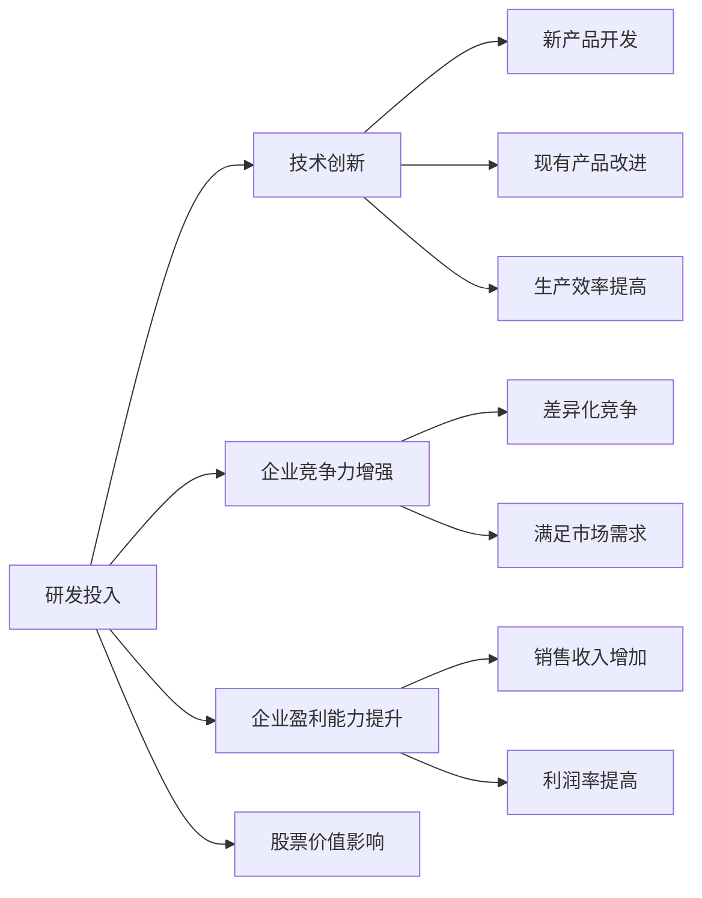

# 彼得林奇如何看待公司的研发投入

> 关键词：彼得林奇、公司研发投入、股票投资、企业分析、创新能力

> 摘要：本文深入探讨了投资大师彼得林奇对公司研发投入的看法。首先介绍了彼得林奇投资理念的背景，包括其目的、预期读者和文档结构。接着阐述了与研发投入相关的核心概念，如研发投入与企业竞争力的联系。通过具体的算法原理和Python代码示例，展示如何分析研发投入数据。运用数学模型和公式详细解读研发投入对企业价值的影响，并举例说明。在项目实战部分，搭建开发环境，给出源代码实现及详细解读。探讨了研发投入在不同行业的实际应用场景，推荐了相关的学习资源、开发工具和论文著作。最后总结了未来企业研发投入面临的发展趋势与挑战，并对常见问题进行了解答。

## 1. 背景介绍 
### 1.1 目的和范围
彼得林奇是投资领域的传奇人物，他管理的富达麦哲伦基金创造了惊人的业绩。研究彼得林奇如何看待公司的研发投入，对于投资者来说具有重要的指导意义。本文旨在深入剖析彼得林奇的观点，帮助投资者更好地理解研发投入在企业发展和投资决策中的作用。范围涵盖了彼得林奇投资理念中与研发投入相关的各个方面，包括研发投入对企业竞争力、盈利能力和股票价值的影响。

### 1.2 预期读者
本文预期读者主要包括股票投资者、金融分析师、企业管理者以及对投资和企业发展感兴趣的人士。投资者可以从中获取关于如何评估公司研发投入对投资价值影响的方法和思路；金融分析师能借鉴彼得林奇的观点完善自己的分析模型；企业管理者可以了解研发投入在市场评估中的重要性，从而制定更合理的研发策略。

### 1.3 文档结构概述
本文首先介绍了背景信息，包括目的、读者和文档结构。接着阐述了与公司研发投入相关的核心概念以及它们之间的联系，并通过流程图展示。然后详细讲解了分析研发投入的核心算法原理和具体操作步骤，结合Python代码进行说明。运用数学模型和公式进一步解释研发投入对企业的影响，并举例说明。在项目实战部分，介绍了开发环境搭建、源代码实现和代码解读。之后探讨了研发投入的实际应用场景，推荐了相关的学习资源、开发工具和论文著作。最后总结了未来发展趋势与挑战，解答了常见问题，并提供了扩展阅读和参考资料。

### 1.4 术语表
#### 1.4.1 核心术语定义
- **研发投入**：指企业在研究与开发活动中所投入的资金、人力和物力等资源。通常以货币形式衡量，反映了企业对创新和技术进步的重视程度。
- **企业竞争力**：企业在市场中与其他竞争对手相比，在产品质量、成本控制、技术创新等方面所具有的优势和能力。研发投入是提升企业竞争力的重要因素之一。
- **股票内在价值**：股票所代表的企业的真实价值，是基于企业的盈利能力、资产状况、发展前景等因素综合评估得出的。研发投入可能会影响企业的未来盈利能力，从而影响股票的内在价值。

#### 1.4.2 相关概念解释
- **创新驱动发展**：强调创新在经济发展和企业成长中的核心作用。企业通过持续的研发投入，推动技术创新和产品创新，从而实现可持续发展。
- **研发产出**：研发投入所带来的成果，包括新产品、新技术、新工艺等。研发产出的质量和数量反映了研发投入的效率和效果。

#### 1.4.3 缩略词列表
- **R&D**：Research and Development，即研究与开发，通常用来表示企业的研发活动和研发投入。

## 2. 核心概念与联系 
### 核心概念原理
彼得林奇认为，研发投入是企业未来发展的重要驱动力。企业通过投入资金进行研发活动，可以开发出新产品、新技术，提高生产效率，降低成本，从而增强企业的竞争力。研发投入的多少在一定程度上反映了企业对未来发展的信心和决心。

从企业竞争力的角度来看，研发投入有助于企业推出差异化的产品或服务，满足消费者不断变化的需求。例如，苹果公司在研发上投入大量资金，不断推出具有创新性的产品，如iPhone、iPad等，从而在全球智能手机和平板电脑市场占据领先地位。

从股票投资的角度来看，研发投入可能会影响企业的未来盈利能力和股票价值。如果企业的研发投入能够转化为实际的经济效益，如增加销售收入、提高利润率等，那么该企业的股票可能具有较高的投资价值。

### 架构的文本示意图
```plaintext
研发投入
    |
    |-- 推动技术创新
    |       |
    |       |-- 开发新产品
    |       |-- 改进现有产品
    |       |-- 提高生产效率
    |
    |-- 增强企业竞争力
    |       |
    |       |-- 差异化竞争
    |       |-- 满足市场需求
    |
    |-- 影响企业盈利能力
    |       |
    |       |-- 增加销售收入
    |       |-- 提高利润率
    |
    |-- 影响股票价值
```

### Mermaid 流程图


## 3. 核心算法原理 & 具体操作步骤 
### 算法原理
为了分析研发投入对企业的影响，我们可以计算研发投入占销售收入的比例（R&D/Sales），以及研发投入的增长率。研发投入占销售收入的比例反映了企业对研发的重视程度，比例越高，说明企业越注重创新。研发投入的增长率则反映了企业在研发方面的投入力度是否在不断加大。

### 具体操作步骤
1. **数据收集**：收集企业的研发投入数据和销售收入数据。这些数据可以从企业的财务报表中获取，如年度报告、季度报告等。
2. **计算研发投入占销售收入的比例**：用研发投入除以销售收入，得到研发投入占销售收入的比例。
3. **计算研发投入的增长率**：用当前年度的研发投入减去上一年度的研发投入，再除以上一年度的研发投入，得到研发投入的增长率。

### Python 源代码实现
```python
# 示例数据
years = [2018, 2019, 2020, 2021, 2022]
rd_investment = [100, 120, 150, 180, 220]
sales = [1000, 1200, 1500, 1800, 2200]

# 计算研发投入占销售收入的比例
rd_sales_ratio = []
for i in range(len(rd_investment)):
    ratio = rd_investment[i] / sales[i]
    rd_sales_ratio.append(ratio)

# 计算研发投入的增长率
rd_growth_rate = []
for i in range(1, len(rd_investment)):
    growth_rate = (rd_investment[i] - rd_investment[i-1]) / rd_investment[i-1]
    rd_growth_rate.append(growth_rate)

# 输出结果
print("研发投入占销售收入的比例：", rd_sales_ratio)
print("研发投入的增长率：", rd_growth_rate)
```

### 代码解释
1. **数据定义**：定义了年份、研发投入和销售收入的列表。
2. **计算研发投入占销售收入的比例**：使用循环遍历研发投入和销售收入列表，计算每个年份的研发投入占销售收入的比例，并将结果存储在`rd_sales_ratio`列表中。
3. **计算研发投入的增长率**：使用循环遍历研发投入列表，计算相邻年份的研发投入增长率，并将结果存储在`rd_growth_rate`列表中。
4. **输出结果**：打印研发投入占销售收入的比例和研发投入的增长率。

## 4. 数学模型和公式 & 详细讲解 & 举例说明 
### 数学模型和公式
- **研发投入占销售收入的比例（R&D/Sales）**：
  $$R\&D/Sales = \frac{R\&D_{investment}}{Sales}$$
  其中，$R\&D_{investment}$ 表示研发投入，$Sales$ 表示销售收入。

- **研发投入的增长率（Growth Rate）**：
  $$Growth\ Rate = \frac{R\&D_{current} - R\&D_{previous}}{R\&D_{previous}}$$
  其中，$R\&D_{current}$ 表示当前年度的研发投入，$R\&D_{previous}$ 表示上一年度的研发投入。

### 详细讲解
- **研发投入占销售收入的比例**：该比例反映了企业在销售收入中用于研发的份额。比例越高，说明企业越重视研发创新，可能具有更强的技术实力和发展潜力。但需要注意的是，过高的比例也可能意味着企业在短期内盈利能力受到影响，因为研发投入通常需要一定的时间才能转化为实际的经济效益。
- **研发投入的增长率**：该增长率反映了企业在研发方面的投入力度是否在不断加大。如果增长率为正且较高，说明企业对研发的重视程度在增加，可能会在未来推出更多的新产品或新技术，从而提升企业的竞争力和盈利能力。

### 举例说明
假设某企业在2021年的研发投入为1000万元，销售收入为10000万元；在2022年的研发投入为1200万元，销售收入为12000万元。

- **计算研发投入占销售收入的比例**：
  2021年：$R\&D/Sales = \frac{1000}{10000} = 0.1$ 或 10%
  2022年：$R\&D/Sales = \frac{1200}{12000} = 0.1$ 或 10%

  该企业在2021年和2022年的研发投入占销售收入的比例均为10%，说明企业在研发投入方面保持了相对稳定的水平。

- **计算研发投入的增长率**：
  $Growth\ Rate = \frac{1200 - 1000}{1000} = 0.2$ 或 20%

  该企业在2022年的研发投入增长率为20%，说明企业在研发方面的投入力度在加大，可能会在未来获得更好的发展。

## 5. 项目实战：代码实际案例和详细解释说明 
### 5.1  开发环境搭建
为了实现对企业研发投入的分析，我们可以使用Python进行编程。以下是搭建开发环境的步骤：
1. **安装Python**：从Python官方网站（https://www.python.org/downloads/）下载并安装Python 3.x版本。
2. **安装必要的库**：我们需要安装`pandas`和`matplotlib`库，用于数据处理和可视化。可以使用以下命令进行安装：
```sh
pip install pandas matplotlib
```

### 5.2  源代码详细实现和代码解读
```python
import pandas as pd
import matplotlib.pyplot as plt

# 读取数据
data = {
    'Year': [2018, 2019, 2020, 2021, 2022],
    'R&D Investment': [100, 120, 150, 180, 220],
    'Sales': [1000, 1200, 1500, 1800, 2200]
}
df = pd.DataFrame(data)

# 计算研发投入占销售收入的比例
df['R&D/Sales Ratio'] = df['R&D Investment'] / df['Sales']

# 计算研发投入的增长率
df['R&D Growth Rate'] = df['R&D Investment'].pct_change()

# 可视化结果
plt.figure(figsize=(12, 6))

plt.subplot(1, 2, 1)
plt.plot(df['Year'], df['R&D/Sales Ratio'], marker='o')
plt.title('R&D/Sales Ratio')
plt.xlabel('Year')
plt.ylabel('Ratio')

plt.subplot(1, 2, 2)
plt.plot(df['Year'], df['R&D Growth Rate'], marker='o')
plt.title('R&D Growth Rate')
plt.xlabel('Year')
plt.ylabel('Growth Rate')

plt.tight_layout()
plt.show()
```

### 代码解读与分析
1. **导入必要的库**：导入`pandas`和`matplotlib.pyplot`库，分别用于数据处理和可视化。
2. **读取数据**：创建一个包含年份、研发投入和销售收入的数据字典，并使用`pandas`的`DataFrame`函数将其转换为数据框。
3. **计算研发投入占销售收入的比例**：使用数据框的列操作，将研发投入除以销售收入，得到研发投入占销售收入的比例，并将结果存储在新的列中。
4. **计算研发投入的增长率**：使用`pct_change()`函数计算研发投入的增长率，并将结果存储在新的列中。
5. **可视化结果**：使用`matplotlib`的`subplot()`函数创建两个子图，分别绘制研发投入占销售收入的比例和研发投入的增长率随年份的变化曲线。最后使用`show()`函数显示图形。

通过这个项目实战，我们可以直观地观察企业研发投入的变化趋势，以及研发投入占销售收入的比例和研发投入的增长率的变化情况。

## 6. 实际应用场景 
### 科技行业
在科技行业，研发投入是企业生存和发展的关键因素。例如，半导体行业的企业需要不断投入大量资金进行芯片研发，以提高芯片的性能和降低成本。英特尔、台积电等公司每年都在研发上投入巨额资金，以保持在技术上的领先地位。软件行业也是如此，像微软、谷歌等公司通过持续的研发投入，不断推出新的软件产品和服务，满足用户的需求。

### 医药行业
医药行业的研发投入具有高风险、高回报的特点。制药公司需要投入大量的时间和资金进行新药研发，从药物的发现、临床试验到上市，整个过程可能需要数十年的时间和巨额的资金。例如，辉瑞、默克等公司在研发上的投入巨大，一旦研发出一种成功的新药，将为公司带来丰厚的利润。

### 制造业
制造业企业通过研发投入可以提高生产效率、改进产品质量、开发新产品。例如，汽车制造企业通过研发新能源汽车技术、自动驾驶技术等，以适应市场的需求和环保要求。特斯拉在电动汽车研发上的投入取得了显著的成果，成为全球市值最高的汽车公司之一。

### 消费行业
消费行业的企业也越来越重视研发投入，以满足消费者对产品品质和个性化的需求。例如，化妆品公司通过研发新的配方和技术，推出更安全、更有效的化妆品产品。食品饮料公司通过研发新的口味和包装，吸引消费者的关注。

## 7. 工具和资源推荐
### 7.1 学习资源推荐
#### 7.1.1 书籍推荐
- 《彼得林奇的成功投资》：彼得林奇的经典著作，详细介绍了他的投资理念和方法，包括如何分析企业的基本面和研发投入等因素。
- 《聪明的投资者》：本杰明·格雷厄姆的著作，被誉为投资领域的圣经，书中强调了价值投资的重要性，对分析企业的研发投入也有一定的指导意义。
- 《创新者的窘境》：克莱顿·克里斯坦森的著作，探讨了企业在面对技术创新时的挑战和机遇，对于理解研发投入在企业发展中的作用有很大的帮助。

#### 7.1.2 在线课程
- Coursera上的“投资学原理”课程：由知名大学的教授授课，系统介绍了投资学的基本原理和方法，包括企业分析和研发投入评估等内容。
- edX上的“金融市场”课程：提供了金融市场的全面知识，包括股票投资和企业财务分析等方面的内容，有助于深入理解研发投入对企业价值的影响。

#### 7.1.3 技术博客和网站
- Seeking Alpha：一个知名的投资研究网站，提供了大量关于企业分析和投资策略的文章，包括对研发投入的分析和讨论。
- ValueWalk：专注于价值投资领域的博客，分享了许多投资大师的观点和经验，对研究彼得林奇的投资理念有一定的参考价值。

### 7.2 开发工具框架推荐
#### 7.2.1 IDE和编辑器
- PyCharm：一款专业的Python集成开发环境，提供了丰富的代码编辑、调试和项目管理功能，适合进行数据分析和编程开发。
- Jupyter Notebook：一个交互式的开发环境，支持Python等多种编程语言，方便进行数据探索和可视化。

#### 7.2.2 调试和性能分析工具
- pdb：Python自带的调试工具，可以帮助开发者定位代码中的错误和问题。
- cProfile：Python的性能分析工具，可以分析代码的执行时间和资源消耗情况，帮助优化代码性能。

#### 7.2.3 相关框架和库
- pandas：一个强大的数据处理和分析库，提供了丰富的数据结构和函数，方便进行数据清洗、转换和分析。
- matplotlib：一个常用的绘图库，用于数据可视化，可以绘制各种类型的图表，如折线图、柱状图等。

### 7.3 相关论文著作推荐
#### 7.3.1 经典论文
- “The Capitalization, Amortization, and Value-Relevance of R&D”：研究了研发投入的资本化、摊销和价值相关性，对理解研发投入对企业价值的影响具有重要意义。
- “Do Firms Manipulate Earnings to Meet Benchmarks? Evidence from R&D Expenditure”：探讨了企业是否会通过操纵研发支出来达到盈利目标，为分析企业的研发投入行为提供了新的视角。

#### 7.3.2 最新研究成果
- 关注顶级学术期刊，如《Journal of Financial Economics》、《Review of Financial Studies》等，这些期刊上发表了许多关于企业研发投入和投资决策的最新研究成果。

#### 7.3.3 应用案例分析
- 一些咨询公司和研究机构会发布关于企业研发投入的应用案例分析报告，如麦肯锡、波士顿咨询集团等。这些报告可以帮助我们了解不同行业企业的研发投入策略和实践经验。

## 8. 总结：未来发展趋势与挑战
### 未来发展趋势
- **研发投入持续增加**：随着科技的不断进步和市场竞争的加剧，企业将越来越重视研发投入，以保持竞争力和创新能力。特别是在人工智能、生物技术、新能源等新兴领域，研发投入将呈现快速增长的趋势。
- **跨领域研发合作加强**：为了应对复杂的技术挑战和市场需求，企业之间、企业与科研机构之间的跨领域研发合作将更加频繁。通过整合各方资源，实现优势互补，提高研发效率和成功率。
- **研发投入的数字化转型**：利用大数据、人工智能等技术，企业可以更加精准地评估研发项目的风险和收益，优化研发资源的配置，提高研发投入的效益。

### 挑战
- **研发风险加大**：研发活动本身具有不确定性和高风险性，特别是在一些前沿技术领域，研发失败的可能性较大。企业需要承担巨大的研发成本和风险，如何降低研发风险是企业面临的重要挑战之一。
- **人才竞争激烈**：研发投入需要大量的高素质人才，如科学家、工程师等。随着研发需求的增加，人才竞争将更加激烈。企业需要提供有吸引力的薪酬和发展机会，以吸引和留住优秀的研发人才。
- **政策和法规的不确定性**：政府的政策和法规对企业的研发投入有重要影响。例如，税收政策、知识产权保护政策等。政策和法规的不确定性可能会影响企业的研发决策和投入计划。

## 9. 附录：常见问题与解答
### 问题1：研发投入越高，企业的股票就一定越有投资价值吗？
解答：不一定。研发投入只是影响企业股票投资价值的一个因素，虽然较高的研发投入可能意味着企业具有更强的创新能力和发展潜力，但研发投入并不一定能转化为实际的经济效益。企业还需要具备良好的市场推广能力、管理能力等，才能将研发成果转化为销售收入和利润。此外，研发投入过高也可能会对企业的短期盈利能力产生影响。因此，在评估企业的股票投资价值时，需要综合考虑多个因素。

### 问题2：如何判断企业的研发投入是否有效？
解答：可以从以下几个方面判断企业的研发投入是否有效：
- **研发产出**：观察企业是否有新的产品、技术或工艺推出。如果研发投入能够带来实际的研发产出，说明研发投入是有效的。
- **市场反馈**：了解市场对企业新产品或新技术的接受程度。如果市场需求旺盛，产品销量和市场份额增加，说明研发投入取得了较好的效果。
- **财务指标**：分析企业的销售收入、利润率等财务指标的变化情况。如果研发投入后，企业的财务指标有所改善，说明研发投入对企业的盈利能力产生了积极影响。

### 问题3：不同行业的研发投入水平有何差异？
解答：不同行业的研发投入水平存在较大差异。一般来说，科技行业、医药行业的研发投入水平较高，因为这些行业的技术更新换代快，需要不断进行研发创新来保持竞争力。制造业的研发投入水平也相对较高，主要用于提高生产效率和产品质量。而一些传统行业，如零售业、餐饮业等，研发投入水平相对较低，这些行业更注重市场营销和服务质量。

## 10. 扩展阅读 & 参考资料
### 扩展阅读
- 《金融炼金术》：乔治·索罗斯的著作，探讨了金融市场的运作规律和投资策略，对理解企业研发投入与金融市场的关系有一定的启发。
- 《从0到1》：彼得·蒂尔的著作，强调了创新和创业的重要性，对于思考企业研发投入在创新过程中的作用有一定的帮助。

### 参考资料
- 企业的财务报表和年度报告，如苹果、微软等公司的官方网站。
- 金融数据库，如Wind、Bloomberg等，提供了丰富的企业财务数据和市场信息。
- 学术期刊和研究报告，如《Journal of Accounting and Economics》、《Management Science》等。

作者：AI天才研究院/AI Genius Institute & 禅与计算机程序设计艺术 /Zen And The Art of Computer Programming