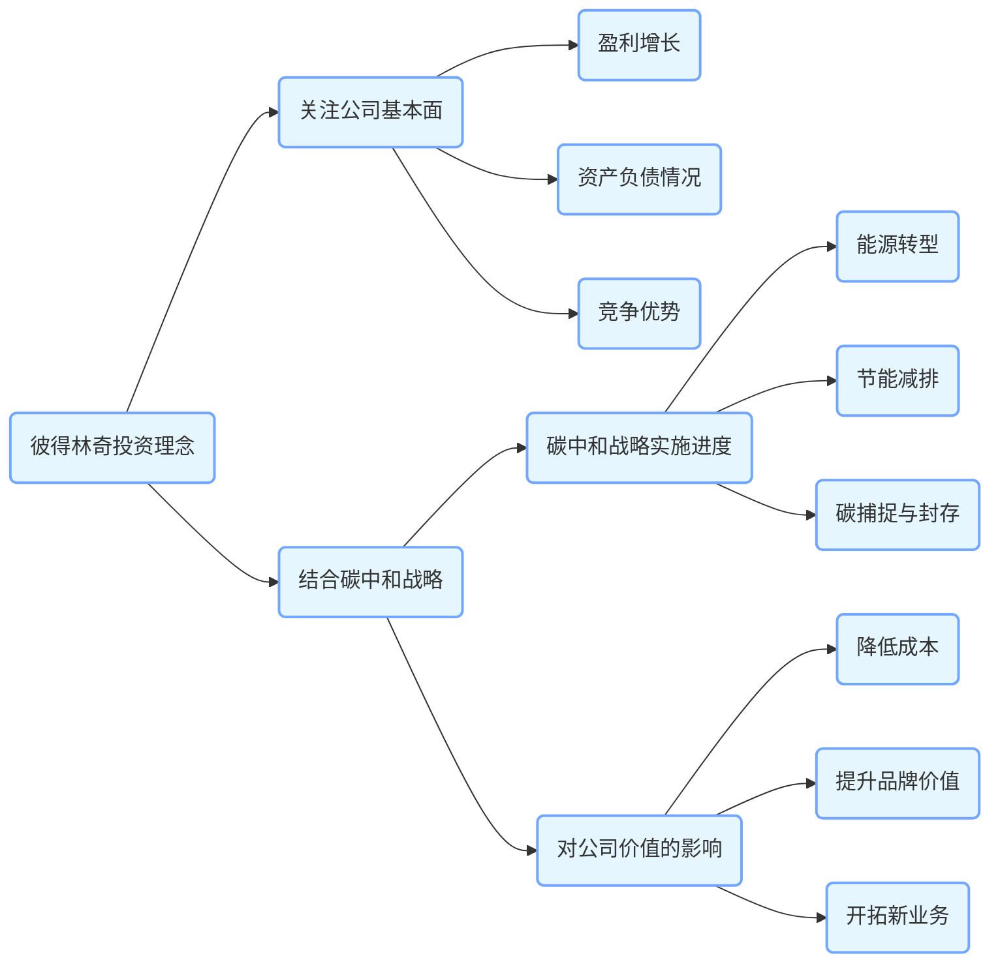

# 彼得林奇如何看待公司的碳中和战略实施进度

> 关键词：彼得林奇、碳中和战略、公司评估、投资分析、可持续发展

> 摘要：本文聚焦于探讨彼得林奇这位投资大师对公司碳中和战略实施进度的看法。首先介绍了彼得林奇的投资理念背景以及碳中和战略在当今商业环境中的重要性。接着深入分析核心概念，阐述碳中和战略与公司价值的联系。详细讲解评估公司碳中和战略实施进度的核心算法原理和具体操作步骤，同时给出相关数学模型和公式。通过项目实战案例展示如何运用这些方法进行实际分析。探讨了公司碳中和战略实施进度在不同领域的实际应用场景。推荐了一系列有助于学习和实践的工具和资源。最后总结未来公司碳中和战略实施的发展趋势与挑战，并对常见问题进行解答，提供扩展阅读和参考资料，旨在为投资者和企业管理者提供全面的视角和深入的思考。

## 1. 背景介绍 
### 1.1 目的和范围
彼得林奇作为投资界的传奇人物，以其独特且成功的投资策略闻名于世。在当今全球气候变化的大背景下，碳中和已成为众多公司战略布局的重要组成部分。本文章旨在深入探讨彼得林奇可能会如何看待公司的碳中和战略实施进度，以及这种实施进度对公司投资价值的影响。范围涵盖了不同行业的各类公司，分析其碳中和战略的制定、执行和效果评估等方面。

### 1.2 预期读者
本文预期读者包括投资者，他们希望从彼得林奇的投资视角出发，评估公司的碳中和战略对投资决策的影响；企业管理者，他们可以借鉴相关思路来优化公司的碳中和战略实施；以及对可持续发展和投资领域感兴趣的研究人员和爱好者。

### 1.3 文档结构概述
本文首先介绍核心概念，阐述碳中和战略与公司价值的联系；接着讲解评估公司碳中和战略实施进度的核心算法原理和具体操作步骤；给出相关数学模型和公式并举例说明；通过项目实战展示实际应用；探讨实际应用场景；推荐学习和开发所需的工具和资源；最后总结未来发展趋势与挑战，解答常见问题并提供扩展阅读和参考资料。

### 1.4 术语表
#### 1.4.1 核心术语定义
- **彼得林奇投资理念**：强调从日常生活中发现投资机会，注重公司的基本面分析，如盈利增长、资产负债情况等，同时关注公司的独特竞争优势。
- **碳中和战略**：公司为实现碳排放与碳吸收达到平衡的目标而制定的一系列行动计划，包括能源转型、节能减排、碳捕捉与封存等措施。
- **碳中和战略实施进度**：指公司在执行碳中和战略过程中所达到的阶段和完成的任务比例，通常通过量化指标和定性评估来衡量。

#### 1.4.2 相关概念解释
- **碳排放**：指人类活动（如能源生产、工业制造、交通运输等）向大气中排放的二氧化碳等温室气体的量。
- **碳足迹**：衡量个人、组织或产品在其整个生命周期内直接或间接产生的温室气体排放量。
- **可持续发展**：满足当代人的需求，又不损害后代人满足其需求的能力的发展模式，碳中和是可持续发展的重要组成部分。

#### 1.4.3 缩略词列表
- **ESG**：环境（Environmental）、社会（Social）和治理（Governance）的缩写，是衡量公司可持续发展表现的重要指标体系。
- **GHG**：温室气体（Greenhouse Gas）的缩写，主要包括二氧化碳、甲烷、氧化亚氮等。

## 2. 核心概念与联系 

### 核心概念原理
彼得林奇的投资理念强调关注公司的实际业务和基本面。在碳中和背景下，公司的碳中和战略实施进度反映了其对环境变化的适应能力和可持续发展的潜力。一个积极推进碳中和战略的公司，可能在未来的市场竞争中更具优势，因为它能够更好地应对政策法规的变化，降低环境风险，同时还可能开拓新的业务领域，如可再生能源、绿色技术等。

从公司价值的角度来看，碳中和战略实施进度与公司的长期盈利能力和市场竞争力密切相关。一方面，有效的碳中和措施可以降低公司的能源成本，提高资源利用效率，从而增加利润；另一方面，良好的环境形象可以提升公司的品牌价值，吸引更多的客户和投资者。

### 架构的文本示意图
```plaintext
彼得林奇投资理念
|
|-- 关注公司基本面
|   |
|   |-- 盈利增长
|   |-- 资产负债情况
|   |-- 竞争优势
|
|-- 结合碳中和战略
    |
    |-- 碳中和战略实施进度
    |   |
    |   |-- 能源转型
    |   |-- 节能减排
    |   |-- 碳捕捉与封存
    |
    |-- 对公司价值的影响
        |
        |-- 降低成本
        |-- 提升品牌价值
        |-- 开拓新业务
```

### Mermaid 流程图


## 3. 核心算法原理 & 具体操作步骤 

### 核心算法原理
为了评估公司的碳中和战略实施进度，我们可以采用综合评分法。该方法将碳中和战略的各个方面进行量化评估，然后根据权重计算出综合得分。具体来说，我们可以从以下几个维度进行评估：
1. **目标设定**：评估公司是否制定了明确的碳中和目标，以及目标的合理性和挑战性。
2. **行动计划**：考察公司为实现碳中和目标所制定的具体行动计划，包括能源转型、节能减排、碳捕捉与封存等措施的详细程度和可行性。
3. **执行情况**：跟踪公司在执行碳中和战略过程中的实际进展，如能源结构调整的比例、碳排放减少的量等。
4. **风险管理**：评估公司对碳中和战略实施过程中可能遇到的风险的识别和应对能力。

### 具体操作步骤
以下是使用 Python 实现综合评分法的示例代码：
```python
# 定义各个维度的权重
weights = {
    '目标设定': 0.2,
    '行动计划': 0.3,
    '执行情况': 0.4,
    '风险管理': 0.1
}

# 定义评估函数
def evaluate_carbon_neutral_strategy(company_data):
    total_score = 0
    for dimension, score in company_data.items():
        if dimension in weights:
            total_score += score * weights[dimension]
    return total_score

# 示例公司数据
company_data = {
    '目标设定': 80,
    '行动计划': 70,
    '执行情况': 60,
    '风险管理': 75
}

# 计算综合得分
score = evaluate_carbon_neutral_strategy(company_data)
print(f"该公司的碳中和战略实施进度综合得分为: {score}")
```
### 代码解释
1. **权重定义**：通过字典 `weights` 定义了各个评估维度的权重，权重的总和为 1。
2. **评估函数**：`evaluate_carbon_neutral_strategy` 函数接受一个字典 `company_data` 作为输入，该字典包含了公司在各个评估维度上的得分。函数根据权重计算综合得分。
3. **示例数据**：定义了一个示例公司的数据，包含了在各个评估维度上的得分。
4. **计算得分**：调用 `evaluate_carbon_neutral_strategy` 函数计算综合得分，并将结果打印输出。

## 4. 数学模型和公式 & 详细讲解 & 举例说明 

### 数学模型和公式
综合评分法的数学模型可以表示为：
$$S = \sum_{i=1}^{n} w_i \times s_i$$
其中，$S$ 表示综合得分，$w_i$ 表示第 $i$ 个评估维度的权重，$s_i$ 表示第 $i$ 个评估维度的得分，$n$ 表示评估维度的数量。

### 详细讲解
该公式的核心思想是将各个评估维度的得分乘以相应的权重，然后求和得到综合得分。权重的大小反映了各个评估维度在整体评估中的重要程度。例如，在上述代码中，“执行情况”的权重为 0.4，说明该维度在评估公司的碳中和战略实施进度中更为重要。

### 举例说明
假设我们有三家公司 A、B、C，它们在各个评估维度上的得分如下表所示：

| 公司 | 目标设定 | 行动计划 | 执行情况 | 风险管理 |
|------|----------|----------|----------|----------|
| A    | 80       | 70       | 60       | 75       |
| B    | 70       | 80       | 70       | 65       |
| C    | 90       | 60       | 80       | 70       |

根据上述公式和权重，我们可以计算出三家公司的综合得分：

- 公司 A 的综合得分：
$$S_A = 0.2 \times 80 + 0.3 \times 70 + 0.4 \times 60 + 0.1 \times 75 = 68.5$$

- 公司 B 的综合得分：
$$S_B = 0.2 \times 70 + 0.3 \times 80 + 0.4 \times 70 + 0.1 \times 65 = 72.5$$

- 公司 C 的综合得分：
$$S_C = 0.2 \times 90 + 0.3 \times 60 + 0.4 \times 80 + 0.1 \times 70 = 75$$

从计算结果可以看出，公司 C 的综合得分最高，说明其碳中和战略实施进度相对较好；公司 A 的综合得分最低，其碳中和战略实施进度可能需要进一步改进。

## 5. 项目实战：代码实际案例和详细解释说明 

### 5.1  开发环境搭建
为了运行上述代码，我们需要搭建一个 Python 开发环境。以下是具体步骤：
1. **安装 Python**：从 Python 官方网站（https://www.python.org/downloads/）下载并安装 Python 3.x 版本。
2. **安装开发工具**：可以选择使用 Visual Studio Code、PyCharm 等集成开发环境（IDE），也可以使用 Jupyter Notebook 进行交互式开发。
3. **创建虚拟环境**：为了避免不同项目之间的依赖冲突，建议使用虚拟环境。在命令行中执行以下命令创建并激活虚拟环境：
```bash
# 创建虚拟环境
python -m venv myenv

# 激活虚拟环境（Windows）
myenv\Scripts\activate

# 激活虚拟环境（Linux/Mac）
source myenv/bin/activate
```

### 5.2  源代码详细实现和代码解读
以下是一个完整的 Python 代码示例，用于评估多家公司的碳中和战略实施进度：
```python
# 定义各个维度的权重
weights = {
    '目标设定': 0.2,
    '行动计划': 0.3,
    '执行情况': 0.4,
    '风险管理': 0.1
}

# 定义评估函数
def evaluate_carbon_neutral_strategy(company_data):
    total_score = 0
    for dimension, score in company_data.items():
        if dimension in weights:
            total_score += score * weights[dimension]
    return total_score

# 定义多家公司的数据
companies = {
    '公司A': {
        '目标设定': 80,
        '行动计划': 70,
        '执行情况': 60,
        '风险管理': 75
    },
    '公司B': {
        '目标设定': 70,
        '行动计划': 80,
        '执行情况': 70,
        '风险管理': 65
    },
    '公司C': {
        '目标设定': 90,
        '行动计划': 60,
        '执行情况': 80,
        '风险管理': 70
    }
}

# 计算每家公司的综合得分
for company, data in companies.items():
    score = evaluate_carbon_neutral_strategy(data)
    print(f"{company} 的碳中和战略实施进度综合得分为: {score}")
```
### 代码解读
1. **权重定义**：与前面的示例相同，定义了各个评估维度的权重。
2. **评估函数**：`evaluate_carbon_neutral_strategy` 函数用于计算单个公司的综合得分。
3. **公司数据**：使用字典 `companies` 存储了多家公司在各个评估维度上的得分。
4. **计算得分**：通过遍历 `companies` 字典，调用 `evaluate_carbon_neutral_strategy` 函数计算每家公司的综合得分，并将结果打印输出。

### 5.3  代码解读与分析
通过上述代码，我们可以方便地评估多家公司的碳中和战略实施进度。代码的优点在于简单易懂，易于扩展。如果需要增加或修改评估维度，只需要修改 `weights` 字典和公司数据即可。同时，我们可以根据综合得分对公司进行排序，以便更直观地比较不同公司的碳中和战略实施情况。

## 6. 实际应用场景 
### 投资决策
对于投资者来说，公司的碳中和战略实施进度是一个重要的参考指标。一个积极推进碳中和战略且实施进度良好的公司，可能在未来具有更好的发展前景和投资价值。例如，在能源行业，一些公司加大对可再生能源的投资和开发，减少对传统化石能源的依赖，这些公司可能会在能源转型的过程中获得竞争优势，投资者可以通过评估公司的碳中和战略实施进度来选择更有潜力的投资标的。

### 企业战略规划
企业管理者可以通过评估自身的碳中和战略实施进度，发现存在的问题和不足，及时调整战略规划。例如，如果发现公司在能源转型方面进展缓慢，可以加大对可再生能源项目的投资；如果在节能减排方面效果不佳，可以优化生产流程，提高能源利用效率。同时，企业还可以将碳中和战略实施进度作为与竞争对手比较的重要指标，制定差异化的竞争策略。

### 政府监管和政策制定
政府部门可以通过评估企业的碳中和战略实施进度，了解企业在应对气候变化方面的表现，制定相应的监管政策和激励措施。对于碳中和战略实施进度良好的企业，可以给予税收优惠、财政补贴等奖励；对于进展缓慢的企业，可以加强监管，要求其加快实施进度。此外，政府还可以根据企业的整体情况，制定更科学合理的碳中和目标和政策。

## 7. 工具和资源推荐
### 7.1 学习资源推荐
#### 7.1.1 书籍推荐
- 《彼得林奇的成功投资》：彼得林奇的经典著作，详细介绍了他的投资理念和方法，对于理解如何从基本面分析公司具有重要的指导意义。
- 《碳中和革命：未来40年中国经济社会大变局》：深入探讨了碳中和的背景、意义和实现路径，对于了解碳中和战略在宏观层面的影响非常有帮助。
- 《可持续发展金融》：介绍了可持续发展金融的理论和实践，包括 ESG 投资、绿色金融等内容，与公司的碳中和战略密切相关。

#### 7.1.2 在线课程
- Coursera 上的 “Sustainable Investing: Transforming Finance for a Sustainable Future”：该课程由哥伦比亚大学教授授课，系统介绍了可持续投资的理论和实践，包括如何评估公司的 ESG 表现和碳中和战略。
- edX 上的 “Climate Change and Business Strategy”：课程主要探讨了气候变化对企业战略的影响，以及企业如何制定和实施应对气候变化的战略，包括碳中和战略。

#### 7.1.3 技术博客和网站
- 能源与环境领域的专业博客，如“能源评论”、“环境经济研究网”等，这些博客经常发布关于碳中和、能源转型等方面的最新研究成果和行业动态。
- 国际组织和研究机构的网站，如世界银行、国际能源署、彭博新能源财经等，这些网站提供了大量关于气候变化、能源政策和可持续发展的权威数据和报告。

### 7.2 开发工具框架推荐
#### 7.2.1 IDE和编辑器
- Visual Studio Code：一款轻量级的代码编辑器，支持多种编程语言和插件扩展，具有丰富的代码提示和调试功能，非常适合 Python 开发。
- PyCharm：专业的 Python 集成开发环境，提供了强大的代码分析、调试和版本控制等功能，适合大型 Python 项目的开发。

#### 7.2.2 调试和性能分析工具
- PDB：Python 自带的调试工具，可以帮助开发者在代码中设置断点、单步执行代码，方便排查问题。
- cProfile：Python 的性能分析工具，可以统计代码中各个函数的执行时间和调用次数，帮助开发者找出性能瓶颈。

#### 7.2.3 相关框架和库
- Pandas：用于数据处理和分析的 Python 库，提供了高效的数据结构和数据操作方法，适合处理公司的碳中和数据。
- Matplotlib：用于数据可视化的 Python 库，可以绘制各种类型的图表，如折线图、柱状图等，方便直观展示公司的碳中和战略实施进度。

### 7.3 相关论文著作推荐
#### 7.3.1 经典论文
- “The Triple Bottom Line: What Is It and How Does It Work?”：该论文提出了企业可持续发展的“三重底线”理论，即企业在追求经济利益的同时，还要考虑社会和环境效益，为评估公司的碳中和战略提供了理论基础。
- “Carbon Pricing and Competitiveness: A Review of the Empirical Evidence”：论文对碳定价政策对企业竞争力的影响进行了综述和分析，对于理解碳中和战略对企业经济绩效的影响具有重要参考价值。

#### 7.3.2 最新研究成果
- 近年来在《Nature》、《Science》等顶级学术期刊上发表的关于气候变化、碳中和技术和政策的研究论文，这些论文反映了该领域的最新研究动态和前沿成果。
- 国际知名研究机构发布的关于碳中和的研究报告，如麦肯锡、波士顿咨询集团等发布的报告，对企业的碳中和战略实施具有重要的指导意义。

#### 7.3.3 应用案例分析
- 一些知名企业的碳中和战略实施案例分析，如苹果、谷歌等公司在能源转型、节能减排等方面的实践经验，可以为其他企业提供借鉴和参考。
- 政府部门发布的关于企业碳中和示范项目的报告，介绍了一些成功的碳中和项目案例，包括项目的目标、实施过程和效果评估等内容。

## 8. 总结：未来发展趋势与挑战
### 未来发展趋势
1. **政策驱动**：随着全球各国对气候变化问题的重视程度不断提高，政府将出台更多的政策和法规来推动企业的碳中和进程。例如，设定更严格的碳排放目标、征收碳税、实施碳排放交易等，这些政策将促使企业加快碳中和战略的实施。
2. **技术创新**：碳中和技术将不断取得突破和创新，如可再生能源技术、碳捕捉与封存技术、储能技术等。这些技术的发展将降低企业实现碳中和的成本，提高碳中和的可行性和效率。
3. **市场需求**：消费者对环保产品和服务的需求将不断增加，投资者也越来越关注企业的 ESG 表现。这将促使企业将碳中和战略纳入核心业务，以满足市场需求，提升企业的竞争力。
4. **行业协同**：不同行业之间将加强协同合作，共同推进碳中和目标的实现。例如，能源行业与制造业、交通运输业等行业之间的合作，将促进能源转型和节能减排的协同发展。

### 挑战
1. **技术难题**：虽然碳中和技术不断发展，但仍面临一些技术难题，如可再生能源的间歇性、碳捕捉与封存技术的成本较高等。解决这些技术难题需要大量的研发投入和时间。
2. **经济成本**：企业实施碳中和战略需要投入大量的资金，包括设备升级、技术研发、人员培训等方面的成本。对于一些中小企业来说，可能面临较大的经济压力。
3. **数据管理**：评估公司的碳中和战略实施进度需要准确、可靠的数据支持。然而，目前企业在碳排放数据的收集、统计和管理方面还存在一些问题，数据的质量和透明度有待提高。
4. **政策不确定性**：政府的碳中和政策可能会随着政治、经济等因素的变化而调整，这给企业的战略规划和投资决策带来了一定的不确定性。

## 9. 附录：常见问题与解答
### 问题 1：如何获取公司的碳中和相关数据？
解答：可以通过以下途径获取公司的碳中和相关数据：
- 公司的年度报告和可持续发展报告：许多公司会在这些报告中披露其碳排放情况、碳中和目标和行动计划等信息。
- 政府部门和监管机构：政府部门可能会要求企业提交碳排放数据，这些数据可以通过政府网站或相关部门获取。
- 第三方数据提供商：一些专业的数据提供商收集和整理了企业的 ESG 数据，包括碳中和相关数据，可以通过付费订阅的方式获取。

### 问题 2：碳中和战略实施进度对公司的短期业绩有什么影响？
解答：碳中和战略实施进度对公司的短期业绩可能会产生一定的影响。一方面，实施碳中和战略需要投入一定的资金和资源，可能会增加公司的成本，从而对短期利润产生一定的压力。另一方面，如果公司能够通过实施碳中和战略降低能源成本、提高生产效率或开拓新的业务领域，也可能会对短期业绩产生积极的影响。总体来说，碳中和战略对公司短期业绩的影响取决于公司的具体情况和战略实施方式。

### 问题 3：如何评估公司碳中和战略的风险管理能力？
解答：可以从以下几个方面评估公司碳中和战略的风险管理能力：
- 风险识别：公司是否能够识别碳中和战略实施过程中可能遇到的风险，如政策风险、技术风险、市场风险等。
- 风险评估：公司是否对识别出的风险进行了评估，确定了风险的可能性和影响程度。
- 风险应对措施：公司是否制定了相应的风险应对措施，如风险规避、风险降低、风险转移等。
- 风险监控和预警：公司是否建立了风险监控和预警机制，及时发现和处理潜在的风险。

## 10. 扩展阅读 & 参考资料
### 扩展阅读
- 《绿色金融与可持续发展》：进一步深入探讨了绿色金融在支持企业碳中和战略方面的作用和实践。
- 《气候变化经济学》：介绍了气候变化对经济的影响以及经济手段在应对气候变化中的应用。

### 参考资料
- 《彼得林奇的成功投资》，彼得·林奇著
- 《碳中和革命：未来40年中国经济社会大变局》，何建坤等著
- 世界银行、国际能源署等发布的相关报告和数据

作者：AI天才研究院/AI Genius Institute & 禅与计算机程序设计艺术 /Zen And The Art of Computer Programming