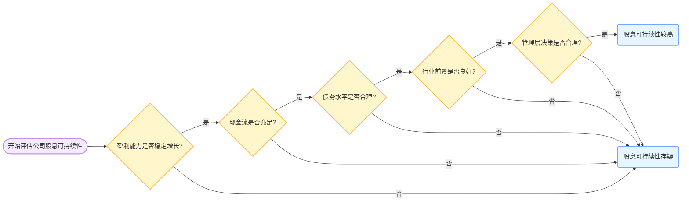

# 彼得林奇如何看待公司的股息可持续性

> 关键词：彼得林奇、股息可持续性、公司分析、财务指标、投资策略

> 摘要：本文深入探讨彼得林奇对公司股息可持续性的看法。彼得林奇作为投资界的传奇人物，其投资理念和方法备受关注。公司的股息可持续性对于投资者评估公司的价值和稳定性至关重要。文章将从彼得林奇的投资思想出发，介绍相关的背景知识，阐述核心概念，剖析其判断股息可持续性的算法原理和数学模型，通过项目实战案例进行详细说明，探讨实际应用场景，推荐相关工具和资源，最后总结未来发展趋势与挑战，并解答常见问题，为投资者更好地理解和运用彼得林奇的投资理念提供参考。

## 1. 背景介绍 
### 1.1 目的和范围
本文的目的是全面解读彼得林奇关于公司股息可持续性的观点和判断方法。范围涵盖彼得林奇投资思想中与股息可持续性相关的各个方面，包括对公司财务状况、经营模式、行业环境等因素的分析，旨在帮助投资者掌握如何运用这些方法来评估公司的股息可持续性，从而做出更明智的投资决策。

### 1.2 预期读者
预期读者主要包括对股票投资感兴趣的个人投资者、金融从业者、投资研究人员以及希望深入了解彼得林奇投资理念的人群。这些读者可能具有不同程度的投资知识和经验，本文将以通俗易懂的方式进行阐述，同时也会涉及一些专业的投资分析内容，以满足不同读者的需求。

### 1.3 文档结构概述
本文首先介绍背景信息，包括目的、读者群体和文档结构。接着阐述与股息可持续性相关的核心概念和它们之间的联系，通过文本示意图和 Mermaid 流程图进行直观展示。然后详细讲解彼得林奇判断股息可持续性的核心算法原理和具体操作步骤，结合 Python 源代码进行说明。再介绍相关的数学模型和公式，并举例说明。通过项目实战案例，包括开发环境搭建、源代码实现和代码解读，进一步加深对股息可持续性评估的理解。探讨股息可持续性在实际投资中的应用场景，推荐相关的学习资源、开发工具框架和论文著作。最后总结未来发展趋势与挑战，解答常见问题，并提供扩展阅读和参考资料。

### 1.4 术语表
#### 1.4.1 核心术语定义
- **股息**：是指股份公司从提取了公积金、公益金的税后利润中按照股息率派发给股东的收益。
- **股息可持续性**：指公司在未来一段时间内能够持续稳定地向股东支付股息的能力。
- **股息率**：是股息与股票价格之间的比率，通常以百分比表示，计算公式为：股息率 = （每股股息 / 每股股价）× 100%。
- **派息比率**：指股息占盈利的百分比，计算公式为：派息比率 = （每股股息 / 每股收益）× 100%。

#### 1.4.2 相关概念解释
- **财务健康**：指公司的财务状况良好，具有足够的现金流、合理的资产负债结构和稳定的盈利能力，能够支持公司的日常运营和未来发展。
- **行业竞争格局**：指行业内各企业之间的竞争关系和市场地位，包括市场份额、竞争策略、进入壁垒等因素。

#### 1.4.3 缩略词列表
- **EPS**：Earnings Per Share，每股收益。
- **P/E**：Price-to-Earnings Ratio，市盈率。

## 2. 核心概念与联系 

### 核心概念原理
彼得林奇认为，公司的股息可持续性与多个因素密切相关。首先是公司的盈利能力，只有具备稳定且增长的盈利，公司才有足够的资金来支付股息。其次是公司的现金流状况，充足的现金流是保证股息支付的关键，因为即使公司有盈利，但如果现金流紧张，也可能无法按时支付股息。此外，公司的债务水平、行业前景、管理层的决策等因素也会影响股息的可持续性。

### 架构的文本示意图
公司股息可持续性评估体系
|-- 盈利能力
|   |-- 净利润增长率
|   |-- 每股收益
|-- 现金流状况
|   |-- 经营活动现金流
|   |-- 自由现金流
|-- 债务水平
|   |-- 资产负债率
|   |-- 利息保障倍数
|-- 行业前景
|   |-- 市场规模增长
|   |-- 竞争格局
|-- 管理层决策
|   |-- 股息政策
|   |-- 战略规划

### Mermaid 流程图


## 3. 核心算法原理 & 具体操作步骤 

### 核心算法原理
彼得林奇判断公司股息可持续性的核心算法是综合考虑多个财务指标和非财务因素。通过对这些因素的量化分析和定性判断，评估公司在未来是否有能力持续支付股息。以下是具体的指标和分析方法：

1. **盈利能力指标**：计算净利润增长率和每股收益（EPS），评估公司的盈利增长趋势和盈利水平。
2. **现金流指标**：分析经营活动现金流和自由现金流，判断公司的现金生成能力和资金充裕程度。
3. **债务指标**：计算资产负债率和利息保障倍数，评估公司的债务负担和偿债能力。
4. **行业指标**：研究行业的市场规模增长和竞争格局，判断公司所处行业的前景。
5. **管理层决策指标**：分析公司的股息政策和战略规划，评估管理层对股息支付的重视程度和公司的发展方向。

### 具体操作步骤
1. **数据收集**：收集公司的财务报表、行业研究报告、管理层公告等相关数据。
2. **指标计算**：根据收集的数据，计算上述各项指标。
3. **指标分析**：对计算得到的指标进行分析，判断公司在各个方面的表现。
4. **综合评估**：综合考虑各个指标的分析结果，对公司的股息可持续性进行评估。

### Python 源代码实现
```python
import pandas as pd

# 定义计算指标的函数
def calculate_profitability_metrics(financial_data):
    """
    计算盈利能力指标
    :param financial_data: 包含财务数据的 DataFrame
    :return: 净利润增长率和每股收益
    """
    net_income = financial_data['Net Income']
    net_income_growth_rate = (net_income.iloc[-1] - net_income.iloc[-2]) / net_income.iloc[-2]
    eps = financial_data['EPS'].iloc[-1]
    return net_income_growth_rate, eps

def calculate_cash_flow_metrics(financial_data):
    """
    计算现金流指标
    :param financial_data: 包含财务数据的 DataFrame
    :return: 经营活动现金流和自由现金流
    """
    operating_cash_flow = financial_data['Operating Cash Flow'].iloc[-1]
    free_cash_flow = financial_data['Free Cash Flow'].iloc[-1]
    return operating_cash_flow, free_cash_flow

def calculate_debt_metrics(financial_data):
    """
    计算债务指标
    :param financial_data: 包含财务数据的 DataFrame
    :return: 资产负债率和利息保障倍数
    """
    total_assets = financial_data['Total Assets'].iloc[-1]
    total_liabilities = financial_data['Total Liabilities'].iloc[-1]
    interest_expense = financial_data['Interest Expense'].iloc[-1]
    ebit = financial_data['EBIT'].iloc[-1]
    debt_ratio = total_liabilities / total_assets
    interest_coverage_ratio = ebit / interest_expense
    return debt_ratio, interest_coverage_ratio

# 示例数据
financial_data = pd.DataFrame({
    'Net Income': [100, 120, 150],
    'EPS': [2, 2.2, 2.5],
    'Operating Cash Flow': [80, 90, 100],
    'Free Cash Flow': [60, 70, 80],
    'Total Assets': [500, 550, 600],
    'Total Liabilities': [200, 220, 240],
    'Interest Expense': [10, 12, 15],
    'EBIT': [50, 60, 70]
})

# 计算指标
net_income_growth_rate, eps = calculate_profitability_metrics(financial_data)
operating_cash_flow, free_cash_flow = calculate_cash_flow_metrics(financial_data)
debt_ratio, interest_coverage_ratio = calculate_debt_metrics(financial_data)

print(f"净利润增长率: {net_income_growth_rate}")
print(f"每股收益: {eps}")
print(f"经营活动现金流: {operating_cash_flow}")
print(f"自由现金流: {free_cash_flow}")
print(f"资产负债率: {debt_ratio}")
print(f"利息保障倍数: {interest_coverage_ratio}")
```

## 4. 数学模型和公式 & 详细讲解 & 举例说明 

### 数学模型和公式
1. **净利润增长率**：
   $$净利润增长率 = \frac{本期净利润 - 上期净利润}{上期净利润} \times 100\%$$
2. **每股收益（EPS）**：
   $$每股收益 = \frac{净利润}{发行在外普通股股数}$$
3. **资产负债率**：
   $$资产负债率 = \frac{总负债}{总资产} \times 100\%$$
4. **利息保障倍数**：
   $$利息保障倍数 = \frac{息税前利润（EBIT）}{利息费用}$$

### 详细讲解
- **净利润增长率**：反映了公司盈利的增长趋势。较高的净利润增长率表明公司的盈利能力在不断增强，有更多的资金用于股息支付。
- **每股收益（EPS）**：衡量了公司每股股票的盈利水平。每股收益越高，公司的盈利能力越强，股息支付的潜力也越大。
- **资产负债率**：反映了公司的债务负担。较低的资产负债率表明公司的财务风险较小，有更多的资金用于股息支付。
- **利息保障倍数**：衡量了公司支付利息的能力。较高的利息保障倍数表明公司有足够的利润来支付利息，债务风险较低。

### 举例说明
假设某公司的财务数据如下：
| 项目 | 金额（万元） |
| --- | --- |
| 本期净利润 | 1000 |
| 上期净利润 | 800 |
| 发行在外普通股股数 | 500 |
| 总负债 | 3000 |
| 总资产 | 5000 |
| 息税前利润（EBIT） | 500 |
| 利息费用 | 100 |

1. **净利润增长率**：
   $$净利润增长率 = \frac{1000 - 800}{800} \times 100\% = 25\%$$
2. **每股收益（EPS）**：
   $$每股收益 = \frac{1000}{500} = 2$$
3. **资产负债率**：
   $$资产负债率 = \frac{3000}{5000} \times 100\% = 60\%$$
4. **利息保障倍数**：
   $$利息保障倍数 = \frac{500}{100} = 5$$

从这些指标可以看出，该公司的净利润增长率较高，每股收益也比较可观，但资产负债率相对较高，利息保障倍数表明公司有一定的偿债能力。综合来看，该公司的股息可持续性需要进一步结合其他因素进行评估。

## 5. 项目实战：代码实际案例和详细解释说明 

### 5.1  开发环境搭建
1. **安装 Python**：从 Python 官方网站（https://www.python.org/downloads/）下载并安装 Python 3.x 版本。
2. **安装依赖库**：使用 pip 安装所需的库，如 pandas。
   ```sh
   pip install pandas
   ```

### 5.2  源代码详细实现和代码解读
```python
import pandas as pd

# 定义计算指标的函数
def calculate_profitability_metrics(financial_data):
    """
    计算盈利能力指标
    :param financial_data: 包含财务数据的 DataFrame
    :return: 净利润增长率和每股收益
    """
    net_income = financial_data['Net Income']
    net_income_growth_rate = (net_income.iloc[-1] - net_income.iloc[-2]) / net_income.iloc[-2]
    eps = financial_data['EPS'].iloc[-1]
    return net_income_growth_rate, eps

def calculate_cash_flow_metrics(financial_data):
    """
    计算现金流指标
    :param financial_data: 包含财务数据的 DataFrame
    :return: 经营活动现金流和自由现金流
    """
    operating_cash_flow = financial_data['Operating Cash Flow'].iloc[-1]
    free_cash_flow = financial_data['Free Cash Flow'].iloc[-1]
    return operating_cash_flow, free_cash_flow

def calculate_debt_metrics(financial_data):
    """
    计算债务指标
    :param financial_data: 包含财务数据的 DataFrame
    :return: 资产负债率和利息保障倍数
    """
    total_assets = financial_data['Total Assets'].iloc[-1]
    total_liabilities = financial_data['Total Liabilities'].iloc[-1]
    interest_expense = financial_data['Interest Expense'].iloc[-1]
    ebit = financial_data['EBIT'].iloc[-1]
    debt_ratio = total_liabilities / total_assets
    interest_coverage_ratio = ebit / interest_expense
    return debt_ratio, interest_coverage_ratio

# 示例数据
financial_data = pd.DataFrame({
    'Net Income': [100, 120, 150],
    'EPS': [2, 2.2, 2.5],
    'Operating Cash Flow': [80, 90, 100],
    'Free Cash Flow': [60, 70, 80],
    'Total Assets': [500, 550, 600],
    'Total Liabilities': [200, 220, 240],
    'Interest Expense': [10, 12, 15],
    'EBIT': [50, 60, 70]
})

# 计算指标
net_income_growth_rate, eps = calculate_profitability_metrics(financial_data)
operating_cash_flow, free_cash_flow = calculate_cash_flow_metrics(financial_data)
debt_ratio, interest_coverage_ratio = calculate_debt_metrics(financial_data)

print(f"净利润增长率: {net_income_growth_rate}")
print(f"每股收益: {eps}")
print(f"经营活动现金流: {operating_cash_flow}")
print(f"自由现金流: {free_cash_flow}")
print(f"资产负债率: {debt_ratio}")
print(f"利息保障倍数: {interest_coverage_ratio}")
```

### 代码解读与分析
1. **导入库**：导入 pandas 库，用于数据处理和分析。
2. **定义计算指标的函数**：
   - `calculate_profitability_metrics`：计算净利润增长率和每股收益。
   - `calculate_cash_flow_metrics`：计算经营活动现金流和自由现金流。
   - `calculate_debt_metrics`：计算资产负债率和利息保障倍数。
3. **示例数据**：创建一个包含财务数据的 DataFrame。
4. **计算指标**：调用定义的函数计算各项指标，并打印结果。

通过这个代码示例，我们可以看到如何使用 Python 计算评估公司股息可持续性所需的关键指标。

## 6. 实际应用场景 
### 个人投资者
个人投资者在选择股票时，可以运用彼得林奇的方法评估公司的股息可持续性。对于追求稳定收益的投资者来说，股息可持续性是一个重要的考虑因素。通过分析公司的财务指标和行业前景，投资者可以筛选出具有较高股息可持续性的股票，构建自己的投资组合。

### 机构投资者
机构投资者如基金公司、保险公司等，在进行投资决策时也会关注公司的股息可持续性。他们通常会对大量的公司进行研究和分析，运用专业的投资模型和工具，结合彼得林奇的投资理念，评估公司的投资价值和风险。对于一些注重股息收益的机构投资者来说，股息可持续性是评估投资标的的重要标准之一。

### 公司管理层
公司管理层在制定股息政策时，也需要考虑