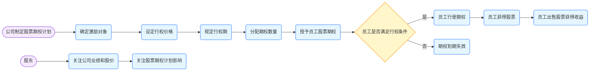

# 彼得林奇如何看待公司的股票期权计划

> 关键词：彼得林奇、股票期权计划、公司评估、股票投资、激励机制

> 摘要：本文深入探讨了投资大师彼得林奇对公司股票期权计划的看法。通过分析彼得林奇的投资理念，阐述股票期权计划作为一种激励机制在公司中的作用和影响。文章从背景介绍入手，详细解释相关核心概念，分析股票期权计划的算法原理和数学模型，结合项目实战案例进行解读，探讨其实际应用场景，推荐学习资源和开发工具，最后总结未来发展趋势与挑战，旨在帮助投资者更好地理解股票期权计划对公司和股票投资的意义。

## 1. 背景介绍 
### 1.1 目的和范围
本文的目的是全面解析彼得林奇对公司股票期权计划的观点和看法。彼得林奇作为投资界的传奇人物，其投资理念和方法对广大投资者有着深远的影响。股票期权计划作为公司激励员工的重要手段，对公司的发展和股票价值有着重要的影响。通过研究彼得林奇对股票期权计划的看法，投资者可以更好地评估公司的投资价值，做出更明智的投资决策。本文的范围涵盖了股票期权计划的基本概念、原理、实际应用以及彼得林奇在评估公司时如何考虑股票期权计划等方面。

### 1.2 预期读者
本文预期读者主要包括对股票投资感兴趣的个人投资者、金融从业者、研究投资理论和实践的学者以及关注公司治理和激励机制的专业人士。无论是新手投资者希望学习投资知识，还是经验丰富的投资者寻求新的投资视角，本文都将提供有价值的信息和分析。

### 1.3 文档结构概述
本文将按照以下结构进行阐述：首先介绍相关背景知识，包括目的、预期读者和文档结构；接着解释股票期权计划的核心概念及其与公司和投资者的联系；然后详细讲解股票期权计划的核心算法原理和具体操作步骤，并给出Python源代码示例；再介绍相关的数学模型和公式，并通过举例进行说明；之后通过项目实战案例展示股票期权计划在实际中的应用和影响；探讨股票期权计划的实际应用场景；推荐相关的学习资源、开发工具和论文著作；最后总结未来发展趋势与挑战，并提供常见问题解答和扩展阅读参考资料。

### 1.4 术语表
#### 1.4.1 核心术语定义
- **股票期权计划**：公司给予员工在未来一定期限内以预先确定的价格和条件购买本公司一定数量股票的权利。这种权利可以激励员工为公司的长期发展努力工作，因为员工可以从公司股票价格的上涨中获得收益。
- **行权价格**：员工在行使股票期权时需要支付的购买股票的价格。行权价格通常在授予股票期权时确定，一般会高于或等于授予时的股票市场价格。
- **行权期**：员工可以行使股票期权的时间段。行权期通常有一定的限制，例如在授予后的一定年限内开始，持续若干年。
- **激励对象**：公司股票期权计划所针对的员工群体，通常包括公司的管理层、核心技术人员和关键岗位员工等。

#### 1.4.2 相关概念解释
- **稀释效应**：当公司员工行使股票期权时，公司需要增发新股，从而导致公司总股本增加。在公司净利润不变的情况下，每股收益会相应下降，这种现象称为稀释效应。稀释效应会对公司的股票价格产生一定的影响。
- **股东价值**：股东在公司中所拥有的权益价值，通常通过公司的股票价格和股息分配来体现。股票期权计划的设计和实施应该以提高股东价值为目标。
- **公司治理**：公司的管理和决策机制，包括董事会的组成、管理层的激励和监督等方面。股票期权计划是公司治理的重要组成部分，它可以影响公司的决策和运营。

#### 1.4.3 缩略词列表
- **ESOP**：Employee Stock Ownership Plan，员工持股计划，是一种让员工持有公司股票的计划，与股票期权计划有一定的相似性，但也存在一些区别。
- **EPS**：Earnings Per Share，每股收益，是指公司净利润除以总股本所得到的每股盈利指标，是衡量公司盈利能力的重要指标之一。

## 2. 核心概念与联系 
### 核心概念原理
股票期权计划的核心原理是通过给予员工在未来购买公司股票的权利，将员工的利益与公司的利益紧密联系在一起。当公司的业绩良好，股票价格上涨时，员工可以通过行使股票期权以较低的行权价格购买股票，然后在市场上以较高的价格出售，从而获得收益。这种激励机制可以激发员工的工作积极性和创造力，促使他们为公司的长期发展努力工作。

### 架构的文本示意图
```plaintext
公司
|
|-- 股票期权计划
|   |-- 激励对象确定
|   |-- 行权价格设定
|   |-- 行权期规定
|   |-- 期权数量分配
|
|-- 员工
|   |-- 获得股票期权
|   |-- 满足条件行使期权
|   |-- 获得股票收益
|
|-- 股东
|   |-- 关注公司业绩和股票价格
|   |-- 关注股票期权计划对股东价值的影响
```

### Mermaid 流程图


## 3. 核心算法原理 & 具体操作步骤 
### 核心算法原理
股票期权计划的核心算法主要涉及到期权价值的计算和稀释效应的评估。常见的期权定价模型有布莱克 - 斯科尔斯模型（Black - Scholes Model），该模型用于计算欧式期权的理论价值。其公式为：

$C = S \times N(d_1) - K \times e^{-rT} \times N(d_2)$

其中：
- $C$ 是期权的价值（看涨期权）
- $S$ 是标的股票的当前价格
- $K$ 是行权价格
- $r$ 是无风险利率
- $T$ 是期权到期时间（以年为单位）
- $N(d)$ 是标准正态分布的累积分布函数
- $d_1 = \frac{\ln(\frac{S}{K}) + (r + \frac{\sigma^2}{2})T}{\sigma \sqrt{T}}$
- $d_2 = d_1 - \sigma \sqrt{T}$
- $\sigma$ 是标的股票的波动率

### Python 代码实现布莱克 - 斯科尔斯模型
```python
import numpy as np
from scipy.stats import norm

def black_scholes_call(S, K, r, T, sigma):
    """
    计算欧式看涨期权的价值
    :param S: 标的股票的当前价格
    :param K: 行权价格
    :param r: 无风险利率
    :param T: 期权到期时间（以年为单位）
    :param sigma: 标的股票的波动率
    :return: 期权的价值
    """
    d1 = (np.log(S / K) + (r + 0.5 * sigma ** 2) * T) / (sigma * np.sqrt(T))
    d2 = d1 - sigma * np.sqrt(T)
    call_value = S * norm.cdf(d1) - K * np.exp(-r * T) * norm.cdf(d2)
    return call_value

# 示例参数
S = 100  # 标的股票的当前价格
K = 110  # 行权价格
r = 0.05  # 无风险利率
T = 1  # 期权到期时间（以年为单位）
sigma = 0.2  # 标的股票的波动率

call_value = black_scholes_call(S, K, r, T, sigma)
print(f"欧式看涨期权的价值: {call_value}")
```

### 具体操作步骤
1. **制定计划**：公司的董事会或管理层根据公司的战略目标和发展需求，制定股票期权计划。确定激励对象、行权价格、行权期、期权数量等关键要素。
2. **授予期权**：按照计划向符合条件的员工授予股票期权。通常会签订期权授予协议，明确双方的权利和义务。
3. **等待行权期**：员工在授予期权后，需要等待一段时间（行权期）才能行使期权。在行权期内，员工需要满足一定的条件，如达到业绩目标、在职等。
4. **行使期权**：当员工满足行权条件后，可以选择在规定的时间内行使期权。员工需要支付行权价格购买公司股票。
5. **出售股票**：员工获得股票后，可以选择继续持有或在市场上出售股票，以获得收益。

## 4. 数学模型和公式 & 详细讲解 & 举例说明 
### 布莱克 - 斯科尔斯模型详细讲解
布莱克 - 斯科尔斯模型是一种基于无套利原理的期权定价模型。该模型假设市场是有效的，不存在套利机会，标的股票的价格遵循几何布朗运动。模型中的各个参数具有重要的经济意义：
- $S$：标的股票的当前价格，反映了市场对公司当前价值的评估。
- $K$：行权价格，是员工行使期权时需要支付的价格，它决定了期权的内在价值。
- $r$：无风险利率，通常用国债利率来近似表示，反映了资金的时间价值。
- $T$：期权到期时间，时间越长，期权的价值越高，因为有更多的时间让股票价格上涨。
- $\sigma$：标的股票的波动率，反映了股票价格的波动程度。波动率越高，期权的价值越高，因为股票价格有更大的可能性上涨到行权价格以上。

### 稀释效应的数学模型
稀释效应可以通过计算稀释后的每股收益（Diluted EPS）来衡量。假设公司在没有股票期权计划时的净利润为 $E$，总股本为 $N$，则基本每股收益（Basic EPS）为：

$EPS_{basic} = \frac{E}{N}$

当公司存在股票期权计划时，假设行权的期权数量为 $n$，则稀释后的总股本为 $N + n$，稀释后的每股收益为：

$EPS_{diluted} = \frac{E}{N + n}$

### 举例说明
假设一家公司的净利润为 $1000$ 万元，总股本为 $1000$ 万股，则基本每股收益为：

$EPS_{basic} = \frac{1000}{1000} = 1$（元/股）

公司实施了股票期权计划，行权的期权数量为 $100$ 万股，则稀释后的总股本为 $1000 + 100 = 1100$ 万股，稀释后的每股收益为：

$EPS_{diluted} = \frac{1000}{1100} \approx 0.91$（元/股）

可以看到，由于股票期权计划的实施，每股收益从 $1$ 元/股下降到了 $0.91$ 元/股，产生了稀释效应。

## 5. 项目实战：代码实际案例和详细解释说明 
### 5.1  开发环境搭建
为了实现股票期权计划的相关计算和分析，我们可以使用 Python 编程语言。以下是搭建开发环境的步骤：
1. **安装 Python**：从 Python 官方网站（https://www.python.org/downloads/）下载并安装适合你操作系统的 Python 版本。建议安装 Python 3.7 及以上版本。
2. **安装必要的库**：使用 pip 命令安装所需的库，包括 numpy、scipy 等。打开命令行工具，执行以下命令：
```sh
pip install numpy scipy
```
3. **选择开发工具**：可以选择使用 PyCharm、Jupyter Notebook 等开发工具。PyCharm 是一款功能强大的 Python 集成开发环境，适合开发大型项目；Jupyter Notebook 则更适合进行交互式数据分析和代码演示。

### 5.2  源代码详细实现和代码解读
以下是一个完整的 Python 代码示例，用于计算股票期权的价值和稀释效应：

```python
import numpy as np
from scipy.stats import norm

def black_scholes_call(S, K, r, T, sigma):
    """
    计算欧式看涨期权的价值
    :param S: 标的股票的当前价格
    :param K: 行权价格
    :param r: 无风险利率
    :param T: 期权到期时间（以年为单位）
    :param sigma: 标的股票的波动率
    :return: 期权的价值
    """
    d1 = (np.log(S / K) + (r + 0.5 * sigma ** 2) * T) / (sigma * np.sqrt(T))
    d2 = d1 - sigma * np.sqrt(T)
    call_value = S * norm.cdf(d1) - K * np.exp(-r * T) * norm.cdf(d2)
    return call_value

def calculate_diluted_eps(net_income, total_shares, exercised_options):
    """
    计算稀释后的每股收益
    :param net_income: 公司的净利润
    :param total_shares: 公司的总股本
    :param exercised_options: 行权的期权数量
    :return: 稀释后的每股收益
    """
    diluted_shares = total_shares + exercised_options
    diluted_eps = net_income / diluted_shares
    return diluted_eps

# 示例参数
S = 100  # 标的股票的当前价格
K = 110  # 行权价格
r = 0.05  # 无风险利率
T = 1  # 期权到期时间（以年为单位）
sigma = 0.2  # 标的股票的波动率
net_income = 10000000  # 公司的净利润
total_shares = 10000000  # 公司的总股本
exercised_options = 1000000  # 行权的期权数量

# 计算期权价值
call_value = black_scholes_call(S, K, r, T, sigma)
print(f"欧式看涨期权的价值: {call_value}")

# 计算稀释后的每股收益
diluted_eps = calculate_diluted_eps(net_income, total_shares, exercised_options)
print(f"稀释后的每股收益: {diluted_eps}")
```

### 代码解读与分析
1. **black_scholes_call 函数**：该函数实现了布莱克 - 斯科尔斯模型，用于计算欧式看涨期权的价值。函数接受标的股票的当前价格、行权价格、无风险利率、期权到期时间和标的股票的波动率作为输入参数，返回期权的价值。
2. **calculate_diluted_eps 函数**：该函数用于计算稀释后的每股收益。函数接受公司的净利润、总股本和行权的期权数量作为输入参数，返回稀释后的每股收益。
3. **主程序**：设置示例参数，调用 `black_scholes_call` 函数计算期权价值，调用 `calculate_diluted_eps` 函数计算稀释后的每股收益，并将结果打印输出。

通过这个代码示例，我们可以看到如何使用 Python 计算股票期权的价值和稀释效应，帮助投资者更好地评估公司股票期权计划对公司业绩和股票价值的影响。

## 6. 实际应用场景 
### 激励员工
股票期权计划是公司激励员工的重要手段之一。通过给予员工股票期权，公司可以将员工的利益与公司的利益紧密联系在一起，激发员工的工作积极性和创造力。员工为了获得更多的收益，会努力工作，提高公司的业绩，从而推动公司股票价格的上涨。

### 吸引和留住人才
在竞争激烈的人才市场中，股票期权计划可以作为一种有吸引力的福利，帮助公司吸引和留住优秀的人才。特别是对于高科技企业和创新型企业，股票期权计划可以为员工提供分享公司成长和发展成果的机会，增强员工的归属感和忠诚度。

### 优化公司治理
股票期权计划可以影响公司的治理结构和决策机制。通过让员工持有公司股票，员工可以参与公司的决策和监督，提高公司的治理效率。同时，股票期权计划也可以激励管理层更加注重公司的长期发展，避免短期行为。

### 投资者评估公司价值
对于投资者来说，股票期权计划是评估公司价值的重要因素之一。投资者需要关注股票期权计划的设计和实施情况，包括激励对象、行权价格、行权期、期权数量等，以及股票期权计划对公司业绩和股东价值的影响。合理的股票期权计划可以提高公司的竞争力和盈利能力，增加公司的投资价值；而不合理的股票期权计划则可能导致股东利益受损。

## 7. 工具和资源推荐
### 7.1 学习资源推荐
#### 7.1.1 书籍推荐
- 《彼得林奇的成功投资》（*One Up On Wall Street*）：彼得林奇的经典著作，介绍了他的投资理念和方法，包括如何评估公司的基本面和投资价值。
- 《期权、期货及其他衍生品》（*Options, Futures, and Other Derivatives*）：约翰·赫尔（John C. Hull）的著作，是期权定价和衍生品市场的权威教材，详细介绍了布莱克 - 斯科尔斯模型等期权定价理论。
- 《公司金融》（*Corporate Finance*）：斯蒂芬·罗斯（Stephen A. Ross）等著，涵盖了公司金融的各个方面，包括股票期权计划等激励机制的设计和分析。

#### 7.1.2 在线课程
- Coursera 上的“投资学原理”（*Principles of Investments*）课程：由知名大学教授授课，介绍了投资学的基本原理和方法，包括股票投资、期权定价等内容。
- edX 上的“金融工程与风险管理”（*Financial Engineering and Risk Management*）课程：深入讲解了金融工程的理论和实践，包括期权定价模型的应用和风险管理。

#### 7.1.3 技术博客和网站
- Seeking Alpha（https://seekingalpha.com/）：提供股票市场分析、公司研究报告和投资策略等内容，有很多关于股票期权计划和公司治理的文章。
- Investopedia（https://www.investopedia.com/）：一个专业的金融知识学习网站，提供股票、期权、期货等金融产品的详细解释和案例分析。

### 7.2 开发工具框架推荐
#### 7.2.1 IDE和编辑器
- PyCharm：功能强大的 Python 集成开发环境，提供代码编辑、调试、版本控制等功能，适合开发大型 Python 项目。
- Jupyter Notebook：交互式的开发环境，支持代码、文本、图表等多种格式的展示，适合进行数据分析和代码演示。

#### 7.2.2 调试和性能分析工具
- Py-Spy：一个轻量级的 Python 性能分析工具，可以实时监控 Python 程序的运行状态和性能瓶颈。
- PDB：Python 自带的调试工具，可以帮助开发者定位和解决代码中的问题。

#### 7.2.3 相关框架和库
- Numpy：Python 的数值计算库，提供了高效的数组操作和数学函数，是进行期权定价和稀释效应计算的基础库。
- Scipy：基于 Numpy 的科学计算库，提供了更多的数学和统计函数，包括正态分布函数等，用于期权定价模型的实现。

### 7.3 相关论文著作推荐
#### 7.3.1 经典论文
- Fischer Black 和 Myron Scholes 的论文“期权定价与公司债务”（*The Pricing of Options and Corporate Liabilities*）：提出了布莱克 - 斯科尔斯期权定价模型，是期权定价理论的经典之作。
- Michael Jensen 和 William Meckling 的论文“企业理论：管理行为、代理成本与所有权结构”（*Theory of the Firm: Managerial Behavior, Agency Costs and Ownership Structure*）：探讨了公司治理中的代理问题和激励机制，对股票期权计划的设计有重要的启示。

#### 7.3.2 最新研究成果
- 关注顶尖金融学术期刊，如《金融经济学杂志》（*Journal of Financial Economics*）、《金融研究评论》（*Review of Financial Studies*）等，这些期刊会发表关于股票期权计划、公司治理和投资策略的最新研究成果。

#### 7.3.3 应用案例分析
- 可以参考一些知名公司的年报和公告，了解它们的股票期权计划的实施情况和效果。例如，苹果公司、谷歌公司等科技巨头的股票期权计划经常被作为案例进行分析。

## 8. 总结：未来发展趋势与挑战
### 未来发展趋势
- **更加注重长期激励**：未来的股票期权计划可能会更加注重长期激励，延长行权期，设置更加严格的业绩条件，以促使员工关注公司的长期发展。
- **多元化的激励方式**：除了传统的股票期权计划，公司可能会采用更加多元化的激励方式，如限制性股票、业绩股票等，以满足不同员工的需求和激励目标。
- **与 ESG 指标挂钩**：随着社会对环境、社会和治理（ESG）问题的关注度不断提高，未来的股票期权计划可能会与 ESG 指标挂钩，激励员工推动公司在可持续发展方面取得更好的成绩。

### 挑战
- **会计处理和信息披露**：股票期权计划的会计处理和信息披露是一个复杂的问题。不同的会计准则对股票期权的处理方式不同，可能会影响公司的财务报表和投资者的判断。同时，公司需要更加透明地披露股票期权计划的相关信息，以保护股东的利益。
- **市场波动和不确定性**：股票市场的波动和不确定性会影响股票期权计划的效果。当股票价格下跌时，员工可能会放弃行使期权，导致激励机制失效。此外，宏观经济环境的变化也会对公司的业绩和股票价格产生影响，增加了股票期权计划的实施难度。
- **公平性和合规性问题**：股票期权计划的设计和实施需要考虑公平性和合规性问题。公司需要确保激励对象的选择合理，行权价格和期权数量的确定公平公正，同时遵守相关的法律法规和监管要求。

## 9. 附录：常见问题与解答
### 问题 1：股票期权计划对公司的财务报表有什么影响？
答：股票期权计划会对公司的财务报表产生多方面的影响。首先，根据会计准则，公司需要对授予员工的股票期权进行费用化处理，这会减少公司的净利润。其次，当员工行使期权时，公司需要增发新股，导致总股本增加，可能会产生稀释效应，影响每股收益。此外，股票期权计划的相关信息需要在财务报表附注中进行披露，投资者可以从中了解公司的激励机制和潜在的股权变动情况。

### 问题 2：如何判断一个股票期权计划是否合理？
答：判断一个股票期权计划是否合理需要综合考虑多个因素。首先，要关注激励对象的选择是否合理，是否涵盖了公司的核心员工和关键岗位。其次，行权价格的设定是否合理，过高的行权价格可能会导致激励效果不佳，过低的行权价格则可能会损害股东利益。此外，行权期的长短、期权数量的分配、业绩条件的设置等也都是需要考虑的因素。同时，还需要结合公司的战略目标和发展阶段，评估股票期权计划是否能够有效地激励员工，促进公司的长期发展。

### 问题 3：股票期权计划与员工持股计划有什么区别？
答：股票期权计划和员工持股计划都是公司激励员工的方式，但它们之间存在一些区别。股票期权计划是给予员工在未来一定期限内以预先确定的价格和条件购买本公司一定数量股票的权利，员工需要在行权期内行使期权才能获得股票；而员工持股计划是让员工直接持有公司的股票，员工可以通过购买、赠与等方式获得股票。此外，股票期权计划的收益主要取决于股票价格的上涨，而员工持股计划的收益除了股票价格上涨外，还可以获得股息分配。

## 10. 扩展阅读 & 参考资料
- 彼得林奇，《战胜华尔街》，机械工业出版社
- 约翰·赫尔，《期权、期货及其他衍生品（原书第10版）》，机械工业出版社
- 斯蒂芬·罗斯等，《公司金融（原书第11版）》，机械工业出版社
- 相关金融学术期刊，如《金融研究》、《证券市场导报》等
- 公司年报和公告，如苹果公司、谷歌公司等的年报和公告

作者：AI天才研究院/AI Genius Institute & 禅与计算机程序设计艺术 /Zen And The Art of Computer Programming