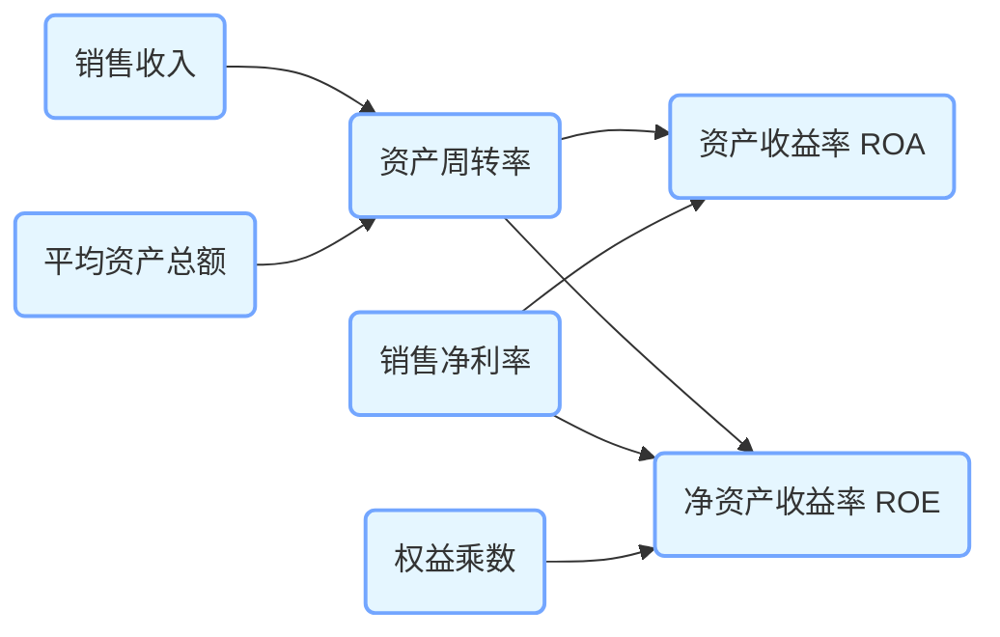

# 彼得林奇如何看待公司的资产周转率

> 关键词：彼得林奇、资产周转率、公司分析、财务指标、投资策略

> 摘要：本文深入探讨了投资大师彼得林奇对公司资产周转率的看法。从背景介绍出发，阐述了研究目的、预期读者等内容。接着详细解析了资产周转率的核心概念、与其他指标的联系，介绍了相关算法原理及操作步骤，并用数学模型和公式进行阐释。通过项目实战案例，展示了如何运用资产周转率进行公司分析。还列举了资产周转率的实际应用场景，推荐了学习该指标的工具和资源。最后总结了未来发展趋势与挑战，解答了常见问题并提供了扩展阅读资料，旨在帮助投资者更好地理解资产周转率在公司投资分析中的重要性。

## 1. 背景介绍 
### 1.1 目的和范围
本部分旨在全面剖析彼得林奇对公司资产周转率的观点。彼得林奇是投资界的传奇人物，他的投资理念和方法影响深远。资产周转率作为衡量公司运营效率的重要财务指标，对于投资者评估公司的经营状况和投资价值具有关键意义。我们将研究彼得林奇在其投资实践中如何运用资产周转率，以及该指标在他的投资决策体系中的地位和作用。研究范围涵盖彼得林奇的著作、演讲及相关投资案例，同时结合现代财务管理理论，深入探讨资产周转率与公司绩效、股票投资的关系。

### 1.2 预期读者
本文预期读者主要包括以下几类人群：
- **投资者**：无论是个人投资者还是机构投资者，都希望通过了解彼得林奇对资产周转率的看法，提升自己的投资分析能力，找到更具投资价值的公司。
- **财务分析师**：专业的财务分析师需要深入研究各项财务指标，彼得林奇对资产周转率的独特见解可以为他们的分析工作提供新的思路和方法。
- **企业管理者**：企业管理者可以从彼得林奇的观点中得到启示，优化公司的资产配置和运营管理，提高资产周转率，增强企业的竞争力。
- **金融专业学生**：对于金融专业的学生来说，学习彼得林奇的投资理念和资产周转率的分析方法，有助于加深对财务管理和投资学的理解。

### 1.3 文档结构概述
本文将按照以下结构展开：
- 核心概念与联系：介绍资产周转率的定义、计算方法以及与其他财务指标的关系，并通过示意图和流程图进行直观展示。
- 核心算法原理 & 具体操作步骤：详细讲解资产周转率的计算原理，并用 Python 代码实现计算过程。
- 数学模型和公式 & 详细讲解 & 举例说明：运用数学公式深入分析资产周转率的内涵，并通过实际案例进行说明。
- 项目实战：代码实际案例和详细解释说明：通过实际项目案例，展示如何运用资产周转率进行公司分析和投资决策。
- 实际应用场景：列举资产周转率在不同行业和投资场景中的应用。
- 工具和资源推荐：推荐学习资产周转率的相关书籍、在线课程、技术博客和开发工具。
- 总结：未来发展趋势与挑战：总结彼得林奇对资产周转率的观点，分析资产周转率在未来投资分析中的发展趋势和面临的挑战。
- 附录：常见问题与解答：解答读者在学习和应用资产周转率过程中可能遇到的常见问题。
- 扩展阅读 & 参考资料：提供进一步学习和研究的相关资料。

### 1.4 术语表
#### 1.4.1 核心术语定义
- **资产周转率**：是指企业在一定时期内销售收入与平均资产总额的比率，它反映了企业资产经营管理的效率，即企业运用全部资产以产生销售收入的能力。
- **平均资产总额**：是指企业在一定时期内资产总额的平均值，通常取期初资产总额与期末资产总额的算术平均数。
- **销售收入**：指企业在销售商品、提供劳务及让渡资产使用权等日常活动中所形成的经济利益的总流入。

#### 1.4.2 相关概念解释
- **运营效率**：企业利用各项资源进行生产经营活动的效率，资产周转率是衡量运营效率的重要指标之一。
- **投资价值**：指公司股票或其他投资标的对于投资者的潜在价值，资产周转率可以作为评估公司投资价值的一个重要参考因素。

#### 1.4.3 缩略词列表
- **ROA**：Return on Assets，资产收益率，是净利润与平均资产总额的比率，反映了企业资产的盈利能力。
- **ROE**：Return on Equity，净资产收益率，是净利润与平均净资产的比率，衡量了股东权益的收益水平。

## 2. 核心概念与联系 
### 2.1 资产周转率的定义
资产周转率（Asset Turnover Ratio）是衡量企业资产管理效率的重要财务指标，它反映了企业资产运营的能力和效率。其计算公式为：
$$资产周转率 = \frac{销售收入}{平均资产总额}$$

例如，某公司在一年内的销售收入为 1000 万元，期初资产总额为 500 万元，期末资产总额为 700 万元，则平均资产总额为 $\frac{500 + 700}{2} = 600$ 万元，该公司的资产周转率为 $\frac{1000}{600} \approx 1.67$ 次。

### 2.2 资产周转率与其他财务指标的关系
- **与资产收益率（ROA）的关系**：资产收益率是净利润与平均资产总额的比率，它反映了企业资产的盈利能力。资产周转率和销售净利率共同影响资产收益率，其关系可以用以下公式表示：
$$ROA = 销售净利率 \times 资产周转率$$
这表明，企业可以通过提高销售净利率或资产周转率来提高资产收益率。如果一家公司的资产周转率较高，但销售净利率较低，可能意味着该公司采取了薄利多销的经营策略；反之，如果资产周转率较低，但销售净利率较高，则可能是采取了高附加值的经营策略。

- **与净资产收益率（ROE）的关系**：净资产收益率是衡量股东权益收益水平的指标，它与资产周转率也存在一定的联系。根据杜邦分析体系，净资产收益率可以分解为：
$$ROE = 销售净利率 \times 资产周转率 \times 权益乘数$$
其中，权益乘数反映了企业的财务杠杆水平。这说明资产周转率不仅影响资产收益率，还通过影响净资产收益率，对股东的投资回报产生影响。

### 2.3 核心概念原理和架构的文本示意图
```plaintext
资产周转率
|
|-- 分子：销售收入
|   |-- 产品销售
|   |-- 劳务提供
|   |-- 资产让渡
|
|-- 分母：平均资产总额
|   |-- 期初资产总额
|   |-- 期末资产总额
|
|-- 影响因素
|   |-- 行业特点
|   |-- 经营策略
|   |-- 资产管理水平
|
|-- 与其他指标关系
|   |-- 资产收益率（ROA）
|   |-- 净资产收益率（ROE）
```

### 2.4 Mermaid 流程图


## 3. 核心算法原理 & 具体操作步骤 
### 3.1 算法原理
资产周转率的计算原理基于企业的销售收入和平均资产总额。销售收入反映了企业在一定时期内的经营成果，而平均资产总额则代表了企业在该时期内所拥有的资产规模。通过将销售收入除以平均资产总额，可以得到企业资产的周转速度，即资产周转率。资产周转率越高，说明企业资产运营效率越高，利用资产创造收入的能力越强；反之，资产周转率越低，则说明企业资产运营效率较低，可能存在资产闲置或浪费的情况。

### 3.2 具体操作步骤
#### 步骤 1：获取销售收入数据
销售收入数据可以从企业的利润表中获取。利润表是反映企业在一定会计期间经营成果的报表，其中包含了企业的销售收入信息。在获取销售收入数据时，需要注意数据的准确性和时效性，确保使用的是最新的财务报表数据。

#### 步骤 2：获取期初和期末资产总额数据
期初和期末资产总额数据可以从企业的资产负债表中获取。资产负债表是反映企业在某一特定日期财务状况的报表，其中包含了企业的资产总额信息。期初资产总额是指企业在会计期间开始时的资产总额，期末资产总额是指企业在会计期间结束时的资产总额。

#### 步骤 3：计算平均资产总额
平均资产总额的计算公式为：
$$平均资产总额 = \frac{期初资产总额 + 期末资产总额}{2}$$

#### 步骤 4：计算资产周转率
将获取的销售收入数据除以计算得到的平均资产总额，即可得到企业的资产周转率。计算公式为：
$$资产周转率 = \frac{销售收入}{平均资产总额}$$

### 3.3 Python 源代码实现
```python
def calculate_asset_turnover(sales_revenue, beginning_assets, ending_assets):
    """
    计算资产周转率
    :param sales_revenue: 销售收入
    :param beginning_assets: 期初资产总额
    :param ending_assets: 期末资产总额
    :return: 资产周转率
    """
    average_assets = (beginning_assets + ending_assets) / 2
    asset_turnover = sales_revenue / average_assets
    return asset_turnover

# 示例数据
sales_revenue = 1000000  # 销售收入为 100 万元
beginning_assets = 500000  # 期初资产总额为 50 万元
ending_assets = 700000  # 期末资产总额为 70 万元

# 计算资产周转率
asset_turnover = calculate_asset_turnover(sales_revenue, beginning_assets, ending_assets)
print(f"资产周转率: {asset_turnover:.2f} 次")
```

### 3.4 代码解释
- 定义了一个名为 `calculate_asset_turnover` 的函数，该函数接受三个参数：`sales_revenue`（销售收入）、`beginning_assets`（期初资产总额）和 `ending_assets`（期末资产总额）。
- 在函数内部，首先计算平均资产总额，然后将销售收入除以平均资产总额，得到资产周转率。
- 最后，使用示例数据调用该函数，并将计算结果打印输出，保留两位小数。

## 4. 数学模型和公式 & 详细讲解 & 举例说明 
### 4.1 基本公式
资产周转率的基本公式为：
$$资产周转率 = \frac{销售收入}{平均资产总额}$$
其中，销售收入是企业在一定时期内销售商品、提供劳务等所取得的收入总和，平均资产总额是企业在该时期内期初资产总额和期末资产总额的平均值。

### 4.2 公式推导
假设企业在一个会计期间内的销售收入为 $S$，期初资产总额为 $A_1$，期末资产总额为 $A_2$，则平均资产总额为 $\overline{A} = \frac{A_1 + A_2}{2}$。资产周转率 $ATR$ 可以表示为：
$$ATR = \frac{S}{\overline{A}} = \frac{S}{\frac{A_1 + A_2}{2}} = \frac{2S}{A_1 + A_2}$$

### 4.3 详细讲解
- **分子：销售收入**：销售收入是企业经营活动的直接成果，反映了企业产品或服务的市场需求和销售能力。较高的销售收入意味着企业能够有效地将产品或服务推向市场，实现盈利。
- **分母：平均资产总额**：平均资产总额代表了企业在一定时期内所拥有的资产规模。资产包括流动资产（如现金、存货、应收账款等）和非流动资产（如固定资产、无形资产等）。平均资产总额的计算考虑了期初和期末的资产状况，更能反映企业在整个会计期间的资产水平。

### 4.4 举例说明
假设甲、乙两家公司在同一会计年度的相关财务数据如下：

| 公司 | 销售收入（万元） | 期初资产总额（万元） | 期末资产总额（万元） |
| ---- | ---- | ---- | ---- |
| 甲公司 | 2000 | 1000 | 1200 |
| 乙公司 | 1500 | 800 | 1000 |

#### 甲公司资产周转率计算
平均资产总额为：$\frac{1000 + 1200}{2} = 1100$（万元）
资产周转率为：$\frac{2000}{1100} \approx 1.82$（次）

#### 乙公司资产周转率计算
平均资产总额为：$\frac{800 + 1000}{2} = 900$（万元）
资产周转率为：$\frac{1500}{900} \approx 1.67$（次）

从计算结果可以看出，甲公司的资产周转率高于乙公司，说明甲公司在该会计年度内资产运营效率更高，利用资产创造收入的能力更强。

### 4.5 与其他财务指标结合分析
资产周转率通常需要与其他财务指标结合使用，才能更全面地评估企业的经营状况。例如，结合销售净利率可以分析企业的盈利模式。如果一家公司的资产周转率较高，但销售净利率较低，可能是采取了薄利多销的策略；反之，如果资产周转率较低，但销售净利率较高，则可能是采取了高附加值的策略。

假设甲、乙两家公司的销售净利率分别为 10% 和 15%，则可以计算它们的资产收益率（ROA）：

#### 甲公司资产收益率计算
$ROA_{甲} = 销售净利率_{甲} \times 资产周转率_{甲} = 0.1 \times 1.82 = 0.182 = 18.2\%$

#### 乙公司资产收益率计算
$ROA_{乙} = 销售净利率_{乙} \times 资产周转率_{乙} = 0.15 \times 1.67 = 0.2505 = 25.05\%$

虽然甲公司的资产周转率较高，但由于销售净利率较低，其资产收益率低于乙公司。这表明乙公司在盈利方面表现更好，尽管其资产运营效率相对较低。

## 5. 项目实战：代码实际案例和详细解释说明 
### 5.1 开发环境搭建
#### 步骤 1：安装 Python
首先，需要安装 Python 编程语言。可以从 Python 官方网站（https://www.python.org/downloads/）下载适合自己操作系统的 Python 安装包，并按照安装向导进行安装。建议安装 Python 3.x 版本，因为 Python 2.x 已经不再维护。

#### 步骤 2：安装必要的库
在进行财务数据分析时，通常需要使用一些第三方库，如 `pandas` 和 `numpy`。可以使用 `pip` 包管理工具来安装这些库，打开命令行工具，输入以下命令：
```sh
pip install pandas numpy
```

#### 步骤 3：创建项目目录
在本地创建一个新的项目目录，用于存放项目代码和数据文件。例如，可以在桌面上创建一个名为 `asset_turnover_analysis` 的文件夹。

### 5.2 源代码详细实现和代码解读
#### 步骤 1：导入必要的库
```python
import pandas as pd

def calculate_asset_turnover(data):
    """
    计算资产周转率
    :param data: 包含销售收入、期初资产总额和期末资产总额的 DataFrame
    :return: 包含资产周转率的 DataFrame
    """
    data['平均资产总额'] = (data['期初资产总额'] + data['期末资产总额']) / 2
    data['资产周转率'] = data['销售收入'] / data['平均资产总额']
    return data

# 示例数据
data = {
    '公司名称': ['A 公司', 'B 公司', 'C 公司'],
    '销售收入': [1000, 1500, 2000],
    '期初资产总额': [500, 600, 800],
    '期末资产总额': [700, 800, 1000]
}
df = pd.DataFrame(data)

# 计算资产周转率
result = calculate_asset_turnover(df)

# 输出结果
print(result)
```

#### 步骤 2：代码解读
- 导入 `pandas` 库，用于数据处理和分析。
- 定义 `calculate_asset_turnover` 函数，该函数接受一个 `DataFrame` 作为输入，其中包含销售收入、期初资产总额和期末资产总额。
- 在函数内部，首先计算平均资产总额，然后将销售收入除以平均资产总额，得到资产周转率，并将结果添加到 `DataFrame` 中。
- 创建一个示例数据的 `DataFrame`，包含三家公司的相关财务数据。
- 调用 `calculate_asset_turnover` 函数计算资产周转率，并将结果存储在 `result` 变量中。
- 最后，打印输出包含资产周转率的 `DataFrame`。

### 5.3 代码解读与分析
#### 数据处理
使用 `pandas` 的 `DataFrame` 来存储和处理财务数据，`DataFrame` 是一种二维表格数据结构，非常适合处理结构化数据。通过 `DataFrame` 的列操作，可以方便地计算平均资产总额和资产周转率。

#### 函数封装
将计算资产周转率的逻辑封装在一个函数中，提高了代码的复用性和可维护性。如果需要对不同的数据集进行资产周转率计算，只需要调用该函数并传入相应的 `DataFrame` 即可。

#### 结果输出
通过打印 `DataFrame` 可以直观地查看计算结果，包括每家公司的销售收入、期初资产总额、期末资产总额、平均资产总额和资产周转率。这有助于对不同公司的资产运营效率进行比较和分析。

## 6. 实际应用场景 
### 6.1 投资分析
在投资分析中，资产周转率是评估公司投资价值的重要指标之一。彼得林奇在选股时非常注重公司的基本面分析，资产周转率可以帮助他了解公司的运营效率和盈利能力。一般来说，资产周转率较高的公司意味着其能够更有效地利用资产创造收入，具有较强的竞争力和发展潜力。投资者可以通过比较不同公司的资产周转率，筛选出具有投资价值的公司。

例如，在同一行业中，A 公司的资产周转率为 2 次，B 公司的资产周转率为 1.5 次。这表明 A 公司在资产运营方面更加高效，可能具有更好的投资前景。然而，投资者还需要结合其他因素进行综合分析，如公司的财务状况、行业前景、管理团队等。

### 6.2 行业比较
不同行业的资产周转率存在较大差异。一般来说，零售、餐饮等行业的资产周转率较高，因为这些行业的资产主要是存货和流动资产，周转速度较快；而制造业、房地产等行业的资产周转率相对较低，因为这些行业需要大量的固定资产投资，资产周转周期较长。

通过比较不同行业的资产周转率，可以了解各行业的特点和竞争格局。投资者可以根据行业的平均资产周转率水平，评估某家公司在行业中的地位。如果一家公司的资产周转率明显高于行业平均水平，说明该公司在行业中具有竞争优势；反之，如果低于行业平均水平，则可能面临一定的竞争压力。

### 6.3 企业内部管理
对于企业管理者来说，资产周转率是衡量企业运营效率的重要指标之一。通过分析资产周转率，管理者可以了解企业资产的利用情况，找出影响资产周转的因素，并采取相应的措施进行改进。

例如，如果企业的存货周转率较低，说明存货积压严重，可能存在销售不畅或库存管理不善的问题。管理者可以通过优化销售策略、加强库存管理等方式，提高存货周转率，从而提高企业的资产运营效率。

### 6.4 战略决策
资产周转率还可以为企业的战略决策提供参考。如果企业的资产周转率较低，说明企业的资产运营效率不高，可能需要调整经营策略，如优化产品结构、拓展市场渠道等，以提高资产周转率。

另外，在进行并购、投资等战略决策时，企业也需要考虑目标公司的资产周转率。如果目标公司的资产周转率较高，说明其资产运营效率较高，并购或投资后可能会为企业带来更好的经济效益。

## 7. 工具和资源推荐
### 7.1 学习资源推荐
#### 7.1.1 书籍推荐
- 《彼得林奇的成功投资》：彼得林奇的经典著作，详细介绍了他的投资理念和方法，包括如何通过分析公司的财务指标来选股。
- 《财务报表分析》：这本书系统地介绍了财务报表分析的方法和技巧，对于理解资产周转率等财务指标具有重要的帮助。
- 《价值投资实战手册》：深入讲解了价值投资的理论和实践，通过实际案例分析如何运用财务指标评估公司的投资价值。

#### 7.1.2 在线课程
- Coursera 上的“Financial Markets”：由耶鲁大学教授 Robert Shiller 主讲，课程涵盖了金融市场的各个方面，包括财务报表分析和投资决策。
- edX 上的“Introduction to Financial Accounting”：这门课程介绍了财务会计的基本概念和方法，有助于学习者掌握财务报表的编制和分析。
- 网易云课堂上的“财务报表分析与股票估值”：课程结合实际案例，详细讲解了如何通过财务报表分析评估公司的投资价值。

#### 7.1.3 技术博客和网站
- Seeking Alpha：一个专业的投资研究网站，提供了大量的公司分析报告和投资策略文章，其中包括对资产周转率等财务指标的分析。
- Investopedia：一个权威的金融知识网站，提供了丰富的金融术语解释和投资教程，有助于学习者深入理解资产周转率等概念。
- 雪球网：国内知名的投资交流社区，投资者可以在上面分享自己的投资经验和分析报告，了解其他投资者对资产周转率的看法和应用。

### 7.2 开发工具框架推荐
#### 7.2.1 IDE和编辑器
- PyCharm：一款专业的 Python 集成开发环境，具有代码编辑、调试、版本控制等功能，适合开发财务数据分析项目。
- Jupyter Notebook：一个交互式的开发环境，支持 Python 等多种编程语言，非常适合进行数据探索和分析。
- Visual Studio Code：一款轻量级的代码编辑器，支持多种编程语言和插件扩展，可用于编写和调试 Python 代码。

#### 7.2.2 调试和性能分析工具
- pdb：Python 自带的调试工具，可以帮助开发者定位代码中的错误和问题。
- cProfile：Python 标准库中的性能分析工具，可以分析代码的运行时间和函数调用情况，帮助开发者优化代码性能。
- Py-Spy：一个轻量级的 Python 性能分析工具，可以实时监测 Python 程序的运行情况，找出性能瓶颈。

#### 7.2.3 相关框架和库
- pandas：一个强大的数据处理和分析库，提供了丰富的数据结构和函数，适合处理财务数据。
- numpy：一个用于科学计算的基础库，提供了高效的数组操作和数学函数，可用于财务数据的计算和分析。
- matplotlib：一个用于数据可视化的库，可以将财务数据以图表的形式直观地展示出来，便于分析和理解。

### 7.3 相关论文著作推荐
#### 7.3.1 经典论文
- "The DuPont System of Financial Analysis"：杜邦分析体系的经典论文，详细介绍了如何将净资产收益率分解为销售净利率、资产周转率和权益乘数三个因素，为财务分析提供了重要的理论基础。
- "Financial Ratios and the Probabilistic Prediction of Bankruptcy"：该论文探讨了财务比率在预测企业破产风险中的应用，资产周转率是其中一个重要的分析指标。

#### 7.3.2 最新研究成果
- 可以通过学术数据库（如知网、万方、Web of Science 等）搜索关于资产周转率的最新研究论文，了解该领域的前沿动态和研究成果。

#### 7.3.3 应用案例分析
- 一些财经杂志和研究机构会发布关于企业财务分析和投资案例的报告，其中可能包含对资产周转率的应用分析。可以关注《财经》《证券市场周刊》等杂志，以及各大券商的研究报告。

## 8. 总结：未来发展趋势与挑战
### 8.1 未来发展趋势
- **数字化转型推动资产周转率提升**：随着信息技术的快速发展，企业的数字化转型将加速。通过引入大数据、人工智能等技术，企业可以实现更精准的市场预测、优化供应链管理、提高生产效率，从而提高资产周转率。例如，利用大数据分析可以更好地了解客户需求，优化库存管理，减少存货积压，提高存货周转率。
- **行业整合加剧影响资产周转率**：未来，各行业的整合趋势将更加明显。通过并购、重组等方式，企业可以实现资源的优化配置，提高资产的利用效率。例如，一家企业通过并购另一家企业，可以整合双方的生产设备、销售渠道等资源，提高资产周转率。
- **绿色发展理念促使资产结构调整**：随着环保意识的增强和可持续发展的要求，企业将更加注重绿色发展。这可能会促使企业调整资产结构，加大对环保设备、新能源等领域的投资，从而影响资产周转率。例如，一家传统制造业企业投资建设新能源生产线，可能会在短期内降低资产周转率，但从长期来看，有助于提升企业的竞争力和可持续发展能力。

### 8.2 面临的挑战
- **数据质量和准确性问题**：资产周转率的计算依赖于准确的财务数据。然而，在实际操作中，企业的财务数据可能存在质量问题，如数据录入错误、财务造假等。这会影响资产周转率的计算结果，从而误导投资者和企业管理者的决策。
- **行业差异带来的比较难题**：不同行业的资产周转率存在较大差异，这给跨行业比较带来了困难。例如，零售行业的资产周转率通常较高，而制造业的资产周转率相对较低。在进行投资分析时，需要考虑行业特点，合理评估企业的资产周转率水平。
- **宏观经济环境的不确定性**：宏观经济环境的变化会对企业的经营状况产生影响，从而影响资产周转率。例如，经济衰退期间，市场需求下降，企业的销售收入可能会减少，资产周转率也会相应降低。因此，在分析资产周转率时，需要考虑宏观经济环境的因素。

## 9. 附录：常见问题与解答
### 9.1 资产周转率越高越好吗？
一般来说，资产周转率越高，说明企业资产运营效率越高，利用资产创造收入的能力越强。但这并不意味着资产周转率越高就一定越好。在某些情况下，过高的资产周转率可能意味着企业过度依赖薄利多销的策略，导致销售净利率较低，从而影响企业的盈利能力。此外，不同行业的资产周转率存在差异，需要结合行业特点进行分析。

### 9.2 如何提高资产周转率？
提高资产周转率可以从以下几个方面入手：
- **优化销售策略**：通过拓展市场渠道、提高产品质量和服务水平等方式，增加销售收入。
- **加强库存管理**：合理控制存货水平，减少存货积压，提高存货周转率。
- **提高固定资产利用效率**：合理安排生产计划，充分利用固定资产，避免设备闲置。
- **优化供应链管理**：与供应商建立良好的合作关系，降低采购成本，提高采购效率。

### 9.3 资产周转率与存货周转率、应收账款周转率有什么关系？
存货周转率和应收账款周转率是资产周转率的重要组成部分。存货周转率反映了企业存货的周转速度，应收账款周转率反映了企业应收账款的回收速度。它们的计算公式分别为：
$$存货周转率 = \frac{销售成本}{平均存货余额}$$
$$应收账款周转率 = \frac{销售收入}{平均应收账款余额}$$

存货周转率和应收账款周转率的提高有助于提高资产周转率。例如，如果企业能够加快存货周转和应收账款回收，就可以减少存货和应收账款占用的资金，提高资产的利用效率，从而提高资产周转率。

### 9.4 资产周转率在不同行业的合理范围是多少？
不同行业的资产周转率合理范围存在较大差异。以下是一些常见行业的大致资产周转率范围：
- **零售行业**：资产周转率通常较高，一般在 2 - 5 次之间。
- **制造业**：资产周转率相对较低，一般在 0.5 - 2 次之间。
- **房地产行业**：资产周转率较低，一般在 0.1 - 0.5 次之间。

需要注意的是，以上范围仅供参考，实际情况可能因企业的经营策略、市场环境等因素而有所不同。在分析企业的资产周转率时，需要结合行业平均水平和企业自身情况进行综合判断。

## 10. 扩展阅读 & 参考资料
### 10.1 扩展阅读
- 《聪明的投资者》：本杰明·格雷厄姆的经典著作，介绍了价值投资的基本理念和方法，对于理解投资分析和财务指标具有重要的参考价值。
- 《穷查理宝典》：收录了查理·芒格的演讲和文章，其中包含了他的投资智慧和思维方式，有助于拓宽投资者的视野。
- 《金融炼金术》：乔治·索罗斯的著作，阐述了他的反身性理论和投资实践，对于理解金融市场的运行机制和投资策略有一定的启发。

### 10.2 参考资料
- 彼得林奇的相关著作和演讲资料，如《战胜华尔街》《彼得林奇的成功投资》等。
- 企业的财务报表和年度报告，可以从证券交易所网站、企业官方网站等渠道获取。
- 财经媒体和研究机构发布的研究报告和分析文章，如《财经》杂志、各大券商的研究报告等。

作者：AI天才研究院/AI Genius Institute & 禅与计算机程序设计艺术 /Zen And The Art of Computer Programming