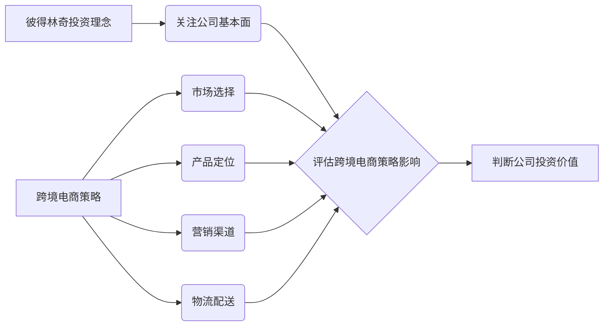

# 彼得林奇如何看待公司的跨境电商策略

> 关键词：彼得林奇、公司、跨境电商策略、投资分析、商业洞察

> 摘要：本文旨在探讨投资大师彼得林奇对公司跨境电商策略的看法。通过对彼得林奇投资理念的深入剖析，结合跨境电商的行业特点和发展趋势，分析公司实施跨境电商策略的潜在影响和投资价值。文章将阐述彼得林奇评估公司跨境电商策略的方法，包括对市场机会、竞争优势、管理能力等方面的考量，还会结合实际案例说明其观点的应用，以期为投资者和企业管理者在跨境电商领域的决策提供有价值的参考。

## 1. 背景介绍 
### 1.1 目的和范围
本部分旨在全面介绍彼得林奇以及跨境电商策略的相关背景知识，明确本文的研究目的和范围。彼得林奇作为投资界的传奇人物，其投资理念和方法对全球投资者产生了深远影响。跨境电商作为近年来迅速发展的商业模式，为企业带来了新的机遇和挑战。本文的目的是深入探讨彼得林奇如何看待公司的跨境电商策略，范围涵盖彼得林奇的投资思想、跨境电商的行业特点、公司实施跨境电商策略的各个方面以及相关案例分析。

### 1.2 预期读者
本文预期读者包括对投资领域感兴趣的个人投资者、企业管理者、研究商业和投资的学者以及对跨境电商行业发展有关注的相关人士。通过阅读本文，读者可以了解彼得林奇的投资智慧在跨境电商领域的应用，从而为自己的投资决策、企业战略制定等提供有益的参考。

### 1.3 文档结构概述
本文将按照以下结构展开：首先介绍彼得林奇的背景和跨境电商的基本概念，为后续讨论奠定基础；接着分析彼得林奇评估公司跨境电商策略的核心概念和方法；然后详细阐述相关的算法原理和操作步骤，通过数学模型和公式进一步说明；再通过项目实战案例展示具体应用；之后探讨跨境电商策略的实际应用场景；推荐相关的工具和资源；最后总结未来发展趋势与挑战，解答常见问题并提供扩展阅读和参考资料。

### 1.4 术语表
#### 1.4.1 核心术语定义
- **彼得林奇**：美国著名的投资家，曾任富达公司麦哲伦基金的基金经理，以其卓越的投资业绩和独特的投资理念闻名于世。
- **跨境电商**：分属不同关境的交易主体，通过电子商务平台达成交易、进行电子支付结算，并通过跨境物流送达商品、完成交易的一种国际商业活动。
- **投资价值**：指资产对于具有明确投资目标的特定投资者或某一类投资者所具有的价值。
- **竞争优势**：企业在市场竞争中相对于其他竞争对手所具有的优势，能够使其在市场中获得更高的市场份额和利润。
- **市场机会**：市场中存在的尚未被满足的需求或潜在的发展空间，为企业提供了发展和盈利的可能性。

#### 1.4.2 相关概念解释
- **投资理念**：投资者在进行投资活动时所遵循的基本思想和原则，包括对投资目标、投资方法、风险控制等方面的认识和理解。
- **商业策略**：企业为实现其商业目标而制定的一系列行动计划和决策，包括市场定位、产品策略、营销策略等。
- **供应链管理**：对供应链中的物流、信息流和资金流进行计划、组织、协调和控制，以提高供应链的效率和效益。

#### 1.4.3 缩略词列表
- **B2B**：Business-to-Business，企业对企业的电子商务模式。
- **B2C**：Business-to-Consumer，企业对消费者的电子商务模式。
- **C2C**：Consumer-to-Consumer，消费者对消费者的电子商务模式。

## 2. 核心概念与联系 

### 彼得林奇的投资理念核心
彼得林奇的投资理念建立在对公司基本面的深入研究之上。他强调要像了解自己的邻居一样了解所投资的公司，关注公司的业务模式、财务状况、竞争优势等方面。他认为，只要投资者具备一定的常识和耐心，就能够发现被市场低估的优质公司。

### 跨境电商策略的内涵
跨境电商策略是指企业为了在跨境电商领域取得竞争优势和实现商业目标而制定的一系列规划和措施。它包括市场选择、产品定位、营销渠道、物流配送等多个方面。企业需要根据自身的资源和能力，结合目标市场的需求和竞争状况，制定适合自己的跨境电商策略。

### 两者的联系
彼得林奇的投资理念为评估公司的跨境电商策略提供了重要的视角。当公司实施跨境电商策略时，彼得林奇会关注该策略是否与公司的核心业务相符，是否能够为公司带来新的增长机会和竞争优势。例如，如果公司通过跨境电商策略成功进入了一个具有巨大潜力的海外市场，并且能够在该市场中建立起自己的品牌和客户群体，那么这将增加公司的投资价值。反之，如果公司的跨境电商策略缺乏明确的目标和规划，或者无法有效地应对市场竞争，那么这可能会对公司的业绩产生负面影响。

### 文本示意图
彼得林奇的投资理念关注公司基本面，包括业务模式、财务状况、竞争优势等。跨境电商策略涵盖市场选择、产品定位、营销渠道、物流配送等方面。两者的联系在于，彼得林奇通过评估跨境电商策略对公司基本面的影响来判断公司的投资价值。

### Mermaid 流程图


## 3. 核心算法原理 & 具体操作步骤 

### 核心算法原理
在评估公司的跨境电商策略时，可以采用类似彼得林奇的基本面分析方法。以下是一个简化的算法思路：

1. **市场潜力评估**：通过收集目标市场的人口、经济增长、消费习惯等数据，评估该市场的潜在需求和增长空间。可以使用市场调研机构的数据和报告，结合行业分析，计算市场潜力指数。
2. **竞争优势分析**：分析公司在跨境电商领域的竞争优势，包括产品质量、品牌知名度、价格优势、物流速度等。可以使用打分法对各项竞争优势进行量化评估。
3. **财务影响预测**：根据市场潜力和竞争优势分析的结果，预测公司实施跨境电商策略后的财务状况，包括销售收入、成本、利润等。可以使用财务模型进行预测。

### 具体操作步骤

#### 步骤 1：数据收集
- 收集目标市场的相关数据，如人口统计数据、GDP增长率、消费者支出数据等。
- 收集公司的财务报表、产品信息、市场份额数据等。
- 收集竞争对手的相关信息，包括产品特点、价格策略、市场份额等。

#### 步骤 2：市场潜力评估
```python
# 市场潜力评估示例代码
# 假设市场潜力指数由人口规模、GDP增长率和消费支出增长率决定
def market_potential_index(population, gdp_growth, consumption_growth):
    # 定义各项指标的权重
    weight_population = 0.4
    weight_gdp_growth = 0.3
    weight_consumption_growth = 0.3
    
    # 计算市场潜力指数
    index = weight_population * population + weight_gdp_growth * gdp_growth + weight_consumption_growth * consumption_growth
    return index

# 示例数据
population = 10000000  # 人口规模
gdp_growth = 0.05  # GDP增长率
consumption_growth = 0.06  # 消费支出增长率

# 计算市场潜力指数
mp_index = market_potential_index(population, gdp_growth, consumption_growth)
print("市场潜力指数:", mp_index)
```

#### 步骤 3：竞争优势分析
```python
# 竞争优势分析示例代码
# 假设竞争优势由产品质量、品牌知名度、价格优势和物流速度决定
def competitive_advantage_score(product_quality, brand_awareness, price_advantage, logistics_speed):
    # 定义各项指标的权重
    weight_product_quality = 0.3
    weight_brand_awareness = 0.2
    weight_price_advantage = 0.3
    weight_logistics_speed = 0.2
    
    # 计算竞争优势得分
    score = weight_product_quality * product_quality + weight_brand_awareness * brand_awareness + weight_price_advantage * price_advantage + weight_logistics_speed * logistics_speed
    return score

# 示例数据
product_quality = 8  # 产品质量得分（满分10分）
brand_awareness = 7  # 品牌知名度得分（满分10分）
price_advantage = 6  # 价格优势得分（满分10分）
logistics_speed = 7  # 物流速度得分（满分10分）

# 计算竞争优势得分
ca_score = competitive_advantage_score(product_quality, brand_awareness, price_advantage, logistics_speed)
print("竞争优势得分:", ca_score)
```

#### 步骤 4：财务影响预测
```python
# 财务影响预测示例代码
# 假设销售收入与市场潜力指数和竞争优势得分成正比
def revenue_prediction(mp_index, ca_score):
    # 定义系数
    coefficient = 1000
    
    # 计算预测销售收入
    revenue = coefficient * mp_index * ca_score
    return revenue

# 计算预测销售收入
predicted_revenue = revenue_prediction(mp_index, ca_score)
print("预测销售收入:", predicted_revenue)
```

## 4. 数学模型和公式 & 详细讲解 & 举例说明 

### 市场潜力指数模型
市场潜力指数 $MPI$ 的计算公式为：
$$MPI = w_p \times P + w_{gdp} \times G + w_c \times C$$
其中，$w_p$ 是人口规模的权重，$P$ 是人口规模；$w_{gdp}$ 是GDP增长率的权重，$G$ 是GDP增长率；$w_c$ 是消费支出增长率的权重，$C$ 是消费支出增长率。

**举例说明**：假设 $w_p = 0.4$，$P = 10000000$，$w_{gdp} = 0.3$，$G = 0.05$，$w_c = 0.3$，$C = 0.06$，则：
$$MPI = 0.4 \times 10000000 + 0.3 \times 0.05 + 0.3 \times 0.06 = 4000000 + 0.015 + 0.018 = 4000000.033$$

### 竞争优势得分模型
竞争优势得分 $CAS$ 的计算公式为：
$$CAS = w_{pq} \times PQ + w_{ba} \times BA + w_{pa} \times PA + w_{ls} \times LS$$
其中，$w_{pq}$ 是产品质量的权重，$PQ$ 是产品质量得分；$w_{ba}$ 是品牌知名度的权重，$BA$ 是品牌知名度得分；$w_{pa}$ 是价格优势的权重，$PA$ 是价格优势得分；$w_{ls}$ 是物流速度的权重，$LS$ 是物流速度得分。

**举例说明**：假设 $w_{pq} = 0.3$，$PQ = 8$，$w_{ba} = 0.2$，$BA = 7$，$w_{pa} = 0.3$，$PA = 6$，$w_{ls} = 0.2$，$LS = 7$，则：
$$CAS = 0.3 \times 8 + 0.2 \times 7 + 0.3 \times 6 + 0.2 \times 7 = 2.4 + 1.4 + 1.8 + 1.4 = 7$$

### 财务影响预测模型
预测销售收入 $R$ 的计算公式为：
$$R = k \times MPI \times CAS$$
其中，$k$ 是系数。

**举例说明**：假设 $k = 1000$，$MPI = 4000000.033$，$CAS = 7$，则：
$$R = 1000 \times 4000000.033 \times 7 = 28000000231$$

## 5. 项目实战：代码实际案例和详细解释说明 

### 5.1  开发环境搭建
为了运行上述代码，需要安装Python开发环境。可以从Python官方网站（https://www.python.org/downloads/）下载并安装Python 3.x版本。安装完成后，可以使用任何文本编辑器或集成开发环境（IDE）来编写和运行Python代码，如PyCharm、Visual Studio Code等。

### 5.2  源代码详细实现和代码解读

```python
# 市场潜力评估示例代码
# 假设市场潜力指数由人口规模、GDP增长率和消费支出增长率决定
def market_potential_index(population, gdp_growth, consumption_growth):
    # 定义各项指标的权重
    weight_population = 0.4
    weight_gdp_growth = 0.3
    weight_consumption_growth = 0.3
    
    # 计算市场潜力指数
    index = weight_population * population + weight_gdp_growth * gdp_growth + weight_consumption_growth * consumption_growth
    return index

# 竞争优势分析示例代码
# 假设竞争优势由产品质量、品牌知名度、价格优势和物流速度决定
def competitive_advantage_score(product_quality, brand_awareness, price_advantage, logistics_speed):
    # 定义各项指标的权重
    weight_product_quality = 0.3
    weight_brand_awareness = 0.2
    weight_price_advantage = 0.3
    weight_logistics_speed = 0.2
    
    # 计算竞争优势得分
    score = weight_product_quality * product_quality + weight_brand_awareness * brand_awareness + weight_price_advantage * price_advantage + weight_logistics_speed * logistics_speed
    return score

# 财务影响预测示例代码
# 假设销售收入与市场潜力指数和竞争优势得分成正比
def revenue_prediction(mp_index, ca_score):
    # 定义系数
    coefficient = 1000
    
    # 计算预测销售收入
    revenue = coefficient * mp_index * ca_score
    return revenue

# 示例数据
population = 10000000  # 人口规模
gdp_growth = 0.05  # GDP增长率
consumption_growth = 0.06  # 消费支出增长率
product_quality = 8  # 产品质量得分（满分10分）
brand_awareness = 7  # 品牌知名度得分（满分10分）
price_advantage = 6  # 价格优势得分（满分10分）
logistics_speed = 7  # 物流速度得分（满分10分）

# 计算市场潜力指数
mp_index = market_potential_index(population, gdp_growth, consumption_growth)
print("市场潜力指数:", mp_index)

# 计算竞争优势得分
ca_score = competitive_advantage_score(product_quality, brand_awareness, price_advantage, logistics_speed)
print("竞争优势得分:", ca_score)

# 计算预测销售收入
predicted_revenue = revenue_prediction(mp_index, ca_score)
print("预测销售收入:", predicted_revenue)
```

### 代码解读与分析
- **市场潜力评估函数 `market_potential_index`**：该函数接受人口规模、GDP增长率和消费支出增长率作为输入，根据定义的权重计算市场潜力指数。通过调整权重可以反映不同指标对市场潜力的影响程度。
- **竞争优势分析函数 `competitive_advantage_score`**：该函数接受产品质量、品牌知名度、价格优势和物流速度作为输入，根据定义的权重计算竞争优势得分。同样，权重的调整可以体现各项竞争优势的重要性。
- **财务影响预测函数 `revenue_prediction`**：该函数接受市场潜力指数和竞争优势得分作为输入，根据定义的系数计算预测销售收入。系数的选择需要根据实际情况进行调整。

## 6. 实际应用场景 

### 投资者决策
投资者在评估一家公司是否值得投资时，可以参考彼得林奇的方法，分析公司的跨境电商策略。如果公司的跨境电商策略能够有效地开拓海外市场，提高市场份额和盈利能力，那么这将增加公司的投资价值。例如，一家传统的制造业公司通过跨境电商平台将产品销售到全球市场，实现了销售收入的快速增长，投资者可以考虑对该公司进行投资。

### 企业战略制定
企业在制定跨境电商策略时，可以借鉴彼得林奇的投资理念，关注市场机会和竞争优势。企业需要深入了解目标市场的需求和竞争状况，选择适合自己的市场和产品定位。同时，企业还需要不断提升自身的竞争优势，如提高产品质量、加强品牌建设、优化物流配送等，以在跨境电商领域取得成功。

### 行业研究与分析
研究机构和分析师可以使用本文介绍的方法和模型，对跨境电商行业进行研究和分析。通过评估不同公司的跨境电商策略和投资价值，可以为行业发展提供参考和建议。例如，分析师可以比较不同公司在跨境电商领域的市场潜力和