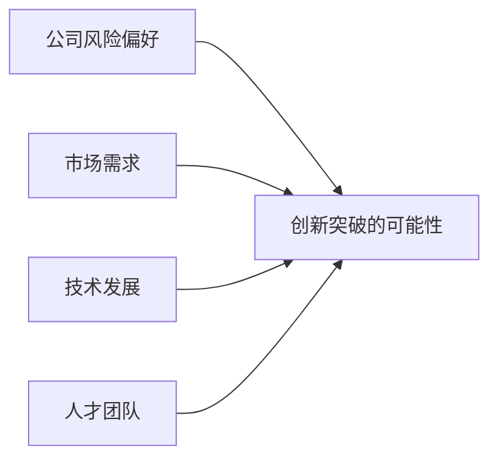

# 彼得林奇如何看待公司的风险偏好与创新突破的相关性

> 关键词：彼得林奇、公司风险偏好、创新突破、相关性、投资分析

> 摘要：本文围绕彼得林奇对公司风险偏好与创新突破相关性的观点展开深入探讨。首先介绍彼得林奇在投资领域的重要地位以及研究此相关性的背景意义，接着阐述公司风险偏好和创新突破的核心概念及其联系，通过具体的算法原理分析两者之间的量化关系，结合数学模型进行详细讲解和举例说明。在项目实战部分，给出实际代码案例并进行解读。然后探讨该相关性在实际商业场景中的应用，推荐相关的学习资源、开发工具以及论文著作。最后总结公司风险偏好与创新突破相关性的未来发展趋势与挑战，解答常见问题，并提供扩展阅读和参考资料，旨在为投资者和企业管理者理解和运用这一相关性提供全面的知识体系。

## 1. 背景介绍 
### 1.1 目的和范围
彼得林奇是投资界的传奇人物，他的投资理念和方法影响了无数投资者。研究彼得林奇如何看待公司的风险偏好与创新突破的相关性，有助于我们从投资大师的视角深入理解公司的发展潜力和投资价值。本研究的范围涵盖了彼得林奇的投资思想、公司风险偏好的评估、创新突破的衡量以及两者之间的相互作用机制。

### 1.2 预期读者
本文的预期读者包括专业投资者、投资爱好者、企业管理者以及对公司发展和投资分析感兴趣的人士。对于投资者来说，可以从彼得林奇的观点中获取投资决策的参考；对于企业管理者，有助于理解如何平衡风险偏好以促进创新突破，提升企业竞争力。

### 1.3 文档结构概述
本文首先介绍相关背景知识，包括目的、预期读者和文档结构。接着阐述公司风险偏好和创新突破的核心概念及其联系，通过算法原理和数学模型进行深入分析。然后给出项目实战案例，展示如何在实际中应用这些理论。之后探讨实际应用场景，推荐相关的工具和资源。最后总结未来发展趋势与挑战，解答常见问题，并提供扩展阅读和参考资料。

### 1.4 术语表
#### 1.4.1 核心术语定义
- **风险偏好**：指公司在追求目标过程中，愿意承担风险的程度和态度。不同的公司可能具有不同的风险偏好，如风险规避型、风险中性型和风险偏好型。
- **创新突破**：指公司在技术、产品、服务或商业模式等方面取得重大的、具有开创性的进展，能够显著提升公司的竞争力和市场地位。
- **彼得林奇投资理念**：强调通过深入研究公司基本面，寻找具有成长潜力的公司进行投资，注重公司的盈利能力、市场地位、管理团队等因素。

#### 1.4.2 相关概念解释
- **风险承受能力**：公司在财务、经营等方面能够承受风险的能力，与公司的资产规模、现金流状况等因素有关。
- **创新驱动力**：推动公司进行创新的因素，如市场需求、竞争压力、技术进步等。
- **投资回报率**：衡量投资收益的指标，反映了投资所获得的利润与投资成本的比例。

#### 1.4.3 缩略词列表
- ROI：Return on Investment，投资回报率
- R&D：Research and Development，研究与开发

## 2. 核心概念与联系 

### 2.1 公司风险偏好的内涵
公司的风险偏好反映了其在决策过程中对风险的态度。风险规避型公司通常更倾向于选择风险较低、收益稳定的项目，注重资金的安全性和稳定性。例如，一些传统的公用事业公司，其业务模式相对成熟，市场需求稳定，它们往往采取保守的投资策略，避免涉足高风险的领域。

风险中性型公司在决策时会综合考虑风险和收益，根据项目的预期回报率和风险程度进行权衡。它们既不会过度追求高风险高收益的项目，也不会完全回避风险，而是在风险和收益之间寻找平衡。

风险偏好型公司则更愿意承担较高的风险，以追求更高的回报。这类公司通常具有较强的创新意识和冒险精神，愿意投入大量资源进行研发和开拓新市场。例如，一些科技初创公司，为了在激烈的市场竞争中脱颖而出，不惜投入巨额资金进行技术创新，尽管面临着较高的失败风险，但一旦成功，可能会获得巨大的回报。

### 2.2 创新突破的定义和特点
创新突破是指公司在技术、产品、服务或商业模式等方面取得的重大进展，具有以下特点：
- **开创性**：创新突破通常是前所未有的，能够为市场带来新的产品、服务或解决方案，满足消费者尚未被满足的需求。
- **颠覆性**：它可能会对现有的市场格局和竞争态势产生重大影响，使传统的商业模式和产品面临被淘汰的风险。例如，互联网技术的出现，颠覆了传统的媒体、零售等行业。
- **高风险性**：创新突破往往需要投入大量的资源和时间，并且面临着技术难题、市场不确定性等多种风险。很多创新项目可能最终失败，无法实现预期的目标。

### 2.3 风险偏好与创新突破的联系
公司的风险偏好与创新突破之间存在着密切的联系。一般来说，风险偏好型公司更有可能实现创新突破。这是因为创新突破往往伴随着较高的风险，需要公司有足够的勇气和决心去承担这些风险。风险偏好型公司愿意投入大量资源进行研发和创新，积极探索新的技术和市场机会，从而增加了实现创新突破的可能性。

相反，风险规避型公司由于过于注重风险控制，可能会错过一些具有创新性的项目和机会。它们更倾向于维持现有的业务模式和市场份额，缺乏创新的动力和能力。

然而，风险偏好并不一定能够直接导致创新突破。即使公司具有较高的风险偏好，如果缺乏有效的创新管理和资源配置能力，也难以实现创新突破。此外，创新突破也不仅仅取决于公司的风险偏好，还受到市场需求、技术发展、人才团队等多种因素的影响。

### 2.4 核心概念原理和架构的文本示意图
```plaintext
            公司风险偏好
               |
               | 影响
               |
        创新突破的可能性
               |
               | 受多种因素影响
               |
        市场需求、技术发展、人才团队等
```

### 2.5 Mermaid 流程图


## 3. 核心算法原理 & 具体操作步骤 

### 3.1 风险偏好的量化评估算法
我们可以通过以下几个指标来量化评估公司的风险偏好：
- **研发投入比例**：公司的研发投入占营业收入的比例越高，说明公司越愿意投入资源进行创新，通常具有较高的风险偏好。
- **资产负债率**：资产负债率反映了公司的财务杠杆水平，负债率较高的公司可能更愿意承担财务风险，具有较高的风险偏好。
- **新项目投资占比**：公司对新项目的投资占总投资的比例越高，说明公司更愿意尝试新的业务和市场，风险偏好较高。

以下是使用 Python 实现风险偏好量化评估的代码示例：
```python
import pandas as pd

def risk_preference_evaluation(data):
    # 计算研发投入比例
    data['R&D_ratio'] = data['R&D_expense'] / data['revenue']
    # 计算资产负债率
    data['debt_ratio'] = data['total_debt'] / data['total_assets']
    # 计算新项目投资占比
    data['new_project_ratio'] = data['new_project_investment'] / data['total_investment']
    # 综合评估风险偏好得分
    data['risk_preference_score'] = (data['R&D_ratio'] + data['debt_ratio'] + data['new_project_ratio']) / 3
    return data

# 示例数据
data = {
    'company_name': ['Company A', 'Company B', 'Company C'],
    'R&D_expense': [100, 200, 300],
    'revenue': [1000, 2000, 3000],
    'total_debt': [500, 800, 1200],
    'total_assets': [2000, 3000, 4000],
    'new_project_investment': [200, 300, 400],
    'total_investment': [1000, 1500, 2000]
}
df = pd.DataFrame(data)

# 进行风险偏好评估
result = risk_preference_evaluation(df)
print(result)
```

### 3.2 创新突破的衡量指标
可以通过以下指标来衡量公司的创新突破：
- **专利数量**：专利是公司创新成果的重要体现，专利数量越多，说明公司在技术创新方面取得的成果越多。
- **新产品销售收入占比**：新产品销售收入占总销售收入的比例越高，说明公司的创新产品在市场上的接受程度越高，创新突破的效果越好。
- **市场份额增长率**：如果公司的市场份额在短期内有显著增长，可能是由于创新突破带来的竞争优势所致。

以下是使用 Python 实现创新突破衡量的代码示例：
```python
def innovation_breakthrough_measurement(data):
    # 计算专利数量增长率
    data['patent_growth_rate'] = (data['current_patents'] - data['previous_patents']) / data['previous_patents']
    # 计算新产品销售收入占比
    data['new_product_revenue_ratio'] = data['new_product_revenue'] / data['total_revenue']
    # 计算市场份额增长率
    data['market_share_growth_rate'] = (data['current_market_share'] - data['previous_market_share']) / data['previous_market_share']
    # 综合评估创新突破得分
    data['innovation_breakthrough_score'] = (data['patent_growth_rate'] + data['new_product_revenue_ratio'] + data['market_share_growth_rate']) / 3
    return data

# 示例数据
data = {
    'company_name': ['Company A', 'Company B', 'Company C'],
    'current_patents': [50, 60, 70],
    'previous_patents': [40, 50, 60],
    'new_product_revenue': [200, 300, 400],
    'total_revenue': [1000, 2000, 3000],
    'current_market_share': [0.1, 0.15, 0.2],
    'previous_market_share': [0.08, 0.12, 0.15]
}
df = pd.DataFrame(data)

# 进行创新突破衡量
result = innovation_breakthrough_measurement(df)
print(result)
```

### 3.3 风险偏好与创新突破相关性分析算法
可以使用皮尔逊相关系数来分析公司的风险偏好得分和创新突破得分之间的相关性。皮尔逊相关系数的取值范围在 -1 到 1 之间，绝对值越接近 1，说明两者之间的相关性越强；绝对值越接近 0，说明两者之间的相关性越弱。

以下是使用 Python 实现相关性分析的代码示例：
```python
import scipy.stats as stats

def correlation_analysis(data):
    risk_preference_scores = data['risk_preference_score']
    innovation_breakthrough_scores = data['innovation_breakthrough_score']
    correlation, p_value = stats.pearsonr(risk_preference_scores, innovation_breakthrough_scores)
    return correlation, p_value

# 假设已经有包含风险偏好得分和创新突破得分的数据
data = {
    'risk_preference_score': [0.3, 0.4, 0.5],
    'innovation_breakthrough_score': [0.2, 0.3, 0.4]
}
df = pd.DataFrame(data)

# 进行相关性分析
correlation, p_value = correlation_analysis(df)
print(f"Correlation: {correlation}, P-value: {p_value}")
```

## 4. 数学模型和公式 & 详细讲解 & 举例说明 

### 4.1 风险偏好得分计算公式
风险偏好得分可以通过综合考虑研发投入比例、资产负债率和新项目投资占比来计算。计算公式如下：
$$
\text{Risk Preference Score} = \frac{\text{R&D Ratio} + \text{Debt Ratio} + \text{New Project Ratio}}{3}
$$
其中，$\text{R&D Ratio}$ 表示研发投入比例，$\text{Debt Ratio}$ 表示资产负债率，$\text{New Project Ratio}$ 表示新项目投资占比。

例如，某公司的研发投入为 200 万元，营业收入为 1000 万元，总债务为 500 万元，总资产为 2000 万元，新项目投资为 300 万元，总投资为 1500 万元。则该公司的研发投入比例为：
$$
\text{R&D Ratio} = \frac{200}{1000} = 0.2
$$
资产负债率为：
$$
\text{Debt Ratio} = \frac{500}{2000} = 0.25
$$
新项目投资占比为：
$$
\text{New Project Ratio} = \frac{300}{1500} = 0.2
$$
风险偏好得分则为：
$$
\text{Risk Preference Score} = \frac{0.2 + 0.25 + 0.2}{3} \approx 0.217
$$

### 4.2 创新突破得分计算公式
创新突破得分可以通过综合考虑专利数量增长率、新产品销售收入占比和市场份额增长率来计算。计算公式如下：
$$
\text{Innovation Breakthrough Score} = \frac{\text{Patent Growth Rate} + \text{New Product Revenue Ratio} + \text{Market Share Growth Rate}}{3}
$$
其中，$\text{Patent Growth Rate}$ 表示专利数量增长率，$\text{New Product Revenue Ratio}$ 表示新产品销售收入占比，$\text{Market Share Growth Rate}$ 表示市场份额增长率。

例如，某公司当前专利数量为 60 项，上一年度专利数量为 50 项，新产品销售收入为 300 万元，总销售收入为 2000 万元，当前市场份额为 0.15，上一年度市场份额为 0.12。则该公司的专利数量增长率为：
$$
\text{Patent Growth Rate} = \frac{60 - 50}{50} = 0.2
$$
新产品销售收入占比为：
$$
\text{New Product Revenue Ratio} = \frac{300}{2000} = 0.15
$$
市场份额增长率为：
$$
\text{Market Share Growth Rate} = \frac{0.15 - 0.12}{0.12} = 0.25
$$
创新突破得分则为：
$$
\text{Innovation Breakthrough Score} = \frac{0.2 + 0.15 + 0.25}{3} \approx 0.2
$$

### 4.3 皮尔逊相关系数计算公式
皮尔逊相关系数用于衡量两个变量之间的线性相关性，计算公式如下：
$$
r = \frac{\sum_{i=1}^{n} (x_i - \bar{x})(y_i - \bar{y})}{\sqrt{\sum_{i=1}^{n} (x_i - \bar{x})^2 \sum_{i=1}^{n} (y_i - \bar{y})^2}}
$$
其中，$x_i$ 和 $y_i$ 分别表示两个变量的第 $i$ 个观测值，$\bar{x}$ 和 $\bar{y}$ 分别表示两个变量的均值，$n$ 表示观测值的数量。

例如，有两组数据 $x = [1, 2, 3]$ 和 $y = [2, 3, 4]$。首先计算均值：
$$
\bar{x} = \frac{1 + 2 + 3}{3} = 2
$$
$$
\bar{y} = \frac{2 + 3 + 4}{3} = 3
$$
然后计算分子和分母：
分子：
$$
\sum_{i=1}^{3} (x_i - \bar{x})(y_i - \bar{y}) = (1 - 2)(2 - 3) + (2 - 2)(3 - 3) + (3 - 2)(4 - 3) = 2
$$
分母：
$$
\sqrt{\sum_{i=1}^{3} (x_i - \bar{x})^2 \sum_{i=1}^{3} (y_i - \bar{y})^2} = \sqrt{((1 - 2)^2 + (2 - 2)^2 + (3 - 2)^2) ((2 - 3)^2 + (3 - 3)^2 + (4 - 3)^2)} = \sqrt{2 \times 2} = 2
$$
最后计算皮尔逊相关系数：
$$
r = \frac{2}{2} = 1
$$
这表明 $x$ 和 $y$ 之间存在完全正相关关系。

## 5. 项目实战：代码实际案例和详细解释说明 

### 5.1  开发环境搭建
在进行项目实战之前，需要搭建相应的开发环境。以下是具体步骤：
1. **安装 Python**：可以从 Python 官方网站（https://www.python.org/downloads/）下载并安装最新版本的 Python。
2. **安装必要的库**：使用 `pip` 命令安装所需的库，包括 `pandas` 和 `scipy`。
```sh
pip install pandas scipy
```
3. **选择开发工具**：可以使用 Jupyter Notebook、PyCharm 等开发工具进行代码编写和调试。

### 5.2  源代码详细实现和代码解读
以下是一个完整的项目实战代码示例，用于分析公司的风险偏好与创新突破的相关性：
```python
import pandas as pd
import scipy.stats as stats

# 风险偏好评估函数
def risk_preference_evaluation(data):
    # 计算研发投入比例
    data['R&D_ratio'] = data['R&D_expense'] / data['revenue']
    # 计算资产负债率
    data['debt_ratio'] = data['total_debt'] / data['total_assets']
    # 计算新项目投资占比
    data['new_project_ratio'] = data['new_project_investment'] / data['total_investment']
    # 综合评估风险偏好得分
    data['risk_preference_score'] = (data['R&D_ratio'] + data['debt_ratio'] + data['new_project_ratio']) / 3
    return data

# 创新突破衡量函数
def innovation_breakthrough_measurement(data):
    # 计算专利数量增长率
    data['patent_growth_rate'] = (data['current_patents'] - data['previous_patents']) / data['previous_patents']
    # 计算新产品销售收入占比
    data['new_product_revenue_ratio'] = data['new_product_revenue'] / data['total_revenue']
    # 计算市场份额增长率
    data['market_share_growth_rate'] = (data['current_market_share'] - data['previous_market_share']) / data['previous_market_share']
    # 综合评估创新突破得分
    data['innovation_breakthrough_score'] = (data['patent_growth_rate'] + data['new_product_revenue_ratio'] + data['market_share_growth_rate']) / 3
    return data

# 相关性分析函数
def correlation_analysis(data):
    risk_preference_scores = data['risk_preference_score']
    innovation_breakthrough_scores = data['innovation_breakthrough_score']
    correlation, p_value = stats.pearsonr(risk_preference_scores, innovation_breakthrough_scores)
    return correlation, p_value

# 示例数据
data = {
    'company_name': ['Company A', 'Company B', 'Company C', 'Company D', 'Company E'],
    'R&D_expense': [100, 200, 300, 400, 500],
    'revenue': [1000, 2000, 3000, 4000, 5000],
    'total_debt': [500, 800, 1200, 1500, 2000],
    'total_assets': [2000, 3000, 4000, 5000, 6000],
    'new_project_investment': [200, 300, 400, 500, 600],
    'total_investment': [1000, 1500, 2000, 2500, 3000],
    'current_patents': [50, 60, 70, 80, 90],
    'previous_patents': [40, 50, 60, 70, 80],
    'new_product_revenue': [200, 300, 400, 500, 600],
    'total_revenue': [1000, 2000, 3000, 4000, 5000],
    'current_market_share': [0.1, 0.15, 0.2, 0.25, 0.3],
    'previous_market_share': [0.08, 0.12, 0.15, 0.2, 0.25]
}
df = pd.DataFrame(data)

# 进行风险偏好评估
df = risk_preference_evaluation(df)
# 进行创新突破衡量
df = innovation_breakthrough_measurement(df)
# 进行相关性分析
correlation, p_value = correlation_analysis(df)

print("Risk Preference Evaluation Results:")
print(df[['company_name', 'risk_preference_score']])
print("\nInnovation Breakthrough Measurement Results:")
print(df[['company_name', 'innovation_breakthrough_score']])
print(f"\nCorrelation between Risk Preference and Innovation Breakthrough: {correlation}, P-value: {p_value}")
```

### 5.3  代码解读与分析
- **风险偏好评估函数 `risk_preference_evaluation`**：该函数接受一个包含公司财务数据的 DataFrame 作为输入，计算研发投入比例、资产负债率和新项目投资占比，并综合计算风险偏好得分。
- **创新突破衡量函数 `innovation_breakthrough_measurement`**：该函数接受一个包含公司创新相关数据的 DataFrame 作为输入，计算专利数量增长率、新产品销售收入占比和市场份额增长率，并综合计算创新突破得分。
- **相关性分析函数 `correlation_analysis`**：该函数接受一个包含风险偏好得分和创新突破得分的 DataFrame 作为输入，使用皮尔逊相关系数计算两者之间的相关性，并返回相关系数和 p 值。
- **主程序**：首先定义示例数据，然后调用上述三个函数进行风险偏好评估、创新突破衡量和相关性分析，最后输出评估结果和相关性分析结果。

通过这个项目实战，我们可以清晰地看到如何量化评估公司的风险偏好和创新突破，并分析两者之间的相关性。

## 6. 实际应用场景 
### 6.1 投资决策
对于投资者来说，了解公司的风险偏好与创新突破的相关性可以帮助他们做出更明智的投资决策。如果一家公司具有较高的风险偏好，并且在创新突破方面表现出色，那么该公司可能具有较大的成长潜力，值得投资者关注。相反，如果一家公司风险偏好较低，且创新能力不足，那么其未来的发展可能较为有限，投资价值相对较低。

例如，彼得林奇在投资过程中，会关注那些具有创新精神和冒险精神的公司。他认为，这类公司更有可能在市场竞争中脱颖而出，为投资者带来丰厚的回报。他通过深入研究公司的基本面，评估公司的风险偏好和创新能力，寻找那些被市场低估的成长型公司进行投资。

### 6.2 企业战略规划
企业管理者可以根据公司的风险偏好和创新能力制定合适的战略规划。对于风险偏好较高、创新能力较强的公司，可以采取积极的扩张战略，加大研发投入，开拓新市场，推出新产品，以实现快速增长。对于风险偏好较低、创新能力较弱的公司，可以采取稳健的战略，巩固现有市场份额，提高运营效率，降低成本。

例如，苹果公司一直以来都具有较高的风险偏好和强大的创新能力。它不断投入大量资源进行研发，推出具有创新性的产品，如 iPhone、iPad 等，从而在全球智能手机和平板电脑市场占据了领先地位。而一些传统的制造业企业，由于风险偏好较低，更注重成本控制和产品质量，它们可能会采取稳健的战略，逐步提升市场份额。

### 6.3 行业竞争分析
通过分析不同公司的风险偏好与创新突破的相关性，可以了解行业内的竞争态势。在一个行业中，如果大多数公司都具有较高的风险偏好和较强的创新能力，那么该行业的竞争将非常激烈，技术更新换代也会很快。相反，如果大多数公司风险偏好较低，创新能力不足，那么该行业的发展可能较为缓慢，市场格局相对稳定。

例如，在科技行业，如人工智能、半导体等领域，大多数公司都具有较高的风险偏好和强大的创新能力，它们不断投入大量资源进行研发，争夺技术领先地位。而在一些传统行业，如钢铁、煤炭等领域，大多数公司风险偏好较低，创新能力相对较弱，行业发展较为缓慢。

## 7. 工具和资源推荐
### 7.1 学习资源推荐
#### 7.1.1 书籍推荐
- 《彼得林奇的成功投资》：彼得林奇的经典著作，详细介绍了他的投资理念和方法，包括如何寻找成长型公司、如何评估公司的基本面等。
- 《创新者的窘境》：克莱顿·克里斯坦森的著作，探讨了创新对企业和行业的影响，以及企业如何应对创新带来的挑战。
- 《财务报表分析》：帮助读者了解如何分析公司的财务报表，评估公司的财务状况和经营绩效。

#### 7.1.2 在线课程
- Coursera 上的“投资学原理”：介绍了投资的基本概念、理论和方法，适合初学者学习。
- edX 上的“创新管理”：讲解了创新管理的理论和实践，帮助学员提升创新能力和管理水平。

#### 7.1.3 技术博客和网站
- Seeking Alpha：提供了大量的投资分析文章和研究报告，涵盖了各个行业和公司。
- TechCrunch：专注于科技行业的新闻和分析，报道最新的技术趋势和创新成果。

### 7.2 开发工具框架推荐
#### 7.2.1 IDE和编辑器
- PyCharm：一款专业的 Python 集成开发环境，提供了丰富的代码编辑、调试和测试功能。
- Jupyter Notebook：一个交互式的开发环境，适合进行数据分析和可视化。

#### 7.2.2 调试和性能分析工具
- PDB：Python 自带的调试工具，用于调试 Python 代码。
- cProfile：Python 内置的性能分析工具，用于分析代码的性能瓶颈。

#### 7.2.3 相关框架和库
- Pandas：一个强大的数据分析库，提供了高效的数据处理和分析功能。
- Scipy：一个科学计算库，包含了各种统计分析和数值计算的工具。

### 7.3 相关论文著作推荐
#### 7.3.1 经典论文
- “The Capital Asset Pricing Model: A Theory of Market Equilibrium under Conditions of Risk”：威廉·夏普的经典论文，提出了资本资产定价模型（CAPM）。
- “Innovation and Entrepreneurship”：彼得·德鲁克的论文，探讨了创新和创业的重要性和方法。

#### 7.3.2 最新研究成果
- 可以关注《Journal of Financial Economics》、《Management Science》等学术期刊，了解关于公司风险偏好、创新突破和投资分析的最新研究成果。

#### 7.3.3 应用案例分析
- 可以参考一些知名咨询公司的研究报告，如麦肯锡、波士顿咨询等，了解不同行业和公司在风险偏好和创新突破方面的应用案例。

## 8. 总结：未来发展趋势与挑战
### 8.1 未来发展趋势
- **创新驱动发展**：随着科技的不断进步和市场竞争的加剧，创新将成为企业发展的核心驱动力。具有较高风险偏好和强大创新能力的公司将更有可能在市场中取得成功。
- **数字化转型加速**：数字化技术的广泛应用将推动企业的数字化转型，企业需要更加注重创新和风险管理，以适应快速变化的市场环境。
- **跨界融合创新**：不同行业之间的跨界融合将越来越频繁，企业需要具备跨领域的创新能力和风险承受能力，以抓住新的发展机遇。

### 8.2 挑战
- **风险控制难度加大**：在追求创新突破的过程中，企业面临的风险也会相应增加。如何在创新和风险控制之间找到平衡，是企业面临的一大挑战。
- **人才短缺**：创新需要大量的高素质人才，包括技术人才、管理人才和创新人才等。目前，市场上创新人才短缺的问题较为突出，企业需要加强人才培养和引进。
- **市场不确定性增加**：随着科技的快速发展和市场环境的变化，市场不确定性也在增加。企业需要具备较强的市场洞察力和应变能力，以应对市场的变化。

## 9. 附录：常见问题与解答
### 9.1 风险偏好高的公司一定能实现创新突破吗？
不一定。虽然风险偏好高的公司更有可能尝试创新项目，但创新突破还受到多种因素的影响，如技术实力、人才团队、市场需求等。如果公司缺乏有效的创新管理和资源配置能力，即使风险偏好高，也难以实现创新突破。

### 9.2 如何判断一个公司的风险偏好？
可以通过分析公司的研发投入比例、资产负债率、新项目投资占比等指标来判断公司的风险偏好。研发投入比例高、资产负债率高、新项目投资占比高的公司通常具有较高的风险偏好。

### 9.3 创新突破对公司的财务状况有什么影响？
创新突破可能会对公司的财务状况产生积极或消极的影响。一方面，创新突破可以带来新的产品和市场，提高公司的销售收入和利润；另一方面，创新突破需要投入大量的资源，可能会导致公司短期内的成本增加和利润下降。

## 10. 扩展阅读 & 参考资料
### 10.1 扩展阅读
- 《聪明的投资者》：本杰明·格雷厄姆的经典著作，介绍了价值投资的理念和方法。
- 《从 0 到 1》：彼得·蒂尔的著作，探讨了创业和创新的本质和方法。

### 10.2 参考资料
- 彼得林奇的相关演讲和访谈记录。
- 各公司的年报和财务报表。
- 相关的学术研究论文和报告。

作者：AI天才研究院/AI Genius Institute & 禅与计算机程序设计艺术 /Zen And The Art of Computer Programming