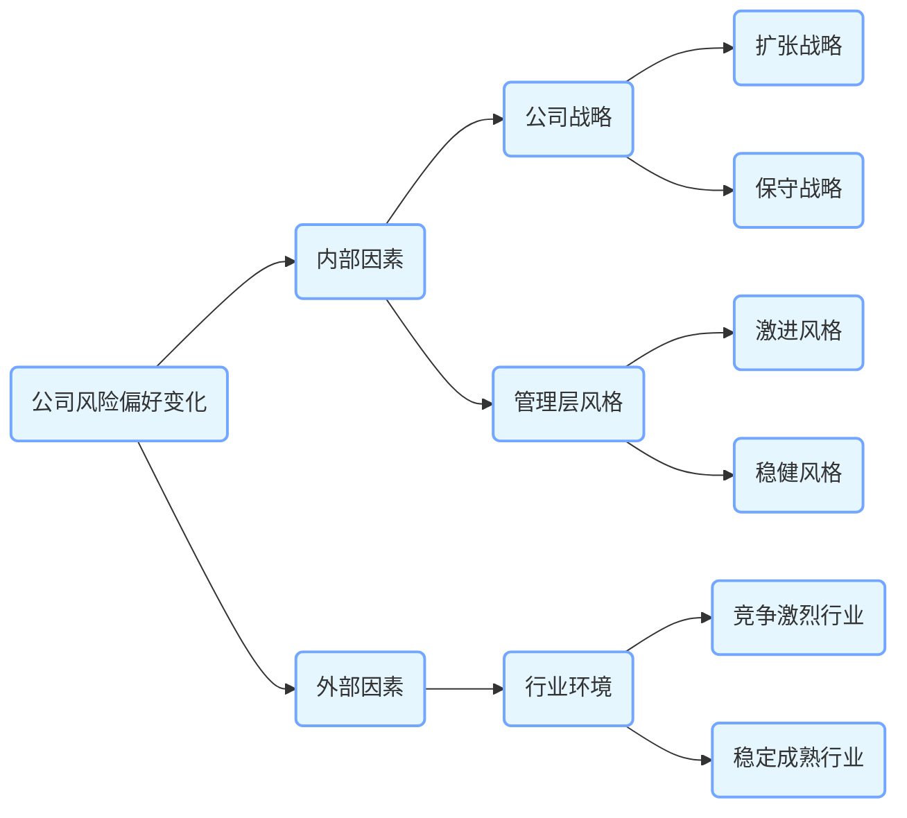

# 彼得林奇如何看待公司的风险偏好变化

> 关键词：彼得林奇、公司风险偏好变化、投资分析、财务指标、行业环境

> 摘要：本文深入探讨彼得林奇对于公司风险偏好变化的观点。彼得林奇作为投资界的传奇人物，其投资理念和对公司风险偏好的分析方法对投资者有着重要的指导意义。文章从背景介绍入手，阐述相关概念和联系，剖析核心算法原理及操作步骤，结合数学模型和公式进行说明，通过项目实战案例深入分析，探讨实际应用场景，推荐学习资源、开发工具和相关论文著作，最后总结未来发展趋势与挑战，并解答常见问题，为投资者理解公司风险偏好变化提供全面且深入的视角。

## 1. 背景介绍 
### 1.1 目的和范围
本文的目的在于深入研究彼得林奇对公司风险偏好变化的看法。彼得林奇在投资领域有着卓越的成就，他的投资理念和分析方法被广泛学习和应用。我们将探究他如何识别公司风险偏好的变化，以及这种变化对投资决策的影响。范围涵盖彼得林奇的投资著作、演讲及相关案例，通过对这些资料的分析，总结出他关于公司风险偏好变化的观点和分析方法。

### 1.2 预期读者
本文预期读者包括投资者、金融分析师、商学院学生以及对投资领域感兴趣的人士。对于投资者而言，了解彼得林奇对公司风险偏好变化的看法有助于优化投资组合，做出更明智的投资决策；金融分析师可以借鉴其分析方法，提升对公司的评估能力；商学院学生能够通过学习丰富专业知识；而对投资感兴趣的人士则可以借此深入了解投资领域的重要理念。

### 1.3 文档结构概述
本文首先介绍彼得林奇投资理念的背景，明确研究目的和范围。接着阐述与公司风险偏好变化相关的核心概念，分析它们之间的联系，并给出相应的文本示意图和 Mermaid 流程图。然后详细讲解彼得林奇分析公司风险偏好变化的核心算法原理和具体操作步骤，结合 Python 源代码进行说明。之后引入数学模型和公式，通过举例加深理解。再通过项目实战案例，展示如何运用这些方法进行实际分析。探讨公司风险偏好变化在实际投资中的应用场景，推荐相关的学习资源、开发工具和论文著作。最后总结未来发展趋势与挑战，解答常见问题，并提供扩展阅读和参考资料。

### 1.4 术语表
#### 1.4.1 核心术语定义
- **风险偏好**：公司在追求目标过程中，愿意承担风险的程度和对风险的态度。不同的公司由于战略、管理层风格等因素，风险偏好有所不同。
- **投资组合**：投资者将资金分散投资于多种资产，以达到降低风险、实现收益最大化的目的。彼得林奇强调合理构建投资组合的重要性。
- **财务杠杆**：公司通过债务融资来增加投资回报率的一种方式。高财务杠杆意味着公司承担较高的债务风险。

#### 1.4.2 相关概念解释
- **公司战略与风险偏好**：公司的战略决策会影响其风险偏好。例如，扩张型战略可能意味着公司愿意承担更高的风险以获取更大的市场份额；而保守型战略则倾向于降低风险，追求稳定的收益。
- **管理层风格与风险偏好**：管理层的个人风格和经验会对公司的风险偏好产生影响。激进的管理层可能更愿意尝试高风险的项目，而稳健的管理层则更注重风险控制。

#### 1.4.3 缩略词列表
- **ROE**：Return on Equity，净资产收益率，反映公司运用自有资本的效率。
- **EPS**：Earnings Per Share，每股收益，衡量公司盈利能力的重要指标。

## 2. 核心概念与联系 

### 核心概念原理
彼得林奇认为公司的风险偏好变化是一个动态的过程，受到多种因素的影响。公司的战略决策是影响风险偏好的重要因素之一。当公司决定进入新的市场或开展新的业务时，往往意味着愿意承担更高的风险。例如，一家传统制造业公司决定涉足新兴的科技领域，这可能需要大量的研发投入和市场开拓成本，风险相对较高。

管理层的风格也起着关键作用。积极进取的管理层可能更倾向于采取冒险的策略，追求快速的增长和高额的回报；而保守稳健的管理层则更注重风险控制，倾向于维持现有的业务模式和市场份额。

行业环境同样会影响公司的风险偏好。在一个竞争激烈、技术变革迅速的行业中，公司为了生存和发展，可能不得不采取较为激进的风险偏好，不断创新和拓展业务；而在一个相对稳定、成熟的行业中，公司可能更倾向于保守的风险偏好，以确保稳定的收益。

### 架构的文本示意图
```plaintext
公司风险偏好变化
|-- 内部因素
|   |-- 公司战略
|   |   |-- 扩张战略
|   |   |-- 保守战略
|   |-- 管理层风格
|       |-- 激进风格
|       |-- 稳健风格
|-- 外部因素
|   |-- 行业环境
|       |-- 竞争激烈行业
|       |-- 稳定成熟行业
```

### Mermaid 流程图


## 3. 核心算法原理 & 具体操作步骤 

### 核心算法原理
彼得林奇分析公司风险偏好变化的核心思想是综合考虑多个因素，通过对公司财务指标、业务发展情况、行业竞争态势等方面的分析，来判断公司风险偏好的变化趋势。

具体来说，我们可以通过以下几个关键步骤来实现：
1. **收集数据**：收集公司的财务报表、年报、行业研究报告等相关数据，了解公司的财务状况、业务模式和行业环境。
2. **分析财务指标**：计算一些关键的财务指标，如 ROE、EPS、资产负债率等，通过对这些指标的变化趋势进行分析，判断公司的盈利能力、偿债能力和风险水平。
3. **评估业务发展**：考察公司的业务拓展情况，包括新产品推出、市场份额变化、并购重组等，评估公司的战略决策和风险偏好。
4. **研究行业环境**：分析行业的竞争格局、技术发展趋势、政策法规等因素，了解行业对公司风险偏好的影响。

### 具体操作步骤及 Python 源代码实现

```python
import pandas as pd
import numpy as np

# 步骤 1: 收集数据
# 假设我们已经从财务报表中获取了相关数据，并存储在 CSV 文件中
def load_data(file_path):
    data = pd.read_csv(file_path)
    return data

# 步骤 2: 分析财务指标
def calculate_financial_metrics(data):
    # 计算 ROE
    data['ROE'] = data['Net Income'] / data['Shareholders Equity']
    # 计算 EPS
    data['EPS'] = data['Net Income'] / data['Number of Shares']
    # 计算资产负债率
    data['Debt-to-Asset Ratio'] = data['Total Debt'] / data['Total Assets']
    return data

# 步骤 3: 评估业务发展
def evaluate_business_development(data):
    # 假设业务发展情况可以通过销售额的增长率来衡量
    data['Sales Growth Rate'] = data['Sales'].pct_change()
    return data

# 步骤 4: 研究行业环境
# 这里我们简单假设行业环境数据已经存储在另一个 CSV 文件中
def analyze_industry_environment(industry_data):
    # 计算行业平均 ROE
    industry_avg_roe = industry_data['ROE'].mean()
    return industry_avg_roe

# 主函数
def main():
    # 加载公司数据
    company_data = load_data('company_financial_data.csv')
    # 分析财务指标
    company_data = calculate_financial_metrics(company_data)
    # 评估业务发展
    company_data = evaluate_business_development(company_data)
    # 加载行业数据
    industry_data = load_data('industry_data.csv')
    # 分析行业环境
    industry_avg_roe = analyze_industry_environment(industry_data)
    
    # 打印结果
    print("公司财务指标分析结果:")
    print(company_data[['ROE', 'EPS', 'Debt-to-Asset Ratio', 'Sales Growth Rate']])
    print(f"行业平均 ROE: {industry_avg_roe}")

if __name__ == "__main__":
    main()
```

### 代码解释
1. **load_data 函数**：用于从 CSV 文件中加载公司或行业的财务数据。
2. **calculate_financial_metrics 函数**：计算 ROE、EPS 和资产负债率等关键财务指标，并将结果添加到数据框中。
3. **evaluate_business_development 函数**：通过计算销售额的增长率来评估公司的业务发展情况。
4. **analyze_industry_environment 函数**：计算行业平均 ROE，作为评估公司在行业中地位的参考。
5. **main 函数**：调用上述函数完成数据加载、指标计算和结果输出。

## 4. 数学模型和公式 & 详细讲解 & 举例说明 

### 核心数学模型和公式
#### 1. 净资产收益率 (ROE)
$$ROE = \frac{Net\ Income}{Shareholders\ Equity}$$
ROE 反映了公司运用自有资本的效率，即股东每投入一元钱能够获得的收益。ROE 越高，说明公司的盈利能力越强。

#### 2. 每股收益 (EPS)
$$EPS = \frac{Net\ Income}{Number\ of\ Shares}$$
EPS 衡量了公司每股股票的盈利水平，是投资者关注的重要指标之一。EPS 越高，意味着股东能够获得的每股收益越多。

#### 3. 资产负债率
$$Debt - to - Asset\ Ratio = \frac{Total\ Debt}{Total\ Assets}$$
资产负债率反映了公司的负债水平，即公司的总资产中有多少是通过债务融资获得的。资产负债率越高，说明公司的债务风险越大。

### 详细讲解
- **ROE**：ROE 是一个综合性的指标，它受到多个因素的影响，如净利润率、总资产周转率和权益乘数。净利润率反映了公司的盈利能力，总资产周转率反映了公司的资产运营效率，权益乘数反映了公司的财务杠杆水平。通过对 ROE 的分解分析，可以深入了解公司的盈利驱动因素和风险状况。
- **EPS**：EPS 可以帮助投资者比较不同公司的盈利能力。但需要注意的是，EPS 的计算可能受到股本变动、会计政策等因素的影响，因此在分析时需要结合其他指标进行综合判断。
- **资产负债率**：资产负债率是衡量公司偿债能力的重要指标。一般来说，资产负债率过高意味着公司面临较大的债务压力，可能存在偿债风险；而资产负债率过低则可能说明公司没有充分利用财务杠杆来提高股东回报。

### 举例说明
假设公司 A 的净利润为 1000 万元，股东权益为 5000 万元，总股本为 2000 万股，总债务为 3000 万元，总资产为 8000 万元。

- **计算 ROE**：
$$ROE = \frac{1000}{5000} = 0.2 = 20\%$$
这表明公司 A 每投入一元自有资本能够获得 0.2 元的收益，盈利能力较强。

- **计算 EPS**：
$$EPS = \frac{1000}{2000} = 0.5$$
即公司 A 每股股票的盈利为 0.5 元。

- **计算资产负债率**：
$$Debt - to - Asset\ Ratio = \frac{3000}{8000} = 0.375 = 37.5\%$$
说明公司 A 的总资产中有 37.5% 是通过债务融资获得的，债务风险相对适中。

## 5. 项目实战：代码实际案例和详细解释说明 

### 5.1  开发环境搭建
为了运行上述代码，我们需要搭建以下开发环境：
1. **Python 环境**：建议使用 Python 3.7 及以上版本。可以从 Python 官方网站 (https://www.python.org/downloads/) 下载并安装。
2. **安装依赖库**：我们需要安装 pandas 和 numpy 库。可以使用以下命令进行安装：
```sh
pip install pandas numpy
```
3. **准备数据文件**：创建两个 CSV 文件 `company_financial_data.csv` 和 `industry_data.csv`，分别存储公司和行业的财务数据。文件格式可以参考以下示例：

`company_financial_data.csv`
```plaintext
Year,Net Income,Shareholders Equity,Number of Shares,Total Debt,Total Assets,Sales
2018,1000,5000,2000,3000,8000,5000
2019,1200,5500,2000,3200,8500,5500
2020,1500,6000,2000,3500,9000,6000
```

`industry_data.csv`
```plaintext
Company,ROE
Company A,0.2
Company B,0.18
Company C,0.22
```

### 5.2  源代码详细实现和代码解读
```python
import pandas as pd
import numpy as np

# 步骤 1: 收集数据
# 假设我们已经从财务报表中获取了相关数据，并存储在 CSV 文件中
def load_data(file_path):
    data = pd.read_csv(file_path)
    return data

# 步骤 2: 分析财务指标
def calculate_financial_metrics(data):
    # 计算 ROE
    data['ROE'] = data['Net Income'] / data['Shareholders Equity']
    # 计算 EPS
    data['EPS'] = data['Net Income'] / data['Number of Shares']
    # 计算资产负债率
    data['Debt-to-Asset Ratio'] = data['Total Debt'] / data['Total Assets']
    return data

# 步骤 3: 评估业务发展
def evaluate_business_development(data):
    # 假设业务发展情况可以通过销售额的增长率来衡量
    data['Sales Growth Rate'] = data['Sales'].pct_change()
    return data

# 步骤 4: 研究行业环境
# 这里我们简单假设行业环境数据已经存储在另一个 CSV 文件中
def analyze_industry_environment(industry_data):
    # 计算行业平均 ROE
    industry_avg_roe = industry_data['ROE'].mean()
    return industry_avg_roe

# 主函数
def main():
    # 加载公司数据
    company_data = load_data('company_financial_data.csv')
    # 分析财务指标
    company_data = calculate_financial_metrics(company_data)
    # 评估业务发展
    company_data = evaluate_business_development(company_data)
    # 加载行业数据
    industry_data = load_data('industry_data.csv')
    # 分析行业环境
    industry_avg_roe = analyze_industry_environment(industry_data)
    
    # 打印结果
    print("公司财务指标分析结果:")
    print(company_data[['ROE', 'EPS', 'Debt-to-Asset Ratio', 'Sales Growth Rate']])
    print(f"行业平均 ROE: {industry_avg_roe}")

if __name__ == "__main__":
    main()
```

### 代码解读与分析
- **load_data 函数**：使用 pandas 的 `read_csv` 函数从 CSV 文件中读取数据，并返回一个数据框。
- **calculate_financial_metrics 函数**：根据前面介绍的公式计算 ROE、EPS 和资产负债率，并将结果添加到数据框中。
- **evaluate_business_development 函数**：使用 pandas 的 `pct_change` 函数计算销售额的增长率，作为评估业务发展的指标。
- **analyze_industry_environment 函数**：计算行业数据中 ROE 的平均值，作为行业平均 ROE。
- **main 函数**：依次调用上述函数完成数据加载、指标计算和结果输出。通过分析输出结果，我们可以了解公司的财务状况、业务发展情况以及在行业中的地位，从而判断公司的风险偏好变化。

## 6. 实际应用场景 
### 投资决策
投资者在选择投资标的时，可以运用彼得林奇分析公司风险偏好变化的方法，评估公司的风险水平和发展潜力。如果一家公司的 ROE 持续上升，资产负债率合理，业务发展迅速，且在行业中具有竞争优势，说明公司的风险偏好较为合理，可能是一个不错的投资选择。相反，如果公司的财务指标恶化，业务发展停滞，可能意味着公司的风险偏好出现问题，投资者需要谨慎考虑。

### 风险管理
公司管理层可以通过分析自身的风险偏好变化，制定合理的风险管理策略。如果公司的风险偏好过于激进，可能导致财务风险增加，此时管理层可以适当调整战略，降低债务水平，优化业务结构；如果风险偏好过于保守，可能会错失发展机会，管理层可以考虑加大研发投入，拓展新的市场。

### 行业分析
分析师可以运用这些方法对不同行业的公司进行比较分析，了解行业内公司的风险偏好差异。例如，在科技行业，由于技术变革迅速，公司的风险偏好普遍较高，更倾向于进行创新和扩张；而在公用事业行业，公司的风险偏好相对较低，更注重稳定的现金流和资产安全。

## 7. 工具和资源推荐
### 7.1 学习资源推荐
#### 7.1.1 书籍推荐
- 《彼得林奇的成功投资》：彼得林奇的经典著作，详细介绍了他的投资理念和方法，包括如何分析公司、选择股票等。
- 《战胜华尔街》：进一步阐述了彼得林奇的投资策略，通过实际案例展示了他如何在不同的市场环境中取得成功。
- 《财务报表分析与证券定价》：帮助读者深入理解财务报表，掌握分析公司财务状况的方法和技巧。

#### 7.1.2 在线课程
- Coursera 上的“投资学原理”课程：系统介绍投资学的基本概念和方法，包括资产定价、投资组合管理等内容。
- edX 上的“财务报表分析”课程：专门讲解财务报表的分析方法，对理解公司的财务状况有很大帮助。

#### 7.1.3 技术博客和网站
- Seeking Alpha：提供丰富的投资分析文章和研究报告，涵盖了各种行业和公司。
- Motley Fool：一个知名的投资网站，提供投资建议、市场分析和公司研究等内容。

### 7.2 开发工具框架推荐
#### 7.2.1 IDE和编辑器
- PyCharm：一款专业的 Python 集成开发环境，具有代码编辑、调试、自动补全等功能，适合开发数据分析和投资相关的 Python 程序。
- Jupyter Notebook：交互式的开发环境，方便进行数据探索和可视化，对于分析公司财务数据非常有用。

#### 7.2.2 调试和性能分析工具
- pdb：Python 自带的调试工具，可以帮助开发者定位代码中的问题。
- cProfile：用于分析 Python 程序的性能，找出程序中的瓶颈。

#### 7.2.3 相关框架和库
- pandas：强大的数据处理和分析库，提供了丰富的数据结构和函数，方便处理和分析公司财务数据。
- numpy：用于科学计算的基础库，提供了高效的数组操作和数学函数。
- matplotlib：用于数据可视化的库，可以绘制各种图表，直观展示公司财务指标的变化趋势。

### 7.3 相关论文著作推荐
#### 7.3.1 经典论文
- “The Cross - Section of Expected Stock Returns” by Eugene F. Fama and Kenneth R. French：提出了著名的 Fama - French 三因子模型，对资产定价理论产生了深远影响。
- “Capital Asset Pricing Model: Theory and Evidence” by Eugene F. Fama and Kenneth R. French：对资本资产定价模型进行了深入的研究和分析。

#### 7.3.2 最新研究成果
- 关注《Journal of Finance》、《Review of Financial Studies》等顶级金融学术期刊，了解关于公司风险偏好、投资决策等方面的最新研究成果。

#### 7.3.3 应用案例分析
- 一些金融研究机构和咨询公司会发布关于公司风险偏好分析的应用案例报告，可以通过网络搜索获取这些报告，学习实际案例中的分析方法和经验。

## 8. 总结：未来发展趋势与挑战
### 未来发展趋势
- **数据驱动的分析方法**：随着大数据和人工智能技术的发展，未来对公司风险偏好变化的分析将更加依赖于数据驱动的方法。通过收集和分析大量的公司财务数据、市场数据和行业数据，可以更准确地识别公司风险偏好的变化趋势。
- **跨学科研究**：公司风险偏好变化的分析涉及到金融学、管理学、统计学等多个学科领域。未来的研究将更加注重跨学科的融合，综合运用不同学科的理论和方法，提高分析的准确性和有效性。
- **可持续发展因素的考虑**：在全球可持续发展的背景下，公司的环境、社会和治理 (ESG) 因素将越来越受到关注。未来在分析公司风险偏好变化时，需要考虑这些可持续发展因素对公司风险和价值的影响。

### 挑战
- **数据质量和获取难度**：准确的数据分析依赖于高质量的数据。然而，公司财务数据的质量可能存在问题，如数据造假、信息披露不完整等。此外，获取一些关键数据可能存在难度，特别是对于一些非公开公司或新兴行业的公司。
- **市场不确定性**：金融市场充满了不确定性，宏观经济环境、政策法规变化、突发事件等因素都可能对公司的风险偏好产生影响。如何在复杂多变的市场环境中准确预测公司风险偏好的变化是一个挑战。
- **模型的局限性**：现有的分析模型和方法可能存在一定的局限性，无法完全捕捉公司风险偏好变化的复杂性。需要不断改进和完善模型，提高模型的适应性和准确性。

## 9. 附录：常见问题与解答
### 问题 1：如何判断公司的风险偏好是激进还是保守？
答：可以通过分析公司的财务指标、业务发展策略等方面来判断。如果公司的资产负债率较高、研发投入较大、频繁进行并购重组等，可能说明公司的风险偏好较为激进；相反，如果公司的资产负债率较低、业务发展较为稳健、注重现金流管理等，可能说明公司的风险偏好较为保守。

### 问题 2：ROE 高是否一定意味着公司的风险偏好合理？
答：不一定。ROE 高可能意味着公司的盈利能力较强，但也可能是由于高财务杠杆导致的。如果公司通过大量举债来提高 ROE，可能会增加公司的债务风险。因此，在分析 ROE 时，需要结合其他指标，如资产负债率、现金流等，综合判断公司的风险偏好是否合理。

### 问题 3：行业平均 ROE 对分析公司风险偏好有什么作用？
答：行业平均 ROE 可以作为一个参考指标，帮助我们了解公司在行业中的地位。如果公司的 ROE 高于行业平均水平，说明公司的盈利能力较强，可能具有一定的竞争优势；如果公司的 ROE 低于行业平均水平，可能需要进一步分析原因，判断公司的风险偏好是否存在问题。

## 10. 扩展阅读 & 参考资料
### 扩展阅读
- 《聪明的投资者》：本杰明·格雷厄姆的经典著作，强调价值投资的理念，对投资者有很大的启发。
- 《金融炼金术》：乔治·索罗斯的著作，介绍了他的投资哲学和方法，特别是反身性理论。

### 参考资料
- 彼得林奇的相关著作和演讲资料。
- 金融学术期刊上发表的关于公司风险偏好、投资分析等方面的论文。
- 金融数据提供商（如 Bloomberg、Wind 等）提供的公司财务数据和行业研究报告。

作者：AI天才研究院/AI Genius Institute & 禅与计算机程序设计艺术 /Zen And The Art of Computer Programming