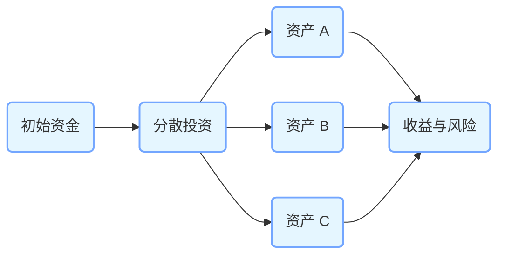

# 彼得林奇如何看待分散投资

> 关键词：彼得林奇、分散投资、投资策略、集中投资、风险控制

> 摘要：本文深入探讨了投资大师彼得林奇对于分散投资的观点。彼得林奇作为投资界的传奇人物，其投资理念和方法对众多投资者产生了深远影响。文章将详细介绍分散投资的背景知识，分析彼得林奇眼中分散投资的利弊，阐述其核心观点和相关投资策略，并通过实际案例进行说明。同时，探讨彼得林奇的观点在不同市场环境下的应用，以及对投资者的启示。最后，总结分散投资在投资组合管理中的重要性和未来发展趋势，帮助投资者更好地理解和运用这一投资策略。

## 1. 背景介绍 
### 1.1 目的和范围
本部分旨在深入剖析彼得林奇对分散投资的看法。通过研究他的投资理念、实际操作案例等，全面了解他在分散投资方面的独特见解，为投资者提供有价值的参考。范围涵盖彼得林奇在其投资生涯中关于分散投资的言论、著作以及实际投资组合的分析。

### 1.2 预期读者
本文预期读者包括广大投资者，无论是初入投资领域的新手，还是有一定经验的专业投资者，都能从彼得林奇对分散投资的观点中获得启发。同时，也适合金融专业的学生和研究人员，帮助他们深入了解投资策略和投资大师的思想。

### 1.3 文档结构概述
本文将首先介绍分散投资的基本概念和相关背景知识，为理解彼得林奇的观点奠定基础。接着，详细阐述彼得林奇对分散投资的具体看法，包括其利弊分析和核心观点。然后，通过实际案例分析彼得林奇在投资中如何运用分散投资策略。之后，探讨彼得林奇的观点在不同市场环境下的应用和对投资者的启示。最后，总结分散投资的重要性和未来发展趋势，并提供一些常见问题的解答和扩展阅读资料。

### 1.4 术语表
#### 1.4.1 核心术语定义
- **分散投资**：将资金分散投资于不同的资产、行业、公司或市场，以降低单一投资带来的风险。
- **集中投资**：将大部分资金集中投资于少数几只股票或资产，以追求更高的回报。
- **投资组合**：投资者持有的各种资产的集合，旨在实现特定的投资目标。

#### 1.4.2 相关概念解释
- **风险分散原理**：通过投资多种不同的资产，使投资组合的风险低于单一资产的风险。这是因为不同资产的价格波动往往不完全相关，当某些资产表现不佳时，其他资产可能表现较好，从而降低整体投资组合的风险。
- **多元化投资**：不仅包括分散投资于不同的股票，还包括投资于不同的资产类别，如债券、基金、房地产等，以进一步降低风险。

#### 1.4.3 缩略词列表
- **ETF**：交易型开放式指数基金（Exchange Traded Fund）
- **PEG**：市盈率相对盈利增长比率（Price/Earnings to Growth Ratio）

## 2. 核心概念与联系 

### 分散投资的基本原理
分散投资的核心原理是基于风险分散的思想。假设我们有两个资产 A 和 B，它们的价格波动不完全相关。当资产 A 的价格下跌时，资产 B 的价格可能保持稳定或上涨，这样就可以降低整个投资组合的风险。

以下是一个简单的文本示意图来解释分散投资的原理：

```
投资组合
|-- 资产 A
|-- 资产 B
|-- 资产 C
...
```

这个示意图表示一个投资组合由多个不同的资产组成。通过将资金分散到这些不同的资产上，可以降低单一资产价格波动对整个投资组合的影响。

### Mermaid 流程图


这个流程图展示了分散投资的过程。初始资金被分散投资到多个不同的资产上，每个资产都会产生相应的收益和风险，最终这些资产的收益和风险共同构成了整个投资组合的收益和风险。

### 彼得林奇对分散投资的观点核心
彼得林奇并不完全反对分散投资，但他认为过度分散投资可能会导致投资组合过于复杂，难以进行有效的管理和跟踪。他主张投资者应该根据自己的能力和精力，合理地进行分散投资。他更强调对所投资的公司有深入的了解，而不是仅仅为了分散而分散。

## 3. 核心算法原理 & 具体操作步骤 

### 分散投资的简单算法原理
在简单的分散投资中，我们可以根据不同资产的预期风险和收益，按照一定的比例分配资金。假设我们有三种资产：股票、债券和现金，我们可以根据自己的风险承受能力和投资目标，确定它们在投资组合中的比例。

以下是一个使用 Python 实现的简单分散投资资金分配的示例代码：

```python
# 定义投资组合中不同资产的比例
stock_ratio = 0.6
bond_ratio = 0.3
cash_ratio = 0.1

# 假设初始投资资金为 10000 元
initial_funds = 10000

# 计算分配到不同资产的资金
stock_funds = initial_funds * stock_ratio
bond_funds = initial_funds * bond_ratio
cash_funds = initial_funds * cash_ratio

# 输出结果
print(f"分配到股票的资金: {stock_funds} 元")
print(f"分配到债券的资金: {bond_funds} 元")
print(f"分配到现金的资金: {cash_funds} 元")
```

### 具体操作步骤
1. **确定投资目标和风险承受能力**：投资者首先需要明确自己的投资目标，是追求长期的资本增值、稳定的收益，还是短期的投机获利。同时，评估自己的风险承受能力，包括心理承受能力和财务承受能力。
2. **选择投资资产类别**：根据投资目标和风险承受能力，选择适合的投资资产类别，如股票、债券、基金、房地产等。
3. **研究和分析资产**：对选择的资产进行深入的研究和分析，了解其基本面、市场前景、风险特征等。
4. **确定资产分配比例**：根据研究和分析的结果，确定不同资产在投资组合中的分配比例。可以参考一些经典的资产配置模型，如 60/40 模型（60% 股票和 40% 债券）。
5. **定期调整投资组合**：随着市场环境的变化和资产价格的波动，投资组合的实际比例可能会偏离初始设定的比例。因此，需要定期对投资组合进行调整，以保持资产分配的合理性。

## 4. 数学模型和公式 & 详细讲解 & 举例说明 

### 投资组合的风险计算
投资组合的风险可以用方差或标准差来衡量。假设我们有一个由两种资产 A 和 B 组成的投资组合，它们的权重分别为 $w_A$ 和 $w_B$，方差分别为 $\sigma_A^2$ 和 $\sigma_B^2$，协方差为 $\sigma_{AB}$，则投资组合的方差 $\sigma_p^2$ 可以用以下公式计算：

$$\sigma_p^2 = w_A^2\sigma_A^2 + w_B^2\sigma_B^2 + 2w_Aw_B\sigma_{AB}$$

其中，协方差 $\sigma_{AB}$ 表示两种资产价格波动的相关性。当 $\sigma_{AB} > 0$ 时，两种资产的价格波动正相关；当 $\sigma_{AB} < 0$ 时，两种资产的价格波动负相关；当 $\sigma_{AB} = 0$ 时，两种资产的价格波动不相关。

### 举例说明
假设资产 A 的预期收益率为 10%，标准差为 20%；资产 B 的预期收益率为 8%，标准差为 15%；两种资产的协方差为 0.01。我们将资金按照 60% 和 40% 的比例分别投资于资产 A 和资产 B。

首先，计算投资组合的预期收益率 $E(R_p)$：

$$E(R_p) = w_AE(R_A) + w_BE(R_B) = 0.6\times0.1 + 0.4\times0.08 = 0.092 = 9.2\%$$

然后，计算投资组合的方差 $\sigma_p^2$：

$$\sigma_p^2 = 0.6^2\times0.2^2 + 0.4^2\times0.15^2 + 2\times0.6\times0.4\times0.01 = 0.0252$$

最后，计算投资组合的标准差 $\sigma_p$：

$$\sigma_p = \sqrt{0.0252} \approx 0.159 = 15.9\%$$

通过这个例子可以看出，通过分散投资，我们可以在一定程度上降低投资组合的风险（投资组合的标准差小于资产 A 的标准差），同时获得一定的预期收益率。

## 5. 项目实战：代码实际案例和详细解释说明 

### 5.1  开发环境搭建
在进行分散投资的项目实战时，我们可以使用 Python 作为开发语言。以下是搭建开发环境的步骤：

1. **安装 Python**：从 Python 官方网站（https://www.python.org/downloads/）下载并安装适合你操作系统的 Python 版本。
2. **安装必要的库**：我们需要安装一些用于数据处理、分析和可视化的库，如 Pandas、Numpy、Matplotlib 等。可以使用以下命令进行安装：

```sh
pip install pandas numpy matplotlib
```

### 5.2  源代码详细实现和代码解读
以下是一个使用 Python 实现简单分散投资组合回测的示例代码：

```python
import pandas as pd
import numpy as np
import matplotlib.pyplot as plt

# 模拟三种资产的历史收益率数据
np.random.seed(0)
num_periods = 100
returns_asset1 = np.random.normal(0.01, 0.02, num_periods)
returns_asset2 = np.random.normal(0.008, 0.015, num_periods)
returns_asset3 = np.random.normal(0.006, 0.01, num_periods)

# 创建 DataFrame 存储收益率数据
returns_df = pd.DataFrame({
    'Asset1': returns_asset1,
    'Asset2': returns_asset2,
    'Asset3': returns_asset3
})

# 定义投资组合的权重
weights = np.array([0.4, 0.3, 0.3])

# 计算投资组合的每日收益率
portfolio_returns = returns_df.dot(weights)

# 计算累计收益率
cumulative_returns = (1 + portfolio_returns).cumprod()

# 绘制累计收益率曲线
plt.figure(figsize=(10, 6))
plt.plot(cumulative_returns)
plt.title('Cumulative Returns of the Portfolio')
plt.xlabel('Period')
plt.ylabel('Cumulative Return')
plt.show()
```

### 代码解读与分析
1. **数据模拟**：使用 `np.random.normal` 函数模拟三种资产的历史收益率数据，并将其存储在 `returns_df` 中。
2. **定义权重**：定义投资组合中三种资产的权重，这里分别为 0.4、0.3 和 0.3。
3. **计算投资组合收益率**：使用 `dot` 方法计算投资组合的每日收益率。
4. **计算累计收益率**：使用 `cumprod` 方法计算投资组合的累计收益率。
5. **绘制图表**：使用 `matplotlib` 库绘制投资组合的累计收益率曲线，直观地展示投资组合的表现。

通过这个示例，我们可以看到如何使用 Python 实现简单的分散投资组合回测，帮助我们评估投资组合的表现。

## 6. 实际应用场景 
### 个人投资者
对于个人投资者来说，分散投资是一种有效的风险控制方法。个人投资者可以将资金分散投资于不同的股票、基金、债券等资产，降低单一投资的风险。例如，一个年轻的投资者可以将一部分资金投资于股票型基金，以追求长期的资本增值；另一部分资金投资于债券型基金，以提供稳定的收益和降低风险。

### 机构投资者
机构投资者如基金公司、保险公司等，通常会管理大规模的资金。他们会采用更加复杂的分散投资策略，将资金分散投资于全球不同的市场、行业和资产类别。例如，一家全球基金可能会投资于美国、欧洲、亚洲等不同地区的股票和债券，同时还会投资于一些另类资产，如房地产、大宗商品等，以实现多元化的投资组合。

### 不同市场环境下的应用
在牛市中，投资者可以适当增加股票的投资比例，以获取更高的收益。但为了避免市场回调带来的风险，仍然需要进行一定程度的分散投资。在熊市中，投资者可以增加债券和现金的投资比例，以降低风险，同时可以寻找一些被低估的股票进行投资。

## 7. 工具和资源推荐
### 7.1 学习资源推荐
#### 7.1.1 书籍推荐
- 《彼得林奇的成功投资》：彼得林奇的经典著作，详细介绍了他的投资理念和方法，包括对分散投资的看法。
- 《聪明的投资者》：本杰明·格雷厄姆的经典投资书籍，强调了价值投资和分散投资的重要性。
- 《漫步华尔街》：伯顿·马尔基尔的著作，介绍了各种投资策略和市场理论，对分散投资有深入的探讨。

#### 7.1.2 在线课程
- Coursera 上的《投资学》课程：由知名大学的教授授课，涵盖了投资组合理论、分散投资等内容。
- Udemy 上的《股票投资入门》课程：适合初学者，介绍了股票投资的基本知识和分散投资策略。

#### 7.1.3 技术博客和网站
- 雪球网：国内知名的投资社区，有很多投资者分享自己的投资经验和对分散投资的看法。
- Seeking Alpha：国外的投资研究网站，提供各种投资分析和评论文章，对分散投资有深入的研究。

### 7.2 开发工具框架推荐
#### 7.2.1 IDE和编辑器
- PyCharm：功能强大的 Python 集成开发环境，适合进行数据分析和投资组合回测等开发工作。
- Jupyter Notebook：交互式的开发环境，方便进行数据探索和可视化，适合初学者。

#### 7.2.2 调试和性能分析工具
- PDB：Python 自带的调试工具，用于调试 Python 代码。
- cProfile：Python 的性能分析工具，用于分析代码的性能瓶颈。

#### 7.2.3 相关框架和库
- Pandas：用于数据处理和分析的 Python 库，提供了丰富的数据结构和函数。
- Numpy：用于科学计算的 Python 库，提供了高效的数组操作和数学函数。
- Matplotlib：用于数据可视化的 Python 库，可绘制各种图表。

### 7.3 相关论文著作推荐
#### 7.3.1 经典论文
- Harry Markowitz 的《Portfolio Selection》：提出了现代投资组合理论，奠定了分散投资的理论基础。
- William Sharpe 的《Capital Asset Prices: A Theory of Market Equilibrium Under Conditions of Risk》：提出了资本资产定价模型（CAPM），对投资组合的风险和收益进行了深入分析。

#### 7.3.2 最新研究成果
- 一些顶级金融学术期刊，如《Journal of Finance》《Review of Financial Studies》等，经常发表关于分散投资和投资组合管理的最新研究成果。

#### 7.3.3 应用案例分析
- 一些金融机构和研究机构会发布关于分散投资的应用案例分析报告，这些报告可以帮助投资者更好地理解如何在实际中应用分散投资策略。

## 8. 总结：未来发展趋势与挑战
### 未来发展趋势
- **智能化分散投资**：随着人工智能和机器学习技术的发展，未来的分散投资将更加智能化。投资机构可以利用大数据和人工智能算法，对市场进行实时监测和分析，自动调整投资组合的资产配置，以实现最优的风险收益比。
- **全球多元化投资**：随着全球经济的一体化和金融市场的互联互通，投资者将更加注重全球多元化投资。通过投资于全球不同的市场和资产类别，可以进一步降低投资组合的风险。
- **社会责任投资与分散投资的结合**：越来越多的投资者开始关注社会责任投资，即投资于那些具有良好社会和环境影响的公司。未来，社会责任投资将与分散投资相结合，形成更加多元化和可持续的投资组合。

### 挑战
- **市场不确定性增加**：全球政治、经济环境的不确定性增加，如贸易摩擦、地缘政治冲突等，给投资市场带来了更大的波动和风险。这使得分散投资的效果受到一定的影响，投资者需要更加灵活地调整投资组合。
- **技术变革带来的挑战**：虽然技术的发展为分散投资带来了更多的机会，但也带来了一些挑战。例如，人工智能算法的复杂性和不透明性可能导致投资决策的失误，投资者需要加强对技术的理解和应用能力。
- **投资者教育不足**：很多投资者对分散投资的理解还不够深入，缺乏正确的投资理念和方法。这可能导致他们在实际投资中无法有效地运用分散投资策略，甚至做出错误的投资决策。因此，加强投资者教育是非常必要的。

## 9. 附录：常见问题与解答
### 问题 1：分散投资是否意味着要投资尽可能多的资产？
解答：不是的。彼得林奇认为过度分散投资可能会导致投资组合过于复杂，难以进行有效的管理和跟踪。投资者应该根据自己的能力和精力，合理地进行分散投资。一般来说，投资 10 - 15 只不同的股票就可以达到较好的分散效果。

### 问题 2：分散投资能否完全消除风险？
解答：分散投资不能完全消除风险，只能降低非系统性风险。系统性风险是由宏观经济、政治等因素引起的，无法通过分散投资来消除。例如，在金融危机期间，大多数资产的价格都会下跌，即使进行了分散投资，投资组合也会受到影响。

### 问题 3：如何确定投资组合中不同资产的比例？
解答：确定投资组合中不同资产的比例需要考虑多个因素，如投资目标、风险承受能力、市场环境等。投资者可以参考一些经典的资产配置模型，如 60/40 模型（60% 股票和 40% 债券），也可以根据自己的情况进行调整。同时，需要定期对投资组合进行评估和调整，以适应市场的变化。

## 10. 扩展阅读 & 参考资料
- 《金融市场与金融机构》，作者：弗雷德里克·S·米什金等
- 《投资组合管理：理论与应用》，作者：弗兰克·J·法博齐等
- 彼得林奇的官方网站和相关采访资料

作者：AI天才研究院/AI Genius Institute & 禅与计算机程序设计艺术 /Zen And The Art of Computer Programming