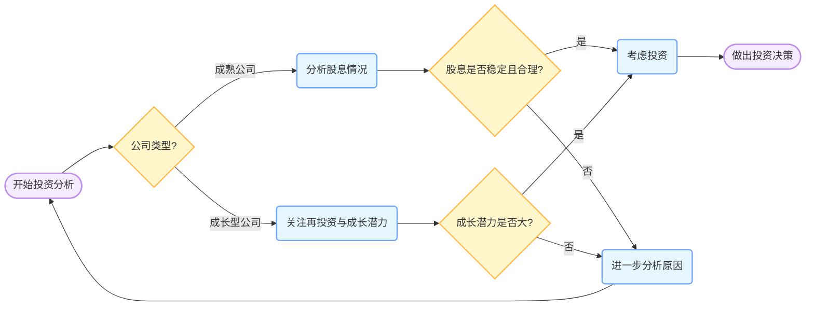

# 彼得林奇如何看待股息

> 关键词：彼得林奇、股息、股票投资、股息率、价值评估

> 摘要：本文深入探讨彼得林奇对股息的看法。彼得林奇作为投资界的传奇人物，其投资理念影响深远。股息在股票投资中是一个关键因素，了解彼得林奇对股息的观点，有助于投资者更好地理解股票投资的本质和策略。文章将从彼得林奇投资理念的背景出发，阐述他对股息的核心观点，分析股息在其投资决策中的作用，结合实际案例展示其应用，探讨相关数学模型，介绍实际应用场景、工具和资源，并对未来发展趋势与挑战进行总结，最后解答常见问题，提供扩展阅读与参考资料，帮助投资者全面掌握相关知识。

## 1. 背景介绍 
### 1.1 目的和范围
本文的目的是全面且深入地研究彼得林奇对于股息的看法。范围涵盖彼得林奇投资思想中与股息相关的各个方面，包括股息在其投资决策中的地位、对不同类型公司股息的态度、股息与公司价值和成长的关系等。通过对这些内容的研究，帮助投资者更好地理解彼得林奇的投资理念，并且能够将相关思想应用到实际的股票投资决策中。

### 1.2 预期读者
本文预期读者包括对股票投资有兴趣的初学者，他们可以通过本文初步了解彼得林奇的投资理念以及股息在投资中的重要性；也包括有一定投资经验的投资者，他们可以从本文中获取更深入的关于股息分析和投资决策的思路；同时也适合金融专业的学生和研究人员，作为研究投资理论和实践的参考资料。

### 1.3 文档结构概述
本文首先介绍背景信息，包括目的、预期读者和文档结构。接着阐述彼得林奇投资理念的核心概念以及股息在其中的联系，给出相应的原理和架构示意图。然后讲解与股息相关的核心算法原理和具体操作步骤，用Python代码进行详细阐述。之后介绍相关的数学模型和公式，并举例说明。再通过项目实战展示实际案例和详细解释。随后探讨股息在实际应用中的场景。接着推荐学习、开发相关的工具和资源。最后总结未来发展趋势与挑战，解答常见问题，并提供扩展阅读与参考资料。

### 1.4 术语表
#### 1.4.1 核心术语定义
- **股息**：股息是指股份公司从提取了公积金、公益金的税后利润中按照股息率派发给股东的收益。简单来说，就是公司盈利后分给股东的一部分钱。
- **股息率**：股息率是股息与股票价格之间的比率。计算公式为：股息率 = 股息 / 股票价格 * 100%。它是衡量股票投资收益的一个重要指标。
- **股票投资**：指企业或个人用积累起来的货币购买股票，借以获得收益的行为。

#### 1.4.2 相关概念解释
- **公司盈利**：公司在一定时期内通过经营活动所获得的利润。公司盈利是股息的来源，只有公司有盈利才有可能向股东派发股息。
- **股东权益**：股东基于其股东资格而享有的，从公司获得经济利益，并参与公司经营管理的权利。股息是股东权益的一部分回报。

#### 1.4.3 缩略词列表
目前本文中无相关缩略词。

## 2. 核心概念与联系 

### 2.1 彼得林奇投资理念核心概念
彼得林奇的投资理念强调从生活中发现投资机会，关注公司的基本面，包括公司的业务模式、竞争力、管理层等。他认为普通投资者可以通过自己的日常观察和研究，找到被市场低估的优质公司。

### 2.2 股息在彼得林奇投资理念中的地位
在彼得林奇的投资理念中，股息是一个重要的参考因素，但不是唯一的决定因素。他认为股息可以作为衡量公司财务健康状况和管理层对股东回报态度的一个指标。对于成熟的、盈利稳定的公司，股息的派发是公司回馈股东的一种方式，也反映了公司的盈利能力和现金流状况。而对于一些处于快速成长阶段的公司，可能会将利润更多地用于再投资以实现业务的扩张，股息可能较低甚至没有。

### 2.3 核心概念原理和架构的文本示意图
彼得林奇的投资决策是一个综合的过程，股息在其中起到一定的辅助作用。其核心架构可以描述为：以公司基本面分析为核心，包括公司的业务、财务、管理层等方面。股息作为财务指标的一部分，与其他因素相互关联。公司的盈利状况决定了是否有能力派发股息，而股息的派发情况又会影响投资者对公司的信心和股票的市场表现。同时，公司的成长前景也会影响股息政策，成长型公司可能更倾向于保留利润用于再投资，而成熟公司则更注重股息回报。

### 2.4 Mermaid 流程图


## 3. 核心算法原理 & 具体操作步骤 

### 3.1 股息率计算算法原理
股息率是衡量股息在投资中重要性的一个关键指标。其计算原理是将公司每股股息除以当前股票价格，再乘以 100% 得到百分比形式的股息率。公式为：$股息率 = \frac{每股股息}{股票价格} \times 100\%$

### 3.2 Python 代码实现股息率计算
```python
def calculate_dividend_yield(dividend_per_share, stock_price):
    """
    此函数用于计算股息率
    :param dividend_per_share: 每股股息
    :param stock_price: 股票价格
    :return: 股息率（百分比形式）
    """
    if stock_price == 0:
        raise ValueError("股票价格不能为 0")
    dividend_yield = (dividend_per_share / stock_price) * 100
    return dividend_yield

# 示例数据
dividend_per_share = 2.0
stock_price = 50.0

# 计算股息率
result = calculate_dividend_yield(dividend_per_share, stock_price)
print(f"股息率为: {result}%")
```
### 3.3 具体操作步骤
1. **获取数据**：通过金融数据平台、公司财务报表等渠道获取每股股息和当前股票价格的数据。
2. **数据验证**：检查获取的数据是否合理，例如股票价格不能为 0。
3. **调用函数计算**：将每股股息和股票价格作为参数传入上述 `calculate_dividend_yield` 函数进行计算。
4. **结果分析**：根据计算得到的股息率，结合市场情况和公司基本面进行分析。一般来说，较高的股息率可能表示股票具有较高的投资价值，但也需要考虑公司的盈利稳定性和未来发展前景。

## 4. 数学模型和公式 & 详细讲解 & 举例说明 

### 4.1 股息贴现模型（DDM）
股息贴现模型是一种评估股票内在价值的方法，其基本思想是股票的价值等于其未来所有股息的现值之和。公式为：
$$V = \sum_{t=1}^{\infty} \frac{D_t}{(1 + r)^t}$$
其中：
- $V$ 表示股票的内在价值
- $D_t$ 表示第 $t$ 期的股息
- $r$ 表示贴现率，通常可以用投资者要求的回报率来表示

### 4.2 详细讲解
股息贴现模型的核心在于将未来的股息按照一定的贴现率折现到当前时刻，从而得到股票的内在价值。贴现率反映了投资者对投资风险的预期和对回报的要求。如果计算得到的股票内在价值高于当前市场价格，则认为该股票被低估，具有投资价值；反之则被高估。

### 4.3 举例说明
假设某公司预计未来每年的股息保持稳定，均为 3 元，投资者要求的回报率为 10%。根据股息贴现模型，该股票的内在价值为：
$$V = \frac{3}{1 + 0.1} + \frac{3}{(1 + 0.1)^2} + \frac{3}{(1 + 0.1)^3} + \cdots$$
这是一个无穷等比数列求和的问题，根据等比数列求和公式 $S = \frac{a_1}{1 - q}$（其中 $a_1$ 为首项，$q$ 为公比），这里 $a_1 = \frac{3}{1.1}$，$q = \frac{1}{1.1}$，则：
$$V = \frac{\frac{3}{1.1}}{1 - \frac{1}{1.1}} = \frac{3}{0.1} = 30$$（元）
如果当前该股票的市场价格为 25 元，低于其内在价值 30 元，则从股息贴现模型的角度来看，该股票被低估，具有投资价值。

## 5. 项目实战：代码实际案例和详细解释说明 

### 5.1 开发环境搭建
1. **安装 Python**：从 Python 官方网站（https://www.python.org/downloads/）下载并安装适合自己操作系统的 Python 版本。建议安装 Python 3.x 版本。
2. **安装相关库**：在本项目中，我们可能需要使用 `pandas` 库来处理金融数据，`matplotlib` 库来进行数据可视化。可以使用以下命令进行安装：
```sh
pip install pandas matplotlib
```

### 5.2 源代码详细实现和代码解读
```python
import pandas as pd
import matplotlib.pyplot as plt

# 模拟获取某公司多年的股息和股票价格数据
data = {
    '年份': [2015, 2016, 2017, 2018, 2019, 2020, 2021, 2022],
    '每股股息': [1.0, 1.2, 1.3, 1.4, 1.5, 1.6, 1.7, 1.8],
    '股票价格': [20.0, 22.0, 25.0, 28.0, 30.0, 32.0, 35.0, 38.0]
}

# 创建 DataFrame
df = pd.DataFrame(data)

# 计算股息率
df['股息率'] = (df['每股股息'] / df['股票价格']) * 100

# 打印数据
print(df)

# 绘制股息率变化趋势图
plt.figure(figsize=(10, 6))
plt.plot(df['年份'], df['股息率'], marker='o')
plt.title('股息率变化趋势')
plt.xlabel('年份')
plt.ylabel('股息率 (%)')
plt.grid(True)
plt.show()
```
### 5.3 代码解读与分析
1. **数据模拟**：使用字典 `data` 模拟获取某公司多年的每股股息和股票价格数据。
2. **创建 DataFrame**：使用 `pandas` 库的 `DataFrame` 函数将数据转换为表格形式，方便后续处理。
3. **计算股息率**：通过将每股股息除以股票价格并乘以 100，计算出每年的股息率，并将结果添加到 DataFrame 中。
4. **打印数据**：打印包含股息率的 DataFrame，方便查看数据。
5. **绘制趋势图**：使用 `matplotlib` 库绘制股息率随年份变化的趋势图，直观展示股息率的变化情况。

从代码运行结果可以分析该公司股息率的变化趋势。如果股息率呈现上升趋势，可能表示公司的盈利能力增强或者股票价格相对稳定；如果股息率下降，可能是股票价格上涨过快或者公司股息派发减少。

## 6. 实际应用场景 
### 6.1 价值投资
在价值投资中，股息是评估股票价值的一个重要因素。投资者可以通过分析公司的股息政策和股息率，寻找那些被市场低估的优质公司。例如，一些成熟的蓝筹股公司，通常具有稳定的盈利和较高的股息率，对于追求稳定收益的投资者来说具有吸引力。

### 6.2 长期投资
对于长期投资者来说，股息可以提供稳定的现金流。即使股票价格在短期内波动，股息收入也可以在一定程度上弥补损失。而且，持续派发股息的公司往往具有较好的财务状况和经营稳定性，更适合长期持有。

### 6.3 投资组合管理
在构建投资组合时，股息可以作为一种风险分散的工具。将不同股息政策的股票组合在一起，可以降低整个投资组合的风险。例如，同时持有高股息率的成熟公司股票和低股息但成长潜力大的科技公司股票，既能获得稳定的股息收入，又能分享成长型公司的发展红利。

### 6.4 公司财务分析
股息政策也可以反映公司的财务状况和管理层的决策。通过分析公司的股息派发历史和股息率变化，可以了解公司的盈利稳定性、现金流状况以及管理层对股东回报的重视程度。如果一个公司长期不派发股息或者股息率过低，可能需要进一步分析其原因，是否存在财务问题或者将资金用于不合理的投资项目。

## 7. 工具和资源推荐
### 7.1 学习资源推荐
#### 7.1.1 书籍推荐
- 《彼得林奇的成功投资》：彼得林奇的经典著作，详细阐述了他的投资理念和方法，包括对股息的看法和应用。
- 《聪明的投资者》：本杰明·格雷厄姆的著作，是价值投资的经典之作，其中也涉及到股息在投资中的重要性。
- 《财务报表分析与证券定价》：帮助读者深入了解公司财务报表，从而更好地分析股息政策和公司价值。

#### 7.1.2 在线课程
- Coursera 上的“投资学原理”：由知名大学教授授课，系统讲解投资的基本原理和方法，包括股息分析。
- edX 上的“财务分析与决策”：课程内容涵盖财务报表分析、股息政策等方面，有助于提升投资者的财务分析能力。

#### 7.1.3 技术博客和网站
- 雪球网：国内知名的投资交流社区，有很多投资者分享关于股息和股票投资的经验和见解。
- Seeking Alpha：国外的金融投资网站，提供大量的股票分析文章和股息数据。

### 7.2 开发工具框架推荐
#### 7.2.1 IDE和编辑器
- PyCharm：功能强大的 Python 集成开发环境，适合进行数据分析和金融编程。
- Jupyter Notebook：交互式的开发环境，方便进行数据探索和代码演示，对于分析股息数据和展示结果非常有用。

#### 7.2.2 调试和性能分析工具
- `pdb`：Python 内置的调试工具，可以帮助开发者调试代码，查找问题。
- `cProfile`：用于分析 Python 代码的性能，找出代码中的性能瓶颈。

#### 7.2.3 相关框架和库
- `pandas`：用于数据处理和分析，在处理股息数据和财务报表数据时非常方便。
- `numpy`：提供高效的数值计算功能，对于金融数据的计算和分析有很大帮助。
- `matplotlib`：用于数据可视化，可以将股息数据以直观的图表形式展示出来。

### 7.3 相关论文著作推荐
#### 7.3.1 经典论文
- Modigliani, F., & Miller, M. H. (1961). Dividend policy, growth, and the valuation of shares. The Journal of Business, 411-433. 该论文探讨了股息政策与公司价值的关系，是股息理论的经典之作。
- Lintner, J. (1956). Distribution of incomes of corporations among dividends, retained earnings, and taxes. The American Economic Review, 97-113. 研究了公司的股息分配决策。

#### 7.3.2 最新研究成果
可以通过学术数据库如 Web of Science、EBSCO 等搜索关于股息和股票投资的最新研究论文，了解该领域的前沿动态。

#### 7.3.3 应用案例分析
一些金融研究机构和咨询公司会发布关于股息投资的应用案例分析报告，可以通过其官方网站获取相关资料，学习实际案例中的投资策略和分析方法。

## 8. 总结：未来发展趋势与挑战
### 8.1 未来发展趋势
- **股息与 ESG 投资融合**：随着社会对环境、社会和治理（ESG）问题的关注度不断提高，投资者可能会更加关注那些具有良好 ESG 表现的公司的股息政策。具有可持续发展能力和良好社会责任的公司可能会更受投资者青睐，其股息政策也可能更具吸引力。
- **科技公司股息政策变化**：传统上，科技公司往往将利润用于再投资以