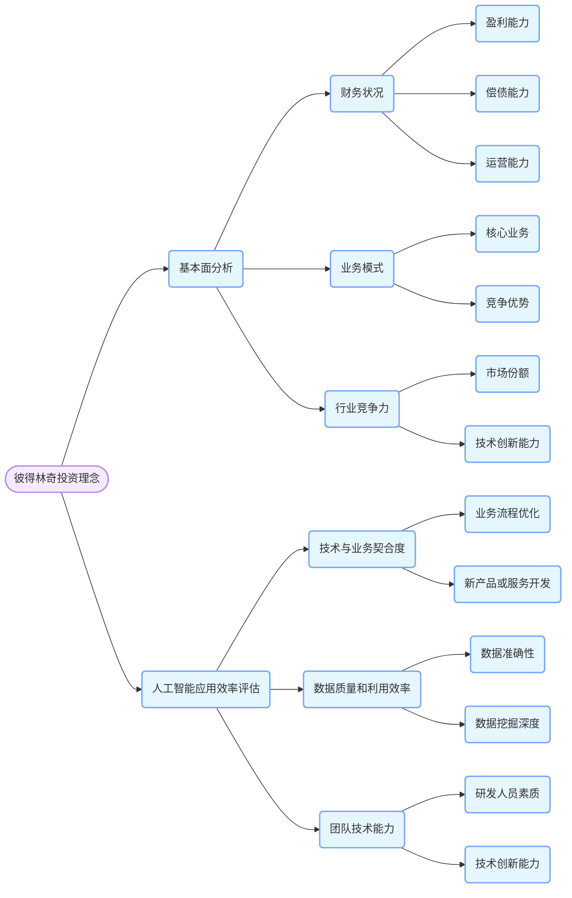

# 彼得林奇如何评估公司的人工智能应用效率

> 关键词：彼得林奇、公司评估、人工智能应用效率、财务分析、业务契合度

> 摘要：本文深入探讨彼得林奇评估公司人工智能应用效率的方法。从背景介绍入手，阐述目的、预期读者等信息，接着解析核心概念与联系，详细讲解评估的核心算法原理及操作步骤，运用数学模型和公式进行理论支撑，并通过项目实战案例进行说明。分析人工智能应用在不同场景的实际运用，推荐相关工具和资源，最后总结未来发展趋势与挑战，还设有常见问题解答和扩展阅读参考资料，旨在为投资者和相关从业者提供全面的评估思路和方法。

## 1. 背景介绍 
### 1.1 目的和范围
本文章的目的在于探索彼得林奇的投资理念如何应用于评估公司的人工智能应用效率。彼得林奇作为投资界的传奇人物，其独特的投资方法和对公司基本面的深入分析为投资者提供了宝贵的经验。随着人工智能技术的快速发展，越来越多的公司开始将其应用于业务中，评估这些公司的人工智能应用效率变得至关重要。本文将涵盖彼得林奇评估方法的核心要素，以及如何结合人工智能的特点进行应用效率的评估，范围涉及从理论到实践的多个方面。

### 1.2 预期读者
预期读者包括投资者、金融分析师、企业管理者以及对人工智能和投资领域感兴趣的专业人士。投资者可以从本文中获取评估公司人工智能应用效率的方法，以便做出更明智的投资决策；金融分析师能够借鉴彼得林奇的思路，完善自己的分析框架；企业管理者可以了解如何从投资者的角度评估自身公司的人工智能应用情况，从而优化公司的战略和运营；对该领域感兴趣的专业人士则可以拓宽知识面，深入了解投资与人工智能的结合。

### 1.3 文档结构概述
本文首先介绍核心概念，包括彼得林奇的投资理念和人工智能应用效率的定义及联系。接着阐述核心算法原理和具体操作步骤，结合Python代码进行详细说明。然后运用数学模型和公式进一步解释评估过程，并举例说明。通过项目实战案例，展示如何在实际中应用这些评估方法。分析人工智能应用的实际场景，推荐相关的学习资源、开发工具框架和论文著作。最后总结未来发展趋势与挑战，解答常见问题，并提供扩展阅读和参考资料。

### 1.4 术语表
#### 1.4.1 核心术语定义
- **彼得林奇投资理念**：强调通过对公司基本面的深入研究，包括财务状况、业务模式、行业竞争力等方面，寻找具有投资价值的公司。注重实地调研和对公司细节的了解，认为普通投资者也可以通过自己的观察和分析发现投资机会。
- **人工智能应用效率**：指公司在将人工智能技术应用于业务过程中，所获得的产出与投入的比率。产出可以包括提高的生产效率、增加的销售额、降低的成本等，投入则包括研发成本、硬件设备成本、人力成本等。

#### 1.4.2 相关概念解释
- **基本面分析**：一种评估公司价值的方法，通过研究公司的财务报表、经营状况、行业环境等因素，来判断公司的内在价值和发展潜力。彼得林奇的投资理念中，基本面分析是核心内容之一。
- **人工智能技术栈**：包括人工智能算法、数据处理、模型训练、部署和优化等一系列技术环节。公司在应用人工智能时，需要构建和管理自己的技术栈，以实现高效的应用。

#### 1.4.3 缩略词列表
- **AI**：Artificial Intelligence，人工智能
- **ROI**：Return on Investment，投资回报率

## 2. 核心概念与联系 

### 核心概念原理
彼得林奇的投资理念强调对公司基本面的深入研究，他认为投资者应该像了解自己的工作一样了解所投资的公司。在评估公司的人工智能应用效率时，也需要从多个方面进行分析。

人工智能应用效率的核心在于公司能否将人工智能技术有效地融入业务流程，实现业务目标。这涉及到技术与业务的契合度、数据的质量和利用效率、团队的技术能力等多个因素。

### 架构的文本示意图
```plaintext
彼得林奇投资理念
|
|-- 基本面分析
|   |-- 财务状况
|   |   |-- 盈利能力
|   |   |-- 偿债能力
|   |   |-- 运营能力
|   |-- 业务模式
|   |   |-- 核心业务
|   |   |-- 竞争优势
|   |-- 行业竞争力
|       |-- 市场份额
|       |-- 技术创新能力
|
|-- 人工智能应用效率评估
|   |-- 技术与业务契合度
|   |   |-- 业务流程优化
|   |   |-- 新产品或服务开发
|   |-- 数据质量和利用效率
|   |   |-- 数据准确性
|   |   |-- 数据挖掘深度
|   |-- 团队技术能力
|       |-- 研发人员素质
|       |-- 技术创新能力
```

### Mermaid 流程图


## 3. 核心算法原理 & 具体操作步骤 

### 核心算法原理
评估公司的人工智能应用效率可以从多个维度进行量化分析，其中一个重要的指标是投资回报率（ROI）。ROI 的计算公式为：

$$ROI = \frac{收益 - 成本}{成本} \times 100\%$$

在人工智能应用的场景中，收益可以包括由于人工智能应用带来的销售额增加、成本降低等，成本则包括研发成本、硬件设备成本、人力成本等。

### 具体操作步骤
1. **确定评估周期**：选择一个合适的时间段，例如一年或一个季度，来评估公司的人工智能应用效率。
2. **收集数据**：收集公司在评估周期内与人工智能应用相关的成本和收益数据。成本数据包括研发费用、设备采购费用、人员工资等；收益数据包括销售额增加、成本节约等。
3. **计算 ROI**：根据收集到的数据，使用上述公式计算投资回报率。
4. **对比分析**：将计算得到的 ROI 与同行业其他公司进行对比，或者与公司自身的历史数据进行对比，评估公司的人工智能应用效率在行业中的水平。

### Python 源代码实现
```python
# 定义计算 ROI 的函数
def calculate_roi(revenue, cost):
    """
    计算投资回报率
    :param revenue: 收益
    :param cost: 成本
    :return: 投资回报率
    """
    if cost == 0:
        return 0
    return ((revenue - cost) / cost) * 100

# 示例数据
ai_revenue = 1000000  # 人工智能应用带来的收益
ai_cost = 500000  # 人工智能应用的成本

# 计算 ROI
roi = calculate_roi(ai_revenue, ai_cost)

print(f"人工智能应用的投资回报率为: {roi:.2f}%")
```

## 4. 数学模型和公式 & 详细讲解 & 举例说明 

### 数学模型和公式
除了 ROI 公式外，还可以使用其他数学模型和公式来评估公司的人工智能应用效率。例如，可以使用线性回归模型来分析人工智能应用投入与业务指标（如销售额、生产效率等）之间的关系。

线性回归模型的一般形式为：

$$y = \beta_0 + \beta_1x_1 + \beta_2x_2 + \cdots + \beta_nx_n + \epsilon$$

其中，$y$ 是因变量（如销售额），$x_1, x_2, \cdots, x_n$ 是自变量（如人工智能研发投入、数据质量等），$\beta_0, \beta_1, \cdots, \beta_n$ 是回归系数，$\epsilon$ 是误差项。

### 详细讲解
线性回归模型的目的是找到一组回归系数，使得模型对数据的拟合效果最好。通过最小化误差项的平方和，可以得到回归系数的估计值。

在评估公司的人工智能应用效率时，可以将人工智能应用的相关因素作为自变量，业务指标作为因变量，建立线性回归模型。通过分析回归系数的大小和显著性，可以判断各个因素对业务指标的影响程度。

### 举例说明
假设一家公司想要评估人工智能应用对销售额的影响，收集了过去 12 个月的人工智能研发投入和销售额数据。使用 Python 的 `scikit-learn` 库可以建立线性回归模型进行分析。

```python
import numpy as np
from sklearn.linear_model import LinearRegression

# 示例数据
ai_investment = np.array([100, 120, 130, 150, 160, 180, 200, 220, 230, 250, 260, 280]).reshape(-1, 1)
sales = np.array([500, 550, 600, 650, 700, 750, 800, 850, 900, 950, 1000, 1050])

# 创建线性回归模型
model = LinearRegression()

# 拟合模型
model.fit(ai_investment, sales)

# 输出回归系数和截距
print(f"回归系数: {model.coef_[0]}")
print(f"截距: {model.intercept_}")

# 预测新的销售额
new_investment = np.array([300]).reshape(-1, 1)
predicted_sales = model.predict(new_investment)
print(f"当人工智能研发投入为 300 时，预测销售额为: {predicted_sales[0]}")
```

在这个例子中，回归系数表示人工智能研发投入每增加一个单位，销售额的平均增加量。通过分析回归系数和截距，可以评估人工智能应用对销售额的影响。

## 5. 项目实战：代码实际案例和详细解释说明 

### 5.1  开发环境搭建
为了实现上述的评估方法，需要搭建相应的开发环境。以下是具体的步骤：

1. **安装 Python**：可以从 Python 官方网站（https://www.python.org/downloads/）下载并安装 Python 3.x 版本。
2. **安装必要的库**：使用 `pip` 命令安装所需的库，包括 `numpy`、`pandas`、`scikit-learn` 等。

```bash
pip install numpy pandas scikit-learn
```

### 5.2  源代码详细实现和代码解读
以下是一个完整的项目实战代码示例，用于评估公司的人工智能应用效率：

```python
import numpy as np
import pandas as pd
from sklearn.linear_model import LinearRegression

# 模拟数据
data = {
    'ai_investment': [100, 120, 130, 150, 160, 180, 200, 220, 230, 250],
    'sales': [500, 550, 600, 650, 700, 750, 800, 850, 900, 950],
    'cost': [50, 60, 65, 75, 80, 90, 100, 110, 115, 125]
}

df = pd.DataFrame(data)

# 计算 ROI
df['roi'] = ((df['sales'] - df['cost']) / df['cost']) * 100

# 建立线性回归模型
X = df[['ai_investment']]
y = df['sales']

model = LinearRegression()
model.fit(X, y)

# 输出回归系数和截距
print(f"回归系数: {model.coef_[0]}")
print(f"截距: {model.intercept_}")

# 预测新的销售额
new_investment = np.array([300]).reshape(-1, 1)
predicted_sales = model.predict(new_investment)
print(f"当人工智能研发投入为 300 时，预测销售额为: {predicted_sales[0]}")

# 输出 ROI 信息
print(f"平均 ROI: {df['roi'].mean():.2f}%")
```

### 代码解读与分析
1. **数据模拟**：使用 `pandas` 库创建一个包含人工智能研发投入、销售额和成本的数据框。
2. **计算 ROI**：根据 ROI 公式计算每个数据点的投资回报率，并将结果添加到数据框中。
3. **建立线性回归模型**：使用 `scikit-learn` 库的 `LinearRegression` 类建立线性回归模型，分析人工智能研发投入与销售额之间的关系。
4. **模型训练和预测**：使用训练数据拟合模型，并预测新的销售额。
5. **输出结果**：输出回归系数、截距、预测销售额和平均 ROI 等信息。

通过这个项目实战，可以看到如何使用 Python 代码实现公司人工智能应用效率的评估。

## 6. 实际应用场景 
### 制造业
在制造业中，公司可以利用人工智能技术实现生产过程的自动化和优化。例如，通过人工智能算法对生产设备进行实时监测和故障预测，提前发现潜在问题，减少设备停机时间，提高生产效率。评估人工智能应用效率时，可以关注设备利用率的提高、生产成本的降低以及产品质量的提升等方面。

### 金融行业
金融行业可以应用人工智能技术进行风险评估、信贷审批、投资决策等。通过分析大量的金融数据，人工智能模型可以更准确地预测市场趋势和客户信用风险。评估效率时，可以考虑风险评估的准确性提高、信贷审批时间的缩短以及投资回报率的提升等指标。

### 医疗保健领域
在医疗保健领域，人工智能可以辅助医生进行疾病诊断、药物研发等。例如，通过分析医学影像数据，人工智能模型可以帮助医生更准确地检测疾病。评估时，可以关注诊断准确率的提高、研发周期的缩短以及医疗成本的降低等方面。

### 零售业
零售业可以利用人工智能技术进行客户细分、商品推荐和库存管理。通过分析客户的购买行为和偏好，人工智能算法可以提供个性化的商品推荐，提高客户满意度和销售额。评估效率时，可以关注客户转化率的提高、库存周转率的提升以及营销成本的降低等指标。

## 7. 工具和资源推荐
### 7.1 学习资源推荐
#### 7.1.1 书籍推荐
- 《彼得林奇的成功投资》：彼得林奇的经典著作，详细介绍了他的投资理念和方法。
- 《人工智能：现代方法》：全面介绍人工智能的基本概念、算法和应用，是学习人工智能的经典教材。
- 《Python 数据分析实战》：介绍如何使用 Python 进行数据分析，对于处理评估所需的数据非常有帮助。

#### 7.1.2 在线课程
- Coursera 上的 “Machine Learning” 课程：由 Andrew Ng 教授授课，是学习机器学习的经典课程。
- edX 上的 “Artificial Intelligence” 课程：提供了人工智能领域的全面介绍和深入学习。
- 网易云课堂上的 “Python 数据分析与挖掘实战” 课程：结合实际案例，讲解如何使用 Python 进行数据分析和挖掘。

#### 7.1.3 技术博客和网站
- Towards Data Science：提供了大量关于数据分析、机器学习和人工智能的技术文章和教程。
- Kaggle：一个数据科学竞赛平台，上面有很多关于数据分析和机器学习的优秀案例和经验分享。
- 开源中国：国内知名的开源技术社区，有很多关于人工智能和数据分析的技术文章和讨论。

### 7.2 开发工具框架推荐
#### 7.2.1 IDE和编辑器
- PyCharm：一款功能强大的 Python 集成开发环境，提供了代码编辑、调试、版本控制等功能。
- Jupyter Notebook：一个交互式的编程环境，适合进行数据分析和模型开发。
- Visual Studio Code：一款轻量级的代码编辑器，支持多种编程语言，有丰富的插件扩展。

#### 7.2.2 调试和性能分析工具
- PDB：Python 自带的调试器，可以帮助开发者定位代码中的问题。
- cProfile：Python 自带的性能分析工具，可以分析代码的运行时间和函数调用情况。
- TensorBoard：TensorFlow 提供的可视化工具，可以用于监控模型训练过程和分析模型性能。

#### 7.2.3 相关框架和库
- NumPy：Python 的数值计算库，提供了高效的数组操作和数学函数。
- Pandas：用于数据处理和分析的库，提供了数据结构和数据分析工具。
- Scikit-learn：一个简单易用的机器学习库，提供了各种机器学习算法和工具。
- TensorFlow 和 PyTorch：深度学习框架，用于构建和训练深度学习模型。

### 7.3 相关论文著作推荐
#### 7.3.1 经典论文
- “Artificial Intelligence: A New Synthesis” by Nils J. Nilsson：人工智能领域的经典论文，对人工智能的发展和研究方向进行了系统的阐述。
- “Pattern Recognition and Machine Learning” by Christopher M. Bishop：机器学习领域的经典著作，详细介绍了各种机器学习算法和理论。
- “Deep Learning” by Ian Goodfellow, Yoshua Bengio, and Aaron Courville：深度学习领域的权威著作，全面介绍了深度学习的基本概念、算法和应用。

#### 7.3.2 最新研究成果
- 关注顶级学术会议如 NeurIPS、ICML、CVPR 等的最新论文，了解人工智能领域的最新研究进展。
- 关注知名学术期刊如 Journal of Artificial Intelligence Research (JAIR)、Artificial Intelligence 等的最新文章。

#### 7.3.3 应用案例分析
- 各大科技公司的技术博客，如 Google AI Blog、Facebook AI Research 等，会分享他们在人工智能应用方面的实践经验和案例。
- 行业报告和研究机构的分析报告，如 Gartner、IDC 等，会对人工智能在不同行业的应用情况进行分析和评估。

## 8. 总结：未来发展趋势与挑战
### 未来发展趋势
- **人工智能与行业深度融合**：未来，人工智能将更加深入地融入各个行业，为企业带来更大的价值。例如，在制造业中，人工智能将与物联网、大数据等技术结合，实现智能制造；在金融行业，人工智能将用于个性化金融服务和风险防控。
- **人工智能技术的不断创新**：随着研究的不断深入，人工智能技术将不断创新，如强化学习、生成对抗网络等技术将得到更广泛的应用。同时，人工智能的可解释性和安全性也将成为研究的重点。
- **数据驱动的决策**：企业将越来越依赖数据和人工智能技术进行决策，通过分析大量的数据，企业可以更准确地了解市场需求和客户行为，制定更有效的战略和运营计划。

### 挑战
- **数据隐私和安全问题**：人工智能的应用需要大量的数据，如何保护数据的隐私和安全是一个重要的挑战。企业需要加强数据管理和安全防护，遵守相关的法律法规。
- **人才短缺**：人工智能领域的发展需要大量的专业人才，包括算法工程师、数据科学家等。目前，人工智能人才短缺的问题比较突出，企业需要加强人才培养和引进。
- **技术伦理和道德问题**：人工智能的发展也带来了一些技术伦理和道德问题，如算法偏见、人工智能的责任归属等。企业和社会需要共同探讨和解决这些问题，确保人工智能的发展符合人类的利益和价值观。

## 9. 附录：常见问题与解答
### 问题 1：如何确定人工智能应用的收益和成本？
解答：收益可以通过分析业务指标的变化来确定，如销售额的增加、成本的降低等。成本则包括研发成本、硬件设备成本、人力成本等。可以通过财务报表和相关的业务数据来收集和统计这些信息。

### 问题 2：线性回归模型是否适用于所有公司的人工智能应用评估？
解答：线性回归模型是一种简单有效的分析方法，但并不适用于所有情况。在某些情况下，人工智能应用与业务指标之间可能存在非线性关系，此时可以考虑使用其他模型，如非线性回归模型、神经网络模型等。

### 问题 3：如何评估人工智能团队的技术能力？
解答：可以从多个方面评估人工智能团队的技术能力，如团队成员的教育背景和工作经验、发表的学术论文和专利、参与的项目和竞赛等。此外，还可以通过与团队成员的交流和沟通，了解他们的技术水平和创新能力。

## 10. 扩展阅读 & 参考资料
### 扩展阅读
- 《智能时代》：吴军著，介绍了人工智能对社会和经济的影响。
- 《未来简史：从智人到智神》：尤瓦尔·赫拉利著，探讨了人工智能和生物技术对人类未来的影响。
- 《大数据时代》：维克托·迈尔 - 舍恩伯格著，介绍了大数据的概念、应用和挑战。

### 参考资料
- 《彼得林奇的成功投资》，彼得·林奇著
- 《人工智能：现代方法》，Stuart Russell 和 Peter Norvig 著
- 各大科技公司的官方网站和技术博客
- 学术期刊和会议论文

作者：AI天才研究院/AI Genius Institute & 禅与计算机程序设计艺术 /Zen And The Art of Computer Programming