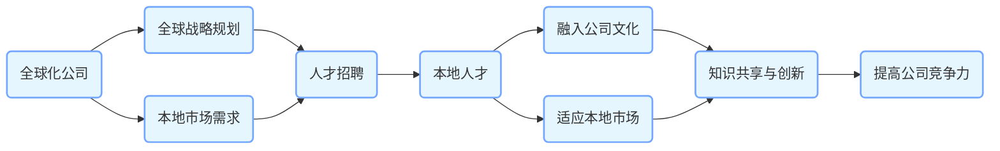

# 彼得林奇如何评估公司的全球化人才本地化策略

> 关键词：彼得林奇、公司评估、全球化人才本地化策略、财务指标、非财务指标

> 摘要：本文围绕彼得林奇评估公司的全球化人才本地化策略展开探讨。首先介绍相关背景，包括目的、预期读者等内容。接着阐述核心概念，分析全球化人才本地化策略的原理与架构。深入讲解评估该策略的核心算法原理及具体操作步骤，通过 Python 代码详细说明。同时给出相关数学模型和公式，并举例说明。以实际项目案例展示如何运用这些评估方法，对代码进行详细解读。探讨该策略的实际应用场景，推荐学习资源、开发工具框架及相关论文著作。最后总结未来发展趋势与挑战，解答常见问题并提供扩展阅读和参考资料，旨在帮助读者全面理解彼得林奇评估公司全球化人才本地化策略的方法和思路。

## 1. 背景介绍 
### 1.1 目的和范围
彼得林奇作为投资界的传奇人物，其投资理念和评估公司的方法一直备受关注。全球化人才本地化策略已成为众多跨国公司发展的重要战略之一，评估这一策略对于判断公司的竞争力和未来发展潜力至关重要。本文的目的是深入分析彼得林奇可能采用的评估公司全球化人才本地化策略的方法，涵盖从理论原理到实际操作的各个方面。范围包括核心概念的阐述、评估算法的讲解、数学模型的构建、实际案例的分析以及相关资源的推荐等。

### 1.2 预期读者
本文预期读者主要包括投资领域的专业人士，如基金经理、分析师等，他们可以借鉴彼得林奇的评估方法来筛选具有投资价值的公司；企业管理者，尤其是跨国公司的高层管理人员，能够从中获取评估自身人才本地化策略的思路和方法；以及对投资和企业管理感兴趣的学者和学生，帮助他们深入理解公司评估和人才战略相关知识。

### 1.3 文档结构概述
本文共分为十个部分。第一部分是背景介绍，明确目的、范围、预期读者和文档结构。第二部分阐述核心概念与联系，包括全球化人才本地化策略的原理和架构，并以示意图和流程图展示。第三部分讲解核心算法原理和具体操作步骤，通过 Python 代码详细说明。第四部分给出数学模型和公式，并举例说明。第五部分进行项目实战，包括开发环境搭建、源代码实现和代码解读。第六部分探讨实际应用场景。第七部分推荐相关工具和资源，包括学习资源、开发工具框架和论文著作。第八部分总结未来发展趋势与挑战。第九部分是附录，解答常见问题。第十部分提供扩展阅读和参考资料。

### 1.4 术语表
#### 1.4.1 核心术语定义
- **全球化人才本地化策略**：指跨国公司在全球范围内开展业务时，充分利用当地的人才资源，将本地人才融入公司的运营和管理中，以更好地适应当地市场和文化环境，提高公司的竞争力。
- **彼得林奇投资理念**：强调通过深入研究公司的基本面，包括财务状况、业务模式、行业前景等，寻找具有投资价值的公司。注重实地调研和对公司细节的了解。
- **财务指标**：用于衡量公司财务状况和经营成果的一系列数据，如营业收入、净利润、资产负债率等。
- **非财务指标**：除财务指标外，反映公司其他方面情况的指标，如员工满意度、市场份额、创新能力等。

#### 1.4.2 相关概念解释
- **人才本地化程度**：指公司在当地招聘和使用的人才占公司总人才数量的比例，反映了公司对当地人才资源的利用程度。
- **文化适应能力**：指本地人才能够快速适应公司的企业文化和管理模式，以及公司能够适应当地文化环境的能力。
- **知识转移**：指公司内部不同地区的人才之间进行知识和经验的交流与共享，以促进公司整体的发展和创新。

#### 1.4.3 缩略词列表
- ROI（Return on Investment）：投资回报率
- EPS（Earnings Per Share）：每股收益
- P/E（Price-to-Earnings Ratio）：市盈率

## 2. 核心概念与联系 

### 全球化人才本地化策略原理
全球化人才本地化策略的核心原理是充分利用当地人才的优势，实现公司在全球市场的有效运营。当地人才对本地市场、文化、政策等方面有更深入的了解，能够更好地满足当地客户的需求，提高公司的市场竞争力。同时，通过将本地人才融入公司的组织架构中，可以促进知识和经验的交流与共享，提升公司的创新能力和整体运营效率。

### 架构示意图


### 各环节联系解释
- 全球化公司首先进行全球战略规划，同时考虑本地市场需求，这两个因素共同指导人才招聘工作。
- 招聘到本地人才后，一方面要让他们融入公司文化，另一方面要使其能够适应本地市场。
- 本地人才在融入公司和适应市场的过程中，促进知识共享与创新，最终提高公司的竞争力。

## 3. 核心算法原理 & 具体操作步骤 

### 算法原理
评估公司的全球化人才本地化策略可以从财务和非财务两个方面进行综合考虑。财务方面主要关注人才本地化对公司财务指标的影响，如营业收入、净利润等；非财务方面则考虑人才本地化程度、文化适应能力、知识转移效果等因素。通过建立综合评估模型，将这些因素进行量化和加权，得出一个综合评估得分，以此来判断公司全球化人才本地化策略的有效性。

### Python 代码实现
```python
import pandas as pd

# 定义评估指标权重
weights = {
    '财务指标': 0.6,
    '非财务指标': 0.4
}

# 定义财务指标及其权重
financial_weights = {
    '营业收入增长率': 0.3,
    '净利润增长率': 0.3,
    '投资回报率': 0.2,
    '每股收益': 0.2
}

# 定义非财务指标及其权重
non_financial_weights = {
    '人才本地化程度': 0.3,
    '文化适应能力': 0.3,
    '知识转移效果': 0.2,
    '员工满意度': 0.2
}

def calculate_financial_score(data):
    """
    计算财务指标得分
    :param data: 包含财务指标数据的字典
    :return: 财务指标得分
    """
    score = 0
    for key, weight in financial_weights.items():
        score += data[key] * weight
    return score

def calculate_non_financial_score(data):
    """
    计算非财务指标得分
    :param data: 包含非财务指标数据的字典
    :return: 非财务指标得分
    """
    score = 0
    for key, weight in non_financial_weights.items():
        score += data[key] * weight
    return score

def calculate_total_score(financial_data, non_financial_data):
    """
    计算综合评估得分
    :param financial_data: 包含财务指标数据的字典
    :param non_financial_data: 包含非财务指标数据的字典
    :return: 综合评估得分
    """
    financial_score = calculate_financial_score(financial_data)
    non_financial_score = calculate_non_financial_score(non_financial_data)
    total_score = financial_score * weights['财务指标'] + non_financial_score * weights['非财务指标']
    return total_score

# 示例数据
financial_data = {
    '营业收入增长率': 0.2,
    '净利润增长率': 0.15,
    '投资回报率': 0.1,
    '每股收益': 0.5
}

non_financial_data = {
    '人才本地化程度': 0.8,
    '文化适应能力': 0.7,
    '知识转移效果': 0.6,
    '员工满意度': 0.7
}

# 计算综合得分
total_score = calculate_total_score(financial_data, non_financial_data)
print(f"综合评估得分: {total_score}")
```

### 具体操作步骤
1. **数据收集**：收集公司的财务数据和非财务数据，包括营业收入增长率、净利润增长率、投资回报率、每股收益、人才本地化程度、文化适应能力、知识转移效果、员工满意度等。
2. **指标权重确定**：根据评估的重点和实际情况，确定财务指标和非财务指标的权重，以及各具体指标的权重。
3. **得分计算**：分别计算财务指标得分和非财务指标得分，然后根据权重计算综合评估得分。
4. **结果分析**：根据综合评估得分，判断公司全球化人才本地化策略的有效性。得分越高，说明策略越有效。

## 4. 数学模型和公式 & 详细讲解 & 举例说明 

### 数学模型
设综合评估得分 $S$，财务指标得分 $S_f$，非财务指标得分 $S_{nf}$，财务指标权重 $w_f$，非财务指标权重 $w_{nf}$，则有：
$$S = w_f \times S_f + w_{nf} \times S_{nf}$$

其中，财务指标得分 $S_f$ 为各财务指标得分的加权和：
$$S_f = \sum_{i=1}^{n} w_{fi} \times x_{fi}$$

非财务指标得分 $S_{nf}$ 为各非财务指标得分的加权和：
$$S_{nf} = \sum_{j=1}^{m} w_{nfj} \times x_{nfj}$$

这里，$w_{fi}$ 是第 $i$ 个财务指标的权重，$x_{fi}$ 是第 $i$ 个财务指标的实际值；$w_{nfj}$ 是第 $j$ 个非财务指标的权重，$x_{nfj}$ 是第 $j$ 个非财务指标的实际值。

### 详细讲解
- 综合评估得分 $S$ 是通过将财务指标得分和非财务指标得分按照一定的权重进行加权平均得到的。这体现了在评估公司全球化人才本地化策略时，需要综合考虑财务和非财务两个方面的因素。
- 财务指标得分 $S_f$ 和非财务指标得分 $S_{nf}$ 分别是各自指标的加权和，权重的设置反映了各指标在评估中的重要程度。

### 举例说明
假设某公司的财务指标和非财务指标数据如下：
| 指标 | 实际值 | 权重 |
| ---- | ---- | ---- |
| 营业收入增长率 | 0.2 | 0.3 |
| 净利润增长率 | 0.15 | 0.3 |
| 投资回报率 | 0.1 | 0.2 |
| 每股收益 | 0.5 | 0.2 |
| 人才本地化程度 | 0.8 | 0.3 |
| 文化适应能力 | 0.7 | 0.3 |
| 知识转移效果 | 0.6 | 0.2 |
| 员工满意度 | 0.7 | 0.2 |

财务指标权重 $w_f = 0.6$，非财务指标权重 $w_{nf} = 0.4$。

首先计算财务指标得分 $S_f$：
$$S_f = 0.3 \times 0.2 + 0.3 \times 0.15 + 0.2 \times 0.1 + 0.2 \times 0.5 = 0.215$$

然后计算非财务指标得分 $S_{nf}$：
$$S_{nf} = 0.3 \times 0.8 + 0.3 \times 0.7 + 0.2 \times 0.6 + 0.2 \times 0.7 = 0.71$$

最后计算综合评估得分 $S$：
$$S = 0.6 \times 0.215 + 0.4 \times 0.71 = 0.415$$

通过这个例子可以看出，通过数学模型和公式可以将公司的各项指标数据进行量化，得到一个综合评估得分，从而直观地判断公司全球化人才本地化策略的有效性。

## 5. 项目实战：代码实际案例和详细解释说明 

### 5.1  开发环境搭建
- **Python 安装**：确保你的系统上安装了 Python 3.x 版本。可以从 Python 官方网站（https://www.python.org/downloads/）下载并安装。
- **依赖库安装**：本项目主要使用了 `pandas` 库，在命令行中运行以下命令进行安装：
```sh
pip install pandas
```

### 5.2  源代码详细实现和代码解读
```python
import pandas as pd

# 定义评估指标权重
weights = {
    '财务指标': 0.6,
    '非财务指标': 0.4
}

# 定义财务指标及其权重
financial_weights = {
    '营业收入增长率': 0.3,
    '净利润增长率': 0.3,
    '投资回报率': 0.2,
    '每股收益': 0.2
}

# 定义非财务指标及其权重
non_financial_weights = {
    '人才本地化程度': 0.3,
    '文化适应能力': 0.3,
    '知识转移效果': 0.2,
    '员工满意度': 0.2
}

def calculate_financial_score(data):
    """
    计算财务指标得分
    :param data: 包含财务指标数据的字典
    :return: 财务指标得分
    """
    score = 0
    for key, weight in financial_weights.items():
        score += data[key] * weight
    return score

def calculate_non_financial_score(data):
    """
    计算非财务指标得分
    :param data: 包含非财务指标数据的字典
    :return: 非财务指标得分
    """
    score = 0
    for key, weight in non_financial_weights.items():
        score += data[key] * weight
    return score

def calculate_total_score(financial_data, non_financial_data):
    """
    计算综合评估得分
    :param financial_data: 包含财务指标数据的字典
    :param non_financial_data: 包含非财务指标数据的字典
    :return: 综合评估得分
    """
    financial_score = calculate_financial_score(financial_data)
    non_financial_score = calculate_non_financial_score(non_financial_data)
    total_score = financial_score * weights['财务指标'] + non_financial_score * weights['非财务指标']
    return total_score

# 示例数据
financial_data = {
    '营业收入增长率': 0.2,
    '净利润增长率': 0.15,
    '投资回报率': 0.1,
    '每股收益': 0.5
}

non_financial_data = {
    '人才本地化程度': 0.8,
    '文化适应能力': 0.7,
    '知识转移效果': 0.6,
    '员工满意度': 0.7
}

# 计算综合得分
total_score = calculate_total_score(financial_data, non_financial_data)
print(f"综合评估得分: {total_score}")
```

### 代码解读与分析
1. **导入库**：导入 `pandas` 库，虽然在本代码中没有直接使用 `pandas` 进行数据处理，但在实际项目中可能会用它来读取和处理数据。
2. **定义权重**：定义了财务指标和非财务指标的整体权重，以及各具体指标的权重。这些权重可以根据实际情况进行调整。
3. **计算得分函数**：
    - `calculate_financial_score` 函数：根据财务指标数据和权重计算财务指标得分。
    - `calculate_non_financial_score` 函数：根据非财务指标数据和权重计算非财务指标得分。
    - `calculate_total_score` 函数：将财务指标得分和非财务指标得分按照整体权重进行加权平均，得到综合评估得分。
4. **示例数据**：提供了示例的财务数据和非财务数据，方便测试代码。
5. **计算综合得分并输出**：调用 `calculate_total_score` 函数计算综合得分，并将结果打印输出。

## 6. 实际应用场景 
### 投资决策
投资者在选择投资标的时，可以运用彼得林奇的评估方法来评估公司的全球化人才本地化策略。如果公司的综合评估得分较高，说明其人才本地化策略有效，公司在全球市场的竞争力较强，具有较好的投资价值。例如，投资者可以通过分析公司的财务报表和进行实地调研，获取相关指标数据，计算综合得分，从而做出更明智的投资决策。

### 企业战略调整
企业管理者可以使用该评估方法来评估自身公司的全球化人才本地化策略。如果评估得分较低，说明策略可能存在问题，需要进行调整。例如，如果人才本地化程度较低，企业可以加大在当地的人才招聘力度；如果文化适应能力不足，企业可以加强文化培训和交流活动。

### 行业研究
研究机构和学者可以运用该评估方法对不同行业的公司进行研究，分析行业内公司全球化人才本地化策略的整体情况和发展趋势。这有助于了解行业的竞争态势和发展方向，为行业政策制定和企业战略规划提供参考。

## 7. 工具和资源推荐
### 7.1 学习资源推荐
#### 7.1.1 书籍推荐
- 《彼得林奇的成功投资》：彼得林奇的经典著作，详细介绍了他的投资理念和方法，对于理解如何评估公司具有重要的参考价值。
- 《跨国公司人力资源管理》：全面介绍了跨国公司在人力资源管理方面的理论和实践，包括全球化人才本地化策略的相关内容。
- 《财务报表分析》：帮助读者掌握如何分析公司的财务报表，获取评估所需的财务指标数据。

#### 7.1.2 在线课程
- Coursera 上的“投资学原理”课程：由知名教授授课，系统介绍投资学的基本原理和方法。
- edX 上的“跨国企业管理”课程：深入讲解跨国企业的运营和管理，包括人才战略等方面的内容。
- 中国大学 MOOC 上的“财务管理”课程：提供了丰富的财务管理知识，有助于理解财务指标的含义和计算方法。

#### 7.1.3 技术博客和网站
- Seeking Alpha：一个专业的投资研究网站，提供了大量关于公司分析和投资策略的文章。
- 财新网：国内知名的财经媒体网站，报道了许多关于企业管理和投资的最新动态和分析。
- 雪球网：国内的投资社区，投资者可以在上面交流投资经验和分享对公司的研究成果。

### 7.2 开发工具框架推荐
#### 7.2.1 IDE和编辑器
- PyCharm：一款专业的 Python 集成开发环境，具有强大的代码编辑、调试和分析功能。
- Jupyter Notebook：一种交互式的开发环境，适合进行数据探索和代码演示。
- Visual Studio Code：一款轻量级的代码编辑器，支持多种编程语言，并且有丰富的扩展插件。

#### 7.2.2 调试和性能分析工具
- PDB：Python 自带的调试器，可以帮助开发者定位代码中的问题。
- cProfile：Python 的性能分析工具，可以分析代码的运行时间和资源消耗情况。
- Py-Spy：一个简单易用的 Python 性能分析工具，可以实时监控 Python 程序的运行情况。

#### 7.2.3 相关框架和库
- Pandas：用于数据处理和分析的 Python 库，提供了丰富的数据结构和函数。
- NumPy：用于科学计算的 Python 库，支持高效的数组操作和数学运算。
- Matplotlib：用于数据可视化的 Python 库，可以绘制各种类型的图表。

### 7.3 相关论文著作推荐
#### 7.3.1 经典论文
- Bartlett, C. A., & Ghoshal, S. (1989). Managing across borders: The transnational solution. Harvard Business School Press. 该论文提出了跨国公司的管理模式和策略，对全球化人才本地化策略的研究具有重要的启发作用。
- Prahalad, C. K., & Doz, Y. L. (1987). The multinational mission: Balancing local demands and global vision. Free Press. 探讨了跨国公司如何平衡本地需求和全球战略，为全球化人才本地化策略的实施提供了理论基础。

#### 7.3.2 最新研究成果
- 关注顶级学术期刊如《Academy of Management Journal》《Journal of International Business Studies》等，这些期刊上经常发表关于跨国公司管理和人才战略的最新研究成果。

#### 7.3.3 应用案例分析
- 一些知名咨询公司如麦肯锡、波士顿咨询等会发布关于跨国公司全球化人才本地化策略的案例分析报告，可以通过他们的官方网站获取这些报告。

## 8. 总结：未来发展趋势与挑战
### 未来发展趋势
- **数字化转型推动**：随着数字化技术的不断发展，跨国公司将更加注重利用数字工具和平台来实施全球化人才本地化策略。例如，通过在线招聘、远程办公等方式扩大人才招聘范围，提高人才管理效率。
- **多元化与包容性增强**：未来的全球化人才本地化策略将更加注重多元化和包容性，不仅要招聘不同地区的人才，还要营造一个包容不同文化、性别、种族的工作环境，激发员工的创新能力。
- **人才培养与发展个性化**：公司将更加关注本地人才的个性化培养和发展，根据员工的兴趣和能力提供定制化的培训和晋升机会，提高员工的忠诚度和工作满意度。

### 挑战
- **文化冲突管理**：不同地区的文化差异可能导致文化冲突，影响团队协作和工作效率。公司需要加强文化培训和沟通，建立有效的文化冲突管理机制。
- **数据安全与隐私问题**：在数字化转型过程中，公司需要处理大量的员工数据，如何保障数据安全和隐私是一个重要的挑战。
- **全球人才竞争加剧**：随着全球化的深入发展，全球人才竞争将更加激烈。公司需要不断提升自身的吸引力，制定有竞争力的薪酬和福利政策，吸引和留住优秀的本地人才。

## 9. 附录：常见问题与解答
### 问题 1：如何获取准确的非财务指标数据？
解答：可以通过以下几种方式获取非财务指标数据：
- 员工调查问卷：设计合理的调查问卷，了解员工对人才本地化程度、文化适应能力、员工满意度等方面的看法。
- 实地调研：到公司的各个分支机构进行实地考察，观察员工的工作状态和团队协作情况，获取第一手资料。
- 行业报告和研究机构数据：参考行业报告和研究机构发布的数据，了解同行业公司在非财务指标方面的情况。

### 问题 2：评估指标的权重如何确定？
解答：评估指标的权重可以根据以下因素确定：
- 公司战略：如果公司更注重财务绩效，那么财务指标的权重可以适当提高；如果公司更关注人才发展和创新能力，那么非财务指标的权重可以相应增加。
- 行业特点：不同行业的特点不同，对各指标的重视程度也有所差异。例如，科技行业可能更注重创新能力和知识转移效果，而制造业可能更关注成本控制和生产效率。
- 经验和专家意见：可以参考行业内的经验和专家意见，结合公司的实际情况，确定合理的指标权重。

### 问题 3：该评估方法是否适用于所有公司？
解答：该评估方法适用于大多数实施全球化人才本地化策略的跨国公司，但在具体应用时需要根据公司的实际情况进行调整。例如，对于一些小型跨国公司，可能无法获取全面的财务和非财务指标数据，需要简化评估指标；对于一些特殊行业的公司，可能需要增加一些特定的评估指标。

## 10. 扩展阅读 & 参考资料
### 扩展阅读
- 《基业长青》：探讨了优秀企业长期保持卓越的秘诀，对于理解公司的战略和管理具有一定的启示作用。
- 《创新者的窘境》：分析了创新对企业发展的影响，以及企业如何应对创新带来的挑战。
- 《从优秀到卓越》：研究了如何将优秀的公司转变为卓越的公司，提供了一些实用的管理方法和策略。

### 参考资料
- 彼得林奇相关著作和访谈资料。
- 各公司的年度报告和财务报表。
- 学术期刊上发表的关于全球化人才本地化策略的研究论文。

作者：AI天才研究院/AI Genius Institute & 禅与计算机程序设计艺术 /Zen And The Art of Computer Programming