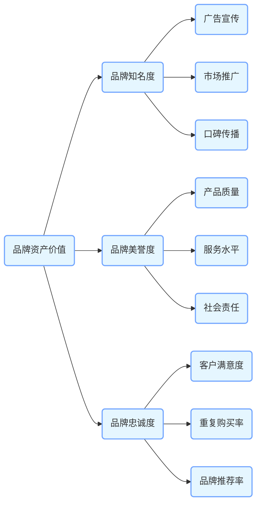

# 彼得林奇如何评估公司的品牌资产价值

> 关键词：彼得林奇、品牌资产价值、公司评估、财务分析、市场调研

> 摘要：本文深入探讨了投资大师彼得林奇评估公司品牌资产价值的方法。通过对相关背景知识的介绍，阐述了核心概念及联系，详细剖析了其评估所涉及的核心算法原理与操作步骤，结合数学模型和公式进行说明，并给出项目实战案例。同时探讨了品牌资产价值评估在实际中的应用场景，推荐了相关的学习工具、资源和论文著作。最后总结了该领域的未来发展趋势与挑战，并对常见问题进行解答，为投资者和相关研究人员提供了全面且深入的参考。

## 1. 背景介绍 
### 1.1 目的和范围
彼得林奇作为投资界的传奇人物，他的投资理念和方法对全球投资者产生了深远的影响。评估公司的品牌资产价值是他投资决策过程中的重要环节。本文的目的在于深入剖析彼得林奇评估公司品牌资产价值的具体方法和思路，范围涵盖从基本概念到实际应用的各个方面，旨在帮助投资者更好地理解如何通过评估品牌资产价值来挑选具有投资潜力的公司。

### 1.2 预期读者
本文预期读者主要包括投资者，无论是专业的投资机构人员还是个人投资者，都可以从中学到实用的投资分析方法。同时，对于从事市场营销、企业管理等领域的专业人士，也能从彼得林奇的品牌资产评估视角中获得新的启发。此外，对投资学、金融学等相关专业的学生而言，本文可作为学习和研究的参考资料。

### 1.3 文档结构概述
本文首先介绍相关背景知识，包括目的、预期读者和文档结构。接着阐述核心概念与联系，明确品牌资产价值的定义和相关架构。然后详细讲解核心算法原理和具体操作步骤，并通过Python代码实现。之后结合数学模型和公式进行深入分析，给出具体示例。再通过项目实战案例，展示如何在实际中应用这些方法。随后探讨实际应用场景，推荐相关的工具和资源。最后总结未来发展趋势与挑战，解答常见问题，并提供扩展阅读和参考资料。

### 1.4 术语表
#### 1.4.1 核心术语定义
- **品牌资产价值**：是指品牌所具有的能够为企业带来未来经济利益的潜在价值，包括品牌知名度、美誉度、忠诚度等因素所形成的综合价值。
- **特许权价值**：指公司凭借品牌、专利等优势所获得的能够在市场上收取高于正常水平利润的权利价值。
- **客户忠诚度**：客户对某一品牌产品或服务的重复购买意愿和行为倾向。

#### 1.4.2 相关概念解释
- **品牌知名度**：衡量消费者对品牌的知晓程度，通常通过市场调研来评估，如问卷调查中能够正确识别品牌的消费者比例。
- **品牌美誉度**：反映消费者对品牌的好感和评价，与产品质量、服务水平等因素密切相关。
- **品牌忠诚度**：表现为消费者在购买决策中持续选择某一品牌的程度，可通过重复购买率、客户留存率等指标来衡量。

#### 1.4.3 缩略词列表
- **ROE**：Return on Equity，净资产收益率，用于衡量公司运用自有资本的效率。
- **EPS**：Earnings Per Share，每股收益，反映公司的盈利能力。

## 2. 核心概念与联系 

### 核心概念原理
彼得林奇认为，品牌资产价值是公司的一种重要无形资产，它能够为公司带来竞争优势和持续的盈利能力。品牌资产价值的形成源于多个方面，包括品牌知名度、美誉度、忠诚度等。

品牌知名度是品牌资产的基础，只有消费者对品牌有了一定的认知，才有可能进一步产生购买行为。美誉度则是品牌在消费者心中的形象和口碑，良好的美誉度能够吸引更多的消费者，提高品牌的市场份额。而忠诚度是品牌资产的核心，忠诚的客户会持续购买品牌产品或服务，并且会向他人推荐，为公司带来稳定的现金流。

品牌资产价值与公司的财务状况密切相关。具有高品牌资产价值的公司通常能够获得更高的毛利率、净利率和净资产收益率。因为消费者愿意为知名品牌支付更高的价格，从而提高了公司的产品附加值。同时，品牌资产价值也能够降低公司的营销成本，因为品牌知名度高的公司不需要花费大量的资金来进行广告宣传和市场推广。

### 架构的文本示意图
```plaintext
品牌资产价值
|-- 品牌知名度
|   |-- 广告宣传
|   |-- 市场推广
|   |-- 口碑传播
|-- 品牌美誉度
|   |-- 产品质量
|   |-- 服务水平
|   |-- 社会责任
|-- 品牌忠诚度
|   |-- 客户满意度
|   |-- 重复购买率
|   |-- 品牌推荐率
```

### Mermaid 流程图


## 3. 核心算法原理 & 具体操作步骤 

### 核心算法原理
彼得林奇评估品牌资产价值并没有一个固定的、精确的算法，但可以从以下几个关键方面来综合评估：

1. **财务指标分析**：通过分析公司的毛利率、净利率、净资产收益率等财务指标，来判断品牌对公司盈利能力的贡献。一般来说，具有高品牌资产价值的公司这些指标会相对较高。
2. **市场调研**：了解消费者对品牌的认知、态度和购买行为，包括品牌知名度、美誉度和忠诚度等方面。可以通过问卷调查、访谈等方式进行。
3. **行业比较**：将目标公司与同行业其他公司进行比较，分析其在品牌方面的优势和劣势。

### 具体操作步骤

#### 步骤 1：收集财务数据
收集目标公司的财务报表，包括资产负债表、利润表和现金流量表，计算相关财务指标。以下是使用Python计算毛利率、净利率和净资产收益率的示例代码：

```python
import pandas as pd

# 假设这是从财务报表中提取的数据
revenue = 1000000  # 营业收入
cost_of_goods_sold = 600000  # 营业成本
net_income = 200000  # 净利润
average_equity = 800000  # 平均净资产

# 计算毛利率
gross_profit_margin = (revenue - cost_of_goods_sold) / revenue
# 计算净利率
net_profit_margin = net_income / revenue
# 计算净资产收益率
roe = net_income / average_equity

print(f"毛利率: {gross_profit_margin * 100:.2f}%")
print(f"净利率: {net_profit_margin * 100:.2f}%")
print(f"净资产收益率: {roe * 100:.2f}%")
```

#### 步骤 2：进行市场调研
设计市场调研问卷，涵盖品牌知名度、美誉度和忠诚度等方面的问题。可以通过在线调查平台、实地访谈等方式收集数据。例如，使用Python的`pandas`库来处理和分析调研数据：

```python
# 假设这是调研数据
data = {
    'brand_awareness': [80, 75, 90, 85],  # 品牌知名度得分
    'brand_reputation': [70, 72, 80, 78],  # 品牌美誉度得分
    'brand_loyalty': [60, 65, 70, 68]  # 品牌忠诚度得分
}
df = pd.DataFrame(data)

# 计算各项指标的平均值
average_awareness = df['brand_awareness'].mean()
average_reputation = df['brand_reputation'].mean()
average_loyalty = df['brand_loyalty'].mean()

print(f"平均品牌知名度: {average_awareness:.2f}")
print(f"平均品牌美誉度: {average_reputation:.2f}")
print(f"平均品牌忠诚度: {average_loyalty:.2f}")
```

#### 步骤 3：进行行业比较
收集同行业其他公司的财务数据和市场调研数据，与目标公司进行对比。可以使用Python的`matplotlib`库绘制图表进行直观比较：

```python
import matplotlib.pyplot as plt

# 假设这是目标公司和同行业其他公司的数据
target_company = [gross_profit_margin, net_profit_margin, roe]
competitor_company = [0.35, 0.15, 0.2]

labels = ['毛利率', '净利率', '净资产收益率']

x = range(len(labels))
width = 0.35

fig, ax = plt.subplots()
rects1 = ax.bar([i - width/2 for i in x], target_company, width, label='目标公司')
rects2 = ax.bar([i + width/2 for i in x], competitor_company, width, label='竞争对手')

ax.set_ylabel('比例')
ax.set_title('财务指标比较')
ax.set_xticks(x)
ax.set_xticklabels(labels)
ax.legend()

plt.show()
```

## 4. 数学模型和公式 & 详细讲解 & 举例说明 

### 财务指标相关公式
#### 毛利率
毛利率（Gross Profit Margin）计算公式为：
$$
\text{毛利率} = \frac{\text{营业收入} - \text{营业成本}}{\text{营业收入}} \times 100\%
$$
详细讲解：毛利率反映了公司在扣除直接成本后剩余的利润空间，体现了产品或服务的基本盈利能力。较高的毛利率意味着公司在生产或销售过程中有更多的利润可用于覆盖其他费用和创造净利润。

举例说明：假设一家公司的营业收入为1000万元，营业成本为600万元，则其毛利率为：
$$
\frac{1000 - 600}{1000} \times 100\% = 40\%
$$

#### 净利率
净利率（Net Profit Margin）计算公式为：
$$
\text{净利率} = \frac{\text{净利润}}{\text{营业收入}} \times 100\%
$$
详细讲解：净利率考虑了公司所有的成本和费用，包括营业成本、管理费用、财务费用等，更全面地反映了公司的盈利能力。较高的净利率表明公司在控制成本和提高盈利能力方面表现出色。

举例说明：若一家公司的净利润为200万元，营业收入为1000万元，则其净利率为：
$$
\frac{200}{1000} \times 100\% = 20\%
$$

#### 净资产收益率
净资产收益率（Return on Equity，ROE）计算公式为：
$$
\text{ROE} = \frac{\text{净利润}}{\text{平均净资产}} \times 100\%
$$
详细讲解：ROE衡量了公司运用自有资本的效率，反映了股东权益的收益水平。较高的ROE表示公司能够有效地利用股东投入的资金创造利润。

举例说明：假设一家公司的净利润为200万元，平均净资产为800万元，则其ROE为：
$$
\frac{200}{800} \times 100\% = 25\%
$$

### 品牌资产价值综合评估模型
虽然没有一个统一的品牌资产价值计算公式，但可以通过建立一个综合评估模型来大致估算。假设品牌资产价值（Brand Asset Value，BAV）与品牌知名度（Awareness）、品牌美誉度（Reputation）和品牌忠诚度（Loyalty）相关，可以用以下公式表示：
$$
\text{BAV} = a \times \text{Awareness} + b \times \text{Reputation} + c \times \text{Loyalty}
$$
其中，$a$、$b$、$c$ 为权重系数，且 $a + b + c = 1$。

详细讲解：该模型通过对品牌知名度、美誉度和忠诚度进行加权求和，综合考虑了品牌的各个方面对品牌资产价值的影响。权重系数可以根据不同行业和公司的特点进行调整。

举例说明：假设 $a = 0.3$，$b = 0.3$，$c = 0.4$，品牌知名度得分为80分，品牌美誉度得分为70分，品牌忠诚度得分为60分，则品牌资产价值为：
$$
\text{BAV} = 0.3 \times 80 + 0.3 \times 70 + 0.4 \times 60 = 24 + 21 + 24 = 69
$$

## 5. 项目实战：代码实际案例和详细解释说明 

### 5.1  开发环境搭建
为了实现上述评估品牌资产价值的代码，需要搭建以下开发环境：

1. **Python 安装**：建议安装 Python 3.7 及以上版本。可以从 Python 官方网站（https://www.python.org/downloads/）下载安装包进行安装。
2. **依赖库安装**：使用`pip`命令安装所需的依赖库，包括`pandas`、`matplotlib`等。
```sh
pip install pandas matplotlib
```

### 5.2  源代码详细实现和代码解读
以下是一个完整的 Python 代码示例，用于综合评估公司的品牌资产价值：

```python
import pandas as pd
import matplotlib.pyplot as plt

# 步骤 1：收集财务数据
revenue = 1000000  # 营业收入
cost_of_goods_sold = 600000  # 营业成本
net_income = 200000  # 净利润
average_equity = 800000  # 平均净资产

# 计算毛利率
gross_profit_margin = (revenue - cost_of_goods_sold) / revenue
# 计算净利率
net_profit_margin = net_income / revenue
# 计算净资产收益率
roe = net_income / average_equity

print(f"毛利率: {gross_profit_margin * 100:.2f}%")
print(f"净利率: {net_profit_margin * 100:.2f}%")
print(f"净资产收益率: {roe * 100:.2f}%")

# 步骤 2：进行市场调研
# 假设这是调研数据
data = {
    'brand_awareness': [80, 75, 90, 85],  # 品牌知名度得分
    'brand_reputation': [70, 72, 80, 78],  # 品牌美誉度得分
    'brand_loyalty': [60, 65, 70, 68]  # 品牌忠诚度得分
}
df = pd.DataFrame(data)

# 计算各项指标的平均值
average_awareness = df['brand_awareness'].mean()
average_reputation = df['brand_reputation'].mean()
average_loyalty = df['brand_loyalty'].mean()

print(f"平均品牌知名度: {average_awareness:.2f}")
print(f"平均品牌美誉度: {average_reputation:.2f}")
print(f"平均品牌忠诚度: {average_loyalty:.2f}")

# 步骤 3：进行行业比较
# 假设这是目标公司和同行业其他公司的数据
target_company = [gross_profit_margin, net_profit_margin, roe]
competitor_company = [0.35, 0.15, 0.2]

labels = ['毛利率', '净利率', '净资产收益率']

x = range(len(labels))
width = 0.35

fig, ax = plt.subplots()
rects1 = ax.bar([i - width/2 for i in x], target_company, width, label='目标公司')
rects2 = ax.bar([i + width/2 for i in x], competitor_company, width, label='竞争对手')

ax.set_ylabel('比例')
ax.set_title('财务指标比较')
ax.set_xticks(x)
ax.set_xticklabels(labels)
ax.legend()

plt.show()

# 步骤 4：综合评估品牌资产价值
# 假设权重系数
a = 0.3
b = 0.3
c = 0.4

brand_asset_value = a * average_awareness + b * average_reputation + c * average_loyalty
print(f"品牌资产价值: {brand_asset_value:.2f}")
```

### 代码解读与分析
1. **财务数据计算**：通过输入营业收入、营业成本、净利润和平均净资产，计算毛利率、净利率和净资产收益率。这些指标反映了公司的基本盈利能力。
2. **市场调研数据处理**：使用`pandas`库创建一个数据框来存储市场调研数据，然后计算品牌知名度、美誉度和忠诚度的平均值。这些指标反映了品牌在消费者心中的形象和地位。
3. **行业比较可视化**：使用`matplotlib`库绘制柱状图，将目标公司的财务指标与同行业其他公司进行对比，直观地展示目标公司的优势和劣势。
4. **品牌资产价值综合评估**：根据设定的权重系数，对品牌知名度、美誉度和忠诚度的平均值进行加权求和，得到品牌资产价值的估算结果。

## 6. 实际应用场景 
### 投资决策
投资者在选择投资标的时，可以运用彼得林奇评估品牌资产价值的方法，筛选出具有高品牌资产价值的公司。高品牌资产价值的公司通常具有较强的市场竞争力和持续的盈利能力，投资这些公司可能获得更高的回报。例如，可口可乐公司凭借其强大的品牌资产，在全球饮料市场占据主导地位，其股票一直是投资者青睐的对象。

### 企业并购
在企业并购过程中，评估目标公司的品牌资产价值至关重要。品牌资产价值高的公司可以为并购方带来协同效应，提升并购后的整体价值。例如，雀巢公司收购惠氏婴儿奶粉业务，惠氏的品牌资产为雀巢在婴儿奶粉市场的拓展提供了有力支持。

### 市场营销策略制定
企业可以通过评估自身的品牌资产价值，了解品牌在市场中的地位和优势，从而制定更加有效的市场营销策略。如果品牌知名度较低，可以加大广告宣传和市场推广力度；如果品牌美誉度不高，可以注重提升产品质量和服务水平。例如，苹果公司通过不断创新和提升产品品质，维护和提升了其品牌的美誉度和忠诚度。

### 品牌授权
品牌拥有者可以根据品牌资产价值来确定品牌授权的费用和条件。高品牌资产价值的品牌可以获得更高的授权费用，并且更容易吸引合作伙伴。例如，迪士尼公司通过品牌授权，将其卡通形象授权给玩具制造商、服装品牌等，获得了丰厚的授权收入。

## 7. 工具和资源推荐
### 7.1 学习资源推荐
#### 7.1.1 书籍推荐
- 《彼得·林奇的成功投资》：彼得林奇的经典著作，详细介绍了他的投资理念和方法，包括如何评估公司的基本面和品牌价值。
- 《品牌资产管理》：系统阐述了品牌资产的概念、评估方法和管理策略，对于深入理解品牌资产价值有很大帮助。
- 《市场营销原理》：经典的市场营销教材，涵盖了品牌营销的各个方面，为评估品牌资产价值提供了理论基础。

#### 7.1.2 在线课程
- Coursera 上的“市场营销分析”课程：由知名教授授课，介绍了市场营销中的数据分析方法，包括品牌资产评估的相关内容。
- edX 上的“品牌管理”课程：深入探讨了品牌的创建、维护和评估，提供了实际案例和操作技巧。

#### 7.1.3 技术博客和网站
- 艾瑞咨询：提供了大量的市场研究报告和分析文章，包括品牌市场的动态和趋势。
- 梅花网：专注于营销行业，分享了众多品牌营销的案例和经验，对于了解品牌资产价值的实际应用有很大帮助。

### 7.2 开发工具框架推荐
#### 7.2.1 IDE和编辑器
- PyCharm：功能强大的 Python 集成开发环境，提供了代码编辑、调试、版本控制等功能，适合开发评估品牌资产价值的 Python 代码。
- Jupyter Notebook：交互式的开发环境，方便进行数据处理和可视化，非常适合进行数据分析和模型验证。

#### 7.2.2 调试和性能分析工具
- `pdb`：Python 内置的调试工具，可以帮助开发者定位代码中的错误和问题。
- `cProfile`：Python 标准库中的性能分析工具，可以分析代码的运行时间和资源消耗情况，优化代码性能。

#### 7.2.3 相关框架和库
- `pandas`：强大的数据处理和分析库，提供了数据结构和数据分析工具，方便处理财务数据和市场调研数据。
- `matplotlib`：常用的 Python 绘图库，可以绘制各种类型的图表，用于可视化财务指标和市场调研结果。
- `scikit-learn`：机器学习库，提供了各种机器学习算法和工具，可以用于建立品牌资产价值评估模型。

### 7.3 相关论文著作推荐
#### 7.3.1 经典论文
- Aaker, D. A. (1991). "Managing Brand Equity: Capitalizing on the Value of a Brand Name". This paper introduced the concept of brand equity and proposed a framework for managing and measuring it.
- Keller, K. L. (1993). "Conceptualizing, measuring, and managing customer-based brand equity". Journal of Marketing, 57(1), 1-22. This paper presented a customer-based brand equity model and provided methods for measuring brand equity from the customer's perspective.

#### 7.3.2 最新研究成果
- Recent research papers on brand equity evaluation methods published in top marketing and finance journals, such as the Journal of Marketing Research and the Journal of Financial Economics. These papers explore new approaches and models for evaluating brand equity, taking into account factors such as digital marketing and consumer behavior in the digital age.

#### 7.3.3 应用案例分析
- Case studies of well-known companies' brand equity evaluation and management, such as Apple, Coca-Cola, and Nike. These case studies provide practical examples of how companies assess and leverage their brand equity to gain a competitive advantage in the market.

## 8. 总结：未来发展趋势与挑战
### 未来发展趋势
#### 数字化评估
随着互联网和大数据技术的发展，品牌资产价值的评估将越来越依赖于数字化数据和分析方法。通过收集和分析消费者在社交媒体、电商平台等渠道的行为数据，可以更准确地评估品牌知名度、美誉度和忠诚度。

#### 跨行业融合
品牌资产价值的评估将不再局限于传统的行业界限，而是会涉及到更多的跨行业领域。例如，科技公司与消费品公司的合作越来越频繁，评估品牌资产价值时需要考虑跨行业的协同效应。

#### 可持续发展因素纳入
未来的品牌资产价值评估将更加注重可持续发展因素，如企业的社会责任、环境保护等。消费者越来越关注企业的可持续发展表现，具有良好可持续发展形象的品牌将更具价值。

### 挑战
#### 数据质量和隐私问题
数字化评估需要大量的数据支持，但数据质量和隐私问题是面临的挑战之一。如何确保数据的准确性、完整性和安全性，同时保护消费者的隐私，是需要解决的重要问题。

#### 模型复杂性和不确定性
建立准确的品牌资产价值评估模型是一个复杂的任务，因为品牌资产价值受到多种因素的影响，而且这些因素之间的关系复杂多变。模型的不确定性会影响评估结果的准确性和可靠性。

#### 快速变化的市场环境
市场环境变化迅速，消费者的需求和偏好也在不断变化。品牌资产价值需要及时反映这些变化，但评估方法和模型的更新可能跟不上市场变化的速度。

## 9. 附录：常见问题与解答
### 问题 1：品牌资产价值评估的结果是否具有绝对准确性？
解答：品牌资产价值评估是一个复杂的过程，受到多种因素的影响，包括数据的准确性、评估方法的局限性等。因此，评估结果不可能具有绝对的准确性，只能作为一种参考。投资者和企业应该结合其他因素进行综合判断。

### 问题 2：如何确定品牌知名度、美誉度和忠诚度的权重系数？
解答：权重系数的确定可以根据不同行业和公司的特点进行调整。一般来说，可以通过专家意见、市场调研或历史数据分析等方法来确定。例如，如果某个行业消费者对品牌知名度比较敏感，可以适当提高品牌知名度的权重系数。

### 问题 3：品牌资产价值评估是否适用于所有类型的公司？
解答：品牌资产价值评估适用于大多数具有品牌的公司，但对于一些以成本领先为竞争策略的公司，品牌资产价值可能不是其核心竞争力，评估结果的参考价值相对较小。此外，对于新兴的科技公司，其品牌资产价值的评估可能需要考虑更多的创新因素和未来发展潜力。

### 问题 4：如何利用品牌资产价值评估结果来制定投资策略？
解答：如果评估结果显示某家公司具有较高的品牌资产价值，投资者可以考虑将其纳入投资组合。但同时，还需要考虑公司的财务状况、行业前景、估值水平等因素。例如，如果公司的品牌资产价值高，但估值也过高，可能需要谨慎投资。

## 10. 扩展阅读 & 参考资料
### 扩展阅读
- "The 22 Immutable Laws of Branding" by Al Ries and Laura Ries. This book provides practical guidelines for building and managing successful brands.
- "Brand Relevance: Making Competitors Irrelevant" by David Aaker. It explores the concept of brand relevance and how to create brands that are relevant to consumers in a changing market environment.

### 参考资料
- Lynch, P., & Rothchild, J. (1989). One Up on Wall Street: How to Use What You Already Know to Make Money in the Market. Simon & Schuster.
- Aaker, D. A. (1996). Measuring brand equity across products and markets. California Management Review, 38(3), 102-120.
- Keller, K. L. (2003). Strategic Brand Management: Building, Measuring, and Managing Brand Equity. Prentice Hall.

作者：AI天才研究院/AI Genius Institute & 禅与计算机程序设计艺术 /Zen And The Art of Computer Programming