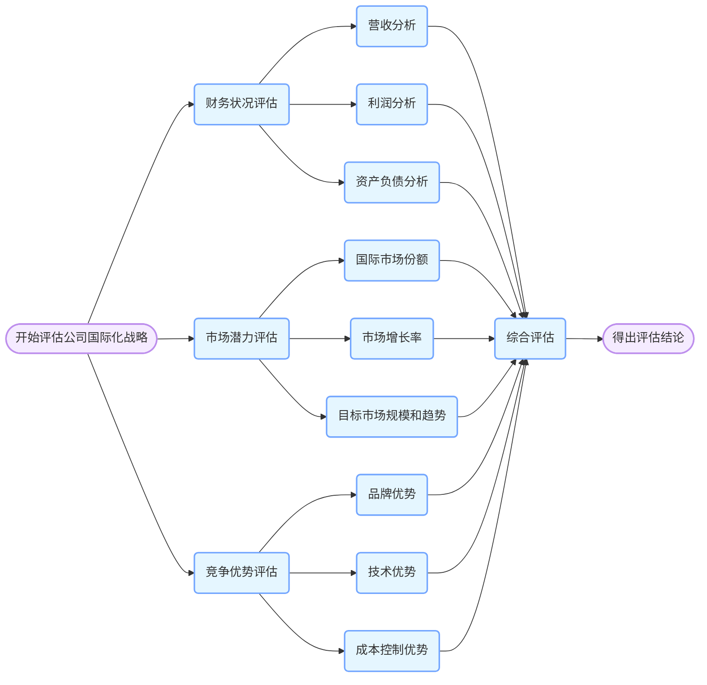

# 彼得林奇如何评估公司的国际化战略

> 关键词：彼得林奇、公司评估、国际化战略、财务分析、市场潜力

> 摘要：本文深入探讨了投资大师彼得林奇评估公司国际化战略的方法。详细阐述了相关核心概念，剖析核心算法原理与具体操作步骤，结合数学模型进行解读，并通过实际案例展示如何运用这些方法。同时介绍了该评估方法在不同场景的应用，推荐了学习所需的工具和资源，最后总结其未来发展趋势与挑战，并对常见问题进行解答。

## 1. 背景介绍 
### 1.1 目的和范围
彼得林奇是投资界的传奇人物，他的投资理念和方法影响深远。评估公司的国际化战略对于投资者判断公司的发展潜力和投资价值至关重要。本文的目的是详细解析彼得林奇评估公司国际化战略的具体方法和思路，范围涵盖核心概念、算法原理、数学模型、实际案例以及应用场景等多个方面，旨在为投资者和相关从业者提供全面且深入的参考。

### 1.2 预期读者
本文预期读者包括股票投资者、金融分析师、企业战略规划人员以及对投资和企业战略感兴趣的学生和研究人员。这些读者希望通过了解彼得林奇的评估方法，提升自己在投资决策和企业战略分析方面的能力。

### 1.3 文档结构概述
本文首先介绍背景信息，让读者了解研究的目的和适用对象。接着阐述核心概念，明确相关术语和原理。然后详细讲解核心算法原理和具体操作步骤，并结合数学模型进行分析。通过实际案例展示如何将理论应用于实践，探讨其在不同场景的应用。推荐学习所需的工具和资源，最后总结未来发展趋势与挑战，解答常见问题，并提供扩展阅读和参考资料。

### 1.4 术语表
#### 1.4.1 核心术语定义
- **国际化战略**：企业为了实现全球市场拓展、资源优化配置等目标，在全球范围内开展业务活动的一系列战略规划和行动。
- **市场份额**：企业在特定市场中销售的产品或服务占该市场总销售量的比例。
- **营收增长率**：企业在一定时期内营业收入的增长比例，反映企业的发展速度。
- **利润率**：企业利润与营业收入的比率，体现企业的盈利能力。

#### 1.4.2 相关概念解释
- **本地化运营**：企业在进入国际市场时，根据当地市场的需求、文化、法律等因素，对产品、服务和营销策略进行调整，以更好地适应当地市场。
- **供应链全球化**：企业将供应链的各个环节分布在全球不同地区，以实现资源的最优配置和成本的降低。

#### 1.4.3 缩略词列表
- **GDP**：国内生产总值（Gross Domestic Product）
- **ROE**：净资产收益率（Return on Equity）

## 2. 核心概念与联系 

### 核心概念原理
彼得林奇评估公司国际化战略主要基于对公司财务状况、市场潜力和竞争优势的综合分析。从财务角度看，他关注公司的营收、利润、资产负债等指标，以判断公司的盈利能力和财务健康状况。在市场潜力方面，他会研究公司在国际市场的份额、市场增长率以及目标市场的规模和发展趋势。竞争优势则体现在公司的品牌、技术、成本控制等方面。

### 架构的文本示意图
```plaintext
彼得林奇评估公司国际化战略
|-- 财务状况评估
|   |-- 营收分析
|   |-- 利润分析
|   |-- 资产负债分析
|-- 市场潜力评估
|   |-- 国际市场份额
|   |-- 市场增长率
|   |-- 目标市场规模和趋势
|-- 竞争优势评估
|   |-- 品牌优势
|   |-- 技术优势
|   |-- 成本控制优势
```

### Mermaid 流程图


## 3. 核心算法原理 & 具体操作步骤 

### 核心算法原理
彼得林奇评估公司国际化战略并没有严格意义上的固定算法，但可以通过一些关键指标的计算和分析来实现。例如，通过计算营收增长率来评估公司在国际市场的发展速度，公式为：

$$营收增长率 = \frac{本期营收 - 上期营收}{上期营收} \times 100\%$$

利润率则反映公司的盈利能力，公式为：

$$利润率 = \frac{净利润}{营业收入} \times 100\%$$

### 具体操作步骤
#### 步骤 1：收集数据
收集公司的财务报表、市场研究报告、行业数据等相关信息，包括不同地区的营收、利润、市场份额等数据。

#### 步骤 2：计算关键指标
根据收集到的数据，计算营收增长率、利润率、市场份额等关键指标。以下是使用 Python 实现营收增长率和利润率计算的代码示例：

```python
def revenue_growth_rate(current_revenue, previous_revenue):
    """
    计算营收增长率
    :param current_revenue: 本期营收
    :param previous_revenue: 上期营收
    :return: 营收增长率
    """
    return ((current_revenue - previous_revenue) / previous_revenue) * 100

def profit_margin(net_profit, revenue):
    """
    计算利润率
    :param net_profit: 净利润
    :param revenue: 营业收入
    :return: 利润率
    """
    return (net_profit / revenue) * 100

# 示例数据
current_revenue = 1000000
previous_revenue = 800000
net_profit = 200000

# 计算营收增长率
growth_rate = revenue_growth_rate(current_revenue, previous_revenue)
print(f"营收增长率: {growth_rate}%")

# 计算利润率
margin = profit_margin(net_profit, current_revenue)
print(f"利润率: {margin}%")
```

#### 步骤 3：分析指标
将计算得到的指标与同行业其他公司进行比较，分析公司在国际市场的竞争力和发展潜力。同时，关注指标的变化趋势，判断公司的国际化战略是否有效。

#### 步骤 4：综合评估
结合财务状况、市场潜力和竞争优势等多个方面的分析结果，对公司的国际化战略进行综合评估，得出结论。

## 4. 数学模型和公式 & 详细讲解 & 举例说明 

### 数学模型和公式
除了前面提到的营收增长率和利润率公式外，彼得林奇还会关注净资产收益率（ROE），它反映了公司运用自有资本的效率，公式为：

$$ROE = \frac{净利润}{净资产} \times 100\%$$

### 详细讲解
- **营收增长率**：该指标反映了公司在国际市场的业务扩张速度。较高的营收增长率通常意味着公司的产品或服务在国际市场上受到欢迎，市场份额在扩大。
- **利润率**：利润率体现了公司在国际市场的盈利能力。如果公司能够在国际市场上保持较高的利润率，说明其具有较强的成本控制能力和定价权。
- **ROE**：ROE 越高，说明公司利用自有资本创造利润的能力越强。在评估公司的国际化战略时，ROE 可以帮助投资者判断公司的长期盈利能力和价值创造能力。

### 举例说明
假设公司 A 在 2022 年的营业收入为 5000 万元，2023 年为 6000 万元，净利润为 1000 万元，净资产为 5000 万元。

- 营收增长率：
$$营收增长率 = \frac{6000 - 5000}{5000} \times 100\% = 20\%$$

- 利润率：
$$利润率 = \frac{1000}{6000} \times 100\% \approx 16.67\%$$

- ROE：
$$ROE = \frac{1000}{5000} \times 100\% = 20\%$$

通过计算可以看出，公司 A 在 2023 年的营收增长率为 20%，说明其业务在国际市场上有一定的扩张。利润率约为 16.67%，ROE 为 20%，表明公司具有较好的盈利能力和资本利用效率。

## 5. 项目实战：代码实际案例和详细解释说明 

### 5.1  开发环境搭建
- **Python 安装**：从 Python 官方网站（https://www.python.org/downloads/）下载并安装适合你操作系统的 Python 版本。建议安装 Python 3.7 及以上版本。
- **IDE 选择**：可以选择 PyCharm、Visual Studio Code 等集成开发环境。这里以 PyCharm 为例，从 JetBrains 官方网站（https://www.jetbrains.com/pycharm/download/）下载并安装社区版或专业版。
- **依赖库安装**：在命令行中使用以下命令安装所需的依赖库：
```bash
pip install pandas numpy matplotlib
```

### 5.2  源代码详细实现和代码解读
以下是一个完整的 Python 代码示例，用于分析公司在不同地区的营收数据，评估其国际化战略的效果：

```python
import pandas as pd
import numpy as np
import matplotlib.pyplot as plt

# 模拟公司在不同地区的营收数据
data = {
    '地区': ['美国', '欧洲', '亚洲', '其他'],
    '2022年营收': [1000, 800, 600, 200],
    '2023年营收': [1200, 900, 800, 300]
}

# 创建 DataFrame
df = pd.DataFrame(data)

# 计算各地区的营收增长率
df['营收增长率'] = ((df['2023年营收'] - df['2022年营收']) / df['2022年营收']) * 100

# 计算公司整体的营收增长率
total_revenue_2022 = df['2022年营收'].sum()
total_revenue_2023 = df['2023年营收'].sum()
overall_growth_rate = ((total_revenue_2023 - total_revenue_2022) / total_revenue_2022) * 100

# 输出各地区的营收增长率和整体营收增长率
print("各地区营收增长率：")
print(df[['地区', '营收增长率']])
print(f"公司整体营收增长率: {overall_growth_rate}%")

# 绘制柱状图展示各地区营收增长率
plt.bar(df['地区'], df['营收增长率'])
plt.xlabel('地区')
plt.ylabel('营收增长率 (%)')
plt.title('各地区营收增长率')
plt.show()
```

### 代码解读与分析
- **数据模拟**：使用字典 `data` 模拟公司在不同地区的营收数据，包括 2022 年和 2023 年的营收。
- **创建 DataFrame**：使用 `pandas` 库的 `DataFrame` 函数将字典数据转换为表格形式，方便进行数据处理和分析。
- **计算营收增长率**：通过公式计算各地区的营收增长率，并添加到 DataFrame 中。同时，计算公司整体的营收增长率。
- **输出结果**：打印各地区的营收增长率和公司整体的营收增长率，让用户直观了解公司在不同地区的业务发展情况。
- **绘制柱状图**：使用 `matplotlib` 库绘制柱状图，直观展示各地区的营收增长率，帮助用户更好地理解数据。

## 6. 实际应用场景 
### 投资决策
投资者可以运用彼得林奇的评估方法来分析公司的国际化战略，判断公司的投资价值。如果公司在国际市场上具有较高的营收增长率、利润率和市场份额，说明其国际化战略较为成功，具有较大的投资潜力。

### 企业战略规划
企业管理者可以借鉴彼得林奇的评估思路，对自身的国际化战略进行评估和调整。通过分析财务指标、市场潜力和竞争优势，找出战略中的不足之处，制定更加有效的国际化发展策略。

### 行业研究
研究机构和分析师可以使用这种评估方法对整个行业的国际化发展情况进行研究。比较不同公司的国际化战略和绩效，发现行业的发展趋势和竞争格局，为行业发展提供参考。

## 7. 工具和资源推荐
### 7.1 学习资源推荐
#### 7.1.1 书籍推荐
- 《彼得林奇的成功投资》：彼得林奇的经典著作，详细介绍了他的投资理念和方法，包括如何评估公司的基本面和发展潜力。
- 《战胜华尔街》：进一步阐述了彼得林奇的投资策略，结合实际案例进行分析，对投资者有很大的启发。

#### 7.1.2 在线课程
- Coursera 上的“投资学原理”：系统介绍了投资的基本理论和方法，包括公司分析、估值模型等内容。
- edX 上的“金融市场”：由知名教授授课，讲解金融市场的运作机制和投资策略。

#### 7.1.3 技术博客和网站
- Seeking Alpha：提供大量的金融分析文章和研究报告，涵盖了各种行业和公司的分析。
- Motley Fool：专注于投资教育和股票分析，有很多实用的投资建议和案例分析。

### 7.2 开发工具框架推荐
#### 7.2.1 IDE和编辑器
- PyCharm：功能强大的 Python 集成开发环境，提供代码编辑、调试、版本控制等多种功能。
- Visual Studio Code：轻量级的代码编辑器，支持多种编程语言，有丰富的插件可以扩展功能。

#### 7.2.2 调试和性能分析工具
- pdb：Python 自带的调试器，可以帮助开发者定位代码中的问题。
- cProfile：用于分析 Python 代码的性能，找出性能瓶颈。

#### 7.2.3 相关框架和库
- pandas：用于数据处理和分析，提供了丰富的数据结构和函数，方便进行数据清洗、转换和统计分析。
- numpy：用于科学计算，提供了高效的数组操作和数学函数。
- matplotlib：用于数据可视化，可绘制各种类型的图表，如折线图、柱状图、散点图等。

### 7.3 相关论文著作推荐
#### 7.3.1 经典论文
- Porter, M. E. (1985). Competitive advantage: Creating and sustaining superior performance. Free Press. 该论文提出了竞争优势的概念和分析框架，对企业战略分析有重要的指导意义。
- Dunning, J. H. (1980). Towards an eclectic theory of international production: Some empirical tests. Journal of International Business Studies, 11(1), 9-31. 提出了国际生产折衷理论，解释了企业国际化的动因和模式。

#### 7.3.2 最新研究成果
- Contractor, F. J., Lahiri, S., Elango, B., & Kundu, S. K. (2007). A theoretical framework for the study of multinationality–performance relationships. Journal of International Business Studies, 38(3), 268-283. 研究了跨国公司的国际化程度与绩效之间的关系。
- Hitt, M. A., Hoskisson, R. E., & Kim, H. (1997). International diversification: Effects on innovation and firm performance in product-diversified firms. Academy of Management Journal, 40(4), 767-798. 探讨了国际多元化对企业创新和绩效的影响。

#### 7.3.3 应用案例分析
- Harvard Business School 案例库：提供了大量的企业案例，包括国际化战略的成功和失败案例，通过实际案例分析可以更好地理解和应用相关理论。

## 8. 总结：未来发展趋势与挑战
### 未来发展趋势
- **数字化转型加速**：随着信息技术的快速发展，公司的国际化战略将更加注重数字化转型。通过数字化手段，公司可以更高效地拓展国际市场，降低运营成本，提高竞争力。
- **新兴市场崛起**：新兴市场的经济增长迅速，消费需求不断增加。公司将更加重视在新兴市场的布局，通过本地化运营和产品创新，满足新兴市场的需求。
- **可持续发展成为重要考量**：消费者和投资者对企业的社会责任和可持续发展越来越关注。公司在制定国际化战略时，将更加注重环境保护、社会责任和公司治理，以实现可持续发展。

### 挑战
- **贸易保护主义**：全球贸易保护主义抬头，贸易壁垒增加，给公司的国际化战略带来了挑战。公司需要应对贸易摩擦，寻找新的市场机会和合作模式。
- **文化差异**：不同国家和地区的文化差异较大，公司在国际化过程中需要克服文化障碍，进行有效的跨文化管理。否则，可能会导致市场推广失败、员工管理困难等问题。
- **数据安全和隐私**：在数字化时代，数据安全和隐私问题日益突出。公司在国际化过程中需要处理大量的跨国数据，需要遵守不同国家和地区的数据保护法规，确保数据的安全和隐私。

## 9. 附录：常见问题与解答
### 问题 1：彼得林奇的评估方法适用于所有行业吗？
解答：彼得林奇的评估方法具有一定的通用性，但不同行业的特点和竞争环境不同，在应用时需要结合行业特点进行调整。例如，高科技行业更注重技术创新和研发投入，而传统制造业则更关注成本控制和生产效率。

### 问题 2：如何获取准确的公司财务数据和市场信息？
解答：可以通过公司的官方网站、证券交易所的公告、财经媒体等渠道获取公司的财务报表和相关信息。同时，还可以参考专业的市场研究机构发布的报告，以获取更全面和准确的市场信息。

### 问题 3：评估公司国际化战略时，还需要考虑哪些因素？
解答：除了财务状况、市场潜力和竞争优势外，还需要考虑政治风险、法律环境、汇率波动等因素。这些因素可能会对公司的国际化战略产生重要影响，需要在评估时进行综合考虑。

## 10. 扩展阅读 & 参考资料
### 扩展阅读
- 《聪明的投资者》：本杰明·格雷厄姆的经典著作，介绍了价值投资的基本理念和方法，对投资者有很大的启发。
- 《金融炼金术》：乔治·索罗斯的著作，阐述了他的投资哲学和市场分析方法，值得深入研究。

### 参考资料
- 彼得林奇的相关演讲和访谈记录。
- 各大财经媒体的报道和分析文章。
- 相关行业协会发布的研究报告和统计数据。

作者：AI天才研究院/AI Genius Institute & 禅与计算机程序设计艺术 /Zen And The Art of Computer Programming