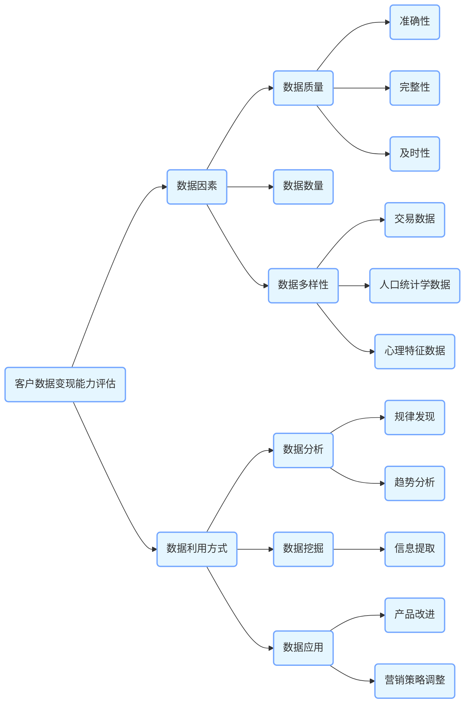

# 彼得林奇如何评估公司的客户数据变现能力

> 关键词：彼得林奇、客户数据变现能力、评估方法、公司分析、数据价值

> 摘要：本文深入探讨了彼得林奇评估公司客户数据变现能力的方法。彼得林奇作为投资界的传奇人物，其投资理念和分析方法具有重要的借鉴意义。通过对公司客户数据变现能力的评估，能够更好地判断公司的潜在价值和发展前景。文章将从背景介绍入手，阐述相关核心概念，详细讲解评估的算法原理和操作步骤，给出数学模型和公式，结合实际项目案例进行分析，探讨实际应用场景，推荐相关工具和资源，最后总结未来发展趋势与挑战，并解答常见问题，为投资者和企业管理者提供全面的参考。

## 1. 背景介绍 
### 1.1 目的和范围
在当今数字化时代，客户数据已经成为公司的重要资产。评估公司的客户数据变现能力对于投资者来说，可以帮助他们更准确地判断公司的投资价值，寻找具有潜力的投资标的；对于企业管理者而言，有助于了解公司在数据利用方面的优势和不足，制定合理的发展战略。本文的范围主要聚焦于彼得林奇的评估思路和方法，以及如何将其应用于公司客户数据变现能力的评估中。

### 1.2 预期读者
本文预期读者包括投资者，无论是专业的投资机构人员还是个人投资者，他们希望通过了解彼得林奇的评估方法来优化投资决策；企业管理者，特别是负责市场营销、数据分析和战略规划的人员，能够从中获取提升公司客户数据变现能力的启示；以及对金融投资和数据分析感兴趣的研究人员和学生。

### 1.3 文档结构概述
本文首先介绍背景信息，让读者了解评估公司客户数据变现能力的重要性和本文的目标读者。接着阐述核心概念，明确相关术语和概念之间的联系。然后详细讲解核心算法原理和具体操作步骤，通过 Python 代码进行示例。给出数学模型和公式，并举例说明其应用。通过项目实战案例，展示如何在实际中应用这些方法进行评估。探讨实际应用场景，分析该评估方法在不同领域的应用价值。推荐相关的工具和资源，帮助读者进一步学习和实践。最后总结未来发展趋势与挑战，解答常见问题，并提供扩展阅读和参考资料。

### 1.4 术语表
#### 1.4.1 核心术语定义
- **客户数据变现能力**：指公司将所拥有的客户数据转化为实际经济收益的能力，包括通过数据直接销售、基于数据的产品或服务创新、精准营销等方式实现盈利。
- **彼得林奇投资理念**：彼得林奇是美国著名的投资家，他强调通过深入研究公司的基本面，包括公司的业务模式、财务状况、竞争优势等，寻找具有成长潜力的公司进行投资。
- **数据价值密度**：指数据中包含的有价值信息的比例，反映了数据的质量和可用性。

#### 1.4.2 相关概念解释
- **客户生命周期价值**：是指客户在与公司的整个交易过程中为公司带来的总收益，考虑了客户的购买频率、购买金额、购买周期等因素。
- **数据资产化**：将公司的客户数据视为一种资产，通过合理的管理和运营，实现数据的价值最大化。

#### 1.4.3 缩略词列表
- **CLV**：Customer Lifetime Value，客户生命周期价值
- **ROI**：Return on Investment，投资回报率

## 2. 核心概念与联系 

### 核心概念原理
彼得林奇评估公司客户数据变现能力的核心在于全面了解公司的业务模式和客户数据的特点。公司的客户数据变现能力取决于多个因素，包括数据的质量、数量、多样性，以及公司对数据的利用方式。

从数据质量来看，准确、完整、及时的数据更有可能为公司带来价值。例如，一家电商公司如果能够准确记录客户的购买偏好、浏览历史等信息，就可以利用这些数据进行精准营销，提高客户的购买转化率。

数据的数量也是重要因素之一。拥有大量的客户数据可以为公司提供更广泛的分析基础，发现更多的商业机会。例如，社交媒体平台拥有海量的用户数据，通过对这些数据的分析，可以了解用户的兴趣爱好、社交关系等，从而开展精准广告投放。

数据的多样性同样不可忽视。不同类型的数据可以相互补充，为公司提供更全面的客户画像。例如，除了交易数据外，公司还可以收集客户的人口统计学数据、心理特征数据等，以便更好地满足客户的需求。

公司对数据的利用方式包括数据的分析、挖掘和应用。通过数据分析，公司可以发现数据中的规律和趋势；数据挖掘则可以从大量数据中提取有价值的信息；而数据应用则是将这些信息转化为实际的业务行动，如产品改进、营销策略调整等。

### 架构的文本示意图
```plaintext
客户数据变现能力评估
|-- 数据因素
|   |-- 数据质量
|   |   |-- 准确性
|   |   |-- 完整性
|   |   |-- 及时性
|   |-- 数据数量
|   |-- 数据多样性
|       |-- 交易数据
|       |-- 人口统计学数据
|       |-- 心理特征数据
|-- 数据利用方式
|   |-- 数据分析
|   |   |-- 规律发现
|   |   |-- 趋势分析
|   |-- 数据挖掘
|   |   |-- 信息提取
|   |-- 数据应用
|       |-- 产品改进
|       |-- 营销策略调整
```

### Mermaid 流程图


## 3. 核心算法原理 & 具体操作步骤 

### 核心算法原理
彼得林奇评估公司客户数据变现能力的核心算法可以基于客户生命周期价值（CLV）模型。CLV 模型通过预测客户在未来一段时间内为公司带来的总收益，来评估客户数据的潜在价值。

其基本公式为：

$$CLV = \sum_{t=1}^{T} \frac{MR_t - C_t}{(1 + r)^t}$$

其中，$MR_t$ 表示第 $t$ 期的客户边际收益，$C_t$ 表示第 $t$ 期的客户服务成本，$r$ 表示贴现率，$T$ 表示客户的生命周期。

### 具体操作步骤
#### 步骤 1：数据收集
收集公司的客户交易数据、客户服务成本数据等相关信息。例如，对于一家电商公司，需要收集客户的购买金额、购买时间、购买频率、营销费用等数据。

#### 步骤 2：数据清洗和预处理
对收集到的数据进行清洗，去除重复、错误和缺失的数据。同时，对数据进行预处理，如数据标准化、归一化等，以便后续分析。

#### 步骤 3：计算客户边际收益和服务成本
根据清洗后的数据，计算每个客户在不同时期的边际收益和服务成本。边际收益可以通过客户的购买金额减去产品成本来计算，服务成本包括营销费用、客服费用等。

#### 步骤 4：确定贴现率和客户生命周期
贴现率反映了资金的时间价值，通常可以根据市场利率或公司的资金成本来确定。客户生命周期可以通过历史数据统计分析得到，例如平均客户留存时间。

#### 步骤 5：计算客户生命周期价值
根据上述公式，计算每个客户的生命周期价值。

#### 步骤 6：评估公司客户数据变现能力
将所有客户的生命周期价值相加，得到公司的客户总生命周期价值。同时，结合公司的实际收益情况，评估公司客户数据变现能力的强弱。

### Python 代码示例
```python
import pandas as pd
import numpy as np

# 模拟客户交易数据
data = {
    'customer_id': [1, 1, 2, 2],
    'purchase_date': ['2023-01-01', '2023-02-01', '2023-01-15', '2023-03-01'],
    'purchase_amount': [100, 200, 150, 250],
    'service_cost': [10, 20, 15, 25]
}
df = pd.DataFrame(data)

# 数据预处理
df['purchase_date'] = pd.to_datetime(df['purchase_date'])

# 假设贴现率为 0.1，客户生命周期为 3 年
r = 0.1
T = 3

# 计算每个客户的生命周期价值
clv_dict = {}
for customer_id, group in df.groupby('customer_id'):
    group = group.sort_values('purchase_date')
    clv = 0
    for t in range(len(group)):
        mr = group.iloc[t]['purchase_amount'] - group.iloc[t]['service_cost']
        clv += mr / ((1 + r) ** t)
    clv_dict[customer_id] = clv

# 计算公司的客户总生命周期价值
total_clv = sum(clv_dict.values())
print(f"公司的客户总生命周期价值: {total_clv}")
```

## 4. 数学模型和公式 & 详细讲解 & 举例说明 

### 数学模型和公式
#### 客户生命周期价值模型
$$CLV = \sum_{t=1}^{T} \frac{MR_t - C_t}{(1 + r)^t}$$

其中：
- $CLV$ 表示客户生命周期价值。
- $MR_t$ 表示第 $t$ 期的客户边际收益，即客户在第 $t$ 期的购买金额减去产品成本。
- $C_t$ 表示第 $t$ 期的客户服务成本，包括营销费用、客服费用等。
- $r$ 表示贴现率，反映了资金的时间价值。
- $T$ 表示客户的生命周期，即客户与公司保持交易关系的时间。

#### 客户数据变现能力评估指标
为了更全面地评估公司的客户数据变现能力，可以引入以下指标：

- **数据变现率**：
$$数据变现率 = \frac{实际数据收益}{客户总生命周期价值} \times 100\%$$

- **数据投资回报率（ROI）**：
$$ROI = \frac{实际数据收益 - 数据投资成本}{数据投资成本} \times 100\%$$

### 详细讲解
#### 客户生命周期价值模型
该模型考虑了客户在整个生命周期内为公司带来的收益和成本，并通过贴现率将未来的现金流折现到当前。贴现率的作用是反映资金的时间价值，因为未来的收益不如当前的收益可靠。客户生命周期的确定对于准确计算 CLV 非常重要，通常可以通过历史数据统计分析得到。

#### 数据变现率
数据变现率反映了公司将客户数据转化为实际收益的能力。数据变现率越高，说明公司的客户数据变现能力越强。

#### 数据投资回报率
数据投资回报率衡量了公司在客户数据方面的投资收益情况。ROI 越高，说明公司在客户数据投资上的回报越好。

### 举例说明
假设一家电商公司有一个客户，在未来 3 年内的交易情况如下：

| 年份 | 购买金额 | 产品成本 | 服务成本 |
| ---- | ---- | ---- | ---- |
| 1 | 1000 | 500 | 100 |
| 2 | 1200 | 600 | 120 |
| 3 | 1500 | 750 | 150 |

假设贴现率 $r = 0.1$。

首先计算每年的客户边际收益：
- 第 1 年：$MR_1 = 1000 - 500 = 500$
- 第 2 年：$MR_2 = 1200 - 600 = 600$
- 第 3 年：$MR_3 = 1500 - 750 = 750$

然后计算客户生命周期价值：
$$
\begin{align*}
CLV &= \frac{500 - 100}{(1 + 0.1)^1} + \frac{600 - 120}{(1 + 0.1)^2} + \frac{750 - 150}{(1 + 0.1)^3}\\
&= \frac{400}{1.1} + \frac{480}{1.21} + \frac{600}{1.331}\\
&\approx 363.64 + 396.69 + 450.79\\
&= 1211.12
\end{align*}
$$

假设该客户为公司带来的实际数据收益为 1000 元，数据投资成本为 200 元。

计算数据变现率：
$$数据变现率 = \frac{1000}{1211.12} \times 100\% \approx 82.57\%$$

计算数据投资回报率：
$$ROI = \frac{1000 - 200}{200} \times 100\% = 400\%$$

从上述计算结果可以看出，该客户的生命周期价值为 1211.12 元，数据变现率为 82.57%，数据投资回报率为 400%，说明公司在该客户数据变现方面表现较好。

## 5. 项目实战：代码实际案例和详细解释说明 

### 5.1  开发环境搭建
#### 安装 Python
首先需要安装 Python 环境，建议使用 Python 3.7 及以上版本。可以从 Python 官方网站（https://www.python.org/downloads/）下载安装包，按照安装向导进行安装。

#### 安装必要的库
在项目中需要使用到 pandas、numpy 等库，可以使用以下命令进行安装：
```sh
pip install pandas numpy
```

### 5.2  源代码详细实现和代码解读
```python
import pandas as pd
import numpy as np

# 模拟客户交易数据
data = {
    'customer_id': [1, 1, 2, 2, 3, 3],
    'purchase_date': ['2023-01-01', '2023-02-01', '2023-01-15', '2023-03-01', '2023-02-05', '2023-03-10'],
    'purchase_amount': [100, 200, 150, 250, 120, 180],
    'service_cost': [10, 20, 15, 25, 12, 18]
}
df = pd.DataFrame(data)

# 数据预处理
df['purchase_date'] = pd.to_datetime(df['purchase_date'])

# 假设贴现率为 0.1，客户生命周期为 3 年
r = 0.1
T = 3

# 计算每个客户的生命周期价值
clv_dict = {}
for customer_id, group in df.groupby('customer_id'):
    group = group.sort_values('purchase_date')
    clv = 0
    for t in range(len(group)):
        mr = group.iloc[t]['purchase_amount'] - group.iloc[t]['service_cost']
        clv += mr / ((1 + r) ** t)
    clv_dict[customer_id] = clv

# 计算公司的客户总生命周期价值
total_clv = sum(clv_dict.values())

# 假设实际数据收益为 800 元，数据投资成本为 200 元
actual_income = 800
investment_cost = 200

# 计算数据变现率和数据投资回报率
data_realization_rate = (actual_income / total_clv) * 100
roi = ((actual_income - investment_cost) / investment_cost) * 100

print(f"公司的客户总生命周期价值: {total_clv}")
print(f"数据变现率: {data_realization_rate}%")
print(f"数据投资回报率: {roi}%")
```

### 代码解读与分析
#### 数据模拟
```python
data = {
    'customer_id': [1, 1, 2, 2, 3, 3],
    'purchase_date': ['2023-01-01', '2023-02-01', '2023-01-15', '2023-03-01', '2023-02-05', '2023-03-10'],
    'purchase_amount': [100, 200, 150, 250, 120, 180],
    'service_cost': [10, 20, 15, 25, 12, 18]
}
df = pd.DataFrame(data)
```
这段代码模拟了客户的交易数据，包括客户 ID、购买日期、购买金额和服务成本。使用 pandas 的 `DataFrame` 来存储数据，方便后续处理。

#### 数据预处理
```python
df['purchase_date'] = pd.to_datetime(df['purchase_date'])
```
将购买日期转换为日期时间类型，以便进行排序和时间计算。

#### 计算客户生命周期价值
```python
clv_dict = {}
for customer_id, group in df.groupby('customer_id'):
    group = group.sort_values('purchase_date')
    clv = 0
    for t in range(len(group)):
        mr = group.iloc[t]['purchase_amount'] - group.iloc[t]['service_cost']
        clv += mr / ((1 + r) ** t)
    clv_dict[customer_id] = clv
```
通过 `groupby` 方法按客户 ID 分组，对每个客户的数据进行处理。计算每个客户在不同时期的边际收益，并根据贴现率计算其生命周期价值。

#### 计算公司的客户总生命周期价值
```python
total_clv = sum(clv_dict.values())
```
将所有客户的生命周期价值相加，得到公司的客户总生命周期价值。

#### 计算数据变现率和数据投资回报率
```python
actual_income = 800
investment_cost = 200

data_realization_rate = (actual_income / total_clv) * 100
roi = ((actual_income - investment_cost) / investment_cost) * 100
```
根据假设的实际数据收益和数据投资成本，计算数据变现率和数据投资回报率。

## 6. 实际应用场景 
### 金融行业
在金融行业，银行、证券等机构拥有大量的客户数据。通过评估客户数据变现能力，银行可以更好地了解客户的需求和风险偏好，为客户提供个性化的金融产品和服务。例如，根据客户的交易数据和信用记录，银行可以为优质客户提供更高额度的信用卡或贷款，并收取相应的利息和手续费。证券机构可以利用客户数据进行精准营销，推荐适合客户的投资产品，提高客户的交易活跃度和资产规模。

### 零售行业
零售企业可以通过分析客户数据，了解客户的购买习惯、偏好和忠诚度。根据客户数据变现能力的评估结果，企业可以制定更有效的营销策略，如个性化推荐、优惠券发放等。例如，一家超市可以根据客户的购买历史，为客户推荐他们可能感兴趣的商品，提高客户的购买转化率和客单价。同时，通过对客户数据的分析，企业还可以优化商品库存管理，降低运营成本。

### 互联网行业
互联网公司，如电商平台、社交媒体平台等，拥有海量的客户数据。通过评估客户数据变现能力，电商平台可以优化搜索算法，提高商品推荐的准确性，增加客户的购买量。社交媒体平台可以根据用户的兴趣爱好和社交关系，开展精准广告投放，提高广告的点击率和转化率。此外，互联网公司还可以将客户数据进行整合和分析，开发新的产品和服务，如大数据分析报告、市场调研等，实现数据的直接变现。

### 医疗行业
在医疗行业，医院和医疗企业可以收集患者的病历、诊断结果、治疗记录等数据。通过评估客户数据变现能力，医院可以利用这些数据进行医疗质量评估、疾病预测和预防等。医疗企业可以与科研机构合作，将患者数据用于药物研发和临床试验，为企业带来新的收入来源。同时，医院还可以根据患者的需求和偏好，提供个性化的医疗服务，提高患者的满意度和忠诚度。

## 7. 工具和资源推荐
### 7.1 学习资源推荐
#### 7.1.1 书籍推荐
- 《彼得林奇的成功投资》：这本书是彼得林奇的经典著作，详细介绍了他的投资理念和方法，对于理解如何评估公司的价值具有重要的参考意义。
- 《数据资产论》：深入探讨了数据资产的概念、管理和运营，有助于读者了解客户数据变现的理论基础。
- 《Python 数据分析实战》：介绍了如何使用 Python 进行数据分析，对于实现客户数据变现能力评估的代码实践非常有帮助。

#### 7.1.2 在线课程
- Coursera 上的“Data Science Specialization”：该课程涵盖了数据分析的各个方面，包括数据清洗、数据分析算法、数据可视化等，适合初学者和有一定基础的学习者。
- edX 上的“Machine Learning for Data Science and Analytics”：介绍了机器学习在数据分析中的应用，对于深入理解客户数据变现能力评估的算法原理有很大的帮助。

#### 7.1.3 技术博客和网站
- KDnuggets：一个专注于数据科学和机器学习的博客网站，提供了大量的技术文章、案例分析和行业动态。
- Towards Data Science：是 Medium 上的一个知名数据科学社区，有很多专业的数据科学家分享他们的经验和见解。

### 7.2 开发工具框架推荐
#### 7.2.1 IDE和编辑器
- PyCharm：是一款专业的 Python 集成开发环境，提供了丰富的代码编辑、调试和项目管理功能，适合开发复杂的 Python 项目。
- Jupyter Notebook：是一个交互式的开发环境，支持 Python、R 等多种编程语言，非常适合进行数据分析和模型开发。

#### 7.2.2 调试和性能分析工具
- pdb：Python 内置的调试工具，可以帮助开发者在代码执行过程中进行调试，定位问题。
- cProfile：Python 标准库中的性能分析工具，可以分析代码的运行时间和函数调用情况，帮助开发者优化代码性能。

#### 7.2.3 相关框架和库
- pandas：是 Python 中用于数据处理和分析的重要库，提供了高效的数据结构和数据操作方法。
- numpy：是 Python 中用于科学计算的基础库，提供了高效的数组操作和数学函数。
- scikit-learn：是 Python 中用于机器学习的常用框架，提供了各种机器学习算法和工具，如分类、回归、聚类等。

### 7.3 相关论文著作推荐
#### 7.3.1 经典论文
- “Customer Lifetime Value Measurement and Management: Concepts, Methods, and Applications”：该论文详细介绍了客户生命周期价值的测量和管理方法，是客户数据变现能力评估的重要理论基础。
- “Data Monetization: A Framework for Creating Value from Data”：提出了数据变现的框架和方法，对于理解如何将客户数据转化为实际收益具有重要的参考价值。

#### 7.3.2 最新研究成果
- 在学术数据库如 IEEE Xplore、ACM Digital Library 等上搜索关于“customer data monetization”的最新研究论文，可以了解该领域的最新发展动态和研究成果。

#### 7.3.3 应用案例分析
- 一些知名企业的案例分析报告，如亚马逊、谷歌等公司在客户数据变现方面的实践经验，可以从企业的官方网站、行业报告等渠道获取。这些案例可以帮助读者更好地理解如何在实际中应用客户数据变现能力评估方法。

## 8. 总结：未来发展趋势与挑战
### 未来发展趋势
#### 数据驱动的决策成为主流
随着数据技术的不断发展和应用，越来越多的公司将采用数据驱动的决策方式。通过评估客户数据变现能力，公司可以更准确地了解客户需求，制定更有效的战略和决策，提高市场竞争力。

#### 数据安全和隐私保护得到重视
在客户数据变现的过程中，数据安全和隐私保护将成为重要的关注点。未来，公司需要加强数据安全管理，遵守相关法律法规，保护客户的隐私和数据安全。同时，也需要开发更加安全可靠的数据变现技术和方法。

#### 跨行业数据融合和合作加强
不同行业之间的数据融合和合作将越来越频繁。例如，金融行业和零售行业可以通过数据共享和合作，实现客户数据的互补和增值。这种跨行业的数据融合和合作将为客户数据变现带来更多的机会和创新模式。

#### 人工智能和机器学习技术的广泛应用
人工智能和机器学习技术将在客户数据变现中发挥越来越重要的作用。通过这些技术，公司可以更深入地分析客户数据，发现潜在的商业机会，提高数据变现的效率和效果。

### 挑战
#### 数据质量和可用性问题
客户数据的质量和可用性是影响数据变现能力的重要因素。在实际应用中，公司可能面临数据不准确、不完整、不一致等问题，需要投入大量的时间和精力进行数据清洗和预处理。

#### 数据安全和隐私风险
随着数据泄露事件的不断发生，数据安全和隐私风险成为公司面临的重要挑战。公司需要建立完善的数据安全管理体系，采取有效的技术措施，保护客户数据的安全和隐私。

#### 法律法规和监管要求
不同国家和地区对于数据使用和变现的法律法规和监管要求存在差异。公司需要了解并遵守相关法律法规，确保数据变现活动的合法性和合规性。

#### 人才短缺
客户数据变现需要具备数据分析、机器学习、商业智能等多方面知识和技能的专业人才。目前，市场上这类人才相对短缺，公司需要加强人才培养和引进，提高团队的整体素质和能力。

## 9. 附录：常见问题与解答
### 问题 1：如何确定贴现率？
贴现率的确定通常需要考虑市场利率、公司的资金成本、投资风险等因素。一般来说，可以参考市场上同类投资的回报率，或者根据公司的加权平均资本成本（WACC）来确定。同时，还需要根据具体的投资项目和风险情况进行适当的调整。

### 问题 2：客户生命周期如何确定？
客户生命周期可以通过历史数据统计分析得到。例如，可以分析客户的首次购买时间、最后购买时间、购买频率等数据，计算客户的平均留存时间。此外，还可以结合行业特点和市场趋势，对客户生命周期进行合理的预测和估计。

### 问题 3：数据变现率和数据投资回报率的区别是什么？
数据变现率反映了公司将客户数据转化为实际收益的能力，侧重于数据的变现效果。而数据投资回报率衡量了公司在客户数据方面的投资收益情况，考虑了数据投资成本。两者都是评估公司客户数据变现能力的重要指标，但侧重点不同。

### 问题 4：如何提高公司的客户数据变现能力？
提高公司的客户数据变现能力可以从以下几个方面入手：
- 提高数据质量：确保数据的准确性、完整性和及时性。
- 加强数据分析和挖掘：深入了解客户需求和行为，发现潜在的商业机会。
- 优化数据应用方式：将数据分析结果转化为实际的业务行动，如产品改进、营销策略调整等。
- 加强数据安全和隐私保护：建立完善的数据安全管理体系，保护客户数据的安全和隐私。
- 培养和引进专业人才：提高团队的数据分析和业务运营能力。

## 10. 扩展阅读 & 参考资料
### 扩展阅读
- 《大数据时代》：探讨了大数据对社会、经济和生活的影响，以及如何利用大数据创造价值。
- 《智能商业》：介绍了智能商业的概念和模式，以及如何通过数据和算法实现商业创新。

### 参考资料
- Lynch, Peter. *One Up on Wall Street*. Simon & Schuster, 1989.
- Gupta, Sunil, and Donald R. Lehmann. "Customer lifetime value measurement and management: Concepts, methods, and applications." *Journal of Interactive Marketing* 18.1 (2004): 7-26.
- Manyika, James, et al. "Big data: The next frontier for innovation, competition, and productivity." McKinsey Global Institute, 2011.

作者：AI天才研究院/AI Genius Institute & 禅与计算机程序设计艺术 /Zen And The Art of Computer Programming