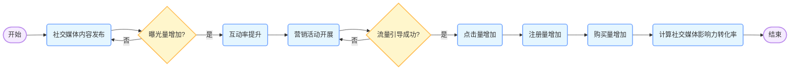

# 彼得林奇如何评估公司的社交媒体影响力转化率

> 关键词：彼得林奇、社交媒体影响力转化率、公司评估、数据指标、投资分析

> 摘要：本文深入探讨彼得林奇评估公司社交媒体影响力转化率的方法。首先介绍相关背景知识，包括目的、预期读者、文档结构和术语表。接着阐述核心概念及联系，详细说明核心算法原理与具体操作步骤，并给出数学模型和公式进行详细讲解与举例。通过项目实战展示代码实现与解读，分析实际应用场景。同时推荐相关工具和资源，最后总结未来发展趋势与挑战，解答常见问题并提供扩展阅读和参考资料，旨在为投资者和分析师提供全面的评估思路和方法。

## 1. 背景介绍 
### 1.1 目的和范围
彼得林奇作为投资界的传奇人物，其投资理念和分析方法一直备受关注。在当今数字化时代，社交媒体对于公司的品牌推广、客户获取和销售转化有着重要影响。本文的目的是探讨彼得林奇可能采用的评估公司社交媒体影响力转化率的方法，范围涵盖从理论概念到实际操作，包括核心算法、数学模型、项目实战等方面，为投资者和相关从业者提供有价值的参考。

### 1.2 预期读者
本文预期读者包括投资者、金融分析师、市场营销人员、社交媒体运营人员以及对彼得林奇投资理念和社交媒体数据分析感兴趣的技术爱好者。通过阅读本文，读者可以了解如何将彼得林奇的投资分析方法应用到社交媒体领域，评估公司在社交媒体上的营销效果和商业价值。

### 1.3 文档结构概述
本文将按照以下结构进行阐述：首先介绍核心概念与联系，明确社交媒体影响力转化率的定义和相关架构；接着讲解核心算法原理和具体操作步骤，并给出Python代码示例；然后介绍数学模型和公式，通过实际例子进行详细说明；再通过项目实战展示代码的实际应用和解读；分析实际应用场景；推荐相关的工具和资源；最后总结未来发展趋势与挑战，解答常见问题并提供扩展阅读和参考资料。

### 1.4 术语表
#### 1.4.1 核心术语定义
- **社交媒体影响力转化率**：指公司在社交媒体平台上的影响力转化为实际业务成果（如销售、客户注册等）的比例。它反映了社交媒体营销活动对公司业务的推动作用。
- **社交媒体影响力**：公司在社交媒体平台上引起的关注、互动和传播程度，通常通过粉丝数量、点赞数、评论数、分享数等指标来衡量。
- **业务成果指标**：如销售额、客户注册量、下载量等，用于衡量公司在社交媒体营销活动后的实际业务增长情况。

#### 1.4.2 相关概念解释
- **曝光量**：公司在社交媒体上的内容被展示的次数，是衡量社交媒体影响力的一个基础指标。
- **互动率**：指用户与公司社交媒体内容的互动行为（如点赞、评论、分享）与曝光量的比例，反映了内容的吸引力和用户参与度。
- **转化率漏斗**：描述了从社交媒体曝光到最终业务转化的过程，包括多个阶段，如曝光、点击、注册、购买等。

#### 1.4.3 缩略词列表
- **ROI**（Return on Investment）：投资回报率，用于衡量投资的收益情况。
- **CPA**（Cost Per Acquisition）：每次获取成本，指获取一个客户或实现一次转化所需的成本。
- **CTR**（Click - Through Rate）：点击率，指广告或链接的点击次数与展示次数的比例。

## 2. 核心概念与联系 

### 核心概念原理
社交媒体影响力转化率的核心原理是衡量公司在社交媒体上的投入（如时间、金钱、精力等）与产出（业务成果）之间的关系。公司通过在社交媒体上发布内容、开展营销活动等方式来提升自身的影响力，吸引潜在客户的关注和互动。当这些潜在客户采取实际行动（如购买产品、注册服务等）时，就实现了从社交媒体影响力到业务成果的转化。

### 架构示意图
以下是一个简单的文本示意图，展示了社交媒体影响力转化率的相关架构：

```
社交媒体平台
|
|-- 内容发布（文章、图片、视频等）
|   |
|   |-- 曝光量
|   |-- 互动率（点赞、评论、分享）
|
|-- 营销活动（促销、竞赛等）
|   |
|   |-- 流量引导（网站、APP等）
|       |
|       |-- 点击量
|       |-- 注册量
|       |-- 购买量
|
|-- 社交媒体影响力
|
|-- 业务成果指标（销售额、客户数量等）
|
|-- 社交媒体影响力转化率（业务成果指标 / 社交媒体影响力相关投入）
```

### Mermaid流程图


这个流程图展示了从社交媒体内容发布到最终计算影响力转化率的整个过程。首先发布内容，看是否能增加曝光量，如果可以则提升互动率，接着开展营销活动引导流量，看是否能成功引导，若成功则依次增加点击量、注册量和购买量，最后计算转化率。

## 3. 核心算法原理 & 具体操作步骤 

### 核心算法原理
计算社交媒体影响力转化率的核心算法是将业务成果指标除以与社交媒体影响力相关的投入指标。常见的业务成果指标包括销售额、客户注册量等，而社交媒体影响力相关的投入指标可以是曝光量、互动量等。

例如，假设公司在社交媒体上的营销活动带来了 $N$ 次曝光，最终实现了 $M$ 笔销售，那么社交媒体影响力转化率 $C$ 可以用以下公式表示：

$C=\frac{M}{N}$

### 具体操作步骤

#### 步骤1：确定业务成果指标
根据公司的业务目标，确定要衡量的业务成果指标。常见的业务成果指标包括：
- **销售额**：通过社交媒体营销活动直接带来的产品或服务销售额。
- **客户注册量**：在社交媒体引导下注册成为公司客户的数量。
- **下载量**：如果公司有APP等产品，通过社交媒体推广带来的下载量。

#### 步骤2：收集社交媒体影响力数据
收集与社交媒体影响力相关的数据，包括：
- **曝光量**：可以通过社交媒体平台提供的数据分析工具获取。
- **互动量**：如点赞数、评论数、分享数等，同样可以从平台的数据分析中得到。
- **流量数据**：包括从社交媒体引导到公司网站或APP的点击量、访问时长等。

#### 步骤3：关联业务成果和社交媒体影响力数据
将收集到的业务成果指标与社交媒体影响力数据进行关联，确定哪些业务成果是由社交媒体营销活动带来的。这可能需要使用一些数据分析技术，如归因分析，来确定每个营销渠道对业务成果的贡献。

#### 步骤4：计算转化率
根据确定的业务成果指标和社交媒体影响力数据，使用相应的公式计算转化率。

### Python源代码示例
以下是一个简单的Python代码示例，用于计算社交媒体影响力转化率：

```python
# 假设业务成果指标为销售额
sales = 10000  # 销售额为10000元
# 假设社交媒体影响力指标为曝光量
exposure = 100000  # 曝光量为100000次

# 计算转化率
conversion_rate = sales / exposure

print(f"社交媒体影响力转化率为: {conversion_rate * 100:.2f}%")
```

在这个示例中，我们假设公司通过社交媒体营销活动获得了100000次曝光，最终实现了10000元的销售额，计算得到的转化率为10%。

## 4. 数学模型和公式 & 详细讲解 & 举例说明 

### 基本数学模型和公式
#### 1. 简单转化率公式
如前面所述，最简单的社交媒体影响力转化率公式为：

$$C=\frac{O}{I}$$

其中，$C$ 表示转化率，$O$ 表示业务成果指标（如销售额、客户注册量等），$I$ 表示社交媒体影响力相关的投入指标（如曝光量、互动量等）。

#### 2. 考虑多阶段转化率的公式
在实际情况中，从社交媒体曝光到最终业务转化可能会经过多个阶段，如曝光、点击、注册、购买等。可以使用多阶段转化率公式来衡量每个阶段的转化效率。

假设从曝光到点击的转化率为 $C_{1}$，从点击到注册的转化率为 $C_{2}$，从注册到购买的转化率为 $C_{3}$，那么最终的社交媒体影响力转化率 $C$ 可以表示为：

$$C = C_{1}\times C_{2}\times C_{3}$$

其中，$C_{1}=\frac{CT}{E}$，$CT$ 表示点击量，$E$ 表示曝光量；$C_{2}=\frac{R}{CT}$，$R$ 表示注册量；$C_{3}=\frac{P}{R}$，$P$ 表示购买量。

### 详细讲解
#### 简单转化率公式
简单转化率公式适用于直接衡量社交媒体影响力与业务成果之间的关系。例如，如果公司只关注曝光量和销售额之间的转化情况，使用这个公式可以快速得到一个大致的转化率。但是，它没有考虑到中间的转化过程，可能会忽略一些重要的信息。

#### 多阶段转化率公式
多阶段转化率公式更能反映实际的转化过程。通过分析每个阶段的转化率，可以找出转化过程中的瓶颈，针对性地进行优化。例如，如果发现从点击到注册的转化率很低，可能需要优化注册页面的设计或流程，提高用户的注册意愿。

### 举例说明
#### 简单转化率示例
假设一家电商公司在社交媒体上投放了广告，获得了50000次曝光，最终实现了2000元的销售额。根据简单转化率公式：

$$C=\frac{2000}{50000}=0.04 = 4\%$$

即该公司的社交媒体影响力转化率为4%。

#### 多阶段转化率示例
假设上述电商公司的广告曝光量为50000次，点击量为2000次，注册量为500次，购买量为100次。

首先计算各阶段的转化率：
- 从曝光到点击的转化率 $C_{1}=\frac{2000}{50000}=0.04 = 4\%$
- 从点击到注册的转化率 $C_{2}=\frac{500}{2000}=0.25 = 25\%$
- 从注册到购买的转化率 $C_{3}=\frac{100}{500}=0.2 = 20\%$

然后计算最终的社交媒体影响力转化率：

$$C = C_{1}\times C_{2}\times C_{3}=0.04\times0.25\times0.2 = 0.002 = 0.2\%$$

通过多阶段转化率的分析，我们可以看到每个阶段的转化效率，发现从曝光到点击的转化率较低，可能需要优化广告内容或投放策略，提高广告的吸引力。

## 5. 项目实战：代码实际案例和详细解释说明 

### 5.1  开发环境搭建
为了完成这个项目实战，我们需要搭建一个Python开发环境。以下是具体步骤：

#### 步骤1：安装Python
可以从Python官方网站（https://www.python.org/downloads/）下载适合你操作系统的Python版本，并按照安装向导进行安装。建议安装Python 3.7及以上版本。

#### 步骤2：安装必要的库
我们将使用 `pandas` 库进行数据处理，`matplotlib` 库进行数据可视化。可以使用以下命令进行安装：

```bash
pip install pandas matplotlib
```

### 5.2  源代码详细实现和代码解读

```python
import pandas as pd
import matplotlib.pyplot as plt

# 模拟数据
data = {
    '日期': ['2024-01-01', '2024-01-02', '2024-01-03', '2024-01-04', '2024-01-05'],
    '曝光量': [10000, 12000, 11000, 13000, 14000],
    '点击量': [500, 600, 550, 650, 700],
    '注册量': [100, 120, 110, 130, 140],
    '购买量': [20, 24, 22, 26, 28]
}

# 创建DataFrame
df = pd.DataFrame(data)

# 计算各阶段转化率
df['曝光到点击转化率'] = df['点击量'] / df['曝光量']
df['点击到注册转化率'] = df['注册量'] / df['点击量']
df['注册到购买转化率'] = df['购买量'] / df['注册量']

# 计算最终社交媒体影响力转化率
df['最终转化率'] = df['曝光到点击转化率'] * df['点击到注册转化率'] * df['注册到购买转化率']

# 输出结果
print(df)

# 可视化各阶段转化率
plt.figure(figsize=(12, 6))
plt.plot(df['日期'], df['曝光到点击转化率'], label='曝光到点击转化率')
plt.plot(df['日期'], df['点击到注册转化率'], label='点击到注册转化率')
plt.plot(df['日期'], df['注册到购买转化率'], label='注册到购买转化率')
plt.plot(df['日期'], df['最终转化率'], label='最终转化率')
plt.xlabel('日期')
plt.ylabel('转化率')
plt.title('社交媒体各阶段转化率')
plt.legend()
plt.grid(True)
plt.show()
```

### 5.3  代码解读与分析

#### 数据模拟与DataFrame创建
首先，我们使用字典 `data` 模拟了一段时间内的社交媒体数据，包括日期、曝光量、点击量、注册量和购买量。然后使用 `pandas` 的 `DataFrame` 函数将字典数据转换为DataFrame对象，方便后续的数据处理和分析。

#### 转化率计算
通过DataFrame的列运算，我们计算了各阶段的转化率，包括曝光到点击转化率、点击到注册转化率、注册到购买转化率和最终转化率。这些转化率可以帮助我们了解每个阶段的转化效率。

#### 结果输出
使用 `print` 函数输出计算结果，方便查看具体的转化率数值。

#### 数据可视化
使用 `matplotlib` 库绘制了各阶段转化率随时间变化的折线图。通过可视化，我们可以更直观地观察转化率的变化趋势，找出转化率波动较大的时间段，分析可能的原因，如是否在某些日期进行了特殊的营销活动等。

## 6. 实际应用场景 
### 投资决策
对于投资者来说，评估公司的社交媒体影响力转化率可以帮助他们判断公司的市场推广能力和潜在增长空间。如果一家公司的社交媒体影响力转化率较高，说明其在社交媒体营销方面表现出色，能够有效地将社交媒体上的影响力转化为实际业务成果，具有较高的投资价值。例如，彼得林奇在评估一家消费类公司时，会关注其在社交媒体上的品牌推广效果和销售转化率，如果该公司通过社交媒体成功吸引了大量年轻消费者并实现了较高的销售转化，那么可能会成为他的投资对象之一。

### 市场营销策略优化
公司可以通过分析社交媒体影响力转化率来优化市场营销策略。如果发现某个社交媒体平台的转化率较低，可以考虑调整在该平台上的营销内容、投放方式或目标受众。例如，如果在微博上的曝光量很高但转化率很低，可能需要优化微博内容的吸引力，或者调整广告投放的时间和频率。

### 产品研发与改进
社交媒体影响力转化率还可以为产品研发和改进提供参考。如果某个产品在社交媒体上的推广效果很好，但转化率较低，可能意味着产品本身存在一些问题，如价格过高、功能不够完善等。公司可以根据用户在社交媒体上的反馈和转化率数据，对产品进行针对性的改进。

### 竞争对手分析
通过比较自己公司和竞争对手的社交媒体影响力转化率，可以了解自身在市场中的竞争地位。如果竞争对手的转化率较高，说明他们在社交媒体营销方面有值得学习的地方，可以分析他们的营销策略和方法，借鉴其成功经验，提升自身的竞争力。

## 7. 工具和资源推荐
### 7.1 学习资源推荐
#### 7.1.1 书籍推荐
- 《彼得林奇的成功投资》：彼得林奇的经典著作，详细介绍了他的投资理念和分析方法，对于理解如何评估公司的价值和潜力有很大帮助。
- 《社交媒体营销实战》：全面介绍了社交媒体营销的策略、方法和技巧，包括如何提升社交媒体影响力和转化率。
- 《数据分析实战》：涵盖了数据分析的基本概念、方法和工具，对于处理和分析社交媒体数据非常有用。

#### 7.1.2 在线课程
- Coursera上的“社交媒体营销基础”课程：由知名大学教授授课，系统地介绍了社交媒体营销的各个方面，包括如何制定营销策略、提升影响力和转化率。
- Udemy上的“数据分析入门”课程：适合初学者学习数据分析的基本技能，如数据清洗、数据分析和可视化等，有助于更好地处理社交媒体数据。

#### 7.1.3 技术博客和网站
- 36氪：提供最新的科技资讯和商业分析，包括社交媒体营销和投资领域的文章和报告。
- 艾瑞网：专注于互联网行业的研究和分析，有很多关于社交媒体市场和用户行为的报告和文章。
- 人人都是产品经理：分享产品设计、市场营销和数据分析等方面的经验和案例，对于理解社交媒体营销和转化率评估有一定的参考价值。

### 7.2 开发工具框架推荐
#### 7.2.1 IDE和编辑器
- PyCharm：一款功能强大的Python集成开发环境，提供代码编辑、调试、版本控制等功能，适合Python开发者进行数据分析和项目开发。
- Jupyter Notebook：一个交互式的编程环境，支持Python等多种编程语言，方便进行数据探索、分析和可视化。

#### 7.2.2 调试和性能分析工具
- pdb：Python自带的调试工具，可以帮助开发者定位代码中的错误和问题。
- cProfile：Python的性能分析工具，可以分析代码的运行时间和性能瓶颈，优化代码的执行效率。

#### 7.2.3 相关框架和库
- pandas：用于数据处理和分析的Python库，提供了高效的数据结构和数据操作方法，适合处理社交媒体数据。
- matplotlib：用于数据可视化的Python库，可以绘制各种类型的图表，如折线图、柱状图、饼图等，帮助用户直观地展示数据。
- scikit - learn：一个机器学习库，提供了各种机器学习算法和工具，可用于预测社交媒体影响力转化率等问题。

### 7.3 相关论文著作推荐
#### 7.3.1 经典论文
- “The Impact of Social Media on Consumer Behavior”：研究了社交媒体对消费者行为的影响，包括消费者的购买决策、品牌认知等方面，对于理解社交媒体营销的作用机制有重要意义。
- “Measuring the Effectiveness of Social Media Marketing Campaigns”：探讨了如何衡量社交媒体营销活动的效果，提出了一些评估指标和方法，对于评估社交媒体影响力转化率有一定的参考价值。

#### 7.3.2 最新研究成果
可以通过学术数据库（如IEEE Xplore、ACM Digital Library等）搜索关于社交媒体营销和转化率评估的最新研究论文，了解该领域的最新发展动态和研究方法。

#### 7.3.3 应用案例分析
一些商业研究机构和咨询公司会发布关于社交媒体营销的应用案例分析报告，如麦肯锡、波士顿咨询集团等。这些报告通过实际案例分析，展示了不同行业和公司在社交媒体营销方面的成功经验和挑战，对于实际应用有很大的借鉴作用。

## 8. 总结：未来发展趋势与挑战
### 未来发展趋势
#### 多平台整合
未来，公司将更加注重多平台的整合营销，不仅仅局限于几个主流的社交媒体平台，还会拓展到新兴的社交平台和垂直领域的社交平台。通过整合不同平台的资源和优势，可以扩大社交媒体影响力的覆盖范围，提高转化率。

#### 个性化营销
随着大数据和人工智能技术的发展，社交媒体营销将更加注重个性化。公司可以根据用户的兴趣、行为和偏好，精准地推送个性化的内容和广告，提高用户的参与度和转化率。

#### 视频化趋势
视频已经成为社交媒体上最受欢迎的内容形式之一，未来视频化趋势将更加明显。公司将更多地采用短视频、直播等形式进行营销活动，通过生动直观的视频内容吸引用户的关注和互动，提升社交媒体影响力转化率。

#### 社交电商融合
社交电商将成为未来的一个重要发展方向。社交媒体平台与电商平台的融合将更加紧密，用户可以直接在社交媒体上完成购物流程，缩短了从社交媒体影响力到业务转化的路径，提高了转化率。

### 挑战
#### 数据质量和隐私问题
在评估社交媒体影响力转化率时，需要大量的用户数据。然而，数据质量和隐私问题是一个挑战。一方面，数据可能存在不准确、不完整的情况，影响评估结果的准确性；另一方面，随着用户对隐私保护意识的提高，数据收集和使用受到越来越多的限制。

#### 竞争加剧
随着社交媒体营销的普及，市场竞争日益激烈。公司需要不断创新和优化营销策略，才能在众多竞争对手中脱颖而出，提高社交媒体影响力转化率。

#### 技术更新换代快
社交媒体技术和平台不断更新换代，新的营销工具和方法层出不穷。公司需要及时跟上技术发展的步伐，学习和应用新的技术和工具，否则可能会落后于竞争对手。

## 9. 附录：常见问题与解答
### 问题1：如何确定业务成果指标和社交媒体影响力数据的关联性？
解答：可以使用归因分析方法来确定业务成果指标和社交媒体影响力数据的关联性。归因分析可以帮助我们了解每个营销渠道（包括社交媒体）对业务成果的贡献。常见的归因模型有首次点击归因、末次点击归因、线性归因等。可以根据公司的业务特点和营销目标选择合适的归因模型。

### 问题2：如果社交媒体影响力转化率较低，应该从哪些方面进行优化？
解答：可以从以下几个方面进行优化：
- **内容优化**：确保社交媒体上的内容具有吸引力、相关性和价值，能够引起用户的兴趣和互动。
- **目标受众定位**：精准定位目标受众，了解他们的需求和偏好，针对性地进行营销活动。
- **营销活动设计**：设计有趣、有吸引力的营销活动，如促销、竞赛等，提高用户的参与度。
- **用户体验优化**：优化公司网站或APP的用户体验，确保用户在点击进入后能够顺利完成注册、购买等操作。

### 问题3：如何处理社交媒体数据中的异常值？
解答：处理社交媒体数据中的异常值可以采用以下方法：
- **识别异常值**：可以使用统计方法（如Z - score、箱线图等）来识别数据中的异常值。
- **删除异常值**：如果异常值是由于数据录入错误或其他原因导致的，可以考虑删除这些异常值。
- **修正异常值**：如果异常值是真实存在的，但可能影响分析结果，可以考虑对异常值进行修正，如使用插值法或平滑方法。

## 10. 扩展阅读 & 参考资料
### 扩展阅读
- 《网络营销实战密码》：详细介绍了网络营销的各种方法和技巧，包括搜索引擎营销、社交媒体营销等，对于提升社交媒体影响力和转化率有进一步的指导作用。
- 《消费者行为学》：深入研究消费者的行为和心理，有助于理解社交媒体对消费者购买决策的影响机制，从而更好地制定营销策略。

### 参考资料
- 彼得林奇相关的书籍和演讲资料，如《战胜华尔街》等。
- 各社交媒体平台的官方数据分析文档和报告，如Facebook、Twitter、微博等。
- 学术期刊和会议论文，如《Journal of Marketing》《Proceedings of the ACM SIGKDD Conference on Knowledge Discovery and Data Mining》等。

作者：AI天才研究院/AI Genius Institute & 禅与计算机程序设计艺术 /Zen And The Art of Computer Programming