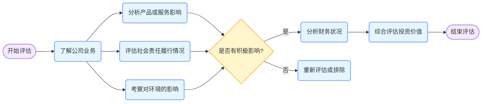

# 彼得林奇如何评估公司的社会影响力

> 关键词：彼得林奇、公司评估、社会影响力、投资分析、财务指标、非财务因素

> 摘要：本文深入探讨了彼得林奇评估公司社会影响力的方法。彼得林奇作为投资界的传奇人物，其投资理念不仅关注公司的财务状况，还十分重视公司在社会层面的影响力。文章从背景介绍入手，阐述了相关核心概念及联系，剖析了评估公司社会影响力的核心算法原理和具体操作步骤，给出了相应的数学模型和公式，并通过项目实战案例进行详细说明。同时，介绍了该评估方法的实际应用场景，推荐了相关的工具和资源，最后总结了未来发展趋势与挑战，解答了常见问题并提供了扩展阅读和参考资料，旨在为投资者和研究者提供全面且深入的见解。

## 1. 背景介绍 
### 1.1 目的和范围
本部分旨在深入探究彼得林奇评估公司社会影响力的具体方法和思路。通过研究彼得林奇的投资理念和实践，我们可以了解到他如何在投资决策中考虑公司的社会影响力因素。范围涵盖了彼得林奇在评估过程中所涉及的各个方面，包括公司的产品或服务对社会的贡献、公司的社会责任履行情况、公司在行业中的地位以及对社会文化和环境的影响等。

### 1.2 预期读者
本文的预期读者包括投资者、金融分析师、企业管理者以及对投资和公司评估感兴趣的研究人员。对于投资者来说，了解彼得林奇评估公司社会影响力的方法有助于他们在投资决策中做出更明智的选择；金融分析师可以借鉴这些方法来完善自己的分析框架；企业管理者可以从中学习如何提升公司的社会影响力，以获得更好的市场表现；研究人员则可以将其作为研究投资理论和公司评估的重要参考。

### 1.3 文档结构概述
本文将按照以下结构进行阐述：首先介绍相关的核心概念和它们之间的联系，包括彼得林奇的投资理念以及公司社会影响力的具体含义；接着详细讲解评估公司社会影响力的核心算法原理和具体操作步骤，并通过Python代码进行示例；然后给出相应的数学模型和公式，并举例说明；之后通过一个项目实战案例，展示如何将这些方法应用到实际中；再介绍该评估方法的实际应用场景；推荐相关的工具和资源；最后总结未来发展趋势与挑战，解答常见问题并提供扩展阅读和参考资料。

### 1.4 术语表
#### 1.4.1 核心术语定义
- **彼得林奇投资理念**：彼得林奇是美国著名的投资家，他强调通过深入研究公司的基本面，包括公司的业务模式、财务状况、行业前景等，同时关注公司的社会影响力，来寻找具有投资价值的公司。
- **公司社会影响力**：指公司的产品或服务、经营活动以及决策对社会、环境和利益相关者所产生的影响。这种影响可以是积极的，如改善社会福利、保护环境等；也可以是消极的，如造成环境污染、侵犯员工权益等。
- **利益相关者**：包括股东、员工、客户、供应商、社区等与公司有利益关系的个人或群体。

#### 1.4.2 相关概念解释
- **社会责任投资**：是一种在投资决策过程中，不仅考虑财务回报，还考虑公司的社会和环境表现的投资策略。彼得林奇的投资理念在一定程度上与社会责任投资有相似之处，都关注公司的社会影响力。
- **社会绩效**：是衡量公司在社会和环境方面表现的指标，包括公司的社会责任履行情况、对社会公益事业的贡献、环境保护措施等。

#### 1.4.3 缩略词列表
- **ESG**：环境（Environmental）、社会（Social）和治理（Governance）的缩写，是衡量公司可持续发展和社会影响力的重要指标体系。

## 2. 核心概念与联系 

### 彼得林奇的投资理念
彼得林奇认为，成功的投资需要深入了解公司的业务和行业。他主张投资者要关注身边的事物，从日常生活中发现具有投资潜力的公司。例如，如果消费者发现某家公司的产品深受欢迎，那么这家公司可能具有良好的发展前景。同时，他也非常重视公司的财务状况，通过分析公司的盈利、资产负债等指标来评估公司的价值。

### 公司社会影响力的内涵
公司的社会影响力可以从多个维度来理解。从产品或服务的角度来看，公司的产品或服务是否满足社会的需求，是否具有创新性和实用性，对提高社会的生活质量和生产效率是否有积极贡献。例如，一家科技公司研发出了能够提高医疗诊断准确性的设备，这对医疗行业和患者来说都具有重要的意义，体现了公司积极的社会影响力。

从社会责任履行的角度来看，公司是否遵守法律法规，是否保障员工的权益，是否积极参与社会公益活动等。例如，一家企业为贫困地区的学校捐赠图书和教学设备，改善了当地的教育条件，这就是公司履行社会责任的体现。

从对环境的影响来看，公司的生产经营活动是否对环境造成污染，是否采取了有效的环保措施。例如，一家制造企业采用了清洁能源，减少了废气排放，对环境保护做出了贡献。

### 核心概念的联系
彼得林奇的投资理念与公司社会影响力密切相关。他认为，具有良好社会影响力的公司往往具有更稳定的经营环境和更广阔的发展前景。一家积极履行社会责任、对社会有积极贡献的公司，更容易获得消费者的认可和信任，从而提高市场份额和品牌价值。同时，关注公司的社会影响力也有助于投资者发现潜在的风险。例如，一家存在环境污染问题的公司，可能会面临政府的处罚和社会的谴责，从而影响其财务状况和股价表现。

以下是一个用Mermaid绘制的流程图，展示了彼得林奇评估公司社会影响力的主要步骤和各因素之间的关系：


## 3. 核心算法原理 & 具体操作步骤 

### 核心算法原理
彼得林奇评估公司社会影响力的核心算法原理可以概括为综合考虑多个因素，通过对这些因素进行量化和分析，来评估公司的社会影响力。具体来说，我们可以将公司的社会影响力分为几个维度，如产品或服务影响力、社会责任履行情况、环境影响等，为每个维度设定相应的权重，然后对每个维度进行评分，最后根据权重计算出公司的综合社会影响力得分。

### 具体操作步骤
1. **确定评估维度和权重**
    - 产品或服务影响力：权重设为0.4。这一维度主要考察公司的产品或服务对社会的贡献程度，包括创新性、实用性、市场需求满足程度等。
    - 社会责任履行情况：权重设为0.3。主要评估公司在员工权益保障、社会公益活动参与等方面的表现。
    - 环境影响：权重设为0.3。考察公司的生产经营活动对环境的影响，以及公司采取的环保措施。

2. **对每个维度进行评分**
    - **产品或服务影响力评分**
        - 创新性：如果公司的产品或服务具有独特的技术或商业模式，能够引领行业发展，可评为8 - 10分；如果具有一定的创新性，但不是行业领先水平，可评为5 - 7分；如果产品或服务较为普通，缺乏创新性，可评为1 - 4分。
        - 实用性：根据产品或服务对社会生产生活的实际帮助程度进行评分，帮助程度大的评为8 - 10分，有一定帮助的评为5 - 7分，帮助较小的评为1 - 4分。
        - 市场需求满足程度：如果产品或服务能够很好地满足市场需求，市场份额较高，可评为8 - 10分；如果能部分满足市场需求，市场份额一般，可评为5 - 7分；如果市场需求较小，市场份额低，可评为1 - 4分。
        - 综合以上三个方面的评分，取平均值作为产品或服务影响力的最终评分。

    - **社会责任履行情况评分**
        - 员工权益保障：考察公司的薪酬福利、工作环境、职业发展机会等方面。如果公司能够提供良好的员工待遇和发展空间，可评为8 - 10分；如果员工待遇一般，有一定的保障措施，可评为5 - 7分；如果存在员工权益受损的情况，可评为1 - 4分。
        - 社会公益活动参与：评估公司在慈善捐赠、社区服务等方面的投入和贡献。积极参与社会公益活动，有较大影响力的可评为8 - 10分；偶尔参与公益活动，有一定贡献的可评为5 - 7分；很少参与公益活动的可评为1 - 4分。
        - 综合以上两个方面的评分，取平均值作为社会责任履行情况的最终评分。

    - **环境影响评分**
        - 环境污染程度：如果公司的生产经营活动对环境造成的污染较小，甚至为零污染，可评为8 - 10分；如果有一定的污染，但采取了有效的治理措施，可评为5 - 7分；如果污染严重，且治理措施不力，可评为1 - 4分。
        - 环保措施：考察公司是否采用了清洁能源、节能减排技术等环保措施。环保措施完善的可评为8 - 10分；有一些环保措施，但不够完善的可评为5 - 7分；缺乏环保措施的可评为1 - 4分。
        - 综合以上两个方面的评分，取平均值作为环境影响的最终评分。

3. **计算综合社会影响力得分**
综合社会影响力得分 = 产品或服务影响力评分 × 0.4 + 社会责任履行情况评分 × 0.3 + 环境影响评分 × 0.3

### Python源代码实现
```python
# 定义评估函数
def evaluate_social_impact(product_score, social_responsibility_score, environmental_score):
    """
    计算公司的综合社会影响力得分
    :param product_score: 产品或服务影响力评分
    :param social_responsibility_score: 社会责任履行情况评分
    :param environmental_score: 环境影响评分
    :return: 综合社会影响力得分
    """
    # 根据权重计算综合得分
    total_score = product_score * 0.4 + social_responsibility_score * 0.3 + environmental_score * 0.3
    return total_score

# 示例评分
product_score = 7
social_responsibility_score = 6
environmental_score = 5

# 计算综合得分
result = evaluate_social_impact(product_score, social_responsibility_score, environmental_score)
print(f"公司的综合社会影响力得分: {result}")
```
在上述代码中，我们定义了一个`evaluate_social_impact`函数，该函数接受产品或服务影响力评分、社会责任履行情况评分和环境影响评分作为参数，根据设定的权重计算综合社会影响力得分。最后，我们给出了一个示例评分，并调用该函数计算综合得分并打印结果。

## 4. 数学模型和公式 & 详细讲解 & 举例说明 

### 数学模型和公式
设产品或服务影响力评分为 $P$，社会责任履行情况评分为 $S$，环境影响评分为 $E$，综合社会影响力得分为 $T$，则综合社会影响力得分的计算公式为：
$$T = 0.4P + 0.3S + 0.3E$$

### 详细讲解
这个公式体现了彼得林奇评估公司社会影响力时综合考虑多个维度的思想。每个维度的评分反映了公司在该方面的表现，权重则体现了该维度在整体评估中的重要性。通过加权求和的方式，我们可以得到一个综合的得分，用于衡量公司的社会影响力。

产品或服务影响力评分 $P$ 是通过对产品或服务的创新性、实用性和市场需求满足程度进行评分后取平均值得到的。这一维度反映了公司的核心业务对社会的贡献程度。

社会责任履行情况评分 $S$ 是对公司员工权益保障和社会公益活动参与情况进行评分后取平均值得到的。它体现了公司在社会责任方面的表现。

环境影响评分 $E$ 是对公司的环境污染程度和环保措施进行评分后取平均值得到的。这一维度反映了公司对环境的影响和应对措施。

### 举例说明
假设我们要评估一家科技公司的社会影响力。经过详细的调查和分析，我们得到以下评分：
- 产品或服务影响力评分 $P = 8$：该公司的产品具有很高的创新性，能够满足市场的高端需求，对提高生产效率有很大帮助。
- 社会责任履行情况评分 $S = 6$：公司为员工提供了较好的薪酬福利和职业发展机会，也偶尔参与一些社会公益活动。
- 环境影响评分 $E = 7$：公司的生产过程对环境的污染较小，并且采用了一些节能减排技术。

将这些评分代入公式 $T = 0.4P + 0.3S + 0.3E$ 中，可得：
$$T = 0.4\times8 + 0.3\times6 + 0.3\times7$$
$$T = 3.2 + 1.8 + 2.1$$
$$T = 7.1$$

这表明该科技公司的综合社会影响力得分为7.1分，处于较好的水平。投资者在评估该公司的投资价值时，可以将这一得分作为参考因素之一。

## 5. 项目实战：代码实际案例和详细解释说明 

### 5.1  开发环境搭建
为了实现上述评估公司社会影响力的代码，我们需要搭建一个Python开发环境。以下是具体的步骤：

1. **安装Python**：访问Python官方网站（https://www.python.org/downloads/），根据自己的操作系统选择合适的Python版本进行下载和安装。建议安装Python 3.x版本。

2. **安装开发工具**：可以选择使用Visual Studio Code、PyCharm等集成开发环境（IDE）。这里以Visual Studio Code为例，访问Visual Studio Code官方网站（https://code.visualstudio.com/）下载并安装。

3. **安装Python扩展**：打开Visual Studio Code，在扩展市场中搜索“Python”，安装Microsoft提供的Python扩展。

### 5.2  源代码详细实现和代码解读
以下是完整的源代码，包括对公司各项评分的输入和综合得分的计算：
```python
# 定义评估函数
def evaluate_social_impact(product_score, social_responsibility_score, environmental_score):
    """
    计算公司的综合社会影响力得分
    :param product_score: 产品或服务影响力评分
    :param social_responsibility_score: 社会责任履行情况评分
    :param environmental_score: 环境影响评分
    :return: 综合社会影响力得分
    """
    # 根据权重计算综合得分
    total_score = product_score * 0.4 + social_responsibility_score * 0.3 + environmental_score * 0.3
    return total_score

# 获取用户输入的各项评分
product_score = float(input("请输入产品或服务影响力评分（0 - 10分）: "))
social_responsibility_score = float(input("请输入社会责任履行情况评分（0 - 10分）: "))
environmental_score = float(input("请输入环境影响评分（0 - 10分）: "))

# 检查输入的评分是否在合理范围内
if 0 <= product_score <= 10 and 0 <= social_responsibility_score <= 10 and 0 <= environmental_score <= 10:
    # 计算综合得分
    result = evaluate_social_impact(product_score, social_responsibility_score, environmental_score)
    print(f"公司的综合社会影响力得分: {result}")
else:
    print("输入的评分不在合理范围内，请输入0 - 10之间的数字。")
```
### 代码解读与分析
1. **评估函数定义**：`evaluate_social_impact`函数接受三个参数：产品或服务影响力评分、社会责任履行情况评分和环境影响评分。函数内部根据设定的权重计算综合社会影响力得分，并返回该得分。
2. **用户输入获取**：使用`input`函数获取用户输入的各项评分，并将其转换为浮点数类型。
3. **输入验证**：检查用户输入的评分是否在0 - 10的合理范围内。如果是，则调用`evaluate_social_impact`函数计算综合得分并打印结果；否则，提示用户输入的评分不在合理范围内。

通过这个代码案例，我们可以方便地对不同公司的社会影响力进行评估。用户只需要输入各项评分，就可以得到公司的综合社会影响力得分，为投资决策提供参考。

## 6. 实际应用场景 
### 投资决策
在投资领域，投资者可以使用彼得林奇评估公司社会影响力的方法来筛选具有投资价值的公司。具有良好社会影响力的公司往往具有更稳定的经营环境和更广阔的发展前景，能够为投资者带来长期的回报。例如，一家积极履行社会责任、注重环境保护的企业，更容易获得消费者的认可和政府的支持，从而提高市场竞争力和盈利能力。

### 企业战略规划
企业管理者可以借鉴这种评估方法来制定公司的战略规划。通过了解公司在社会影响力方面的优势和不足，企业可以有针对性地采取措施，提升自身的社会形象和竞争力。例如，如果公司在社会责任履行方面得分较低，企业可以加强员工权益保障、增加社会公益活动的投入，以改善公司的社会形象。

### 社会监督和评价
政府、社会组织和媒体可以使用这种方法对企业进行社会监督和评价。通过公布企业的社会影响力得分，促使企业更加重视自身的社会责任和环境影响，推动企业实现可持续发展。例如，一些环保组织可以对污染企业进行评估和曝光，促使企业采取措施减少污染排放。

### 行业研究和比较
研究机构和学者可以使用这种方法对不同行业的企业进行研究和比较。通过分析不同行业企业的社会影响力得分，了解各行业在社会责任和环境影响方面的表现，为行业发展提供参考和建议。例如，通过比较制造业和服务业企业的社会影响力得分，可以发现两个行业在环境保护和社会责任履行方面的差异，为行业政策的制定提供依据。

## 7. 工具和资源推荐
### 7.1 学习资源推荐
#### 7.1.1 书籍推荐
- 《彼得·林奇的成功投资》：彼得·林奇本人撰写的经典投资著作，详细介绍了他的投资理念和方法，包括如何评估公司的基本面和社会影响力。
- 《聪明的投资者》：本杰明·格雷厄姆的著作，被誉为投资界的圣经，对价值投资理念进行了深入阐述，对理解彼得林奇的投资思想有很大帮助。
- 《社会责任投资：理念与实践》：介绍了社会责任投资的相关理论和实践案例，有助于读者了解如何在投资中考虑公司的社会影响力。

#### 7.1.2 在线课程
- Coursera上的“投资学原理”课程：由知名高校教授授课，涵盖了投资分析的基本原理和方法，包括公司评估和社会影响力投资等内容。
- edX上的“可持续金融与投资”课程：聚焦于可持续金融和社会责任投资领域，介绍了相关的理论和实践，对学习彼得林奇评估公司社会影响力的方法有很大的参考价值。

#### 7.1.3 技术博客和网站
- Seeking Alpha：一个知名的投资研究网站，提供了大量的公司分析报告和投资观点，包括对公司社会影响力的分析。
- Corporate Knights：专注于企业可持续发展和社会责任领域的网站，发布了许多关于企业社会影响力评估和排名的文章和报告。

### 7.2 开发工具框架推荐
#### 7.2.1 IDE和编辑器
- Visual Studio Code：一款轻量级的开源代码编辑器，支持Python开发，具有丰富的扩展插件，可以提高开发效率。
- PyCharm：专业的Python集成开发环境，提供了代码调试、代码分析、自动完成等功能，适合大型Python项目的开发。

#### 7.2.2 调试和性能分析工具
- pdb：Python自带的调试工具，可以帮助开发者定位代码中的错误和问题。
- cProfile：Python的性能分析工具，可以分析代码的运行时间和函数调用情况，帮助开发者优化代码性能。

#### 7.2.3 相关框架和库
- Pandas：一个强大的数据处理和分析库，可以用于处理和分析公司的财务数据和社会影响力相关数据。
- NumPy：用于科学计算的Python库，提供了高效的数组操作和数学函数，可用于实现评估算法中的数学计算。

### 7.3 相关论文著作推荐
#### 7.3.1 经典论文
- “The Social Responsibility of Business Is to Increase Its Profits” by Milton Friedman：这篇经典论文探讨了企业的社会责任问题，引发了关于企业是否应该承担社会责任的广泛讨论。
- “Does the Stock Market Fully Value Intangibles? Employee Satisfaction and Equity Prices” by Alex Edmans：研究了员工满意度与股票价格之间的关系，表明关注员工权益和社会责任的企业可能具有更高的市场价值。

#### 7.3.2 最新研究成果
- 近年来，关于企业社会影响力评估和社会责任投资的研究不断涌现。可以通过学术数据库如IEEE Xplore、ACM Digital Library等搜索相关的最新研究论文，了解该领域的前沿动态。

#### 7.3.3 应用案例分析
- 一些知名的咨询公司和研究机构会发布企业社会影响力评估的应用案例分析报告，如麦肯锡、波士顿咨询集团等。这些报告可以帮助读者了解如何将评估方法应用到实际案例中，以及评估结果对企业决策和投资决策的影响。

## 8. 总结：未来发展趋势与挑战
### 未来发展趋势
- **社会影响力评估的标准化**：随着社会责任投资的发展，对公司社会影响力评估的需求越来越大。未来，可能会出现更加标准化的评估方法和指标体系，以便投资者和企业能够更准确地评估和比较不同公司的社会影响力。
- **技术的应用**：人工智能、大数据等技术将在公司社会影响力评估中发挥越来越重要的作用。通过分析大量的企业数据和社会数据，可以更全面、客观地评估公司的社会影响力。
- **跨行业合作**：企业、投资者、政府和社会组织之间的跨行业合作将加强。各方将共同推动企业社会责任的履行和社会影响力的提升，实现可持续发展的目标。

### 挑战
- **数据获取和质量问题**：评估公司的社会影响力需要大量的数据支持，但目前相关数据的获取存在一定的困难，而且数据的质量也参差不齐。如何获取准确、全面的数据是一个亟待解决的问题。
- **评估指标的主观性**：在评估公司社会影响力的过程中，一些指标的评分具有一定的主观性，不同的评估者可能会给出不同的评分结果。如何减少评估指标的主观性，提高评估结果的准确性和可比性是一个挑战。
- **企业的短期利益与长期社会影响的平衡**：一些企业可能更关注短期的财务利益，而忽视了长期的社会影响。如何引导企业在追求经济利益的同时，也注重社会责任的履行，实现短期利益与长期社会影响的平衡是一个重要的挑战。

## 9. 附录：常见问题与解答
### 问题1：如何确定评估维度的权重？
答：评估维度的权重可以根据不同的行业特点、投资目标和社会关注重点来确定。一般来说，可以通过专家咨询、历史数据分析和市场调研等方法来确定合理的权重。例如，对于环保行业，环境影响维度的权重可以适当提高；对于劳动密集型行业，社会责任履行情况维度中员工权益保障的权重可以适当增加。

### 问题2：评分的主观性如何解决？
答：为了减少评分的主观性，可以制定详细的评分标准和指南，明确每个评分等级的具体定义和判断依据。同时，可以邀请多个评估者进行独立评分，然后取平均值或中位数作为最终评分。此外，还可以通过与同行业其他公司的比较来验证评分的合理性。

### 问题3：该评估方法是否适用于所有行业的公司？
答：该评估方法的基本原理适用于大多数行业的公司，但在具体应用时需要根据不同行业的特点进行调整。例如，对于金融行业，产品或服务影响力维度可能更侧重于风险管理和金融创新；对于制造业，环境影响维度可能更关注生产过程中的节能减排和废弃物处理。

### 问题4：评估公司社会影响力的结果对投资决策有多大的影响？
答：评估公司社会影响力的结果可以作为投资决策的参考因素之一，但不能作为唯一的决策依据。投资者还需要综合考虑公司的财务状况、行业前景、市场竞争等因素。具有良好社会影响力的公司可能具有更稳定的经营环境和更广阔的发展前景，但并不一定能保证获得高额的投资回报。

## 10. 扩展阅读 & 参考资料
### 扩展阅读
- 《从绿到金：聪明企业如何利用环保战略构建竞争优势》：介绍了企业如何通过环保战略提升自身的竞争力和社会影响力。
- 《影响力投资：变革世界的投资之道》：探讨了影响力投资的理念和实践，为投资者提供了一种将财务回报与社会影响相结合的投资方式。

### 参考资料
- Lynch, Peter. *One Up on Wall Street: How to Use What You Already Know to Make Money in the Market*. Simon & Schuster, 1989.
- Friedman, Milton. “The Social Responsibility of Business Is to Increase Its Profits.” *The New York Times Magazine*, September 13, 1970.
- Edmans, Alex. “Does the Stock Market Fully Value Intangibles? Employee Satisfaction and Equity Prices.” *Journal of Financial Economics*, Vol. 101, No. 3, 2011, pp. 621 - 640.

作者：AI天才研究院/AI Genius Institute & 禅与计算机程序设计艺术 /Zen And The Art of Computer Programming