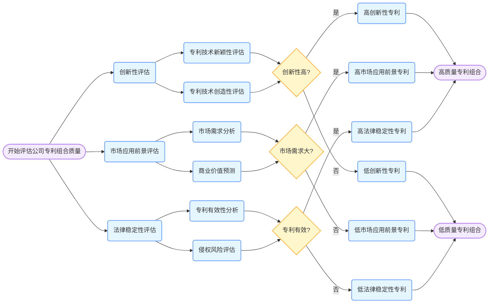

# 彼得林奇对公司专利组合质量的评估

> 关键词：彼得林奇、公司专利组合、质量评估、投资分析、专利价值

> 摘要：本文围绕彼得林奇对公司专利组合质量的评估展开。彼得林奇作为投资界的传奇人物，其投资理念和方法对投资者影响深远。公司的专利组合质量在一定程度上反映了公司的创新能力和市场竞争力，对于投资决策具有重要意义。文章将详细阐述彼得林奇评估公司专利组合质量的相关背景，剖析核心概念与联系，介绍核心算法原理及操作步骤，给出数学模型和公式并举例说明，通过项目实战案例进行代码实现和解读，探讨实际应用场景，推荐相关工具和资源，最后总结未来发展趋势与挑战，解答常见问题并提供扩展阅读与参考资料。

## 1. 背景介绍 
### 1.1 目的和范围
彼得林奇以其卓越的投资业绩而闻名于世，他的投资方法注重对公司基本面的深入研究。评估公司专利组合质量是他分析公司价值的一个重要方面。本文章的目的在于深入探讨彼得林奇评估公司专利组合质量的方法和理念，帮助投资者更好地理解如何通过专利组合来评估公司的投资价值。文章的范围涵盖了彼得林奇评估专利组合质量的各个环节，包括核心概念、评估算法、数学模型、实际案例等。

### 1.2 预期读者
本文预期读者主要包括对投资领域感兴趣的个人投资者、专业投资机构的分析师、金融行业的从业者以及研究企业创新和知识产权的学者。这些读者希望通过了解彼得林奇的评估方法，提升自己在投资决策和企业分析方面的能力。

### 1.3 文档结构概述
本文将按照以下结构进行阐述：首先介绍相关背景信息，包括目的、预期读者和文档结构；接着阐述核心概念与联系，通过文本示意图和 Mermaid 流程图进行说明；然后讲解核心算法原理和具体操作步骤，并给出 Python 源代码；之后介绍数学模型和公式，并举例说明；再通过项目实战案例展示代码实现和详细解读；探讨实际应用场景；推荐相关工具和资源；总结未来发展趋势与挑战；解答常见问题；最后提供扩展阅读与参考资料。

### 1.4 术语表
#### 1.4.1 核心术语定义
- **彼得林奇**：美国著名的投资家，曾任富达公司麦哲伦基金的基金经理，创造了辉煌的投资业绩，其投资理念和方法具有广泛的影响力。
- **公司专利组合**：指公司拥有的一系列专利的集合，包括不同类型、不同技术领域的专利。
- **专利组合质量**：反映了公司专利的整体价值和竞争力，包括专利的创新性、市场应用前景、法律稳定性等方面。

#### 1.4.2 相关概念解释
- **专利创新性**：指专利技术相对于现有技术的新颖性和创造性，创新性越高的专利越有可能为公司带来竞争优势。
- **市场应用前景**：指专利技术在市场上的潜在应用范围和商业价值，具有良好市场应用前景的专利能够为公司带来实际的经济效益。
- **法律稳定性**：指专利在法律上的有效性和稳定性，包括是否存在侵权纠纷、专利权利要求是否合理等方面。

#### 1.4.3 缩略词列表
- **USPTO**：美国专利商标局（United States Patent and Trademark Office）
- **EPO**：欧洲专利局（European Patent Office）

## 2. 核心概念与联系 

### 核心概念原理
彼得林奇认为，公司的专利组合质量是评估公司创新能力和市场竞争力的重要指标。一个高质量的专利组合应该具备以下特点：
1. **创新性**：包含具有较高创新性的专利，这些专利能够为公司带来独特的技术优势，使其在市场竞争中脱颖而出。
2. **市场应用前景**：专利技术能够在市场上得到广泛应用，具有良好的商业价值，能够为公司带来实际的收益。
3. **法律稳定性**：专利在法律上具有较高的稳定性，能够有效保护公司的技术成果，避免侵权纠纷。

### 架构的文本示意图
```plaintext
公司专利组合质量评估
|-- 创新性评估
|   |-- 专利技术新颖性
|   |-- 专利技术创造性
|-- 市场应用前景评估
|   |-- 市场需求分析
|   |-- 商业价值预测
|-- 法律稳定性评估
|   |-- 专利有效性分析
|   |-- 侵权风险评估
```

### Mermaid 流程图


## 3. 核心算法原理 & 具体操作步骤 

### 核心算法原理
彼得林奇评估公司专利组合质量的核心算法是综合考虑专利的创新性、市场应用前景和法律稳定性三个方面的因素。可以通过以下公式来计算专利组合的质量得分：

$$
Q = w_1 \times I + w_2 \times M + w_3 \times L
$$

其中，$Q$ 表示专利组合的质量得分，$I$ 表示创新性得分，$M$ 表示市场应用前景得分，$L$ 表示法律稳定性得分，$w_1$、$w_2$、$w_3$ 分别表示创新性、市场应用前景和法律稳定性的权重，且 $w_1 + w_2 + w_3 = 1$。

### 具体操作步骤
1. **数据收集**：收集公司的专利信息，包括专利号、专利类型、专利申请日期、专利技术领域等。可以从专利数据库（如 USPTO、EPO 等）中获取相关信息。
2. **创新性评估**：对每一项专利的创新性进行评估，根据专利技术的新颖性和创造性给出创新性得分。可以通过与现有技术进行对比、分析专利的权利要求等方法来评估创新性。
3. **市场应用前景评估**：分析每一项专利的市场应用前景，根据市场需求、商业价值等因素给出市场应用前景得分。可以通过市场调研、行业分析等方法来评估市场应用前景。
4. **法律稳定性评估**：评估每一项专利的法律稳定性，根据专利的有效性、侵权风险等因素给出法律稳定性得分。可以通过查询专利的法律状态、分析专利的权利要求等方法来评估法律稳定性。
5. **计算专利组合质量得分**：根据上述公式，计算公司专利组合的质量得分。

### Python 源代码实现
```python
# 定义权重
w1 = 0.3  # 创新性权重
w2 = 0.4  # 市场应用前景权重
w3 = 0.3  # 法律稳定性权重

# 定义专利信息类
class Patent:
    def __init__(self, patent_id, innovation_score, market_score, legal_score):
        self.patent_id = patent_id
        self.innovation_score = innovation_score
        self.market_score = market_score
        self.legal_score = legal_score

    def calculate_patent_quality(self):
        return w1 * self.innovation_score + w2 * self.market_score + w3 * self.legal_score

# 定义公司专利组合类
class PatentPortfolio:
    def __init__(self, patents):
        self.patents = patents

    def calculate_portfolio_quality(self):
        total_quality = 0
        for patent in self.patents:
            total_quality += patent.calculate_patent_quality()
        return total_quality / len(self.patents)

# 示例数据
patent1 = Patent(1, 8, 7, 9)
patent2 = Patent(2, 6, 8, 7)
patent3 = Patent(3, 7, 6, 8)

# 创建专利组合
portfolio = PatentPortfolio([patent1, patent2, patent3])

# 计算专利组合质量得分
portfolio_quality = portfolio.calculate_portfolio_quality()
print(f"公司专利组合质量得分: {portfolio_quality}")
```

## 4. 数学模型和公式 & 详细讲解 & 举例说明 

### 数学模型和公式
如前文所述，彼得林奇评估公司专利组合质量的数学模型为：

$$
Q = w_1 \times I + w_2 \times M + w_3 \times L
$$

其中，$Q$ 表示专利组合的质量得分，取值范围为 $[0, 10]$，得分越高表示专利组合质量越好；$I$ 表示创新性得分，取值范围为 $[0, 10]$，得分越高表示专利的创新性越强；$M$ 表示市场应用前景得分，取值范围为 $[0, 10]$，得分越高表示专利的市场应用前景越好；$L$ 表示法律稳定性得分，取值范围为 $[0, 10]$，得分越高表示专利的法律稳定性越强；$w_1$、$w_2$、$w_3$ 分别表示创新性、市场应用前景和法律稳定性的权重，且 $w_1 + w_2 + w_3 = 1$。

### 详细讲解
- **创新性得分 $I$**：创新性得分主要考虑专利技术的新颖性和创造性。新颖性是指专利技术在现有技术的基础上具有新的特征或改进；创造性是指专利技术的创造难度较大，不是本领域技术人员容易想到的。可以通过与现有技术进行对比、分析专利的权利要求等方法来评估创新性。例如，一项专利技术在某一领域具有突破性的创新，能够解决现有技术无法解决的问题，则可以给予较高的创新性得分。
- **市场应用前景得分 $M$**：市场应用前景得分主要考虑专利技术在市场上的潜在应用范围和商业价值。可以通过市场调研、行业分析等方法来评估市场应用前景。例如，一项专利技术能够满足市场上的迫切需求，具有广阔的市场前景，能够为公司带来丰厚的利润，则可以给予较高的市场应用前景得分。
- **法律稳定性得分 $L$**：法律稳定性得分主要考虑专利在法律上的有效性和稳定性。可以通过查询专利的法律状态、分析专利的权利要求等方法来评估法律稳定性。例如，一项专利没有侵权纠纷，权利要求合理，能够有效保护公司的技术成果，则可以给予较高的法律稳定性得分。
- **权重 $w_1$、$w_2$、$w_3$**：权重的设置根据不同的行业和公司特点进行调整。一般来说，对于技术创新型公司，创新性的权重可以设置得较高；对于市场导向型公司，市场应用前景的权重可以设置得较高；对于注重知识产权保护的公司，法律稳定性的权重可以设置得较高。

### 举例说明
假设一家科技公司的专利组合中有三项专利，各项专利的创新性得分、市场应用前景得分和法律稳定性得分如下表所示：

| 专利编号 | 创新性得分 $I$ | 市场应用前景得分 $M$ | 法律稳定性得分 $L$ |
| ---- | ---- | ---- | ---- |
| 1 | 8 | 7 | 9 |
| 2 | 6 | 8 | 7 |
| 3 | 7 | 6 | 8 |

假设创新性、市场应用前景和法律稳定性的权重分别为 $w_1 = 0.3$、$w_2 = 0.4$、$w_3 = 0.3$。

首先，计算每一项专利的质量得分：
- 专利 1 的质量得分：
$$
Q_1 = 0.3 \times 8 + 0.4 \times 7 + 0.3 \times 9 = 2.4 + 2.8 + 2.7 = 7.9
$$
- 专利 2 的质量得分：
$$
Q_2 = 0.3 \times 6 + 0.4 \times 8 + 0.3 \times 7 = 1.8 + 3.2 + 2.1 = 7.1
$$
- 专利 3 的质量得分：
$$
Q_3 = 0.3 \times 7 + 0.4 \times 6 + 0.3 \times 8 = 2.1 + 2.4 + 2.4 = 6.9
$$

然后，计算公司专利组合的质量得分：
$$
Q = \frac{Q_1 + Q_2 + Q_3}{3} = \frac{7.9 + 7.1 + 6.9}{3} = \frac{21.9}{3} = 7.3
$$

因此，该公司专利组合的质量得分为 7.3，说明该公司的专利组合质量较好。

## 5. 项目实战：代码实际案例和详细解释说明 

### 5.1  开发环境搭建
- **Python 环境**：建议使用 Python 3.7 及以上版本。可以从 Python 官方网站（https://www.python.org/downloads/）下载并安装。
- **开发工具**：可以使用 PyCharm、VS Code 等集成开发环境（IDE），也可以使用 Jupyter Notebook 进行代码的编写和调试。

### 5.2  源代码详细实现和代码解读
以下是一个完整的 Python 代码示例，用于评估公司专利组合的质量：

```python
# 定义权重
w1 = 0.3  # 创新性权重
w2 = 0.4  # 市场应用前景权重
w3 = 0.3  # 法律稳定性权重

# 定义专利信息类
class Patent:
    def __init__(self, patent_id, innovation_score, market_score, legal_score):
        """
        初始化专利信息
        :param patent_id: 专利编号
        :param innovation_score: 创新性得分
        :param market_score: 市场应用前景得分
        :param legal_score: 法律稳定性得分
        """
        self.patent_id = patent_id
        self.innovation_score = innovation_score
        self.market_score = market_score
        self.legal_score = legal_score

    def calculate_patent_quality(self):
        """
        计算专利的质量得分
        :return: 专利的质量得分
        """
        return w1 * self.innovation_score + w2 * self.market_score + w3 * self.legal_score

# 定义公司专利组合类
class PatentPortfolio:
    def __init__(self, patents):
        """
        初始化公司专利组合
        :param patents: 专利列表
        """
        self.patents = patents

    def calculate_portfolio_quality(self):
        """
        计算公司专利组合的质量得分
        :return: 公司专利组合的质量得分
        """
        total_quality = 0
        for patent in self.patents:
            total_quality += patent.calculate_patent_quality()
        return total_quality / len(self.patents)

# 示例数据
patent1 = Patent(1, 8, 7, 9)
patent2 = Patent(2, 6, 8, 7)
patent3 = Patent(3, 7, 6, 8)

# 创建专利组合
portfolio = PatentPortfolio([patent1, patent2, patent3])

# 计算专利组合质量得分
portfolio_quality = portfolio.calculate_portfolio_quality()
print(f"公司专利组合质量得分: {portfolio_quality}")
```

### 代码解读与分析
1. **权重定义**：定义了创新性、市场应用前景和法律稳定性的权重 $w_1$、$w_2$、$w_3$，分别为 0.3、0.4、0.3。
2. **专利信息类 `Patent`**：
    - `__init__` 方法：初始化专利的编号、创新性得分、市场应用前景得分和法律稳定性得分。
    - `calculate_patent_quality` 方法：根据上述数学模型计算专利的质量得分。
3. **公司专利组合类 `PatentPortfolio`**：
    - `__init__` 方法：初始化公司的专利组合，接受一个专利列表作为参数。
    - `calculate_portfolio_quality` 方法：遍历专利列表，计算每一项专利的质量得分，并求平均值得到公司专利组合的质量得分。
4. **示例数据**：创建了三项专利的示例数据，并将它们添加到专利组合中。
5. **计算专利组合质量得分**：调用 `PatentPortfolio` 类的 `calculate_portfolio_quality` 方法，计算公司专利组合的质量得分，并打印输出。

## 6. 实际应用场景 
### 投资决策
投资者在进行投资决策时，可以通过评估公司的专利组合质量来判断公司的创新能力和市场竞争力。具有高质量专利组合的公司往往具有更大的发展潜力和投资价值。例如，在科技行业，一家拥有多项高创新性、高市场应用前景和高法律稳定性专利的公司，可能会在未来的市场竞争中占据优势，其股票价格也可能会有更好的表现。

### 企业战略规划
企业在制定战略规划时，可以根据自身的专利组合质量来调整研发方向和市场策略。如果公司的专利组合质量较高，可以加大在相关领域的研发投入，进一步巩固市场地位；如果专利组合质量较低，可以考虑加强技术创新或通过并购等方式获取优质专利。

### 知识产权评估
在企业并购、技术转让等知识产权交易中，评估公司的专利组合质量可以为交易价格的确定提供参考依据。高质量的专利组合具有更高的价值，可以为企业带来更多的经济利益。

### 行业竞争分析
通过比较不同公司的专利组合质量，可以分析行业内的竞争态势。了解竞争对手的专利优势和劣势，有助于企业制定针对性的竞争策略，提高自身的市场竞争力。

## 7. 工具和资源推荐
### 7.1 学习资源推荐
#### 7.1.1 书籍推荐
- 《彼得林奇的成功投资》：彼得林奇的经典著作，详细介绍了他的投资理念和方法，对于理解如何评估公司价值具有重要的参考价值。
- 《专利信息分析实务》：系统介绍了专利信息分析的方法和技巧，有助于读者深入了解如何进行专利评估。
- 《知识产权战略管理》：探讨了企业知识产权战略的制定和实施，对于理解专利组合在企业战略中的作用具有重要意义。

#### 7.1.2 在线课程
- Coursera 上的“专利与创新管理”课程：由知名高校的教授授课，涵盖了专利的申请、评估、管理等方面的内容。
- edX 上的“知识产权法基础”课程：介绍了知识产权法的基本概念和原理，对于理解专利的法律保护具有重要的帮助。

#### 7.1.3 技术博客和网站
- 国家知识产权局官网（https://www.cnipa.gov.cn/）：提供了丰富的专利信息和政策法规，是了解国内专利情况的重要渠道。
- 智慧芽（https://www.zhihuiya.com/）：专注于专利信息服务，提供专利检索、分析等功能，有助于用户深入了解专利市场。
- IPWatchdog（https://www.ipwatchdog.com/）：是一个知名的知识产权博客，提供了最新的专利新闻、分析和评论。

### 7.2 开发工具框架推荐
#### 7.2.1 IDE和编辑器
- PyCharm：一款专业的 Python 集成开发环境，具有代码编辑、调试、版本控制等功能，适合用于开发 Python 程序。
- VS Code：一款轻量级的代码编辑器，支持多种编程语言，具有丰富的插件生态系统，可以根据需要进行扩展。
- Jupyter Notebook：一种交互式的编程环境，适合用于数据探索和分析，方便用户编写和调试代码。

#### 7.2.2 调试和性能分析工具
- PySnooper：一个简单易用的 Python 调试工具，可以自动记录函数的调用过程和变量的值，帮助用户快速定位问题。
- cProfile：Python 内置的性能分析工具，可以统计函数的调用次数、执行时间等信息，帮助用户优化代码性能。

#### 7.2.3 相关框架和库
- Pandas：一个强大的数据处理和分析库，提供了丰富的数据结构和函数，适合用于处理专利数据。
- Matplotlib：一个常用的绘图库，可以用于可视化专利数据，帮助用户更好地理解数据。

### 7.3 相关论文著作推荐
#### 7.3.1 经典论文
- Hall, B. H., Jaffe, A. B., & Trajtenberg, M. (2005). Market value and patent citations. *The RAND Journal of Economics*, 36(1), 16-38. 该论文探讨了专利引用与公司市场价值之间的关系，为评估专利价值提供了重要的理论依据。
- Griliches, Z. (1981). Market value, R&D, and patents. *The Economic Journal*, 91(364), 904-918. 这篇论文研究了研发投入、专利与公司市场价值之间的关系，对于理解专利在公司价值创造中的作用具有重要意义。

#### 7.3.2 最新研究成果
- 关注国际知名学术期刊，如 *Research Policy*、*Journal of Economic Perspectives* 等，这些期刊经常发表关于专利、创新和经济增长的最新研究成果。

#### 7.3.3 应用案例分析
- 可以参考一些知名企业的专利战略和应用案例，如苹果、华为等公司的专利布局和运营经验，从中学习如何评估和管理专利组合。

## 8. 总结：未来发展趋势与挑战
### 未来发展趋势
- **数据驱动的评估方法**：随着大数据和人工智能技术的发展，未来的专利组合质量评估将更加依赖于数据驱动的方法。通过收集和分析大量的专利数据，可以更准确地评估专利的创新性、市场应用前景和法律稳定性。
- **跨领域融合**：专利技术越来越呈现出跨领域融合的趋势，未来的评估方法需要考虑不同领域技术的融合和协同效应，以更全面地评估专利组合的质量。
- **国际化评估**：随着全球经济一体化的发展，企业的专利布局也越来越国际化。未来的评估方法需要考虑不同国家和地区的专利法律和市场环境，进行国际化的评估。

### 挑战
- **数据质量和获取难度**：专利数据的质量和获取难度是评估专利组合质量的一个重要挑战。专利数据往往存在不完整、不准确等问题，而且获取专利数据需要一定的成本和技术手段。
- **评估指标的主观性**：创新性、市场应用前景和法律稳定性等评估指标在一定程度上具有主观性，不同的评估人员可能会得出不同的评估结果。如何建立客观、科学的评估指标体系是一个亟待解决的问题。
- **技术更新换代快**：科技行业的技术更新换代速度非常快，专利的有效期相对较长。如何评估专利在快速变化的技术环境中的价值是一个挑战。

## 9. 附录：常见问题与解答
### 问题 1：如何确定创新性、市场应用前景和法律稳定性的权重？
答：权重的确定需要根据不同的行业和公司特点进行调整。一般来说，可以通过专家评估、历史数据分析等方法来确定权重。对于技术创新型公司，创新性的权重可以设置得较高；对于市场导向型公司，市场应用前景的权重可以设置得较高；对于注重知识产权保护的公司，法律稳定性的权重可以设置得较高。

### 问题 2：专利组合质量得分的高低有什么实际意义？
答：专利组合质量得分的高低反映了公司专利的整体价值和竞争力。得分较高的公司往往具有更强的创新能力和市场竞争力，在未来的发展中可能会有更好的表现。投资者可以根据专利组合质量得分来判断公司的投资价值，企业可以根据得分来调整研发方向和市场策略。

### 问题 3：如何获取公司的专利信息？
答：可以从专利数据库（如 USPTO、EPO、国家知识产权局官网等）中获取公司的专利信息。此外，一些专业的知识产权服务机构也提供专利信息查询和分析服务。

### 问题 4：专利组合质量评估是否可以完全替代对公司的其他评估方法？
答：不能。专利组合质量评估只是评估公司价值的一个方面，还需要结合公司的财务状况、市场份额、管理团队等其他因素进行综合评估。专利组合质量评估可以为投资决策和企业战略规划提供重要的参考依据，但不能作为唯一的决策依据。

## 10. 扩展阅读 & 参考资料
### 扩展阅读
- 《创新者的窘境》：探讨了企业在面对技术创新时的困境和应对策略，对于理解专利在企业创新中的作用具有重要的启示。
- 《从 0 到 1》：介绍了创业公司如何从无到有地创造价值，其中涉及到技术创新和知识产权保护等方面的内容。

### 参考资料
- 彼得林奇. 《彼得林奇的成功投资》. 机械工业出版社.
- 国家知识产权局. 《专利审查指南》.
- Hall, B. H., Jaffe, A. B., & Trajtenberg, M. (2005). Market value and patent citations. *The RAND Journal of Economics*, 36(1), 16-38.
- Griliches, Z. (1981). Market value, R&D, and patents. *The Economic Journal*, 91(364), 904-918.

作者：AI天才研究院/AI Genius Institute & 禅与计算机程序设计艺术 /Zen And The Art of Computer Programming