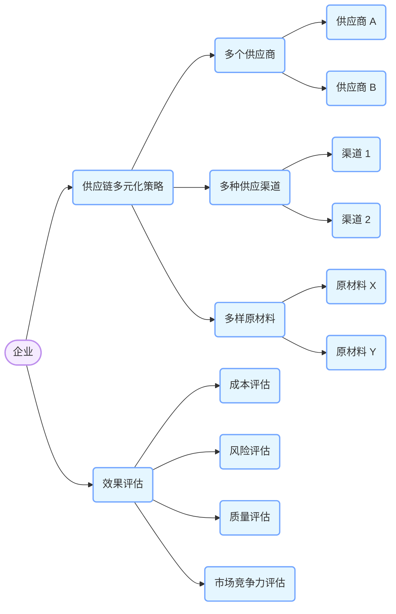

# 彼得林奇对公司供应链多元化策略的效果评估

> 关键词：彼得林奇、供应链多元化策略、效果评估、公司经营、投资分析

> 摘要：本文围绕彼得林奇对公司供应链多元化策略的效果评估展开。深入探讨了供应链多元化策略的核心概念、相关算法原理及数学模型。通过项目实战案例，详细分析了该策略在实际应用中的表现。阐述了其在不同场景下的应用，推荐了学习该领域的工具和资源。最后总结了未来发展趋势与挑战，为企业经营和投资分析提供了有价值的参考。

## 1. 背景介绍 
### 1.1 目的和范围
本部分旨在深入研究彼得林奇对公司供应链多元化策略的效果评估方法及意义。范围涵盖了供应链多元化策略的基本概念、评估所涉及的原理和方法，以及在实际公司经营和投资领域的应用。通过系统分析，为企业管理者优化供应链策略和投资者做出更明智的决策提供理论支持和实践指导。

### 1.2 预期读者
本文预期读者包括企业管理人员，他们可以从中获取关于供应链多元化策略效果评估的方法，以优化企业供应链管理；投资者，借助彼得林奇的评估视角，更好地分析投资对象的供应链状况；以及对供应链管理和投资分析感兴趣的学者和研究人员，为他们的研究提供参考和启示。

### 1.3 文档结构概述
本文首先介绍相关背景，包括目的、预期读者和文档结构。接着阐述核心概念与联系，展示其原理和架构的文本示意图及 Mermaid 流程图。然后详细讲解核心算法原理和具体操作步骤，配以 Python 源代码。随后介绍数学模型和公式，并举例说明。通过项目实战案例，呈现代码实现和解读。之后分析实际应用场景，推荐相关工具和资源。最后总结未来发展趋势与挑战，提供常见问题解答和扩展阅读参考资料。

### 1.4 术语表
#### 1.4.1 核心术语定义
- **供应链多元化策略**：指企业通过与多个供应商建立合作关系，或拓展供应渠道、原材料种类等方式，降低对单一供应商或供应源的依赖，以增强供应链的稳定性和灵活性的策略。
- **效果评估**：对供应链多元化策略实施后所产生的结果进行衡量和分析，包括对成本、风险、质量等方面的评估。
- **彼得林奇评估方法**：彼得林奇在投资分析中所采用的一套评估公司供应链多元化策略效果的方法，综合考虑公司的财务状况、市场竞争力等多方面因素。

#### 1.4.2 相关概念解释
- **供应链风险**：由于供应链中各种不确定因素导致的供应中断、成本上升、质量问题等风险。供应链多元化策略的一个重要目的就是降低这些风险。
- **供应弹性**：供应链能够快速响应市场需求变化的能力。多元化的供应链可以提高供应弹性，使企业更好地适应市场波动。

#### 1.4.3 缩略词列表
目前本文未涉及相关缩略词。

## 2. 核心概念与联系 

### 供应链多元化策略的原理
供应链多元化策略的核心原理在于分散风险和提高供应的灵活性。当企业依赖单一供应商时，如果该供应商出现问题，如生产故障、原材料短缺、政治风险等，企业的生产和运营将受到严重影响。通过与多个供应商合作，企业可以在某个供应商出现问题时，迅速转向其他供应商，确保生产的连续性。

此外，多元化的供应链还可以促进供应商之间的竞争，从而降低采购成本，提高产品质量。不同的供应商可能具有不同的技术优势和成本结构，企业可以根据自身需求选择最合适的供应商，实现资源的优化配置。

### 架构的文本示意图
```plaintext
企业
|-- 供应链多元化策略
|   |-- 多个供应商
|   |   |-- 供应商 A
|   |   |-- 供应商 B
|   |   |--...
|   |-- 多种供应渠道
|   |   |-- 渠道 1
|   |   |-- 渠道 2
|   |   |--...
|   |-- 多样原材料
|       |-- 原材料 X
|       |-- 原材料 Y
|       |--...
|-- 效果评估
|   |-- 成本评估
|   |-- 风险评估
|   |-- 质量评估
|   |-- 市场竞争力评估
```

### Mermaid 流程图


## 3. 核心算法原理 & 具体操作步骤 

### 成本评估算法原理
成本评估主要考虑采购成本、运输成本、库存成本等因素。可以通过计算总成本的变化来评估供应链多元化策略对成本的影响。假设企业在实施供应链多元化策略前后的总成本分别为 $TC_0$ 和 $TC_1$，成本变化率 $r$ 可以用以下公式计算：

$$r = \frac{TC_1 - TC_0}{TC_0} \times 100\%$$

如果 $r < 0$，说明成本降低；如果 $r > 0$，说明成本上升。

### Python 代码实现
```python
def cost_change_rate(TC0, TC1):
    """
    计算成本变化率
    :param TC0: 实施策略前的总成本
    :param TC1: 实施策略后的总成本
    :return: 成本变化率
    """
    return ((TC1 - TC0) / TC0) * 100

# 示例数据
TC0 = 100000  # 实施策略前的总成本
TC1 = 95000   # 实施策略后的总成本
rate = cost_change_rate(TC0, TC1)
print(f"成本变化率: {rate:.2f}%")
```

### 风险评估算法原理
风险评估可以采用风险评分的方法。对每个供应商的风险因素进行评估，如供应中断风险、质量风险、政治风险等，并赋予相应的权重。然后计算每个供应商的风险得分，最后汇总得到整个供应链的风险得分。假设共有 $n$ 个供应商，第 $i$ 个供应商的风险得分 $R_i$ 可以通过以下公式计算：

$$R_i = \sum_{j=1}^{m} w_j \times r_{ij}$$

其中，$w_j$ 是第 $j$ 个风险因素的权重，$r_{ij}$ 是第 $i$ 个供应商在第 $j$ 个风险因素上的得分。整个供应链的风险得分 $R$ 为：

$$R = \sum_{i=1}^{n} R_i$$

### Python 代码实现
```python
def supplier_risk_score(risk_factors, weights):
    """
    计算单个供应商的风险得分
    :param risk_factors: 风险因素得分列表
    :param weights: 风险因素权重列表
    :return: 供应商的风险得分
    """
    return sum([w * r for w, r in zip(weights, risk_factors)])

def supply_chain_risk_score(suppliers_risk_factors, weights):
    """
    计算整个供应链的风险得分
    :param suppliers_risk_factors: 所有供应商的风险因素得分列表
    :param weights: 风险因素权重列表
    :return: 供应链的风险得分
    """
    return sum([supplier_risk_score(factors, weights) for factors in suppliers_risk_factors])

# 示例数据
weights = [0.3, 0.3, 0.4]  # 风险因素权重
suppliers_risk_factors = [
    [2, 3, 1],  # 供应商 1 的风险因素得分
    [1, 2, 2]   # 供应商 2 的风险因素得分
]
risk_score = supply_chain_risk_score(suppliers_risk_factors, weights)
print(f"供应链风险得分: {risk_score}")
```

## 4. 数学模型和公式 & 详细讲解 & 举例说明 

### 成本评估数学模型
如前面所述，成本评估的数学模型为成本变化率公式：

$$r = \frac{TC_1 - TC_0}{TC_0} \times 100\%$$

详细讲解：该公式通过计算实施供应链多元化策略前后总成本的差值与实施前总成本的比值，并乘以 100%，得到成本变化的百分比。这个百分比可以直观地反映出成本是上升还是下降，以及变化的幅度。

举例说明：假设一家电子制造企业在实施供应链多元化策略前，每年的采购、运输和库存总成本为 $TC_0 = 500$ 万元。实施策略后，由于与更多供应商合作，获得了更优惠的采购价格，同时优化了运输路线，总成本降至 $TC_1 = 450$ 万元。则成本变化率为：

$$r = \frac{450 - 500}{500} \times 100\% = -10\%$$

这表明该企业通过供应链多元化策略，成本降低了 10%。

### 风险评估数学模型
风险评估的数学模型包括单个供应商的风险得分公式和整个供应链的风险得分公式：

单个供应商的风险得分公式：

$$R_i = \sum_{j=1}^{m} w_j \times r_{ij}$$

详细讲解：该公式通过将每个风险因素的权重 $w_j$ 与供应商在该风险因素上的得分 $r_{ij}$ 相乘，然后将所有风险因素的乘积相加，得到单个供应商的风险得分。权重 $w_j$ 反映了该风险因素的重要程度，得分 $r_{ij}$ 可以通过专家评估、历史数据等方式确定。

整个供应链的风险得分公式：

$$R = \sum_{i=1}^{n} R_i$$

详细讲解：该公式将所有供应商的风险得分相加，得到整个供应链的风险得分。这个得分可以综合反映供应链的整体风险水平。

举例说明：假设一家服装企业有两个供应商，评估的风险因素有供应中断风险、质量风险和政治风险，权重分别为 $w_1 = 0.3$，$w_2 = 0.3$，$w_3 = 0.4$。供应商 1 在这三个风险因素上的得分分别为 $r_{11} = 2$，$r_{12} = 3$，$r_{13} = 1$；供应商 2 的得分分别为 $r_{21} = 1$，$r_{22} = 2$，$r_{23} = 2$。

首先计算供应商 1 的风险得分：

$$R_1 = 0.3 \times 2 + 0.3 \times 3 + 0.4 \times 1 = 0.6 + 0.9 + 0.4 = 1.9$$

然后计算供应商 2 的风险得分：

$$R_2 = 0.3 \times 1 + 0.3 \times 2 + 0.4 \times 2 = 0.3 + 0.6 + 0.8 = 1.7$$

最后计算整个供应链的风险得分：

$$R = R_1 + R_2 = 1.9 + 1.7 = 3.6$$

## 5. 项目实战：代码实际案例和详细解释说明 

### 5.1  开发环境搭建
为了运行本项目的代码，需要搭建以下开发环境：
- **Python 环境**：建议使用 Python 3.7 及以上版本。可以从 Python 官方网站（https://www.python.org/downloads/）下载并安装。
- **开发工具**：可以使用 PyCharm、VS Code 等集成开发环境（IDE），也可以使用 Jupyter Notebook 进行交互式开发。

### 5.2  源代码详细实现和代码解读
以下是一个完整的 Python 代码示例，用于综合评估供应链多元化策略的效果：

```python
def cost_change_rate(TC0, TC1):
    """
    计算成本变化率
    :param TC0: 实施策略前的总成本
    :param TC1: 实施策略后的总成本
    :return: 成本变化率
    """
    return ((TC1 - TC0) / TC0) * 100

def supplier_risk_score(risk_factors, weights):
    """
    计算单个供应商的风险得分
    :param risk_factors: 风险因素得分列表
    :param weights: 风险因素权重列表
    :return: 供应商的风险得分
    """
    return sum([w * r for w, r in zip(weights, risk_factors)])

def supply_chain_risk_score(suppliers_risk_factors, weights):
    """
    计算整个供应链的风险得分
    :param suppliers_risk_factors: 所有供应商的风险因素得分列表
    :param weights: 风险因素权重列表
    :return: 供应链的风险得分
    """
    return sum([supplier_risk_score(factors, weights) for factors in suppliers_risk_factors])

def evaluate_supply_chain_diversification(TC0, TC1, suppliers_risk_factors, weights):
    """
    综合评估供应链多元化策略的效果
    :param TC0: 实施策略前的总成本
    :param TC1: 实施策略后的总成本
    :param suppliers_risk_factors: 所有供应商的风险因素得分列表
    :param weights: 风险因素权重列表
    :return: 成本变化率和供应链风险得分
    """
    cost_rate = cost_change_rate(TC0, TC1)
    risk_score = supply_chain_risk_score(suppliers_risk_factors, weights)
    return cost_rate, risk_score

# 示例数据
TC0 = 100000  # 实施策略前的总成本
TC1 = 95000   # 实施策略后的总成本
weights = [0.3, 0.3, 0.4]  # 风险因素权重
suppliers_risk_factors = [
    [2, 3, 1],  # 供应商 1 的风险因素得分
    [1, 2, 2]   # 供应商 2 的风险因素得分
]

# 进行评估
cost_rate, risk_score = evaluate_supply_chain_diversification(TC0, TC1, suppliers_risk_factors, weights)
print(f"成本变化率: {cost_rate:.2f}%")
print(f"供应链风险得分: {risk_score}")
```

### 代码解读与分析
- **`cost_change_rate` 函数**：该函数接受实施策略前的总成本 `TC0` 和实施策略后的总成本 `TC1` 作为参数，返回成本变化率。通过简单的数学计算，清晰地展示了成本的变化情况。
- **`supplier_risk_score` 函数**：该函数计算单个供应商的风险得分。它接受风险因素得分列表 `risk_factors` 和风险因素权重列表 `weights` 作为参数，使用列表推导式和 `sum` 函数计算加权得分。
- **`supply_chain_risk_score` 函数**：该函数计算整个供应链的风险得分。它接受所有供应商的风险因素得分列表 `suppliers_risk_factors` 和风险因素权重列表 `weights` 作为参数，通过调用 `supplier_risk_score` 函数计算每个供应商的风险得分，并将它们相加。
- **`evaluate_supply_chain_diversification` 函数**：该函数综合评估供应链多元化策略的效果。它调用 `cost_change_rate` 和 `supply_chain_risk_score` 函数，分别计算成本变化率和供应链风险得分，并返回这两个结果。
- **主程序**：定义了示例数据，包括实施策略前后的总成本、风险因素权重和供应商的风险因素得分。调用 `evaluate_supply_chain_diversification` 函数进行评估，并打印出成本变化率和供应链风险得分。

## 6. 实际应用场景 
### 制造业
在制造业中，供应链多元化策略具有重要意义。例如，汽车制造企业通常需要大量的零部件供应商。如果仅依赖单一供应商提供关键零部件，一旦该供应商出现问题，如罢工、自然灾害等，企业的生产将被迫中断。通过实施供应链多元化策略，企业可以与多个零部件供应商建立合作关系，降低供应中断的风险。同时，多元化的供应链还可以促使供应商之间竞争，降低采购成本，提高零部件质量。

### 零售业
零售业企业面临着不断变化的市场需求和消费者偏好。为了满足消费者的多样化需求，零售商需要确保商品的稳定供应。通过采用供应链多元化策略，零售商可以从多个供应商采购商品，避免因某个供应商的产品短缺而导致货架缺货。此外，多元化的供应链还可以让零售商引入更多种类的商品，丰富商品种类，提高市场竞争力。

### 电子行业
电子行业的技术更新换代迅速，对原材料和零部件的供应稳定性要求极高。例如，智能手机制造商需要大量的芯片、显示屏等关键零部件。如果芯片供应商出现供应问题，将直接影响手机的生产和销售。通过供应链多元化，企业可以降低对单一芯片供应商的依赖，确保在芯片供应紧张时仍能维持生产。同时，多元化的供应链还可以促使芯片供应商不断创新，提高产品性能和质量。

## 7. 工具和资源推荐
### 7.1 学习资源推荐
#### 7.1.1 书籍推荐
- 《供应链管理：战略、规划与运营》：这本书全面介绍了供应链管理的理论和实践，包括供应链战略、采购管理、物流管理等方面的内容。对于深入理解供应链多元化策略具有重要的参考价值。
- 《彼得林奇的成功投资》：彼得林奇是著名的投资大师，这本书详细阐述了他的投资理念和方法。其中包含了对公司基本面分析的内容，有助于理解如何从投资角度评估公司的供应链策略。

#### 7.1.2 在线课程
- Coursera 上的“供应链管理基础”课程：该课程由知名大学的教授授课，系统地介绍了供应链管理的基本概念、原理和方法。通过学习该课程，可以建立起供应链管理的知识体系。
- edX 上的“投资分析与组合管理”课程：虽然主要侧重于投资领域，但其中涉及到对公司财务和经营状况的分析方法，对于评估公司供应链多元化策略的效果有一定的帮助。

#### 7.1.3 技术博客和网站
- SupplyChainDive：这是一个专注于供应链领域的新闻和分析网站，提供了最新的供应链行业动态、趋势分析和案例研究。可以从中了解到供应链多元化策略在实际应用中的最新情况。
- Seeking Alpha：这是一个投资研究平台，有许多专业的投资者和分析师在上面分享对公司的分析和研究报告。可以关注其中关于公司供应链管理的分析文章，获取不同的观点和见解。

### 7.2 开发工具框架推荐
#### 7.2.1 IDE和编辑器
- PyCharm：一款专业的 Python 集成开发环境，具有代码自动补全、调试、版本控制等功能，非常适合开发 Python 代码。
- VS Code：一款轻量级的代码编辑器，支持多种编程语言，并且有丰富的插件扩展。可以通过安装 Python 相关插件，实现高效的 Python 开发。

#### 7.2.2 调试和性能分析工具
- PDB：Python 自带的调试器，可以在代码中设置断点，逐步执行代码，查看变量的值和程序的执行流程。
- cProfile：Python 的性能分析工具，可以统计代码中各个函数的执行时间和调用次数，帮助找出性能瓶颈。

#### 7.2.3 相关框架和库
- Pandas：一个强大的数据分析库，提供了数据结构和数据处理功能，可用于处理和分析供应链相关的数据。
- NumPy：用于科学计算的基础库，提供了高效的数组操作和数学函数，在处理大规模数据时非常有用。

### 7.3 相关论文著作推荐
#### 7.3.1 经典论文
- “Supply Chain Risk Management: A Review”：该论文对供应链风险管理的相关理论和方法进行了系统的回顾和总结，为研究供应链多元化策略的风险评估提供了重要的理论基础。
- “The Bullwhip Effect in Supply Chains”：探讨了供应链中牛鞭效应的产生原因和影响，对于理解供应链的不稳定性和多元化策略的必要性有重要的启示作用。

#### 7.3.2 最新研究成果
- 近年来，有许多关于供应链数字化转型和可持续供应链的研究成果。这些研究关注如何利用新技术（如人工智能、区块链等）优化供应链管理，以及如何实现供应链的可持续发展。可以通过学术数据库（如 IEEE Xplore、ACM Digital Library 等）查找相关的最新研究论文。

#### 7.3.3 应用案例分析
- 一些商业杂志和行业报告中会有关于企业供应链多元化策略的应用案例分析。例如，哈佛商业评论、麦肯锡季刊等，这些案例可以帮助我们了解不同企业在实际应用中遇到的问题和解决方案。

## 8. 总结：未来发展趋势与挑战
### 未来发展趋势
- **数字化转型加速**：随着人工智能、物联网、大数据等技术的不断发展，供应链管理将越来越数字化。企业可以利用这些技术实现供应链的实时监控、预测和优化，提高供应链的效率和灵活性。例如，通过物联网传感器可以实时监测货物的运输状态和库存水平，大数据分析可以帮助企业预测市场需求和供应风险。
- **可持续发展成为重点**：消费者对环保和社会责任的关注度不断提高，企业将更加注重供应链的可持续发展。这包括选择环保型的供应商、减少碳排放、推动供应链的绿色化等。未来，可持续供应链将成为企业竞争的重要优势。
- **全球供应链重构**：贸易保护主义、地缘政治等因素导致全球供应链格局发生变化。企业将更加注重供应链的本地化和区域化，减少对单一国家或地区的依赖。同时，供应链的合作伙伴关系也将更加多元化，企业将与更多的供应商、物流商等建立合作关系。

### 挑战
- **技术应用难度**：虽然数字化技术为供应链管理带来了很多机遇，但企业在应用这些技术时也面临着一些挑战。例如，数据安全和隐私问题、技术人才短缺、系统集成困难等。企业需要投入大量的资源来解决这些问题，才能充分发挥数字化技术的优势。
- **可持续发展实施成本**：实现供应链的可持续发展需要企业在采购、生产、物流等环节进行一系列的改进和调整，这将增加企业的成本。如何在保证可持续发展的前提下，控制成本，是企业面临的一个重要挑战。
- **供应链复杂性增加**：随着供应链的多元化和全球化，供应链的复杂性也在不断增加。企业需要管理更多的供应商、物流环节和合作伙伴，协调各方之间的利益和关系。这对企业的供应链管理能力提出了更高的要求。

## 9. 附录：常见问题与解答
### 问题 1：供应链多元化策略一定能降低成本吗？
解答：不一定。虽然供应链多元化策略可以通过促进供应商之间的竞争来降低采购成本，但在实施过程中也可能会增加一些其他成本，如管理成本、运输成本等。因此，需要综合评估实施策略前后的总成本变化，才能确定是否降低了成本。

### 问题 2：如何确定风险因素的权重？
解答：确定风险因素的权重可以采用多种方法。一种常见的方法是专家评估法，邀请供应链管理领域的专家根据经验和专业知识对各个风险因素的重要程度进行评估，确定权重。另一种方法是基于历史数据的统计分析，通过分析过去供应链中发生的风险事件，确定各个风险因素的影响程度，从而确定权重。

### 问题 3：供应链多元化策略会增加管理难度吗？
解答：会。与多个供应商建立合作关系需要企业投入更多的时间和精力来管理供应商关系、协调供应计划等。此外，不同供应商的管理方式和文化可能存在差异，也会增加管理的复杂性。因此，企业需要建立有效的供应商管理体系，提高管理能力，以应对这些挑战。

## 10. 扩展阅读 & 参考资料
- Chopra, S., & Meindl, P. (2016). Supply Chain Management: Strategy, Planning, and Operation. Pearson.
- Lynch, P. (1989). One Up on Wall Street: How to Use What You Already Know to Make Money in the Market. Simon & Schuster.
- “Supply Chain Risk Management: A Review” by Christopher, M., & Peck, H. (2004). International Journal of Physical Distribution & Logistics Management.
- “The Bullwhip Effect in Supply Chains” by Lee, H. L., Padmanabhan, V., & Whang, S. (1997). Management Science.

作者：AI天才研究院/AI Genius Institute & 禅与计算机程序设计艺术 /Zen And The Art of Computer Programming