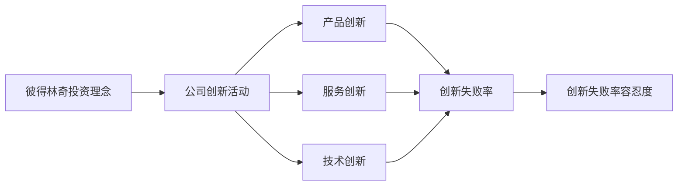

# 彼得林奇对公司创新失败率的容忍度分析

> 关键词：彼得林奇、公司创新、失败率容忍度、投资分析、创新管理

> 摘要：本文围绕彼得林奇对公司创新失败率的容忍度展开深入分析。首先介绍研究背景，明确目的和范围，界定相关术语。接着阐述核心概念，包括彼得林奇投资理念与公司创新的联系，并给出架构示意图和流程图。详细讲解核心算法原理及操作步骤，运用Python代码说明。通过数学模型和公式进一步剖析，结合实例加深理解。进行项目实战，搭建开发环境，实现并解读源代码。探讨实际应用场景，推荐学习资源、开发工具框架及相关论文著作。最后总结未来发展趋势与挑战，解答常见问题并提供扩展阅读和参考资料，旨在为投资者和企业管理者在创新与投资决策方面提供有价值的参考。

## 1. 背景介绍 
### 1.1 目的和范围
本研究的目的在于深入剖析彼得林奇对公司创新失败率的容忍度，揭示其背后的投资逻辑和决策依据。通过对这一主题的研究，帮助投资者更好地理解如何评估公司创新活动的风险与收益，为投资决策提供科学的参考。同时，也为企业管理者在制定创新战略时提供借鉴，明确在何种程度上可以接受创新失败，以实现企业的可持续发展。

研究范围涵盖彼得林奇的投资理念和实践，公司创新活动的特点和规律，以及创新失败率的度量和影响因素。具体涉及不同行业、不同规模公司的创新案例分析，以及彼得林奇在不同市场环境下对创新失败率的态度和决策变化。

### 1.2 预期读者
本文的预期读者主要包括以下几类人群：
1. **投资者**：希望通过了解彼得林奇的投资智慧，提高对公司创新价值的评估能力，优化投资组合，获取更高的投资回报。
2. **企业管理者**：借鉴彼得林奇对创新失败率的容忍度分析，制定合理的创新战略，平衡创新风险和收益，推动企业的创新发展。
3. **金融分析师**：丰富对公司基本面分析的视角和方法，更准确地评估公司的创新潜力和投资价值。
4. **学术研究人员**：为相关领域的学术研究提供新的思路和实证案例，促进投资理论和创新管理理论的发展。

### 1.3 文档结构概述
本文将按照以下结构进行阐述：
1. **背景介绍**：介绍研究的目的、范围、预期读者和文档结构，界定相关术语。
2. **核心概念与联系**：阐述彼得林奇投资理念、公司创新和创新失败率容忍度的核心概念，分析它们之间的联系，并给出架构示意图和流程图。
3. **核心算法原理 & 具体操作步骤**：讲解用于评估公司创新失败率容忍度的核心算法原理，通过Python代码详细说明具体操作步骤。
4. **数学模型和公式 & 详细讲解 & 举例说明**：建立数学模型和公式，对创新失败率容忍度进行量化分析，并结合实际案例进行详细讲解。
5. **项目实战：代码实际案例和详细解释说明**：搭建开发环境，实现具体的代码案例，对代码进行详细解读和分析。
6. **实际应用场景**：探讨彼得林奇对公司创新失败率容忍度分析在投资决策、企业创新管理等实际场景中的应用。
7. **工具和资源推荐**：推荐学习资源、开发工具框架和相关论文著作，帮助读者进一步深入学习和研究。
8. **总结：未来发展趋势与挑战**：总结研究成果，分析未来发展趋势和面临的挑战。
9. **附录：常见问题与解答**：解答读者在阅读过程中可能遇到的常见问题。
10. **扩展阅读 & 参考资料**：提供相关的扩展阅读材料和参考资料，方便读者进一步探索。

### 1.4 术语表
#### 1.4.1 核心术语定义
- **彼得林奇**：美国著名的投资家，曾任富达公司麦哲伦基金的基金经理，以其卓越的投资业绩和独特的投资理念闻名于世。
- **公司创新**：指公司为了提高竞争力和市场份额，通过引入新的产品、服务、技术、管理方法等，创造新的价值的过程。
- **创新失败率**：指公司在创新活动中未能达到预期目标的项目数量占总创新项目数量的比例。
- **创新失败率容忍度**：指投资者或企业管理者在进行投资或创新决策时，能够接受的公司创新失败率的最高水平。

#### 1.4.2 相关概念解释
- **投资理念**：投资者在进行投资决策时所遵循的基本原则和方法，包括对投资目标、风险偏好、投资策略等方面的认识和选择。
- **创新战略**：企业为了实现创新目标而制定的一系列行动计划和决策，包括创新的方向、重点、方式、资源配置等方面的内容。
- **风险收益权衡**：在投资或创新决策中，需要综合考虑风险和收益的关系，在追求高收益的同时，合理控制风险。

#### 1.4.3 缩略词列表
- **ROI**：Return on Investment，投资回报率
- **R&D**：Research and Development，研究与开发

## 2. 核心概念与联系 
### 核心概念原理
#### 彼得林奇的投资理念
彼得林奇强调通过深入研究公司的基本面，寻找具有成长潜力的公司进行投资。他注重公司的业务模式、竞争优势、管理团队等因素，认为只要公司具有良好的发展前景，即使短期内面临一些困难和挑战，也值得投资。在创新方面，彼得林奇认为创新是公司成长的重要动力，他愿意投资那些积极进行创新的公司，但同时也会关注创新的风险和失败率。

#### 公司创新
公司创新是一个复杂的过程，涉及到技术研发、市场推广、组织管理等多个方面。创新可以分为产品创新、服务创新、技术创新、管理创新等不同类型。公司通过创新可以提高产品或服务的质量和竞争力，开拓新的市场，从而实现企业的增长和发展。然而，创新也伴随着风险，创新项目可能会因为技术难题、市场需求变化、竞争压力等原因而失败。

#### 创新失败率容忍度
创新失败率容忍度是投资者或企业管理者在进行投资或创新决策时需要考虑的一个重要因素。不同的投资者和企业管理者对创新失败率的容忍度可能不同，这取决于他们的风险偏好、投资目标、创新战略等因素。一般来说，风险偏好较高、追求高回报的投资者或企业管理者可能对创新失败率的容忍度较高；而风险偏好较低、注重稳健投资的投资者或企业管理者可能对创新失败率的容忍度较低。

### 架构的文本示意图
```plaintext
              彼得林奇投资理念
                    |
                    | 关注创新对公司成长的影响
                    |
             公司创新活动
       /              |              \
产品创新        服务创新        技术创新
       \              |              /
                    创新失败率
                    |
                    | 决定
                    |
           创新失败率容忍度
```

### Mermaid 流程图


## 3. 核心算法原理 & 具体操作步骤 
### 核心算法原理
为了评估公司创新失败率的容忍度，我们可以采用以下算法原理：
1. **确定创新项目的预期收益和风险**：通过对公司创新项目的市场前景、技术可行性、竞争态势等因素进行分析，估算每个创新项目的预期收益和风险。
2. **计算创新项目的成功率和失败率**：根据历史数据和经验，对每个创新项目的成功率和失败率进行估计。
3. **构建投资组合模型**：将公司的创新项目视为一个投资组合，考虑不同项目之间的相关性和风险分散效应。
4. **确定投资者的风险偏好和投资目标**：根据投资者的风险偏好和投资目标，确定其对创新失败率的容忍度。
5. **优化投资组合**：在满足投资者风险偏好和投资目标的前提下，优化创新项目的投资组合，提高投资回报率。

### 具体操作步骤
以下是使用Python实现上述算法的具体操作步骤：

```python
import numpy as np

# 步骤1：确定创新项目的预期收益和风险
# 假设有n个创新项目，每个项目有预期收益和风险（用标准差表示）
n = 5
expected_returns = np.array([0.2, 0.15, 0.18, 0.22, 0.16])
risks = np.array([0.3, 0.25, 0.28, 0.32, 0.26])

# 步骤2：计算创新项目的成功率和失败率
# 假设成功率和失败率可以根据历史数据估算
success_rates = np.array([0.6, 0.5, 0.55, 0.65, 0.52])
failure_rates = 1 - success_rates

# 步骤3：构建投资组合模型
# 假设每个项目的投资比例为w
w = np.array([0.2, 0.2, 0.2, 0.2, 0.2])

# 计算投资组合的预期收益和风险
portfolio_expected_return = np.dot(w, expected_returns)
portfolio_risk = np.sqrt(np.dot(w.T, np.dot(np.cov(expected_returns), w)))

# 步骤4：确定投资者的风险偏好和投资目标
# 假设投资者的风险偏好为中等，要求投资组合的预期收益不低于0.18，风险不高于0.25
risk_preference = 0.25
return_target = 0.18

# 步骤5：优化投资组合
from scipy.optimize import minimize

def objective(w):
    return -np.dot(w, expected_returns)

def constraint1(w):
    return np.sqrt(np.dot(w.T, np.dot(np.cov(expected_returns), w))) - risk_preference

def constraint2(w):
    return np.dot(w, expected_returns) - return_target

def constraint3(w):
    return np.sum(w) - 1

bounds = [(0, 1) for _ in range(n)]
constraints = [{'type': 'ineq', 'fun': constraint1},
               {'type': 'ineq', 'fun': constraint2},
               {'type': 'eq', 'fun': constraint3}]

result = minimize(objective, w, method='SLSQP', bounds=bounds, constraints=constraints)
optimal_w = result.x

# 计算优化后的投资组合的预期收益和风险
optimal_portfolio_expected_return = np.dot(optimal_w, expected_returns)
optimal_portfolio_risk = np.sqrt(np.dot(optimal_w.T, np.dot(np.cov(expected_returns), optimal_w)))

print("原始投资组合预期收益:", portfolio_expected_return)
print("原始投资组合风险:", portfolio_risk)
print("优化后投资组合预期收益:", optimal_portfolio_expected_return)
print("优化后投资组合风险:", optimal_portfolio_risk)
```

### 代码解释
1. **确定创新项目的预期收益和风险**：使用`numpy`数组存储每个创新项目的预期收益和风险。
2. **计算创新项目的成功率和失败率**：根据历史数据估算每个项目的成功率和失败率。
3. **构建投资组合模型**：假设每个项目的投资比例为`w`，计算投资组合的预期收益和风险。
4. **确定投资者的风险偏好和投资目标**：设定投资者的风险偏好和预期收益目标。
5. **优化投资组合**：使用`scipy.optimize.minimize`函数，以最大化投资组合的预期收益为目标，同时满足风险和收益的约束条件，求解最优投资比例。
6. **输出结果**：打印原始投资组合和优化后投资组合的预期收益和风险。

## 4. 数学模型和公式 & 详细讲解 & 举例说明 
### 数学模型和公式
#### 投资组合的预期收益
投资组合的预期收益 $E(R_p)$ 可以通过以下公式计算：
$$E(R_p) = \sum_{i=1}^{n} w_i E(R_i)$$
其中，$w_i$ 是第 $i$ 个创新项目的投资比例，$E(R_i)$ 是第 $i$ 个创新项目的预期收益，$n$ 是创新项目的数量。

#### 投资组合的风险
投资组合的风险可以用标准差 $\sigma_p$ 来衡量，计算公式如下：
$$\sigma_p = \sqrt{\sum_{i=1}^{n} \sum_{j=1}^{n} w_i w_j \sigma_{ij}}$$
其中，$\sigma_{ij}$ 是第 $i$ 个和第 $j$ 个创新项目的协方差。

#### 创新失败率容忍度的计算
创新失败率容忍度可以通过以下公式计算：
$$T = \frac{E(R_p) - R_f}{\sigma_p}$$
其中，$T$ 是创新失败率容忍度，$R_f$ 是无风险利率。

### 详细讲解
- **投资组合的预期收益**：投资组合的预期收益是各个创新项目预期收益的加权平均值，权重为每个项目的投资比例。这意味着投资组合的预期收益取决于各个项目的预期收益和投资比例的分配。
- **投资组合的风险**：投资组合的风险不仅取决于各个项目的风险，还取决于项目之间的相关性。通过合理分配投资比例，可以降低投资组合的风险，实现风险分散效应。
- **创新失败率容忍度**：创新失败率容忍度反映了投资者在承担单位风险时所期望获得的额外收益。容忍度越高，说明投资者对创新失败的承受能力越强，愿意为了更高的收益承担更大的风险。

### 举例说明
假设市场上有三个创新项目，相关数据如下：

| 项目 | 预期收益 $E(R_i)$ | 风险 $\sigma_i$ | 投资比例 $w_i$ |
|------|------------------|----------------|----------------|
| 项目1 | 0.2 | 0.3 | 0.3 |
| 项目2 | 0.15 | 0.25 | 0.3 |
| 项目3 | 0.18 | 0.28 | 0.4 |

无风险利率 $R_f = 0.05$。

首先，计算投资组合的预期收益：
$$E(R_p) = 0.3 \times 0.2 + 0.3 \times 0.15 + 0.4 \times 0.18 = 0.177$$

假设项目之间的协方差矩阵为：
$$\Sigma = \begin{bmatrix}
0.09 & 0.06 & 0.07 \\
0.06 & 0.0625 & 0.065 \\
0.07 & 0.065 & 0.0784
\end{bmatrix}$$

则投资组合的风险为：
$$\sigma_p = \sqrt{0.3^2 \times 0.09 + 0.3^2 \times 0.0625 + 0.4^2 \times 0.0784 + 2 \times 0.3 \times 0.3 \times 0.06 + 2 \times 0.3 \times 0.4 \times 0.07 + 2 \times 0.3 \times 0.4 \times 0.065} \approx 0.26$$

最后，计算创新失败率容忍度：
$$T = \frac{0.177 - 0.05}{0.26} \approx 0.49$$

这意味着投资者在承担单位风险时，期望获得约 0.49 的额外收益。

## 5. 项目实战：代码实际案例和详细解释说明 
### 5.1  开发环境搭建
为了实现本项目，我们需要搭建以下开发环境：
1. **Python 环境**：建议使用 Python 3.7 及以上版本。可以从 Python 官方网站（https://www.python.org/downloads/）下载并安装。
2. **必要的库**：需要安装`numpy`、`scipy`等库。可以使用以下命令进行安装：
```sh
pip install numpy scipy
```

### 5.2  源代码详细实现和代码解读
以下是一个完整的代码示例，用于评估公司创新失败率的容忍度：

```python
import numpy as np
from scipy.optimize import minimize

# 定义创新项目的预期收益、风险和成功率
expected_returns = np.array([0.2, 0.15, 0.18, 0.22, 0.16])
risks = np.array([0.3, 0.25, 0.28, 0.32, 0.26])
success_rates = np.array([0.6, 0.5, 0.55, 0.65, 0.52])
failure_rates = 1 - success_rates

# 定义投资者的风险偏好和投资目标
risk_preference = 0.25
return_target = 0.18

# 定义初始投资比例
n = len(expected_returns)
initial_w = np.ones(n) / n

# 定义目标函数：最大化投资组合的预期收益
def objective(w):
    return -np.dot(w, expected_returns)

# 定义约束条件
def constraint1(w):
    # 投资组合的风险不超过风险偏好
    return np.sqrt(np.dot(w.T, np.dot(np.cov(expected_returns), w))) - risk_preference

def constraint2(w):
    # 投资组合的预期收益不低于投资目标
    return np.dot(w, expected_returns) - return_target

def constraint3(w):
    # 投资比例之和为1
    return np.sum(w) - 1

# 定义边界条件
bounds = [(0, 1) for _ in range(n)]

# 定义约束条件列表
constraints = [{'type': 'ineq', 'fun': constraint1},
               {'type': 'ineq', 'fun': constraint2},
               {'type': 'eq', 'fun': constraint3}]

# 进行优化求解
result = minimize(objective, initial_w, method='SLSQP', bounds=bounds, constraints=constraints)
optimal_w = result.x

# 计算优化后的投资组合的预期收益和风险
optimal_portfolio_expected_return = np.dot(optimal_w, expected_returns)
optimal_portfolio_risk = np.sqrt(np.dot(optimal_w.T, np.dot(np.cov(expected_returns), optimal_w)))

# 计算创新失败率容忍度
risk_free_rate = 0.05
tolerance = (optimal_portfolio_expected_return - risk_free_rate) / optimal_portfolio_risk

# 输出结果
print("初始投资比例:", initial_w)
print("优化后投资比例:", optimal_w)
print("优化后投资组合预期收益:", optimal_portfolio_expected_return)
print("优化后投资组合风险:", optimal_portfolio_risk)
print("创新失败率容忍度:", tolerance)
```

### 代码解读与分析
1. **数据定义**：定义了创新项目的预期收益、风险、成功率和失败率，以及投资者的风险偏好和投资目标。
2. **目标函数**：定义了目标函数`objective`，即最大化投资组合的预期收益。
3. **约束条件**：定义了三个约束条件：投资组合的风险不超过风险偏好，投资组合的预期收益不低于投资目标，投资比例之和为 1。
4. **边界条件**：定义了投资比例的边界条件，即每个项目的投资比例在 0 到 1 之间。
5. **优化求解**：使用`scipy.optimize.minimize`函数进行优化求解，得到最优投资比例。
6. **结果计算**：计算优化后投资组合的预期收益、风险和创新失败率容忍度。
7. **结果输出**：打印初始投资比例、优化后投资比例、优化后投资组合的预期收益、风险和创新失败率容忍度。

通过以上代码，我们可以根据投资者的风险偏好和投资目标，优化创新项目的投资组合，计算出创新失败率容忍度，为投资决策提供参考。

## 6. 实际应用场景 
### 投资决策
在投资决策中，彼得林奇对公司创新失败率的容忍度分析可以帮助投资者评估公司的创新潜力和投资价值。投资者可以根据公司的创新项目情况，计算其创新失败率容忍度，判断是否值得投资。如果公司的创新失败率在投资者的容忍度范围内，且创新项目具有较高的预期收益，那么投资者可以考虑投资该公司。例如，一家科技公司正在进行多个创新项目，虽然部分项目可能存在失败的风险，但如果投资者通过分析认为该公司的创新失败率在可接受范围内，且这些创新项目有望带来巨大的市场份额和利润增长，那么投资者可以选择投资该公司的股票。

### 企业创新管理
对于企业管理者来说，了解彼得林奇对公司创新失败率的容忍度分析有助于制定合理的创新战略。企业管理者可以根据自身的风险承受能力和发展目标，确定公司对创新失败率的容忍度。在创新项目的选择和资源分配上，优先考虑那些预期收益高、失败率在容忍度范围内的项目。同时，企业管理者还可以通过优化创新项目的组合，降低整体的创新风险。例如，一家传统制造业企业计划进行数字化转型，开展多个创新项目。企业管理者可以根据公司的财务状况和发展战略，确定一个合理的创新失败率容忍度，然后选择那些与公司核心业务相关、具有较高成功率的创新项目进行重点投资，以提高创新的效率和成功率。

### 行业分析
在行业分析中，彼得林奇对公司创新失败率的容忍度分析可以帮助分析师了解不同行业的创新特点和风险水平。不同行业的创新失败率可能存在较大差异，例如，科技行业的创新失败率通常较高，但一旦成功，可能会带来巨大的回报；而传统制造业的创新失败率相对较低，但创新带来的收益增长也相对较为平稳。分析师可以通过比较不同行业的创新失败率容忍度，评估行业的投资价值和发展前景。例如，在分析新兴的人工智能行业时，分析师可以研究该行业内公司的创新项目情况，计算其创新失败率容忍度，判断该行业是否处于快速发展阶段，是否具有投资机会。

### 风险评估
在风险评估方面，彼得林奇对公司创新失败率的容忍度分析可以为投资者和企业管理者提供一种量化的风险评估方法。通过计算创新失败率容忍度，可以直观地了解公司在创新过程中所能承受的风险水平。投资者可以根据创新失败率容忍度调整自己的投资组合，降低投资风险；企业管理者可以根据创新失败率容忍度制定风险应对策略，如加强风险管理、优化创新流程等。例如，一家投资机构在评估一家创新型企业的投资风险时，可以计算该企业的创新失败率容忍度，并与自身的风险承受能力进行比较。如果该企业的创新失败率容忍度超出了投资机构的风险承受范围，投资机构可以选择减少投资或要求企业采取措施降低创新风险。

## 7. 工具和资源推荐
### 7.1 学习资源推荐
#### 7.1.1 书籍推荐
- 《彼得林奇的成功投资》：彼得林奇的经典著作，详细介绍了他的投资理念和方法，包括如何寻找有潜力的公司、如何评估公司的基本面等内容，对理解彼得林奇对公司创新失败率的容忍度分析具有重要的参考价值。
- 《创新者的窘境》：该书探讨了企业在创新过程中面临的挑战和困境，分析了创新失败的原因和应对策略，有助于深入理解公司创新的本质和风险。
- 《聪明的投资者》：本杰明·格雷厄姆的投资经典，阐述了价值投资的基本原理和方法，为投资者提供了一种理性的投资思维方式，对评估公司的投资价值和创新风险具有指导意义。

#### 7.1.2 在线课程
- Coursera上的“投资学原理”：该课程系统地介绍了投资学的基本概念、理论和方法，包括投资组合理论、风险评估等内容，有助于提升投资者的专业知识和分析能力。
- edX上的“创新管理与创业”：课程聚焦于创新管理和创业领域，讲解了创新的过程、创新战略的制定、创新项目的评估等方面的知识，对企业管理者和创业者具有重要的参考价值。
- 网易云课堂上的“金融数据分析与Python应用”：课程介绍了如何使用Python进行金融数据分析，包括数据处理、统计分析、模型构建等内容，为进行公司创新失败率的量化分析提供了技术支持。

#### 7.1.3 技术博客和网站
- Seeking Alpha：提供了大量的金融分析文章和投资观点，涵盖了各个行业和公司的研究报告，有助于投资者了解市场动态和公司的创新情况。
- TechCrunch：专注于科技行业的新闻和分析，报道了科技公司的创新成果、融资情况和市场趋势，是了解科技行业创新动态的重要渠道。
- 雪球网：国内知名的投资社区，汇聚了众多投资者和金融专家，用户可以在上面分享投资经验、交流投资观点，获取关于公司创新和投资的信息。

### 7.2 开发工具框架推荐
#### 7.2.1 IDE和编辑器
- PyCharm：一款专业的Python集成开发环境，具有代码编辑、调试、自动补全、代码分析等功能，适合进行Python项目的开发和调试。
- Jupyter Notebook：一种交互式的开发环境，支持Python代码的编写、运行和可视化展示，方便进行数据分析和模型验证。
- Visual Studio Code：一款轻量级的代码编辑器，支持多种编程语言，具有丰富的插件和扩展功能，可以用于Python项目的开发和调试。

#### 7.2.2 调试和性能分析工具
- pdb：Python自带的调试工具，可以帮助开发者逐行调试代码，查找代码中的错误和问题。
- cProfile：Python的性能分析工具，可以统计代码的运行时间和函数调用次数，帮助开发者优化代码性能。
- Py-Spy：一个用于分析Python程序性能的工具，可以实时监控Python程序的CPU使用率和函数调用情况，帮助开发者找出性能瓶颈。

#### 7.2.3 相关框架和库
- NumPy：Python的数值计算库，提供了高效的数组操作和数学函数，是进行金融数据分析和模型构建的基础库。
- Pandas：用于数据处理和分析的Python库，提供了数据结构和数据操作方法，方便进行数据清洗、转换和分析。
- Scikit-learn：Python的机器学习库，提供了各种机器学习算法和工具，可用于构建预测模型和进行风险评估。

### 7.3 相关论文著作推荐
#### 7.3.1 经典论文
- “Capital Asset Pricing Model: A Theory of Market Equilibrium under Conditions of Risk”（《资本资产定价模型：风险条件下的市场均衡理论》）：由威廉·夏普（William Sharpe）提出，该论文奠定了现代投资组合理论的基础，对理解投资风险和收益的关系具有重要意义。
- “The Nature of Innovation and the Evolution of Industry”（《创新的本质与产业的演化》）：探讨了创新在产业发展中的作用和机制，分析了创新对企业竞争力和市场结构的影响。
- “Managing Innovation: The Strategic Dimension”（《管理创新：战略维度》）：从战略管理的角度出发，研究了企业如何有效地管理创新活动，提高创新绩效。

#### 7.3.2 最新研究成果
- “Innovation Failure and Firm Performance: Evidence from the Pharmaceutical Industry”（《创新失败与企业绩效：来自制药行业的证据》）：该研究分析了制药行业中创新失败对企业绩效的影响，提出了一些应对创新失败的策略和建议。
- “The Role of Risk Tolerance in Investment Decision-Making: Evidence from Individual Investors”（《风险容忍度在投资决策中的作用：来自个人投资者的证据》）：通过实证研究，探讨了个人投资者的风险容忍度对投资决策的影响机制。
- “Innovation Ecosystems and the Future of Entrepreneurship”（《创新生态系统与创业的未来》）：研究了创新生态系统的构成和运行机制，分析了创新生态系统对创业活动的影响和作用。

#### 7.3.3 应用案例分析
- “Case Studies in Innovation Management: Lessons from Successful and Failed Projects”（《创新管理案例研究：成功与失败项目的经验教训》）：通过多个实际案例，分析了企业在创新管理过程中面临的问题和挑战，以及如何通过有效的管理策略实现创新成功。
- “Investment Strategies for Innovative Companies: Case Studies from the Technology Sector”（《创新型公司的投资策略：来自科技行业的案例研究》）：以科技行业的创新型公司为例，探讨了投资者如何评估创新型公司的投资价值，制定合理的投资策略。
- “Managing Innovation in Traditional Industries: Case Studies from Manufacturing and Retail”（《传统行业的创新管理：来自制造业和零售业的案例研究》）：研究了传统制造业和零售业企业如何通过创新实现转型升级，提高企业的竞争力和市场份额。

## 8. 总结：未来发展趋势与挑战
### 未来发展趋势
#### 创新驱动经济增长
随着科技的不断进步和市场竞争的加剧，创新将成为推动经济增长的核心动力。未来，公司将更加注重创新投入，加大在研发、技术、管理等方面的创新力度，以提高自身的竞争力和市场份额。彼得林奇对公司创新失败率的容忍度分析将在评估创新型公司的投资价值和发展潜力方面发挥更加重要的作用。

#### 数据驱动的创新决策
随着大数据、人工智能等技术的发展，公司在创新决策过程中将越来越依赖数据和分析。通过收集和分析大量的市场数据、用户数据、技术数据等，公司可以更准确地评估创新项目的风险和收益，制定更加科学合理的创新战略。在这个过程中，对创新失败率的量化分析和容忍度评估将更加精确和有效。

#### 跨领域创新融合
未来的创新将不再局限于单一领域，而是呈现出跨领域融合的趋势。例如，科技与金融、医疗、教育等领域的融合将创造出更多的创新机会和商业模式。在跨领域创新过程中，创新失败的风险和不确定性将进一步增加，因此需要更加深入地研究和理解创新失败率的容忍度，以制定更加灵活和多元化的投资和创新策略。

#### 可持续创新发展
随着社会对可持续发展的关注度不断提高，公司在创新过程中将更加注重环境、社会和治理（ESG）因素。可持续创新将成为未来的发展方向，公司需要在追求经济效益的同时，考虑创新项目对环境和社会的影响。在评估公司创新失败率的容忍度时，也需要将可持续发展因素纳入考虑范围。

### 挑战
#### 创新失败率的准确评估
创新活动具有高度的不确定性和复杂性，准确评估创新失败率是一个巨大的挑战。由于缺乏足够的历史数据和有效的评估方法，很难准确预测创新项目的成功率和失败率。此外，不同行业、不同类型的创新项目的失败率也存在较大差异，需要针对具体情况制定个性化的评估模型。

#### 投资者风险偏好的动态变化
投资者的风险偏好是动态变化的，受到市场环境、经济形势、个人经历等多种因素的影响。在不同的市场环境下，投资者对创新失败率的容忍度可能会发生较大变化。因此，如何及时准确地把握投资者的风险偏好变化，调整投资策略，是一个需要解决的问题。

#### 创新项目的复杂性和多样性
随着创新的不断发展，创新项目的复杂性和多样性也在不断增加。创新项目可能涉及多个领域、多种技术和多个利益相关者，其风险和收益的评估更加困难。如何综合考虑创新项目的各种因素，建立全面、科学的评估体系，是提高创新失败率容忍度分析准确性的关键。

#### 法律法规和政策环境的影响
法律法规和政策环境对公司的创新活动具有重要影响。不同国家和地区的法律法规和政策对创新的支持力度、监管要求等存在差异，这可能会影响公司的创新决策和创新失败率。如何在不同的法律法规和政策环境下，合理评估公司的创新失败率容忍度，是一个需要关注的问题。

## 9. 附录：常见问题与解答
### 1. 如何确定创新项目的预期收益和风险？
确定创新项目的预期收益和风险需要综合考虑多个因素。可以通过市场调研了解市场需求、竞争态势和潜在客户群体，以此估算项目的市场规模和销售收入。同时，分析项目的技术可行性、研发成本、生产成本等因素，评估项目的成本和利润空间。对于风险的评估，可以考虑技术风险、市场风险、竞争风险、政策风险等多个方面，通过历史数据、专家意见和风险评估模型等方法进行量化分析。

### 2. 创新失败率容忍度与投资者的风险偏好有什么关系？
创新失败率容忍度与投资者的风险偏好密切相关。风险偏好较高的投资者通常对创新失败率的容忍度也较高，他们愿意为了追求更高的收益而承担更大的风险。相反，风险偏好较低的投资者对创新失败率的容忍度较低，他们更倾向于选择风险较小、收益相对稳定的投资项目。投资者的风险偏好受到个人财务状况、投资目标、投资经验等多种因素的影响。

### 3. 如何优化创新项目的投资组合？
优化创新项目的投资组合可以采用现代投资组合理论。首先，确定每个创新项目的预期收益、风险和相关性。然后，根据投资者的风险偏好和投资目标，设定投资组合的预期收益和风险约束条件。最后，使用优化算法（如线性规划、非线性规划等）求解最优投资比例，使得投资组合在满足约束条件的前提下，实现预期收益最大化或风险最小化。

### 4. 创新失败率容忍度分析在不同行业中的应用有什么差异？
不同行业的创新特点和风险水平存在较大差异，因此创新失败率容忍度分析在不同行业中的应用也有所不同。例如，科技行业的创新速度快、技术更新换代频繁，创新失败率相对较高，但一旦成功，可能会带来巨大的回报。因此，在科技行业中，投资者对创新失败率的容忍度可能相对较高。而传统制造业的创新相对较为稳定，创新失败率较低，但创新带来的收益增长也相对较为平稳。在传统制造业中，投资者对创新失败率的容忍度可能相对较低。

### 5. 如何提高公司的创新成功率，降低创新失败率？
提高公司的创新成功率，降低创新失败率可以从以下几个方面入手：
- **加强市场调研**：深入了解市场需求和客户痛点，确保创新项目具有市场价值。
- **优化创新流程**：建立科学合理的创新流程，加强项目管理和监控，及时发现和解决问题。
- **培养创新人才**：吸引和培养具有创新能力和创新精神的人才，为创新提供智力支持。
- **加强合作与交流**：与高校、科研机构、合作伙伴等开展合作与交流，共享资源和技术，降低创新风险。
- **建立容错机制**：营造鼓励创新、宽容失败的企业文化，为创新者提供宽松的环境和支持。

## 10. 扩展阅读 & 参考资料
### 扩展阅读
- 《从0到1：开启商业与未来的秘密》：作者彼得·蒂尔（Peter Thiel）探讨了创业和创新的本质，提出了从0到1的创新理念，对创业者和创新者具有重要的启发意义。
- 《爆裂：未来社会的9大生存原则》：作者伊藤穰一（Joi Ito）和杰夫·豪（Jeff Howe）介绍了未来社会的发展趋势和生存原则，强调了适应变化、开放合作、快速迭代等创新思维的重要性。
- 《创新者》：作者沃尔特·艾萨克森（Walter Isaacson）通过讲述创新者的故事，展现了创新的历史和过程，揭示了创新的规律和方法。

### 参考资料
- Lynch, P. (1989). One Up on Wall Street: How to Use What You Already Know to Make Money in the Market. Simon & Schuster.
- Christensen, C. M. (1997). The Innovator's Dilemma: When New Technologies Cause Great Firms to Fail. Harvard Business School Press.
- Graham, B. (1949). The Intelligent Investor: The Definitive Book on Value Investing. HarperBusiness.

作者：AI天才研究院/AI Genius Institute & 禅与计算机程序设计艺术 /Zen And The Art of Computer Programming