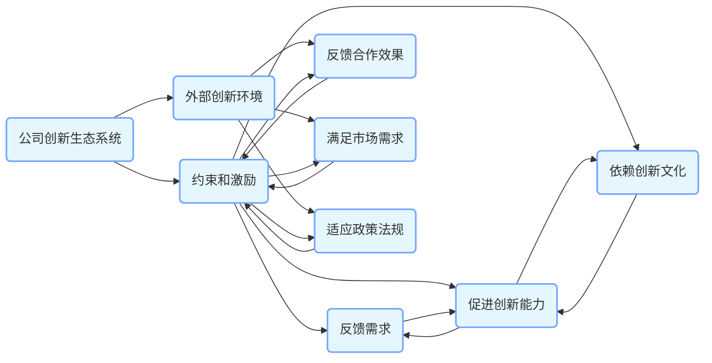

# 彼得林奇对公司创新生态系统的可持续性评估

> 关键词：彼得林奇、公司创新生态系统、可持续性评估、投资分析、创新管理

> 摘要：本文深入探讨了彼得林奇关于公司创新生态系统可持续性评估的理念和方法。从背景介绍入手，阐述了该评估的目的、范围、预期读者等内容。详细解析了公司创新生态系统的核心概念及其联系，通过Python代码展示了核心算法原理和具体操作步骤，结合数学模型和公式进行理论阐释，并辅以实际案例。探讨了其在实际应用场景中的作用，推荐了相关的学习资源、开发工具和论文著作。最后总结了未来发展趋势与挑战，为投资者和企业管理者在评估公司创新生态系统可持续性方面提供全面而深入的指导。

## 1. 背景介绍 
### 1.1 目的和范围
彼得林奇作为投资界的传奇人物，其投资理念和方法对众多投资者产生了深远影响。对公司创新生态系统的可持续性进行评估，旨在帮助投资者识别具有长期增长潜力的公司，为投资决策提供有力依据。本评估涵盖了公司创新生态系统的各个方面，包括创新资源、创新能力、创新文化以及与外部环境的互动等，通过综合分析来判断公司创新生态系统是否能够持续推动公司的发展。

### 1.2 预期读者
本文预期读者主要包括投资者、企业管理者、金融分析师以及对公司创新和投资领域感兴趣的研究人员。投资者可以借助本文的评估方法更好地筛选投资标的；企业管理者能够从中获取关于如何构建和维护可持续创新生态系统的启示；金融分析师可将其作为分析公司价值的重要参考；研究人员则可以进一步深入探讨相关理论和实践问题。

### 1.3 文档结构概述
本文首先介绍背景信息，为后续内容奠定基础。接着阐述公司创新生态系统的核心概念与联系，让读者对评估对象有清晰的认识。然后详细讲解核心算法原理和具体操作步骤，并结合数学模型和公式进行理论推导。通过项目实战部分，展示实际案例的代码实现和解读。分析实际应用场景，使读者了解该评估方法的实际用途。推荐相关的工具和资源，为读者提供学习和研究的途径。最后总结未来发展趋势与挑战，并设置附录解答常见问题，同时提供扩展阅读和参考资料。

### 1.4 术语表
#### 1.4.1 核心术语定义
- **公司创新生态系统**：指公司内部与创新相关的各种要素，如研发部门、创新人才、创新文化等，以及与外部合作伙伴、供应商、客户等共同构成的一个有机整体，通过相互作用和协同创新来推动公司的发展。
- **可持续性评估**：对公司创新生态系统在长期内保持有效运行、不断创造价值并适应外部环境变化的能力进行评价和分析。
- **创新资源**：包括人力、物力、财力等方面的资源，是公司开展创新活动的基础。
- **创新能力**：公司在研发、技术应用、产品开发等方面的能力，体现了公司将创新资源转化为实际创新成果的效率。

#### 1.4.2 相关概念解释
- **创新文化**：公司内部倡导创新、鼓励冒险、容忍失败的文化氛围，对激发员工的创新积极性和创造力具有重要作用。
- **外部合作伙伴**：与公司在创新领域开展合作的其他企业、科研机构等，通过资源共享和优势互补来提升创新能力。
- **创新生态系统的动态平衡**：指创新生态系统内部各要素之间以及与外部环境之间保持一种相对稳定、协调发展的状态。

#### 1.4.3 缩略词列表
- **R&D**：Research and Development，研发
- **GDP**：Gross Domestic Product，国内生产总值

## 2. 核心概念与联系 
### 核心概念原理
公司创新生态系统的可持续性评估基于系统论和生态学的原理。从系统论的角度看，公司创新生态系统是一个复杂的系统，各个要素之间相互关联、相互影响。例如，创新资源的充足与否会影响创新能力的发挥，而创新能力又会决定公司能否推出具有竞争力的产品和服务，进而影响公司的市场份额和盈利能力。从生态学的角度看，公司创新生态系统需要与外部环境保持良好的互动，不断吸收外部的信息、技术和资源，同时将自身的创新成果反馈给外部环境，以实现自身的进化和发展。

### 架构的文本示意图
公司创新生态系统主要由内部创新要素和外部创新环境两部分组成。内部创新要素包括创新资源、创新能力和创新文化。创新资源为创新活动提供物质基础，创新能力将资源转化为创新成果，创新文化则为创新活动营造良好的氛围。外部创新环境包括外部合作伙伴、市场需求和政策法规等。外部合作伙伴可以为公司提供技术支持和资源共享，市场需求引导公司的创新方向，政策法规则对公司的创新活动产生约束和激励作用。

### Mermaid 流程图


## 3. 核心算法原理 & 具体操作步骤 
### 核心算法原理
我们可以采用综合评价法来评估公司创新生态系统的可持续性。该方法通过构建评价指标体系，对每个指标赋予相应的权重，然后将公司在各个指标上的得分进行加权求和，得到公司创新生态系统可持续性的综合得分。具体步骤如下：

1. **确定评价指标体系**：根据公司创新生态系统的核心要素，确定一系列评价指标，如研发投入占比、专利数量、创新人才比例等。
2. **确定指标权重**：采用层次分析法（AHP）等方法确定每个指标的权重，以反映其在评估中的重要程度。
3. **数据收集与处理**：收集公司在各个指标上的数据，并进行标准化处理，以消除不同指标之间的量纲差异。
4. **计算综合得分**：将标准化后的数据与相应的指标权重相乘，然后求和得到综合得分。

### Python源代码实现
```python
import numpy as np

# 定义评价指标数据
# 假设我们有三个指标：研发投入占比、专利数量、创新人才比例
# 这里使用示例数据，实际应用中需要收集真实数据
indicator_data = np.array([0.1, 20, 0.3])

# 定义指标权重
# 这里使用示例权重，实际应用中需要通过AHP等方法确定
weights = np.array([0.4, 0.3, 0.3])

# 数据标准化处理
# 这里使用线性标准化方法
def standardize(data):
    min_val = np.min(data)
    max_val = np.max(data)
    return (data - min_val) / (max_val - min_val)

standardized_data = standardize(indicator_data)

# 计算综合得分
composite_score = np.dot(standardized_data, weights)

print("公司创新生态系统可持续性综合得分:", composite_score)
```

### 具体操作步骤
1. **数据收集**：通过公司年报、财务报表、专利数据库等渠道收集公司在各个评价指标上的数据。
2. **指标权重确定**：组织专家团队，采用AHP方法确定每个指标的权重。具体步骤包括构建层次结构模型、构造判断矩阵、计算权重向量和进行一致性检验。
3. **数据标准化**：使用上述Python代码中的标准化函数对收集到的数据进行处理。
4. **综合得分计算**：将标准化后的数据与相应的指标权重相乘，然后求和得到综合得分。
5. **结果分析**：根据综合得分对公司创新生态系统的可持续性进行评价，得分越高表示可持续性越强。

## 4. 数学模型和公式 & 详细讲解 & 举例说明 
### 数学模型
设评价指标体系中有 $n$ 个指标，分别为 $x_1, x_2, \cdots, x_n$，对应的权重为 $w_1, w_2, \cdots, w_n$，且 $\sum_{i=1}^{n} w_i = 1$。公司在第 $i$ 个指标上的原始数据为 $X_i$，标准化后的数据为 $x_i$。则公司创新生态系统可持续性的综合得分 $S$ 可以表示为：

$$S = \sum_{i=1}^{n} w_i x_i$$

### 详细讲解
- **指标标准化**：由于不同指标的量纲和取值范围可能不同，为了使各个指标具有可比性，需要对原始数据进行标准化处理。常见的标准化方法有线性标准化、Z-score标准化等。本文采用线性标准化方法，其公式为：

$$x_i = \frac{X_i - \min(X)}{\max(X) - \min(X)}$$

其中，$\min(X)$ 和 $\max(X)$ 分别为所有公司在该指标上的最小值和最大值。

- **权重确定**：权重反映了每个指标在评估中的重要程度。可以采用AHP方法确定权重，其基本思想是通过比较不同指标之间的相对重要性，构造判断矩阵，然后求解判断矩阵的特征向量，得到各个指标的权重。

### 举例说明
假设我们要评估两家公司A和B的创新生态系统可持续性，评价指标体系包括研发投入占比、专利数量和创新人才比例三个指标，权重分别为0.4、0.3和0.3。两家公司的原始数据如下：

| 公司 | 研发投入占比 | 专利数量 | 创新人才比例 |
| ---- | ---- | ---- | ---- |
| A | 0.1 | 20 | 0.3 |
| B | 0.08 | 15 | 0.25 |

首先进行数据标准化处理：

对于研发投入占比：
$\min(X) = 0.08$，$\max(X) = 0.1$
$x_{A1} = \frac{0.1 - 0.08}{0.1 - 0.08} = 1$
$x_{B1} = \frac{0.08 - 0.08}{0.1 - 0.08} = 0$

对于专利数量：
$\min(X) = 15$，$\max(X) = 20$
$x_{A2} = \frac{20 - 15}{20 - 15} = 1$
$x_{B2} = \frac{15 - 15}{20 - 15} = 0$

对于创新人才比例：
$\min(X) = 0.25$，$\max(X) = 0.3$
$x_{A3} = \frac{0.3 - 0.25}{0.3 - 0.25} = 1$
$x_{B3} = \frac{0.25 - 0.25}{0.3 - 0.25} = 0$

然后计算综合得分：

公司A的综合得分：
$S_A = 0.4 \times 1 + 0.3 \times 1 + 0.3 \times 1 = 1$

公司B的综合得分：
$S_B = 0.4 \times 0 + 0.3 \times 0 + 0.3 \times 0 = 0$

由此可见，公司A的创新生态系统可持续性较强。

## 5. 项目实战：代码实际案例和详细解释说明 
### 5.1  开发环境搭建
在进行项目实战之前，需要搭建相应的开发环境。以下是具体步骤：

1. **安装Python**：从Python官方网站（https://www.python.org/downloads/）下载并安装Python 3.x版本。
2. **安装必要的库**：使用pip命令安装numpy库，用于数值计算。
```sh
pip install numpy
```
3. **选择开发工具**：可以选择使用PyCharm、Jupyter Notebook等开发工具。这里推荐使用Jupyter Notebook，它具有交互式编程的特点，方便代码的编写和调试。

### 5.2  源代码详细实现和代码解读
```python
import numpy as np

# 定义评价指标数据
# 假设有四个指标：研发投入占比、专利数量、创新人才比例、新产品销售收入占比
# 这里使用示例数据，实际应用中需要收集真实数据
indicator_data = np.array([0.12, 30, 0.35, 0.2])

# 定义指标权重
# 这里使用示例权重，实际应用中需要通过AHP等方法确定
weights = np.array([0.3, 0.25, 0.25, 0.2])

# 数据标准化处理
# 这里使用线性标准化方法
def standardize(data):
    min_val = np.min(data)
    max_val = np.max(data)
    return (data - min_val) / (max_val - min_val)

standardized_data = standardize(indicator_data)

# 计算综合得分
composite_score = np.dot(standardized_data, weights)

print("公司创新生态系统可持续性综合得分:", composite_score)
```

### 代码解读与分析
1. **导入必要的库**：使用`import numpy as np`导入numpy库，用于数值计算。
2. **定义评价指标数据**：使用`np.array`定义评价指标数据，这里假设有四个指标，分别为研发投入占比、专利数量、创新人才比例和新产品销售收入占比。
3. **定义指标权重**：使用`np.array`定义指标权重，这里的权重是示例权重，实际应用中需要通过AHP等方法确定。
4. **数据标准化处理**：定义`standardize`函数，使用线性标准化方法对数据进行处理，消除不同指标之间的量纲差异。
5. **计算综合得分**：使用`np.dot`函数将标准化后的数据与相应的指标权重相乘，然后求和得到综合得分。
6. **输出结果**：使用`print`函数输出公司创新生态系统可持续性的综合得分。

## 6. 实际应用场景 
### 投资者决策
投资者可以利用彼得林奇的公司创新生态系统可持续性评估方法，筛选具有长期增长潜力的公司进行投资。通过评估公司的创新资源、创新能力和创新文化等方面，判断公司是否能够持续推出具有竞争力的产品和服务，从而提高投资回报率。

### 企业战略规划
企业管理者可以借助该评估方法，了解公司创新生态系统的现状和存在的问题，制定相应的战略规划。例如，如果评估结果显示公司的创新资源不足，企业可以加大研发投入，引进创新人才；如果创新能力较弱，企业可以加强与外部合作伙伴的合作，提升自身的创新能力。

### 政府政策制定
政府部门可以根据公司创新生态系统的可持续性评估结果，制定相关的政策法规，引导和支持企业的创新活动。例如，对于创新生态系统可持续性较强的公司，可以给予税收优惠、财政补贴等政策支持；对于创新能力较弱的公司，可以提供技术培训、创新咨询等服务。

### 行业竞争力分析
行业协会或研究机构可以利用该评估方法，对行业内的企业进行创新生态系统可持续性评估，分析行业的整体创新水平和竞争力。通过比较不同企业的评估结果，找出行业内的优势企业和劣势企业，为行业的发展提供参考。

## 7. 工具和资源推荐
### 7.1 学习资源推荐
#### 7.1.1 书籍推荐
- 《彼得林奇的成功投资》：彼得林奇的经典著作，详细介绍了他的投资理念和方法，对理解公司创新生态系统的评估具有重要的启示作用。
- 《创新者的窘境》：克莱顿·克里斯坦森的著作，探讨了企业在创新过程中面临的挑战和机遇，有助于深入理解公司创新生态系统的动态变化。
- 《创新管理》：介绍了创新管理的理论和方法，包括创新战略、创新组织、创新文化等方面的内容，为评估公司创新生态系统提供了理论基础。

#### 7.1.2 在线课程
- Coursera上的“创新管理与创业”课程：由知名教授授课，涵盖了创新管理的各个方面，包括创新生态系统的构建和评估。
- edX上的“投资学原理”课程：介绍了投资的基本原理和方法，其中包括对公司基本面的分析，与公司创新生态系统的评估密切相关。

#### 7.1.3 技术博客和网站
- 36氪：专注于科技、创新和创业领域的资讯平台，提供了大量关于公司创新的案例和分析。
- 创业邦：为创业者和投资者提供服务的平台，包含了许多关于创新生态系统的研究报告和文章。

### 7.2 开发工具框架推荐
#### 7.2.1 IDE和编辑器
- PyCharm：专业的Python集成开发环境，具有代码编辑、调试、版本控制等功能，适合开发Python程序。
- Jupyter Notebook：交互式编程环境，支持多种编程语言，方便代码的编写和展示，适合进行数据分析和模型验证。

#### 7.2.2 调试和性能分析工具
- PDB：Python自带的调试工具，可以帮助开发者定位代码中的问题。
- cProfile：Python的性能分析工具，可以分析代码的运行时间和内存使用情况，帮助开发者优化代码性能。

#### 7.2.3 相关框架和库
- numpy：用于数值计算的Python库，提供了高效的数组操作和数学函数。
- pandas：用于数据处理和分析的Python库，提供了丰富的数据结构和数据操作方法。

### 7.3 相关论文著作推荐
#### 7.3.1 经典论文
- “The Innovator's Dilemma: When New Technologies Cause Great Firms to Fail”：克莱顿·克里斯坦森的经典论文，提出了颠覆性创新的概念，对理解公司创新生态系统的变革具有重要意义。
- “Open Innovation: The New Imperative for Creating and Profiting from Technology”：亨利·切萨布鲁夫的论文，介绍了开放式创新的理念和方法，为公司创新生态系统的构建提供了新的思路。

#### 7.3.2 最新研究成果
- 关注顶级学术期刊，如《管理科学》、《哈佛商业评论》等，这些期刊会发表关于公司创新生态系统的最新研究成果。
- 参加相关的学术会议，如美国管理学会年会、国际创新管理会议等，与国内外的学者和专家交流最新的研究动态。

#### 7.3.3 应用案例分析
- 分析知名企业的创新案例，如苹果公司、谷歌公司等，了解它们在创新生态系统构建和管理方面的经验和做法。
- 参考行业研究报告，如麦肯锡、波士顿咨询等机构发布的报告，获取行业内的创新案例和趋势分析。

## 8. 总结：未来发展趋势与挑战
### 未来发展趋势
- **数字化转型加速**：随着信息技术的快速发展，公司创新生态系统将更加数字化。大数据、人工智能、物联网等技术将广泛应用于创新过程中，提高创新效率和质量。
- **开放式创新模式普及**：越来越多的公司将采用开放式创新模式，与外部合作伙伴开展更广泛的合作，整合全球创新资源，提升自身的创新能力。
- **可持续创新成为主流**：在全球可持续发展的背景下，公司将更加注重可持续创新，将环境保护、社会责任等因素纳入创新战略中，实现经济、社会和环境的共赢。

### 挑战
- **数据安全与隐私问题**：数字化转型带来了大量的数据流动和共享，数据安全和隐私问题成为公司创新生态系统面临的重要挑战。公司需要加强数据安全管理，保护用户的隐私信息。
- **创新人才短缺**：创新需要高素质的人才，但目前创新人才短缺的问题较为突出。公司需要加强人才培养和引进，建立完善的人才激励机制，吸引和留住创新人才。
- **外部环境不确定性增加**：全球政治、经济、社会等环境的不确定性增加，给公司创新生态系统带来了更大的挑战。公司需要提高自身的应变能力，及时调整创新战略，以适应外部环境的变化。

## 9. 附录：常见问题与解答
### 问题1：如何确定评价指标的权重？
解答：可以采用层次分析法（AHP）等方法确定评价指标的权重。具体步骤包括构建层次结构模型、构造判断矩阵、计算权重向量和进行一致性检验。在实际应用中，需要组织专家团队进行评估和判断。

### 问题2：数据标准化有哪些方法？
解答：常见的数据标准化方法有线性标准化、Z-score标准化、Min-Max标准化等。本文采用的是线性标准化方法，其公式为 $x_i = \frac{X_i - \min(X)}{\max(X) - \min(X)}$。不同的标准化方法适用于不同的数据分布和应用场景，需要根据具体情况选择合适的方法。

### 问题3：评估结果的准确性如何保证？
解答：评估结果的准确性受到多种因素的影响，如评价指标的选择、指标权重的确定、数据的准确性等。为了保证评估结果的准确性，需要选择合理的评价指标体系，采用科学的方法确定指标权重，收集准确可靠的数据，并进行严格的数据质量控制。同时，可以采用多种评估方法进行对比分析，提高评估结果的可信度。

## 10. 扩展阅读 & 参考资料
### 扩展阅读
- 《创新的艺术》：介绍了创新的方法和技巧，帮助读者培养创新思维和能力。
- 《从0到1》：阐述了创业和创新的理念，对创业者和投资者具有重要的启示作用。

### 参考资料
- 彼得林奇的相关著作和访谈资料。
- 国内外关于公司创新生态系统的学术论文和研究报告。
- 知名企业的创新案例和实践经验。

作者：AI天才研究院/AI Genius Institute & 禅与计算机程序设计艺术 /Zen And The Art of Computer Programming