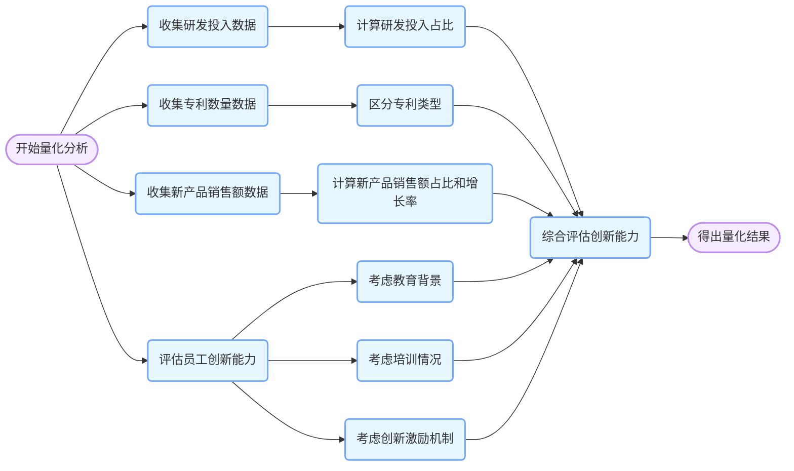

# 彼得林奇对公司创新能力的量化分析

> 关键词：彼得林奇、公司创新能力、量化分析、财务指标、市场表现

> 摘要：本文围绕彼得林奇对公司创新能力的量化分析展开。首先介绍彼得林奇投资理念的背景以及进行公司创新能力量化分析的目的和适用读者。接着阐述与公司创新能力量化分析相关的核心概念及其联系，给出原理和架构的文本示意图与 Mermaid 流程图。详细讲解核心算法原理并给出 Python 代码示例，同时介绍相关数学模型和公式。通过项目实战展示代码案例及解读，探讨公司创新能力量化分析在实际中的应用场景。推荐学习资源、开发工具框架以及相关论文著作。最后总结未来发展趋势与挑战，解答常见问题并提供扩展阅读和参考资料，旨在帮助读者深入理解彼得林奇对公司创新能力量化分析的方法和价值。

## 1. 背景介绍 
### 1.1 目的和范围
彼得林奇是投资界的传奇人物，他以卓越的选股能力和长期优异的投资业绩闻名于世。对公司创新能力进行量化分析的目的在于为投资者提供一种科学、客观的方法来评估公司的潜在价值和成长能力。创新能力是公司在激烈的市场竞争中脱颖而出的关键因素之一，通过量化分析，投资者可以更准确地判断公司是否具有持续创新的动力和能力，从而做出更明智的投资决策。

本分析的范围主要涵盖了上市公司，包括不同行业、不同规模的企业。通过对公司的财务数据、研发投入、市场表现等多方面的指标进行量化分析，全面评估公司的创新能力。

### 1.2 预期读者
本文预期读者主要包括以下几类人群：
1. **投资者**：无论是个人投资者还是机构投资者，都希望通过了解公司的创新能力来寻找具有投资价值的标的。彼得林奇的量化分析方法可以为他们提供一种有效的评估工具。
2. **金融分析师**：专业的金融分析师需要对公司进行深入的研究和评估，量化分析公司的创新能力可以丰富他们的分析维度，提高分析的准确性和可靠性。
3. **企业管理者**：企业管理者可以通过了解彼得林奇的量化分析方法，审视自身公司的创新能力，发现存在的问题和不足，从而制定相应的策略来提升公司的创新水平。
4. **学术研究者**：对投资理论和企业创新能力研究感兴趣的学术研究者可以从本文中获取相关的理论和实证研究资料，为进一步的学术研究提供参考。

### 1.3 文档结构概述
本文将按照以下结构进行阐述：
1. **核心概念与联系**：介绍与公司创新能力量化分析相关的核心概念，如研发投入、专利数量、新产品销售额等，并分析它们之间的联系，给出原理和架构的文本示意图与 Mermaid 流程图。
2. **核心算法原理 & 具体操作步骤**：详细讲解彼得林奇用于量化分析公司创新能力的核心算法原理，并通过 Python 代码示例展示具体的操作步骤。
3. **数学模型和公式 & 详细讲解 & 举例说明**：介绍相关的数学模型和公式，对其进行详细讲解，并通过实际案例说明如何应用这些模型和公式进行量化分析。
4. **项目实战：代码实际案例和详细解释说明**：通过一个具体的项目实战，展示如何使用 Python 代码对公司的创新能力进行量化分析，包括开发环境搭建、源代码详细实现和代码解读。
5. **实际应用场景**：探讨公司创新能力量化分析在投资决策、企业战略规划等实际场景中的应用。
6. **工具和资源推荐**：推荐学习资源、开发工具框架以及相关论文著作，帮助读者进一步深入学习和研究。
7. **总结：未来发展趋势与挑战**：总结彼得林奇对公司创新能力量化分析的方法和价值，分析未来的发展趋势和面临的挑战。
8. **附录：常见问题与解答**：解答读者在学习和应用过程中可能遇到的常见问题。
9. **扩展阅读 & 参考资料**：提供相关的扩展阅读资料和参考书目，方便读者进一步深入学习。

### 1.4 术语表
#### 1.4.1 核心术语定义
1. **创新能力**：指公司在产品、技术、管理等方面进行创新的能力，包括研发新产品、采用新技术、改进管理模式等方面的能力。
2. **研发投入**：公司为了开展研发活动而投入的资金，包括人员工资、设备购置、实验材料等方面的费用。
3. **专利数量**：公司拥有的专利的数量，是衡量公司技术创新能力的重要指标之一。
4. **新产品销售额**：公司销售新产品所获得的收入，反映了公司新产品的市场接受程度和商业价值。
5. **量化分析**：将定性的概念转化为定量的指标，通过数学模型和统计方法进行分析和评估的过程。

#### 1.4.2 相关概念解释
1. **创新效率**：指公司在研发投入的基础上，取得的创新成果的效率。可以通过专利数量与研发投入的比值、新产品销售额与研发投入的比值等指标来衡量。
2. **创新持续性**：指公司在长期内保持创新能力的能力。可以通过观察公司的研发投入是否持续增长、专利数量是否逐年增加等方面来评估。
3. **市场竞争力**：公司在市场上与竞争对手相比所具有的优势和竞争力。创新能力是影响公司市场竞争力的重要因素之一。

#### 1.4.3 缩略词列表
1. **R&D**：Research and Development，即研发。
2. **P/E**：Price-to-Earnings Ratio，即市盈率。

## 2. 核心概念与联系 

### 核心概念原理
彼得林奇对公司创新能力的量化分析主要基于以下几个核心概念：
1. **研发投入**：研发投入是公司进行创新活动的基础，只有投入足够的资金，公司才有可能开展研发项目，开发新产品和新技术。一般来说，研发投入占营业收入的比例越高，说明公司对创新的重视程度越高。
2. **专利数量**：专利是公司技术创新的重要成果，拥有较多的专利数量说明公司在技术领域具有较强的创新能力和竞争力。专利数量可以反映公司的技术积累和创新实力。
3. **新产品销售额**：新产品销售额是公司创新成果的市场体现，新产品能够获得较高的销售额，说明公司的创新产品得到了市场的认可，具有较高的商业价值。
4. **员工创新能力**：员工是公司创新的主体，员工的创新能力直接影响公司的创新水平。可以通过员工的教育背景、培训情况、创新激励机制等方面来评估员工的创新能力。

### 架构的文本示意图
```
公司创新能力量化分析架构
|-- 研发投入
|   |-- 研发投入金额
|   |-- 研发投入占比
|-- 专利数量
|   |-- 发明专利数量
|   |-- 实用新型专利数量
|   |-- 外观设计专利数量
|-- 新产品销售额
|   |-- 新产品销售额占比
|   |-- 新产品销售额增长率
|-- 员工创新能力
|   |-- 员工教育背景
|   |-- 员工培训情况
|   |-- 创新激励机制
```

### Mermaid 流程图


## 3. 核心算法原理 & 具体操作步骤 

### 核心算法原理
彼得林奇对公司创新能力的量化分析主要是通过构建一个综合指标体系，将研发投入、专利数量、新产品销售额等多个指标进行加权平均，得到一个综合的创新能力得分。具体公式如下：

$$
\text{创新能力得分} = w_1 \times \text{研发投入得分} + w_2 \times \text{专利数量得分} + w_3 \times \text{新产品销售额得分} + w_4 \times \text{员工创新能力得分}
$$

其中，$w_1$、$w_2$、$w_3$、$w_4$ 分别为各个指标的权重，且 $w_1 + w_2 + w_3 + w_4 = 1$。各个指标的得分可以通过以下方法计算：

1. **研发投入得分**：可以将研发投入占营业收入的比例与同行业平均水平进行比较，得到一个相对得分。例如，如果公司的研发投入占比高于同行业平均水平，则得分较高；反之，则得分较低。
2. **专利数量得分**：可以将公司的专利数量与同行业平均水平进行比较，得到一个相对得分。同时，可以根据专利的类型进行加权，发明专利的权重可以设置得较高，实用新型专利和外观设计专利的权重可以设置得较低。
3. **新产品销售额得分**：可以将新产品销售额占总销售额的比例与同行业平均水平进行比较，得到一个相对得分。同时，可以考虑新产品销售额的增长率，增长率越高，得分越高。
4. **员工创新能力得分**：可以通过对员工的教育背景、培训情况、创新激励机制等方面进行评估，得到一个综合得分。

### 具体操作步骤
以下是使用 Python 实现彼得林奇对公司创新能力量化分析的具体操作步骤：

```python
import pandas as pd

# 定义各个指标的权重
w1 = 0.3
w2 = 0.2
w3 = 0.3
w4 = 0.2

# 示例数据：假设已经收集到了各个公司的相关数据
data = {
    '公司名称': ['公司 A', '公司 B', '公司 C'],
    '研发投入占比': [0.1, 0.15, 0.08],
    '专利数量': [50, 80, 30],
    '新产品销售额占比': [0.2, 0.3, 0.15],
    '新产品销售额增长率': [0.1, 0.2, 0.05],
    '员工创新能力得分': [70, 80, 60]
}

df = pd.DataFrame(data)

# 计算研发投入得分
industry_avg_rd_ratio = df['研发投入占比'].mean()
df['研发投入得分'] = df['研发投入占比'] / industry_avg_rd_ratio * 100

# 计算专利数量得分
industry_avg_patent_count = df['专利数量'].mean()
df['专利数量得分'] = df['专利数量'] / industry_avg_patent_count * 100

# 计算新产品销售额得分
industry_avg_new_product_ratio = df['新产品销售额占比'].mean()
industry_avg_new_product_growth = df['新产品销售额增长率'].mean()
df['新产品销售额得分'] = (df['新产品销售额占比'] / industry_avg_new_product_ratio + df['新产品销售额增长率'] / industry_avg_new_product_growth) / 2 * 100

# 计算创新能力得分
df['创新能力得分'] = w1 * df['研发投入得分'] + w2 * df['专利数量得分'] + w3 * df['新产品销售额得分'] + w4 * df['员工创新能力得分']

# 输出结果
print(df[['公司名称', '创新能力得分']])
```

### 代码解释
1. **定义权重**：首先定义了各个指标的权重 $w_1$、$w_2$、$w_3$、$w_4$。
2. **创建示例数据**：使用 `pandas` 库创建一个包含各个公司相关数据的 DataFrame。
3. **计算研发投入得分**：计算同行业研发投入占比的平均值，然后将每个公司的研发投入占比与平均值进行比较，得到研发投入得分。
4. **计算专利数量得分**：计算同行业专利数量的平均值，然后将每个公司的专利数量与平均值进行比较，得到专利数量得分。
5. **计算新产品销售额得分**：计算同行业新产品销售额占比和增长率的平均值，然后将每个公司的新产品销售额占比和增长率与平均值进行比较，得到新产品销售额得分。
6. **计算创新能力得分**：根据公式计算每个公司的创新能力得分。
7. **输出结果**：输出每个公司的名称和创新能力得分。

## 4. 数学模型和公式 & 详细讲解 & 举例说明 

### 数学模型和公式
#### 1. 综合创新能力得分公式
$$
\text{创新能力得分} = w_1 \times \text{研发投入得分} + w_2 \times \text{专利数量得分} + w_3 \times \text{新产品销售额得分} + w_4 \times \text{员工创新能力得分}
$$

其中，$w_i$ 表示第 $i$ 个指标的权重，且 $\sum_{i=1}^{4} w_i = 1$。

#### 2. 研发投入得分公式
$$
\text{研发投入得分} = \frac{\text{公司研发投入占比}}{\text{同行业平均研发投入占比}} \times 100
$$

#### 3. 专利数量得分公式
$$
\text{专利数量得分} = \frac{\text{公司专利数量}}{\text{同行业平均专利数量}} \times 100
$$

#### 4. 新产品销售额得分公式
$$
\text{新产品销售额得分} = \frac{1}{2} \left( \frac{\text{公司新产品销售额占比}}{\text{同行业平均新产品销售额占比}} + \frac{\text{公司新产品销售额增长率}}{\text{同行业平均新产品销售额增长率}} \right) \times 100
$$

### 详细讲解
1. **综合创新能力得分公式**：该公式将研发投入、专利数量、新产品销售额和员工创新能力四个指标进行加权平均，得到一个综合的创新能力得分。权重的设置可以根据不同的行业和投资偏好进行调整。
2. **研发投入得分公式**：通过将公司的研发投入占比与同行业平均水平进行比较，得到一个相对得分。得分越高，说明公司在研发投入方面相对同行业更有优势。
3. **专利数量得分公式**：同样是将公司的专利数量与同行业平均水平进行比较，得到一个相对得分。得分越高，说明公司在专利方面相对同行业更有优势。
4. **新产品销售额得分公式**：综合考虑了公司新产品销售额占比和增长率两个因素，通过与同行业平均水平进行比较，得到一个相对得分。得分越高，说明公司的新产品在市场上的表现相对同行业更出色。

### 举例说明
假设我们有三个公司 A、B、C，相关数据如下：

| 公司名称 | 研发投入占比 | 专利数量 | 新产品销售额占比 | 新产品销售额增长率 | 员工创新能力得分 |
| ---- | ---- | ---- | ---- | ---- | ---- |
| 公司 A | 0.1 | 50 | 0.2 | 0.1 | 70 |
| 公司 B | 0.15 | 80 | 0.3 | 0.2 | 80 |
| 公司 C | 0.08 | 30 | 0.15 | 0.05 | 60 |

同行业平均研发投入占比为 0.12，平均专利数量为 60，平均新产品销售额占比为 0.25，平均新产品销售额增长率为 0.15。各个指标的权重分别为 $w_1 = 0.3$，$w_2 = 0.2$，$w_3 = 0.3$，$w_4 = 0.2$。

#### 1. 计算研发投入得分
- 公司 A：$\text{研发投入得分}_A = \frac{0.1}{0.12} \times 100 \approx 83.33$
- 公司 B：$\text{研发投入得分}_B = \frac{0.15}{0.12} \times 100 = 125$
- 公司 C：$\text{研发投入得分}_C = \frac{0.08}{0.12} \times 100 \approx 66.67$

#### 2. 计算专利数量得分
- 公司 A：$\text{专利数量得分}_A = \frac{50}{60} \times 100 \approx 83.33$
- 公司 B：$\text{专利数量得分}_B = \frac{80}{60} \times 100 \approx 133.33$
- 公司 C：$\text{专利数量得分}_C = \frac{30}{60} \times 100 = 50$

#### 3. 计算新产品销售额得分
- 公司 A：$\text{新产品销售额得分}_A = \frac{1}{2} \left( \frac{0.2}{0.25} + \frac{0.1}{0.15} \right) \times 100 \approx 73.33$
- 公司 B：$\text{新产品销售额得分}_B = \frac{1}{2} \left( \frac{0.3}{0.25} + \frac{0.2}{0.15} \right) \times 100 \approx 113.33$
- 公司 C：$\text{新产品销售额得分}_C = \frac{1}{2} \left( \frac{0.15}{0.25} + \frac{0.05}{0.15} \right) \times 100 \approx 46.67$

#### 4. 计算创新能力得分
- 公司 A：$\text{创新能力得分}_A = 0.3 \times 83.33 + 0.2 \times 83.33 + 0.3 \times 73.33 + 0.2 \times 70 \approx 78.33$
- 公司 B：$\text{创新能力得分}_B = 0.3 \times 125 + 0.2 \times 133.33 + 0.3 \times 113.33 + 0.2 \times 80 \approx 112.33$
- 公司 C：$\text{创新能力得分}_C = 0.3 \times 66.67 + 0.2 \times 50 + 0.3 \times 46.67 + 0.2 \times 60 \approx 55.33$

从计算结果可以看出，公司 B 的创新能力得分最高，说明公司 B 在创新方面相对公司 A 和公司 C 更有优势。

## 5. 项目实战：代码实际案例和详细解释说明 

### 5.1  开发环境搭建
为了实现彼得林奇对公司创新能力的量化分析，我们需要搭建一个 Python 开发环境。以下是具体的搭建步骤：

1. **安装 Python**：从 Python 官方网站（https://www.python.org/downloads/）下载并安装 Python 3.x 版本。
2. **安装必要的库**：使用 `pip` 命令安装 `pandas` 库，用于数据处理和分析。
```bash
pip install pandas
```

### 5.2  源代码详细实现和代码解读
以下是一个完整的 Python 代码示例，用于对公司创新能力进行量化分析：

```python
import pandas as pd

# 定义各个指标的权重
w1 = 0.3
w2 = 0.2
w3 = 0.3
w4 = 0.2

# 读取数据文件（假设数据存储在 CSV 文件中）
data = pd.read_csv('company_data.csv')

# 计算同行业平均指标
industry_avg_rd_ratio = data['研发投入占比'].mean()
industry_avg_patent_count = data['专利数量'].mean()
industry_avg_new_product_ratio = data['新产品销售额占比'].mean()
industry_avg_new_product_growth = data['新产品销售额增长率'].mean()

# 计算各个指标的得分
data['研发投入得分'] = data['研发投入占比'] / industry_avg_rd_ratio * 100
data['专利数量得分'] = data['专利数量'] / industry_avg_patent_count * 100
data['新产品销售额得分'] = (data['新产品销售额占比'] / industry_avg_new_product_ratio + data['新产品销售额增长率'] / industry_avg_new_product_growth) / 2 * 100

# 计算创新能力得分
data['创新能力得分'] = w1 * data['研发投入得分'] + w2 * data['专利数量得分'] + w3 * data['新产品销售额得分'] + w4 * data['员工创新能力得分']

# 按创新能力得分降序排序
sorted_data = data.sort_values(by='创新能力得分', ascending=False)

# 输出排名前三的公司
top_three = sorted_data.head(3)
print(top_three[['公司名称', '创新能力得分']])

# 将结果保存到新的 CSV 文件中
sorted_data.to_csv('company_innovation_score.csv', index=False)
```

### 代码解读与分析
1. **导入必要的库**：导入 `pandas` 库用于数据处理和分析。
2. **定义权重**：定义各个指标的权重 $w_1$、$w_2$、$w_3$、$w_4$。
3. **读取数据文件**：使用 `pd.read_csv` 函数读取存储公司数据的 CSV 文件。
4. **计算同行业平均指标**：计算同行业研发投入占比、专利数量、新产品销售额占比和增长率的平均值。
5. **计算各个指标的得分**：根据前面介绍的公式，计算每个公司的研发投入得分、专利数量得分和新产品销售额得分。
6. **计算创新能力得分**：根据综合创新能力得分公式，计算每个公司的创新能力得分。
7. **排序并输出结果**：按创新能力得分降序排序，输出排名前三的公司。
8. **保存结果**：将排序后的结果保存到新的 CSV 文件中。

## 6. 实际应用场景 
### 投资决策
在投资决策中，彼得林奇对公司创新能力的量化分析可以帮助投资者筛选出具有创新潜力的公司。投资者可以根据公司的创新能力得分，选择得分较高的公司进行投资。创新能力强的公司往往具有更强的市场竞争力和成长潜力，能够为投资者带来更高的回报。

### 企业战略规划
企业管理者可以使用彼得林奇的量化分析方法，评估自身公司的创新能力，发现存在的问题和不足。通过与同行业其他公司进行比较，企业可以明确自己在创新方面的优势和劣势，从而制定相应的战略规划，加大研发投入、加强人才培养、优化创新激励机制等，提升公司的创新能力。

### 行业研究
金融分析师和学术研究者可以使用该量化分析方法进行行业研究，了解不同行业的创新水平和发展趋势。通过对行业内公司的创新能力进行量化分析，可以发现行业内的创新领导者和追随者，为行业发展提供参考。

## 7. 工具和资源推荐
### 7.1 学习资源推荐
#### 7.1.1 书籍推荐
1. 《彼得林奇的成功投资》：彼得林奇的经典著作，详细介绍了他的投资理念和选股方法。
2. 《创新者的窘境》：探讨了企业在创新过程中面临的挑战和机遇，对理解公司创新能力有很大帮助。
3. 《财务报表分析》：帮助读者了解如何分析公司的财务报表，获取研发投入、新产品销售额等相关数据。

#### 7.1.2 在线课程
1. Coursera 上的“投资学原理”：介绍了投资的基本原理和方法，包括如何评估公司的价值。
2. edX 上的“创新管理”：讲解了创新管理的理论和实践，对提升公司创新能力有指导作用。

#### 7.1.3 技术博客和网站
1. Seeking Alpha：提供了大量的投资分析文章和研究报告，包括对公司创新能力的分析。
2. Investopedia：一个专业的金融知识学习网站，有很多关于投资和财务分析的文章。

### 7.2 开发工具框架推荐
#### 7.2.1 IDE和编辑器
1. PyCharm：一款专业的 Python 集成开发环境，提供了丰富的代码编辑、调试和分析功能。
2. Jupyter Notebook：一个交互式的开发环境，适合进行数据分析和可视化。

#### 7.2.2 调试和性能分析工具
1. pdb：Python 自带的调试工具，可以帮助开发者定位和解决代码中的问题。
2. cProfile：Python 的性能分析工具，可以分析代码的执行时间和内存使用情况。

#### 7.2.3 相关框架和库
1. pandas：用于数据处理和分析的 Python 库，提供了丰富的数据结构和函数。
2. numpy：用于科学计算的 Python 库，提供了高效的数组操作和数学函数。

### 7.3 相关论文著作推荐
#### 7.3.1 经典论文
1. “The Competitive Advantage of Nations” by Michael E. Porter：探讨了国家和企业的竞争优势，对理解公司创新能力的重要性有启示作用。
2. “Innovation and Entrepreneurship” by Peter F. Drucker：介绍了创新和创业的理论和实践，对企业创新管理有指导意义。

#### 7.3.2 最新研究成果
可以通过学术数据库如 IEEE Xplore、ACM Digital Library 等搜索关于公司创新能力量化分析的最新研究成果。

#### 7.3.3 应用案例分析
一些商业杂志和研究机构会发布关于公司创新能力的应用案例分析，如《哈佛商业评论》、麦肯锡咨询公司的研究报告等。

## 8. 总结：未来发展趋势与挑战
### 未来发展趋势
1. **多维度数据融合**：未来对公司创新能力的量化分析将不仅仅局限于研发投入、专利数量和新产品销售额等传统指标，还会融合更多维度的数据，如社交媒体数据、用户反馈数据等，以更全面地评估公司的创新能力。
2. **人工智能和机器学习的应用**：人工智能和机器学习技术将在公司创新能力量化分析中得到更广泛的应用。通过建立更复杂的模型和算法，可以更准确地预测公司的创新趋势和潜力。
3. **行业标准的建立**：随着对公司创新能力量化分析的重视，未来可能会建立统一的行业标准和评价体系，方便投资者和企业进行比较和评估。

### 挑战
1. **数据质量和获取难度**：准确的量化分析依赖于高质量的数据，但获取公司的研发投入、专利数量等数据可能存在一定的难度，而且数据的真实性和准确性也需要进行验证。
2. **指标权重的确定**：各个指标的权重对量化分析结果有很大影响，但如何确定合理的权重是一个难题，需要综合考虑行业特点、投资偏好等因素。
3. **创新的不确定性**：创新本身具有很大的不确定性，即使公司在研发投入、专利数量等方面表现出色，也不能保证其创新成果一定能够转化为商业价值。

## 9. 附录：常见问题与解答
### 1. 如何确定各个指标的权重？
各个指标的权重可以根据不同的行业和投资偏好进行调整。一般来说，可以通过专家评估、历史数据分析等方法来确定权重。例如，对于科技行业，可以适当提高研发投入和专利数量的权重；对于消费品行业，可以适当提高新产品销售额的权重。

### 2. 如果数据缺失怎么办？
如果某些公司的数据缺失，可以采用以下方法进行处理：
- **删除缺失数据**：如果缺失的数据较少，可以直接删除包含缺失数据的记录。
- **插补法**：使用均值、中位数等统计量来填充缺失的数据。
- **模型预测法**：使用机器学习模型来预测缺失的数据。

### 3. 量化分析结果的准确性如何保证？
为了保证量化分析结果的准确性，可以采取以下措施：
- **数据清洗**：对收集到的数据进行清洗，去除异常值和错误数据。
- **多指标综合评估**：使用多个指标进行综合评估，避免单一指标的局限性。
- **定期更新数据**：定期更新数据，以反映公司的最新情况。

## 10. 扩展阅读 & 参考资料
### 扩展阅读
1. 《聪明的投资者》：本杰明·格雷厄姆的经典著作，介绍了价值投资的理念和方法。
2. 《从 0 到 1》：彼得·蒂尔的著作，探讨了创业和创新的本质。

### 参考资料
1. Lynch, Peter. *One Up on Wall Street*. Simon & Schuster, 1989.
2. Porter, Michael E. *The Competitive Advantage of Nations*. Free Press, 1990.
3. Drucker, Peter F. *Innovation and Entrepreneurship*. Harper & Row, 1985.

作者：AI天才研究院/AI Genius Institute & 禅与计算机程序设计艺术 /Zen And The Art of Computer Programming