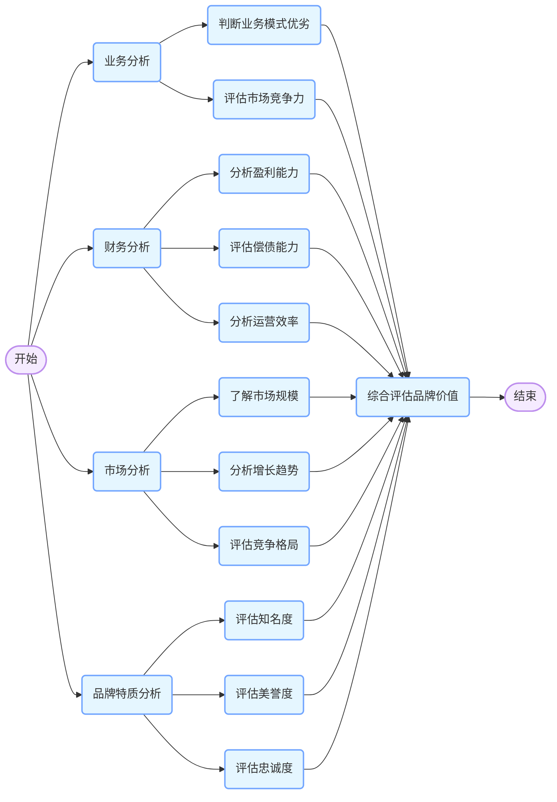

# 彼得林奇对公司品牌价值的分析方法

> 关键词：彼得林奇、公司品牌价值、分析方法、投资、企业评估

> 摘要：本文深入探讨了彼得林奇对公司品牌价值的分析方法。彼得林奇作为投资领域的传奇人物，其独特的品牌价值分析方法对于投资者评估企业价值和进行投资决策具有重要意义。文章从背景介绍入手，阐述相关概念和联系，详细讲解核心算法原理与操作步骤，通过数学模型和公式进行理论剖析，结合项目实战案例进行代码实现和解读，介绍实际应用场景，推荐相关工具和资源，最后总结未来发展趋势与挑战，并对常见问题进行解答，为读者全面呈现彼得林奇品牌价值分析方法的全貌。

## 1. 背景介绍 
### 1.1 目的和范围
本文的目的在于深入研究彼得林奇对公司品牌价值的分析方法，帮助投资者、企业管理者以及对品牌价值评估感兴趣的人士更好地理解和运用这一方法。范围涵盖了彼得林奇分析方法的核心概念、算法原理、实际应用以及相关工具和资源等方面，旨在为读者提供一个全面而系统的学习和参考资料。

### 1.2 预期读者
预期读者包括但不限于以下几类人群：
- **投资者**：希望通过了解彼得林奇的品牌价值分析方法，更准确地评估企业价值，做出明智的投资决策。
- **企业管理者**：可以借鉴该方法来评估自身企业的品牌价值，制定更有效的品牌战略和发展规划。
- **金融分析师**：在进行企业估值和行业研究时，参考彼得林奇的分析方法，提高分析的准确性和可靠性。
- **学术研究人员**：对品牌价值评估理论和实践感兴趣，希望从彼得林奇的方法中获取研究灵感和参考依据。

### 1.3 文档结构概述
本文按照以下结构进行组织：
- **核心概念与联系**：介绍彼得林奇品牌价值分析方法的核心概念，以及这些概念之间的联系，并通过文本示意图和 Mermaid 流程图进行直观展示。
- **核心算法原理 & 具体操作步骤**：详细讲解彼得林奇品牌价值分析方法的核心算法原理，并使用 Python 源代码进行具体操作步骤的阐述。
- **数学模型和公式 & 详细讲解 & 举例说明**：运用数学模型和公式对品牌价值分析方法进行理论剖析，并通过具体例子进行说明。
- **项目实战：代码实际案例和详细解释说明**：通过实际项目案例，展示如何运用彼得林奇的分析方法进行品牌价值评估，并对代码进行详细解读。
- **实际应用场景**：介绍彼得林奇品牌价值分析方法在不同领域的实际应用场景。
- **工具和资源推荐**：推荐相关的学习资源、开发工具框架以及论文著作，帮助读者进一步深入学习和研究。
- **总结：未来发展趋势与挑战**：总结彼得林奇品牌价值分析方法的未来发展趋势和面临的挑战。
- **附录：常见问题与解答**：对读者可能关心的常见问题进行解答。
- **扩展阅读 & 参考资料**：提供相关的扩展阅读资料和参考书目，方便读者进一步探索。

### 1.4 术语表
#### 1.4.1 核心术语定义
- **品牌价值**：指品牌所具有的经济价值，是品牌在市场中所体现的综合实力和影响力。它包括品牌的知名度、美誉度、忠诚度等多个方面，是企业无形资产的重要组成部分。
- **彼得林奇分析方法**：彼得林奇在长期的投资实践中总结出的一套评估公司品牌价值的方法，通过对公司的业务、财务、市场等多个方面进行综合分析，来判断品牌的价值和潜力。
- **竞争优势**：企业在市场竞争中相对于竞争对手所具有的优势，包括成本优势、技术优势、品牌优势等，是品牌价值的重要支撑。

#### 1.4.2 相关概念解释
- **品牌知名度**：指消费者对品牌的知晓程度，是品牌价值的基础。较高的品牌知名度意味着更多的消费者了解该品牌，从而增加了品牌的市场份额和销售机会。
- **品牌美誉度**：指消费者对品牌的好感和信任程度，是品牌价值的重要体现。良好的品牌美誉度可以提高消费者的忠诚度，促进品牌的长期发展。
- **品牌忠诚度**：指消费者对品牌的重复购买意愿和行为，是品牌价值的核心。高品牌忠诚度的消费者会持续购买该品牌的产品或服务，为企业带来稳定的收入和利润。

#### 1.4.3 缩略词列表
- **ROE**：Return on Equity，净资产收益率，反映企业运用自有资本的效率。
- **PE**：Price-to-Earnings Ratio，市盈率，衡量股票价格相对于每股盈利的指标。
- **PEG**：Price/Earnings to Growth Ratio，市盈率相对盈利增长比率，综合考虑了公司的盈利增长和估值水平。

## 2. 核心概念与联系 
彼得林奇对公司品牌价值的分析方法基于多个核心概念，这些概念相互关联，共同构成了一个完整的分析体系。

### 核心概念原理
- **业务分析**：彼得林奇非常注重对公司业务的深入了解。他认为，只有清楚公司是做什么的，以及其业务模式的优劣，才能判断品牌的价值。例如，一家具有独特业务模式和强大市场竞争力的公司，其品牌往往具有更高的价值。
- **财务分析**：通过对公司财务报表的分析，如收入、利润、资产负债等指标，可以了解公司的盈利能力、偿债能力和运营效率。财务状况良好的公司，其品牌更有可能持续发展并保持较高的价值。
- **市场分析**：关注公司所处的市场环境，包括市场规模、增长趋势、竞争格局等。一个具有广阔市场前景和良好竞争态势的公司，其品牌价值也会相应提高。
- **品牌特质**：品牌的知名度、美誉度和忠诚度是衡量品牌价值的重要特质。高知名度的品牌可以吸引更多的消费者，良好的美誉度可以赢得消费者的信任，而高忠诚度的消费者则是品牌价值的稳定来源。

### 文本示意图
```plaintext
彼得林奇品牌价值分析方法
|-- 业务分析
|   |-- 业务模式
|   |-- 市场竞争力
|-- 财务分析
|   |-- 盈利能力
|   |-- 偿债能力
|   |-- 运营效率
|-- 市场分析
|   |-- 市场规模
|   |-- 增长趋势
|   |-- 竞争格局
|-- 品牌特质
|   |-- 知名度
|   |-- 美誉度
|   |-- 忠诚度
```

### Mermaid 流程图


## 3. 核心算法原理 & 具体操作步骤 
### 核心算法原理
彼得林奇的品牌价值分析方法并没有一个固定的数学公式，而是一种综合分析的思路。其核心在于通过对公司的业务、财务、市场和品牌特质等多个方面进行定性和定量的分析，来评估品牌的价值和潜力。

### 具体操作步骤
以下是使用 Python 代码实现彼得林奇品牌价值分析方法的具体操作步骤：

```python
# 步骤 1: 业务分析
def business_analysis(business_model, market_competitiveness):
    """
    业务分析函数，根据业务模式和市场竞争力评估业务得分
    :param business_model: 业务模式得分，范围 0-10
    :param market_competitiveness: 市场竞争力得分，范围 0-10
    :return: 业务分析得分
    """
    return (business_model + market_competitiveness) / 2

# 步骤 2: 财务分析
def financial_analysis(roe, pe, peg):
    """
    财务分析函数，根据净资产收益率、市盈率和市盈率相对盈利增长比率评估财务得分
    :param roe: 净资产收益率
    :param pe: 市盈率
    :param peg: 市盈率相对盈利增长比率
    :return: 财务分析得分
    """
    # 简单示例，实际应用中需要更复杂的评估标准
    if roe > 0.15 and pe < 20 and peg < 1:
        return 8
    elif roe > 0.1 and pe < 30 and peg < 1.5:
        return 6
    else:
        return 4

# 步骤 3: 市场分析
def market_analysis(market_size, growth_trend, competition_pattern):
    """
    市场分析函数，根据市场规模、增长趋势和竞争格局评估市场得分
    :param market_size: 市场规模得分，范围 0-10
    :param growth_trend: 增长趋势得分，范围 0-10
    :param competition_pattern: 竞争格局得分，范围 0-10
    :return: 市场分析得分
    """
    return (market_size + growth_trend + competition_pattern) / 3

# 步骤 4: 品牌特质分析
def brand_trait_analysis(brand_awareness, brand_reputation, brand_loyalty):
    """
    品牌特质分析函数，根据品牌知名度、美誉度和忠诚度评估品牌特质得分
    :param brand_awareness: 品牌知名度得分，范围 0-10
    :param brand_reputation: 品牌美誉度得分，范围 0-10
    :param brand_loyalty: 品牌忠诚度得分，范围 0-10
    :return: 品牌特质分析得分
    """
    return (brand_awareness + brand_reputation + brand_loyalty) / 3

# 步骤 5: 综合评估品牌价值
def overall_brand_value_evaluation(business_score, financial_score, market_score, brand_trait_score):
    """
    综合评估品牌价值函数，根据业务、财务、市场和品牌特质得分计算品牌价值得分
    :param business_score: 业务分析得分
    :param financial_score: 财务分析得分
    :param market_score: 市场分析得分
    :param brand_trait_score: 品牌特质分析得分
    :return: 品牌价值得分
    """
    weights = [0.3, 0.2, 0.3, 0.2]  # 各部分权重
    scores = [business_score, financial_score, market_score, brand_trait_score]
    return sum([w * s for w, s in zip(weights, scores)])

# 示例数据
business_model_score = 7
market_competitiveness_score = 8
roe_value = 0.2
pe_value = 15
peg_value = 0.8
market_size_score = 6
growth_trend_score = 7
competition_pattern_score = 7
brand_awareness_score = 8
brand_reputation_score = 7
brand_loyalty_score = 8

# 执行分析
business_score = business_analysis(business_model_score, market_competitiveness_score)
financial_score = financial_analysis(roe_value, pe_value, peg_value)
market_score = market_analysis(market_size_score, growth_trend_score, competition_pattern_score)
brand_trait_score = brand_trait_analysis(brand_awareness_score, brand_reputation_score, brand_loyalty_score)
brand_value_score = overall_brand_value_evaluation(business_score, financial_score, market_score, brand_trait_score)

print(f"品牌价值得分: {brand_value_score}")
```

### 代码解释
- `business_analysis` 函数：根据业务模式和市场竞争力得分计算业务分析得分。
- `financial_analysis` 函数：根据净资产收益率、市盈率和市盈率相对盈利增长比率评估财务得分，这里只是一个简单示例，实际应用中需要更复杂的评估标准。
- `market_analysis` 函数：根据市场规模、增长趋势和竞争格局得分计算市场分析得分。
- `brand_trait_analysis` 函数：根据品牌知名度、美誉度和忠诚度得分计算品牌特质分析得分。
- `overall_brand_value_evaluation` 函数：根据各部分得分和相应的权重计算品牌价值得分。

## 4. 数学模型和公式 & 详细讲解 & 举例说明 
### 数学模型和公式
虽然彼得林奇的品牌价值分析方法没有一个严格的数学公式，但可以用以下公式来表示综合评估的过程：

$$V = w_1S_b + w_2S_f + w_3S_m + w_4S_t$$

其中：
- $V$ 表示品牌价值得分。
- $w_1, w_2, w_3, w_4$ 分别表示业务分析、财务分析、市场分析和品牌特质分析的权重，且 $w_1 + w_2 + w_3 + w_4 = 1$。
- $S_b, S_f, S_m, S_t$ 分别表示业务分析、财务分析、市场分析和品牌特质分析的得分。

### 详细讲解
- **业务分析得分 $S_b$**：通过对业务模式和市场竞争力的评估得到，反映了公司业务的优劣和市场地位。
- **财务分析得分 $S_f$**：根据公司的财务指标，如净资产收益率、市盈率、市盈率相对盈利增长比率等进行评估，反映了公司的财务健康状况和盈利能力。
- **市场分析得分 $S_m$**：考虑市场规模、增长趋势和竞争格局等因素，反映了公司所处市场的环境和前景。
- **品牌特质分析得分 $S_t$**：基于品牌知名度、美誉度和忠诚度进行评估，反映了品牌在消费者心中的形象和地位。

### 举例说明
假设某公司的各项得分和权重如下：
- 业务分析得分 $S_b = 7$，权重 $w_1 = 0.3$。
- 财务分析得分 $S_f = 8$，权重 $w_2 = 0.2$。
- 市场分析得分 $S_m = 6$，权重 $w_3 = 0.3$。
- 品牌特质分析得分 $S_t = 7$，权重 $w_4 = 0.2$。

则该公司的品牌价值得分 $V$ 为：

$$V = 0.3\times7 + 0.2\times8 + 0.3\times6 + 0.2\times7$$
$$V = 2.1 + 1.6 + 1.8 + 1.4$$
$$V = 6.9$$

这表明该公司的品牌价值处于中等偏上水平。

## 5. 项目实战：代码实际案例和详细解释说明 
### 5.1  开发环境搭建
为了运行上述 Python 代码，需要搭建以下开发环境：
- **Python 环境**：建议使用 Python 3.6 及以上版本。可以从 Python 官方网站（https://www.python.org/downloads/）下载并安装。
- **开发工具**：可以选择 PyCharm、VS Code 等集成开发环境（IDE），或者使用 Jupyter Notebook 进行交互式开发。

### 5.2  源代码详细实现和代码解读
以下是完整的源代码：

```python
# 步骤 1: 业务分析
def business_analysis(business_model, market_competitiveness):
    """
    业务分析函数，根据业务模式和市场竞争力评估业务得分
    :param business_model: 业务模式得分，范围 0-10
    :param market_competitiveness: 市场竞争力得分，范围 0-10
    :return: 业务分析得分
    """
    return (business_model + market_competitiveness) / 2

# 步骤 2: 财务分析
def financial_analysis(roe, pe, peg):
    """
    财务分析函数，根据净资产收益率、市盈率和市盈率相对盈利增长比率评估财务得分
    :param roe: 净资产收益率
    :param pe: 市盈率
    :param peg: 市盈率相对盈利增长比率
    :return: 财务分析得分
    """
    # 简单示例，实际应用中需要更复杂的评估标准
    if roe > 0.15 and pe < 20 and peg < 1:
        return 8
    elif roe > 0.1 and pe < 30 and peg < 1.5:
        return 6
    else:
        return 4

# 步骤 3: 市场分析
def market_analysis(market_size, growth_trend, competition_pattern):
    """
    市场分析函数，根据市场规模、增长趋势和竞争格局评估市场得分
    :param market_size: 市场规模得分，范围 0-10
    :param growth_trend: 增长趋势