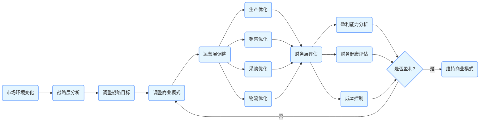

# 彼得林奇对公司商业模式适应性的长期跟踪研究

> 关键词：彼得林奇、公司商业模式、适应性、长期跟踪、投资分析

> 摘要：本文聚焦于彼得林奇对公司商业模式适应性的长期跟踪研究。深入剖析彼得林奇在投资实践中如何通过长期跟踪公司商业模式的适应性来评估公司价值和投资潜力。介绍相关背景知识，包括研究目的、预期读者等。详细阐述核心概念，如商业模式适应性的原理和架构，结合核心算法原理与具体操作步骤，运用 Python 代码进行展示。通过数学模型和公式对研究方法进行量化分析，并给出实际案例。探讨该研究在实际投资场景中的应用，推荐相关学习资源、开发工具框架以及论文著作。最后总结未来发展趋势与挑战，解答常见问题，并提供扩展阅读和参考资料，为投资者和研究人员提供全面深入的参考。

## 1. 背景介绍 
### 1.1 目的和范围
彼得林奇作为投资界的传奇人物，其投资理念和方法对众多投资者产生了深远影响。本研究的目的在于深入探究彼得林奇对公司商业模式适应性进行长期跟踪的具体方式、意义以及所带来的投资启示。研究范围涵盖彼得林奇在其投资生涯中所关注的各类公司，包括不同行业、不同规模的企业，分析他如何判断商业模式是否适应市场变化、行业竞争以及企业自身发展阶段等因素。

### 1.2 预期读者
本文预期读者主要包括投资者，无论是个人投资者还是专业投资机构人员，希望通过了解彼得林奇的研究方法来提升投资决策能力；企业管理者，可借鉴彼得林奇对商业模式适应性的评估思路来优化自身企业的商业模式；以及金融领域的研究人员，为相关学术研究提供参考。

### 1.3 文档结构概述
本文首先介绍研究的背景信息，包括目的、读者群体和文档结构。接着阐述核心概念，如商业模式适应性的定义、原理和架构，并给出相应的示意图和流程图。然后详细讲解核心算法原理和具体操作步骤，使用 Python 代码进行示例。通过数学模型和公式对研究方法进行量化分析，并举例说明。在项目实战部分，给出代码实际案例并进行详细解释。探讨该研究在实际投资场景中的应用。推荐相关的学习资源、开发工具框架和论文著作。最后总结未来发展趋势与挑战，解答常见问题，并提供扩展阅读和参考资料。

### 1.4 术语表
#### 1.4.1 核心术语定义
- **商业模式适应性**：指公司的商业模式能够随着市场环境、行业竞争、技术发展等外部因素以及企业自身资源、能力等内部因素的变化而进行有效调整和优化，以保持或提升企业的竞争力和盈利能力。
- **长期跟踪**：持续、系统地对公司的商业模式及其适应性进行观察、分析和评估，时间跨度通常为数年甚至更长。
- **投资潜力**：公司在未来具有实现价值增长、为投资者带来回报的可能性。

#### 1.4.2 相关概念解释
- **商业模式**：是企业为了创造价值、传递价值和获取价值而建立的一种逻辑架构和运营方式，包括客户细分、价值主张、渠道通路、客户关系、收入来源、核心资源、关键业务、重要合作和成本结构等要素。
- **市场环境**：包括宏观经济状况、政策法规、消费者需求、技术创新等因素，这些因素会对公司的商业模式产生影响。
- **行业竞争**：指同一行业内企业之间在市场份额、产品或服务质量、价格、创新能力等方面的竞争。

#### 1.4.3 缩略词列表
无

## 2. 核心概念与联系 
### 商业模式适应性的原理
商业模式适应性的核心原理在于企业需要不断地与外部环境和内部条件相匹配。从外部来看，市场需求的变化、技术的进步、竞争对手的策略调整等都会对企业的商业模式提出挑战。例如，随着互联网技术的发展，传统零售企业需要适应线上购物的趋势，调整其销售渠道和营销方式。从内部来看，企业自身的资源和能力也会发生变化，如资金的积累、人才的引进、技术的创新等，这些变化为商业模式的优化提供了机会。

### 商业模式适应性的架构
商业模式适应性的架构可以分为三个层次：战略层、运营层和财务层。

#### 战略层
战略层主要关注企业的长期发展方向和定位。企业需要根据市场趋势和自身优势，制定合适的战略目标，并调整商业模式以支持这些目标的实现。例如，一家科技公司可能会根据市场对人工智能技术的需求，将战略重点转向人工智能领域，并相应地调整其研发方向、产品定位和市场策略。

#### 运营层
运营层涉及企业的日常运营活动，包括生产、销售、采购、物流等环节。商业模式的适应性要求企业在这些环节上进行灵活调整，以提高运营效率和降低成本。例如，企业可以通过优化供应链管理，降低采购成本和库存成本；通过改进生产工艺，提高产品质量和生产效率。

#### 财务层
财务层主要关注企业的盈利能力和财务健康状况。商业模式的适应性需要确保企业在不同的市场环境下都能够实现盈利，并保持良好的财务状况。例如，企业可以通过多元化的收入来源，降低对单一产品或市场的依赖；通过合理的成本控制，提高利润率。

### 文本示意图
```plaintext
商业模式适应性架构
|-- 战略层
|   |-- 市场趋势分析
|   |-- 战略目标制定
|   |-- 商业模式调整
|-- 运营层
|   |-- 生产管理
|   |-- 销售管理
|   |-- 采购管理
|   |-- 物流管理
|-- 财务层
|   |-- 盈利能力分析
|   |-- 财务健康评估
|   |-- 成本控制
```

### Mermaid 流程图


## 3. 核心算法原理 & 具体操作步骤 
### 核心算法原理
彼得林奇在评估公司商业模式适应性时，可能会采用多维度指标综合评估的方法。以下是一个简化的算法原理，通过对市场适应性、运营效率和财务健康三个维度的指标进行量化评估，计算出公司商业模式的适应性得分。

设市场适应性指标为 $M$，运营效率指标为 $O$，财务健康指标为 $F$，则商业模式适应性得分 $S$ 可以通过以下公式计算：

$S = w_M \times M + w_O \times O + w_F \times F$

其中，$w_M$、$w_O$ 和 $w_F$ 分别为市场适应性、运营效率和财务健康指标的权重，且 $w_M + w_O + w_F = 1$。

### 具体操作步骤
#### 步骤 1：数据收集
收集公司的相关数据，包括市场份额、销售额增长率、毛利率、净利率、资产负债率等。这些数据可以从公司的财务报表、行业研究报告、市场调研机构等渠道获取。

#### 步骤 2：指标计算
根据收集到的数据，计算市场适应性、运营效率和财务健康指标。例如：
- 市场适应性指标 $M$ 可以通过市场份额增长率、销售额增长率等指标来衡量。
- 运营效率指标 $O$ 可以通过毛利率、存货周转率、应收账款周转率等指标来衡量。
- 财务健康指标 $F$ 可以通过净利率、资产负债率、流动比率等指标来衡量。

#### 步骤 3：权重确定
根据行业特点和公司发展阶段，确定市场适应性、运营效率和财务健康指标的权重。例如，对于处于快速发展阶段的公司，市场适应性指标的权重可以相对较高；对于成熟稳定的公司，财务健康指标的权重可以相对较高。

#### 步骤 4：得分计算
根据上述公式，计算公司商业模式的适应性得分 $S$。

#### 步骤 5：评估与决策
根据计算得到的适应性得分，对公司的商业模式进行评估。得分越高，说明商业模式的适应性越强。投资者可以根据评估结果，决定是否投资该公司。

### Python 代码示例
```python
# 数据收集（示例数据）
market_share_growth = 0.1
sales_growth = 0.15
gross_margin = 0.3
inventory_turnover = 5
accounts_receivable_turnover = 8
net_profit_margin = 0.1
asset_liability_ratio = 0.5
current_ratio = 2

# 指标计算
M = (market_share_growth + sales_growth) / 2
O = (gross_margin + inventory_turnover + accounts_receivable_turnover) / 3
F = (net_profit_margin + (1 - asset_liability_ratio) + current_ratio) / 3

# 权重确定
w_M = 0.3
w_O = 0.3
w_F = 0.4

# 得分计算
S = w_M * M + w_O * O + w_F * F

print(f"公司商业模式的适应性得分: {S}")
```

## 4. 数学模型和公式 & 详细讲解 & 举例说明 
### 数学模型
上述核心算法原理中已经给出了商业模式适应性得分的数学模型：

$S = w_M \times M + w_O \times O + w_F \times F$

其中，$S$ 表示商业模式适应性得分，$M$ 表示市场适应性指标，$O$ 表示运营效率指标，$F$ 表示财务健康指标，$w_M$、$w_O$ 和 $w_F$ 分别为相应指标的权重。

### 详细讲解
- **市场适应性指标 $M$**：反映了公司在市场中的竞争力和发展潜力。市场份额增长率和销售额增长率是衡量市场适应性的重要指标。市场份额增长率越高，说明公司在市场中的地位不断提升；销售额增长率越高，说明公司的业务规模在不断扩大。

- **运营效率指标 $O$**：体现了公司的运营管理水平和资源利用效率。毛利率反映了公司产品或服务的盈利能力；存货周转率和应收账款周转率反映了公司的资产管理效率。毛利率越高、存货周转率和应收账款周转率越快，说明公司的运营效率越高。

- **财务健康指标 $F$**：衡量了公司的盈利能力和财务稳定性。净利率反映了公司的最终盈利水平；资产负债率反映了公司的负债程度；流动比率反映了公司的短期偿债能力。净利率越高、资产负债率越低、流动比率越高，说明公司的财务健康状况越好。

- **权重 $w_M$、$w_O$ 和 $w_F$**：根据行业特点和公司发展阶段进行确定。不同行业和不同发展阶段的公司，对市场适应性、运营效率和财务健康的重视程度可能不同。例如，对于新兴行业的公司，市场适应性可能更为重要；对于传统行业的公司，财务健康可能更为关键。

### 举例说明
假设一家科技公司的市场份额增长率为 0.2，销售额增长率为 0.25，毛利率为 0.4，存货周转率为 6，应收账款周转率为 10，净利率为 0.15，资产负债率为 0.4，流动比率为 2.5。根据上述数学模型和公式，计算该公司商业模式的适应性得分。

#### 步骤 1：计算市场适应性指标 $M$
$M = (0.2 + 0.25) / 2 = 0.225$

#### 步骤 2：计算运营效率指标 $O$
$O = (0.4 + 6 + 10) / 3 = 5.467$

#### 步骤 3：计算财务健康指标 $F$
$F = (0.15 + (1 - 0.4) + 2.5) / 3 = 1.083$

#### 步骤 4：确定权重
假设根据行业特点和公司发展阶段，确定 $w_M = 0.3$，$w_O = 0.3$，$w_F = 0.4$。

#### 步骤 5：计算适应性得分 $S$
$S = 0.3 \times 0.225 + 0.3 \times 5.467 + 0.4 \times 1.083$
$S = 0.0675 + 1.6401 + 0.4332$
$S = 2.1408$

通过计算得到该公司商业模式的适应性得分较高，说明该公司的商业模式具有较强的适应性，具有较好的投资潜力。

## 5. 项目实战：代码实际案例和详细解释说明 
### 5.1  开发环境搭建
#### 操作系统
可以选择 Windows、Linux 或 macOS 操作系统。

#### Python 版本
建议使用 Python 3.7 及以上版本。

#### 开发工具
可以使用 PyCharm、Jupyter Notebook 等开发工具。

#### 安装必要的库
使用以下命令安装必要的库：
```bash
pip install pandas numpy matplotlib
```

### 5.2  源代码详细实现和代码解读
```python
import pandas as pd
import numpy as np
import matplotlib.pyplot as plt

# 模拟数据生成
np.random.seed(42)
num_companies = 10
data = {
    'market_share_growth': np.random.uniform(0.05, 0.2, num_companies),
    'sales_growth': np.random.uniform(0.08, 0.25, num_companies),
    'gross_margin': np.random.uniform(0.2, 0.4, num_companies),
    'inventory_turnover': np.random.uniform(3, 8, num_companies),
    'accounts_receivable_turnover': np.random.uniform(6, 12, num_companies),
    'net_profit_margin': np.random.uniform(0.05, 0.15, num_companies),
    'asset_liability_ratio': np.random.uniform(0.3, 0.6, num_companies),
    'current_ratio': np.random.uniform(1.5, 3, num_companies)
}
df = pd.DataFrame(data)

# 指标计算
df['M'] = (df['market_share_growth'] + df['sales_growth']) / 2
df['O'] = (df['gross_margin'] + df['inventory_turnover'] + df['accounts_receivable_turnover']) / 3
df['F'] = (df['net_profit_margin'] + (1 - df['asset_liability_ratio']) + df['current_ratio']) / 3

# 权重确定
w_M = 0.3
w_O = 0.3
w_F = 0.4

# 得分计算
df['S'] = w_M * df['M'] + w_O * df['O'] + w_F * df['F']

# 排序并显示结果
df_sorted = df.sort_values(by='S', ascending=False)
print(df_sorted)

# 可视化
plt.figure(figsize=(10, 6))
plt.bar(df_sorted.index, df_sorted['S'])
plt.xlabel('Company Index')
plt.ylabel('Business Model Adaptability Score')
plt.title('Business Model Adaptability Scores of Companies')
plt.show()
```

### 代码解读与分析
#### 数据生成
使用 `numpy` 库生成模拟数据，包括市场份额增长率、销售额增长率、毛利率、存货周转率等指标。将这些数据存储在 `pandas` 的 `DataFrame` 中。

#### 指标计算
根据前面介绍的方法，计算市场适应性指标 $M$、运营效率指标 $O$ 和财务健康指标 $F$，并将结果添加到 `DataFrame` 中。

#### 权重确定
设定市场适应性、运营效率和财务健康指标的权重分别为 0.3、0.3 和 0.4。

#### 得分计算
根据数学模型计算每个公司的商业模式适应性得分 $S$，并将结果添加到 `DataFrame` 中。

#### 排序与显示
对 `DataFrame` 按照适应性得分进行降序排序，并显示排序后的结果。

#### 可视化
使用 `matplotlib` 库绘制柱状图，直观展示每个公司的商业模式适应性得分。

通过这个实际案例，我们可以清晰地看到如何使用 Python 代码实现对公司商业模式适应性的评估，并对结果进行可视化展示。

## 6. 实际应用场景 
### 投资决策
投资者可以运用彼得林奇对公司商业模式适应性的长期跟踪研究方法，评估不同公司的投资潜力。通过分析公司的市场适应性、运营效率和财务健康状况，计算商业模式适应性得分，筛选出得分较高的公司进行投资。例如，在选择股票时，投资者可以优先考虑商业模式适应性强的公司，因为这些公司更有可能在市场竞争中取得优势，实现价值增长。

### 企业战略规划
企业管理者可以借鉴该研究方法，对自身企业的商业模式进行评估和优化。通过长期跟踪商业模式的适应性，及时发现问题并进行调整。例如，当市场环境发生变化时，企业可以根据市场适应性指标的变化，调整战略目标和商业模式，以适应新的市场需求。

### 行业分析
研究人员可以运用该方法对不同行业的公司进行比较分析，了解行业内公司商业模式的适应性差异。通过分析行业内领先企业的商业模式，为其他企业提供参考和借鉴。例如，在研究新兴行业时，可以关注那些商业模式适应性强的企业，总结其成功经验，为行业的发展提供指导。

## 7. 工具和资源推荐
### 7.1 学习资源推荐
#### 7.1.1 书籍推荐
- 《彼得·林奇的成功投资》：彼得林奇的经典著作，详细介绍了他的投资理念和方法，包括如何选择股票、分析公司等。
- 《商业模式新生代》：介绍了商业模式的基本概念、设计方法和创新思路，对于理解商业模式的本质和构建具有指导意义。
- 《财务报表分析与证券定价》：讲解了如何通过财务报表分析评估公司的价值和投资潜力，是投资者和财务分析人员的重要参考书籍。

#### 7.1.2 在线课程
- Coursera 上的“投资学原理”课程：由知名教授授课，系统介绍投资学的基本原理和方法，包括股票投资、债券投资等。
- edX 上的“商业模式创新”课程：讲解商业模式创新的理论和实践，帮助学员掌握商业模式设计和优化的方法。
- 网易云课堂上的“财务报表分析实战”课程：通过实际案例，详细讲解财务报表分析的方法和技巧，提高学员的财务分析能力。

#### 7.1.3 技术博客和网站
- Seeking Alpha：提供专业的金融分析和投资建议，有大量关于公司分析和投资策略的文章。
- ValueWalk：专注于价值投资领域，分享知名投资者的观点和研究成果。
- 雪球网：国内知名的投资社区，提供股票、基金等投资产品的分析和讨论，有很多投资者分享自己的投资经验和见解。

### 7.2 开发工具框架推荐
#### 7.2.1 IDE和编辑器
- PyCharm：专业的 Python 集成开发环境，提供丰富的代码编辑、调试和项目管理功能。
- Jupyter Notebook：交互式的编程环境，适合进行数据分析和可视化，方便代码的编写和展示。
- Visual Studio Code：轻量级的代码编辑器，支持多种编程语言，有丰富的插件扩展功能。

#### 7.2.2 调试和性能分析工具
- Py-Spy：用于分析 Python 代码的性能，找出性能瓶颈和耗时函数。
- PDB：Python 内置的调试器，可用于调试 Python 代码，定位和解决问题。
- cProfile：Python 标准库中的性能分析工具，可用于分析代码的运行时间和函数调用次数。

#### 7.2.3 相关框架和库
- Pandas：强大的数据处理和分析库，提供了高效的数据结构和数据操作方法，适合处理和分析金融数据。
- Numpy：用于科学计算的基础库，提供了高效的数组操作和数学函数，可用于数据处理和模型计算。
- Matplotlib：常用的数据可视化库，可用于绘制各种图表和图形，直观展示数据和分析结果。

### 7.3 相关论文著作推荐
#### 7.3.1 经典论文
- “The Theory of the Growth of the Firm” by Edith Penrose：提出了企业成长理论，探讨了企业如何通过内部资源的积累和利用实现成长，对理解企业商业模式的发展和适应性具有重要意义。
- “Competitive Strategy: Techniques for Analyzing Industries and Competitors” by Michael Porter：介绍了波特的竞争战略理论，包括五种竞争力模型和三种基本竞争战略，为企业分析行业竞争环境和制定竞争策略提供了理论基础。
- “Business Model Innovation: Creating Value in Times of Change” by Mark W. Johnson, Clayton M. Christensen, and Henning Kagermann：探讨了商业模式创新的重要性和方法，分析了不同行业的商业模式创新案例。

#### 7.3.2 最新研究成果
- 关注顶级学术期刊如《Journal of Financial Economics》、《Management Science》等上发表的关于公司商业模式、投资分析等方面的研究论文，了解最新的研究动态和成果。
- 参加金融和管理领域的学术会议，如美国金融协会年会（AFA）、战略管理学会年会（SMS）等，获取最新的研究报告和前沿观点。

#### 7.3.3 应用案例分析
- 阅读知名投资机构的研究报告和案例分析，如高盛、摩根士丹利等发布的关于公司分析和投资策略的报告，学习他们的分析方法和思路。
- 研究成功企业的商业模式转型和创新案例，如亚马逊、阿里巴巴等，了解他们如何通过适应市场变化和技术发展，不断优化商业模式，实现持续增长。

## 8. 总结：未来发展趋势与挑战
### 未来发展趋势
- **数字化转型加速**：随着信息技术的快速发展，越来越多的公司将加快数字化转型的步伐，通过应用大数据、人工智能、区块链等技术，优化商业模式，提高运营效率和竞争力。例如，传统零售企业将加强线上渠道建设，实现线上线下融合发展；金融机构将利用人工智能技术进行风险评估和客户服务。
- **可持续发展成为关键**：消费者和投资者对企业的社会责任和可持续发展越来越关注，公司的商业模式需要更加注重环境保护、社会公平和治理等方面。例如，一些企业将推出绿色产品和服务，采用可持续的供应链管理模式，以满足市场需求和社会期望。
- **跨界融合加剧**：不同行业之间的界限将越来越模糊，跨界融合将成为未来商业模式创新的重要趋势。例如，科技公司与金融机构、医疗企业与互联网平台等之间的合作将越来越频繁，创造出全新的商业模式和商业机会。

### 挑战
- **技术变革带来的不确定性**：快速的技术变革使得公司的商业模式面临着更大的不确定性。新技术的出现可能会颠覆现有的商业模式，公司需要不断地学习和创新，以适应技术变革的挑战。例如，人工智能技术的发展可能会对一些传统行业的就业结构和商业模式产生重大影响。
- **市场竞争加剧**：随着全球化和数字化的发展，市场竞争将更加激烈。公司需要不断地提升自身的核心竞争力，优化商业模式，以在激烈的市场竞争中脱颖而出。例如，在电商领域，竞争非常激烈，企业需要不断地降低成本、提高服务质量、创新营销方式，才能保持市场份额。
- **数据安全和隐私问题**：在数字化时代，公司需要处理大量的客户数据，数据安全和隐私问题成为了重要的挑战。公司需要加强数据安全管理，保护客户的隐私，避免数据泄露和滥用。例如，一些互联网企业因为数据安全问题而面临着法律诉讼和声誉损失。

## 9. 附录：常见问题与解答
### 问题 1：如何确定市场适应性、运营效率和财务健康指标的权重？
答：权重的确定需要根据行业特点和公司发展阶段进行综合考虑。一般来说，可以参考行业内的平均水平和优秀企业的经验，结合公司自身的战略目标和发展重点，进行合理的调整。例如，对于新兴行业的公司，市场适应性指标的权重可以相对较高；对于成熟稳定的公司，财务健康指标的权重可以相对较高。

### 问题 2：除了上述提到的指标，还有哪些指标可以用于评估公司商业模式的适应性？
答：除了市场适应性、运营效率和财务健康指标外，还可以考虑创新能力、客户满意度、员工满意度等指标。创新能力反映了公司的研发投入和创新成果，对于公司的长期发展至关重要；客户满意度和员工满意度则反映了公司的客户关系管理和人力资源管理水平，对公司的运营和发展也有重要影响。

### 问题 3：如何进行长期跟踪研究？
答：进行长期跟踪研究需要建立系统的跟踪机制。可以定期收集公司的相关数据，包括财务报表、市场调研数据等，对公司的商业模式进行持续的评估和分析。同时，关注行业动态和市场变化，及时发现公司商业模式面临的挑战和机遇。可以通过阅读行业报告、参加行业会议、与公司管理层沟通等方式，获取最新的信息。

### 问题 4：该研究方法是否适用于所有行业的公司？
答：该研究方法具有一定的通用性，但不同行业的公司可能具有不同的特点和需求，需要进行适当的调整和优化。例如，对于金融行业的公司，可能需要更加关注风险管理和合规性指标；对于制造业的公司，可能需要更加关注生产效率和质量控制指标。在应用该研究方法时，需要结合行业特点和公司实际情况，选择合适的指标和权重。

## 10. 扩展阅读 & 参考资料
### 扩展阅读
- 《聪明的投资者》：本杰明·格雷厄姆的经典著作，介绍了价值投资的理念和方法，对投资者具有重要的启示作用。
- 《创新者的窘境》：克莱顿·克里斯坦森的著作，探讨了创新对企业的影响和挑战，分析了为什么一些领先企业会在技术变革中失败。
- 《从零到一》：彼得·蒂尔的著作，讲述了如何从无到有创建一家成功的企业，强调了创新和差异化的重要性。

### 参考资料
- Lynch, Peter. One Up on Wall Street: How to Use What You Already Know to Make Money in the Market. Simon & Schuster, 1989.
- Osterwalder, Alexander, and Yves Pigneur. Business Model Generation: A Handbook for Visionaries, Game Changers, and Challengers. Wiley, 2010.
- Penman, Stephen H. Financial Statement Analysis and Security Valuation. McGraw-Hill Education, 2019.

作者：AI天才研究院/AI Genius Institute & 禅与计算机程序设计艺术 /Zen And The Art of Computer Programming