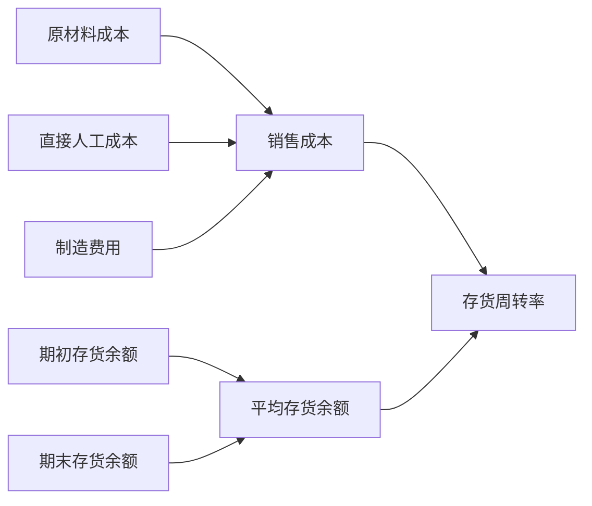

# 彼得林奇对公司存货周转率变化的深度分析

> 关键词：彼得林奇、存货周转率、公司分析、财务指标、投资决策

> 摘要：本文深入探讨了彼得林奇对公司存货周转率变化的分析方法与理念。存货周转率是衡量公司运营效率的重要财务指标，彼得林奇通过对其变化的研究，为投资者评估公司经营状况和潜在投资价值提供了独特视角。文章将介绍存货周转率的核心概念、计算原理，结合数学模型和实际案例，详细阐述彼得林奇如何运用该指标进行公司分析，探讨其在不同行业的应用场景，同时推荐相关学习资源和工具，最后总结未来发展趋势与挑战，解答常见问题，为投资者和财务分析人员提供全面而深入的参考。

## 1. 背景介绍 
### 1.1 目的和范围
本文章的主要目的是深入剖析彼得林奇对公司存货周转率变化的分析方法及其重要性。彼得林奇作为投资界的传奇人物，他的投资理念和方法对众多投资者产生了深远影响。存货周转率作为公司财务分析中的关键指标之一，其变化能够反映公司的经营效率、市场需求和供应链管理等多方面的情况。通过研究彼得林奇对该指标的运用，我们可以更好地理解如何利用财务数据评估公司的投资价值，为投资者和财务分析人员提供有价值的参考。本文的范围涵盖了存货周转率的基本概念、计算方法、彼得林奇的分析思路、实际应用案例以及相关的学习资源和工具推荐等方面。

### 1.2 预期读者
本文预期读者包括对投资分析、财务分析感兴趣的个人投资者、金融专业学生、财务分析师以及从事企业管理和战略规划的专业人士。对于个人投资者来说，了解彼得林奇对存货周转率的分析方法可以帮助他们更准确地评估公司的投资价值，做出更明智的投资决策；金融专业学生可以通过本文深入学习财务分析的实际应用，提高专业素养；财务分析师可以借鉴彼得林奇的思路，丰富自己的分析工具和方法；企业管理者可以从存货周转率的角度审视公司的运营状况，优化供应链管理和库存策略。

### 1.3 文档结构概述
本文将按照以下结构进行组织：首先介绍存货周转率的核心概念和相关联系，包括其定义、重要性以及与其他财务指标的关系；接着详细阐述存货周转率的核心算法原理和具体操作步骤，通过Python代码示例进行说明；然后介绍相关的数学模型和公式，并结合实际案例进行详细讲解；之后通过项目实战，展示如何在实际中运用存货周转率进行公司分析，包括开发环境搭建、源代码实现和代码解读；再探讨存货周转率在不同行业的实际应用场景；推荐相关的学习资源、开发工具框架和论文著作；最后总结未来发展趋势与挑战，解答常见问题，并提供扩展阅读和参考资料。

### 1.4 术语表
#### 1.4.1 核心术语定义
- **存货周转率（Inventory Turnover Ratio）**：是衡量企业销售能力和存货管理水平的指标，它反映了企业在一定时期内存货周转的次数。计算公式为：存货周转率 = 销售成本 / 平均存货余额。
- **销售成本（Cost of Goods Sold，COGS）**：指企业在销售商品或提供劳务过程中所发生的直接成本，包括原材料、直接人工和制造费用等。
- **平均存货余额（Average Inventory）**：是指企业在一定时期内期初存货余额和期末存货余额的平均值，计算公式为：平均存货余额 = （期初存货余额 + 期末存货余额） / 2。

#### 1.4.2 相关概念解释
- **存货管理**：是企业对存货的采购、存储、销售等环节进行的计划、组织、控制和协调活动，旨在确保存货的合理储备，降低存货成本，提高企业的经济效益。
- **供应链管理**：是指对供应链中的物流、信息流和资金流进行计划、组织、协调和控制的过程，以实现供应链的高效运作和企业的竞争优势。存货周转率是衡量供应链管理效率的重要指标之一。
- **投资价值**：是指资产对于具有明确投资目标的特定投资者或某一类投资者所具有的价值。在评估公司的投资价值时，存货周转率等财务指标可以提供重要的参考依据。

#### 1.4.3 缩略词列表
- **COGS**：Cost of Goods Sold，销售成本
- **ROE**：Return on Equity，净资产收益率
- **PE**：Price-to-Earnings Ratio，市盈率

## 2. 核心概念与联系 

### 2.1 存货周转率的定义和重要性
存货周转率是企业一定时期内销售成本与平均存货余额的比率，它衡量了企业存货周转的速度。存货周转率越高，表明企业存货周转速度越快，存货占用水平越低，流动性越强，存货转化为现金或应收账款的速度就越快，这样会增强企业的短期偿债能力及获利能力。反之，存货周转率越低，说明企业存货积压，销售不畅，可能存在产品滞销、库存管理不善等问题，会影响企业的资金周转和盈利能力。

### 2.2 存货周转率与其他财务指标的关系
存货周转率与其他财务指标密切相关，共同反映企业的经营状况和财务健康程度。例如，它与毛利率、净利率等盈利能力指标相关。如果存货周转率较高，说明企业能够快速销售产品，减少存货持有成本，从而有可能提高毛利率和净利率。同时，存货周转率也与应收账款周转率、总资产周转率等营运能力指标相互影响。较高的存货周转率意味着企业能够更快地将存货转化为销售收入，进而加快应收账款的回收速度，提高总资产的周转效率。

### 2.3 核心概念原理和架构的文本示意图
```plaintext
存货周转率
|
|-- 销售成本
|   |-- 原材料成本
|   |-- 直接人工成本
|   |-- 制造费用
|
|-- 平均存货余额
|   |-- 期初存货余额
|   |-- 期末存货余额
```

### 2.4 Mermaid 流程图


## 3. 核心算法原理 & 具体操作步骤 

### 3.1 存货周转率的计算原理
存货周转率的计算公式为：

$$存货周转率 = \frac{销售成本}{平均存货余额}$$

其中，平均存货余额的计算公式为：

$$平均存货余额 = \frac{期初存货余额 + 期末存货余额}{2}$$

### 3.2 Python 源代码实现
```python
def inventory_turnover_ratio(cogs, beginning_inventory, ending_inventory):
    """
    计算存货周转率
    :param cogs: 销售成本
    :param beginning_inventory: 期初存货余额
    :param ending_inventory: 期末存货余额
    :return: 存货周转率
    """
    average_inventory = (beginning_inventory + ending_inventory) / 2
    turnover_ratio = cogs / average_inventory
    return turnover_ratio

# 示例数据
cogs = 1000000
beginning_inventory = 200000
ending_inventory = 300000

# 计算存货周转率
turnover = inventory_turnover_ratio(cogs, beginning_inventory, ending_inventory)
print(f"存货周转率: {turnover}")
```

### 3.3 代码解释
上述代码定义了一个名为 `inventory_turnover_ratio` 的函数，该函数接受三个参数：销售成本 `cogs`、期初存货余额 `beginning_inventory` 和期末存货余额 `ending_inventory`。在函数内部，首先计算平均存货余额，然后用销售成本除以平均存货余额得到存货周转率，并将结果返回。最后，使用示例数据调用该函数并打印计算结果。

### 3.4 具体操作步骤
1. 收集数据：从企业的财务报表中获取销售成本、期初存货余额和期末存货余额的数据。
2. 计算平均存货余额：根据公式计算平均存货余额。
3. 计算存货周转率：用销售成本除以平均存货余额得到存货周转率。
4. 分析结果：将计算得到的存货周转率与同行业其他企业或企业自身的历史数据进行比较，分析企业的存货管理水平和经营状况。

## 4. 数学模型和公式 & 详细讲解 & 举例说明 

### 4.1 数学模型和公式
存货周转率的数学模型主要基于上述计算公式：

$$存货周转率 = \frac{销售成本}{平均存货余额}$$

$$平均存货余额 = \frac{期初存货余额 + 期末存货余额}{2}$$

此外，还可以通过存货周转天数来进一步分析存货的周转情况，存货周转天数的计算公式为：

$$存货周转天数 = \frac{365}{存货周转率}$$

存货周转天数反映了企业存货周转一次所需的天数，天数越短，说明存货周转速度越快。

### 4.2 详细讲解
存货周转率的计算公式中，销售成本是企业在销售商品或提供劳务过程中所发生的直接成本，它反映了企业为了实现销售收入所付出的成本。平均存货余额是企业在一定时期内存货的平均水平，它考虑了期初和期末存货余额的变化。通过将销售成本与平均存货余额相除，可以得到企业在该时期内存货周转的次数。存货周转天数则是将一年的天数（通常按 365 天计算）除以存货周转率，得到存货周转一次所需的天数。

### 4.3 举例说明
假设某企业在 2023 年的销售成本为 500 万元，年初存货余额为 100 万元，年末存货余额为 150 万元。

首先，计算平均存货余额：

$$平均存货余额 = \frac{100 + 150}{2} = 125（万元）$$

然后，计算存货周转率：

$$存货周转率 = \frac{500}{125} = 4（次）$$

最后，计算存货周转天数：

$$存货周转天数 = \frac{365}{4} \approx 91.25（天）$$

这意味着该企业在 2023 年存货周转了 4 次，平均每次周转需要约 91.25 天。如果同行业的平均存货周转天数为 70 天，那么该企业的存货周转速度相对较慢，可能存在存货积压的问题，需要进一步分析原因并采取相应的措施来提高存货管理效率。

## 5. 项目实战：代码实际案例和详细解释说明 

### 5.1  开发环境搭建
为了实现存货周转率的计算和分析，我们可以使用 Python 编程语言，并结合一些常用的数据分析库，如 Pandas 和 NumPy。以下是搭建开发环境的步骤：

1. **安装 Python**：从 Python 官方网站（https://www.python.org/downloads/）下载并安装适合你操作系统的 Python 版本。建议安装 Python 3.7 及以上版本。
2. **安装 Pandas 和 NumPy**：打开命令行工具，运行以下命令安装 Pandas 和 NumPy：
```sh
pip install pandas numpy
```

### 5.2  源代码详细实现和代码解读
以下是一个使用 Pandas 读取财务数据文件，并计算存货周转率和存货周转天数的示例代码：

```python
import pandas as pd

def calculate_inventory_metrics(data):
    """
    计算存货周转率和存货周转天数
    :param data: 包含销售成本、期初存货余额和期末存货余额的数据 DataFrame
    :return: 包含存货周转率和存货周转天数的 DataFrame
    """
    data['平均存货余额'] = (data['期初存货余额'] + data['期末存货余额']) / 2
    data['存货周转率'] = data['销售成本'] / data['平均存货余额']
    data['存货周转天数'] = 365 / data['存货周转率']
    return data

# 读取财务数据文件
file_path = 'financial_data.csv'
data = pd.read_csv(file_path)

# 计算存货周转率和存货周转天数
result = calculate_inventory_metrics(data)

# 打印结果
print(result)
```

### 5.3  代码解读与分析
1. **导入必要的库**：导入 Pandas 库，用于数据处理和分析。
2. **定义计算函数**：定义 `calculate_inventory_metrics` 函数，该函数接受一个包含销售成本、期初存货余额和期末存货余额的数据 DataFrame 作为输入，计算平均存货余额、存货周转率和存货周转天数，并将结果添加到输入的 DataFrame 中返回。
3. **读取财务数据文件**：使用 `pd.read_csv` 函数读取包含财务数据的 CSV 文件，并将数据存储在 `data` 变量中。
4. **计算存货指标**：调用 `calculate_inventory_metrics` 函数，计算存货周转率和存货周转天数，并将结果存储在 `result` 变量中。
5. **打印结果**：使用 `print` 函数打印计算结果。

通过以上代码，我们可以方便地计算多个企业或多个时期的存货周转率和存货周转天数，并进行进一步的分析和比较。

## 6. 实际应用场景 
### 6.1 企业内部管理
在企业内部管理中，存货周转率是评估企业运营效率和库存管理水平的重要指标。企业管理者可以通过分析存货周转率的变化，及时发现存货管理中存在的问题，如存货积压、缺货等，并采取相应的措施进行调整。例如，如果存货周转率下降，可能意味着企业的产品销售不畅或库存管理不善，管理者可以考虑优化销售策略、加强库存控制等措施来提高存货周转率。

### 6.2 投资者决策
对于投资者来说，存货周转率是评估企业投资价值的重要参考指标之一。投资者可以通过比较不同企业的存货周转率，筛选出经营效率较高、存货管理较好的企业进行投资。同时，投资者还可以关注企业存货周转率的变化趋势，如果企业的存货周转率持续上升，说明企业的经营状况良好，具有较好的发展潜力；反之，如果存货周转率持续下降，可能意味着企业面临经营困境，投资风险较大。

### 6.3 行业分析
在行业分析中，存货周转率可以用于比较不同行业的经营特点和竞争态势。不同行业的存货周转率存在较大差异，例如，零售业的存货周转率通常较高，因为其产品销售速度较快；而制造业的存货周转率相对较低，因为其生产周期较长。通过分析行业平均存货周转率和各企业的存货周转率，可以了解行业的整体运营效率和企业在行业中的竞争力。

### 6.4 供应链管理
存货周转率也是供应链管理中的重要指标之一。供应链上的各个环节，如供应商、制造商、分销商和零售商，都需要关注存货周转率，以确保供应链的高效运作。通过优化供应链流程、加强供应链合作伙伴之间的协作，可以提高整个供应链的存货周转率，降低存货成本，提高企业的经济效益。

## 7. 工具和资源推荐
### 7.1 学习资源推荐
#### 7.1.1 书籍推荐
- 《彼得林奇的成功投资》：彼得林奇的经典著作，详细介绍了他的投资理念和方法，包括如何通过分析财务指标评估企业的投资价值。
- 《财务报表分析》：全面介绍了财务报表分析的方法和技巧，对于理解存货周转率等财务指标的含义和应用具有重要的参考价值。
- 《手把手教你读财报》：以通俗易懂的方式讲解了财务报表的阅读和分析方法，适合初学者学习。

#### 7.1.2 在线课程
- Coursera 上的“Financial Markets”课程：由耶鲁大学教授罗伯特·席勒（Robert Shiller）授课，介绍了金融市场的基本原理和投资分析方法。
- edX 上的“Financial Accounting”课程：由宾夕法尼亚大学沃顿商学院教授授课，系统地讲解了财务会计的基本概念和方法。
- 网易云课堂上的“财务报表分析实战教程”：结合实际案例，详细讲解了财务报表分析的方法和技巧。

#### 7.1.3 技术博客和网站
- Seeking Alpha：提供专业的金融分析和投资建议，包括对企业财务指标的分析和解读。
- Motley Fool：专注于股票投资和财经新闻，提供丰富的投资分析和研究报告。
- 雪球网：国内知名的投资社区，用户可以在上面分享投资经验、讨论股票和分析企业财务数据。

### 7.2 开发工具框架推荐
#### 7.2.1 IDE和编辑器
- PyCharm：一款专业的 Python 集成开发环境，具有强大的代码编辑、调试和项目管理功能。
- Jupyter Notebook：一种交互式的开发环境，适合进行数据分析和可视化，支持 Python、R 等多种编程语言。
- Visual Studio Code：一款轻量级的代码编辑器，支持多种编程语言和插件扩展，可用于 Python 开发。

#### 7.2.2 调试和性能分析工具
- PySnooper：一个简单易用的 Python 调试工具，可以自动记录函数的执行过程和变量的值，方便调试代码。
- cProfile：Python 内置的性能分析工具，可以统计程序中各个函数的执行时间和调用次数，帮助优化代码性能。
- Memory Profiler：用于分析 Python 程序的内存使用情况，找出内存泄漏和高内存消耗的问题。

#### 7.2.3 相关框架和库
- Pandas：一个强大的数据处理和分析库，提供了丰富的数据结构和函数，用于读取、处理和分析各种类型的数据。
- NumPy：Python 的数值计算库，提供了高效的多维数组对象和各种数学函数，用于科学计算和数据分析。
- Matplotlib：一个用于数据可视化的 Python 库，可以绘制各种类型的图表，如折线图、柱状图、散点图等。

### 7.3 相关论文著作推荐
#### 7.3.1 经典论文
- “Inventory Management and Production Planning and Scheduling” by E. A. Silver, D. F. Pyke, and R. Peterson：全面介绍了库存管理和生产计划调度的理论和方法，对于理解存货周转率的相关概念和应用具有重要的参考价值。
- “The Economic Order Quantity Model: A Comprehensive Review” by H. C. Naddor：对经济订货量模型进行了全面的回顾和分析，该模型是库存管理中的经典模型之一，与存货周转率密切相关。

#### 7.3.2 最新研究成果
- 近年来，随着大数据、人工智能等技术的发展，一些学者开始研究如何利用这些技术提高存货管理效率和预测准确性。例如，“Big Data Analytics for Inventory Management: A Systematic Literature Review” by R. Choudhary, S. Shankar, and S. K. Tiwari 对大数据分析在库存管理中的应用进行了系统的文献综述。
- 另外，一些研究关注了供应链协同对存货周转率的影响，如“Supply Chain Collaboration and Inventory Turnover: A Meta - analysis” by X. Li, Z. Zhao, and X. Liu 通过元分析方法研究了供应链协同与存货周转率之间的关系。

#### 7.3.3 应用案例分析
- 一些商业杂志和研究报告中会有关于企业存货管理和存货周转率分析的应用案例，例如《哈佛商业评论》上的一些文章会介绍知名企业如何通过优化存货管理提高企业竞争力。这些案例可以帮助我们更好地理解存货周转率在实际企业中的应用和重要性。

## 8. 总结：未来发展趋势与挑战
### 8.1 未来发展趋势
- **技术驱动的存货管理**：随着物联网、大数据、人工智能等技术的不断发展，企业将能够实现对存货的实时监控和精准预测。例如，通过物联网传感器可以实时获取存货的位置、数量、状态等信息，利用大数据分析和人工智能算法可以预测市场需求和存货需求，从而优化存货管理策略，提高存货周转率。
- **供应链协同的加强**：未来企业将更加注重与供应链合作伙伴的协同合作，实现信息共享、资源优化配置和流程协同。通过供应链协同，企业可以减少库存积压、缩短供应链周期，提高整个供应链的存货周转率。
- **绿色存货管理**：随着环保意识的增强，企业将越来越重视绿色存货管理。例如，减少包装材料的使用、优化物流配送路线以降低能源消耗等，这些措施不仅有助于保护环境，还可以降低企业的运营成本，提高存货周转率。

### 8.2 挑战
- **数据质量和安全问题**：在技术驱动的存货管理中，数据的质量和安全是关键。企业需要确保收集到的数据准确、完整、及时，同时要采取有效的措施保护数据的安全，防止数据泄露和滥用。
- **供应链复杂性**：随着全球经济一体化的发展，企业的供应链越来越复杂，涉及到多个国家和地区的供应商、制造商、分销商和零售商。供应链的复杂性增加了存货管理的难度，企业需要应对供应链中断、物流延迟等风险，确保存货的及时供应和周转。
- **人才短缺**：实现技术驱动的存货管理和供应链协同需要具备相关技术和管理知识的人才。目前，市场上这类人才相对短缺，企业需要加强人才培养和引进，以满足业务发展的需求。

## 9. 附录：常见问题与解答
### 9.1 存货周转率是否越高越好？
一般来说，存货周转率越高，说明企业的存货周转速度越快，存货管理效率越高。但存货周转率并不是越高越好，过高的存货周转率可能意味着企业存在缺货风险，影响销售和客户满意度。因此，企业需要在存货周转率和缺货成本之间找到一个平衡点。

### 9.2 如何提高存货周转率？
提高存货周转率可以从以下几个方面入手：
- 优化销售策略，提高产品销售速度。
- 加强库存管理，合理控制存货水平，避免存货积压。
- 优化供应链流程，缩短采购和生产周期，提高供应链响应速度。
- 加强与供应商的合作，实现供应商管理库存（VMI）等先进的库存管理模式。

### 9.3 不同行业的存货周转率有何差异？
不同行业的存货周转率存在较大差异，主要受行业特点、产品特性和市场需求等因素的影响。例如，零售业的存货周转率通常较高，因为其产品销售速度较快，库存周转周期较短；而制造业的存货周转率相对较低，因为其生产周期较长，需要储备一定的原材料和在产品。

### 9.4 存货周转率与毛利率之间有什么关系？
存货周转率与毛利率之间存在一定的关系。一般来说，存货周转率较高的企业，能够更快地将存货转化为销售收入，减少存货持有成本，从而有可能提高毛利率。但这并不是绝对的，毛利率还受到产品定价、成本控制等多种因素的影响。

## 10. 扩展阅读 & 参考资料
### 10.1 扩展阅读
- 《聪明的投资者》：本杰明·格雷厄姆的经典著作，介绍了价值投资的理念和方法，对于理解投资分析和决策具有重要的参考价值。
- 《金融炼金术》：乔治·索罗斯的著作，阐述了他的投资哲学和市场理论，对投资者的思维方式和投资策略有很大的启发。
- 《财富自由之路》：李笑来的书籍，分享了个人成长和财富积累的经验和方法，适合想要实现财务自由的读者阅读。

### 10.2 参考资料
- 企业的财务报表：包括资产负债表、利润表和现金流量表等，是获取存货周转率相关数据的重要来源。
- 行业研究报告：可以了解行业的发展趋势、竞争态势和平均存货周转率等信息。
- 相关学术期刊和会议论文：如《管理科学学报》、《系统工程理论与实践》等，提供了关于存货管理和财务分析的最新研究成果。

作者：AI天才研究院/AI Genius Institute & 禅与计算机程序设计艺术 /Zen And The Art of Computer Programming