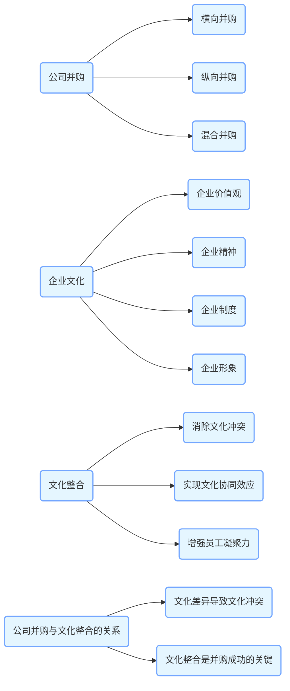

# 彼得林奇对公司并购后文化整合成功因素的案例研究

> 关键词：彼得林奇、公司并购、文化整合、成功因素、案例研究

> 摘要：本文聚焦于彼得林奇视角下公司并购后文化整合的成功因素，通过深入的案例研究来剖析其中的关键要点。公司并购是企业发展中的重要战略举措，但并购后的文化整合往往是决定成败的关键环节。彼得林奇作为投资界的传奇人物，其对公司的深刻洞察能为我们研究文化整合提供独特的视角。文章首先介绍研究的背景，包括目的、范围、预期读者等内容，接着阐述公司并购与文化整合的核心概念及联系，详细讲解相关算法原理与操作步骤，构建数学模型并举例说明，通过实际项目案例进行代码实现与分析，探讨实际应用场景，推荐相关工具和资源，最后总结未来发展趋势与挑战，解答常见问题并提供扩展阅读与参考资料。

## 1. 背景介绍 
### 1.1 目的和范围
本研究的主要目的是借助彼得林奇的投资理念和分析方法，深入探究公司并购后文化整合的成功因素。通过对多个实际案例的研究，总结出具有普遍适用性的规律和策略，为企业在并购过程中实现有效的文化整合提供参考。研究范围涵盖了不同行业、不同规模的公司并购案例，分析文化整合在财务绩效、员工满意度、企业战略执行等方面的影响。

### 1.2 预期读者
本文预期读者包括企业管理者、投资者、并购顾问、学术研究人员等。企业管理者可以从案例中获取文化整合的实践经验，以指导自身企业的并购活动；投资者可以通过了解文化整合的成功因素，更好地评估并购企业的投资价值；并购顾问能够借鉴案例中的方法和策略，为客户提供更专业的服务；学术研究人员则可以将本文作为进一步研究的参考资料，推动相关领域的学术发展。

### 1.3 文档结构概述
本文将按照以下结构展开：首先介绍核心概念与联系，明确公司并购和文化整合的定义、原理及两者之间的关系；接着阐述核心算法原理和具体操作步骤，运用 Python 代码进行详细说明；然后构建数学模型和公式，通过具体例子进行讲解；再通过实际项目案例，展示代码实现过程并进行详细解读；之后探讨文化整合的实际应用场景；推荐相关的工具和资源，包括学习资源、开发工具框架和相关论文著作；最后总结未来发展趋势与挑战，解答常见问题并提供扩展阅读与参考资料。

### 1.4 术语表
#### 1.4.1 核心术语定义
- **公司并购**：指一家公司通过购买另一家公司的股权或资产，从而获得对该公司的控制权或实现两家公司的合并。
- **文化整合**：在公司并购过程中，将两个或多个不同的企业文化融合为一个统一的、适应新企业发展的文化体系的过程。
- **文化差异**：不同企业在价值观、信仰、行为准则、管理风格等方面存在的差异。
- **文化协同效应**：通过文化整合，使不同企业文化相互补充、相互促进，从而产生比单个企业文化更大的价值创造能力。

#### 1.4.2 相关概念解释
- **文化冲突**：在文化整合过程中，由于文化差异导致的不同文化之间的矛盾和对抗。文化冲突可能表现为员工之间的沟通障碍、工作效率低下、团队凝聚力下降等问题。
- **文化融合模式**：常见的文化融合模式包括吸纳式、融合式、分隔式和破坏式。吸纳式是指一方企业文化完全取代另一方企业文化；融合式是指两种企业文化相互渗透、相互融合，形成一种新的企业文化；分隔式是指两种企业文化保持相对独立，各自发挥作用；破坏式是指两种企业文化在整合过程中相互冲突，导致企业文化的破坏和企业绩效的下降。
- **文化整合策略**：为实现文化整合目标而采取的一系列措施和方法，包括文化评估、文化沟通、文化培训、文化激励等。

#### 1.4.3 缩略词列表
- **M&A**：Merger and Acquisition，即公司并购。
- **HR**：Human Resources，即人力资源。

## 2. 核心概念与联系 

### 2.1 公司并购的概念与类型
公司并购是企业扩张和发展的重要手段，它可以实现资源的优化配置、扩大市场份额、提高企业竞争力等目标。根据并购的方式和目的，公司并购可以分为以下几种类型：
- **横向并购**：指处于同一行业、生产同类产品或提供同类服务的企业之间的并购。横向并购可以实现规模经济，降低生产成本，提高市场集中度。
- **纵向并购**：指处于产业链上下游的企业之间的并购。纵向并购可以实现产业链的整合，提高企业的供应链效率，降低交易成本。
- **混合并购**：指不同行业、不同业务领域的企业之间的并购。混合并购可以实现多元化经营，分散企业风险，开拓新的市场和业务领域。

### 2.2 企业文化的概念与构成
企业文化是企业在长期的经营过程中形成的共同价值观、信仰、行为准则、管理风格等的总和。企业文化具有以下几个方面的构成要素：
- **企业价值观**：企业价值观是企业文化的核心，它决定了企业的经营理念、发展战略和行为准则。企业价值观通常包括诚信、创新、责任、共赢等方面。
- **企业精神**：企业精神是企业价值观的具体体现，它是企业在长期的经营过程中形成的一种积极向上、团结协作、勇于拼搏的精神风貌。
- **企业制度**：企业制度是企业文化的重要组成部分，它是企业为了实现经营目标而制定的一系列规章制度和行为规范。企业制度包括财务制度、人事制度、生产制度等方面。
- **企业形象**：企业形象是企业文化的外在表现，它包括企业的品牌形象、产品形象、服务形象等方面。企业形象可以通过广告宣传、公关活动等方式进行塑造和传播。

### 2.3 公司并购与文化整合的关系
公司并购不仅仅是资产和业务的整合，更是企业文化的整合。企业文化的差异可能会导致并购后的企业出现文化冲突，影响企业的运营效率和绩效。因此，文化整合是公司并购成功的关键因素之一。有效的文化整合可以实现以下几个方面的目标：
- **消除文化冲突**：通过文化整合，消除不同企业文化之间的矛盾和对抗，建立和谐的企业内部环境。
- **实现文化协同效应**：将不同企业文化的优势进行整合，实现文化协同效应，提高企业的创新能力和竞争力。
- **增强员工凝聚力**：通过文化整合，使员工认同新的企业文化，增强员工的归属感和忠诚度，提高员工的工作积极性和主动性。

### 2.4 核心概念原理和架构的文本示意图
```plaintext
公司并购
├── 横向并购
├── 纵向并购
├── 混合并购

企业文化
├── 企业价值观
├── 企业精神
├── 企业制度
├── 企业形象

文化整合
├── 消除文化冲突
├── 实现文化协同效应
├── 增强员工凝聚力

公司并购与文化整合的关系
├── 文化差异导致文化冲突
├── 文化整合是并购成功的关键
```

### 2.5 Mermaid 流程图


## 3. 核心算法原理 & 具体操作步骤 

### 3.1 文化评估算法原理
文化评估是文化整合的基础，通过对并购双方企业文化的评估，可以了解文化差异的程度和类型，为制定文化整合策略提供依据。以下是一种基于问卷调查的文化评估算法原理：
- **设计问卷**：根据企业文化的构成要素，设计一份包含多个问题的问卷，每个问题采用 Likert 量表进行评分。
- **发放问卷**：将问卷发放给并购双方的员工，要求员工根据自己的实际情况进行回答。
- **收集数据**：回收问卷，对问卷数据进行整理和统计。
- **计算文化差异得分**：根据问卷数据，计算并购双方在各个文化维度上的得分差异，将各个维度的得分差异进行加权求和，得到文化差异总得分。

### 3.2 Python 代码实现
```python
import pandas as pd

# 定义问卷数据
survey_data = {
    'Company_A': [4, 3, 5, 2, 4],
    'Company_B': [2, 4, 3, 5, 1]
}

# 创建 DataFrame
df = pd.DataFrame(survey_data)

# 计算文化差异得分
culture_difference_score = (df['Company_A'] - df['Company_B']).abs().sum()

print(f"文化差异得分: {culture_difference_score}")
```

### 3.3 文化整合策略制定步骤
- **确定文化整合目标**：根据文化评估结果和企业战略目标，确定文化整合的目标，如消除文化冲突、实现文化协同效应等。
- **选择文化融合模式**：根据文化差异的程度和类型，选择合适的文化融合模式，如吸纳式、融合式、分隔式等。
- **制定具体措施**：根据文化整合目标和文化融合模式，制定具体的文化整合措施，如文化沟通、文化培训、文化激励等。
- **实施与监控**：按照制定的文化整合计划进行实施，并对实施过程进行监控和评估，及时调整策略和措施。

## 4. 数学模型和公式 & 详细讲解 & 举例说明 

### 4.1 文化差异度量模型
文化差异可以用向量空间模型进行度量。假设并购双方的企业文化可以用 $n$ 个文化维度来表示，每个文化维度可以用一个数值来表示。设企业 $A$ 的文化向量为 $\vec{A}=(a_1,a_2,\cdots,a_n)$，企业 $B$ 的文化向量为 $\vec{B}=(b_1,b_2,\cdots,b_n)$，则文化差异得分 $D$ 可以用欧几里得距离来计算：
$$D = \sqrt{\sum_{i=1}^{n}(a_i - b_i)^2}$$

### 4.2 详细讲解
欧几里得距离是一种常用的距离度量方法，它衡量了两个向量之间的空间距离。在文化差异度量中，欧几里得距离越大，说明两个企业文化之间的差异越大。

### 4.3 举例说明
假设并购双方的企业文化可以用三个文化维度来表示，企业 $A$ 的文化向量为 $\vec{A}=(4, 3, 5)$，企业 $B$ 的文化向量为 $\vec{B}=(2, 4, 3)$，则文化差异得分 $D$ 为：
$$
\begin{align*}
D&=\sqrt{(4 - 2)^2+(3 - 4)^2+(5 - 3)^2}\\
&=\sqrt{2^2+(-1)^2+2^2}\\
&=\sqrt{4 + 1 + 4}\\
&=\sqrt{9}\\
&=3
\end{align*}
$$

## 5. 项目实战：代码实际案例和详细解释说明 

### 5.1 开发环境搭建
- **操作系统**：Windows、Linux 或 macOS。
- **Python 版本**：Python 3.7 及以上。
- **开发工具**：PyCharm、Jupyter Notebook 等。
- **依赖库**：pandas、numpy 等。

### 5.2 源代码详细实现和代码解读
```python
import pandas as pd
import numpy as np

# 定义问卷数据
survey_data = {
    'Company_A': [4, 3, 5, 2, 4],
    'Company_B': [2, 4, 3, 5, 1]
}

# 创建 DataFrame
df = pd.DataFrame(survey_data)

# 计算文化差异得分（使用欧几里得距离）
culture_difference_score = np.linalg.norm(df['Company_A'] - df['Company_B'])

print(f"文化差异得分: {culture_difference_score}")

# 根据文化差异得分制定文化整合策略
if culture_difference_score < 2:
    strategy = "融合式文化整合"
elif 2 <= culture_difference_score < 4:
    strategy = "分隔式文化整合"
else:
    strategy = "吸纳式文化整合"

print(f"建议的文化整合策略: {strategy}")
```
**代码解读**：
1. **导入必要的库**：导入 `pandas` 和 `numpy` 库，用于数据处理和数值计算。
2. **定义问卷数据**：使用字典定义并购双方的问卷数据。
3. **创建 DataFrame**：将问卷数据转换为 `pandas` 的 DataFrame 对象，方便进行数据处理。
4. **计算文化差异得分**：使用 `numpy` 的 `linalg.norm` 函数计算两个文化向量的欧几里得距离，得到文化差异得分。
5. **制定文化整合策略**：根据文化差异得分，使用条件语句制定相应的文化整合策略。
6. **输出结果**：打印文化差异得分和建议的文化整合策略。

### 5.3 代码解读与分析
通过上述代码，我们可以实现对并购双方企业文化差异的量化评估，并根据评估结果制定相应的文化整合策略。这种方法具有以下优点：
- **量化评估**：使用数学模型和公式对文化差异进行量化评估，使评估结果更加客观和准确。
- **策略制定**：根据文化差异得分制定相应的文化整合策略，使策略制定更加科学和合理。
- **代码可扩展性**：代码结构清晰，易于扩展和修改，可以根据实际需求添加更多的文化维度和评估指标。

## 6. 实际应用场景 
### 6.1 企业并购决策
在企业进行并购决策时，文化整合是需要考虑的重要因素之一。通过对并购双方企业文化的评估，可以了解文化差异的程度和类型，预测文化整合的难度和风险，从而为并购决策提供参考。如果文化差异过大，文化整合的难度和风险较高，企业可能需要重新考虑并购方案或采取相应的措施降低文化整合的难度和风险。

### 6.2 文化整合实施
在企业并购后，文化整合的实施是确保并购成功的关键。通过文化评估和策略制定，企业可以制定具体的文化整合计划，并按照计划进行实施。在实施过程中，企业可以通过文化沟通、文化培训、文化激励等措施，促进不同企业文化的融合，消除文化冲突，实现文化协同效应。

### 6.3 企业战略调整
文化整合的结果可能会对企业的战略产生影响。如果文化整合成功，企业可以实现文化协同效应，提高企业的创新能力和竞争力，从而调整企业的战略，开拓新的市场和业务领域。如果文化整合失败，企业可能会出现文化冲突，影响企业的运营效率和绩效，需要及时调整文化整合策略或重新制定企业战略。

## 7. 工具和资源推荐
### 7.1 学习资源推荐
#### 7.1.1 书籍推荐
- 《企业文化与经营业绩》：该书由约翰·科特和詹姆斯·赫斯科特所著，探讨了企业文化与企业经营业绩之间的关系，为企业文化的研究和实践提供了重要的理论基础。
- 《并购的艺术》：作者是大卫·哈丁和山姆·罗根，书中详细介绍了企业并购的各个环节和关键要点，包括文化整合的方法和策略。
- 《文化与组织：心理软件的力量》：吉尔特·霍夫斯泰德的这部著作深入研究了不同文化之间的差异和影响，为跨文化管理和文化整合提供了重要的理论指导。

#### 7.1.2 在线课程
- Coursera 上的“企业文化与领导力”课程：该课程由知名商学院的教授授课，介绍了企业文化的概念、构成和作用，以及如何通过领导力来塑造和传播企业文化。
- edX 上的“企业并购与重组”课程：课程内容涵盖了企业并购的战略规划、财务分析、文化整合等方面的知识和技能。

#### 7.1.3 技术博客和网站
- Harvard Business Review（哈佛商业评论）：该网站提供了大量关于企业管理、战略规划、文化整合等方面的文章和研究报告，具有较高的学术价值和实践指导意义。
- McKinsey & Company（麦肯锡公司）官网：麦肯锡是全球知名的管理咨询公司，其官网发布了许多关于企业并购和文化整合的研究成果和案例分析。

### 7.2 开发工具框架推荐
#### 7.2.1 IDE和编辑器
- PyCharm：一款专业的 Python 集成开发环境，具有代码编辑、调试、版本控制等功能，适合开发 Python 项目。
- Jupyter Notebook：一个基于 Web 的交互式计算环境，支持多种编程语言，方便进行数据处理、数据分析和可视化。

#### 7.2.2 调试和性能分析工具
- pdb：Python 自带的调试工具，可以帮助开发者定位和解决代码中的问题。
- cProfile：Python 的性能分析工具，可以分析代码的运行时间和资源消耗情况，帮助开发者优化代码性能。

#### 7.2.3 相关框架和库
- pandas：一个强大的数据处理和分析库，提供了丰富的数据结构和数据处理函数，方便进行问卷数据的处理和分析。
- numpy：一个用于科学计算的 Python 库，提供了高效的数组操作和数学函数，适合进行文化差异得分的计算。

### 7.3 相关论文著作推荐
#### 7.3.1 经典论文
- "Culture clash: The clash of cultures in mergers and acquisitions"：该论文探讨了公司并购中文化冲突的原因和影响，提出了一些解决文化冲突的方法和策略。
- "Managing cultural differences in mergers and acquisitions"：论文研究了如何在公司并购中管理文化差异，实现文化整合和协同效应。

#### 7.3.2 最新研究成果
- 近年来，随着人工智能和大数据技术的发展，一些研究开始运用这些技术来进行企业文化的评估和分析。例如，通过文本挖掘和情感分析技术，对企业员工的社交媒体数据进行分析，了解企业文化的现状和员工的满意度。
- 还有一些研究关注文化整合的动态过程，提出了基于过程视角的文化整合模型，强调文化整合是一个持续的、动态的过程，需要不断地进行调整和优化。

#### 7.3.3 应用案例分析
- 一些知名企业的并购案例，如惠普与康柏的并购、迪士尼与皮克斯的并购等，都为文化整合的研究提供了丰富的案例素材。通过对这些案例的分析，可以了解不同企业在文化整合过程中所采取的策略和方法，以及取得的经验和教训。

## 8. 总结：未来发展趋势与挑战
### 8.1 未来发展趋势
- **数字化转型**：随着数字化技术的不断发展，企业并购后的文化整合也将越来越多地借助数字化工具和平台。例如，通过在线培训、虚拟会议等方式，实现跨地域、跨文化的员工沟通和培训，提高文化整合的效率和效果。
- **多元化与包容性**：在全球化的背景下，企业并购涉及的文化背景越来越多元化。未来的文化整合将更加注重多元化和包容性，尊重不同文化的差异，促进不同文化之间的交流和融合，实现文化的创新和发展。
- **数据驱动决策**：大数据和人工智能技术的应用将为文化整合提供更加科学、准确的决策依据。通过对企业文化数据的收集、分析和挖掘，可以深入了解企业文化的现状和发展趋势，为文化整合策略的制定提供有力支持。

### 8.2 挑战
- **文化差异的复杂性**：不同企业的文化差异可能涉及到价值观、信仰、行为准则等多个方面，而且这些差异往往是深层次的、隐性的，难以准确识别和衡量。因此，如何有效地评估和管理文化差异是文化整合面临的一大挑战。
- **员工抵触情绪**：文化整合可能会涉及到员工的工作方式、价值观等方面的改变，一些员工可能会对这种改变产生抵触情绪，影响文化整合的实施效果。如何有效地引导员工的思想和行为，提高员工的参与度和认同感，是文化整合需要解决的重要问题。
- **整合时间和成本**：文化整合是一个长期的、复杂的过程，需要投入大量的时间和成本。如何在保证文化整合质量的前提下，缩短整合时间，降低整合成本，是企业面临的一个实际挑战。

## 9. 附录：常见问题与解答
### 9.1 文化评估的结果准确吗？
文化评估的结果受到多种因素的影响，如问卷设计的合理性、员工回答的真实性等。为了提高评估结果的准确性，需要精心设计问卷，确保问题能够准确反映企业文化的各个方面；同时，要对员工进行充分的宣传和培训，提高员工的认识和参与度，保证员工回答的真实性。此外，可以采用多种评估方法相结合的方式，如问卷调查、访谈、观察等，从不同角度了解企业文化，提高评估结果的准确性。

### 9.2 如何选择合适的文化融合模式？
选择合适的文化融合模式需要考虑多个因素，如文化差异的程度、企业战略目标、员工的接受程度等。一般来说，如果文化差异较小，企业可以选择融合式文化整合模式，促进两种企业文化的相互融合；如果文化差异较大，且一方企业文化具有明显的优势，可以选择吸纳式文化整合模式；如果文化差异较大，且两种企业文化都有其独特的价值，可以选择分隔式文化整合模式，保持两种企业文化的相对独立。

### 9.3 文化整合需要多长时间？
文化整合的时间因企业而异，受到多种因素的影响，如文化差异的程度、企业规模、整合策略的有效性等。一般来说，文化整合是一个长期的过程，可能需要几个月到几年的时间。在文化整合过程中，企业需要保持耐心和毅力，持续推进文化整合工作，不断调整和优化整合策略，确保文化整合的顺利进行。

## 10. 扩展阅读 & 参考资料
### 10.1 扩展阅读
- 《跨越文化浪潮：与不同文化的人们有效合作》：该书深入探讨了跨文化管理的理论和实践，提供了许多实用的跨文化沟通和合作技巧。
- 《变革之心》：作者约翰·科特通过大量的案例研究，阐述了如何在企业变革中赢得员工的支持和参与，对于文化整合过程中的变革管理具有重要的参考价值。

### 10.2 参考资料
- 相关企业的年报、公告、新闻报道等，这些资料可以提供企业并购和文化整合的实际案例和数据。
- 学术数据库，如知网、万方、维普等，这些数据库收录了大量关于公司并购、企业文化、文化整合等方面的学术论文和研究报告。

作者：AI天才研究院/AI Genius Institute & 禅与计算机程序设计艺术 /Zen And The Art of Computer Programming