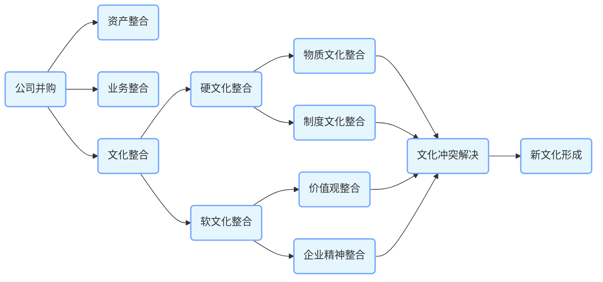

# 彼得林奇对公司并购后文化整合的评估

> 关键词：彼得林奇；公司并购；文化整合评估；企业文化；并购绩效

> 摘要：本文聚焦于彼得林奇对公司并购后文化整合的评估这一主题。深入探讨了在公司并购活动中文化整合的重要性，介绍了彼得林奇在评估文化整合方面的独特视角和方法。通过对核心概念的剖析、相关算法原理的阐述、数学模型的构建，结合实际项目案例，分析了如何准确评估公司并购后的文化整合情况。同时探讨了其在实际应用场景中的作用，推荐了相关学习资源、开发工具和研究论文，最后总结了未来公司并购文化整合评估的发展趋势与挑战。

## 1. 背景介绍 
### 1.1 目的和范围
公司并购是企业实现快速扩张、资源优化配置的重要战略手段。然而，大量研究表明，许多并购案例未能达到预期效果，其中一个关键因素就是并购后文化整合的失败。彼得林奇作为投资界的传奇人物，他对公司并购后文化整合的评估有着独特且深刻的见解。本文旨在深入研究彼得林奇的评估方法和理念，探讨如何运用这些方法更准确地评估公司并购后文化整合的状况，范围涵盖文化整合评估的理论基础、评估方法、实际应用以及未来发展等方面。

### 1.2 预期读者
本文预期读者包括企业管理者、投资者、金融分析师、学术研究人员以及对公司并购和企业文化感兴趣的人士。企业管理者可以从中获取有关并购后文化整合评估的方法和策略，以提高并购的成功率；投资者和金融分析师可以借助这些评估方法更好地判断并购项目的投资价值；学术研究人员可以将其作为研究公司并购和企业文化的参考资料。

### 1.3 文档结构概述
本文首先介绍核心概念，阐述公司并购、企业文化和文化整合的定义以及它们之间的联系。接着讲解彼得林奇评估文化整合的核心算法原理和具体操作步骤，并给出相应的 Python 代码示例。然后构建数学模型，用公式详细说明评估过程，并举例进行说明。通过实际项目案例，展示如何运用这些方法进行文化整合评估。探讨其在不同实际应用场景中的作用，推荐相关的学习资源、开发工具和研究论文。最后总结未来发展趋势与挑战，并解答常见问题，提供扩展阅读和参考资料。

### 1.4 术语表
#### 1.4.1 核心术语定义
- **公司并购**：指一家公司通过购买另一家公司的股权或资产，从而获得对该公司的控制权或实现两家公司的合并。
- **企业文化**：企业在长期经营过程中形成的价值观、信念、行为准则、经营理念等的总和，它影响着企业员工的行为和决策。
- **文化整合**：在公司并购后，将两个或多个不同的企业文化融合为一个统一的、适应新企业发展的文化的过程。
- **文化冲突**：在文化整合过程中，由于不同企业文化的差异而产生的矛盾和对立。

#### 1.4.2 相关概念解释
- **硬文化**：包括企业的物质文化、制度文化等，如企业的办公环境、规章制度等，具有较强的可见性和规范性。
- **软文化**：主要指企业的价值观、企业精神等，是企业文化的核心部分，对员工的行为和态度有着潜移默化的影响。
- **文化适应性**：指员工对新企业文化的接受程度和适应能力。

#### 1.4.3 缩略词列表
- **M&A**：Merger & Acquisition，即公司并购。

## 2. 核心概念与联系 
### 核心概念原理
公司并购是企业战略发展的重要举措，旨在实现资源共享、协同效应和规模经济。然而，并购不仅仅是资产和业务的整合，更重要的是企业文化的整合。企业文化是企业的灵魂，它决定了企业的运营方式、员工的行为模式和企业的发展方向。当两家公司进行并购时，不同的企业文化可能会产生冲突，如价值观的差异、管理风格的不同等。如果这些文化冲突不能得到有效解决，将导致员工士气低落、工作效率下降、人才流失等问题，最终影响并购的绩效。

文化整合的过程就是要化解这些文化冲突，形成一种新的、统一的企业文化。彼得林奇认为，评估公司并购后文化整合的情况对于判断并购的成败至关重要。他强调要关注企业文化的各个方面，包括员工的态度、价值观、工作氛围等，通过综合评估来判断文化整合的效果。

### 架构的文本示意图
```plaintext
公司并购
|
|-- 资产整合
|-- 业务整合
|-- 文化整合
    |
    |-- 硬文化整合（物质文化、制度文化）
    |-- 软文化整合（价值观、企业精神）
    |
    |-- 文化冲突解决
    |-- 新文化形成
```

### Mermaid 流程图


## 3. 核心算法原理 & 具体操作步骤 
### 核心算法原理
彼得林奇评估公司并购后文化整合的核心算法基于对多个文化指标的综合评估。这些指标包括员工满意度、员工流动率、团队协作效率、创新能力等。通过对这些指标的量化分析，可以得到一个文化整合指数，用于衡量文化整合的效果。

具体来说，首先为每个指标设定一个权重，权重的大小根据该指标对文化整合的重要性来确定。然后收集每个指标的数据，对数据进行标准化处理，以消除不同指标之间的量纲差异。最后，将标准化后的数据乘以相应的权重并求和，得到文化整合指数。

### 具体操作步骤
1. **确定评估指标和权重**：根据彼得林奇的理念和企业的实际情况，确定评估文化整合的指标，如员工满意度、员工流动率、团队协作效率、创新能力等。为每个指标设定一个权重，权重之和为 1。
2. **数据收集**：通过问卷调查、员工访谈、绩效评估等方式收集每个指标的数据。
3. **数据标准化**：对收集到的数据进行标准化处理，常用的方法有 Z-score 标准化、Min-Max 标准化等。
4. **计算文化整合指数**：将标准化后的数据乘以相应的权重并求和，得到文化整合指数。

### Python 代码实现
```python
import numpy as np

# 定义评估指标和权重
indicators = ['员工满意度', '员工流动率', '团队协作效率', '创新能力']
weights = np.array([0.3, 0.2, 0.3, 0.2])

# 收集数据
data = np.array([0.8, 0.1, 0.7, 0.6])

# 数据标准化（使用 Min-Max 标准化）
def min_max_normalize(data):
    min_val = np.min(data)
    max_val = np.max(data)
    return (data - min_val) / (max_val - min_val)

normalized_data = min_max_normalize(data)

# 计算文化整合指数
integration_index = np.dot(normalized_data, weights)

print(f"文化整合指数: {integration_index}")
```

## 4. 数学模型和公式 & 详细讲解 & 举例说明 
### 数学模型和公式
设评估指标有 $n$ 个，分别为 $x_1, x_2, \cdots, x_n$，对应的权重为 $w_1, w_2, \cdots, w_n$，且 $\sum_{i=1}^{n} w_i = 1$。标准化后的数据为 $\hat{x}_1, \hat{x}_2, \cdots, \hat{x}_n$。则文化整合指数 $I$ 的计算公式为：

$$I = \sum_{i=1}^{n} w_i \hat{x}_i$$

### 详细讲解
- 评估指标 $x_i$ 可以是各种能够反映文化整合情况的量化数据，如员工满意度得分、员工流动率、团队协作效率指标等。
- 权重 $w_i$ 表示每个指标在评估中的重要程度，权重的确定需要根据企业的实际情况和战略目标进行综合考虑。
- 标准化处理的目的是为了消除不同指标之间的量纲差异，使它们具有可比性。常见的标准化方法有 Z-score 标准化和 Min-Max 标准化。
- 文化整合指数 $I$ 的取值范围为 $[0, 1]$，值越接近 1 表示文化整合效果越好，值越接近 0 表示文化整合效果越差。

### 举例说明
假设某公司并购后进行文化整合评估，确定了三个评估指标：员工满意度、团队协作效率和创新能力，对应的权重分别为 $w_1 = 0.4$，$w_2 = 0.3$，$w_3 = 0.3$。收集到的数据分别为 $x_1 = 80$（满分 100 分），$x_2 = 0.7$，$x_3 = 60$（满分 100 分）。

首先进行数据标准化处理，使用 Min-Max 标准化：
- 对于员工满意度 $x_1$，最小值为 0，最大值为 100，则 $\hat{x}_1 = \frac{80 - 0}{100 - 0} = 0.8$。
- 对于团队协作效率 $x_2$，最小值为 0，最大值为 1，则 $\hat{x}_2 = \frac{0.7 - 0}{1 - 0} = 0.7$。
- 对于创新能力 $x_3$，最小值为 0，最大值为 100，则 $\hat{x}_3 = \frac{60 - 0}{100 - 0} = 0.6$。

然后计算文化整合指数：
$$I = w_1 \hat{x}_1 + w_2 \hat{x}_2 + w_3 \hat{x}_3 = 0.4 \times 0.8 + 0.3 \times 0.7 + 0.3 \times 0.6 = 0.71$$

这表明该公司并购后的文化整合效果较好，但仍有提升空间。

## 5. 项目实战：代码实际案例和详细解释说明 
### 5.1  开发环境搭建
为了实现彼得林奇对公司并购后文化整合的评估，我们需要搭建一个 Python 开发环境。以下是具体步骤：
1. **安装 Python**：从 Python 官方网站（https://www.python.org/downloads/）下载并安装 Python 3.x 版本。
2. **安装必要的库**：使用 pip 安装 numpy 库，用于数值计算。在命令行中输入以下命令：
```sh
pip install numpy
```

### 5.2  源代码详细实现和代码解读
```python
import numpy as np

# 定义评估指标和权重
indicators = ['员工满意度', '员工流动率', '团队协作效率', '创新能力']
weights = np.array([0.3, 0.2, 0.3, 0.2])

# 模拟收集数据
def collect_data():
    # 这里可以根据实际情况从数据库、文件或 API 中获取数据
    # 为了示例，我们随机生成数据
    data = np.random.rand(len(indicators))
    return data

data = collect_data()

# 数据标准化（使用 Min-Max 标准化）
def min_max_normalize(data):
    min_val = np.min(data)
    max_val = np.max(data)
    return (data - min_val) / (max_val - min_val)

normalized_data = min_max_normalize(data)

# 计算文化整合指数
integration_index = np.dot(normalized_data, weights)

# 输出结果
print("评估指标:", indicators)
print("权重:", weights)
print("原始数据:", data)
print("标准化后的数据:", normalized_data)
print(f"文化整合指数: {integration_index}")
```

### 代码解读与分析
1. **导入必要的库**：导入 numpy 库，用于数值计算。
2. **定义评估指标和权重**：定义了四个评估指标和对应的权重。
3. **数据收集**：使用 `collect_data` 函数模拟收集数据，实际应用中可以从数据库、文件或 API 中获取数据。
4. **数据标准化**：使用 `min_max_normalize` 函数对数据进行 Min-Max 标准化处理。
5. **计算文化整合指数**：使用 `np.dot` 函数计算标准化后的数据与权重的点积，得到文化整合指数。
6. **输出结果**：打印评估指标、权重、原始数据、标准化后的数据和文化整合指数。

通过这个代码示例，我们可以看到如何使用 Python 实现彼得林奇对公司并购后文化整合的评估。在实际应用中，可以根据具体需求调整评估指标和权重，以及数据收集的方式。

## 6. 实际应用场景 
### 企业管理者决策
企业管理者在进行公司并购决策时，可以运用彼得林奇的文化整合评估方法，提前评估并购双方的文化差异和文化整合的难度。在并购过程中，通过定期评估文化整合指数，及时发现文化整合过程中存在的问题，并采取相应的措施进行调整。例如，如果发现员工满意度指标下降，说明可能存在文化冲突，需要加强沟通和培训，提高员工对新文化的认同感。

### 投资者评估
投资者在评估并购项目的投资价值时，可以将文化整合评估作为一个重要的参考因素。一个文化整合效果好的并购项目，通常能够实现更好的协同效应，提高企业的竞争力和盈利能力。通过分析文化整合指数，投资者可以判断并购项目的风险和收益，做出更明智的投资决策。

### 学术研究
学术研究人员可以将彼得林奇的文化整合评估方法作为研究公司并购和企业文化的一个切入点。通过对大量并购案例的实证研究，深入探讨文化整合对并购绩效的影响机制，为企业并购和文化管理提供理论支持和实践指导。

## 7. 工具和资源推荐
### 7.1 学习资源推荐
#### 7.1.1 书籍推荐
- 《彼得林奇的成功投资》：彼得林奇的经典著作，介绍了他的投资理念和方法，其中包含了对公司基本面分析的内容，对理解公司并购和文化整合有一定的帮助。
- 《企业文化与经营业绩》：这本书深入探讨了企业文化与企业经营业绩之间的关系，为文化整合评估提供了理论基础。
- 《并购的艺术》：详细介绍了公司并购的各个环节，包括文化整合，对企业管理者和投资者有很大的参考价值。

#### 7.1.2 在线课程
- Coursera 上的“Corporate Finance”（公司金融）课程：涵盖了公司并购的相关知识，包括并购策略、估值方法和文化整合等内容。
- edX 上的“Business Strategy”（商业战略）课程：讲解了企业战略规划和实施，其中包括公司并购战略和文化管理的相关知识。

#### 7.1.3 技术博客和网站
- Seeking Alpha：一个提供金融分析和投资建议的网站，有很多关于公司并购和文化整合的文章和分析。
- Harvard Business Review（哈佛商业评论）：发表了许多关于企业管理和战略的研究成果，其中不乏关于公司并购和文化整合的高质量文章。

### 7.2 开发工具框架推荐
#### 7.2.1 IDE和编辑器
- PyCharm：一款专业的 Python 集成开发环境，提供了丰富的代码编辑、调试和项目管理功能，适合开发 Python 程序。
- Jupyter Notebook：一个交互式的开发环境，支持 Python 代码的编写、运行和可视化，方便进行数据分析和模型验证。

#### 7.2.2 调试和性能分析工具
- pdb：Python 内置的调试器，可以帮助开发者定位代码中的问题。
- cProfile：Python 标准库中的性能分析工具，可以分析代码的运行时间和函数调用情况，帮助优化代码性能。

#### 7.2.3 相关框架和库
- numpy：用于数值计算和数组操作，是 Python 数据分析和科学计算的基础库。
- pandas：用于数据处理和分析，提供了高效的数据结构和数据操作方法。
- matplotlib：用于数据可视化，能够绘制各种类型的图表，帮助直观地展示数据和分析结果。

### 7.3 相关论文著作推荐
#### 7.3.1 经典论文
- “Culture clash: The clash of cultures in mergers and acquisitions”：探讨了公司并购中文化冲突的原因和影响，提出了一些解决文化冲突的方法。
- “The role of culture in mergers and acquisitions”：分析了企业文化在并购中的作用，强调了文化整合对并购成功的重要性。

#### 7.3.2 最新研究成果
- 可以通过 Google Scholar、IEEE Xplore、ACM Digital Library 等学术数据库搜索关于公司并购和文化整合的最新研究成果。关注一些知名学术期刊，如《Journal of Management》、《Strategic Management Journal》等。

#### 7.3.3 应用案例分析
- 一些商业咨询公司和研究机构会发布公司并购的案例分析报告，如 McKinsey & Company、Boston Consulting Group 等。这些报告可以帮助我们了解实际案例中文化整合的过程和效果。

## 8. 总结：未来发展趋势与挑战
### 未来发展趋势
- **数字化评估**：随着信息技术的发展，未来公司并购后文化整合的评估将更加数字化。利用大数据、人工智能等技术，可以更全面、准确地收集和分析文化整合相关的数据，提高评估的效率和准确性。
- **跨文化整合**：随着全球化的加速，跨国并购越来越频繁。未来的文化整合评估将更加注重跨文化因素的考虑，如何在不同文化背景下实现有效的文化整合将成为研究的热点。
- **动态评估**：文化整合是一个动态的过程，未来的评估方法将更加注重对文化整合过程的动态监测和评估。通过实时跟踪文化整合指数的变化，及时调整文化整合策略。

### 挑战
- **文化难以量化**：企业文化是一种抽象的概念，很多文化因素难以用具体的指标进行量化。如何准确地定义和测量文化指标，是文化整合评估面临的一个重要挑战。
- **数据获取困难**：文化整合评估需要大量的数据支持，但在实际操作中，数据的获取可能存在困难。例如，员工的真实态度和想法可能难以通过问卷调查等方式准确获取。
- **文化差异的复杂性**：不同企业的文化差异可能非常复杂，涉及到价值观、信仰、行为习惯等多个方面。如何有效地处理这些文化差异，实现文化的融合，是文化整合评估和实践中的一大挑战。

## 9. 附录：常见问题与解答
### 问题 1：如何确定评估指标的权重？
答：评估指标的权重确定需要综合考虑多个因素，包括企业的战略目标、行业特点、并购双方的文化差异等。可以采用专家打分法、层次分析法等方法来确定权重。例如，对于一个注重创新的企业，创新能力指标的权重可以适当提高。

### 问题 2：文化整合指数的取值范围有什么实际意义？
答：文化整合指数的取值范围为 $[0, 1]$。值越接近 1 表示文化整合效果越好，说明并购双方的文化已经较好地融合，员工对新文化的认同感较高，企业的运营效率和绩效可能会得到提升。值越接近 0 表示文化整合效果越差，可能存在严重的文化冲突，需要采取措施进行调整。

### 问题 3：除了问卷调查，还有哪些方法可以收集文化整合相关的数据？
答：除了问卷调查，还可以通过员工访谈、绩效评估、观察法等方式收集数据。员工访谈可以深入了解员工的想法和感受；绩效评估可以反映员工的工作表现和团队协作情况；观察法可以直接观察企业的工作氛围和员工的行为模式。

## 10. 扩展阅读 & 参考资料
### 扩展阅读
- 《竞争战略》：作者迈克尔·波特，介绍了企业竞争战略的基本理论和方法，对理解公司并购的战略意义有一定的帮助。
- 《组织行为学》：探讨了组织中个体和群体的行为规律，有助于深入理解企业文化对员工行为的影响。

### 参考资料
- 彼得林奇. 《彼得林奇的成功投资》. 机械工业出版社.
- 约翰·科特，詹姆斯·赫斯克特. 《企业文化与经营业绩》. 华夏出版社.
- 菲利普·米尔维斯，马克·布洛克. 《并购的艺术》. 中国人民大学出版社.

作者：AI天才研究院/AI Genius Institute & 禅与计算机程序设计艺术 /Zen And The Art of Computer Programming